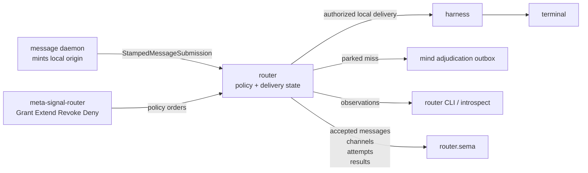
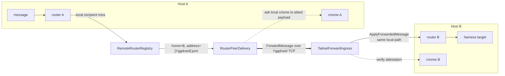
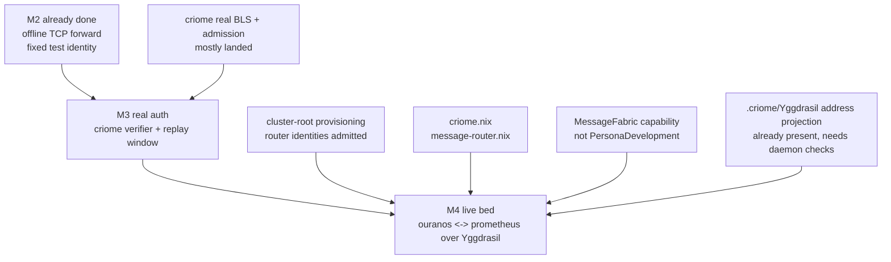
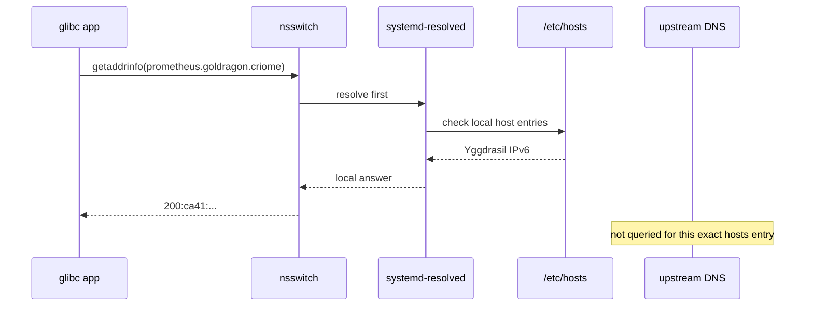
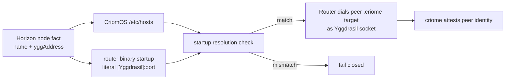
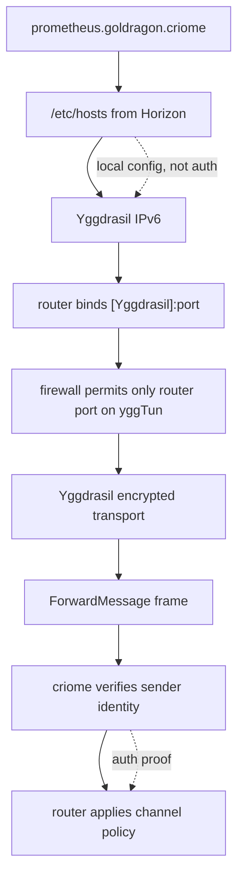

# 123 - Router vision: Yggdrasil fabric, .criome names, and the unfinished networking track

## Frame

This report answers the current system-designer question:

- What is Router trying to become?
- What is already proven?
- What components are still not done, especially networking?
- If CriomOS resolves `<node>.<cluster>.criome` from host-file data to Yggdrasil addresses, and daemons are bound/firewalled to Yggdrasil, does that make `.criome` secure as far as Yggdrasil is secure?

Short answer: **yes, for the Router component specifically, if Router's startup path owns and tests the resolution/configuration invariant.** CriomOS generates `.criome` host entries from Horizon into `/etc/hosts`; current `systemd-resolved`/NSS behavior answers `/etc/hosts` names locally rather than routing them to network DNS; and the generated entries on this host point `.criome` names at Yggdrasil addresses. Because Router is our component, not an arbitrary process, we can constrain it to resolve or consume those names through the known CriomOS path, assert that the result is the expected Yggdrasil address, bind only there, and fail closed otherwise.

That gives a provably trustworthy **network connection target**: `<node>.<cluster>.criome` resolves, for Router, to the intended Yggdrasil host address. A service-scoped alias can make this cleaner: `router.<node>.<cluster>.criome` resolves to the same Yggdrasil address, while the Router startup config attaches the Router port and lowers the endpoint to a literal `[ygg-address]:port`. It is still a different proof than **message peer identity**. The production daemon config should carry the resolved Horizon/Yggdrasil socket address plus `RemoteRouterIdentity`, and criome must authenticate the peer identity inside the forwarded frame. `.criome` proves where Router dials; criome proves who spoke.

## Router vision

Router is the message fabric for Persona engines. It owns:

- local message acceptance, channel authorization, parking, delivery attempts, and delivery status;
- durable router-owned state in `router.sema`;
- the local Unix working socket and the separate meta-policy socket;
- cross-host router-to-router forwarding, once the live track lands.

Router does not own:

- message ingress identity minting from `SO_PEERCRED`;
- terminal byte transport;
- harness execution;
- criome keys or BLS verification;
- operating system network provisioning;
- public contract crates outside `signal-router` / `meta-signal-router`.

The core shape is still the right one:



Cross-host Router is not a second policy system. It is the same policy system with another delivery leg:



The intended split is:

- **Yggdrasil encrypts and routes bytes.**
- **Router transports typed routing facts and owns delivery state.**
- **Criome authenticates the sending router identity.**
- **Mirror moves versioned object/log bytes.**
- **Spirit records intent and ships mirror notices through the fabric.**

## Current state

Router has already crossed the hard conceptual line from Unix-only to network-capable:

| Layer | Current state |
|---|---|
| Local routing | Built: channel table, parking, adjudication outbox, delivery attempts, observation plane, `router.sema` tables. |
| Network contract | Built in `signal-router`: `ForwardMessage`, `ForwardAccepted`, `ForwardRefused`, `RemoteRouterIdentity`, `TailnetAddress`, `RegisterRemoteRouter`, `RegisterActor.home`, `ForwardMarker`, `ForwardedRemote`. |
| Network daemon path | Built in `router`: `RemoteRouterRegistry`, `RouterPeerDelivery`, `TailnetForwardIngress`, eager TCP bind in `RouterRuntime::on_start`, `ApplyForwardedMessage`. |
| Proof | Built: two in-process routers forward over loopback TCP with fixed offline identity; trace reports `ForwardedRemote`; receiver delivers locally. |
| Full offline chain | Proven in report 673: spirit -> mirror A -> router A/B -> mirror B restore to announced head. |
| Real cross-host auth | Not done: m3 needs real criome attestation and router replay/freshness state. |
| Live deploy | Not done: criome and message-router NixOS modules, `MessageFabric` capability, Yggdrasil bind, peer bootstrap, cluster-root provisioning. |

## What remains

The unfinished Router track is not "invent networking." It is smaller and sharper:



### M3 - real criome attestation

The m2 `AcceptFixedTestIdentity` verifier must become a real criome client:

- outbound Router asks local criome to sign/attest the exact forwarded payload digest;
- inbound Router asks local criome to verify the attestation against the recomputed payload digest;
- Router stamps the **criome-verified identity**, not a wire-claimed sender;
- invalid signer, invalid signature, revoked identity, and expired attestation map to typed `RouterForwardRefusalReason`.

Implementation risk: the current verifier seam is synchronous, while a criome Unix-socket round trip is async. The clean shape is an async trait or boxed future trait; fallback is to keep the pure mapping synchronous and do criome I/O in the ingress task.

### M3 - router-owned replay and freshness

Criome can prove a payload was signed. That alone does not prevent replay of the same valid frame. Router needs its own durable seen-window:

- reject `issued_at` outside a configured skew tolerance;
- reject duplicate `(signer, nonce)`;
- persist seen nonces in a new `router-forward-replay` SEMA family;
- rebuild the in-memory replay index on restart;
- evict old entries once outside the freshness window.

This must land with real attestation, not later.

### M4 - live deploy

The live bed needs:

- `criome.nix`: system service, socket, store, binary startup config, key material custody;
- `message-router.nix`: system service, Unix sockets, `router.sema`, Yggdrasil TCP bind, peer bootstrap;
- a `MessageFabric` style Horizon capability, so prometheus can host the fabric without becoming a `PersonaDevelopment` node;
- cluster-root provisioning ceremony that admits each node/router identity;
- mirror's current Tailscale bind reconciled toward Yggdrasil if the full chain is meant to be one daemon fabric.

## Networking candidates

The recommendation remains: **use Yggdrasil plus plain length-prefixed TCP for the first live Router fabric.** It is already deployed cluster-wide, exposes stable IPv6 addresses from node keys, and fits Router's existing m2 implementation.

Other candidates are useful as future pressure valves, not as the immediate bed.

| Candidate | What it gives | Fit for Router now | Verdict |
|---|---|---|---|
| Yggdrasil + TCP | Encrypted IPv6 overlay, stable node addresses, already in CriomOS, ordinary socket API. | Excellent. Matches existing m2 code and `.criome` host projection. | Use now. |
| WireGuard | Stable private L3 overlay, mature kernel implementation. | Good for fixed peer sets, but CriomOS currently uses Yggdrasil more canonically for generated `.criome` host entries. | Keep as alternate substrate, not first live Router. |
| Tailscale / Headscale | Operationally convenient admin overlay. | Existing mirror module uses it, but enrollment and address projection are less canonical in current CriomOS. | Keep for human/admin overlay; do not make it daemon fabric. |
| Quinn / QUIC | Multiplexed encrypted streams, no head-of-line blocking, good Rust support. | Useful if Router later needs long-lived multiplexed sessions or Internet-facing transport. Duplicates encryption already provided by Yggdrasil for the first bed. | Future transport backend, not m4. |
| Iroh | Key-dialed QUIC, relays, NAT traversal, endpoint identity, P2P ergonomics. | Attractive once Router must cross arbitrary NATs or leave the controlled Yggdrasil fabric. It adds discovery/relay assumptions that are unnecessary on CriomOS. | Research branch later. |
| libp2p | Full modular P2P stack: transports, discovery, relay, protocol negotiation. | Too broad for the first fabric; overlaps with Router/criome/domain-criome concepts. | Avoid until there is a specific multi-protocol P2P need. |
| domain-criome | Native domain registry and intelligent resolution. | Architecturally relevant, but not built enough to carry live Router addressing yet. | Future authority layer; do not block m4 on it. |

Research notes:

- Yggdrasil's own documentation describes end-to-end encrypted IPv6 routing and calls out that it is still a public network, so exposed services still need firewall care.
- Iroh is interesting because it dials by endpoint identity, handles direct connections and relays, and all connections are QUIC/TLS encrypted. That overlaps with what Router plus criome plus Yggdrasil already model separately.
- Quinn is the lower-level Rust QUIC option if we want transport improvement without Iroh's discovery/relay layer.

## The `.criome` security question

### What CriomOS currently does

CriomOS derives `<node>.<cluster>.criome` in Horizon. The relevant code paths are:

- `horizon-rs/lib/src/name.rs`: `CriomeDomainName::for_node` renders `<node>.<cluster>.criome`.
- `CriomOS/modules/nixos/network/default.nix`: generates `networking.hosts` for the current node plus `horizon.exNodes`.
- If a node has `yggAddress`, that Yggdrasil address gets the primary `.criome` aliases.
- If a node lacks `yggAddress`, node IP is used instead.
- `nix.<node>.<cluster>.criome` aliases attach to nix-cache nodes.

On this host, `/etc/hosts` currently contains:

```text
200:ca41:6b12:fba:d7bc:cfc6:4aaa:165f prometheus.goldragon.criome nix.prometheus.goldragon.criome
201:6de1:5500:7cac:2db9:759e:42d2:fb1d ouranos.goldragon.criome
```

Current `/etc/nsswitch.conf` has:

```text
hosts: mymachines resolve [!UNAVAIL=return] files myhostname dns
```

That looks surprising because `files` is after `resolve`, but `nss-resolve` explicitly recommends this ordering because `systemd-resolved` itself supports `/etc/hosts` with caching. The `systemd-resolved` manual says `/etc/hosts` addresses are answered immediately and not routed to the network.

So for normal glibc clients using `getaddrinfo` or `getent hosts`, exact `.criome` names should resolve to the local generated Yggdrasil entries, not to outside DNS.



### What this guarantees

It gives a strong **local configuration guarantee**:

- `.criome` exact FQDN -> Horizon-projected address;
- if `yggAddress` exists, that address is the primary answer;
- ordinary system resolver clients do not ask public DNS for that exact name;
- binding Router to that Yggdrasil address keeps the daemon on the Yggdrasil fabric.

If the service is also bound only to the Yggdrasil address and firewall policy only permits the Router port on `yggTun`, then network reachability is reduced to:

- correctness of the generated Horizon host map;
- integrity of `/etc/hosts` and the local resolver path;
- Yggdrasil's encryption/routing guarantees;
- firewall enforcement;
- host compromise risk.

### Router-specific strengthening

For arbitrary software, the conservative warning is "some custom DNS client may bypass NSS." For Router, that is not the right final model. Router's behavior is authored by us, so the `.criome` binding can become an explicit startup invariant:

1. Router startup receives a peer manifest from Horizon/CriomOS: peer name, `.criome` FQDN, expected Yggdrasil socket address, and `RemoteRouterIdentity`.
2. The config writer resolves the `.criome` FQDN through the CriomOS resolver path, or reads the already-projected `yggAddress`. For the Router service endpoint, that FQDN can be `router.<node>.<cluster>.criome`, an alias to the node's Yggdrasil address.
3. It writes the literal bracketed Yggdrasil socket address into the binary startup archive.
4. Router startup verifies the configured address is Yggdrasil-range and, where a name is also present, that name resolution still matches the configured literal address.
5. Router binds/dials only the Yggdrasil address and fails closed on mismatch.

That is a testable theorem about this component:



Under that shape, the network-connection guarantee is not "DNS happened to do the right thing." It is "Router accepts only the Horizon-projected `.criome` -> Yggdrasil binding, checked at startup and fixed into its binary config."

### Service-scoped Router name

`router.<node>.<cluster>.criome` is a good live-fabric endpoint name. It separates the host identity from the service endpoint without requiring a new address family:

- `<node>.<cluster>.criome` remains the node's primary Yggdrasil host name.
- `router.<node>.<cluster>.criome` aliases to that same Yggdrasil address.
- Router's port is not part of `/etc/hosts`; the config writer supplies the port and lowers the service endpoint to `[<ygg-address>]:<router-port>`.
- The binary startup archive carries both the audited name and the literal socket address.
- Startup fails if the audited name no longer resolves to the literal address.

That gives us a readable operator surface (`router.prometheus.goldragon.criome`) and a deterministic daemon surface (`[200:...]:7475`). If later `domain-criome` owns richer service resolution, it can replace the hosts alias with first-class service records; the Router invariant stays the same.

### What this still does not guarantee

It still does not by itself prove message peer identity to Router.

Cases outside the guarantee:

- Router is changed to bypass the tested CriomOS/Horizon path and do raw DNS without the invariant check;
- Router is changed to accept a runtime-resolved address without comparing it to the projected Yggdrasil address;
- `/etc/hosts` or Horizon projection is wrong;
- root or a compromised deployment path mutates host entries;
- the daemon binds `0.0.0.0`, `::`, or a non-Yggdrasil address;
- the firewall trusts the whole Yggdrasil interface rather than only the service port;
- the remote peer reaches the Yggdrasil address but is not the intended criome identity.

One current CriomOS point matters: `network/yggdrasil.nix` sets `networking.firewall.trustedInterfaces = [ "yggTun" ]`. That is broad. It means Yggdrasil packets are generally trusted by the host firewall. For Router m4, the stronger posture is a module-owned rule for the Router TCP port on `yggTun`, plus a daemon bind to the node's exact Yggdrasil address.



### Recommendation

Use `.criome` in four ways:

1. **Human/operator address:** `ssh root@prometheus.goldragon.criome`, logs, reports, deployment manifests.
2. **Service endpoint address:** `router.prometheus.goldragon.criome` names prometheus's Router service on the Yggdrasil fabric; the port still comes from Router config.
3. **Bootstrap projection input:** Nix/Horizon resolves `.criome` names into generated config.
4. **Router startup invariant:** Router's config writer/startup check verifies `.criome` resolves to the expected Yggdrasil socket address and fails closed on mismatch.
5. **Runtime sanity check:** Router may resolve `.criome` for diagnostics, but should keep dialing the literal Horizon-projected Yggdrasil address in its binary startup config.

Do not make open-ended runtime DNS lookup the authority. Make the **checked `.criome` binding** part of Router's startup contract. In Router's binary `RouterBootstrapDocument`, carry:

- `RemoteRouterIdentity` as the stable peer identity;
- `TailnetAddress` as the literal bracketed Yggdrasil socket address;
- optionally the peer `.criome` FQDN as the audited name whose resolution must match;
- the peer actor home table via `RegisterActor.home`;
- the criome socket path for local verification.

Then `.criome` can be considered secure enough as Router's configured network target layer, while actual message acceptance remains secured by criome and replay protection.

## Candidate implementation path

### Slice 1 - tighten the live fabric contract

- Rename or document `tailnet_*` fields as fabric-neutral but currently Yggdrasil-backed.
- Add a `MessageFabric` service capability in Horizon/CriomOS.
- Generate `message-router.nix` config from Horizon:
  - bind address: current node `yggAddress`;
  - remote peers: `exNodes[*].yggAddress`;
  - router identity: cluster-root-admitted identity name;
  - peer actor homes: initial static table.

### Slice 2 - daemon hardening before live bind

- Build `CriomeForwardAttestation` or its async equivalent.
- Add `router-forward-replay` SEMA family and schema version bump.
- Add tests for replay, stale timestamp, tamper, unadmitted signer, and restart survival.
- Refuse malformed network frames at connection level rather than inventing a contract variant unless a real peer needs typed malformed-frame replies.

### Slice 3 - CriomOS service modules

- `criome.nix`: service user, store, socket, binary startup config, cluster-root public key, key material policy.
- `message-router.nix`: service user, store, Unix sockets, Yggdrasil TCP bind, peer bootstrap, local criome socket.
- Avoid `PersonaDevelopment` as the gate. Use `MessageFabric`.

### Slice 4 - live two-node proof

- ouranos and prometheus both run criome and message-router.
- each router has the other's `RemoteRouterIdentity -> Yggdrasil socket` manifest.
- each criome registry admits the peer router identity through the cluster root.
- submit on ouranos for a prometheus-local actor.
- assert:
  - ouranos trace says `ForwardedRemote`;
  - prometheus local harness receives it;
  - replayed frame is `ReplayDetected`;
  - wrong signer is `AttestationInvalid`;
  - `.criome` name resolves to the expected Yggdrasil address on both nodes.

## Open questions for psyche

1. Confirm Yggdrasil as the daemon fabric, with Tailscale remaining the human/admin overlay.
2. Confirm `MessageFabric` as its own service capability, instead of using `PersonaDevelopment`.
3. Confirm that Router daemon config should carry literal Yggdrasil socket addresses, with `.criome` as a generated/operator name rather than runtime authority.
4. Decide whether m4 should also move mirror from the current Tailscale bind to Yggdrasil so the whole first live chain uses one fabric.
5. Decide whether to build the cluster-root ceremony CLI now, or keep m4 blocked until the larger key-custody track resumes.

## Sources

Local workspace:

- `/git/github.com/LiGoldragon/router/INTENT.md`
- `/git/github.com/LiGoldragon/router/ARCHITECTURE.md`
- `/git/github.com/LiGoldragon/router/tests/end_to_end_remote_forward.rs`
- `/git/github.com/LiGoldragon/signal-router/schema/lib.schema`
- `/git/github.com/LiGoldragon/CriomOS/modules/nixos/network/default.nix`
- `/git/github.com/LiGoldragon/CriomOS/modules/nixos/network/resolver.nix`
- `/git/github.com/LiGoldragon/CriomOS/modules/nixos/network/yggdrasil.nix`
- `/git/github.com/LiGoldragon/CriomOS/modules/nixos/mirror.nix`
- `/git/github.com/LiGoldragon/horizon-rs/lib/src/name.rs`
- `reports/system-designer/120-networking-through-the-router-2026-06-16.md`
- `reports/designer/669-first-e2e-offline-build/4-router-m3-deploy-plan.md`
- `reports/designer/673-offline-first-e2e-proven-capstone.md`
- live probes on this host: `/etc/hosts`, `/etc/nsswitch.conf`

External references:

- Yggdrasil overview: https://yggdrasil-network.github.io/
- Yggdrasil FAQ, safety/firewall caveats: https://yggdrasil-network.github.io/faq.html
- Linux `nsswitch.conf` manual: https://man7.org/linux/man-pages/man5/nsswitch.conf.5.html
- `nss-resolve` manual: https://man7.org/linux/man-pages/man8/nss-resolve.8.html
- `systemd-resolved` manual: https://man.archlinux.org/man/systemd-resolved.8
- Iroh docs: https://docs.iroh.computer/what-is-iroh
- Iroh FAQ: https://docs.iroh.computer/about/faq
- Quinn docs: https://docs.rs/quinn/latest/quinn/
