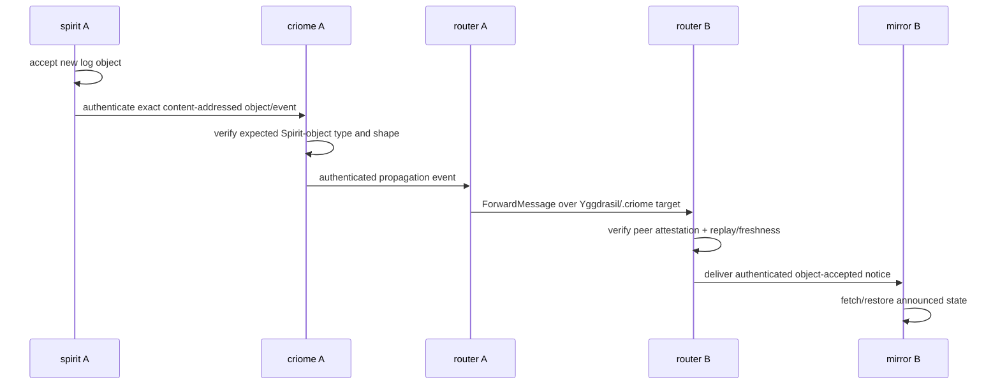
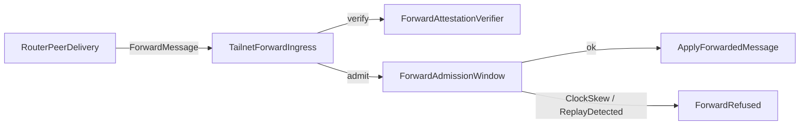

# 125 - Router m3 worker: spirit-vcs authenticated mirroring slice

Kind: Implementation / Design worker report
Topic: Router m3 replay/freshness scaffold for the spirit-vcs remote mirroring PoC
Date: 2026-06-17

## Psyche clarification captured

Spirit record `d6he` was clarified in place. The active milestone is now:



The local Spirit-to-criome trust boundary is structural. Router does not prove
that Spirit had local permission to ask criome to sign; Router consumes the
resulting authenticated propagation event and proves the router-to-router hop.

## Implemented Router slice

Changed repo: `/git/github.com/LiGoldragon/router`.

Files changed:

- `src/forward_attestation.rs`
- `src/router.rs`
- `tests/end_to_end_remote_forward.rs`
- `INTENT.md`
- `ARCHITECTURE.md`

Implemented:

- `ForwardAdmissionWindow`, a Router-owned admission state for forwarded frames.
- `ForwardAdmissionInstant`, an injectable timestamp wrapper for tests and live checks.
- Request/attestation nonce and timestamp equality check.
- Freshness check mapping to `RouterForwardRefusalReason::ClockSkew`.
- Replay check mapping to `RouterForwardRefusalReason::ReplayDetected`.
- Replay key is `(verified router identity, nonce)`, not wire-claimed identity.
- `TailnetForwardIngress` now runs the admission check after attestation verification and before `ApplyForwardedMessage`.
- Existing e2e remote-forward test now proves a repeated signed nonce is refused by the TCP ingress.

The current replay window is process-local memory. That is intentionally a
bounded m3 scaffold, not the final durable replay store.

## Verification

Ran in `/git/github.com/LiGoldragon/router`:

```sh
cargo fmt --check
cargo test forward_admission --lib
cargo test --test end_to_end_remote_forward
cargo clippy -- -D warnings
```

All passed.

## What I leaned on

The patch leans on the current `signal-router main#7331456f` contract already
having the needed closed refusal variants: `ReplayDetected`, `ClockSkew`,
`AttestationInvalid`, `RecipientUnknown`, `ChannelUnauthorized`,
`AlreadyForwarded`, and `UnknownPeer`.

It also leans on the existing m2 seam:



## What feels right

- Replay/freshness belongs in Router ingress, not in the root routing actor.
- Criome identity verification and Router replay admission are separate steps.
- The replay key must be the verified criome/router identity, not any sender field in the forwarded payload.
- First valid arrival consumes the nonce even if the recipient later parks in Router state; replay defense is ingress-level.

## What still needs clarification

1. Durable replay state: exact SEMA family name and record shape for `router-forward-replay`.
2. Freshness window: the live default is currently five minutes; confirm the intended skew tolerance.
3. Criome client boundary: whether `ForwardAttestationVerifier` itself becomes async, or whether `TailnetForwardIngress` owns criome socket I/O and keeps the verifier as the pure mapper.
4. Authenticated propagation contract: whether the production event lives in `signal-mirror`, `signal-spirit`, `signal-criome`, or a shared object-accepted contract.
5. Acceptance threshold: majority/time-threshold logic belongs to criome, but the exact event that Router should carry after threshold is still undefined.
6. Mirror action owner: mirror should likely own fetch/restore after authenticated notice delivery; Router should not fetch objects.
7. `.criome` deploy projection: Router architecture documents `router.<node>.<cluster>.criome`, but CriomOS/Horizon still needs the generator/config writer slice.

## Next candidate patches

1. Add durable `router-forward-replay` SEMA types and tests that replay rejection survives Router restart.
2. Add a `CriomeForwardAttestationClient` shell that is not wired live yet, so the sync/async seam can be tested explicitly.
3. Define the production mirror notice contract and replace the harness-local `MirrorObjectNotice`.
4. Add Router startup config fields for audited `.criome` service name plus literal Yggdrasil socket, then fail closed on mismatch.
