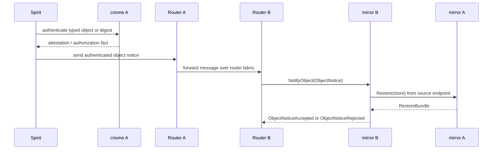
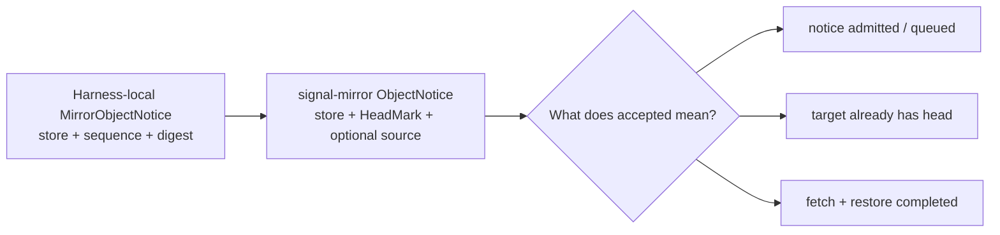

# 126 - Mirror notification worker: contract slice and auto-fetch questions

## Frame

The psyche clarified the spirit-vcs remote mirroring path as:

```text
Spirit accepts a new log object
-> local criome authenticates the typed Spirit object/digest
-> Router carries the authenticated event
-> remote mirror receives the notice
-> remote mirror fetches/restores
```

The previous offline e2e harness proved this causally with a local
`MirrorObjectNotice { store, head }` string carried as a Router message body.
This worker slice turns that seam into a typed `signal-mirror` contract object.
It does not yet make `mirror` auto-fetch because the runtime success semantics
need one more design decision.

## Implemented slice

Branch surface: `signal-mirror` branch `mirror-object-notice`, commit
`24ee1949` (`signal-mirror: add object notice contract`).

The ordinary mirror contract now has:

```text
Input:
  NotifyObject(ObjectNotice)

Output:
  ObjectNoticeAccepted(ObjectNoticeReceipt)
  ObjectNoticeRejected(ObjectNoticeRejection)

ObjectNotice:
  store: StoreName
  head: HeadMark
  source: Optional<MirrorAddress>
```

The `source` field is optional so the object covers both the current harness
shape, where the fetch source is known out of band, and the production shape,
where the remote mirror needs a source endpoint to fetch from.

Round-trip witnesses were added for:

- `NotifyObject(ObjectNotice)` request;
- `ObjectNoticeAccepted(ObjectNoticeReceipt)` reply;
- `ObjectNoticeRejected(ObjectNoticeRejection)` reply with every typed reason;
- rkyv length-prefixed frame round-trip;
- optional NOTA text round-trip.

Verification:

```text
cargo fmt --check
cargo test
```

Result: 16 tests passed in `signal-mirror`.

`nix flake check` is not available in this repo because `signal-mirror` has no
`flake.nix`.

## Shape





## Runtime question

The remaining ambiguity is the meaning of `ObjectNoticeAccepted`.

Three meanings are possible:

| Meaning | What mirror promises | Fit |
|---|---|---|
| Notice admitted | The notice decoded, named a registered store, and was queued or observed. | Smallest runtime patch, but weak: it does not prove mirroring. |
| Head already present | The target mirror already has the announced head. | Strong and simple, but rejects the normal useful case where the target is behind. |
| Fetch/restore completed | The target mirror fetched from `source`, imported the bundle, and now has the announced head. | Correct production meaning, but requires source endpoint policy and restore-import runtime. |

My lean: `ObjectNoticeAccepted` should mean **fetch/restore completed or the
announced head was already present**. Anything weaker needs a different reply
name such as `ObjectNoticeQueued`, otherwise the protocol can claim success
before the remote mirror is actually mirrored.

## Patch Plan

The next bounded implementation should be in `mirror`, after the
`signal-mirror` contract branch is integrated or pinned:

1. Import the new contract objects into `mirror/schema/nexus.schema` and
   `mirror/schema/sema.schema`.
2. Add `ReadInput::CheckObjectNotice(ObjectNotice)` and
   `ReadOutput::ObjectNoticeChecked(CheckedObjectNotice)`.
3. Add a Nexus `ObjectNoticeDecision` with variants for:
   `AlreadyPresent`, `FetchRequired`, and `RefuseNotice`.
4. If `source` is absent and the target is behind, return
   `ObjectNoticeRejected(SourceUnavailable)`.
5. If the target already has the announced head/digest, return
   `ObjectNoticeAccepted`.
6. For `FetchRequired`, call the existing mirror tailnet client with
   `Restore(store)`, import the returned checkpoint plus suffix, and then
   return `ObjectNoticeAccepted` only after the local durable write commits.
7. Add a daemon-level test where mirror B receives `NotifyObject` for a head on
   mirror A and ends with the exact announced head.

## Questions For Psyche

1. Should `ObjectNoticeAccepted` mean restored/present, not merely queued?
   My lean is yes.
2. Should the notice source be a raw `MirrorAddress` string for this cut, or a
   structured `.criome` service endpoint that lowers to a literal Yggdrasil
   socket in daemon startup?
   My lean is raw now, structured endpoint when Router m4 config lands.
3. Does criome authentication wrap the Router-carried message body only, or
   should the mirror notice itself carry the attestation envelope once `criome`
   is fully in the path?
   My lean is Router verifies the frame first, then mirror later receives a
   payload-level object attestation for defense in depth.

## Spirit Capture State

The existing intent records already cover the broad milestone:

- `d6he`: first end-to-end milestone is `spirit -> vcs -> criome -> router -> mirror`.
- `5osd`: per-system mirror topology and router-carried object notification.

A clarification attempt against `d6he` was rejected by the Spirit guardian as
overstated because the quoted wording was hedged. A narrower clarification
against `5osd` was accepted; `5osd` now carries the router-carried object/head
notice and mirror-owned fetch/restore shape.
