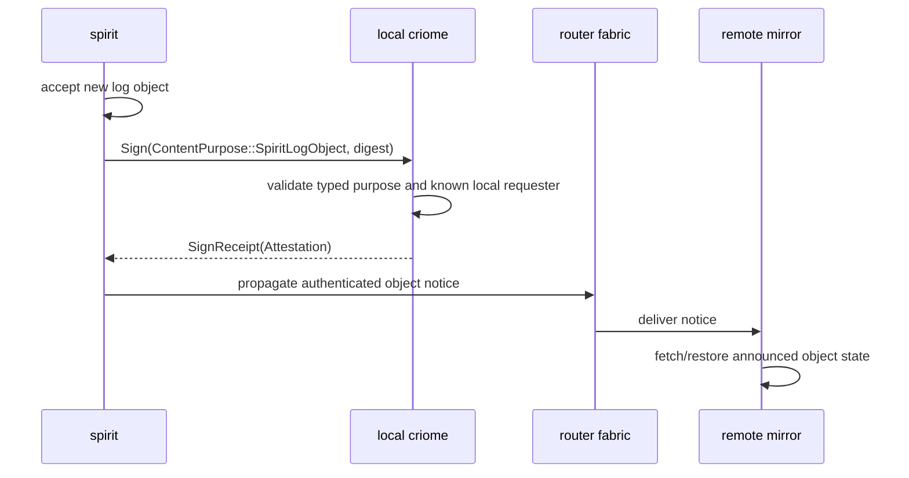
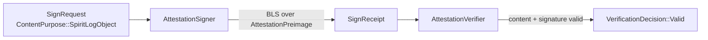

# 127 - Criome Spirit-auth worker slice

## TL;DR

The clarified intent is already present in Spirit record `d6he`: the first
production milestone is `spirit -> vcs -> criome -> router -> mirror`, with
Spirit asking local Criome to authenticate the exact content-addressed log object
after Spirit accepts it. I implemented the smallest contract/runtime step toward
that path: `signal-criome` now has a typed `ContentPurpose::SpiritLogObject`,
and `criome` can sign and verify a real BLS attestation for that purpose.

This does not yet wire Spirit to Criome, does not push the attestation through
Router, and does not implement threshold/majority Criome policy. It proves the
Criome slice can already carry the typed Spirit log-object authentication
request without inventing a new authorization subsystem.

## Shape

The immediate implemented part is the Criome box:

## Intent handling

I queried existing Spirit records for `spirit`, `criome`, `router`, and
`mirror`. Records `w2g3`, `2st7`, `d6he`, and `wckt` already covered the
neighborhood. The target record is now `d6he`, which says:

- Spirit accepts a new log object.
- Spirit asks local Criome to authenticate the exact content-addressed object or
  event for propagation.
- The local structural boundary proves the request came from Spirit for the
  pilot.
- Criome validates that the request has the expected type/shape, signs or
  authorizes it under a cluster-root-admitted identity, and propagation goes
  through Router.
- Threshold/majority timing remains future Criome contract logic, not a Router
  requirement for the first PoC slice.

My attempted `Clarify` of `2st7` was rejected because the guardian returned a
malformed verdict, but a subsequent `Lookup d6he` confirmed the clarified
architecture is already in the store. I did not add a duplicate record.

## Implemented

### `signal-criome`

Branch: `criome-spirit-log-object-auth`

Tip: `374d833c` (`signal-criome: document spirit log object purpose`)

Changes:

- Added `SpiritLogObject` to `ContentPurpose`.
- Regenerated `src/schema/lib.rs`.
- Added `spirit_log_object_sign_request_round_trips`, proving a `Sign` request
  with the new purpose round-trips through the length-prefixed frame contract.
- Manifested the purpose in `INTENT.md`, `ARCHITECTURE.md`, and `skills.md`.

Changed files:

- `schema/lib.schema`
- `src/schema/lib.rs`
- `tests/round_trip.rs`
- `INTENT.md`
- `ARCHITECTURE.md`
- `skills.md`

### `criome`

Branch: `criome-spirit-log-object-auth`

Tip: `cea58f43` (`criome: attest spirit log object purpose`)

Changes:

- Repinned `signal-criome` to branch `criome-spirit-log-object-auth#374d833c`.
- Updated the BLS `ContentPurpose` domain tag mapping with
  `SpiritLogObject => 7`.
- Added `spirit_log_object_attestation_signs_and_verifies`, proving the daemon
  can sign a Spirit log-object purpose and verify the resulting real BLS
  attestation as `Valid`.
- Manifested the purpose in `INTENT.md`, `ARCHITECTURE.md`, and `skills.md`.
- `cargo update -p signal-criome` also refreshed `schema-rust-next` in
  `Cargo.lock` from `e2e20b66` to `733b76d3`.

Changed files:

- `Cargo.toml`
- `Cargo.lock`
- `src/master_key.rs`
- `tests/daemon_skeleton.rs`
- `INTENT.md`
- `ARCHITECTURE.md`
- `skills.md`

## Verification

`signal-criome`:

- `SIGNAL_CRIOME_UPDATE_SCHEMA_ARTIFACTS=1 cargo build`
- `cargo fmt --check`
- `cargo test`
- `cargo test --features nota-text`
- `nix flake check` passed

`criome`:

- `cargo fmt --check`
- `cargo test`
- `cargo clippy -- -D warnings`
- Focused test before full suite:
  `cargo test spirit_log_object_attestation_signs_and_verifies`

`criome` `nix flake check` was started and built several remote derivations,
including clippy/doc outputs, but stayed silent in `nix __build-remote` over SSH
for several minutes. I terminated it and treat it as incomplete, not failed.

## What this proves

The Criome contract and runtime have a typed, falsifiable Spirit-log-object
attestation purpose:

- Spirit can ask for a `SignRequest` whose purpose is not generic
  `SignedObject`, but specifically `SpiritLogObject`.
- Criome's BLS preimage domain separates that purpose from every other
  content-purpose tag.
- The resulting attestation verifies through the existing real BLS verifier.
- This remains out-of-band: the Spirit object itself does not grow proof fields.

## Open questions

1. Spirit requester identity: for the pilot, I leaned on the existing local
   structural boundary and represented the requester as `Identity::Developer`
   in the daemon fixture because that is the current test helper. The production
   identity should likely be a `Host`, `Agent`, or future service principal for
   `spirit`.
2. Spirit-side digest: the next implementation needs the exact Spirit log-object
   digest source. The older report says `EntryDigest` is the right chain-head
   target and `StateDigest` is too small.
3. Router propagation envelope: this slice signs the object purpose; the next
   slice must decide whether Router carries the full `Attestation`, a compact
   attestation reference, or a `signal-mirror` notify containing both notice and
   attestation.
4. Threshold policy: the code intentionally does not implement majority/time
   policy. Spirit record `d6he` keeps that as future Criome contract logic.
5. Branch integration: both branches are pushed for operator integration. They
   are feature-branch work, not code-repo `main`.

