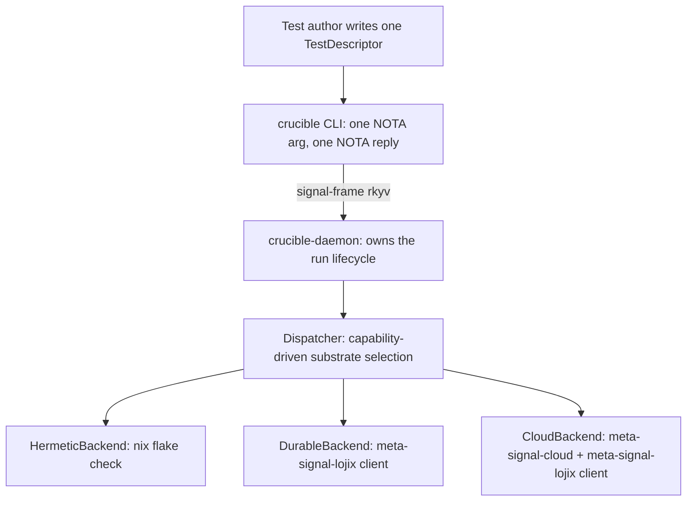
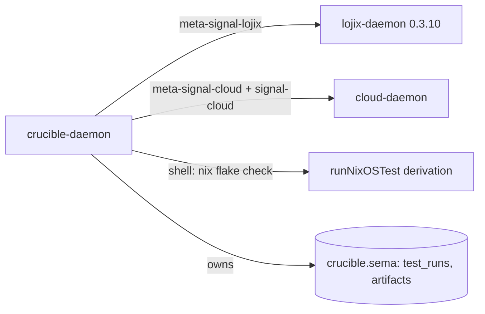
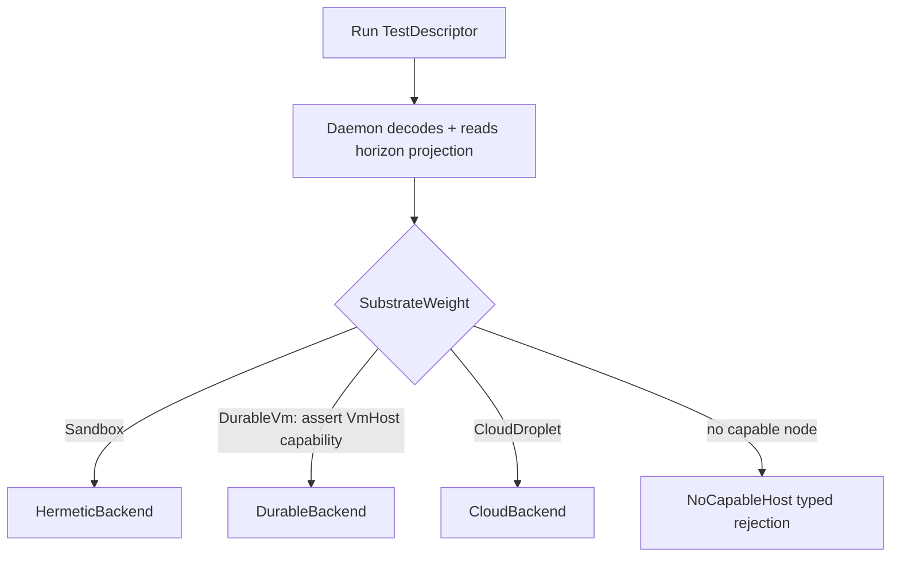
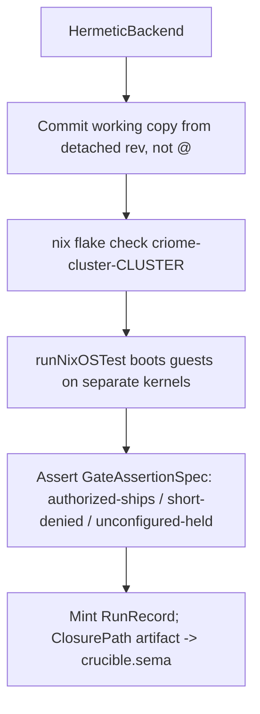

# Crucible — a custom VM-based testing system for components over cloud + lojix

*System-designer study · 2026-06-20 · report 156*

This study answers the psyche prompt: bring online a custom testing system for our components that sets up VM-based environments — a mix of lightweight networked sandboxes and full KVM, customizable per test — with its own interfaces, using cloud and lojix to set up, deploy, and debug those clusters. It sits on the existing Spirit charter `cpip` (one easily-reusable interface; one identical propagation test across three substrates with the spirit gate authenticated end-to-end, fail-closed). Produced by a 22-agent workflow: 7 parallel ground readers (intent, lojix, cloud, the CriomOS VM-testing node, existing substrates, the component-test-class to substrate map, interface precedent) -> 3 independent architecture proposals -> 9 judges (intent-fidelity, buildability, parsimony) -> synthesis -> adversarial critique -> finalize. The critique returned REJECT-AS-FRAMED against the first synthesis (a component-triad violation); this report is the corrected design that folds that rejection in.

**Provenance note (corrected after the workflow).** Several agents observed production Spirit *down* during the ~30-minute workflow window — a transient state while the system-maintainer lane ran its 705 spirit-audit work. Spirit is in fact **up at 0.15.0** as of this writing: verified directly, and intent record `upza` was captured this session. The in-report "no capture possible now" statements below are corrected accordingly — capture *is* available; only the gate *recommendation* (Observe/refresh + ask the psyche whether this refines or extends `cpip`) is unchanged.

## What the psyche asked for, and the one correction this study makes

The charter (`cpip`) fixes two non-negotiables: **one easily-reusable interface** for testing networked component clusters, and **one identical propagation test** that runs unchanged across substrates of escalating fidelity, with the spirit gate authenticated end-to-end and fail-closed. The prompt adds a per-test substrate-weight axis ("lightweight networked sandboxes and/or full KVM, customized per test") and tells the design to favour parsimony over maximalism while still delivering a *real own-interfaces* answer, not a bare harness.

The earlier canonical sketch nailed the typed shape but committed one structural error that an adversarial pass correctly rejected: **a wave-1 with a `crucible` CLI and no `crucible` daemon, whose embedded Dispatcher opens `meta-signal-lojix` + `meta-signal-cloud` + `signal-cloud` sockets, is the one shape the component-triad rules forbid.** Invariant 1 (`skills/component-triad.md:255-270`, verified) is unambiguous: "The CLI has exactly one Signal peer — its own daemon. It cannot multiplex across daemons, open another component's socket… A 'temporary direct-store CLI' is not a prototype; it is a triad violation." Carve-out 3 (`:609-613`) authorizes a *daemon* fanning out across peers — explicitly *not* a CLI. So the multi-peer dispatch logic the design needs cannot legitimately live in a daemonless CLI.

This report folds the critique in by **moving the daemon into wave-1 and deferring only the meta-contract and the artifact ledger.** The design name is `crucible` (the vessel that subjects a thing to controlled extreme conditions); the final name is a psyche call.

### Where I accept the critique, and where I push back

| Critique point | Disposition |
|---|---|
| Wave-1 daemonless multi-peer CLI violates triad invariant 1 | **Accepted, decisive.** Build `crucible-daemon` in wave-1; it is the legitimate multi-peer client (carve-out 3). |
| `test-vm-host.nix` networkd write is already gated behind `(mkIf (hasGuests && kvmAvailable))` at line 299 — not unconditional | **Accepted, factual.** Verified at `test-vm-host.nix:299-307`. The Phase-0 "gate the write" step is **dropped**; rescoped to the narrower declared-vs-running distinction. |
| The `(PropagationScript [./propagation.py])` example contradicts the typed `PropagationBody` discipline | **Accepted.** The one concrete wire example is corrected to a typed `GateAssertion` body. |
| `cpip` "byte-identical body" overclaims execution-identity (three different engines run it) | **Accepted, reframed.** Honestly stated as *byte-identical descriptor data* interpreted by three engines, with the path to true execution-identity named. |
| Spirit-gate recommendation should be Observe/refresh + **ask**, not a pre-decided Clarify of `cpip` | **Accepted (recommendation); premise corrected.** The agents' "Spirit down" was a transient workflow-window state — Spirit is up at 0.15.0 and capture is available (record `upza` landed this session). Recommend Observe/refresh + ask-before-edit; refine-vs-extend is the psyche's call. |
| `DurableVmProfile { host_role NodeRole }` conflates guest-role with host-selection | **Accepted.** Replaced with a `HostRequirement` (needs-`VmHost`-capability) — host is selected by capability per `g7yd`, never by a role field. |
| The wire contract itself is over-built for wave-1 (Proposal B's library-type is the parsimonious answer) | **Partially disagree — justified below.** Once the daemon is in wave-1, a wire contract has a genuine wire (daemon ↔ CLI ↔ peers), so `signal-crucible` is no longer a "WireContract costume." But the critique is right that the *meta*-contract and the artifact ledger are premature; those stay deferred. |
| Three distinct newtypes (`AuthorizedHeadCase` etc.) is type ceremony | **Disagree — justified below.** Kept, with rationale. |
| `Validate` dry-run + full `Debug` subscription verb-surface is maximalism | **Mostly accepted.** Wave-1 ships `Run`/`Observe`/`Collect`/`Validate`; `Debug` streaming moves to wave-2 with the daemon's long-lived process (the critique and the design already agree here). |

The critique's deepest claim — that the *honest* minimal wave-1 is a plain harness — is the one I reject, and the reason is the same reason the prompt rejected Proposal B: a `TestDescriptor` that is only a Rust library type, consumed by no daemon and spoken on no wire, creates an un-checkable decomposition-drift hazard against two independently-versioned contracts (`signal-lojix`, `signal-cloud`). The critique answers "a library type with a round-trip test against committed `.nota` fixtures is equally checkable." That is true for *self*-consistency but not for *cross*-contract drift: a library type has no linker forcing it to stay congruent with the lojix/cloud vocabularies it lifts. The fix the critique itself implies — build the daemon now — dissolves the objection, because then `signal-crucible` *is* spoken on a wire (daemon to CLI, daemon to peers' adapters) and `crucible-daemon` is its linker. So I take the daemon-in-wave-1 medicine and keep the contract; what I drop is the meta-contract and the ledger, which genuinely have no consumer yet.

## Architecture

The testing system is its own typed working-signal interface. A `TestDescriptor` (the one reusable interface) is authored as a `signal-crucible` wire record, carried to `crucible-daemon`, which selects a substrate by **typed node capability** (never by the agent's host) and dispatches the **identical typed `GateAssertion` body** to one of three reused backends.



The daemon is the legitimate multi-peer Signal client (carve-out 3). It is the only process that opens a durable store and the only process that holds peer sockets. The CLI is a pure text↔NOTA bridge to `crucible-daemon` and to nothing else — invariant 1 satisfied.



Each reused peer keeps its own triad and its own store. `crucible` never opens lojix's redb or cloud's store; it submits typed contract ops and the owning daemon does the write. The run-record store under `crucible.sema` exists in wave-1 precisely because the critique's strongest "missing piece" was correct — `Observe`/`Collect` are unbacked unless *some* crucible-owned process mints and persists run handles, and a daemon is the only process allowed to open a store. That is the second reason the daemon belongs in wave-1.

### Why the daemon, not a harness, and why the meta-contract waits

The component-triad mandate is daemon + `signal-crucible` (working) + `meta-signal-crucible` (meta policy). The full SHAPE is committed — no backward-compat, design the single best shape now. But the three legs land on different schedules:

| Leg | Wave | Justification |
|---|---|---|
| `signal-crucible` (working contract) | 1 | Spoken on a real wire once the daemon exists; the typed `TestDescriptor` vocabulary exists in no contract today (it is lifted, not duplicated). |
| `crucible-daemon` + `crucible.sema` | 1 | The only process allowed to open a store and to be a multi-peer client; without it `Observe`/`Collect` are unbacked and the dispatch is a triad violation. |
| `meta-signal-crucible` + policy tables | 2 (promotion-gated) | No consumer yet: provisioning ceilings live in cloud's `Policy`, defaults in lojix's `TestDefaults`. `crucible` borrows both by being a *client* of those meta sockets, adding zero new privileged surface. |

The critique sharpened the promotion trigger and it is right: the wave-2 trigger is **a demonstrated need for crucible-OWNED durable policy state**, not "descriptor shape stable." The only named such need today is the composite-run join key (a run that deploys via lojix *into* a cloud droplet, whose record is otherwise split across lojix's and cloud's stores). Until that join is needed, `meta-signal-crucible` is unjustified — and the design holds that the borrow-from-peers stance may be **permanent**, not a wave-1 expedient.

## Per-test model: the typed TestDescriptor

`signal-crucible` owns the descriptor (positional NOTA, bare atoms unless delimited, no quotation marks; every knob a closed enum or typed newtype, never a bare `String`/`bool`; the body a typed variant, never a command string — `qkvx`). It **cross-imports** lojix's run-record types via single-colon paths (`signal-lojix:lib:TestRunPhase`, `:TestOutcome`, `:FailureStage`, `:DatabaseMarker`) exactly as `meta-signal-lojix` imports from `signal-lojix` — lift, not duplicate.

```
TestDescriptor {
  ClusterName
  Topology
  SubstrateWeight
  Networking
  PropagationBody
  Persistence
  (Optional MaximumDuration)
}
```

Key knobs:

- `SubstrateWeight [(Sandbox SandboxProfile) (DurableVm DurableVmProfile) (CloudDroplet CloudDropletProfile)]` — the per-test substrate-weight axis `cpip`'s "customized per test" names. **Only this field varies node-realization; everything else stays identical.**
- `SandboxProfile { NetworkIsolation MaximumGuests }` — the `lt44` lightweight tier; `NetworkIsolation [SharedHost TapLayer3 CrossMachine]` (tap/L3 intra-host; vsock deliberately not a variant, deferred per `lt44`).
- `DurableVmProfile { HostRequirement Activation }` — **corrected per the critique**: `HostRequirement` is a capability requirement (`RequiresVmHost`), not a guest-role field; the host is resolved by `NodeService::VmHost` capability per `g7yd`. `Activation [BootOnce]` is single-variant by design (`kx32`/`xv9v`/`77ic`) — a second variant is minted only when a second real mode exists.
- `CloudDropletProfile { Provider DropletCount RegionName CloudBringUp CostCeilingCents DropletCount }` — `CloudBringUp [StockImage NixosAnywhere]`; `StockImage` is the honest default until the `CloudNode` image lands.
- `Topology { (Vec NodeSpec) (Vec NetworkLink) }`; `NodeSpec { NodeRole (Optional MachineSizing) }`; `MachineSizing { VirtualCpuCount MemoryMebibytes DiskGibibytes }` (typed newtypes, not bare ints).

**The body is typed** — and corrected to remove the script-path escape hatch the critique caught:

```
PropagationBody [
  (FlakeCheck FlakeAttribute)
  (GateAssertion GateAssertionSpec)
  (Steps (Vec TestStep))
]
GateAssertionSpec {
  AuthorizedHeadCase
  ThresholdShortCase
  UnconfiguredCase
  QuorumThreshold
}
TestStep [
  (Deploy DeployStep)
  (WaitFor Condition)
  (Probe ProbeSpec)
  (RunInGuest ArgumentVector ExpectedOutcome)
]
```

The `GateAssertionSpec` is lifted from `spirit/tests/criome_gate_1of1.rs` (verified present): the three cases are the `xhwa` 1-of-1 proofs (authorized-ships / threshold-short-denied / unconfigured-held); `QuorumThreshold` is the typed dimension that grows toward `jk1w`. A guest command is a typed `ArgumentVector` + `ExpectedOutcome`, never a shell string (the `qkvx` anti-pattern; precedent: the deleted string-keyed `vm-testing/default.nix`).

**No GPU field in wave-1.** VFIO/display has no typed home in `horizon-rs` `NodeService` (verified: `VmHost` carries `guest_subnet`/`kvm`/`maximum_guests` only). A `Gpu` knob now would be the string-fixture hack `qkvx` forbids. The GPU tier (`y1v5`/`cncj`/`8f8e`) is a fourth substrate, design-deferred with its prerequisite stated, not shipped as a working variant.

### Where I disagree with the critique: three distinct case newtypes

The critique calls `AuthorizedHeadCase` / `ThresholdShortCase` / `UnconfiguredCase` as distinct newtypes "type ceremony," arguing the enclosing record's field names already carry the role. I keep them distinct, for a load-bearing reason the field-name argument misses: these three values are **constructed and passed around independently** (a test author builds an authorized head from one keyset and a threshold-short head from another; backends hand them to the gate at different lifecycle points). If they share a structural type, `GateAssertionSpec::new(unconfigured, authorized, threshold_short)` compiles silently with the arguments permuted — the classic two-fields-same-type swap bug, which is exactly the failure the role-is-type rule exists to prevent. Field names protect the *record literal*; they do not protect the *constructor call* or any function that takes one case as a parameter. The newtypes are the minimum that makes a permutation a compile error.

## Substrate selection and orchestration flow

Selection is typed and capability-driven (`g7yd`/`qnf8`/`0a9p`), per-test, via `SubstrateWeight`. The daemon's `Dispatcher` reads the `horizon-rs` cluster projection (a pure `ClusterProposal::project(&viewpoint)` call — not a running service) and resolves the weight + capability set to a concrete backend. It **never** picks a substrate from the agent's host; a missing capability returns the typed `NoCapableHost`, with no local fallback.





**Hermetic (Sandbox) — the always-on CI tier, wave-1 first slice.** The `Dispatcher` resolves cluster+topology to the `mkCriomeClusterTest`-emitted `checks.x86_64-linux.criome-cluster-<cluster>` derivation and shells `nix flake check`. Members are co-located guests on the driver's internal vlan; criome peers reach each other over per-node Unix sockets — cross-KERNEL, real BLS, single-HOST. `isolation=MicroVm` keeps the `qemu-vm.nix` substrate (PCI + direct kernel boot); a bare `-M microvm` machine type rejects the driver's `/dev/hvc0` PCI backdoor — the load-bearing `runNixOSTest`-vs-bare-microvm crux. Host untouched: a broken cluster kills only the VMs (`7let`).

**The commit-first hazard the critique flagged is real and the fix is named.** `88eq` requires commit-first (Nix cannot see uncommitted state), but `AGENTS.md` mandates committing the *whole* shared working copy, and a test runner committing on every hermetic run would drain every peer's in-flight change into a test-triggered commit, serializing all agents through the working-copy lock. **Resolution: `HermeticBackend` does not commit `@`.** It builds the check from a detached committed revision — it snapshots the current working-copy state into a throwaway commit *off* the working copy (or evaluates against the last committed revision when the tree is clean), so a test run never mutates the shared `@` and never forces peers' work onto a test-triggered commit.

**Durable (DurableVm) — the `77ic` tier, via lojix.** `DurableBackend` first validates via the projection that the resolved host carries `NodeService::VmHost{kvm: Available}` and capacity; failure → typed `NoCapableHost`. It opens a `meta-signal-lojix` `MetaClient` and submits `(Test (Run {cluster (Nodes [members]) (OnHost <vmhost-host>) Live}))`. **Today lojix rejects `Live` with `LiveNotYetEnabled`** (verified at `schema_runtime.rs:1681`); the backend surfaces that typed rejection honestly — never a faked pass. **Honest scope statement the critique demanded:** the durable tier's host-untouched and `BootOnce` safety properties are **unverifiable through `crucible` today**, because the only path that would exercise them is gated; the guarantee rests entirely on lojix work `crucible` cannot do.

**Cloud (CloudDroplet) — real cross-machine, via cloud.** `CloudBackend` opens a `meta-signal-cloud` `MetaClient` and drives `RegisterAccount` (once) then per node `PrepareHostPlan`/`ApprovePlan`/`ApplyPlan` (plan ids are deterministic, constructible without round-trip), polls the ordinary `ObserveServers` until each `CloudHost.status==Running` AND `ipv4` is assigned (**`CloudHost.ipv4` is a single `IpAddress`, not a `Vec` — verified at `signal-cloud/src/lib.rs:290`; poll until non-empty, do not decode a list**), assembles the `IpAddress` set as the cross-machine topology, deploys CriomOS via lojix build-on-target into each droplet (`CloudBackend` is also a `meta-signal-lojix` client — carve-out 3), runs the IDENTICAL `GateAssertion` body, then `PrepareHostDestruction`/`ApprovePlan`/`ApplyPlan` per node under a **mandatory `Drop`-guarded teardown** with a `max_droplets` cap (DO bills by the second).

### The cpip invariant, stated honestly

The critique is correct that "byte-identical body across substrates" overclaims. What is byte-identical is the **`GateAssertionSpec` DATA value**; it is interpreted by **three different engines** — the `runNixOSTest` python driver (hermetic), lojix's live-assert bracket (durable, *unbuilt*), and ssh probes after a lojix deploy (cloud). True *execution*-identity requires either (a) `crucible` owning a single `GateAssertionSpec` interpreter that all three substrates invoke, or (b) accepting the invariant as data-level. The design's position: **pursue (a) as the real target** — the long-term shape is a small crucible-owned assertion interpreter shipped into every substrate (a guest binary in hermetic/durable, an ssh-delivered binary in cloud) so the same code reads the same typed spec everywhere — but **wave-1 honestly ships data-level identity** (the hermetic python driver inlines the typed spec), and the report does not claim more.

## Interface design (signal-crucible working contract)

The only new contract in wave-1. Positional NOTA, bare atoms unless delimited, never quotation marks.

Roots — requests `[Run Observe Collect Validate Help]` (note: `Debug`/`TearDown` streaming verbs move to wave-2 with the daemon's long-lived push capability and the meta surface). Replies `[Accepted RunObserved ArtifactsCollected Validated Helped RunRejected ObserveRejected CollectRejected ValidateRejected]`.

| Verb | Reply | Meaning |
|---|---|---|
| `(Run TestDescriptor)` | `(Accepted RunIdentifier DatabaseMarker)` | mint a run; daemon owns the lifecycle |
| `(Observe (ByRun RunIdentifier))` / `(Observe (ByCluster ClusterName))` | `(RunObserved RunListing)` | `RunRecord { RunIdentifier ClusterName SubstrateWeight TestRunPhase TestOutcome (Optional ArtifactSetHandle) }`; phase/outcome cross-imported from `signal-lojix:lib`, generalised by the `SubstrateWeight` column |
| `(Collect (FromRun RunIdentifier ArtifactKind))` | `(ArtifactsCollected (Vec ArtifactHandle))` | `ArtifactKind [SerialConsole DaemonJournal AssertionLog ClosurePath ProviderEvent]` |
| `(Validate TestDescriptor)` | `(Validated SubstrateResolution)` | dry-run the capability resolution without provisioning (returns the host/provider that WOULD be selected, or `NoCapableHost`) |

`Validate` is kept in wave-1 (against the critique's "marginal value" note) for one reason: it is the only way to surface `NoCapableHost` *before* spending provider quota, which the cost-safety requirement makes load-bearing for the cloud tier. It is cheap (a pure projection read, no provisioning) so it carries no maximalism cost.

Typed rejections: `RunRejectionReason [ClusterUnknown NoCapableHost SubstrateUnavailable ProviderQuotaExceeded DropletCeilingReached LiveNotYetEnabled InternalError]`. `NoCapableHost` is the honest `g7yd` reply; `LiveNotYetEnabled` propagates lojix's; `DropletCeilingReached` guards cost.

**Corrected concrete example** (the critique caught the old `(PropagationScript [./propagation.py])` contradiction; this one obeys the typed-body discipline):

```
(Run (TestDescriptor fieldlab
  (Topology [(NodeSpec Edge (Some (MachineSizing 2 2048 20)))] [])
  (Sandbox (SandboxProfile TapLayer3 3))
  (Networking TapLayer3 Loopback)
  (GateAssertion (GateAssertionSpec
    (AuthorizedHeadCase ...) (ThresholdShortCase ...) (UnconfiguredCase ...)
    (QuorumThreshold 1 1)))
  Ephemeral None))
```

Meta provisioning/credential ops are **deferred** to `meta-signal-crucible` (wave-2). Today provisioning policy (DO ceilings, keep-warm `6ks1`) lives in cloud's `Policy`/credential handles and lojix's `TestDefaults`; `crucible-daemon` sets them by being a *client* of those meta sockets, adding zero new privileged surface. When promoted, `meta-signal-crucible` gains `[Submit Cancel SetProvisioningPolicy RegisterCredential SetDefaults]` and cross-imports `signal-crucible:lib:RunIdentifier`/`:DatabaseMarker` via single-colon paths. Credentials cross meta by handle only, never secret bytes.

## Lifecycle, debug, and artifact collection

A failing run lands a typed `TestOutcome::Failed(FailureStage)` (`BringUp`/`Deploy`/`Assert`/`TearDown`/`HermeticCheck`, cross-imported and generalised) — never a silent drop; `dqg3` skeleton-honesty means the daemon records the divergence, never a falsely-`Passed` run. Because the daemon owns `crucible.sema`, `Observe`/`Collect` are **backed in wave-1** (the critique's strongest missing-piece — unbacked observation verbs — is resolved precisely by putting the daemon, and its store, in wave-1).

Where the bytes live: hermetic — the `runNixOSTest` driver's serial-console + per-machine journal land in the nix build log / out-path; the handle points at that store path. Durable — lojix's event-log + the guest journal over ssh; the handle points at lojix's `(Query (ByEventLog ...))` page + `TestRunRecord.closure_path`. Cloud — cloud's `ProviderEvent` records + the droplet journal over ssh; an optional debug-hold suppresses auto-teardown (Drop guard + `max_droplets` still bound cost). **Large artifacts ride the substrate's own byte channel (nix store / ssh), never a Signal frame** — the reply carries only the typed handle.

The composite-run join (deploy via lojix *into* a cloud droplet, one `RunIdentifier` spanning both peers' stores) is the named wave-2 promotion trigger: until the crucible-owned ledger lands, that one path's record is split across lojix's and cloud's stores with no join key — an accepted harness-phase limitation, watched so it does not ossify.

## Phased build plan

| Phase | Goal | Depends on |
|---|---|---|
| 0 | Verify the foundation; run the Spirit gate for this study | none |
| 1 | `signal-crucible` + `crucible-daemon` + `crucible` CLI + HermeticBackend (smallest end-to-end slice) | 0 |
| 2 | spirit-daemon-in-the-loop gate + DurableBackend | 1 |
| 3 | CloudBackend (real cross-machine DigitalOcean) | 2 |
| 4 | `meta-signal-crucible` + policy tables + GPU/display tier (promotion-gated) | 3 |

**Phase 0 — verify the foundation.**
- Confirm lojix-daemon 0.3.10 is live (verified) and the durable `vm-testing` TestVm on the VmHost-role host (prometheus today) is deployed (report 155: built-but-not-booted).
- Land the CriomOS reconciliation removing the dead string-keyed `vm-testing/default.nix` (verified still imported at `criomos.nix:40` alongside typed `test-vm-host.nix:48`) — operator rebases worktree branches `prometheus-vm-host` / `enable-vm-hosting-prometheus` to main (bead `primary-wvey`, the typed-VmTesting redo).
- **Corrected per the critique:** do **not** add a step to "gate the unconditional networkd write" — the write at `test-vm-host.nix:299-307` is already gated behind `(mkIf (hasGuests && kvmAvailable))`. The narrower residual: the gate keys on *declared* guests (eval-time), not *running* guests (activation-time). Decide whether eval-time declaration without a booted guest counts as a host-touch; tighten only if it does.
- Run the Spirit gate for THIS study (see intent section): Spirit is up at 0.15.0 and capture is available, so the gate runs normally — Observe/refresh, then **ask the psyche** the refine-vs-extend question before any `cpip` edit. (The workflow agents saw a transient Spirit-down window during system-maintainer's 705 work; that does not apply now.)

**Phase 1 — smallest end-to-end slice.** Author `signal-crucible` (`TestDescriptor` + `SubstrateWeight(Sandbox only)` + `Topology`/`Networking`/`GateAssertion`/`PropagationBody`, cross-importing the lojix run-record types); generate `src/schema`; `tests/round_trip.rs` from real `.nota` fixtures (`b2jg`). Build `crucible-daemon` (one rkyv startup arg, no flags, rejects inline NOTA/.nota, virgin-starts Unconfigured, self-resumes from `crucible.sema`) and the `crucible` CLI (one NOTA arg, one NOTA reply). Wire HermeticBackend: snapshot off `@` (not commit `@`) then `nix flake check`. Extend `mkCriomeClusterTest` from its Stage-A prototype (verified single-guest, `members>1` throws, criome-as-root) to read a `TestDescriptor` and inline the typed `GateAssertion` body. Prove the `xhwa` 1-of-1 gate cross-KERNEL. Capability-resolve via the projection (`NoCapableHost` if the CI host lacks `VmHost`).

**Phase 2 — spirit half + DurableBackend.** Add the spirit-daemon to the hermetic cluster module + the gate-arming step (the meta-signal `Configure` pointing spirit at the criome socket) so the gate runs inside spirit's `handle_working_input` over the wire — the documented Stage-A→full-gate step, and **the semantic core of `cpip`** (open question: this config message is currently a design TODO). Add DurableBackend (`meta-signal-lojix` `MetaClient`); surface `LiveNotYetEnabled` honestly until lojix's live bracket lands (operator work in lojix, the single biggest external dependency). When lojix ungates Live, the backend drives `BringingUp`→`Deploying`→`Asserting`→`TearingDown`, BootOnce, build-on-target; the same `GateAssertion` body runs.

**Phase 3 — CloudBackend.** `meta-signal-cloud` `MetaClient` lifecycle; poll until `Running` AND `ipv4` assigned (single `IpAddress`); Drop-guarded mandatory teardown + `max_droplets` cap. **Prerequisites the critique correctly elevated:** pre-register the SSH key out of band (verified gap D14: `ensure_ssh_key` is not called on the create path; an unregistered key yields a keyless unreachable droplet); build the cloud peer `--features digitalocean` with the token in its env; **and land the committed `#[ignore]`-live socket-lifecycle test for cloud `ApplyPlan` (audit D17) as a cloud-side prerequisite, not a crucible deliverable** — `crucible` should not be the proving ground for an unproven peer socket path. `CloudBringUp::StockImage` proves cross-machine routing on bare droplets until the `CloudNode` image lands; `NixosAnywhere` brings up real CriomOS after. Drive `jk1w` 2-of-3 by `QuorumThreshold(2,3)` with `members=[alpha beta gamma]` — **blocked on the criome cross-machine TCP transport lane (E1)** until it lands; assert the honest no-cross-machine-fanout failure rather than faking green. **Tension the critique surfaced:** a 2-of-3 quorum needs ≥3 droplets, but cloud's single serializing `EngineActor` + blocking IO (audit D2) provisions sequentially and stalls all sockets on one hung call — keep member counts small, set `MaximumDuration`, and treat cloud's actor-soundness fix as a soft prerequisite for multi-node cloud quorum.

**Phase 4 — promote the daemon's meta surface + GPU tier (promotion-gated).** Trigger (sharpened): a demonstrated need for crucible-OWNED durable policy/join state (the composite-run join key), **not** descriptor stability. Author `meta-signal-crucible` `[Submit Cancel SetProvisioningPolicy RegisterCredential SetDefaults]` (Submit privileged — spends quota), cross-importing `signal-crucible:lib` types. Add the composite-run ledger + the live `Debug` push (token + `RunPhaseEvent`/`RunLogEvent`). **Add the GPU/display tier only after `horizon-rs` `NodeService` gains a typed VFIO/display capability** — and the critique is right that this is an *unowned, unscheduled prerequisite work item*, not merely "deferred": **Phase 4 explicitly includes the `horizon-rs` `NodeService` VFIO/display extension as its first step** (extend the variant, author it in `datom.nota`, extend the projection), *then* add a `Gpu` field + `FullKvm` `SubstrateWeight` variant, asserting disabled-on-the-AI-node against the REAL projection (`cncj`/`y1v5`/`8f8e`). The critique also notes the gamma test may be **un-homed**: the only non-prometheus VmHost-capable node for GPU passthrough is unestablished — so Phase 4 must additionally establish a GPU-capable non-prometheus node in cluster data, or the tier is typed-but-unrunnable.

## Intent-fidelity map

| Record | How honored |
|---|---|
| `cpip` | The spine: `TestDescriptor` + CLI/daemon = the one reusable interface; `GateAssertionSpec` carried across substrates = the one propagation test (data-level in wave-1, with execution-identity as the named target); `SubstrateWeight` = substrate-by-typed-parameter; three substrates map exactly; `QuorumThreshold` carries `xhwa`→`jk1w`. Treated as design elaboration (Observe/refresh), not a sibling Record. |
| `g7yd` | Substrate resolved by querying the projection for `NodeService::VmHost{kvm: Available}` (verified-real type), never the agent's host; `NoCapableHost` is the honest typed reply, no local fallback. **`DurableVmProfile` now carries a `HostRequirement` capability, not a host-role field** (critique fix). |
| `77ic` | `DurableVm` maps to the durable on-demand TestVm on the VmHost-role host, defined in cluster data, not booted by default, started via lojix `(Test (Run ... Live))`; `Activation=BootOnce`. Phase 0 lands the dead-module reconciliation. |
| `7let` | Default posture for the hermetic Sandbox tier (no host reconfiguration; deploy into throwaway VMs). No new daemon meta-surface for the harness phase — defer applied at the meta-contract layer. |
| `se72` | Durable/cloud tiers go all-the-way (full routed deploy-into-VM via lojix); hermetic `runNixOSTest` is the CI proof; `btc0` nspawn stays available as `NetworkIsolation`. |
| `y1v5`/`8f8e` | The visual/GPU full-display tier is the **fourth** substrate, design-deferred with its prerequisite stated honestly (VFIO has no typed home in `NodeService` yet); **Phase 4 explicitly schedules the `horizon-rs` extension as an owned work item** (critique fix). |
| `cncj` | Deferred GPU tier's passthrough gets a typed home (`Gpu [NoGpu (Passthrough GpuClass) Virtual]`) only in Phase 4 after the `NodeService` extension; disabled-on-the-AI-node asserted against the REAL projection. |
| `qkvx` | Every knob a closed enum or typed newtype; the body a typed `PropagationBody` variant; **the script-path example removed** (critique fix); no string-keyed config; single-variant `Activation[BootOnce]` not a Boolean. |
| `0a9p` | DurableBackend deploys via lojix build-on-target so model closures realize in the target store; the AI node's GPU reserved for AI (the `cncj` tie). |
| `hnoo` | Real `.schema`/`.nota` fixtures through Nix codegen; real daemon binaries (NOTA→rkyv ExecStartPre + one-rkyv-arg ExecStart, the `mirror.nix` shape); real rkyv frames over real sockets; `dqg3` honesty throughout. |
| `lt44` | The lightweight networked sandbox tier is `SandboxProfile` (`NetworkIsolation [SharedHost TapLayer3 CrossMachine]`; vsock deferred). Wave-1 first slice. |
| `component-triad` | `crucible` IS a triad in committed shape; **the daemon is now wave-1** (critique fix — the multi-peer client is the daemon, never the CLI); `meta-signal-crucible` + ledger deferred behind a need-for-owned-state trigger. Carve-out 3 (`:609-613`, verified) authorizes the daemon driving lojix and cloud; each component owns its own store. |
| one-argument-daemon | The CLI takes one NOTA arg and prints one NOTA reply, speaking **only to `crucible-daemon`** (invariant-1-clean). The daemon takes one rkyv startup message, no flags, rejects inline NOTA/.nota, virgin-starts Unconfigured, self-resumes from SEMA. |

## Spirit gate for this study

Spirit is up at 0.15.0 and capture is available (record `upza` was accepted this session; the workflow agents' "Spirit down" was a transient window during the system-maintainer 705 work). The gate therefore runs normally. The lightweight/full-KVM-per-test framing reads as an **extension/elaboration** of `cpip`, not necessarily a refinement of its meaning — and an extension is not a Clarification (which edits the target's meaning). **Recommended outcome: Observe/refresh + ask the psyche** whether this is a refinement of `cpip` (→ a `Clarify` edit) or a new sibling concept (→ possibly a new `Record`) — do **not** pre-decide a Clarify edit (the earlier sketch's error, which the critique correctly flagged). The candidate edit is carried below for the psyche to confirm; no Record is added reflexively.

## Open questions

1. Is the lightweight/full-KVM-per-test framing a refinement of `cpip` (Clarify edit) or a sibling extension? Confirm with the psyche before any Spirit edit. (Spirit is up at 0.15.0; capture is available.)
2. Component name: `crucible` vs `proving` vs `assay` vs `test`? `crucible` recommended; psyche call.
3. Do lojix's `TestMode`/`TestRunRecord` stay in `signal-lojix` (crucible cross-imports — the design's choice) or migrate to crucible? **This must be ratified before `signal-crucible`'s cross-imports are authored** — building the contract that cross-imports `signal-lojix:lib:TestRunPhase` presumes the stay-in-lojix answer (sequencing inversion the critique correctly named).
4. What is the precise spirit gate-arming config message (the `Configure` pointing spirit at the criome socket) and its authority path across substrates? Phase 2 needs this; it is the semantic core of `cpip` and currently a design TODO.
5. Is the borrow-from-peers policy stance (no `meta-signal-crucible`) **permanent** rather than a wave-1 expedient? If the composite-run join is the only crucible-owned-state need ever demonstrated, the wave-2 meta-contract may never be justified — the promotion trigger should gate on demonstrated owned-state need, not descriptor stability.
6. How much logic lives in Nix (`mkCriomeClusterTest`) vs the `crucible-daemon` Dispatcher? Does the Dispatcher evaluate the projection via a linked lib, shell `horizon-cli`, or read committed `horizon/<node>.json` fixtures?
7. Should the `horizon-rs` `NodeService` VFIO/display extension be designed alongside Phase 1 (type exists early) or strictly in Phase 4? And: is there *any* non-prometheus VmHost-capable node that can carry GPU passthrough for the gamma test, or must one be established first (the un-homed-tier gap)?
8. Do the three backends share enough to justify one `Dispatcher` abstraction (the critique's reasonable doubt)? `HermeticBackend` shells nix; `DurableBackend` is a lojix client; `CloudBackend` is a cloud client + a lojix client + an ssh prober + a Drop-guarded teardown — common surface is only "take a `TestDescriptor`, return a `RunRecord`." Three named backends behind a trait may be the right shape even if "one dispatcher" oversells the economy.
