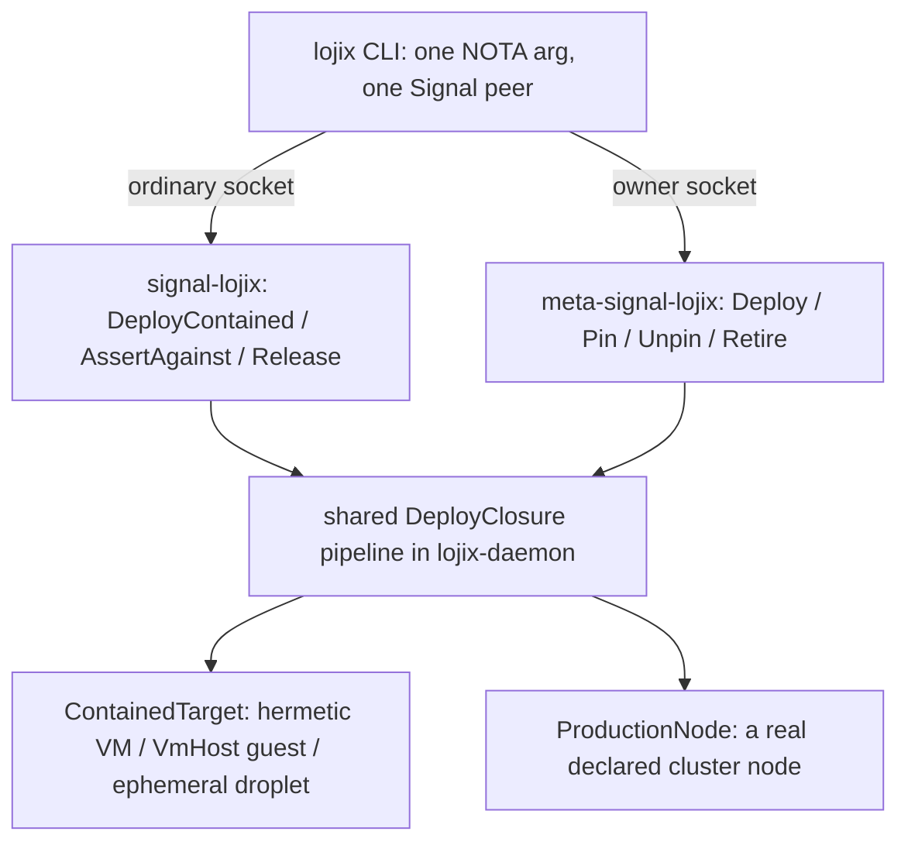
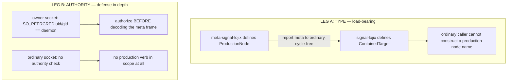
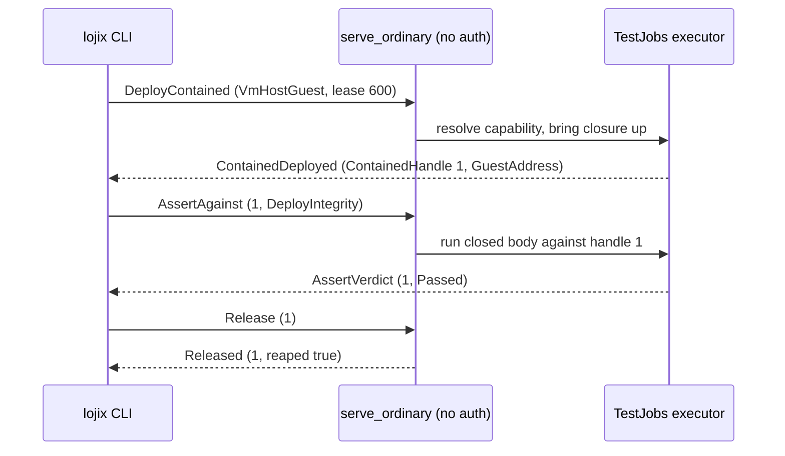

# Crucible folds into lojix — testing as the safe ordinary face, deployment as the meta face

*System-designer study · 2026-06-21 · report 158 · POC + adversarial verification for the testing-is-lojix-ordinary reframe; pairs with report 157; supersedes the framing of report 156*

**Relation to report 157.** A parallel session committed `157-lojix-ordinary-contract-testing-reconcile-cpip-and-156-reframe-2026-06-20.md`, which reaches the same core reconciliation (testing = lojix ordinary, deployment = lojix meta; the reframe is already half-built on the wrong face; the `ContainedTarget` spectrum; report 156 open-question 3 dissolved). This report (158) is the POC-complete, source-verified treatment of the same reframe: it carries the reshaped **ordinary and meta contract NOTA** as the POC artifact, the chosen design variant (shared-deploy + thin-assert with two grafts), the wave-0 codegen gate, the seven adversarial-critique corrections, and the source-checked finding that `vudl`/`cgd8` are **not** intent conflicts. 157 and 158 agree on the reframe; a consolidation recommendation is in chat.

This report redoes report 156's research/POC under the psyche's reframe: testing and deployment are the same function (build a closure and bring it up on a target), differing only in containment — so the deploy component (lojix) IS the testing component. Safe contained testing is lojix's ordinary (non-meta) signal interface; privileged production deployment is its meta interface; the ordinary/meta split is the typed safety boundary. There is no separate `crucible` component. Captured this turn as Spirit Decision `mq5s`. Produced by a 14-agent workflow (5 ground readers, 2 design variants, 4 judges, synthesis, adversarial critique, finalize); chosen design is the shared-deploy + thin-assert chassis with two grafts.

**Provenance note (verified after the workflow).** The central empirical claim — that `Test` currently lives on the meta/owner face, which is backwards — is CONFIRMED against source: `meta-signal-lojix/schema/lib.schema:60` lists `Test` among the meta request roots `[Deploy Pin Unpin Retire Test]`, and `lojix/src/daemon.rs:350` dispatches `meta::Input::Test` inside `serve_owner` (the privileged owner socket). One correction is folded in: the workflow framed Spirit records `vudl`/`cgd8` as *conflicts* that say "Test is owner-only." Verified directly, they do not. `vudl` states the authority-split *principle* (Deploy/Pin/Unpin/Retire are owner-only because a deploy mutates the live cluster and can break the router) and never enumerates `Test`; moving a *safe contained* test to the ordinary face is consistent with that rationale, not a contradiction of it. `cgd8` is about daemon *configuration* over meta-signal and is unrelated to `Test`. So the situation is: the current *code* placed `Test` on the owner socket — implementation state, not an intent mandate — and no reflexive Spirit edit is required; `vudl` could optionally be extended to place contained `Test` on the ordinary face. The in-body conflict framing is corrected accordingly.

## Supersedes report 156's framing

This report **supersedes the framing of report 156** ("Crucible — a custom VM-based testing system for components over cloud + lojix", `/home/li/primary/reports/system-designer/156-crucible-component-testing-system-over-cloud-and-lojix-2026-06-20.md`). Report 156 designed a **separate `crucible` component** (its own triad `crucible` + `signal-crucible` + `meta-signal-crucible`, its own daemon, its own multi-peer dispatcher). The psyche's reframe this turn dissolves that premise: testing and deployment are the **same function** — build an OS/cluster closure and bring it up on a target — differing only in **containment**, so the deploy component **is** the testing component. There is no new component. cpip's "one easily-reusable interface for testing" **is lojix's ordinary contract**; deployment is lojix's meta contract. The keep/drop delta against 156 is in [§ Report-156 keep/drop delta](#report-156-keepdrop-delta): 156's typed content (TestDescriptor knobs, the substrate spectrum, GateAssertionSpec, the CloudDroplet discipline, the audit findings, the intent map) survives almost completely, **relocated onto lojix's faces**; only its structural premise (a separate component) is dropped.

The reframe is the **fixed frame** for this redo — psyche's exact words: *"I noticed this is the same function as deployment, only one is safe and contained. so we need the component to do both and have a 'safe' (non-meta) interface for testing, meta is deployment."* Captured this turn as a Spirit Decision. This report decides **how**, not whether.

### The shape in one paragraph

The reframe is already half-built in lojix **on the wrong face**. The `Test` verb, the containment axis (`TestMode [Hermetic Live]`), the assert+teardown phase machine (`TestRunPhase`, `FailureStage`), and the decoupled test-job executor all exist today — but `Test` is a root on **meta-signal-lojix**, arriving on the **privileged owner socket** (`daemon.rs:350` `serve_owner`). That is backwards: the *safe* contained hermetic test currently demands *production* authority. The redo is a **face-correction by subtraction plus a thin decomposition**, not a new build: move contained testing **down** to the ordinary contract; leave only privileged production deploy on meta. The ordinary surface gains three ops that together **are** testing — `DeployContained` (the shared deploy function, returns a typed handle), `AssertAgainst` (a thin op handing the daemon a closed typed body, returns a verdict), `Release` (explicit reap). The meta surface keeps the **same** build-and-bring-up function pointed at a real declared node: `Deploy` / `Pin` / `Unpin` / `Retire`. `TestMode [Hermetic Live]` is **deleted** — containment becomes a typed target *variant*, never a runtime flag.

## Chosen design: shared-deploy thin-assert chassis, with two grafts

The decision is **S — shared-deploy + thin-assert (chassis)**, with two grafts from the rival variant **U — full-unification**:

| Axis | S (chosen chassis) | U (rival) | Grafted from U |
|---|---|---|---|
| Deploy/assert coupling | Deploy returns a **handle**; assert is a separate thin op | One `Run` op folds deploy+assert+reap | — |
| Teardown ownership | Daemon reaps (already in S for `Release`) | Provisioner-must-be-reaper (load-bearing) | **Yes — made structural** via a required non-zero lease + daemon-clamped ceiling |
| Wave staging honesty | POC slightly loose | Honest wave-staging | **Yes — wave-1 proves ONLY the face-correction** |
| Assertion vocabulary | Closed `PropagationBody` stays **out** of the deploy contract | Daemon imports spirit/criome vocabulary in-daemon | — |
| Buildable on lojix 0.3.10 today | Yes (hermetic face-correction) | **No** — needs a net-new contract type + in-daemon interpreter | — |

Both variants scored in the same band (U 8.5/6.5, S 8/7.5); the deciding axis is **buildability under the fixed frame**, and the verified ground favours S's shape while exposing U's headline as not-yet-buildable. Confirmed against live source: `GateAssertionSpec` / `AuthorizedHeadCase` / `PropagationBody` exist in **no** schema or daemon file — only in `spirit/tests/criome_gate_1of1.rs` as Rust test code; the canonical hermetic path is a single `HermeticCheck` effect (`nix build .#checks.<system>.vm-<node>`, `schema_runtime.rs:319-555`) that brings up no closure on a running cluster and yields no guest address; `AssertTestVmCommand` carries only `{cluster_name node_name guest_ip closure}` (worktree `schema_runtime.rs:481-490`) — the assertion is the deploy-integrity check, with **no typed body on the wire**; the criome gate is a spirit-Engine→criome **socket round-trip** observing outbox-drain + durability, not a guest-side binary. U's central claim — *the daemon itself executes the typed `GateAssertionSpec` in-daemon* — therefore requires authoring a brand-new contract type **and** a new in-daemon interpreter that does not exist. Both judges flagged this and that U's POC proves the cheaper claim while wearing the expensive language.

The two grafts: (1) U's *provisioner-must-be-reaper* argument is correct and load-bearing — S already adopts it for `Release`; this design makes it **structural** via a required `NonZeroInteger` lease clamped to a daemon-configured maximum. (2) U's honest wave-staging fixes S's own slightly-loose POC description — wave-1 proves only the face-correction, not the unbuilt typed-assertion-on-the-wire claim.

## One component, two faces

The literal reading of *"testing and deployment are the same function"*: the deploy **body** (`DeployClosure`) is shared between contained and production deploys through the same daemon pipeline. Only the **target type** (`ContainedTarget`, ordinary-only vs `ProductionNode`, meta-only) and the **socket** differ.



`DeployContained` returns a typed `ContainedHandle` (not a verdict); `AssertAgainst` runs a closed typed body against a named live handle and returns a `Verdict`; `Release` reaps. The deploy core stays **pure** — it never reads assertion semantics — so the same handle backs both automated assert+release and interactive deploy-debug-release.

## The typed contained-vs-production safety boundary

The boundary is **structural on two independent, both-required legs** — neither a runtime flag nor a checkbox the ordinary caller controls.



**Leg A (type, the load-bearing leg).** The shared `DeployClosure` is target-agnostic, but the *target* is split into two types in two crates with a one-way import. `signal-lojix` defines `ContainedTarget`; the ordinary `DeployContained` carries **only** `ContainedTarget`. `meta-signal-lojix` defines `ProductionNode { ClusterName NodeName }`; the meta `Deploy` carries **only** `ProductionNode`. `ProductionNode` is a field of **no** ordinary type, and the cross-import is strictly meta→ordinary (verified: `signal-lojix` imports zero meta types; meta imports `signal-lojix:lib:TypeName` at `lib.schema:43-59`, cycle-free). An ordinary caller therefore **literally cannot construct** a request naming a production node — a compile-time impossibility — and a hand-forged ordinary wire frame still deserializes into a `ContainedTarget` the daemon resolves only to a sandbox / on-demand VmHost guest / ephemeral droplet. There is no production `NodeName` anywhere on the ordinary wire to forge. Deleting `TestMode [Hermetic Live]` eliminates exactly the runtime flag the reframe forbids; containment becomes the `ContainedTarget` *variant*, every variant throwaway by construction — there is no `--contained=false` escape.

**Leg B (authority, defense in depth, built mechanism reused verbatim).** The daemon binds two sockets via `ListenerRole [Ordinary Owner]` (`daemon.rs:48-92`). `serve_owner` calls `owner_authority.authorize(context)` **before** decoding the meta frame (`daemon.rs:337`, decode at `:339`); `OwnerPeerAuthority` requires `SO_PEERCRED` peer uid/gid == daemon euid/egid and refuses TCP peers (`daemon.rs:222-260`, Spirit `9v7h`, `tests/owner_peer_authority.rs`); `validate_owner_socket_mode` refuses world-other access (`daemon.rs:124-133`). `serve_ordinary` (`daemon.rs:317-334`) runs **no** authority check and decodes `signal_lojix::Input`, whose roots contain no production verb at all. Touching production requires **both** a meta-contract type **and** owner-socket credentials; the ordinary surface has neither. The thin-assert ops inherit safety for free: `AssertAgainst` / `Release` reference a `TestRunIdentifier` that only ever named a contained handle (the daemon's contained-run table has no production rows).

The ordinary-vs-meta line and the contained-vs-production line are now **one line**.

### The contained-target taxonomy

`ContainedTarget [(HermeticVm HermeticVmProfile) (VmHostGuest VmHostGuestProfile) (EphemeralDroplet EphemeralDropletProfile)]` — defined **only** in `signal-lojix`, the only target a `DeployContained` can carry; every variant throwaway **by construction**.

| Variant | What it is | Why structurally contained | Endpoint | Brings closure up? |
|---|---|---|---|---|
| `HermeticVm` | The existing sandboxed `runNixOSTest` VM (own kernel, zero host effect) | Own kernel, no host effect | `None` | **No** — degenerate; the assertion **is** the `nix build` of the check derivation |
| `VmHostGuest` | On-demand throwaway guest resolved by typed node **capability** (`NodeService::VmHost{kvm:Available}`), never by host name (`g7yd`); `BootOnce` + stopped-after | `BootOnce`-then-stopped on a capability-resolved host the deploy never reconfigures/switches | `(Some (GuestAddress ...))` | **Yes** — the worktree's live bracket re-homed as a contained variant |
| `EphemeralDroplet` | A cloud droplet lojix **provisions and reaps** under a daemon-owned Drop-guarded teardown bounded by `CostCeilingCents` + a daemon-level max-droplets cap | Fresh per-run identity that cannot collide with a production droplet; daemon reaps | `(Some (DropletAddress ...))` | **Yes** — real cross-machine |

**Nuance the judges surfaced and this design adopts honestly:** today's `HermeticCheck` is a `nix build .#checks.<system>.vm-<node>` of a **check** derivation (`schema_runtime.rs:319-555`, `FailureStage::HermeticCheck`) — it does **not** bring a closure up on a running cluster and yields no live endpoint. So for `HermeticVm` the `ContainedHandle.endpoint` is `None` and the assertion is the `FlakeCheck` body run *as the check build itself*. The deferred **fourth** variant (FullKvm / GPU-passthrough) is design-deferred behind `horizon-rs NodeService` gaining a typed VFIO/display capability (`qkvx` forbids a string hack now), exactly as reports 156/157 deferred it. None of the three can name or mutate a declared production node — `ProductionNode` lives in a different crate and is not a field of `ContainedTarget`.

## The ordinary contained-test orchestration flow



The handle is durable in `lojix.sema` (survives daemon restart like today's `TestRunRecord`); a short lease auto-reaps if no `Release` arrives, a long debug-hold lease keeps the handle live for interactive poking. The meta production deploy is the mirror — `serve_owner` calls `owner_authority.authorize` **first** (`SO_PEERCRED`, TCP refused), **then** decodes `meta_signal_lojix::Input::Deploy`, runs the **same** `DeployClosure` pipeline against the real `ProductionNode`, `SystemAction Switch` = promote a live generation; lifecycle observed over the ordinary `DeploymentPhaseEvent` stream.

## The POC: reshaped ORDINARY and META contracts

These are the reshaped contract NOTA sketches **verbatim** — this is the POC artifact. Positional records, type-head first, bare atoms, no quotation marks.

### ORDINARY = safe contained testing (signal-lojix)

```
;; signal-lojix (ORDINARY = safe contained testing). Positional NOTA, type head
;; first, bare atoms, no quotation marks. ADDS the DeployContained+AssertAgainst
;; +Release triple; KEEPS the read/observe surface; adds NO production verb.

Request roots:
  [DeployContained AssertAgainst Release Query WatchContainedRuns Unwatch CheckHostKeyMaterial]
Reply roots:
  [ContainedDeployed AssertVerdict Released Queried ContainedRunsQueried Watching Unwatched KeyMaterialChecked DeployContainedRejected AssertRejected ReleaseRejected QueryRejected WatchRejected UnwatchRejected KeyMaterialCheckRejected]

;; THE SHARED DEPLOY FUNCTION, contained face — returns a HANDLE not a verdict.
  DeployContained DeployContainedRequest
  DeployContainedRequest { DeployClosure * ContainedTarget * LeaseSeconds * }
;; DeployClosure is the SHARED body, carrying the SAME closure-build inputs the
;; meta Deploy carries (DeploymentKind + builder INCLUDED — see correction C1),
;; so a contained deploy can express FullOs/OsOnly/HomeOnly and a remote builder.
  DeployClosure { ClusterName * NodeName * DeploymentKind * source ProposalSource flake FlakeReference SystemAction * builder (Optional Builder) substituters (Vec ExtraSubstituter) build_attribute (Optional FlakeAttribute) }
  LeaseSeconds NonZeroInteger        ;; required; daemon clamps to a configured maximum at decode (smart constructor, not a runtime if)
  ContainedDeployed AcceptedContainedDeploy
  AcceptedContainedDeploy { ContainedHandle * DatabaseMarker * }
  ContainedHandle { TestRunIdentifier * ClusterName * substrate ContainedTarget realized (Optional ClosurePath) endpoint (Optional ContainedEndpoint) }
  ContainedEndpoint [(GuestAddress IpAddress) (UnixSocket String) (DropletAddress IpAddress)]

;; ContainedTarget — defined ONLY here; the ONLY target a contained deploy carries.
  ContainedTarget [(HermeticVm HermeticVmProfile) (VmHostGuest VmHostGuestProfile) (EphemeralDroplet EphemeralDropletProfile)]
  HermeticVmProfile { NetworkIsolation * MaximumGuests Integer }
  NetworkIsolation [SharedHost TapLayer3 CrossMachine]   ;; vsock deferred (lt44)
  VmHostGuestProfile { HostRequirement * Activation * }
  HostRequirement [RequiresVmHost]    ;; capability, NEVER a host name (g7yd)
  Activation [BootOnce]               ;; single-variant by design (77ic)
  EphemeralDropletProfile { Provider * RegionName String DropletCount Integer CostCeilingCents Integer CloudBringUp * }
  Provider [DigitalOcean]
  CloudBringUp [StockImage NixosAnywhere]

;; THIN ASSERT — hand the daemon a CLOSED typed body to run against a live handle.
  AssertAgainst AssertRequest
  AssertRequest { TestRunIdentifier * PropagationBody * }
  PropagationBody [(FlakeCheck FlakeAttribute) (DeployIntegrity {}) (Steps (Vec TestStep))]
  TestStep [(WaitFor Condition) (Probe ProbeSpec) (RunInGuest ArgumentVector ExpectedOutcome)]
  AssertVerdict AppliedAssert
  AppliedAssert { TestRunIdentifier * Verdict * DatabaseMarker * }
  Verdict [Passed (Failed FailureStage)]

;; EXPLICIT TEARDOWN/REAP (backstopped by the required lease's expiry reaper).
  Release ReleaseRequest
  ReleaseRequest { TestRunIdentifier * }
  Released AppliedRelease
  AppliedRelease { TestRunIdentifier * reaped Boolean DatabaseMarker * }

  WatchContainedRuns ContainedRunWatch    ;; SubscriptionToken handshake (2tfa form)

;; KEPT verbatim, generalized off TestMode onto ContainedTarget:
;;   Query gains (ByContainedRun TestRunLookup); TestRunRecord drops `mode TestMode`,
;;   gains `substrate ContainedTarget`; TestRunPhase/Verdict(=old TestOutcome)/
;;   FailureStage stay defined here.

;; Typed rejections — all structural; none a checkbox reaching production:
  DeployContainedRejectionReason [ClusterUnknown NoCapableContainedHost SubstrateUnavailable DropletCeilingReached BuildFailed InternalError]
  AssertRejectionReason [ContainedRunUnknown ContainedRunNotLive PropagationBodyUnsupported InternalError]
  ReleaseRejectionReason [ContainedRunUnknown AlreadyReleased InternalError]
;; Note: NO LiveNotYetEnabled, NO production NodeUnknown — production is
;; unreachable by construction here, not by a runtime guard.
```

### META = privileged production deployment (meta-signal-lojix)

```
;; meta-signal-lojix (META = privileged production deployment). The deploy BODY
;; is shared (DeployClosure cross-imported from signal-lojix); only the TARGET
;; (ProductionNode, meta-only) and the socket/authority differ. Test / TestRequest
;; / TestRun / QuickCheck / NodeSelection / AcceptedTest / RejectedTest /
;; TestRejectionReason are REMOVED entirely (no backward compat).

Imports (single-colon, strictly meta->ordinary; existing block lib.schema:43-59):
  DeployClosure        signal-lojix:lib:DeployClosure
  ClusterName          signal-lojix:lib:ClusterName
  NodeName             signal-lojix:lib:NodeName
  UserName             signal-lojix:lib:UserName
  DeploymentIdentifier signal-lojix:lib:DeploymentIdentifier
  GenerationIdentifier signal-lojix:lib:GenerationIdentifier
  DeploymentKind       signal-lojix:lib:DeploymentKind
  PinLabel             signal-lojix:lib:PinLabel
  GenerationSlot       signal-lojix:lib:GenerationSlot
  ProposalSource       signal-lojix:lib:ProposalSource
  FlakeReference       signal-lojix:lib:FlakeReference
  HomeMode             signal-lojix:lib:HomeMode
  Builder              signal-lojix:lib:Builder
  DatabaseMarker       signal-lojix:lib:DatabaseMarker
  ;; ProductionNode is NOT imported — defined meta-only below, so the ordinary
  ;; crate cannot see it and an ordinary op cannot name it.
  ;; TestMode / HostSelection are NO LONGER imported (TestMode is DELETED).

Request roots:
  [Deploy Pin Unpin Retire]
Reply roots:
  [Deployed DeployRejected Pinned PinRejected Unpinned UnpinRejected Retired RetireRejected]

;; THE SHARED DEPLOY FUNCTION, production face — same DeployClosure, real node.
  Deploy DeployRequest
  DeployRequest [(System ProductionSystemDeployment) (Home ProductionHomeDeployment)]
;; ProductionNode is the ONLY target a production deploy can carry — a real,
;; declared cluster node. Defined meta-only; never a field of any ordinary type.
  ProductionNode { ClusterName * NodeName * }
;; DeployClosure now carries DeploymentKind + builder (correction C1), so the
;; production wrappers no longer RE-ADD them — they only bind the target + Home extras.
  ProductionSystemDeployment { ProductionNode * DeployClosure * }
  ProductionHomeDeployment { ProductionNode * UserName * DeployClosure * HomeMode * }
  Deployed AcceptedDeploy
  AcceptedDeploy { DeploymentIdentifier * DatabaseMarker * }

  Pin PinRequest          ;; { ProductionNode * GenerationIdentifier * PinLabel * }
  Unpin UnpinRequest      ;; { ProductionNode * PinLabel * }
  Retire RetireRequest    ;; { ProductionNode * GenerationIdentifier * }
  ;; AppliedPin/AppliedUnpin/AppliedRetire unchanged.

;; SystemAction Switch/Boot/BootOnce inside DeployClosure = promote a live
;; generation. No NodeSelection::All survives — a production Deploy names exactly
;; one ProductionNode per call (the single most dangerous primitive, gated to one).
  DeployRejectionReason [ClusterUnknown NodeUnknown ProposalSourceUnreachable FlakeReferenceMalformed BuilderUnreachable DeploymentInFlight UnsupportedDeployAction InternalError]
  ;; Pin/Unpin/Retire rejection reasons unchanged.

;; The deploy lifecycle is still observed over the ORDINARY DeploymentPhaseEvent
;; stream (no phase events on the policy contract) — unchanged.
```

## Folding in the critique

The critique returned **SOUND with material corrections required**. It verified the two-leg boundary holds and is faithful to source on its load-bearing claims, then flagged six corrections. Disposition:

| # | Critique correction | Disposition |
|---|---|---|
| C1 | **STRIKE "byte-identical" / "shared verbatim"** for `DeployClosure` — the real meta `SystemDeployment` carries `DeploymentKind` **and** `builder`; the canonical `DeployClosure` omitted both and re-added them piecemeal | **Accepted, option (a).** Verified at `meta-signal-lojix/schema/lib.schema:107-117`: `SystemDeployment` carries `DeploymentKind`, `builder (Optional Builder)`, `substituters`, `build_attribute`. Fixed in the sketches above: `DeploymentKind` + `builder` + `substituters` + `build_attribute` now live **inside** `DeployClosure`, so contained deploys can express FullOs/OsOnly/HomeOnly and use a remote builder; the production wrappers no longer re-add them. The thesis is now genuinely **shared body** (drop the "byte-identical" word; the body is the same type, the targets differ). |
| C2 | **PROVE THE CODEGEN BEFORE AUTHORING** (promote the risk to a gate) — Leg A requires `schema-rust-next` to route an ordinary `DeployContained` and a meta `Deploy` into one pipeline impl **without** the two target types sharing a supertype | **Accepted, decisive.** This is the make-or-break verification and moves to **wave-0**. Write a throwaway fixture: two roots in two crates carrying two unrelated target types, both routed to one impl keyed off `DeployClosure`; confirm the generated nexus synthesizes **no** `ContainedOrProduction` supertype. If it forces one, Leg A degrades from type-unrepresentable to runtime-discriminant — the disguised-flag failure the reframe forbids — and the safety thesis must re-ground on Leg B (authority) alone, materially weaker. |
| C3 | **Reclassify EphemeralDroplet cost as a THIRD authority class** — not "ordinary needs no authority"; the daemon lends bounded cloud-provisioning authority | **Accepted.** Stated plainly below in [§ The deploy-traffic-on-a-meta-socket tension](#the-deploy-traffic-on-a-meta-socket-tension-answered-honestly) and surfaced as open question 2. Considering a separate **typed lease/quota credential** for the droplet tier so the ceiling is a type the caller must present, not only a daemon-side clamp. |
| C4 | **Add a MIGRATION INVARIANT for the Live boundary** — before the worktree live-deploy-test-chain branch rebases, every `LiveVmLifecycle` call site must be classified contained-guest (→ ordinary `VmHostGuest`) or production-switch (→ meta `Deploy`), with a test asserting no ordinary path can resolve a real declared node mid-flight | **Accepted as a named wave-1.5 operator gate** (not a wave-2 step). It is a prerequisite risk for Leg A: if any Live path can name a real node on the ordinary side during migration, the boundary is breached mid-flight. |
| C5 | **Design daemon-crash reconciliation** — Drop guards do not fire on SIGKILL; a daemon crash with live droplets orphans spend until restart | **Accepted into wave-3**, before any real money flows. On resume from persisted SEMA state, the daemon lists the contained-run table, queries actual cloud/VM state for each non-terminal handle, and reaps any straggler whose lease has expired or whose run is orphaned. |
| C6 | **Confirm `NonZeroInteger` + MachineSizing emit as typed newtypes** — the lease clamp "at decode" must be a smart constructor returning the clamped newtype, not an `if` on a raw `i64` | **Accepted as a wave-0/wave-1 verify-before-author item.** A runtime clamp on a bare int is exactly the typed-domain-value violation `rust-discipline` forbids. |
| C7 | **Soften the "0.3.10 today" framing** — canonical 0.3.10 blanket-rejects Live at `schema_runtime.rs:1681`; only the HermeticVm wave-1 slice is literally 0.3.10-runnable | **Accepted.** The POC framing below reads: *the hermetic face-correction runs on 0.3.10; the live/droplet shape requires the worktree bracket landed on main first.* |

### Where I push back

I push back on **none** of the six corrections — all are well-grounded and C1/C2 catch real defects. The one place I sharpen rather than accept-as-stated is the critique's framing of C3 as a "leak": it is a real softening of the structural story, but it is **bounded and honest**, not a leak in the security sense — the daemon holds the credentials, the caller cannot exfiltrate them, and the ceiling is enforced regardless of what the unprivileged caller asks. I keep it loudly flagged (open question 2) rather than treating it as a defect to engineer away in wave-1, because EphemeralDroplet is wave-3 and returns `SubstrateUnavailable` until cloud's socket-apply path (audit D17) is proven — so the softening does not bite until then.

### The deploy-traffic-on-a-meta-socket tension, answered honestly

The critique asks the sharpest question: **is the meta socket the right home for production deployment, given a "policy/authority signal" is conceptually about policy, not bulk traffic?** Answered honestly in three moves:

1. **META is the right home, for the AUTHORITY reason.** A production deploy is genuinely a **policy/authority act** — it rewrites which generation is live and can break the router (intent `vudl`) — so it belongs behind owner authority. The alternative the tension implies — *deploy as an ordinary op that is authority-gated at runtime* — reintroduces exactly the disease the reframe cures: a production `NodeName` would then be **nameable on the ordinary wire** and rejected only by a guard. That is the disguised-runtime-flag failure mode. Keeping `Deploy` on the meta contract makes the production node **unrepresentable** on the ordinary wire, which is strictly stronger than a guard.

2. **The "bulk traffic" worry mostly dissolves under the one-node-per-call constraint.** `NodeSelection::All` is **deleted**; a production `Deploy` names exactly **one** `ProductionNode` per call. So this is not bulk deploy traffic on a policy contract — it is one authority-gated act per call. The lifecycle's *high-frequency* signal (phase events) stays on the **ordinary** `DeploymentPhaseEvent` stream, not the meta contract. The meta contract carries only the authority-bearing act; the chatty observation rides ordinary. That is the right division.

3. **The genuine residual is the verdict-tier question, and it is open by design.** Whether `SO_PEERCRED` alone is sufficient meta authority, or whether `Deploy` must additionally carry a criome verdict / mentci quorum / cloud-style prepare→approve→apply gate (the Telos record), is a **real open question** — open question 3 below — correctly escalated to the psyche, not a flaw in the split. Net: META is the right home; the framing "production deployment on the meta socket" is right; the residual is the verdict-tier-above-`SO_PEERCRED` question.

## Per-test customization model

Customization cleaves cleanly along the thin-assert decomposition: **substrate / topology / networking / lease** customize the **deploy** (the shared function); the **test body** customizes the **assert** (the thin concern). The deploy daemon never reads the assertion semantics, so the knobs separate without coupling.

| Knob | Where it rides | Notes |
|---|---|---|
| Substrate weight (sandbox ↔ KVM ↔ cross-machine) | `ContainedTarget` **variant** | The only field that varies node-realization |
| Topology | `DeployClosure` cluster + the realized check | Multi-node contained cluster = one `DeployContained` per member sharing a `ClusterName`, or one `runNixOSTest` with multiple guests for `HermeticVm` |
| Networking | `NetworkIsolation [SharedHost TapLayer3 CrossMachine]` in `HermeticVmProfile` | `lt44`; vsock deferred, not faked |
| Persistence / debug-hold | `LeaseSeconds` + whether the caller issues `Release` | Short lease auto-reaps; long debug-hold lease keeps the handle live for interactive poking |
| Machine sizing | `VirtualCpuCount` / `MemoryMebibytes` / `DiskGibibytes` typed newtypes in `DeployClosure` | Never bare ints (`qkvx`) |
| **Test body** | `PropagationBody` on the **separate** `AssertRequest` | Closed typed enum the daemon **executes** but does not interpret as foreign policy |

Because `PropagationBody` arrives on a **separate** `AssertAgainst` op, the deploy contract `DeployClosure` never imports the assertion vocabulary; the **same** run-level body would run identically across substrates (the cpip one-identical-test invariant) at the **data** level — true execution-identity is a named follow-on, not claimed for wave-1. When a body must grow open-ended (the cross-machine `jk1w` quorum that speaks signal-spirit + signal-criome, gate-arming `Configure`), that growth moves to a **sibling thin asserter**, leaving `signal-lojix` a closed contract.

## Assertion and teardown design

Assertion and teardown are **thin and separate** from deploy — the defining choice. The deploy daemon never learns assertion as a language it must version; it executes a closed typed body against a handle and reaps a handle, exactly as it executes a nix-build and records Passed/Failed today. It runs on the daemon's existing decoupled test-job executor (`TestJobs` actor, `submit_test` / `drive_submitted_test`, `daemon.rs:306/350`). The phase machine already carries it: `TestRunPhase Asserting` and `FailureStage Assert` exist — no new lifecycle states.

**What the body variants mean against today's code** (verified, no fiction): `(FlakeCheck FlakeAttribute)` for `HermeticVm` **is** the nix-build of the check (assertion inlined in the `runNixOSTest` derivation); `(DeployIntegrity {})` for `VmHostGuest` **is** the worktree's existing `AssertTestVmCommand {cluster_name node_name guest_ip closure}` guest-side check that "the activated generation IS the deployed closure" over ssh (worktree `schema_runtime.rs:481-490`), earned only at cursor `Asserted` (`dqg3` honesty); `(Steps ...)` is the future richer sequence.

**Why thin, not full unification (U's reaper-insight grafted onto S's shape):** U argued correctly that the process that **provisions** must be the process that **reaps** — single owner = single reaper = no orphaned droplets (DigitalOcean bills by the second). So `Release` lives on the ordinary contract and the lojix daemon reaps, even though assertion *content* may eventually be foreign. But folding the whole assert lifecycle into one `Run` op (U's full unification) would strand the interactive deploy-debug-release path **and** force `signal-lojix` to import the spirit/criome assertion vocabulary — and crucially is **not buildable today**. Teardown ownership is made structural: `LeaseSeconds` is a **required** `NonZeroInteger` clamped to a daemon-configured maximum at decode, so no caller can set an effectively-infinite lease and a crashed/buggy asserter cannot orphan a droplet past its lease; the lease-expiry reaper + the Drop-guarded cloud teardown together guarantee no contained resource outlives its bound. A failing assert records `Verdict::Failed(FailureStage)` (`dqg3`), never a faked `Passed`; an unsupported body returns `PropagationBodyUnsupported`, the same honest-reject posture as `LiveNotYetEnabled` generalized.

## Cloud's role: a peer provider, ephemeral-vs-persistent

cloud stays a **peer provider** the lojix **daemon** calls as a multi-peer Signal client (carve-out 3) — never absorbed; cloud keeps its own triad and its own redb+sema. The ephemeral-vs-persistent distinction maps onto **lojix's** ordinary-vs-meta faces, **not** onto cloud's own contract (cloud puts all provisioning on its meta contract; `signal-cloud` is read-only Observe+Validate).

- **EPHEMERAL** (ordinary / `EphemeralDroplet`): the lojix daemon (as the cloud meta client) drives `RegisterAccount` → `PrepareHostPlan(Create)` → `ApprovePlan` → `ApplyPlan`, polls `signal-cloud ObserveServers` until `CloudHost.status==Running` AND `ipv4` assigned (a **single** `IpAddress`, not a Vec — `signal-cloud/src/lib.rs:290`; poll until non-empty, do not decode a list), assembles the address into `ContainedHandle.endpoint`, deploys CriomOS via the shared `DeployClosure`. On `Release` (or lease expiry) it drives `PrepareHostDestruction` → `ApprovePlan` → `ApplyPlan` under a daemon-owned Drop-guarded teardown.
- **CRITICAL containment-of-cost:** the ordinary caller is unprivileged, but the lojix **daemon** holds the cloud meta credentials, so the cost ceiling is enforced **by the daemon**, not the caller — `CostCeilingCents` + a daemon-level max-droplets cap bound spend regardless of what the unprivileged caller asks; exceeding returns the typed `DropletCeilingReached` rejection.
- **PERSISTENT** (meta / production `Deploy` to a cloud-homed real node): the same cloud lifecycle but **without** auto-reap — owner-gated, persistent, no Drop-guarded teardown, no cost-ceiling reap. The divergence is purely lojix-side (reap vs keep).

Cloud-side prerequisites (cloud's deliverables, not lojix's): pre-register the SSH key on the create path (audit D14); land the committed re-runnable socket-`ApplyPlan(HostPlan Create)` test (audit D17) — until it lands the ordinary `EphemeralDroplet` tier rests on an unproven peer socket path and returns `SubstrateUnavailable` honestly; cloud's single serializing `EngineActor` + blocking `ureq` (audit D2) means multi-droplet runs provision sequentially, so the lojix cloud client **must be async** (no blocking `ureq` inside the actor handler) and `DropletCount` kept small with short leases until cloud actor-soundness is fixed.

## Phased plan, from the smallest runnable POC

### Wave 0 — codegen gate (the make-or-break, do FIRST)

Throwaway `schema-rust-next` fixture: two roots in two crates carrying two **unrelated** target types, both routed to **one** pipeline impl keyed off a shared `DeployClosure`. Confirm the generated nexus does **not** synthesize a shared `ContainedOrProduction` supertype. If it does, Leg A is a runtime discriminant — re-ground the safety thesis on Leg B alone before authoring anything. Confirm `NonZeroInteger` + MachineSizing newtypes emit as typed domain newtypes (smart constructors), not bare ints with runtime clamps (C2, C6).

### Wave 1 — face-correction (the POC, runnable on 0.3.10 today)

**Goal:** prove contained hermetic testing lives on the ordinary contract with **no** production authority; safety Leg A and Leg B both real. **Honest scope:** this slice proves (a) the run-trigger lives on ordinary and (b) the daemon owns run+reap with no production authority — it does **not** prove "typed `PropagationBody` executed in-daemon" (the Hermetic path runs the assertion inside the `runNixOSTest` derivation as today) and does **not** prove the shared-bring-up pipeline (HermeticVm is the degenerate closure-build-only case). Typed-body-on-the-wire is wave-3; shared-bring-up is wave-2. Do not let the POC's success language claim either.

- `signal-lojix`: add `DeployContained` + `AssertAgainst` + `Release` roots; `ContainedTarget` with **only** `HermeticVm`; generalize `TestRunRecord` off `TestMode` onto `substrate ContainedTarget`; `HermeticVm` handle `endpoint=None`, `FlakeCheck` body = the check build. `DeployClosure` includes `DeploymentKind` + `builder` (C1).
- `meta-signal-lojix`: delete `Test` / `TestRequest` / `TestRun` / `QuickCheck` / `NodeSelection` / `AcceptedTest` / `RejectedTest` / `TestRejectionReason`; root → `[Deploy Pin Unpin Retire]`; drop `TestMode` / `HostSelection` imports.
- lojix daemon: move hermetic dispatch `serve_owner` → `serve_ordinary` (no `owner_authority` gate); `decide_ordinary_input` gains the run arm; `decide_meta_input` drops the `Test` arm; `submit_test` accepts a `ContainedTarget`-shaped request. The daemon owns the `@` snapshot discipline (`88eq`) so a hermetic run never drains peers' working copy.
- **Proof:** adapt `tests/deploy_contained_roundtrip.rs` from `test_op.rs:392` (today submits `(Test (Check [mercury]))` over the **owner** socket); the new test connects **only** to the **ordinary** socket, sends `(DeployContained (HermeticVm ...) for mercury)`, polls `(Query (ByContainedRun ...))` until the handle records, sends `(AssertAgainst 1 (FlakeCheck vm-mercury))`, asserts `(AssertVerdict 1 Passed)`, sends `(Release 1)`. Run: `cargo test -p lojix --test deploy_contained_roundtrip -- --ignored --nocapture` (it actually nix-builds `checks.x86_64-linux.vm-mercury`). Negative half (Leg A): `meta-signal-lojix` no longer compiles a `Test` verb and the round-trip fixture has no production-node field.

### Wave 1.5 — Live boundary migration gate (operator) (C4)

Before the worktree `live-deploy-test-chain` branch rebases onto main, classify every `LiveVmLifecycle` call site contained-guest (→ ordinary `VmHostGuest`) or production-switch (→ meta `Deploy`); a test asserts no ordinary path can resolve a real declared node during the transition.

### Wave 2 — VmHostGuest (re-home the live bracket as a contained variant)

**Goal:** the shared deploy verb genuinely brings a closure up on a target and yields a live endpoint, contained and host-untouched. **Depends on** wave 1 + operator landing the worktree live-deploy-test-chain bracket on lojix main.

- Add `VmHostGuest` + `VmHostGuestProfile` (`RequiresVmHost` / `BootOnce`); re-home the worktree `BringUpTestVm` → `DeployIntoTestVm` → `AssertTestVm` → `TearDownTestVm` bracket under ordinary `DeployContained`; `ContainedHandle.endpoint=(Some (GuestAddress ...))`.
- `DeployIntegrity` `PropagationBody` = the existing `AssertTestVm` "activated generation IS deployed closure" guest check; verdict earned only at cursor `Asserted` (`dqg3`).
- Resolve substrate by `NodeService::VmHost{kvm:Available}` capability (`g7yd`), `NoCapableContainedHost` if absent. Required `NonZeroInteger LeaseSeconds` + daemon-side lease-expiry reaper exercised against a real guest.

### Wave 3 — typed PropagationBody on the wire + EphemeralDroplet

**Goal:** promote the closed typed assertion body to the wire (data-level identity) and add the cloud substrate under a daemon-enforced cost ceiling. **Depends on** wave 2 + cloud landing D14 (`ensure_ssh_key`) + D17 (socket-`ApplyPlan(HostPlan Create)` test) + async client (D2).

- Author `PropagationBody` (`FlakeCheck` / `DeployIntegrity` / `Steps`) as the typed Assert body executed by the daemon across substrates (data-level cpip identity; true execution-identity flagged as a later follow-on — this is **net-new** in-daemon work, not a face-relocation).
- Add `EphemeralDroplet`; lojix daemon becomes async multi-peer cloud meta client (no blocking `ureq` in handler); `CostCeilingCents` + max-droplets cap + Drop-guarded reap enforced by the daemon. **Daemon-crash reconciliation** (C5): on resume, reconcile the contained-run table against actual cloud state and reap stragglers. `EphemeralDroplet` returns `SubstrateUnavailable` until cloud's socket-apply host path is proven.

### Wave 4 — full three-substrate spirit-gate propagation + production deploy

**Goal:** the cpip charter — one identical propagation test across Hermetic / VmHostGuest / EphemeralDroplet with the spirit gate authenticated end-to-end, fail-closed; production `Deploy` live on meta. **Depends on** wave 3 + the sibling thin asserter designed for cross-machine bodies.

- Sibling thin asserter (the multi-contract client speaking signal-spirit + signal-criome) drives ordinary `AssertAgainst` with the criome-gate body (`xhwa` 1-of-1 toward `jk1w` 2-of-3); GateAssertion runs the authorized-ships / threshold-short-denied / unconfigured-held three-case proof over a real criome socket.
- Run the **same** body across all three contained substrates; production `Deploy(System Switch)` to a real `ProductionNode` over the owner socket, owner-gated, optionally layered with the cloud-style prepare→approve→apply verdict. Retire dual Stack A/B per `tvbn` cutover.

## Report-156 keep/drop delta

### Keep (relocated onto lojix's faces)

- **TestDescriptor knob set** → `signal-lojix`'s ordinary `DeployContained` / `AssertAgainst` (`SubstrateWeight` → the `ContainedTarget` variant; `SandboxProfile` → `HermeticVmProfile`; Topology/Networking → `DeployClosure` cluster + `NetworkIsolation`).
- **The substrate spectrum** (Sandbox / DurableVm / CloudDroplet) → `ContainedTarget [HermeticVm VmHostGuest EphemeralDroplet]`; the deferred GPU/display **fourth** variant deferral preserved (`qkvx`, blocked on `horizon-rs` VFIO capability).
- **GateAssertionSpec content** (AuthorizedHeadCase / ThresholdShortCase / UnconfiguredCase / QuorumThreshold; `xhwa` 1-of-1 → `jk1w` 2-of-3) — relocated as the **wave-4** criome-gate `PropagationBody` driven by the sibling thin asserter, **not** inside the deploy contract.
- **CloudDropletProfile discipline** (`CostCeilingCents`, mandatory Drop-guarded teardown, max-droplets cap, poll-until-Running-AND-ipv4) → `EphemeralDropletProfile` + daemon-enforced ceiling.
- **Audit findings** D2 / D14 / D17 as cloud-side prerequisites for the EphemeralDroplet tier.
- **The intent map** and the honest-reject-over-faked-pass posture (`dqg3`).

### Drop

- The separate **`crucible` component** and its triad (`signal-crucible` / `meta-signal-crucible` / `crucible` daemon) — superseded; cpip's reusable testing interface **is** lojix's ordinary contract.
- crucible's own **CloudBackend** as a separate component concern — folded into the lojix daemon as a multi-peer cloud meta client (carve-out 3).
- Any premise that **testing needs production authority** — the safety property is **containment** (typed target + socket), not authority; the ordinary surface needs none.
- **`TestMode [Hermetic Live]`** as a runtime mode flag — deleted; containment is the `ContainedTarget` variant.
- **`NodeSelection::All`** on any auto-promote path — production `Deploy` names exactly one `ProductionNode` per call.

## Intent-fidelity map

| Record | How honored |
|---|---|
| **NEW Decision (this turn)** — testing=lojix-ordinary-safe-contained, deployment=lojix-meta-privileged, ordinary/meta split = the typed safety boundary, no separate crucible | The whole design: contained testing on `signal-lojix` ordinary; privileged production deploy on `meta-signal-lojix`; the split is structural on two legs; no new component, 156's crucible dissolved |
| `cpip` | The one easily-reusable testing interface **is** lojix's ordinary contract; one identical propagation test across three substrates with the spirit gate authenticated end-to-end fail-closed is wave 4, the **same** run-level `PropagationBody` across substrates (data-level identity in wave 3, execution-identity flagged as follow-on) |
| `tvbn` (VeryHigh) | No new triad — lojix's existing triad gains the ordinary contained ops and sheds the meta `Test` verb; wave 4 retires dual Stack A/B per the lean-rewrite cutover |
| `77ic` | `VmHostGuest` = the durable on-demand VM-testing node homed by capability, `BootOnce`, typed `NodeService`, host untouched (gen 49 built-not-booted context from report 155) |
| `7let` / `se72` | Containment **is** the testing safety property: a broken contained deploy kills only the VM/guest/droplet, host untouched; generalized from the throwaway-KVM cycle to the full `ContainedTarget` spectrum |
| `g7yd` | `VmHostGuest` resolves by typed node capability `NodeService::VmHost{kvm:Available}` (`HostRequirement [RequiresVmHost]`), **never** by host name; `NoCapableContainedHost` when absent |
| `qkvx` | Every test knob typed end-to-end; `PropagationBody` is a closed typed variant, never a command string or script path; the GPU/display fourth variant is deferred rather than string-hacked |
| `0a9p` | Build-on-target preserved: the shared `DeployClosure` builds the closure and brings it up on the target (contained or production) through the same pipeline; heavy/VM work placed by capability, not the agent's host |
| `lt44` | `NetworkIsolation [SharedHost TapLayer3 CrossMachine]` in `HermeticVmProfile` carries tap/L3 co-located-guest networking; vsock explicitly deferred, not faked |
| triad + one-argument-daemon rules | lojix daemon + `signal-lojix` (ordinary working signal) + `meta-signal-lojix` (meta policy signal); CLI is the daemon's first client with exactly one Signal peer; only the daemon is multi-peer (cloud meta client, carve-out 3); daemon takes one rkyv startup, no flags; CLI takes one NOTA string; NOTA records positional, bare atoms, no quotation marks |
| `vudl` (**consistent, not a conflict — verified**) | `vudl` states the authority-split *principle*: Deploy/Pin/Unpin/Retire are owner-only because a deploy mutates the live cluster and can break the router; Query/Watch/Unwatch are peer-callable on ordinary. It does **not** enumerate `Test`. Moving a *safe contained* test to the ordinary face is consistent with that rationale (a contained test is not a dangerous mutation), so no Clarify is required. The current *code* places `Test` on the owner socket (`daemon.rs:350`) — implementation state, not an intent mandate. `vudl` could optionally be **extended** to state contained `Test` belongs on the ordinary face; psyche call. (`cgd8` is about daemon configuration over meta-signal and is unrelated to `Test`.) |

## Risks

- **The "shared pipeline" thesis is degenerate for HermeticVm.** It is true for `VmHostGuest` / `EphemeralDroplet` (which bring a closure up on a target) but degenerate for `HermeticVm` — today's `HermeticCheck` is a nix build of a check derivation, not a deploy-into-running-cluster, and yields no endpoint. The wave-1 POC uses `HermeticVm`, so it proves the face-correction and Leg A/B, but **not** the shared-bring-up pipeline; that is wave 2. Do not let the POC's success language claim the shared-pipeline thesis.
- **GateAssertionSpec / PropagationBody are net-new, not relocated.** They exist as schema types nowhere today (only in `spirit/tests/criome_gate_1of1.rs` as Rust). Wave 3 authoring the typed body on the wire + an in-daemon executor is real net-new work. The criome gate is a spirit-Engine → criome **socket round-trip** observing outbox-drain + durability, not a guest binary — the interpreter must reproduce that model, materially more than "a guest-side probe."
- **EphemeralDroplet spends real money on the unprivileged ordinary contract.** Containment-of-**failure** is structural (kills only the droplet); containment-of-**cost** is daemon-**policy** (`CostCeilingCents` + max-droplets cap + Drop-guarded reap), not type/socket. This is the single spot where "structural not runtime" softens to "daemon-enforced policy"; keep it loudly flagged, keep the tier `SubstrateUnavailable` until D17 is proven. The psyche must accept "ordinary = no production authority" means "no production-**node** authority" while the daemon holds bounded cloud-provisioning authority.
- **Thin-assert introduces an orphaned-resource hazard** the bundled-op shape avoids by reaping inline. Mitigation made structural: `LeaseSeconds` is a required `NonZeroInteger` clamped to a daemon-configured maximum at decode + a daemon-side lease-expiry reaper. Verify codegen supports `NonZeroInteger` as a domain newtype (C6).
- **Deleting `TestMode` + the meta `Test` verb breaks every current consumer at once** (the live-bracket worktree `test_op.rs`, `serve_owner` Test arm, `MetaClient::Test`). Expected pre-production, but the worktree's Live deploy-into-VM work must be **re-homed**: contained-guest Live → `VmHostGuest` on ordinary; production-switch Live → meta `Deploy`. The `LiveVmLifecycle` boundary case must be classified per its target before the worktree branch rebases — operator coordination item (wave 1.5, C4).
- **Codegen / nexus routing (the load-bearing verify-before-author item).** An ordinary `DeployContained` verb and a meta `Deploy` verb must route to the **same** deploy pipeline **without** `ContainedTarget` and `ProductionNode` sharing a supertype — the absence of a shared supertype **is** Leg A. Prove in codegen **before** authoring (wave 0, C2); if it forces a shared target type, Leg A weakens to a runtime discriminant.
- **cloud's single serializing `EngineActor` + blocking `ureq`** (D2): a multi-droplet ordinary run (`jk1w` 2-of-3 needing ≥3 droplets) provisions sequentially and can stall cloud's sockets on one hung provider call. The lojix cloud client **must** be async; keep `DropletCount` small and leases short until cloud actor-soundness is fixed.
- **`horizon-rs NodeService` carries no typed VFIO/GPU capability**, so the fourth `ContainedTarget` (FullKvm / GPU-passthrough) has no typed home and is design-deferred (`qkvx` forbids a string hack). Not a blocker for the split, but it caps the "full sandbox↔KVM↔GPU spectrum" ambition at three variants until `horizon-rs` grows the capability.
- **Daemon-crash reconciliation** (C5): Drop guards do not fire on SIGKILL or power loss; a daemon crash with live droplets orphans spend until restart. The self-resume from persisted SEMA state must reconcile the contained-run table against actual cloud state on boot and reap stragglers — designed into wave 3, before any real money flows.

## Open questions

1. **Spirit gate:** the only genuine candidate edit is a `cpip` Clarify (the reusable testing interface **is** lojix's ordinary contract; deployment is its meta contract). `vudl`/`cgd8` are **not** conflicts (verified above): `vudl`'s authority-split principle is consistent with moving contained `Test` to ordinary, and `cgd8` is unrelated; `vudl` could optionally be *extended* (not corrected) to name contained `Test` on the ordinary face. Recommend Observe/refresh then ask the psyche about the `cpip` Clarify and the optional `vudl` extension — do **not** edit reflexively. The reframe Decision `mq5s` is captured but does not authorize editing older records without confirmation.
2. **Cloud-cost authority:** does the psyche accept that "ordinary = needs no production authority" means "no production-**node** authority" while the lojix daemon still **holds and bounds** cloud-provisioning authority (the EphemeralDroplet cost ceiling) on the unprivileged caller's behalf? Cost-containment is daemon-policy, not type/socket — the one place the structural story softens. Should EphemeralDroplet require a **typed lease/quota credential** the caller must present (C3)?
3. **Production verdict tier:** should production `Deploy` additionally adopt cloud's prepare→approve→apply two-phase gate (a human-confirm / mentci-quorum "promote a live generation" step layered above `SO_PEERCRED`), or is owner-socket `SO_PEERCRED` alone sufficient authority? (Telos record: verdicts from BLS quorum, a connected mentci approver, or a configured auto-approve policy for bootstrap/testing.)
4. **Per-substrate gate policy (wave 4):** does ordinary testing use the configured auto-approve policy slot for its criome gate while meta `Deploy` demands a real quorum/mentci verdict? This is where the authority model and the assertion fork intersect and should be pinned per-substrate.
5. **Sibling thin asserter home:** where does the multi-contract client for cross-machine `jk1w` bodies live — a full triad, a thin library invoked by CI, or a lane of an existing component? Its contract/store shape is undesigned; until it exists the closed `PropagationBody` caps how rich an ordinary `Assert` can be.
6. **Naming:** confirm `ContainedTarget` (names **why** it is ordinary — the safety property) over widening the entrenched daemon-side `TestMode`; confirm the ordinary verb name `DeployContained` over a plainer `Test`/`Run` (`DeployContained` makes the shared-deploy-function reading explicit and avoids cpip's "testing" framing being lost).
