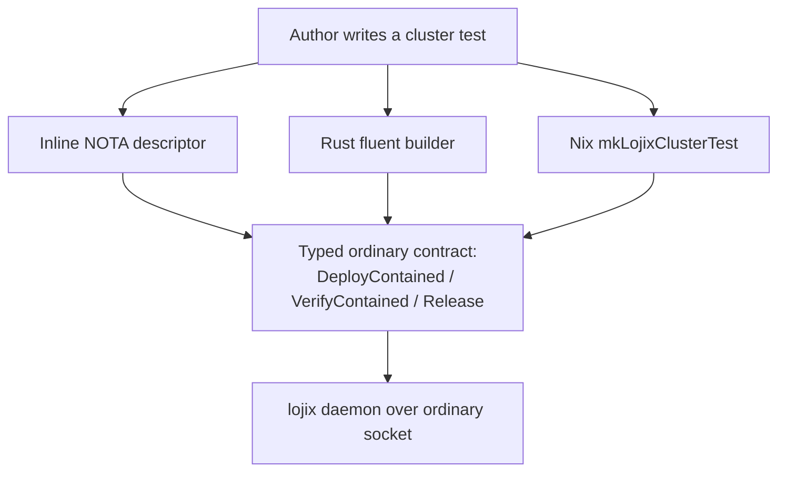

# A comfortable test-authoring interface for lojix's unified deploy/test — three styles, one typed contract

*System-designer study · 2026-06-21 · report 159*

The psyche asked for an easy-to-use public interface for writing tests on lojix's unified deploy/test (Spirit `vfgk`: "schema shorthands and developped option setting/querying") and to SEE a test written with it. This report presents three authoring styles — inline NOTA descriptor, Rust fluent builder, and a Nix `mkLojixClusterTest` spec — each writing the SAME criome/spirit/router cluster test, scored on ease-of-use vs faithful lowering to the corrected typed ordinary contract (report 158 + operator audit 234: `NodeProfile` vs `ProductionNode`, `VerifyContained`, `ContainedTarget`). All three scored 8/8 and lower to the same wire; the recommendation is inline-NOTA as the canonical surface, with the Rust builder and Nix wrapper as companions that *emit* it. Produced by a 15-agent workflow. The psyche's pick is requested in chat.

## What this report delivers

The psyche asked for a *comfortable, easy-to-use public test-authoring interface* for lojix's unified deploy/test, "with schema shorthands and developped option setting/querying" (Spirit `vfgk`), and asked to **see a test written with it**. The concrete demonstration is authoring a test for a **criome / spirit / router cluster**. This report presents three distinct authoring **styles**, each writing the *same* cluster test, scores them on ease-of-use versus faithfulness, recommends one, and shows precisely how the recommended style lowers to the corrected typed ordinary contract (`NodeProfile` vs `ProductionNode`).

Ease-of-use is the first-class metric. All three styles lower faithfully to the same typed substrate — the corrected signal-lojix ordinary contract (audit report 234, accepted): `DeployContained` → `VerifyContained` → `Release`, with `NodeProfile` the safe build target, `ContainedTarget` the throwaway substrate, and a required `PositiveSeconds` lease. None of them opens a stringly-typed or script-path escape hatch.

## The reframe this sits on

Testing and deployment are the same function — build a closure, bring it up on a target — differing only in **containment** (Spirit `mq5s`). lojix *is* the testing component. Safe contained testing is lojix's **ordinary** (signal-lojix) interface; privileged production deployment is its **meta** (meta-signal-lojix) interface. The ordinary/meta split is the typed safety boundary, and every authoring style here speaks only the ordinary face.

## The three styles at a glance



All three are lowerings onto one typed substrate; they converge at the generated request structs, so the wire is identical typed NOTA/rkyv whichever surface authored it (record `9ngl`).

## Style 1 — Inline NOTA descriptor (recommended)

The whole test is one positional-NOTA `TestDescriptor` value — a `.nota` file or one inline string handed to the `lojix` CLI (one argument, extension/`(`-prefix detected exactly like `nota-config`'s `from_argv`). The CLI is a thin client: parse, encode the typed frame, ship to the daemon. The daemon lowers the terse descriptor into the full typed triple, exactly the way the live `TestDefaults::lower` already expands `(Check [mercury])` into a resolved run (verified in `schema_runtime.rs`). `TestDescriptor` is a **new terse sibling root**, not an under-filled `DeployContainedRequest` — NOTA forbids tail-omission, so every shorter form must be its own typed variant the daemon expands (the documented `TestRequest [(Run …) (Check …)]` precedent, `meta-signal-lojix/schema/lib.schema:82-89`).

```
;; cluster-gate.nota  — SHORT COMMON CASE.  Run:  lojix cluster-gate.nota
;; (On …)     -> cluster + node profiles to BUILD (criome/spirit/router)
;; Hermetic   -> ContainedTarget::HermeticVm, profile knobs from TestDefaults
;; Gate       -> VerificationBody: the standard criome-gate three-case proof
(TestDescriptor (On fieldlab [criome spirit router]) Hermetic Gate)

;; cluster-gate-full.nota — SAME test, shorthand heads expanded to set options.
(TestDescriptor
  (On fieldlab [(criome FullOs) (spirit FullOs) (router OsOnly)])
  (HermeticVm (NetworkIsolation TapLayer3) (MaximumGuests 3))   ;; OPTION: target
  (Steps [
    (GateCase criome AuthorizedShips      (Threshold 1 [(KeyMember spirit-local-signer)]))
    (GateCase criome ThresholdShortDenied (Threshold 1 [(KeyMember spirit-local-signer)]))
    (GateCase criome UnconfiguredHeld     NoGate)
    (Probe (OutboxDrained spirit ServerCommitted))               ;; spirit gate drain
    (Probe (RouterFanOut router (InProcessStub AttendPublishDeliverMatching)))
    (DeployIntegrity criome) (DeployIntegrity spirit) (DeployIntegrity router)
  ])
  (Lease 900))                                                   ;; OPTION: PositiveSeconds

;; READ STATE BACK — same CLI, same grammar:
;;   lojix "(Query (ByTestRun (TestRunLookup fieldlab criome (Some 7))))"
;; None third field => all runs for the node, newest first; (Some 7) narrows to one.
```

## Style 2 — Rust fluent builder

A typed builder authored in lojix that a test author calls directly in `#[test]` code. Every setter is a method on a real data-bearing builder type (no free functions, AGENTS.md method-placement rule). It compiles against the generated signal-lojix types, so every knob is a closed enum or typed newtype — qkvx holds at compile time, and a wrong target is a missing-method error, not a runtime rejection. The builder is a *daemon client*: it emits typed NOTA/rkyv over the ordinary socket; it does not call criome/spirit/router in-process.

```rust
use lojix::author::{Cluster, On, Verify, Gate, Probe};
use lojix::author::dx::full_os;
use signal_lojix::ComponentKind;

#[test]
fn criome_spirit_router_cluster() {
    let run = Cluster::named("fieldlab")
        .flake("github:LiGoldragon/CriomOS").source("designer-dx-demo")
        .node(full_os("criome"))                       // NodeProfile { fieldlab, criome, Some(FullOs) }
        .node(On::node("spirit").full_os().on_host("atlas"))
        .node(On::node("router").os_only())
        .contained(On::hermetic().network(On::cross_machine()).maximum_guests(3))
        .lease_seconds(900)                            // PositiveSeconds (rejects zero)
        .verify(Verify::steps()
            .gate(Gate::on(ComponentKind::Criome).authorized_head_ships()
                  .then_probe(Probe::fanned_out_to(ComponentKind::Router)))
            .gate(Gate::on(ComponentKind::Criome).threshold_short_denied()
                  .then_probe(Probe::outbox_holds(1)))
            .gate(Gate::on(ComponentKind::Criome).unconfigured_held()
                  .then_probe(Probe::outbox_holds(1))))
        .deploy();                                     // live ClusterHandle; .run() auto-releases

    assert_eq!(run.node("spirit").run_record().host(), Some(NodeName::from("atlas")));
    run.query(Query::runs_for("router"));              // (Query (ByTestRun TestRunLookup))
    run.release_all();
}
```

## Style 3 — Nix declarative spec

The test is one Nix attrset in the `runNixOSTest` / `mkCriomeClusterTest` tradition — the natural successor to today's `mkVmTest { cluster, hostNode, vmNode, testScript }` auto-pickup generator, generalized from one guest to a named cluster. `mkLojixClusterTest` lowers the attrset to one typed `DeployContained` per member plus a shared `VerifyContained` body plus a `Release`, and exposes the whole thing as a `flake check` so `nix flake check` runs it. Role-derived defaults match `mkVmTest`: omit `kind` → `FullOs`, omit `target` → `HermeticVm`, omit `lease` → cluster default. An eval-time `assertModel` fails the check before any daemon round-trip.

```nix
{ mkLojixClusterTest, lojix }:
let inherit (lojix) hermeticVm vmHostGuest flakeCheck gateThreeCases
                    steps waitFor runInGuest seconds; in

# SHORT COMMON CASE — three FullOs hermetic members, default lease, per-member check.
mkLojixClusterTest {
  cluster = "fieldlab";
  members = [ "criome" "spirit" "router" ];     # kind omitted -> FullOs
  verify  = flakeCheck;                         # per member: vm-<member>
}

# SAME test with options SET:
mkLojixClusterTest {
  cluster = "fieldlab";
  members = [ "criome" "spirit" { name = "router"; kind = "OsOnly"; } ];
  target  = vmHostGuest { onHost = "atlas"; };  # OPTION: ContainedTarget::VmHostGuest
  lease   = seconds 1200;                        # OPTION: typed PositiveSeconds
  verify  = gateThreeCases {                     # OPTION: gate body (authorable now, executed wave-4)
    contract = "Threshold-1-of-1"; signer = "spirit-local-signer";
    authorized     = { ships = true;  durability = "ServerCommitted"; };
    thresholdShort = { ships = false; durability = "QueuedForMirror"; };
    unconfigured   = { ships = false; held = true; };
    fanout = steps [ (waitFor "router.attended criome")
                     (runInGuest [ "router-probe" "--expect-delivery" "criome" ] "Delivered") ];
  };
}
```

## Comparison

| Style | Ease | Faithfulness | Common-case size | Audience | Net-new surface | Author-time validation |
|---|---|---|---|---|---|---|
| Inline NOTA descriptor | 8 | 8 | 3 lines, no host language | Public (any author) | Least — rides shipping `TestDefaults::lower`, sibling-variant, one-arg CLI | None until daemon lowers (mitigable: CLI NOTA-shape pre-check) |
| Rust fluent builder | 8 | 8 | ~8 lines, Rust only | In-repo `#[test]` authors | Builder library + generated constructors (exist) | Compile-time (best) |
| Nix declarative spec | 8 | 8 | 3 fields, Nix only | CI / cluster auto-pickup | Hand-maintained Nix builder mirror (drift risk) | Eval-time `assertModel` |

The three scored identically. The tie breaks on *who authors and how much each demands*: inline-NOTA is the only style whose authoring surface **is** schema shorthands, the only one with no host-language gate (true "public" reach), the only one where setting and querying share one grammar, and the least net-new.

## Recommendation

**Adopt inline-NOTA as the default public surface, with the short form `(TestDescriptor (On <cluster> [<nodes>]) Hermetic Gate)` as the canonical common case.** Keep the Rust fluent builder as the in-repo programmatic companion and the Nix `mkLojixClusterTest` as the CI/auto-pickup wrapper. The three are not rivals: they compose. The Nix wrapper should **emit the inline-NOTA descriptor** rather than maintain a hand-built Nix builder mirror (this dissolves its drift liability); the Rust builder's `.run()`/`.deploy()` can serialize the *same* `TestDescriptor` (giving Rust authors a checked-in `.nota` artifact and CLI parity). Inline-NOTA becomes the canonical serialization; Nix and Rust are typed front-ends that emit it — the same relationship schema-rust-next already has to Rust. The one ease-of-use cost (no author-time validation) is bounded and fixable with a CLI NOTA-shape pre-check, and is exactly the gap the Rust companion fills for authors already in Rust.

## How the recommended style lowers to the corrected typed contract

The CLI does **no** lowering — it parses the `TestDescriptor` NOTA, encodes the typed ordinary frame, and ships it. The daemon lowers on receipt, mirroring `TestDefaults::lower`, emitting the corrected report-234 triple:

1. **`(On fieldlab [criome spirit router])` → one `DeployContained` per member.** Each cluster+name pair becomes `NodeProfile { ClusterName NodeName kind }` (kind defaulting to `FullOs`, or the explicit `(router OsOnly)` pair). `NodeProfile` is the **profile to build** — building any node's config, including a real node's, is safe. There is no `ProductionNode` anywhere in scope: it lives only in meta-signal-lojix (the live-mutation / generation-promotion target), and the CLI speaks only `signal_lojix::Input`. So an ordinary author **structurally cannot** name a real node as a `Switch`/`Boot` target — the safety invariant holds by type scope, not a runtime guard. This is the precise `NodeProfile`-vs-`ProductionNode` split, verified live in the operator worktree (`NodeProfile { ClusterName * NodeName * kind (Optional DeploymentKind) }`).

2. **`Hermetic` / `(HermeticVm …)` → `ContainedTarget::HermeticVm(HermeticVmProfile { NetworkIsolation MaximumGuests })`**, the wave-1 `runNixOSTest` substrate, filled from defaults or the written sub-record. `EphemeralDroplet` lowers to a `SubstrateUnavailable` rejection until guardrails exist.

3. **`Lease 900` / omitted → the required `PositiveSeconds` field** on each `DeployContainedRequest`; omission fills the daemon default; over-cap is a typed rejection, never a silent clamp (the nonzero property is a typed newtype; the configured maximum is daemon policy, not a schema guarantee).

4. **`Gate` / `(Steps […])` → one `VerifyContainedRequest { TestRunIdentifier VerificationBody }`** per handle. The verb is `VerifyContained`, **not** `AssertAgainst` (Assert is a Sema-class word, audit 234 finding 2). The body `[(FlakeCheck …) (DeployIntegrity {}) (Steps (Vec VerificationStep))]`: the `GateCase` steps carry the typed `Rule::Threshold(1, [KeyMember …])` BLS contract and the three closed outcomes; `Probe (OutboxDrained …)` is the spirit gate's drain-on-authorized; `Probe (RouterFanOut … (InProcessStub …))` is router's honest wave-1 in-process proof.

5. **`Release ReleaseRequest { TestRunIdentifier }`** reaps after verify, backstopped by the lease-expiry reaper. Honesty is preserved everywhere: a missing default is a typed rejection (`NoTestDefaults`-class), never a guess.

Every emitted atom is bare positional NOTA, type-head-first, no quotation marks, no labeled key-value, and no string carries a script path.

## Option setting and querying

**Setting.** Two altitudes, one grammar, no flags (the daemon takes one rkyv startup arg; the CLI takes one NOTA arg). At the high altitude each option is a **shorthand head** the daemon's lowering fills from a `TestDefaults`-style config noun: `Hermetic` → `(HermeticVm <default profile>)`, `Gate` → the standard `Steps` body, omitted `Lease` → the default `PositiveSeconds`. To set an option, you **replace the shorthand head with its fuller positional sub-record** in the same descriptor slot — `Hermetic` becomes `(HermeticVm (NetworkIsolation TapLayer3) (MaximumGuests 3))`. There is no separate options block: the descriptor *is* the option surface, every field positional, every knob a closed enum (`NetworkIsolation [SharedHost TapLayer3 CrossMachine]`, `DeploymentKind [FullOs OsOnly HomeOnly]`) or typed newtype (`Lease` → `PositiveSeconds`). Optional knobs use `(Some x)` / `None`, so an unset option is structurally `None`, never an empty string.

**Querying.** State is read with a sibling `(Query …)` descriptor handed to the same CLI:

```
lojix "(Query (ByTestRun (TestRunLookup fieldlab criome (Some 7))))"
```

This lowers verbatim to the shipped `Selection [(ByNode …) (ByTestRun TestRunLookup) …]` enum (the generated `Selection::by_test_run` constructor is confirmed in `signal-lojix/src/schema/lib.rs:1686`). The `(Optional TestRunIdentifier)` field narrows from all-runs-for-node (`None`) to one run (`(Some 7)`) — confirmed live as `TestRunLookup { ClusterName * NodeName * run (Optional TestRunIdentifier) }`. The reply is the typed `TestRunRecord` rows (phase, outcome, closure_path) printed back as NOTA. Live progress rides the existing `WatchDeployments` request → `SubscriptionToken` handshake (schema-next cannot yet emit a push-stream frame). Setting and querying are the same positional-NOTA grammar, learned once.

## Wave-1 honesty (holds regardless of style)

The default `Hermetic` + per-node `DeployIntegrity`/`FlakeCheck` body is the runnable wave-1 substrate. The rich `Gate` three-case body (criome BLS gate: authorized-ships / threshold-short-denied / unconfigured-held) is **authorable now, executed later** — it lowers to a typed `Steps` body the daemon does not yet run (wave-4 typed-body-on-the-wire; today it lives only as Rust in `spirit/tests/criome_gate_1of1.rs`). Router has no NixOS module or cluster role, so it must lower to its honest in-process `RouterRuntime` fan-out shape, not pretend a hermetic guest member; the short form's `Gate` expansion must encode that stub so `[criome spirit router]` never over-promises three equal guests.

## Coordination dependency

Every style authors against the corrected audit-234 contract, but the operator's live in-flight worktree (`system-operator-contained-test-poc`) still ships the **uncorrected** shape — verified directly: `CheckContained ContainedCheck` (not `VerifyContained`), a degenerate `ContainedCheck { TestRunIdentifier }` with no verification body, no `lease` field on `DeployContainedRequest` (it carries only `NodeProfile + ContainedTarget + source + flake`), and stale `LiveNotYetEnabled` in `DeployContainedRejectionReason`. The worktree also does not compile (the daemon still dispatches the deleted `meta::Input::Test`). None of the three styles can run end-to-end until operator+designer reconcile the verb name (`CheckContained` vs `VerifyContained` — both avoid the Sema word `Assert`, so this is a naming convergence, not a correctness fight), add the typed `VerificationBody`, add the required lease, and strip the stale reasons. This is a coordination item on the operator's lane, not a design flaw — land the `TestDescriptor` lowering arm alongside the `DeployContained`/`VerifyContained`/`Release` arms the operator still owes; do not duplicate the daemon-dispatch migration.
