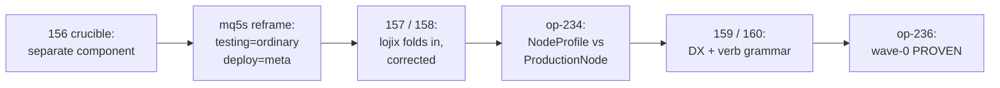
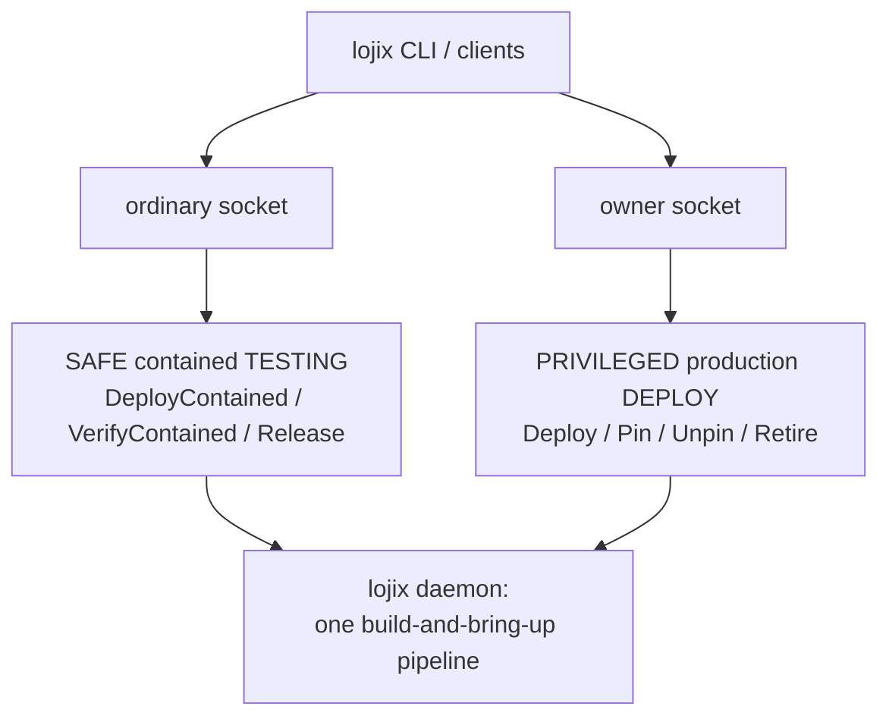
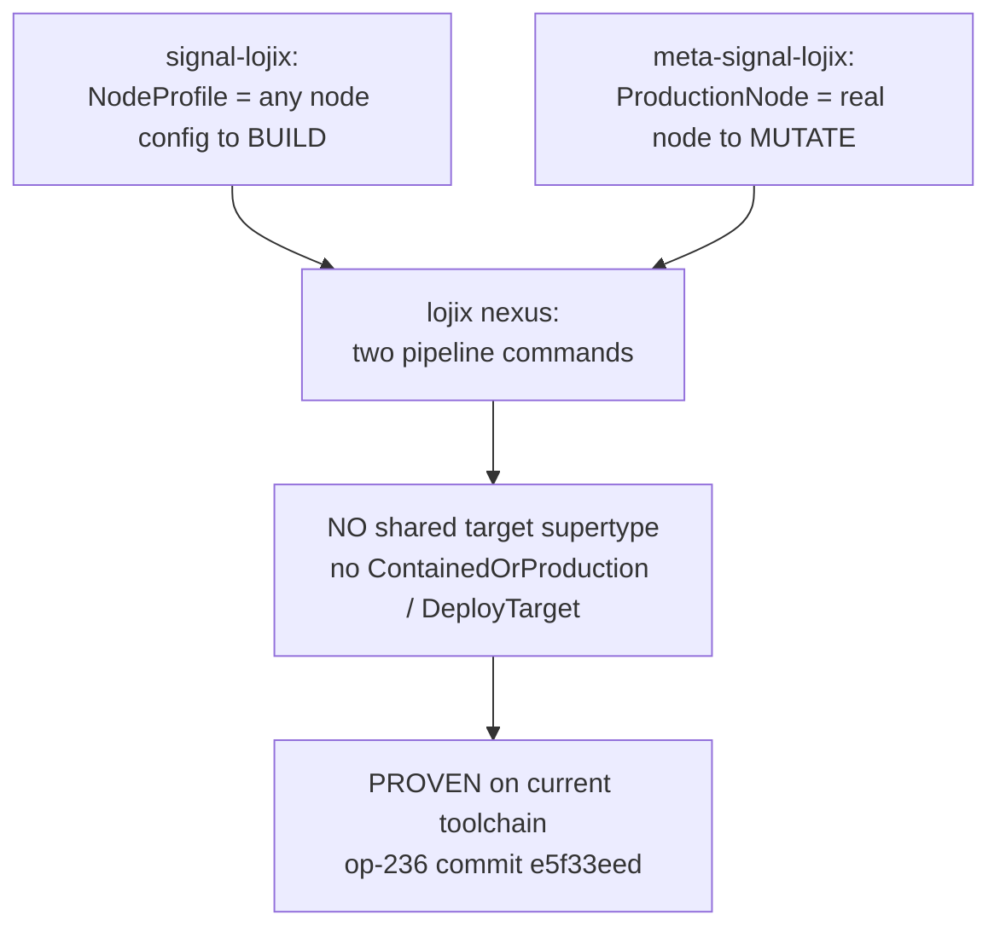
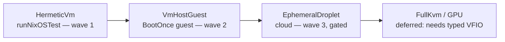
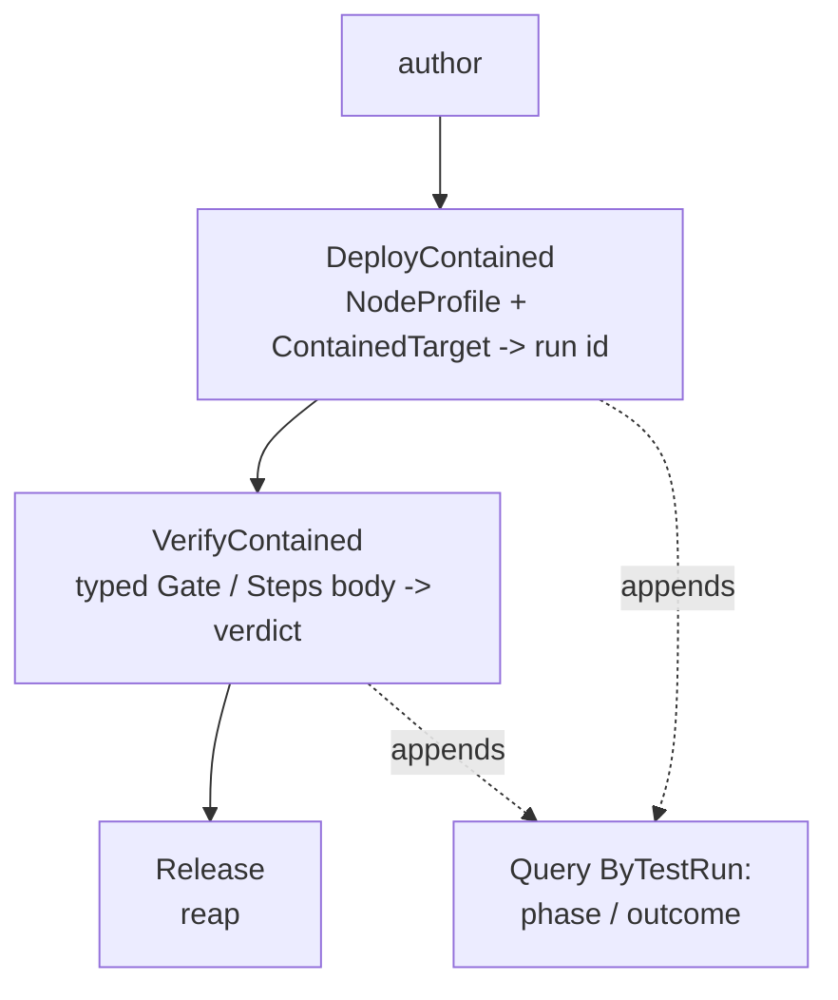
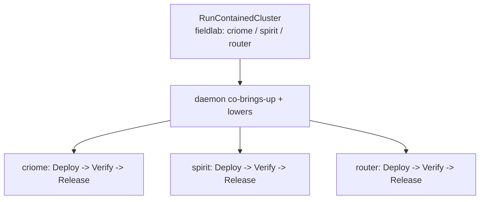
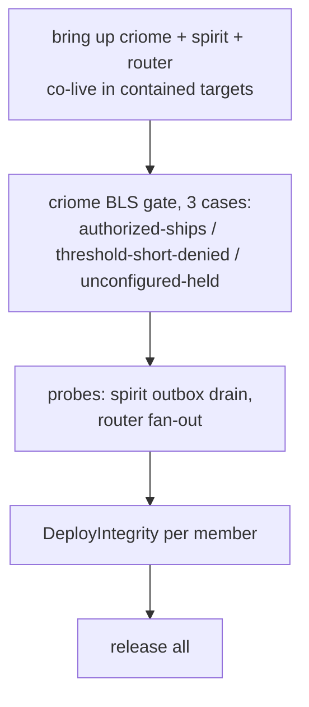
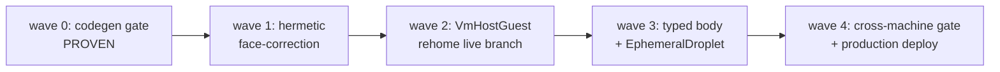
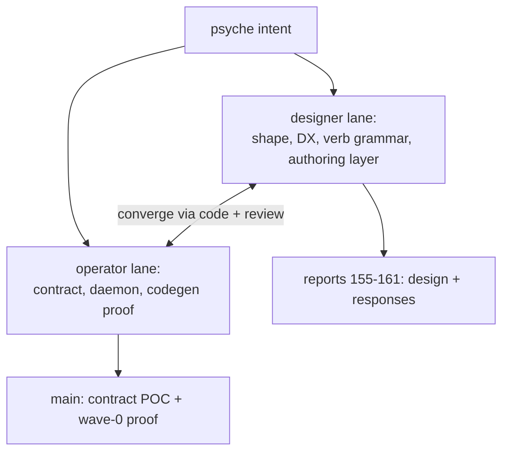

# State of the lojix unified deploy/test design — full visual re-assessment

*System-designer study · 2026-06-21 · report 161*

A complete, visual re-presentation of the whole arc: from the separate "crucible" testing component, through the psyche's reframe, to today's converged design — **lojix is one component with two faces**: safe contained *testing* on the ordinary signal, privileged production *deployment* on the meta signal. The typed safety boundary is now **proven on the live schema toolchain** (operator wave-0). This report maps every thread — the reframe, the boundary, the substrate spectrum, the verb grammar, the comfortable authoring layer, the criome/spirit/router cluster test, the wave plan, the intent layer, the designer↔operator convergence, and the open questions with recommendations.

## 1. Where we are, in one paragraph

The design has **converged**. Testing and deployment are the same function — build a closure, bring it up on a target — differing only in containment, so the deploy component (lojix) *is* the testing component (Spirit `mq5s`). Safe contained testing is lojix's **ordinary** face; privileged production deployment is its **meta** face; the ordinary/meta split is the typed safety boundary. That boundary is no longer a claim: the operator discharged the make-or-break **wave-0 codegen gate** on the current toolchain — ordinary names a `NodeProfile` to *build*, meta names a `ProductionNode` to *mutate*, and codegen routes both into one daemon pipeline with **no shared target supertype**. The public verb grammar is settled — `DeployContained` / `VerifyContained` / `Release`, with status via `Query` — and a comfortable NOTA authoring layer (sibling-variant shorthands + option-vectors) lowers onto it. The demonstration target is a criome/spirit/router cluster test.

## 2. The arc — how we got here



| Report | Established | Status |
|---|---|---|
| 155 | Durable vm-testing node live on prometheus (the deploy substrate) | Landed |
| 156 | `crucible` as a **separate** testing component (own triad) | Superseded (framing) |
| Spirit `mq5s` | **The reframe**: testing = lojix ordinary, deployment = lojix meta; no separate component | Captured |
| 157 | lojix folds in (reconciliation) | Superseded by 158 |
| 158 | Corrected reframe + POC contracts + wave plan + adversarial critique | Canonical design |
| op-234 | `NodeProfile` vs `ProductionNode` safety split (the greatest finding) | Accepted, folded |
| 159 | Three DX authoring styles (inline-NOTA recommended) | Landed |
| 160 | Comfortable cluster authoring + NOTA correction + verb grammar | Canonical authoring |
| op-235 | Verb-shape question (`Check` vs `Verify`) | Answered in 160 |
| op-236 | **Wave-0 proven on live toolchain** + 160 accepted | Landed |
| op-237 | Operator companion visual synthesis (proof/debt snapshot) | Companion to 161 |
| 161 | This visual re-assessment | Canonical wide-angle map |

## 3. The reframe — one component, two faces



The deploy *body* is shared; only the **target type** and the **socket** differ. The ordinary face needs no production authority because it can only ever touch throwaway targets; the meta face is owner-gated because it mutates real infrastructure. The ordinary/meta line and the contained/production line are **one line**.

## 4. The typed safety boundary — and the wave-0 proof



The audit-234 correction made the invariant precise: ordinary may name a *profile to build* (safe — building any node's config is harmless) but **cannot use a real node as the live-mutation or generation-promotion target**. The operator then *proved* codegen keeps the two target types separate without inventing a sum type — the type-safety thesis survives the real toolchain (`cargo test --test lojix_contained_wave0`). The earlier POC had dodged this by pinning an old `schema-next`; that pin is removed.

## 5. The contained-target spectrum



| Variant | What | Containment | Wave |
|---|---|---|---|
| `HermeticVm` | Sandboxed `runNixOSTest` VM | Own kernel, zero host effect | 1 (proven path) |
| `VmHostGuest` | On-demand guest by `VmHost` capability, `BootOnce` | Throwaway on a capability-resolved host, host untouched | 2 (rehome live branch) |
| `EphemeralDroplet` | Cloud droplet lojix provisions + reaps | Fresh per-run identity; daemon-bounded spend | 3 (gated `SubstrateUnavailable`) |
| `FullKvm`/GPU | Display/GPU-passthrough VM | — | Deferred (no typed VFIO in `NodeService` yet) |

## 6. The public verb grammar (converged)



| Verb | Face | Meaning |
|---|---|---|
| `DeployContained` | ordinary | Build a `NodeProfile` into a `ContainedTarget`; returns a run id |
| `VerifyContained` | ordinary | Run a typed `VerificationBody` (`Gate`/`Steps`) against a run; returns a verdict |
| `Release` | ordinary | Reap the contained run (always legal + idempotent) |
| `Query (ByTestRun …)` | ordinary | Read run status (phase/outcome) — the single status source |
| `Deploy`/`Pin`/`Unpin`/`Retire` | meta | Privileged production mutation, owner-gated |

The op-235 convergence: **`CheckContained` dissolves**. It had conflated "what is the status?" (a read → `Query`) with "execute a check" (an action → `VerifyContained`). Splitting them removes the store-peek ambiguity the operator flagged. The operator accepted this in 236 as "the shape before downstream is hardened."

## 7. The comfortable authoring layer — and the criome/spirit/router test

A terse cluster root lowers to the per-node triple — a *lowering over schema roots, not a parallel DSL* (operator insight): short forms are typed variants that lower to the full contract.



The short common case, in correct NOTA (every token a positional **variant**, shorthand = terser sibling variant, options = a vector of option-variants):

```nota
(RunContainedCluster (fieldlab [(Member criome) (Member spirit) (Member router)] HermeticVm Gate []))
```

The verification flow `Gate` expands to:



NOTA discipline corrected this turn: `(MaximumGuests 3)` is a *variant* of an option enum in a `(Vector ClusterOption)`, never a labeled field; struct bodies are positional and untagged; `Gate` is a sibling shorthand variant the daemon lowers. (Earlier sketch conflated labels with variants — fixed; Spirit `vfgk` sets ease-of-use as first-class.)

## 8. The wave plan



| Wave | Goal | Status |
|---|---|---|
| 0 | Codegen keeps ordinary/meta target types separate, one pipeline, no supertype | **Proven** (op-236) |
| 1 | Hermetic contained testing on ordinary; delete meta `Test`; `CheckContained`→`VerifyContained`+`Query` | In progress (operator downstream convergence) |
| 2 | Re-home the `live-deploy-test-chain` branch as `VmHostGuest` (not `TestMode::Live`) | Queued |
| 3 | Typed `VerificationBody` on the wire; `EphemeralDroplet` behind confused-deputy guardrails | Queued |
| 4 | One propagation test across all substrates; cross-machine `jk1w` quorum; production `Deploy` on meta | Queued |

## 9. Designer ↔ operator convergence



| Lane | Owns | Recent |
|---|---|---|
| Designer (me) | The reframe shape, the safety-invariant correction acceptance, the NOTA-correct authoring DX, the verb grammar | 156-161; answered op-235 verb question |
| Operator | The ordinary/meta contract, the daemon lowering, the **wave-0 codegen proof** | contract POC + op-234/235/236; wave-0 discharged |

The lanes are tightly converged: the operator's 236 accepts the designer's verb grammar and `source` call; the designer accepts the operator's `NodeProfile` split and `CheckContained` naming. Communication is through implemented code + cross-audits, as the parallel-lane model intends.

## 10. The intent layer

| Record | Binds |
|---|---|
| `mq5s` | The reframe — testing=ordinary, deployment=meta, no separate crucible |
| `cpip` | One reusable testing interface + three substrates + spirit-gate propagation — *is* lojix ordinary |
| `vfgk` | The test interface must be easy: schema shorthands, option setting/querying |
| `ki6i` | When directed to implement/show, act and deliver — don't block on questions |
| `vudl` | `Deploy`/`Pin`/`Unpin`/`Retire` owner-only (consistent with the reframe; not a conflict) |
| `77ic` / `g7yd` | Durable on-demand node = `VmHostGuest`; substrate selected by typed capability |
| `qkvx` | Typed end-to-end; no string/script-path hacks |
| `7let` / `se72` | Containment *is* the testing safety property; host-untouched |
| `0a9p` / `cncj` / `y1v5` / `8f8e` / `lt44` | AI-node-only heavy work; GPU passthrough; visual tier; lightweight sandbox |
| `tvbn` | The lojix rewrite charter — finish to cutover |

Two decisions from this turn (deploy-auth = owner `SO_PEERCRED` only for now with criome built-but-off; unprivileged ordinary callers may cause bounded cloud spend) are recorded in report 158's corrections section — the Spirit guardian judged standalone records duplicative of `vudl`/`7kyx`/`pviw`, so they live in the report + design rather than as separate records.

## 11. Open questions, with designer recommendations

The operator's 236 questions, answered (act-don't-block):

| # | Question | Recommendation |
|---|---|---|
| 1 | `VerifyContained` return verdict only, or also append a run event? | **Both** — the verdict is the immediate reply; appending a run event makes `Query (ByTestRun …)` the single durable status source |
| 2 | `Release` gated on a successful verify, or always idempotent cleanup? | **Always legal + idempotent** — teardown must work for failed/unverified runs; the lease-expiry reaper also releases |
| 3 | `source` required, or optional with authoritative override? | **Optional with authoritative override** (agree) — convenience default, but per-call provenance must work |
| 4 | Rename `TestRun*` storage → `ContainedRun*` now? | **Yes, now** — pre-production; the noun is "contained run," and names should reflect the noun before `VmHostGuest` lands |
| 5 | `RunContainedCluster` as a public `signal-lojix` root, or a thin client helper? | **Public root, daemon-owned lifecycle coordinator** — *converged with the operator* (who revised from helper-first to daemon-owned): a multi-node cluster needs co-live setup, release-all, failure cleanup, restart reconciliation, and queryable cluster history — all of which belong in the daemon, not a client macro, once the lower `DeployContained`/`VerifyContained`/`Release`/`Query` roots are corrected |

**All five are now converged**, not open: the operator's report-237 leans match these recommendations on Q1–Q4, and his latest daemon-owned-coordinator insight matches Q5 — so they are settled design that hardens into the contract as the operator's downstream convergence lands, not questions still in dispute. Operator report 237 is the companion proof/debt snapshot to this map.

Cross-cutting open items: `EphemeralDroplet` stays `SubstrateUnavailable` until its confused-deputy guardrails (quota credential, caps, SEMA lease, restart reconciliation, quota-split negative test); production-deploy verdict tier is owner-`SO_PEERCRED` only for now (criome capability built, off by default); router joins the cluster test as an honest `RouterFanOut` stub until its source compiles against the new schema stack; the typed `VerificationBody` on the wire is wave-3.

## 12. What is proven, what is next

**Proven / settled:** the reframe (one component, two faces); the typed safety boundary and its codegen on the live toolchain (wave-0); the verb grammar (`DeployContained`/`VerifyContained`/`Release` + `Query`); the NOTA-correct comfortable authoring shape; the `NodeProfile`-vs-`ProductionNode` split.

**Next:** operator downstream convergence (rename verbs, make `source` authoritative, route reads/release through sema-engine, drop `CheckContained`); re-home the live branch as `VmHostGuest` (wave 2); then the typed verification body + cloud droplet (wave 3) and the cross-machine propagation + production deploy (wave 4). The designer next step is landing the `RunContainedCluster` authoring layer as a public ordinary root once the lower contract stops conflating status/source/release — the operator's stated ordering, which I endorse.
