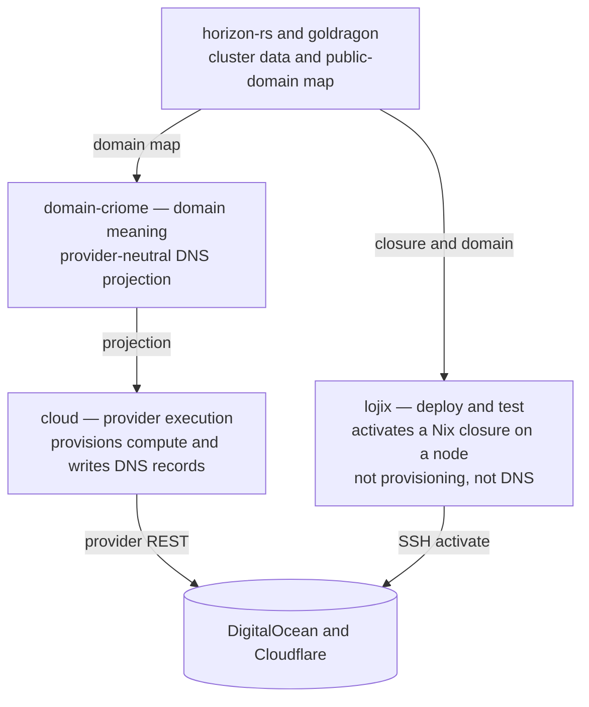
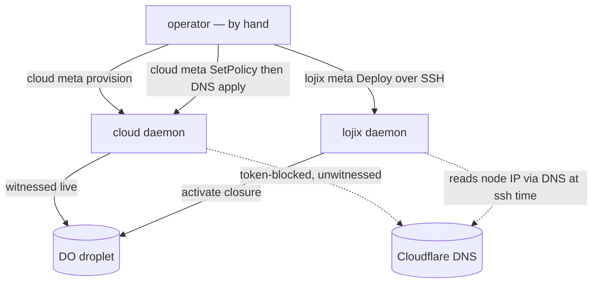
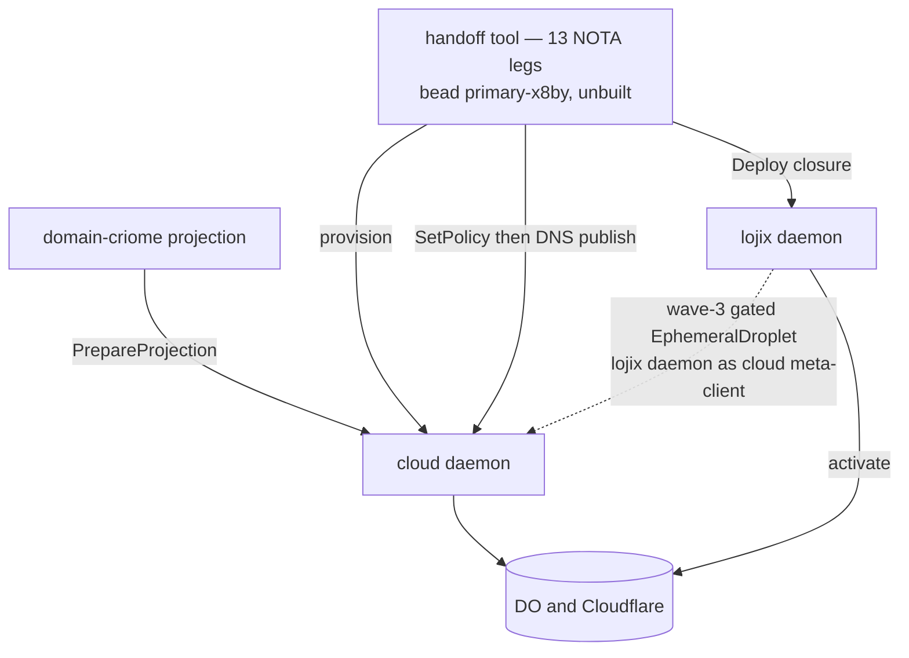

# Does lojix use cloud for cloud-infra deployment and DNS? — built vs designed

*System-designer study · 2026-06-22 · report 162*

**Short answer: no to both, today — and yes to both, by design.** lojix has **zero** code dependency on `cloud`/`signal-cloud` (a `Cargo.toml` + `src` grep for `cloud`/`hetzner`/`digitalocean`/`droplet`/`dns`/`cloudflare` returns no match — only a doc comment at `lojix/src/lib.rs:177` and a `SubstrateUnavailable` rejection string at `daemon.rs:744`). The `cloud` component **does** provision DigitalOcean compute (witnessed live) and **does** write Cloudflare DNS records (code-complete, never witnessed) — but today both are driven by the **operator by hand**; the two daemons never call each other. Verified by a 4-agent ground sweep over `cloud`, `lojix`, `domain-criome`, and `horizon-rs`/`goldragon`.

## Division of labor

- **lojix** = deploy/test. It builds an OS/cluster Nix closure and *activates* it on a target node over SSH (or runs a host-untouched microVM test on a cluster vmhost). It owns **activation**, not provisioning and not DNS.
- **cloud** = provider *execution*. The only component that actually provisions compute (DigitalOcean live; Hetzner adapter built but unshipped) and the only one that writes public DNS records (Cloudflare). Mutate-on-meta / Query-on-ordinary.
- **domain-criome** = domain *meaning*. The `.criome` registry, intelligent resolution, and **provider-neutral** DNS-record projection. It never calls a provider — it hands a projection to cloud via `meta-signal-cloud::PrepareProjection`.
- **horizon-rs / goldragon** = cluster config + the public-domain map (`goldragon` owns `goldragon.criome.net`). `NodeSpecies::CloudNode` now exists on `horizon-rs` main; the CriomOS cloud-image module is branch-only.

The two daemons share **no wire contract** — they are joined only by a node domain/IP plus a CriomOS closure (name-equality on `node.cluster.criome`).

## Today — operator-hand-threaded, no daemon-to-daemon call

lojix deploys to nodes that **already exist**. It does not provision a provider VM, and it has no DNS surface at all — it *relies* on the A record being published out-of-band and derives the node IP via DNS at ssh time.

## Designed — the cloud→lojix handoff (bead `primary-x8by`)

Two designed paths put cloud *under* lojix:
1. **The node-bringup handoff** (reports 72/80/81): cloud provisions (legs 1–5), cloud publishes the A record via its own Cloudflare op (legs 6–11, after a **mandatory** `SetPolicy` — without it DNS `ApplyPlan` returns `ProviderNotConfigured`), then lojix `Deploy` build-on-target (legs 12–13). DNS is a **side-branch off the lojix deploy spine**, explicitly off-node. The glue tool (13 ordered NOTA legs, zero new wire field) is the one piece that does not exist yet — bead `primary-x8by`.
2. **The `EphemeralDroplet` contained-test tier** (reports 158/161): lojix's *own daemon* becomes an async multi-peer cloud meta-client to provision + reap throwaway test droplets. **Wave-3, gated `SubstrateUnavailable`, no code** — typed in the operator POC contract (`EphemeralDropletTarget { ProviderName region CostCeilingCents }`) but both daemon arms return `SubstrateUnavailable`.

## Built vs designed

| Capability | Status | Owner | Witnessed |
|---|---|---|---|
| Provision compute (droplets) | **Built** | cloud (DigitalOcean) | Live one-time over real sockets (reports 70/76, droplets 578873541 / 579047618) |
| Write DNS records | Built in code | cloud (Cloudflare) | **No** — token-blocked, never run against a real zone (report 69) |
| Deploy a closure to an existing node | **Built** | lojix (SSH activate) | Yes |
| lojix → cloud provisioning | Designed, **unbuilt** (wave-3 gated) | — | — |
| cloud → lojix bringup handoff tool | Designed, **unbuilt** (bead `primary-x8by`) | — | — |
| DNS via lojix | **Never** — lojix has no DNS surface by design | cloud owns DNS | — |
| DNS settings / redirect rules | Sketched, **unsupported** (apply rejects redirect changes) | cloud | — |

## Caveats that matter

- **"Witnessed" is uneven.** DO compute = a real *one-time manual* run over sockets (report 70), not a committed/CI test (the committed socket tests stop at observation + a registration that rejects `CredentialHandleUnknown`; ApplyPlan tests are in-process with a mocked Api — audit D17). DNS = **not witnessed at all** (wrong gopass path `cloudflare/api-token` vs `cloudflare.com/token`, plus a token missing Zone:Read/DNS:Edit — report 69).
- **Shipping gap:** only DigitalOcean ships compute, and only via the **non-default** flake package (`apps.daemon-digitalocean`, `--features digitalocean,cloudflare`). The default cloud-daemon is **Cloudflare-DNS-only** and returns `RequestUnsupported{CapabilityNotCompiled}` for host requests. Hetzner ships in no package; GoogleCloud is a stub.
- **Two DNS planes — don't conflate.** PUBLIC Cloudflare DNS (A/AAAA at the edge IP, ACME DNS-01 TXT) = cloud's job. INTERNAL `CriomeDomainName` (`<node>.<cluster>.criome` via tailnet/MagicDNS) = `horizon-rs`/`goldragon`. "DNS setup" means the public Cloudflare plane.
- **The lojix reframe is worktree-only:** the canonical `/git` lojix main still carries the old `Test`-on-meta shape; the `DeployContained`/`ContainedTarget` reframe (and the `EphemeralDroplet` typed surface) live only in the operator POC worktree.
- **Cloud soundness debt on the live path:** state is in-memory `Mutex` tables (no durable SEMA), and a single serializing engine does blocking provider IO inside the async handler (audit D2/D12). These bound how far cloud can be trusted as a backend before lojix leans on it.
- Reports 73–81 (CloudNode DO deploy, cloud-node image/home, website-hosting/`doris` per Spirit `878r`) postdate the report-72 handoff and are the current source of truth for the website-hosting deploy/DNS picture.

## The path from "no" to "yes"

For lojix to actually use cloud: (1) cloud lands its prerequisites — `ensure_ssh_key` on create (D14), a committed socket-`ApplyPlan` test (D17), an async non-blocking client (D2), and a real Cloudflare token (report 69); (2) build the cloud→lojix handoff tool (bead `primary-x8by`); (3) for contained testing, un-gate the `EphemeralDroplet` tier behind its confused-deputy guardrails (wave-3). Until then, cloud and lojix are two capable daemons a human strings together by hand.
