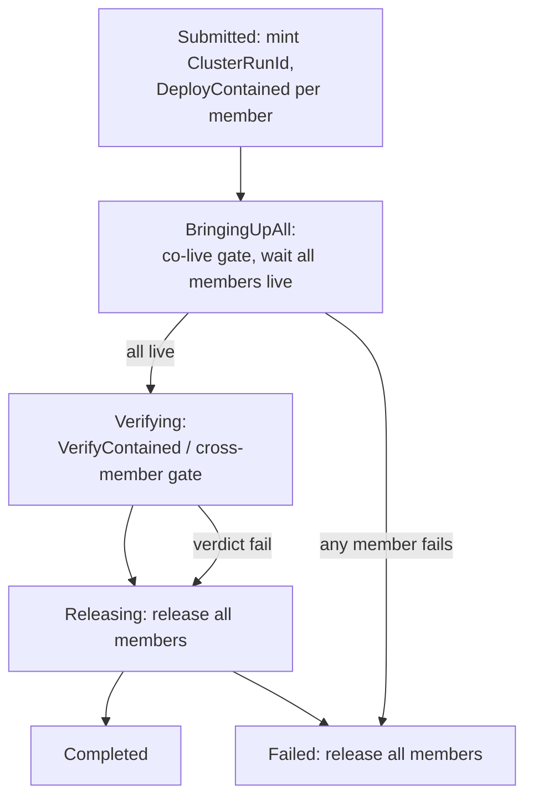
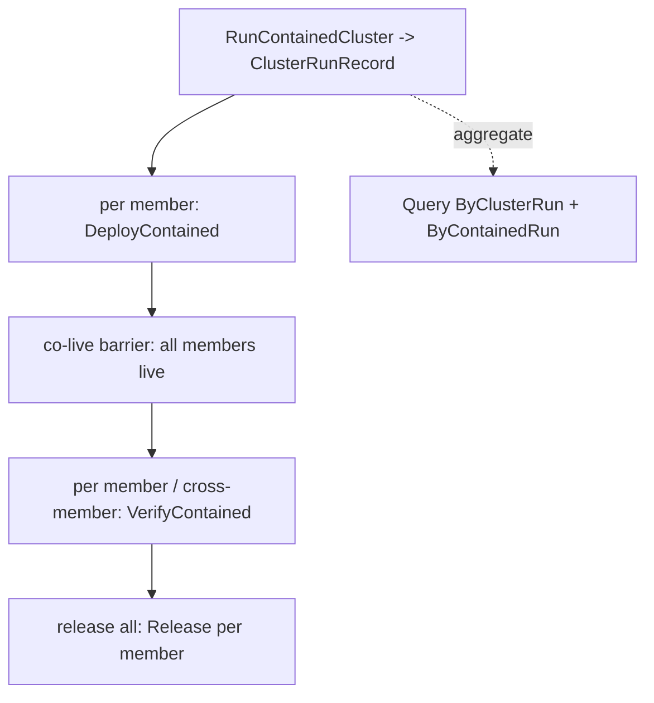

# RunContainedCluster — the daemon-owned cluster-coordinator spec

*System-designer study · 2026-06-22 · report 163*

We extend lojix (not a new component). The lower contract is converged — `DeployContained` / `VerifyContained` / `Release` + status via `Query`, `source` authoritative, `ContainedRun*` naming — and the operator owns landing that bridge (replace the old `Test(Check/Run)` pilot in `lojix/tests/test_op.rs`, rename, route through SEMA). This report specs the one piece designer and operator both settled as daemon-owned but never wrote down: **`RunContainedCluster` as a cluster lifecycle coordinator**. It lands *on top* of the corrected lower contract — last, per the agreed ordering. Reports 160 (authoring shape) and 161 §5 (daemon-owned decision) are the inputs; this fills the lifecycle gap.

## Why a coordinator, not a client macro

A client helper issuing N `DeployContained` + `VerifyContained` + `Release` calls **cannot** guarantee the four things a real multi-node cluster test needs — so they belong in the daemon, which owns durable state and lifecycle:

1. **Co-live setup** — a networked cluster test (criome/spirit/router talking to each other over the gate) requires *all* members up before verification runs. A single `DeployContained` can't express "wait for my siblings"; the coordinator gates verify on all-live.
2. **Release-all** — partial failure must reap *every* member, not strand the ones that came up.
3. **Restart reconciliation** — a daemon crash mid-run must, on resume from SEMA, find non-terminal cluster runs and release their still-live members (no orphans, no spend leak on the droplet tier).
4. **Queryable cluster history** — one durable cluster-run record aggregating the member runs, so `Query` answers "how did the fieldlab cluster run go?" not just per-member.

## The cluster-run record (queryable history)

A `RunContainedCluster` mints a `ClusterRunRecord` that aggregates the per-member `ContainedRun`s. Positional NOTA, struct bodies untagged, enum values variant-headed:

```
ClusterRunIdentifier Integer
ClusterRunRecord {
  ClusterRunIdentifier
  ClusterName
  (members (Vector ContainedRunIdentifier))   ;; the per-member contained runs this cluster owns
  ClusterRunPhase
  ClusterOutcome
}
ClusterRunPhase    [Submitted BringingUpAll AllLive Verifying Releasing Completed Failed]
ClusterOutcome     [Pending Passed (Failed ClusterFailureStage)]
ClusterFailureStage [BringUpAll Verify Release]
```

`members` holds `ContainedRunIdentifier`s (the renamed `TestRunIdentifier`), so the cluster record is a thin index over the per-member records the lower contract already persists — no duplicated run data.

## The Query selector

`Query` gains a cluster lookup beside the per-member one, so both granularities read through the same ordinary read path (status is `Query`, never a bespoke verb):

```
Selection [(ByContainedRun ContainedRunLookup) (ByClusterRun ClusterRunLookup) (ByNode ...) (ByGeneration ...) (ByEventLog ...)]
ClusterRunLookup { ClusterName (run (Optional ClusterRunIdentifier)) }
```

`None` run returns every cluster run for the cluster, newest first; `(Some n)` narrows to one. A `ByClusterRun` reply carries the `ClusterRunRecord` plus, by following `members`, the per-member `ContainedRunRecord`s.

## The lifecycle



1. **Submitted** — mint the `ClusterRunIdentifier`; lower the `ClusterRun` (members + target + body + options) to one `DeployContained` per member (`NodeProfile` from `Member`/`Kinded`, the shared `ContainedTarget`, `source`/`flake` from options or daemon defaults). Record the member `ContainedRunIdentifier`s.
2. **BringingUpAll** — bring up every member; the **co-live barrier** holds verification until all members report live. Any member's bring-up failure → `ClusterFailureStage::BringUpAll` → release every member already up.
3. **AllLive** — every member is up and reachable; the cluster network exists.
4. **Verifying** — run the `VerificationBody` (`Gate` lowers to the standard criome three-case gate; `Steps` to each typed step). A cluster gate is inherently cross-member (criome BLS across the live members); the coordinator runs it against the live cluster and aggregates verdicts.
5. **Releasing** — release **all** members regardless of verdict (cleanup always runs; `Release` is idempotent). The lease-expiry reaper is the backstop.
6. **Completed / Failed** — aggregate outcome from the member verdicts; record on the `ClusterRunRecord`.

## Restart reconciliation

On daemon resume from persisted SEMA state: list `ClusterRunRecord`s whose `phase` is non-terminal (not `Completed`/`Failed`); for each, inspect the member `ContainedRunRecord`s and either resume the lifecycle or, if the leases have expired or the run is orphaned, drive `Release` on every still-live member and mark the cluster run `Failed(...)`. This is the cluster-level extension of the per-member lease-expiry reaper — the mechanism that makes "release-all" and "no orphaned droplets" survive a crash, not just a graceful path.

## How it composes the lower contract

`RunContainedCluster` adds **no** new bring-up/verify/reap mechanism — it *orchestrates* the existing ordinary roots and persists an aggregate:



So the daemon work is: the `ClusterRunRecord` family + the `ByClusterRun` selector + the coordinator state machine (the six phases, the co-live barrier, release-all, restart reconciliation). Everything below it is the already-converged per-member contract.

## Ordering and ownership

This is **last** in the wave plan, by agreement: it lands only after the operator's lower-contract bridge (verb rename, `source` authoritative, SEMA/Nexus routing, `ContainedRun*` rename) so the coordinator composes a contract that no longer conflates status/source/release. Ownership: I (designer) own this shape; the operator carries it to production depth in the daemon, as with the rest of the contract. The authoring surface (report 160) is unchanged — `(RunContainedCluster (fieldlab [(Member criome) (Member spirit) (Member router)] HermeticVm Gate []))` is what an author writes; this report is what the daemon does with it.
