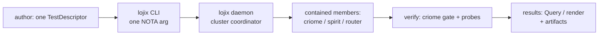
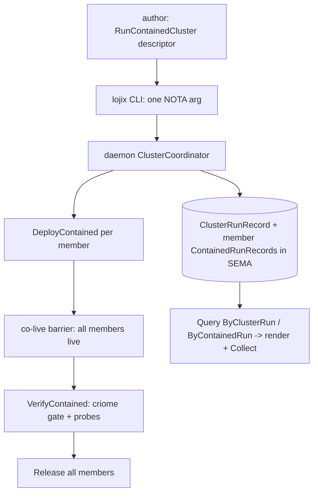

# The testing system, end to end — vision, syntax, code, and the testing + results interfaces

*System-designer study · 2026-06-22 · report 164*

A single concrete showcase: what the testing system *is*, the test you write, the code behind it, how you launch a test, and how you read results back. This is the converged **intended** shape (lower contract landing now); names follow the convergence — `VerifyContained` (not the operator POC's interim `CheckContained`), `ContainedRun*` (renamed from `TestRun*`). Everything below is correct NOTA: positional, variant-headed, options as vectors of option-variants (never labeled fields).

## 1. The vision

Testing and deployment are the **same act** — build an OS/cluster Nix closure and bring it up on a target — differing only in *containment*. So there is no separate test component: **lojix** is the deploy/test component, with two faces:

- **Ordinary (safe) face = testing.** Targets only throwaway resources (`HermeticVm`, `VmHostGuest`, `EphemeralDroplet`). A broken run kills only the contained target. No production authority.
- **Meta (privileged) face = deployment.** Mutates real `ProductionNode`s, owner-gated.

You author one comfortable test descriptor; the lojix daemon co-brings-up the members, runs the verification body (the criome/spirit gate), reaps everything, and persists a queryable record. The same descriptor runs across substrates of escalating fidelity (hermetic VM → on-demand guest → cloud droplet) — one test, many substrates (the `cpip` charter).



## 2. The syntax — the test you write

**Short common case** — run a contained `fieldlab` cluster of criome+spirit+router on a hermetic VM, standard gate, default options:

```nota
(RunContainedCluster (fieldlab [(Member criome) (Member spirit) (Member router)] HermeticVm Gate []))
```

**Full form** — kinded members, explicit steps, options set:

```nota
(RunContainedCluster
  (fieldlab
    [(Member criome) (Member spirit) (Kinded router OsOnly)]
    HermeticVm
    (Steps [
      (GateCase Criome AuthorizedShips      (Threshold 1 [(Signer spirit-local-signer)]))
      (GateCase Criome ThresholdShortDenied (Threshold 1 [(Signer spirit-local-signer)]))
      (GateCase Criome UnconfiguredHeld     NoGate)
      (Probe (OutboxDrained Spirit ServerCommitted))
      (Probe (RouterFanOut Router AttendPublishDeliverMatching))
      (DeployIntegrity Criome) (DeployIntegrity Spirit) (DeployIntegrity Router)])
    [(Lease 900) (MaximumGuests 3) (NetworkIsolation TapLayer3)]))
```

Read the NOTA discipline straight off this: `HermeticVm` and `Gate` are **terse sibling variants** the daemon lowers to full defaults; `[(Lease 900) (MaximumGuests 3) …]` is a **vector of `ClusterOption` variants**, not labeled fields — drop any, reorder freely, `[]` = all defaults; `Member`/`Kinded` are member-profile variants; every step is a typed `TestStep` variant.

## 3. The code — the schema behind the syntax

The authoring layer (`signal-lojix`), correct positional NOTA schema:

```
RunContainedCluster ClusterRun
ClusterRun { ClusterName (members (Vector MemberProfile)) ContainedTarget VerificationBody (options (Vector ClusterOption)) }

MemberProfile    [(Member NodeName) (Kinded NodeName DeploymentKind)]
DeploymentKind   [FullOs OsOnly HomeOnly]
ContainedTarget  [Hermetic (HermeticVm HermeticVmProfile) (VmHostGuest VmHostGuestProfile) (EphemeralDroplet EphemeralDropletProfile)]
VerificationBody [Gate (Steps (Vector TestStep))]
TestStep         [(GateCase ComponentKind GateOutcome ThresholdSpec) (Probe ProbeSpec) (DeployIntegrity ComponentKind)]
ComponentKind    [Criome Spirit Router]
GateOutcome      [AuthorizedShips ThresholdShortDenied UnconfiguredHeld]
ThresholdSpec    [NoGate (Threshold Integer (Vector KeyMember))]
KeyMember        [(Signer NodeName)]
ProbeSpec        [(OutboxDrained ComponentKind Durability) (RouterFanOut ComponentKind RouterCheck)]
Durability       [QueuedForMirror ServerCommitted]
ClusterOption    [(Lease PositiveSeconds) (MaximumGuests Integer) (NetworkIsolation NetworkIsolation) (Source ProposalSource) (Flake FlakeReference)]
NetworkIsolation [SharedHost TapLayer3 CrossMachine]
```

The per-member contract it lowers to (the converged lower roots):

```
;; request roots:  [DeployContained VerifyContained Release Query ...]
DeployContained  DeployContainedRequest
DeployContainedRequest { NodeProfile ContainedTarget ProposalSource FlakeReference }
NodeProfile { ClusterName NodeName (kind (Optional DeploymentKind)) }   ;; a profile to BUILD — never a ProductionNode
VerifyContained  VerifyRequest
VerifyRequest { ContainedRunIdentifier VerificationBody }
Release          ContainedRelease
ContainedRelease { ContainedRunIdentifier }
```

The daemon-side coordinator (illustrative Rust — methods on the data-bearing coordinator, no free functions; the six phases from report 163):

```rust
impl ClusterCoordinator {
    async fn run(&self, descriptor: ClusterRun) -> ClusterRunIdentifier {
        let id = self.runs.mint(descriptor.cluster_name());          // Submitted
        let members = self.deploy_all(&descriptor).await;            // DeployContained per member
        if !self.await_all_live(&members).await {                    // BringingUpAll: co-live barrier
            self.release_all(&members).await;                        // failure cleanup
            return self.runs.fail(id, ClusterFailureStage::BringUpAll);
        }
        let verdicts = self.verify(&members, descriptor.body()).await; // Verifying: VerifyContained / cross-member gate
        self.release_all(&members).await;                           // Releasing: always, idempotent
        self.runs.settle(id, verdicts)                              // Completed / Failed
    }
}
```

## 4. The interface for testing — how you launch one

It's one NOTA argument to the `lojix` CLI (the one-argument rule), as a file or inline:

```sh
lojix cluster-gate.nota                                  # a .nota file
lojix "(RunContainedCluster (fieldlab [(Member criome) (Member spirit) (Member router)] HermeticVm Gate []))"
```

The CLI is a thin client: it parses the NOTA, ships one typed frame to the daemon over the ordinary socket, and prints the daemon's typed reply. The substrate is chosen by the `ContainedTarget` variant in the descriptor and resolved against typed node capability (`HermeticVm` runs anywhere; `VmHostGuest` resolves a `VmHost`-capable host; `EphemeralDroplet` drives cloud — gated until its guardrails land). The immediate reply is the cluster-run handle:

```nota
(ClusterRunAccepted (12 (47 8a3f)))      ;; ClusterRunIdentifier 12, DatabaseMarker (commit 47, digest 8a3f)
```

You don't block on it — the run is durable; you read results back by id.

## 5. The interface for results — how you read them

Results are **reads through `Query`** (status is never a side-verb), at two granularities. Same grammar as authoring:

```nota
(Query (ByClusterRun  (ClusterRunLookup fieldlab (Some 12))))     ;; one cluster run
(Query (ByClusterRun  (ClusterRunLookup fieldlab None)))          ;; all cluster runs for fieldlab, newest first
(Query (ByContainedRun (ContainedRunLookup fieldlab criome None))) ;; the per-member runs for one node
```

The reply records (correct NOTA shapes):

```
ClusterRunRecord { ClusterRunIdentifier ClusterName (members (Vector ContainedRunIdentifier)) ClusterRunPhase ClusterOutcome }
ClusterRunPhase  [Submitted BringingUpAll AllLive Verifying Releasing Completed Failed]
ClusterOutcome   [Pending Passed (Failed ClusterFailureStage)]

ContainedRunRecord { ContainedRunIdentifier ClusterName NodeName host.NodeName ContainedTarget TestRunPhase TestOutcome (closure_path (Optional ClosurePath)) }
TestOutcome [Pending Passed (Failed FailureStage)]
FailureStage [BringUp Deploy Assert TearDown HermeticCheck]
```

A live `(Query (ByClusterRun (ClusterRunLookup fieldlab (Some 12))))` reply, raw:

```nota
(ClusterRunsQueried
  ([(12 fieldlab [34 35 36] Completed Passed)]
   (47 8a3f)))
```

…and the per-member runs `34 35 36` carry each node's phase/outcome (`Passed`, or `(Failed Assert)` with the stage). The `VerifyContained` reply for a single member carries the verdict directly:

```nota
(Verified (34 Passed (47 8a3f)))            ;; ContainedRunId 34, Verdict Passed
(Verified (35 (Failed Assert) (47 8a3f)))   ;; member failed at the Assert stage
```

**The comfortable result view.** Because results are typed records, a thin projection (`lojix render`, the analogue of `spirit-render`) turns them into a human glance — this is the "interface for results" a person actually reads:

```text
fieldlab   cluster-run 12   PASSED   (3/3 members)   closure 2j08dj66
  criome  run 34  Completed  Passed   gate: authorized-ships ✓  threshold-short-denied ✓  unconfigured-held ✓
  spirit  run 35  Completed  Passed   probe: outbox-drained (ServerCommitted) ✓
  router  run 36  Completed  Passed   probe: fan-out (attend·publish·deliver·matching) ✓
```

A failure renders the stage and points at the artifact:

```text
fieldlab   cluster-run 13   FAILED at Verify   (2/3 members)
  criome  run 37  Failed     (Failed Assert)   gate: threshold-short-denied ✗ (head shipped under threshold)
          artifacts:  serial-console  daemon-journal  assertion-log   -> lojix collect 37 AssertionLog
```

**Artifacts and logs** for a failed run are typed handles you `Collect`; the bytes ride the substrate's own channel (nix store / ssh), never a Signal frame:

```nota
(Collect (FromContainedRun 37 AssertionLog))    ;; -> handles to serial-console / daemon-journal / assertion-log
ArtifactKind [SerialConsole DaemonJournal AssertionLog ClosurePath ProviderEvent]
```

**Live progress** (optional) rides the `Watch`/subscription handshake — phase-transition events as the coordinator advances `Submitted → BringingUpAll → AllLive → Verifying → Releasing → Completed`.

## 6. The whole flow, one picture



## Status honesty

This is the converged **intended** interface. Built today: the wave-0 type-split proof (`schema-rust-next`) and the lower-level pilot (`lojix/tests/test_op.rs`, old `Test(Check/Run)` vocabulary). Landing now (operator): the verb rename to `DeployContained`/`VerifyContained`/`Release`, `ContainedRun*` rename, `source` authoritative, SEMA/Nexus routing. Then `RunContainedCluster` (the coordinator, report 163) lands on top. `EphemeralDroplet` stays `SubstrateUnavailable` until its cost/lease/reconciliation guardrails exist; `RouterFanOut` is an honest stub until router compiles against the current schema stack. The authoring syntax, the result records, and the render view above are the target an author and a reader actually touch.
