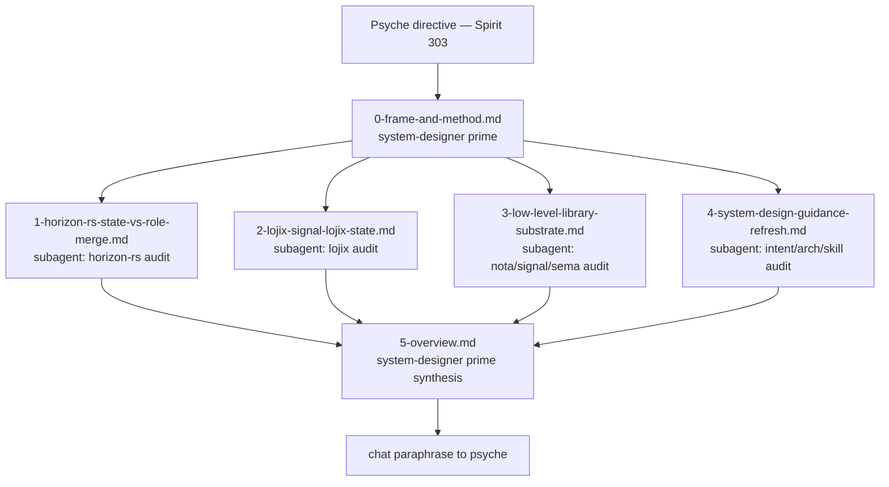

# 30 — horizon/lojix migration to new low-level libraries

*Kind: Synthesis · Topic: horizon-lojix-low-level-migration · 2026-05-23*

## The session

Psyche 2026-05-23 directive (Spirit record 303):

> *migrating it to the new low-level libraries versions
> (nota/signal/sema family)*

The new horizon/lojix lean stack has been settling steadily through
2026-05-19 → 2026-05-21 (the role-merge cluster-data shape per
`reports/system-designer/29`, the lojix vision per
`reports/system-designer/28`). Meanwhile the low-level library
substrate underneath — `nota-codec`, `nota-derive`, `signal-frame`,
`signal-executor`, `signal-sema`, `signal-persona-spirit`, the
Spirit substrate — has been moving at speed: mixed-enum unification
(`reports/system-designer/27`), `{key value …}` map syntax
(`reports/second-system-assistant/5`), three-case rule + struct
heads dropping, untagged `NotaRecord`, `Bool`-as-enum,
`Option`-wrapping, `ToSemaOutcome` trait, `BatchErrorClassification`,
typed map keys (in flight), Spirit as the canonical intent substrate
(retiring `intent/*.nota` appends).

This session audits **where the lean horizon/lojix stack currently
sits relative to those low-level library shifts**, identifies the
load-bearing migration gaps, and surfaces the most important psyche
decisions with possible solutions for the next implementation arc.

## Lane

This is the **system-designer** lane's first session under the
renamed identity (Spirit record 302). The lane is a specialized
designer-discipline seat for system topics (CriomOS, lojix,
horizon, goldragon, deployment), parallel to `nota-designer`.

Designer protocol applies: full subagent dispatch (per psyche
2026-05-21), meta-report directory shape (per
`skills/reporting.md` §"Meta-report directories"). The session lock
`[draft:horizon-lojix-migration-2026-05-23]` is held in
`orchestrate/system-designer.lock` for the duration.

## Method

Four parallel slices, each dispatched as a general-purpose
sub-agent under designer protocol. Each writes its numbered slice
in this directory. The orchestrator (system-designer prime) writes
this frame, an overview synthesis as the final numbered slice, and
a tight chat paraphrase for the psyche.

Each slice answers four questions in the same shape:

1. **What is the current state?** Cite files, line numbers, branch
   tips.
2. **What's the target shape?** Cite the relevant
   intent/design/skill record.
3. **What's the migration delta?** Concrete list of changes
   needed.
4. **What surfaces a psyche-decision-worthy choice?** Items the
   overview surfaces with possible solutions.

Each slice carries at least one mermaid diagram. Each slice ends
with a "questions for the overview" section the prime aggregates.

## Slice briefs

### Slice 1 — horizon-rs state vs role-merge destination

Audit the code on
`/home/li/wt/github.com/LiGoldragon/horizon-rs/horizon-leaner-shape`
against the destination shape in `reports/system-designer/29`
(role merge: `Vec<Role>` field at position 1; placement at
position 2; Pod rename; wireguard inside NodePubKeys; kind-role
mutex validation; view-side derived booleans retiring; etc.). Also
audit NOTA shape adoption: untagged `NotaRecord`, struct-head
drops, `{key value …}` map syntax in `datom.nota` and
`horizon.nota`, `Option`-wrapping, `Bool`-as-enum.

### Slice 2 — lojix + signal-lojix state vs lean-rewrite plan

Audit the code on
`/home/li/wt/github.com/LiGoldragon/lojix/horizon-leaner-shape`
and `signal-lojix/horizon-leaner-shape` against the destination
shape in `reports/system-designer/28`. What's landed of the
three-layer Signal model (`LojixCommand`,
`BatchErrorClassification`, contract-local verbs,
`ObservedLowering`, no-empty-OperationPlan rule). Owner-signal
status. Pilot-first sequencing — is the persona-spirit pilot done?
What lojix work that was previously gated can resume?

### Slice 3 — low-level library substrate (nota/signal/sema family)

Audit the deployed versions of `nota-codec`, `nota-derive`,
`signal-frame`, `signal-executor`, `signal-sema`,
`signal-persona-spirit` against what horizon/lojix currently pin.
What's the gap between deployed Spirit (`Spirit 0.1.0` per
`skills/spirit-cli.md`) and the horizon/lojix pins? What recent
breaking changes need consumer updates (untagged NotaRecord, map
syntax, ToSemaOutcome, BatchErrorClassification, typed map keys,
…)?

### Slice 4 — system-design guidance refresh status

Audit which workspace guidance files (`skills/`, `ESSENCE.md`,
`AGENTS.md`, `INTENT.md`) and per-repo guidance files
(`ARCHITECTURE.md`, `INTENT.md`, `skills.md`) reference horizon/
lojix and have either drifted or named retired patterns
(`NodeService`/`NodeSpecies` split; `(Entry k v)` map syntax;
`intent/*.nota` append discipline; species-versus-services
duplication). What files need updates, and what stays correct.

## Risks / known unknowns

- **Branch tip drift** — the `horizon-leaner-shape` worktrees have
  been edited by other lanes during the same arc; slices read
  current tip, not the snapshot from when /29 was written.
- **Spirit drift** — the deployed `Spirit 0.1.0` may not match
  current `persona-spirit/main`. Audit slices that touch Spirit
  read the deployed wire shape, not main.
- **Cross-repo coordination** — the migration touches at least 6
  repos (horizon-rs, lojix, signal-lojix, goldragon,
  CriomOS-lib, criomos-horizon-config) plus consumers. The
  overview names the migration order across repos to avoid
  half-states.

## Expected output of the session

The overview (`5-overview.md`) carries:

- a synthesis table (current state × destination × migration
  delta) across the four slices;
- a per-repo migration order;
- the **3-5 most important psyche decisions** the migration
  surfaces, each with 2-3 possible solutions and a recommendation;
- a final mermaid diagram of the multi-repo migration topology.

The chat paraphrase carries 3-7 items spread across (a) clarifying
questions for psyche, (b) explanations of new mechanisms / what
changed, and (c) concrete artefacts/paths.
