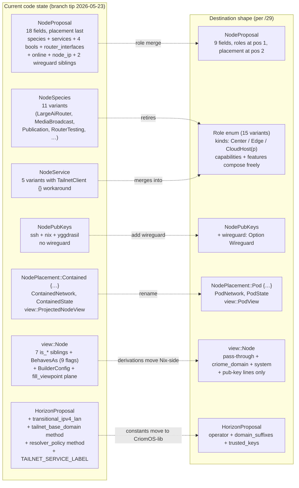

# 1 — horizon-rs state vs role-merge destination

*Kind: Audit · Topic: horizon-rs-migration · 2026-05-23*

## Top finding

The `horizon-leaner-shape` branch contract files (`ARCHITECTURE.md`,
`INTENT.md`) carry the full role-merged destination shape per
`reports/system-designer/29`, but **no part of the 13-step migration
sequence has landed in code**. `NodeProposal` still carries the
18-field species+services+booleans+router_interfaces+online+node_ip
+wireguard+placement shape; `NodeSpecies` (11 variants) and
`NodeService` (5 variants) are still split; `Contained`/`Pod` rename
has not happened; wireguard has not joined `NodePubKeys`; the 9-flag
`BehavesAs` and the 7 `is_*` siblings + `BuilderConfig` still live on
`view::Node`; `HorizonProposal.transitional_ipv4_lan` plus 5
operational-constant methods still live on the Rust type. The
NOTA-shape adoption is even further behind — the pinned `nota-codec`
commit predates every relevant codec change (untagged record, map
syntax, three-case rule, mixed enum, typed map keys, bracket
strings), so even if the type rewrites happened today, the codec
pin would refuse to encode the target datom.

## Current state

`/home/li/wt/github.com/LiGoldragon/horizon-rs/horizon-leaner-shape/lib/src/`
on tip carries 2544 lines across the relevant files. The contract
files (the repo's `ARCHITECTURE.md`, `INTENT.md`) describe the
destination — they CANON the role-merged shape but `ARCHITECTURE.md`
§Status explicitly notes "the code on branch tip has NOT yet landed
every migration step — the species enum still exists, services and
router_interfaces are still separate fields, view-side derived
booleans still live in horizon-rs." This audit confirms.

`NodeProposal` (`lib/src/proposal/node.rs:29-88`) carries 18 fields
in this order: `species`, `size`, `trust`, `machine`, `io`,
`pub_keys`, `link_local_ips`, `node_ip`, `wireguard_pub_key`,
`nordvpn`, `wifi_cert`, `wireguard_untrusted_proxies`,
`wants_printing`, `wants_hw_video_accel`, `router_interfaces`,
`online`, `services`, `placement`. Placement sits at the *tail*,
not at position 2.

`NodeSpecies` (`lib/src/species.rs:11-26`) lives as an 11-variant
enum: `Center`, `LargeAi`, `LargeAiRouter`, `CloudHost` (unit, no
data), `Hybrid`, `Edge`, `EdgeTesting`, `MediaBroadcast`,
`Router`, `RouterTesting`, `Publication`. The destination shape
drops `LargeAiRouter`, `Hybrid`, `Router`, `RouterTesting`,
`MediaBroadcast`, `Publication`, and decomposes the rest into
the merged `Role` enum.

`NodeService` (`lib/src/proposal/services.rs:23-46`) is a 5-variant
`NotaSum` enum: `TailnetClient {}`, `TailnetController {}`,
`NixBuilder { maximum_jobs }`, `NixCache {}`,
`PersonaDevelopment { capabilities }`. Every unit variant uses the
empty-struct workaround `{}` per the pre-`d83a40f` codec
constraint that `NotaSum` couldn't carry bare unit variants. Same
pattern in `NodePlacement` (`Metal {}`, `Contained {…}`),
`Substrate` (`NixosContainer {}`, `MicrovmCloudHypervisor {}`),
and `PersonaDevelopmentCapability` (`GitoliteServer {}`).

`NodePubKeys` (`lib/src/proposal/pub_keys.rs:15-21`) carries `ssh`,
`nix`, `yggdrasil` — no `wireguard` field. Wireguard data still
sits as two flat siblings on `NodeProposal` (`wireguard_pub_key`,
`wireguard_untrusted_proxies`) plus a third on `view::Node`
(`wireguard_untrusted_proxies: Option<Vec<WireguardProxy>>`).

`view::Node` (`lib/src/view/node.rs:23-116`) carries all 7 sibling
`is_*` booleans (`is_fully_trusted`, `is_remote_nix_builder`,
`is_dispatcher`, `is_large_edge`, `enable_network_manager`,
`chip_is_intel`, `model_is_thinkpad`) plus the `behaves_as:
BehavesAs` grouped record carrying 9 more flags (`center`,
`router`, `edge`, `next_gen`, `low_power`, `bare_metal`,
`virtual_machine`, `iso`, `large_ai`). `BehavesAs::derive`
(`view/node.rs:145-172`) does the species-dispatch derivation.
`BuilderConfig` (`view/node.rs:174-231`) carries the hard-coded
`"nix-ssh"` ssh-user, `"/etc/ssh/ssh_host_ed25519_key"` ssh-key,
and `["big-parallel", "kvm"]` features that the destination moves
to `CriomOS-lib/lib/default.nix:constants.nixBuilder.*`. The
viewpoint-fill plane (`Node::fill_viewpoint`, lines 240-301)
still lives in view code; the destination retires it.

`HorizonProposal` (`lib/src/horizon_proposal.rs:20-26`) still
carries `transitional_ipv4_lan: TransitionalIpv4Lan` as a required
field (not Optional, no `#[serde(default)]`), and 5
operational-constant methods are still defined on it:
`router_ssid` (line 116), `tailnet_base_domain` (line 120),
`service_domain` (line 124), `lan_network` (line 128),
`resolver_policy` (line 138). The `TAILNET_SERVICE_LABEL`
constant sits at line 16. All these the destination moves to
CriomOS-lib.

`ProjectedNodeView` (`lib/src/view/projected_node.rs:16-27`) keeps
the pre-rename name, references `ContainedNetwork` /
`ContainedState` from `proposal::placement`. The repo's view file
is named `projected_node.rs`, not `pod_view.rs`.

`Cluster` (`lib/src/view/cluster.rs:17-57`) still embeds
projected `lan: Option<LanNetwork>` and `resolver: ResolverPolicy`
— both the destination retires entirely (move to CriomOS-lib).
`view/network.rs` defines `LanCidr`, `LanNetwork`, `DhcpPool`,
`ResolverPolicy` (97 lines that the destination drops entirely).
`view/router.rs` defines a second `RouterInterfaces` plus `Ssid`
that the destination collapses into the single proposal-side type.

`ClusterProposal::project` (`lib/src/proposal/cluster.rs:76-254`)
validates tailnet topology (one `TailnetController` max per
cluster, lines 271-297), validates secret bindings unique
(`resolve_secret_bindings`, lines 260-269), validates pod arch
resolves via super-node (`resolve_arch`, lines 246-267 of
`node.rs`). No kind-role mutex validation exists; `Error`
(`lib/src/error.rs:7-112`) has neither `NoKindRole` nor
`MultipleKindRoles` variants.

## Migration gaps

| Destination item | Status today | Cite | Remaining work |
|---|---|---|---|
| `Role` enum (15 variants) | Not started | `lib/src/species.rs:11`, `lib/src/proposal/services.rs:23` | Define `Role` + `CloudProvider` (rename `services.rs` → `role.rs` per ARCHITECTURE §Code map); retire `NodeSpecies`; retire `NodeService` / `NodeServiceKind`. |
| `NodeProposal` 9-field shape | Not started | `lib/src/proposal/node.rs:31-88` | Drop `species`, `services`, `router_interfaces`, `online`, `node_ip`, `wireguard_pub_key`, `wireguard_untrusted_proxies`, `nordvpn`, `wifi_cert`, `wants_printing`, `wants_hw_video_accel`; add `roles: Vec<Role>` at position 1; promote `placement` to position 2. |
| `wireguard` inside `NodePubKeys` | Not started | `lib/src/proposal/pub_keys.rs:15-21` | Add `Wireguard` struct in `proposal/pub_keys.rs`; add `wireguard: Option<Wireguard>` to `NodePubKeys`; remove the two flat siblings from `NodeProposal` and `view::Node`. |
| `NodePlacement::Contained` → `Pod` | Not started | `lib/src/proposal/placement.rs:13-25` | Variant rename (3 sites: `Contained` → `Pod`, `ContainedNetwork` → `PodNetwork`, `ContainedState` → `PodState`); rename `view::projected_node.rs` → `view::pod_view.rs`; rename `ProjectedNodeView` → `PodView`. |
| `view::Node` shrinkage (16 booleans + BehavesAs + BuilderConfig) | Not started | `lib/src/view/node.rs:78-116, 132-172, 174-231, 240-301` | Drop 7 `is_*` siblings, drop `behaves_as: BehavesAs` and `BehavesAs::derive`, drop `BuilderConfig` (whole record + `from_node`), drop the viewpoint-fill plane (`fill_viewpoint`, `ViewpointFill`, all 8 viewpoint-only Option fields), drop `nix_cache`, `max_jobs`, `use_colemak`, `builder_configs`, `cache_urls`, `ex_nodes_ssh_pub_keys`, `dispatchers_ssh_pub_keys`, `admin_ssh_pub_keys`. |
| `HorizonProposal` shrinkage | Not started | `lib/src/horizon_proposal.rs:20-26, 116-144, 16` | Drop `transitional_ipv4_lan` field + `TransitionalIpv4Lan` struct; drop `tailnet_base_domain`, `service_domain`, `lan_network`, `resolver_policy`, `router_ssid` methods; drop `TAILNET_SERVICE_LABEL`. Land the constants in `CriomOS-lib/lib/default.nix:constants`. |
| Kind-role mutex validation | Not started | `lib/src/error.rs:7-112`, `lib/src/proposal/cluster.rs:76-254` | Add `Error::NoKindRole { node }`, `Error::MultipleKindRoles { node, kinds }`; add `validate_kind_roles` walking each node's roles vector counting `{ Center, Edge, CloudHost(_) }`; call from `project()`. |
| Untagged `NotaRecord` derive | **Codec pin pre-dates** | `Cargo.lock` pin = `2618adb` (2026-05-11); the change is `ee90eef`. | Bump `nota-codec` pin past `ee90eef` (untagged record + 3-case rule landed together as the next two commits after the pin). Then drop struct heads in datom.nota. |
| Bare unit variants in NodeService / NodePlacement / Substrate | **Codec pin pre-dates** | `lib/src/proposal/services.rs:26,29,38,53`; `lib/src/proposal/placement.rs:14,30,31`; pin = `2618adb`. The mixed-enum support is `d83a40f`. | Bump `nota-codec` pin past `d83a40f`; drop the `{}` workaround on `TailnetClient`, `TailnetController`, `NixCache`, `GitoliteServer`, `Metal`, `NixosContainer`, `MicrovmCloudHypervisor`. |
| `{key value …}` map syntax | **Codec pin pre-dates** | Pin = `2618adb`; brace-maps land in `9011168`. | Bump `nota-codec` pin past `9011168`; rewrite map literals in `datom.nota` from `[(Entry k v) …]` to `{k v …}`. |
| `Bool`-as-enum (`True`/`False`) | **Codec pin pre-dates** | Pin = `2618adb`; 3-case rule + Bool-as-enum lands in `503f475`. | Bump pin; rewrite `false` / `true` in `datom.nota` to `False` / `True` (only matters as long as the 4 bare booleans on `NodeProposal` haven't merged into `roles`; after the role-merge step the booleans disappear). |
| `Option`-as-`(Some inner)` wrapped form | **Codec pin pre-dates** | Pin = `2618adb`; lands in `503f475`. | Bump pin; rewrite `(YggPubKeyEntry …)` (currently bare inside Option positions in datom.nota) to `(Some (YggPubKeyEntry …))`. |
| Typed map keys (`NodeName`, `MountPath`, …) | **Codec pin pre-dates** | Pin = `2618adb`; lands in `c5932f9`. | Bump pin; once landed, the `BTreeMap<NodeName, NodeProposal>` map keys decode as typed wrappers, not raw strings; ARCHITECTURE §"NOTA shape applied throughout" expects this. |

## NOTA shape adoption (in Rust types)

`NotaRecord` derive is **tagged** today (the pinned `2618adb`
predates `ee90eef`). The Rust code uses the derive as a struct-head
emitter — `(NodeProposal …)`, `(Machine …)`, `(NodePubKeys …)`,
`(Io …)` all appear in the on-disk datom because the codec still
emits the tag. After the pin bump and the migration of the struct
shape, the datom drops the heads.

Unit variants in `NodeService` carry the `{}` empty-struct
workaround (`lib/src/proposal/services.rs:26,29,38`) — the
pre-`d83a40f` codec rejected bare `TailnetClient` inside a
`NotaSum`. Same for `NodePlacement::Metal {}` (placement.rs:14),
`Substrate::NixosContainer {}` / `Substrate::MicrovmCloudHypervisor
{}` (placement.rs:30-31), and `PersonaDevelopmentCapability::
GitoliteServer {}` (services.rs:53). Total: 7 sites in 3 enums.

Trait-derive inventory: `NotaRecord` appears on 19 structs;
`NotaSum` on 4 enums (`NodeService`, `NodePlacement`, `Substrate`,
`UserNamespacePolicy` indirectly via `NotaEnum`, `VpnProfile`,
`PersonaDevelopmentCapability`); `NotaEnum` on 12 unit-only
enums; `NotaTransparent` / `NotaTryTransparent` on newtypes.
None of these emit untagged records today.

## Datom shape adoption

`/home/li/wt/github.com/LiGoldragon/goldragon/horizon-leaner-shape/datom.nota`
uses the **old shape** throughout. Evidence per construct:

- **Struct heads present.** Every record literal carries its type
  name: `(NodeProposal …)` (lines 20, 49, 88, 128, 161),
  `(Machine …)` (24, 53, 92, 132, 165), `(NodePubKeys …)` (32, 62,
  104, 141, 174), `(Io …)`, `(ClusterTrust …)` (247),
  `(HorizonProposal …)` (line 4 of `/git/.../criomos-horizon-config/
  horizon.nota`), `(DomainSuffixes …)` (line 5), `(TransitionalIpv4Lan
  …)` (line 7). None drop the head.
- **Map syntax is the old `[(Entry k v) …]` form.** Lines 19-46
  (nodes map), 198-241 (users map), 28-30 + 57-60 + 96-102
  (disk maps inside each `Io`), 205-211 + 225-235 (user pub key
  maps), 257-260 (per-node trust map). No `{k v …}` brace form
  anywhere.
- **Bools are `true` / `false`.** Lines 39-41, 65-67, 74-76, 113-118,
  152-156, 184-188. Six occurrences across the 4 boolean fields on
  `NodeProposal` (`nordvpn`, `wifi_cert`, `wants_printing`,
  `wants_hw_video_accel`) plus the optional `online`.
- **`Option<T>` written as bare inner for `Some(T)`.** The
  `YggPubKeyEntry` literals at lines 65-68, 107-110, 144-147,
  177-180 are unwrapped — no `(Some …)` head. Same for the
  `RouterInterfaces` literal at line 119 (inside `Option<…>` on
  prometheus).
- **`None` written as the bare token.** Lines 34, 37-38, 71, 113,
  150, 156, 182-183, 191, 203-204, 213-216, 224, 237 — all bare
  `None`. ARCHITECTURE expects bare `None` and `(Some inner)` — the
  `None` form already matches; the `Some` form does not.
- **Unit variants use `(TailnetClient)`, `(NixCache)`, `(Metal)`
  parenthesised.** Lines 47, 82-84, 86, 122-125, 126, 159, 193 —
  not bare `TailnetClient` / `NixCache` / `Metal`. The destination
  expects bare unit variants per the three-case rule + the
  mixed-enum codec change.

`/git/github.com/LiGoldragon/criomos-horizon-config/horizon.nota`
mirrors the same old-shape pattern (struct heads present, both
literal records use type tags, the `TransitionalIpv4Lan` field is
present and required). 13 lines total. Will shrink to ~6 lines
after the migration (3 fields, no struct heads, no transitional
LAN).

Net: zero of the 5 NOTA-shape changes in the destination have
landed in either datom file. The datom files are technically
*correct against the current Rust types*; they go stale the moment
any step of the type migration lands.

## Questions for the overview

These are the questions that surface choices the prime should
elevate to psyche-decision with options.

1. **What's the safe migration order — type rewrite first then codec
   bump, or codec bump first then type rewrite?** The 13-step
   sequence in `/29` interleaves both. Option A (codec-first): bump
   `nota-codec` pin to a tip-of-main commit (past `538555e`), let
   horizon-rs compile against the new derive surface, then do the
   type rewrites step-by-step — each commit produces a valid datom
   intermediate. Option B (types-first): keep the codec pin frozen,
   rewrite the Rust types, then bump the codec at the very end with
   a one-shot datom rewrite. Option A risks the type rewrites
   blocking on a codec API change mid-flight; option B risks an
   uncompiled intermediate state and a big-bang datom rewrite at the
   end. Recommendation belongs in the overview after slice 3 (the
   low-level substrate audit) reports the codec breaking-change
   list.

2. **Does the migration land on `horizon-leaner-shape` branch only,
   or also gate on a tested CriomOS-lib `predicates.nix` + `constants`
   table appearing in parallel?** The destination shape moves ~25
   let-bindings + ~7 operational-constant tables to CriomOS-lib. If
   horizon-rs migrates first and `view::Node` drops the 16 derived
   booleans before `CriomOS-lib/lib/predicates.nix` exists, every
   downstream CriomOS module that gates on `node.is_*` /
   `node.behavesAs.*` breaks. Option A (parallel): land CriomOS-lib
   predicates + constants in a sibling branch first; cut over both
   together. Option B (sequential): land horizon-rs migration, accept
   the broken downstream until CriomOS-lib catches up — acceptable
   if both deploy stacks coexist (per `INTENT.md` §"Two deploy
   stacks coexist") and the legacy stack is still consumed. Option C
   (rust-first temporary shim): keep the 16 booleans on `view::Node`
   as a compatibility shim that does the same derivation on the
   Rust side until CriomOS-lib catches up, then drop. Slice 4
   (guidance refresh) audits the cross-repo coordination.

3. **Where does `transitional_ipv4_lan` actually live during the
   transition window?** The destination removes it from horizon-rs
   entirely and moves the four values (cidr, gateway, dhcp_pool,
   warning) to `CriomOS-lib/lib/default.nix:constants.network.
   transitionalIpv4Lan`. The pan-horizon `horizon.nota` file (in
   `criomos-horizon-config`) currently authors these values per-
   operator — if the cluster has more than one operator (it
   currently doesn't, per the destination's own comment "the
   workspace has exactly one cluster"), moving to a hard-coded Nix
   constants file commits to a single-operator world. Option A
   (commit): take the design's intent literally, hard-code in
   CriomOS-lib, accept that adding a second cluster owner means a
   CriomOS-lib edit. Option B (parametrize): expose
   `transitionalIpv4Lan` as a CriomOS-lib module argument default
   so a future operator can override per-flake. Option C (defer):
   leave the field on `HorizonProposal` for now, migrate everything
   else, revisit when a second operator is on the horizon. The
   `/29` design picks option A explicitly ("hard-coded here
   because the workspace has exactly one cluster"); worth
   restating in the overview so psyche can confirm or pick B/C.

4. **Should `Role::PersonaDevelopment { capabilities }` and
   `Role::Router(RouterInterfaces)` keep their nested-data shape,
   or do they flatten the way the 4 bare booleans did?** The
   role-merge folds `nordvpn` / `wifi_cert` / `wants_printing` /
   `wants_hw_video_accel` into bare variants — `Role::Nordvpn`,
   `Role::WpaEnterpriseClient`, `Role::Printing`,
   `Role::HardwareVideoAccel`. But `Role::PersonaDevelopment {
   capabilities: Vec<PersonaDevelopmentCapability> }` keeps its
   nested vector; `Role::Router(RouterInterfaces)` keeps its
   7-field interface record. The categorical-model intent
   (2026-05-20T19:15) says "no constraint logic; no pre-selection
   of defaults" — a nested capabilities vector inside a role is
   exactly the kind of pre-selection vocabulary the categorical
   model rejects in spirit. Option A (keep): nested data on roles
   is fine as long as the *role* is what's selected categorically,
   the *inline data* is genuine inline tuning of that role.
   Option B (flatten further): split
   `Role::PersonaDevelopment { capabilities: [GitoliteServer] }`
   into two top-level role variants `Role::PersonaDevelopment` +
   `Role::GitoliteServer`; same for any future capabilities. This
   pushes "every dial is a single Role variant" further at the
   cost of a longer Role enum. The /29 design picks option A.
   Worth surfacing in the overview because the prime arc that
   produced /29 didn't explicitly weigh option B at the merge
   moment — and slice 4's guidance refresh needs to know which
   way to update the "no booleans" discipline.

## See also

- `reports/system-designer/29-lean-horizon-cluster-data-shape.md` —
  the consolidated destination shape and 13-step migration
  sequence this slice audits against.
- `reports/system-designer/30-horizon-lojix-low-level-migration/0-frame-and-method.md`
  — session frame; slice briefs.
- `/home/li/wt/github.com/LiGoldragon/horizon-rs/horizon-leaner-shape/ARCHITECTURE.md`
  — repo CANON for the destination shape; the lean-shape branch's
  contract this audit measures distance from.
- `/home/li/wt/github.com/LiGoldragon/horizon-rs/horizon-leaner-shape/INTENT.md`
  — per-repo synthesis of psyche intent; the "what" without the
  "why".
- `/git/github.com/LiGoldragon/nota-codec` commit log — `ee90eef`
  (untagged record), `503f475` (3-case rule + Bool + Option),
  `d83a40f` (mixed enum), `9011168` (brace maps), `c5932f9`
  (typed map keys), `538555e` (current tip, bracket strings).
