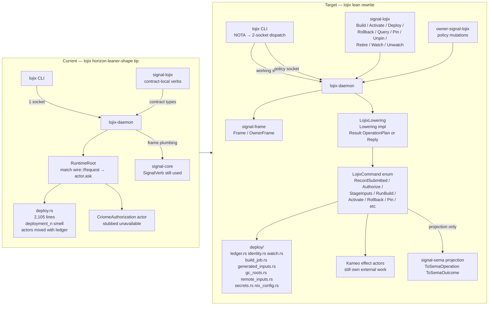

# 2 — lojix + signal-lojix state vs lean-rewrite destination

*Kind: Audit · Topic: lojix-migration · 2026-05-23*

This slice audits the `horizon-leaner-shape` worktrees for
`lojix` and `signal-lojix` against the lojix vision settled
2026-05-20. Reference points: the original vision
`reports/system-specialist/154` (three-layer Signal model, deploy
contract grammar, `LojixCommand` enum, identity-smell retirement,
`deploy.rs` split), the gap audit `reports/system-designer/28`
(13 gaps; owner-signal-lojix missing, criome deferred, pilot-first
sequencing, daemon mesh), and the four psyche turns on
2026-05-20T17:10 in `intent/deploy.nota` + `intent/signal.nota`
(Build/Activate/Deploy/Rollback split, owner-signal-lojix proceeds,
criome auth deferred, persona-spirit pilot done → lojix gate lifts).

## Current state

### signal-lojix — contract shape mostly landed

The contract crate at
`/home/li/wt/github.com/LiGoldragon/signal-lojix/horizon-leaner-shape/src/lib.rs:641-680`
already uses `signal_frame::signal_channel!` and declares
contract-local operation roots — `Deploy`, `Pin`, `Unpin`,
`Retire`, `Query`, `WatchDeployments`/`UnwatchDeployments`,
`WatchCacheRetention`/`UnwatchCacheRetention`. Reply variants
(`DeploymentAccepted`, `DeploymentRejected`,
`CacheRetentionAccepted`, `CacheRetentionRejected`,
`GenerationListing`, four subscription-opened/closed pairs) and
event records (`DeploymentObservation`, `CacheRetentionObservation`)
sit inside the same macro block. Two stream declarations name the
token/opened/event/close shape explicitly.

The Cargo manifest at
`/home/li/wt/github.com/LiGoldragon/signal-lojix/horizon-leaner-shape/Cargo.toml:15-22`
depends on `signal-frame` only — no `signal-core`, no
`signal-sema`. The lockfile pins `signal-frame` at commit
`4bdf1e1e7064...` (branch `main`). This matches the vision's "no
dependency on signal-sema, no SignalVerb compatibility shims" rule
from `/154` §"Contract layer".

Round-trip tests at
`/home/li/wt/github.com/LiGoldragon/signal-lojix/horizon-leaner-shape/tests/round_trip.rs:129-308`
exercise the new types (`LojixOperation::Deploy`,
`LojixOperation::Pin`, `LojixOperation::WatchDeployments`,
`LojixOperation::UnwatchDeployments`, etc.) through
`StreamingFrame<LojixOperation, LojixReply, LojixEvent>`, so the
contract surface compiles and serialises correctly against
`signal-frame`.

What is still wrong in `signal-lojix`:

- `ARCHITECTURE.md` lines 16-23, 89-97, 217-219, 234-236 still
  spell `Assert DeploymentSubmission`, `Mutate
  CacheRetentionRequest`, `Match GenerationQuery`, `Subscribe`,
  `Retract` — Sema verbs that no longer appear in the source.
- `skills.md` line 56 still references `SignalVerb` mapping.
- `Deploy` is still one broad public operation carrying
  `DeploymentPlan`. The 2026-05-20T17:10:00Z psyche decision in
  `intent/deploy.nota` calls for the split into `Build`,
  `Activate`, `Deploy`, `Rollback` (with `Activate`-vs-`Deploy`
  collapse left open).

### lojix — pre-three-layer wire shape; still on signal-core

The implementation crate has not started the migration. Code map
(line counts):

```text
/home/li/wt/github.com/LiGoldragon/lojix/horizon-leaner-shape/src/
  lib.rs            48 lines
  socket.rs        520 lines  — signal-core frame plumbing
  runtime.rs       364 lines  — matches on wire::Request variants
  deploy.rs       2105 lines  — DeploymentLedger + actors + ledger smell
  authorization.rs 212 lines  — CriomeAuthorization actor (stub policy)
  client.rs         98 lines  — single-socket CLI client
  process.rs       (helper)
  error.rs         (helper)
  bin/lojix-daemon.rs    32 lines
  bin/lojix.rs           71 lines
```

The Cargo manifest at
`/home/li/wt/github.com/LiGoldragon/lojix/horizon-leaner-shape/Cargo.toml:23-37`
still pulls `signal-core` (no `signal-frame`, no `signal-executor`,
no `signal-sema`). It pins `signal-lojix` at branch
`horizon-leaner-shape` so the contract update would be picked up by
a `jj` lock refresh — but the crate cannot compile against the new
contract until the wire moves to `signal-frame`. This is the first
expected compile break the gap audit `/28` flagged (risk 2 of
`/154` §"Current risks").

Concrete signal-core usages that the migration must rewrite:

- `src/socket.rs:9-12` imports `signal_core::{ExchangeIdentifier,
  ExchangeLane, LaneSequence, NonEmpty, Operation, Reply as
  CoreReply, SessionEpoch, SignalVerb, StreamEventIdentifier,
  SubReply, SubscriptionTokenInner}`.
- `src/socket.rs:478` and lines 345, 352 still build
  `CoreReply::completed(NonEmpty::single(SubReply::Ok { verb:
  SignalVerb::Subscribe, payload }))`.
- `src/socket.rs:418` builds
  `CoreReply::rejected(signal_core::RequestRejectionReason::Internal)`
  for a code path that should now lower to typed
  `OperationAborted` / `BatchAborted` outcomes per the new accepted
  outcomes from `intent/signal.nota` 2026-05-20T01:00.
- `src/socket.rs:252, 256, 281, 294, 426, 471, 472, 478, 492`
  match directly on `wire::Request::DeploymentSubmission`,
  `wire::Request::DeploymentObservationSubscription`,
  `wire::Request::DeploymentObservationRetraction`, etc. — no
  `LojixCommand` indirection.
- `src/runtime.rs:201-307` (`impl Message<RuntimeRequest> for
  RuntimeRoot`) is a giant `match request { Request::X => ..., }`
  block, exactly the "matches directly on public request variants"
  pattern the vision §"Migration order step 3" says to retire.
- `src/error.rs:11, 60` re-export `signal_core::FrameError` and
  `signal_core::RequestRejectionReason` into lojix's error type —
  these need replacement with `signal_frame` equivalents and new
  typed lojix reply variants for accepted-but-rejected outcomes.
- `src/client.rs:24, 51, 62` use `wire::Request` + `wire::Reply`
  as the CLI's whole transport vocabulary; nothing knows about
  two-socket dispatch (no `OwnerOperation`/`WorkingOperation`
  split like persona-spirit has).

`LojixCommand`, `LojixEffect`, `Lowering`, `OperationPlan`,
`CommandExecutor`, `BatchErrorClassification`, `ToSemaOperation`,
`ToSemaOutcome`, `ObservedLowering` — none of these traits or
types appear anywhere in lojix's source tree. The implementation is
still pre-three-layer.

### Deploy ledger identity smell still present

`/154` §"Current reading" called out the deployment_{n}/generation_{n}
smell. It survives unchanged at
`/home/li/wt/github.com/LiGoldragon/lojix/horizon-leaner-shape/src/deploy.rs:79-86`
and `:146-167`:

```text
deploy.rs:81   DeploymentId::from_text(format!("deployment_{}", key.value()))
deploy.rs:155  GenerationId::from_text(format!("generation_{}", key.value()))
```

`DeploymentLedger::allocate_deployment` and
`record_built_generation` mint the identity from the sema-engine
`key.value()` then format it back into a string, then re-validate
the string. Sema-engine slot/key identity should be the source of
truth and the string only an output projection — the vision's
§"Migration order step 5" is unstarted.

### deploy.rs split — unstarted

`deploy.rs` is still one 2,105-line file. There is no `src/deploy/`
directory; no `ledger.rs`, `identity.rs`, `watch.rs`,
`build_job.rs`, `generated_inputs.rs`,
`garbage_collection_roots.rs`, `remote_inputs.rs`, or `secrets.rs`
sub-module. The vision's §6 ("Split deploy.rs by noun") is the
complexity center: every three-layer change will otherwise land
inside this file.

### Criome authorization wired (but stubbed)

`src/authorization.rs` (212 lines) plus
`src/runtime.rs:43-44, 117-120, 147-149, 178-180` show a
`CriomeAuthorization` Kameo actor wired into `RuntimeRoot` with a
`CriomeAuthorizationPolicy::unavailable_until_criome_socket_lands()`
production policy and a `grant_for_tests()` policy. Cargo manifest
line 33 also depends on `signal-criome` (branch `main`). This is
inert in practice — the production policy refuses authorization
until the criome socket lands — but the wiring is already there.

Per `intent/deploy.nota` 2026-05-20T17:10:00Z, "criome-mediated
authorization … is deferred from the lean-rewrite migration".
There is a delta: the dependency, the actor, and the policy
plumbing all exist, but the production policy is dormant. The
deferral is honoured operationally (no criome socket calls
happen); the code surface is not yet stripped.

### CLI shape — single-socket, NOTA-via-argv, no env carve-out

`src/bin/lojix.rs:14-48` reads one `LojixCliConfiguration` from
argv-0 (via `nota_config::ConfigurationSource::from_argv_nth(0)`),
reads request text from argv 2+ or stdin, sends one NOTA request,
prints one NOTA reply. Single socket — no
`OwnerOperation`/`WorkingOperation` dispatch.

`src/client.rs:9-22` `Client::from_configuration` constructs one
`SocketAddress` from `configuration.daemon_socket_path` — single
socket, no policy-socket carve-out.

CLI binary name = `lojix`, daemon = `lojix-daemon` — matches
`intent/signal.nota` 2026-05-20T13:00 cluster.

The `intent/signal.nota` 2026-05-20T13:00 socket-path-override
env-var carve-out (allowed only as override of NOTA-supplied
defaults) is not visible in the source — neither honoured nor
forbidden. The configuration reads only from NOTA. Acceptable
for now since the contract path already wins.

### owner-signal-lojix — does not exist

Confirmed by directory listing of `/git/github.com/LiGoldragon/`:
no `owner-signal-lojix` directory. Companion checkouts that DO
exist: `owner-signal-persona-spirit`, `owner-signal-persona-mind`,
`owner-signal-persona-orchestrate`, `owner-signal-persona-router`,
`owner-signal-persona-terminal`, `owner-signal-repository-ledger`,
`owner-signal-sema-upgrade`, `owner-signal-version-handover`.

Lojix is conspicuously the only one of the actively-developed
stateful daemons without an owner contract crate. Per
`intent/deploy.nota` 2026-05-20T17:10:00Z this is no longer
deferred ("let's just do the owner signal logics right now"); the
repo needs creation + initial population.

### Persona-spirit pilot — done; gate lifted

Per `intent/signal.nota` 2026-05-20T17:10:00Z Maximum, the
persona-spirit pilot is complete and the pilot-first sequencing
constraint that gated lojix's lean-rewrite migration is lifted.
Evidence in `/git/github.com/LiGoldragon/persona-spirit/`:

- `Cargo.toml` depends on `signal-frame`, `signal-executor`,
  `signal-sema` (branch `main`).
- `src/daemon.rs:14-33` imports both `WorkingOperation` (from
  signal-persona-spirit) and `OwnerOperation` (from
  owner-signal-persona-spirit), with separate `Frame` /
  `OwnerFrame` / `UpgradeFrame` types — three-socket dispatch
  landed.
- `src/daemon.rs:162, 168, 174, 1324, 1348, 1388` handle
  `signal_frame::Request<WorkingOperation>`,
  `signal_frame::Request<OwnerOperation>`,
  `signal_frame::Request<UpgradeOperation>` separately.
- `bootstrap-policy.nota` exists at the repo root — the
  policy-state seed pattern from `intent/component-shape.nota`
  2026-05-19T01:30 has been exercised by the pilot.

This is the proof-of-shape lojix's previously-gated work was
waiting on. Everything from `LojixCommand` introduction through
the `Lowering` impl through `BatchErrorClassification` through the
owner-contract two-socket split now has a working precedent to
mirror.

## Current vs target architecture



## Migration gaps from /28 and /154

| Destination item | Status | Cite | Remaining work |
|---|---|---|---|
| signal-lojix uses signal-frame, not signal-core | done | `signal-lojix/src/lib.rs:12, 641-680` | Strip stale `SignalVerb`/`Assert`/`Mutate` wording from `ARCHITECTURE.md:16-23, 89-97, 217-236` and `skills.md:56`. |
| Contract-local verbs Deploy/Pin/Unpin/Retire/Query/Watch/Unwatch | mostly done | `signal-lojix/src/lib.rs:642-651` | Per 2026-05-20T17:10 psyche, split `Deploy` into `Build` / `Activate` / `Deploy` / `Rollback`; `Activate`-vs-`Deploy` collapse still open. |
| Stream `close` grammar names only the verb | done | `signal-lojix/src/lib.rs:668-679` | None — `close UnwatchDeployments;` matches `/28` Gap 13 sharpening. |
| owner-signal-lojix exists with bootstrap-policy.nota seed | unstarted | `/git/github.com/LiGoldragon/` directory listing | Create repo; seed with policy records for builder registry, cache trust, believed-topology baseline, nix-config defaults; per `/28` Gap 1 + 2026-05-20T17:10 psyche. |
| lojix depends on signal-frame + signal-executor + signal-sema | unstarted | `lojix/Cargo.toml:23-37` | Replace signal-core; add signal-frame, signal-executor, signal-sema deps; rewrite frame and reply plumbing. |
| LojixCommand enum exists in lojix-daemon (not signal-lojix) | unstarted | not present in any `lojix/src/*.rs` | Introduce per `/154` §3 sketch; concrete names refined while editing. |
| `Lowering` impl: `Result<OperationPlan<LojixCommand>, LojixReply>` | unstarted | not present | Trait skeleton per `/28` Gap 8 needed before implementation. |
| `BatchErrorClassification` impl on lojix engine errors | unstarted | not present | `/28` Gap 9 — also needs the failure-mode → reply-variant mapping table. |
| `ToSemaOperation` mapping each `LojixCommand` to Sema verb | unstarted | not present | Mapping prose exists in `/154` §"Sema classification layer"; trait impl absent. |
| `ToSemaOutcome` impl on `LojixEffect` | unstarted | not present | Per `intent/signal.nota` 2026-05-20T12:33 High Decision. |
| `ObservedLowering` projection for observable declaration | unstarted | not present | Per `intent/signal.nota` 2026-05-20T01:00 Maximum. |
| RuntimeRoot stops matching on `wire::Request` variants | unstarted | `lojix/src/runtime.rs:201-307` | Replace request-variant `match` with operation → lower → execute command plan. |
| Reply-error mapping: which lojix failures → `OperationAborted` vs `BatchAborted` | unspecified | n/a | `/28` Gap 9 — needs a table; current code uses untyped `CoreReply::completed` and `CoreReply::rejected(Internal)`. |
| Deploy ledger identity by sema slot/key, not `deployment_{n}` | unstarted | `lojix/src/deploy.rs:81, 155` | Use `key.value()` directly as identity; remove string formatting and re-validation; human projection only at reply boundary. |
| `deploy.rs` split into `deploy/{ledger,identity,watch,build_job,generated_inputs,gc_roots,remote_inputs,secrets}.rs` | unstarted | `lojix/src/deploy.rs` is one 2,105-line file | Add `NixDaemonConfigurationActor` slot per `/28` Gap 5 (also unstarted) for nix.conf + signing-key control. |
| Daemon-mesh: lojix-daemon as Signal client of criome-daemon (and peer lojix-daemons) | deferred + half-wired | `lojix/src/authorization.rs`; `intent/deploy.nota` 2026-05-20T17:10 | Criome auth deferred per 2026-05-20T17:10 psyche; the inert `CriomeAuthorization` actor + signal-criome dep can be stripped during the lean rewrite (or left dormant — decision needed). |
| CLI two-socket dispatch (working + policy) | unstarted | `lojix/src/bin/lojix.rs`, `lojix/src/client.rs` | Persona-spirit pattern (`WorkingOperation` / `OwnerOperation` split frame types) is the precedent; `intent/signal.nota` 2026-05-20T17:30 settled the dispatch sits in a `signal-cli` macro driven statically by contract operation type. |
| Env-var carve-out for socket-path override | not honoured, not forbidden | `lojix/src/bin/lojix.rs:14-21`, `lojix/src/client.rs:18-22` | Decision: add per `intent/signal.nota` 2026-05-20T13:00 cluster, or wait for owner-contract pass. |
| Nix witnesses per `/154` §7 | unstarted | n/a | Witnesses can land alongside Phase A (contract-only assertions) and Phase B (binary-level runtime assertions). |

## What the pilot-done unblocks

Per `intent/signal.nota` 2026-05-20T17:10:00Z Maximum, the
persona-spirit pilot is done. The previously-gated lojix work that
can resume now:

1. **`LojixCommand` enum introduction in lojix-daemon.** The
   pilot proved the shape: persona-spirit has `WorkingOperation` and
   `OwnerOperation` split into separate `Frame`/`OwnerFrame`/
   `UpgradeFrame` channels with `signal_frame::Request<...>`-typed
   handlers. Lojix can mirror this directly.

2. **Contract migration of `signal-lojix` doc strings.** Stripping
   `Assert`/`Mutate`/`Match`/`Subscribe`/`Retract` from
   `ARCHITECTURE.md` and `skills.md` no longer requires waiting
   for a pilot precedent — the pattern is now standard.

3. **Wire migration of `lojix` from `signal-core` to
   `signal-frame`.** The pilot's `Frame::decode_length_prefixed`
   shape at `persona-spirit/src/daemon.rs:350` is the template
   for lojix's `socket.rs:58-80` frame plumbing.

4. **owner-signal-lojix repo creation.** Per 2026-05-20T17:10
   psyche, the owner contract proceeds now in parallel with CLI
   dispatch design (no waiting on dispatch).

5. **Three-layer trait wiring (`Lowering`, `OperationPlan`,
   `CommandExecutor`, `BatchErrorClassification`,
   `ToSemaOperation`, `ToSemaOutcome`, `ObservedLowering`).** The
   trait skeletons exist on persona-spirit; lojix's effect actors
   stay actor-owned (per `/154` §"Important split") but the
   command-execution shell around them now has a precedent.

6. **`bootstrap-policy.nota` seed for lojix policy state.** The
   pilot exercised the policy-state-vs-working-state taxonomy from
   `intent/component-shape.nota` 2026-05-19T01:30 — lojix's
   builder-registry / cache-trust / believed-topology / nix-config
   policy categories can populate a similar seed file.

What does not unblock and remains explicit deferral:

- **Criome-mediated authorization** — deferred per
  `intent/deploy.nota` 2026-05-20T17:10. The stubbed
  `CriomeAuthorization` actor at `lojix/src/authorization.rs`
  can stay dormant or be stripped during the lean rewrite.

- **Daemon-to-daemon mesh beyond criome** — `/28` Gap 4
  (peer lojix-daemon connections per
  `reports/system-specialist/138`) is downstream of criome and
  Arca; not part of this migration arc.

- **Arca dependency for content-addressed deploy artifacts** —
  `/28` Gap 11; `signal-arca` does not yet exist as a repo. The
  generated-Nix-inputs / deploy-plan / topology-snapshot
  artefacts live as local files on lojix-daemon until Arca lands.

## Questions for the overview

1. **Activate-vs-Deploy collapse.** 2026-05-20T17:10:00Z psyche
   ruled the public contract splits into Build/Activate/Deploy/
   Rollback per the verbs-are-cheap principle, but left whether
   Activate and Deploy collapse to one verb undecided ("isn't
   activate and deploy the same? Those are different verbs, so
   they should be different. That's all I can say right now").
   Should the contract author commit to four-way split now, or
   leave `Activate` and `Deploy` collapsed until activation
   semantics are sketched? Recommendation: surface as a psyche
   decision in the overview rather than letting the implementing
   lane default.

2. **Inert criome plumbing — strip or leave dormant?**
   `lojix/src/authorization.rs` (212 lines), the
   `CriomeAuthorization` actor, the `signal-criome` Cargo
   dependency, and the `RuntimeRoot` wiring at
   `lojix/src/runtime.rs:43-44, 117-120, 147-149` all exist but
   are operationally dormant (`unavailable_until_criome_socket_lands`).
   With criome auth deferred per 2026-05-20T17:10, two options:
   (a) strip the inert code as part of the lean rewrite to reduce
   the migration surface, or (b) leave it as scaffolding for the
   eventual criome wiring. The vision §"Migration order" doesn't
   address this.

3. **owner-signal-lojix initial vocabulary.** Per `/28` Gap 1
   the owner contract carries builder selection policy, cache
   trust policy, believed-topology baseline + corrections, criome
   endpoint reference, per-node Nix signing key reference / rotation,
   ClaviFaber certificate trust material, GC retention policy.
   That's a substantial vocabulary to settle in one pass. Should
   the first owner-signal-lojix shipment include the full
   vocabulary, or only the subset needed to drive the working
   contract through a first end-to-end deploy on the lean stack?
   Recommendation: start with the minimum that lets working-state
   work compile (builder registry + nix-config defaults at
   minimum); add the rest in a second owner-contract pass.

4. **Order of three-layer landings vs deploy.rs split.** The
   `deploy.rs` split (`/154` §6) is preparatory and could land
   alongside the contract-doc cleanup as Phase A. But the
   three-layer wiring (`LojixCommand`, `Lowering`,
   `BatchErrorClassification`) will inevitably touch the
   ledger/identity/build_job modules. Should the split land
   before or after the three-layer wiring? The vision implies
   "before" (§6 is listed earlier than §7 witnesses), and there
   is a real downstream cost to landing both inside the
   2,105-line file. Recommendation: split first, then wire.
