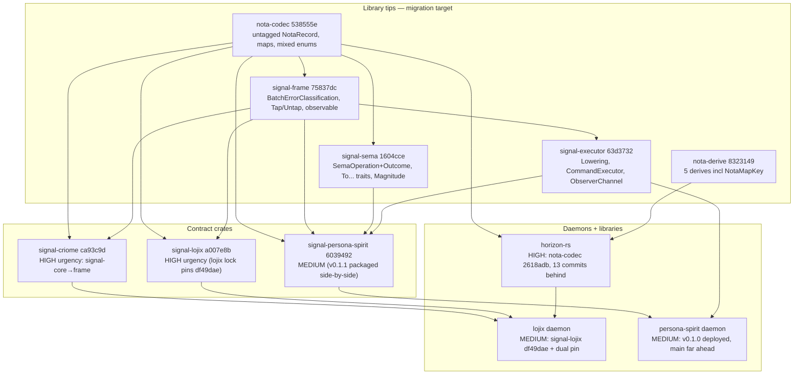

# 3 — low-level library substrate state

*Kind: Audit · Topic: low-level-libraries · 2026-05-23*

## Scope and method

Audits the `nota-codec` / `nota-derive` / `signal-frame` /
`signal-executor` / `signal-sema` / `persona-spirit` /
`signal-persona-spirit` / `signal-criome` substrate that the
horizon-rs and lojix worktrees consume. Identifies what the
libraries now expose vs what consumers pin — the latter is
typically several breaking changes behind.

Revisions read from `/git/github.com/LiGoldragon/<repo>` (library
state) and
`/home/li/wt/github.com/LiGoldragon/<repo>/horizon-leaner-shape`
(consumer pins). The deployed Spirit chain was traced through
`/git/github.com/LiGoldragon/CriomOS-home/flake.lock` per the
discovery pattern in `skills/spirit-cli.md` §"The deployed wire
shape".

## Library state — per-library subsections

### nota-codec — main at `538555e` (2026-05-21)

Two breaking-change clusters since `2618adb` (May 11, the last
horizon-rs-pinned commit), read from
`/git/github.com/LiGoldragon/nota-codec/`:

**2026-05-18→19 cluster** — `97c1f49` adds `Path` type with
relaxed bare-token alphabet; `ee90eef` drops the struct type tag
from `NotaRecord` (untagged positional records — the `primary-hj63`
change); `503f475` adds the NOTA three-case PascalCase rule
(`True`/`False` as enum, `Option` Some-wrapping, PascalCase
forbidden at String position); `88852e6` makes `is_bare_string`
symmetric with the decoder. This cluster is the major codec
break that everything else cascades from.

**2026-05-20 cluster** — `d83a40f` supports mixed nota enum
variants (data + unit in one enum); `9011168` adds brace maps and
removes tuple blanket impls; `c5932f9` adds typed nota map keys;
`6f48374` rejects duplicate map keys; `30693c4` restores the
record-head peek helper consumed by signal-sema; `c861cee` adds
bare date and time scalars used by signal-persona-spirit.

`538555e` (May 21) — bracket strings, cosmetic for doc-comments
but a real codec feature for embedded multiline payloads.

Detail for downstream consumers writing nota schemas: `NotaMapKey`
trait at `src/traits.rs:33-49` (String + Path impls); `BTreeMap`
blanket at `src/traits.rs:266-303`; `HashMap` blanket at
`src/traits.rs:314-345`; `Error::DuplicateMapKey` at
`src/error.rs:92-100`.

### nota-derive — main at `8323149` (2026-05-20)

Major commits: `30c665f` (May 19) — `NotaRecord` drops struct
type tag; newtype enum variants now wrap with variant tag
explicitly. `5174312` (May 20) — unified `NotaEnum` derive
handles both unit and tagged-record variants in one enum.
`07f0686` + `1246636` (May 20) — added `NotaMapKey` derive paired
with the codec landing.

Five derives now at `src/lib.rs:27,37,52,71,94`: `NotaRecord`,
`NotaEnum`, `NotaMapKey`, `NotaTransparent`, `NotaTryTransparent`.
The doc comment at `src/lib.rs:3` still says *"Five derives"* but
then describes only four — minor stale doc the slice-4 guidance
sweep may catch.

The mixed-enum unification (`5174312`) collapses the brief's
referenced `NotaSum` naming back to `NotaEnum` per
`intent/nota-mixed-enum-support.nota` and
`reports/second-system-assistant/4-nota-mixed-enum-support-vision.md`.

### signal-frame — main at `75837dc` (2026-05-23)

Initial scaffold (`be04729`, `3526c10`) migrated the channel
macro from `signal-core` to contract-local operations. The
substantive surface lands in three waves.

*Reply taxonomy:* `4bdf1e1` collapses `Operation<Payload>`
wrapper; `3f94e6e` lands Reply per /246 (`Ok` tuple, `Committed`,
narrow `OperationFailureReason`).

*Observable block & macro:* `1610be7` adds the `observable`
block; `8480f1f` adds open/close verb grammar +
`operation_event`/`effect_event` + `ObservableSet` +
`ObservationProjection` traits; `3692ddb` makes `Tap`/`Untap`
mandatory for persona components; `9e06eef` aligns ARCH with
/246-v4.

*Batch classification:* `06188d4` splits operation and batch
abort outcomes; `381e083` adds batch abort metadata; `68891f6`
owns the batch-error-classification trait; `fb53a6b` removes
partial commit status; `b375e20` adopts current nota
unknown-variant error.

Post-tip (May 21-23): `653773b` clean macro output; `468357e`
generates thin CLI clients; `2313c5e` documents three-tier signal
sizing.

Concrete locations in
`/git/github.com/LiGoldragon/signal-frame/`:
`BatchErrorClassification` trait at `src/reply.rs:178-181`;
`AcceptedOutcome { Committed / OperationAborted / BatchAborted }`
at `src/reply.rs:100-145`; `RetryClassification` at
`src/reply.rs:147-161`; `CommitStatus { Committed / NotCommitted }`
at `src/reply.rs:163-176`; `Tap` / `Untap` mandatory-name
enforcement at `macros/src/validate.rs:65-74`; observable-block
grammar at `macros/src/lib.rs:32-49` and
`macros/src/parse.rs:240-260`.

### signal-executor — main at `63d3732` (2026-05-20)

Scaffold (`57040d5`) and /246 lock-in (`686f8a7`, `c848d07`)
established the trait shape: `Lowering` returns
`Result<OperationPlan, Reply>`; Executor returns Reply directly;
`FrameObserverBridge` + `ObserverDelivery` carry the publish
pipeline. Subsequent commits generalised to component-local
plans (`8453fad`) and effects (`ef85de2`), added batch execution
(`255c52f`, `6ef21c9`), and aligned with signal-frame's batch
classification (`2a04ebf`, `66b5ee4`, `47961d1`). The May 20
async + documentation pass (`7b0ca56`, `d0664af`, `63d3732`)
closed the executor surface for the deployed Spirit v0.1.0/v0.1.1.

Concrete locations in
`/git/github.com/LiGoldragon/signal-executor/`: `Lowering` trait
at `src/lowering.rs:151-176` (associated types `Operation:
RequestPayload`, `Reply`, `Command`, `ComponentEffect`; `lower`
returns `Result<OperationPlan<Self::Command>, Self::Reply>`;
`reply_from_effects` carries the per-component reply rule).
`OperationPlan` at `src/lowering.rs:7-25`; `BatchPlan` at
`src/lowering.rs:27-55`. Async `CommandExecutor` at
`src/engine.rs:7` (`type Command` associated type).
`ObserverChannel` trait at `src/observer.rs:39-48`. Sema
projections imported at `src/lowering.rs:4`.

The brief mentioned an `ObservedLowering` extension trait — that
exact name does not appear in current main. The closest analog
is `ObserverChannel` + lowering's `reply_from_effects` shape +
the imported Sema projections. The slice-5 overview should ask
whether the naming gap is terminology or whether a separate
extension trait was planned and dropped.

### signal-sema — main at `1604cce` (2026-05-23)

May 19 — pattern primitives + sema operation vocabulary
(`d056fc5`, `7eac20e`). May 20 cluster (`d2f2fc8` ARCH alignment,
`f141791` operation classification trait, `f4d3fe5` outcome
projection trait, `a171594` "Sema as classification" framing,
`25476a3` consume codec's record-head peek helper) is where the
three-layer model fully lands. May 21–23 — Magnitude vocabulary
(`22b036a`), with architecture documentation (`e83fd00`),
unknown-widening rule (`9968ffa`), and SemaObservation Tier-2
shape (`1604cce`).

The three-layer model is fully landed in
`/git/github.com/LiGoldragon/signal-sema/`:

- `SemaOperation` enum at `src/operation.rs:18-30` (`Assert /
  Mutate / Retract / Match / Subscribe / Validate`);
  `OperationClass` at `src/operation.rs:100-110`.
- `SemaOutcome` enum at `src/outcome.rs:20-35` (`Asserted /
  Mutated / Retracted / Matched / Subscribed / Validated /
  NoChange`).
- `SemaObservation` typed pair at `src/outcome.rs:80-92`.
- `ToSemaOperation` trait at `src/operation.rs:88-94`;
  `ToSemaOutcome` trait at `src/outcome.rs:67-74` — the two
  traits called out in `intent/signal.nota` 2026-05-20T12:33.
- `Magnitude` enum at `src/magnitude.rs` — universal
  certainty/severity vocabulary that replaces
  signal-persona-spirit's per-component `Certainty`.
- Pattern primitives (`Bind`, `Wildcard`, `PatternField` at
  `src/pattern.rs`) and typed identities (`Slot`, `Revision` at
  `src/identity.rs`) round out the surface.

### persona-spirit — main at `cd1e998` (2026-05-23)

Deployed Spirit chain per
`/git/github.com/LiGoldragon/CriomOS-home/flake.lock`:
`persona-spirit-v0-1-0` → `694452a` (May 21, topic catalog
observation); `persona-spirit-v0-1-1` → `e137f5d` (May 22, version
bump). `currentDefault = v0.1.0` per
`CriomOS-home/modules/home/profiles/min/spirit.nix:141-145`;
v0.1.1 is packaged side-by-side as `spirit-v0.1.1` for handover
testing.

persona-spirit main is dramatically ahead — recent: handover
state machine (`f1e2223`), private handover socket (`40c0c93`),
engine management socket (`092267a`), origin identifiers
(`d396ad3`), daemon configuration files (`cd1e998`). The
v0.1.0/v0.1.1-distinct-nix-inputs packaging confirms
substrate-replacement discipline (handover + dual deployment, not
backward-compat shim).

### signal-persona-spirit — main at `6039492` (2026-05-23)

Deployed-v0.1.0 base is `b89731f` (May 21, kind-filter commit).
Wire-shape work after that base: `cda5469` adds topic catalog
observation; `8586f59` makes record acks identifier-only;
`d7b22bf` replaces Certainty with sema Magnitude; `5f7d4f4` bumps
to 0.1.1; `6039492` updates examples to bracket strings.
Pre-`b89731f`: clean channel-macro output (`3c11172`); timestamp
split (`7703204` + `370f68b`); mixed-enum marker variants
(`c4ade7b`); bump-frame-without-partial-status (`2e7a69a`).

Key v0.1.0 → main wire-shape differences (verified against
`/git/github.com/LiGoldragon/signal-persona-spirit/src/lib.rs` at
`b89731f` and HEAD):

- **`Certainty` enum dropped** — v0.1.0 has its own
  `Certainty { Maximum / Medium / Minimum }` (lines 209-215);
  main uses `signal_sema::Magnitude` (Entry.certainty at `lib.rs:234`).
  Cross-component vocabulary unification per
  `skills/spirit-cli.md` §"Substrate migration discipline" rule 1.
- **`RecordAccepted` reshape** — v0.1.0
  `NotaRecord { captured: RecordSummary }`; main
  `NotaTransparent(RecordIdentifier)` (`8586f59`).
- **`TopicCount` + `TopicsObserved` added** — only on main
  (`lib.rs:277-280` + reply variant).
- **Bracket-string examples** — cosmetic doc-comment diff.

v0.1.1 (`5f7d4f4`) is one commit behind main and substantively
identical for the wire surface — only the doc-comment update
differs.

### signal-criome — main at `ca93c9d` (2026-05-23)

Recent: `91e01e9` is the MUST-IMPLEMENT marker for the
contract-local-verbs migration; `b8a4452` aligns ARCH + skills
with the three-layer model per /246-v4 (drops the SignalVerb
framing); `9b49748` migrates the remaining macro-validate
reference signal-core → signal-frame; `ecbe380` updates to the
current nota unknown-variant error; `ca93c9d` refreshes
bracket-string NOTA.

signal-criome's `Cargo.toml` still pins `signal-core`, not
`signal-frame` — only ARCH and skills are aligned. Cargo.lock:
`signal-core 494da25` (post-deprecation-banner) and
`nota-codec 538555e` (bracket-strings tip). signal-criome is the
*least-stale* nota-codec consumer but has not begun the
signal-frame migration.

## Consumer pins — what the horizon/lojix worktrees ship today

| Repo / worktree | nota-codec | nota-derive | signal-frame | signal-core | signal-executor | signal-sema | signal-lojix | signal-criome |
|---|---|---|---|---|---|---|---|---|
| `horizon-rs/horizon-leaner-shape` | `2618adb` (May 11) | `0d1c240` (May 11) | — | — | — | — | — | — |
| `lojix/horizon-leaner-shape` | `2618adb` + `97c1f49` (alias) | (transitive) | — | `f17efc1` | — | — | `df49dae` (May 17) | `be950e3` |
| `signal-lojix/horizon-leaner-shape` | `88852e6` (May 19) | `30c665f` (May 19) | `4bdf1e1` (May 19) | — | — | — | (self) | — |
| `persona-spirit v0.1.0` + v0.1.1 (deployed) | `c861cee` (May 20) | `8323149` (May 20) | `653773b` (May 21) | — | `7b0ca56` (May 20) | `25476a3` (May 20) | — | — |
| Current library main tips | `538555e` | `8323149` | `75837dc` | `c59bcb9` | `63d3732` | `1604cce` | `a007e8b` | `ca93c9d` |

Source: each consumer's `Cargo.lock` under
`/home/li/wt/github.com/LiGoldragon/<repo>/horizon-leaner-shape/`
plus deployed-Spirit `Cargo.lock` at the v0.1.0/v0.1.1 commits
of `/git/github.com/LiGoldragon/persona-spirit/`. Both deployed
spirit versions share identical low-level pins; they differ only
in signal-persona-spirit revision (`b89731f` vs `5f7d4f4`).

### Things that are surprising in the pin matrix

1. **horizon-rs `2618adb` predates every major NOTA break** —
   pre-`503f475` (Bool/Option), pre-`ee90eef` (untagged
   NotaRecord), pre-mixed-enum, pre-map syntax.
   `horizon_proposal.rs:7-52` uses `NotaRecord` so the
   `ee90eef` cascade is a wire break the moment horizon-rs bumps.

2. **lojix has TWO `nota-codec` pins** — `2618adb` (via
   signal-core) AND `97c1f49` (via the `horizon-nota-codec`
   alias at `lojix/Cargo.toml:43`). Two revisions of the same
   crate compile into the same binary — the cost of feature-
   branch pinning when one graph branch (horizon-rs) was bumped
   without bumping signal-core. Bumping signal-core collapses
   these.

3. **lojix is still on signal-core, not signal-frame** — the
   `signal-lojix df49dae` pin predates `ef98dc0` (the
   signal-frame migration). Bumping to `signal-lojix a007e8b`
   forces the signal-core → signal-frame swap and pulls
   bracket-strings.

4. **Deployed Spirit v0.1.0 is the most-coherent substrate
   consumer** — v0.1.0 pins are May 20-21, days behind current.
   Only substantive wire-shape gaps: `Certainty` → `Magnitude`,
   identifier-only `RecordAccepted`, new `TopicCount`. The
   two-version side-by-side deployment confirms
   substrate-replacement discipline.

## Migration matrix — per-repo bump order

Bump topology is constrained by the dependency graph; bumps
within a rank are independent. Low-level libraries (`nota-codec`,
`nota-derive`, `signal-frame`, `signal-sema`, `signal-executor`)
are all at tip with mutually consistent pins — the migration
target. The matrix lists consumers only; targets cite library
main tips with consumer's current pin in parentheses.

| Repo | nota-codec target | signal-frame target | signal-sema target | signal-executor target | Spirit target | Urgency |
|---|---|---|---|---|---|---|
| signal-criome (contract) | `538555e` (already on) | `75837dc` (NEW — from signal-core) | (n/a) | (n/a) | — | **HIGH** — blocks lojix |
| signal-lojix (contract) | `538555e` (from `88852e6`) | `75837dc` (from `4bdf1e1`) | — | — | — | **HIGH** — blocks lojix |
| signal-persona-spirit | `538555e` (from `c861cee`) | `75837dc` (from `653773b`) | `1604cce` (from `25476a3`) | (transitive) | self → v0.1.2 candidate | MEDIUM — v0.1.1 packaged side-by-side |
| horizon-rs (lib) | `538555e` (from `2618adb`) | — | — | — | — | **HIGH** — 13 codec commits behind; load-bearing for lojix |
| persona-spirit (daemon) | `538555e` (from `c861cee`) | `75837dc` (from `653773b`) | `1604cce` (from `25476a3`) | `63d3732` (from `7b0ca56`) | — | MEDIUM — handover work in flight |
| lojix (daemon) | `538555e` (drop dual-pin) | `75837dc` (NEW — drop signal-core) | `1604cce` (NEW) | `63d3732` (NEW) | — | MEDIUM — Rank-1 dependent |

### Walked dependency unlock sequence

1. **Bump signal-criome** signal-core → signal-frame (one commit
   of macro work). Unblocks lojix's transitive signal-criome
   bump.
2. **Bump signal-lojix's lock** via `cargo update` to
   `signal-lojix a007e8b` (which already migrated to
   signal-frame). This pulls the contract-local-verbs shape and
   new nota-codec.
3. **Bump horizon-rs** to current nota-codec / nota-derive — the
   most code-touching bump (entire schema was authored against
   pre-`ee90eef` codec; every `NotaRecord` re-encodes). The
   role-merge work from `reports/system-designer/29` is a no-op
   by comparison.
4. **Bump lojix's lock** (after 1-3) pulls a consistent
   nota-codec / signal-criome / signal-lojix / signal-frame
   chain; the `horizon-nota-codec` alias collapses.
5. **Bump persona-spirit daemon** to current main substrate —
   organic. The v0.1.2-vs-flip-to-v0.1.1 decision is a psyche
   decision (next CriomOS rebuild).

## Spirit deployed vs main — breaking-shift summary

Per brief item 1. For agent code calling the unsuffixed `spirit`
command (v0.1.0 default), four substantive wire-shape shifts in
main that v0.1.0 does not have, plus one cosmetic:

| Shift | Impact |
|---|---|
| `Certainty` enum → `signal_sema::Magnitude` | Agents composing NOTA records by hand must know deployed shape; sema-upgrade migration handles the rewrite. |
| `RecordAccepted` becomes `NotaTransparent(RecordIdentifier)` | CLI reply text shape differs; agent parsers must branch. |
| `TopicCount` + `TopicsObserved` added | Topic-catalog query exists only on main/v0.1.1. v0.1.0 daemons reject it. |
| Observable block (mandatory `Tap`/`Untap`) | Main daemon injects; v0.1.0 does not. Subscribe still via `Watch`/`Unwatch`. |
| Bracket-string doc examples | Cosmetic — no wire impact. |

v0.1.1 already has all of the above. Flipping `currentDefault`
from v0.1.0 to v0.1.1 (or staging v0.1.2 with the
certainty→magnitude migration baked in) resolves the
agent-facing wire breaks in one deployment.

## Three-layer model — landed completeness

Per `intent/signal.nota` 2026-05-20T12:33 the canonical projection
shape is **Contract Operation → Component Command → Sema
classification** (`signal-*` contract crates → daemon-local
`Command`/`ComponentEffect` types → `signal-sema`'s payloadless
`SemaOperation`/`SemaOutcome` via `ToSemaOperation` +
`ToSemaOutcome`).

Substrate landing per repo:

- **signal-sema**, **signal-frame**, **signal-executor**: landed
  in main (per per-library subsections above).
- **persona-spirit / signal-persona-spirit main**: landed and
  pinning current substrate; v0.1.0 deployed is the previous
  generation, v0.1.1 the bridge.
- **signal-criome ARCH**: documented for the three-layer model
  (`b8a4452`). Cargo.toml still pins signal-core not signal-frame
  — code migration pending per `91e01e9` MUST-IMPLEMENT note.
- **signal-lojix horizon-leaner-shape**: migrated to signal-frame
  (`ef98dc0` May 19) and bracket-strings (`a007e8b` May 23). The
  lojix daemon has not consumed this — lojix Cargo.lock pins
  `df49dae`, pre-migration.
- **lojix daemon**: still on signal-core; no `LojixCommand`
  layer; no `Lowering` impl. Downstream-gated by signal-criome's
  signal-core → signal-frame swap and by bumping the signal-lojix
  pin.

## Questions for the overview

Substrate-side decisions the slice-5 overview should foreground.

1. **Spirit v0.1.0 → v0.1.1 default-flip vs v0.1.2 staging.** The
   substrate-replacement discipline supports either flipping
   `currentDefault` to v0.1.1 (one-line at
   `CriomOS-home/modules/home/profiles/min/spirit.nix:141-145`)
   or staging v0.1.2 with the certainty→magnitude wire change
   applied and a sema-upgrade migration shipped alongside. Which
   path for the next CriomOS rebuild?

2. **Migration order: signal-criome first vs horizon-rs first.**
   Both are independent in the dependency graph. signal-criome's
   bump collapses lojix's two-nota-codec-pins state; horizon-rs's
   bump unblocks the leaner-shape arc that motivates this
   session. Agent attention is the bottleneck — which arc next?

3. **lojix daemon Lowering implementation — incremental vs
   wholesale.** lojix today has an ad-hoc reply path through
   `signal-core` (`lojix/src/socket.rs:9`,
   `lojix/src/error.rs:11`). The three-layer model wants a typed
   `LojixCommand`, a `Lowering` impl, and `ToSemaOperation` +
   `ToSemaOutcome` per command. Slice 2 covers lojix code shape;
   the upstream question: full `signal-executor` pipeline
   (`Lowering` + `Executor` + `ObserverChannel`), or hand-rolled
   dispatch that only adopts `BatchErrorClassification`?

4. **signal-core's deprecation timeline.** signal-core has the
   `96a08db` deprecation banner but still receives cross-cutting
   commits (e.g. `c59bcb9` 2026-05-23 origin rename). Is its tip
   expected to chase NOTA-decode error updates and rename sweeps
   as long as it has consumers, or frozen except security/test
   fixes? Changes how aggressively the bump cascade chases its
   tip.
