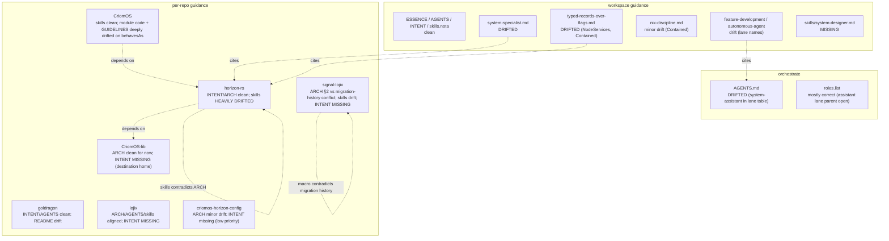

# 4 — system-design guidance refresh status

*Kind: Audit · Topic: guidance-refresh · 2026-05-23*

## What this slice covers

Audit of workspace-level guidance (`ESSENCE.md`, `AGENTS.md`,
`INTENT.md`, `skills/*`, `orchestrate/*`) and per-repo guidance
(`ARCHITECTURE.md`, `INTENT.md`, `AGENTS.md`, `skills.md`) for the
migration-touching repos: `horizon-rs`, `goldragon`, `lojix`,
`signal-lojix`, `CriomOS-lib`, `CriomOS`, `criomos-horizon-config`.

Slices 1/2/3 audit code; this slice audits the guidance layer for
drift, retired-pattern references, and missing files. The retired
patterns checked: `intent/*.nota` append discipline, the
`NodeService`+`NodeSpecies` split, `(Entry k v)` map syntax,
`view::BehavesAs`, `view::BuilderConfig`,
`HorizonProposal.transitional_ipv4_lan`, `Contained` placement
variant, and the `system-assistant` lane name.

## Workspace-level files

**`ESSENCE.md`** — clean. Sits one level above migration topics;
no drift.

**`AGENTS.md`** — recently regenerated; clean. AGENTS.md:198-204
hard override correctly says *"Do not append to `intent/*.nota`
during normal work."* AGENTS.md:30 names `intent/` as legacy.
Does not yet name `system-designer` in the role table — flag
below.

**`INTENT.md`** — recently regenerated; clean. INTENT.md:60-61
names `intent/` as legacy. INTENT.md:137-154 carries the
two-deploy-stacks framing correctly.

**`skills/skills.nota`** — clean. No retired patterns. Does not
list a `system-designer` role entry (no skill file yet to point
at).

**`skills/system-specialist.md`** — DRIFTED.
- :8 / :24-29 / :215-229 — still names `lojix-cli` as THE deploy
  entry point. Workspace INTENT.md's two-stack framing names both;
  this skill speaks as if `lojix-cli` were sole. The lean rewrite's
  daemon+CLI shape (`lojix-daemon` + `lojix`) is not mentioned.
- :171-201 — describes `system-assistant` as a lane under this
  discipline. Post-Spirit-302 rename to `system-designer`, the
  authority/discipline relationship needs reconciling.
- :25-28 — speaks of pre-merge cluster-data shape; doesn't name
  `Vec<Role>`, `NodePlacement::Pod`, categorical model, or the
  beautiful-horizon-over-beautiful-Nix predicates/constants
  destination in CriomOS-lib.

**`skills/component-triad.md`** — clean. :119 explicitly names
`lojix-cli` as a "transitional carry-over name, not the
convention." :373 lists `horizon-rs` as a pure-library carve-out
(still correct).

**`skills/contract-repo.md`** — clean. Three-layer verb model
(contract-local / component commands / Sema classification)
matches signal-lojix's destination shape.

**`skills/nota-design.md`** — clean. :175-186 documents
`{key value …}` map syntax; no `(Entry k v)` references.

**`skills/intent-log.md`** — clean. :204-225 names Spirit CLI as
substrate; "do not silently fall back to `intent/*.nota` appends."

**`skills/jj.md`** — clean. Inline `-m '<msg>'` rule explicit.

**`skills/typed-records-over-flags.md`** — DRIFTED.
- :64-101 — uses `behaves_as: BehavesAs` and `services:
  NodeServices` as the "after" shape. Now retired —
  `NodeService` merged into `Vec<Role>` per /29.
- :174 — destination shape names `Contained(ContainedPlacement)`
  variant. Renamed to `Pod(PodPlacement)` per
  intent/horizon.nota 2026-05-20T18:45.
- :230-236 — witnessed-examples table cites retired shapes
  (`MachineSpecies::Pod` → `ContainedPlacement`,
  `NodeServices`). Needs refresh post-role-merge.
- :262 — "See also" references CriomOS commits "Replace tailnet
  booleans with NodeServices" — second still names `NodeServices`.

**`skills/nix-discipline.md`** — minor drift. Three `Contained`
placement references (:21, :49, :74) — name-only, will be
correct once the `Pod` rename lands.

**`skills/operator.md`** — clean (only names `horizon-rs`,
`goldragon` as workspace repos).

**`skills/feature-development.md`** — drift. :193 example claim
uses `system-assistant` lane name.

**`skills/autonomous-agent.md`** — drift. :222 enumerates role
names — includes `system-assistant`, omits `system-designer`.

**`orchestrate/AGENTS.md`** — DRIFTED.
- :37 — `system-assistant` lane still in the canonical lane
  table. Post-rename, this is the seat that became
  `system-designer`. Needs new row and old row retirement (or
  transition-cycle marking).
- :174-175 — role enumeration in claim text; same drift.
- :354-355 — `reports/system-assistant/` listed as canonical
  role subdir. The session's reports are landing under
  `reports/system-designer/` now.

**`orchestrate/roles.list`** — mostly correct.
- :36 — `system-designer` listed as a specialized structural
  role.
- :39 — `second-system-assistant` still parented to
  `system-specialist`. Open question: did only the seat rename,
  or should the assistant lane parent also shift?

**`skills/system-designer.md`** — MISSING. Spirit 302 named the
new lane this session; no skill file. Flag below.

## Per-repo files

### `horizon-rs/horizon-leaner-shape` (worktree)

- **`INTENT.md`** — clean. Captures role merge, categorical
  model, beautiful-horizon-over-beautiful-Nix, `Pod` rename,
  `transitional_ipv4_lan` move, `{key value …}` map syntax,
  wireguard-ip deferred. Cites
  `reports/system-assistant/29-lean-horizon-cluster-data-shape.md`
  — the session-renamed-lane path question (does that file
  exist under both `system-assistant/` and
  `system-designer/`?) needs verifying.
- **`ARCHITECTURE.md`** — canon for destination shape. Self-
  flags code-vs-doc gap at :55-67. Same report-path question as
  INTENT.md.
- **`AGENTS.md`** — clean.
- **`skills.md`** — HEAVILY DRIFTED.
  - :18-26 — still lists `BehavesAs`, `BuilderConfig`,
    `NixCache` as part of the projected schema; all retire per
    ARCHITECTURE.md:165-172.
  - :42-58 — describes the projection emitting derived
    booleans `is_remote_nix_builder`, `behaves_as` — these
    retire Nix-side.
  - :109-119 — "derived booleans go in the same family … `is_*`
    predicates, `has_*_pub_key` shadows" — same retirement.
  - :122-145 — four-bucket sorter still references
    `lib/src/horizon_constants.rs` (does not exist in
    destination); constants now move to
    `CriomOS-lib/lib/default.nix:constants` per ARCH:30.
  - :198-207 — "Pod arch resolution" uses the new variant
    name; correct post-rename but mismatches the current
    `Contained` code.
- **`docs/DESIGN.md`** — stale (already labeled "historical
  unless ARCHITECTURE.md or skills.md names a section as
  current" per AGENTS.md:17-19). Discipline pre-dates role
  merge; rules still correct, prose below current abstraction.
- **`docs/BUILD_CORES.md`** — out of slice scope; not central
  to the role merge.

### `goldragon/horizon-leaner-shape` (worktree)

- **`INTENT.md`** — clean and comprehensive. Captures 2026-05-21
  role merge, per-node destination table, `Pod` rename,
  species/services merge, `(Entry k v)` → `{key value …}`,
  `transitional_ipv4_lan` move.
- **`AGENTS.md`** — mostly clean. Minor: "LiGoldragon kriom"
  (:11) — likely STT artefact for "criome".
- **`README.md`** — DRIFTED.
  - :13-15 — shows flag-shaped `horizon-cli --cluster goldragon
    --node tiger < datom.nota` invocation. Contradicts the
    component-triad single-NOTA-argument rule.
  - :22-23 — references `horizon-cli --format json` as the
    production reader. Lean stack has `lojix-daemon` reading
    horizon in-process via `horizon-lib`, not via the CLI.

### `lojix/horizon-leaner-shape` (worktree)

- **`INTENT.md`** — MISSING. Migration adjacent; lojix is the
  implementation home for the lean deploy stack. Should land per
  `skills/repo-intent.md`. Possible content: compass (lean
  deploy daemon + thin CLI replacing lojix-cli); CLI/daemon
  one-peer rule; typed nota-config; sema-engine + signal-frame
  defaults; pilot-first sequencing per /28.
- **`ARCHITECTURE.md`** — aligned with current shape. Documents
  daemon+CLI split, CriomeAuthorization gate, sema-backed
  ledger, typed startup configuration. References `signal-core`
  — slice 3 should verify whether this should now read
  `signal-frame` post-rename.
- **`AGENTS.md`** — clean.
- **`skills.md`** — aligned. Same `signal-core` vs
  `signal-frame` naming question; slice 3 owns the answer.

### `signal-lojix` (canonical checkout)

- **`ARCHITECTURE.md`** — DRIFTED. §2 channel macro example
  uses `Assert DeploymentSubmission`, `Mutate
  CacheRetentionRequest`, `Match GenerationQuery`,
  `Subscribe …`. §"Migration history — contract-local verbs"
  (lines 12-25) says the channel migrated to contract-local
  verbs (`Deploy`, `Pin`/`Unpin`/`Retire`, `Query`, `Watch*`).
  The macro example contradicts the section above it. Slice 3
  likely settles which is true.
- **`INTENT.md`** — MISSING. Wire contract for the lean deploy
  stack just absorbed contract-local-verbs migration; deserves
  per-repo synthesis. Possible content: contract-local verbs;
  CLI ↔ daemon single peer; typed startup configuration carried
  in this crate; canonical digest helper.
- **`skills.md`** — DRIFTED.
  - :5 — references `horizon-re-engineering` branch (should be
    `horizon-leaner-shape`).
  - :30 — names `signal_core::signal_channel!` (should be
    `signal_frame::signal_channel!` per ARCH migration
    history).
  - :54-55 — `Request::signal_verb()` Sema-mapping shape — same
    migration-history-vs-code gap.
- **`AGENTS.md`** — not audited in depth; out of slice scope
  unless drift surfaces.

### `CriomOS-lib` (canonical checkout)

- **`ARCHITECTURE.md`** — clean for current shape. Names the
  dependency-free Nix-library boundary. Does NOT yet describe
  `predicates.nix` or `constants.network` destinations — those
  files don't exist yet but are named in horizon-rs
  ARCHITECTURE.md:30 as the destination home for the migrated
  predicates and constants.
- **`INTENT.md`** — MISSING. This repo is the destination home
  for `predicates.nix` (the formerly view-side derived
  booleans) and `constants.network` (`transitional_ipv4_lan`,
  ssh-key paths, cache URL prefix, resolver listens, tailnet
  service label). INTENT.md should land BEFORE the destination
  Nix files so the discipline is captured upstream. Possible
  content: compass (small pure-Nix dependency-free library);
  dependency-free invariant (no nixpkgs eval);
  cluster-policy-stays-out invariant; predicates layer reading
  `node.roles + node.placement + node.pubKeys`; constants
  layer.
- **`skills.md`** — minimal (three rules). Expand once the
  predicates/constants destinations land.

### `criomos-horizon-config` (canonical checkout)

- **`ARCHITECTURE.md`** — drifted. :19-20 still describes the
  IPv4 LAN record as a transitional value carried here. Per the
  role merge, it retires entirely (moves to CriomOS-lib
  constants).
- **`INTENT.md`** — missing. Small repo; workspace INTENT may
  suffice. Low priority.
- **`AGENTS.md`** — out of slice scope.

### `CriomOS` (canonical checkout)

- **`skills.md`** — clean at skill level. Network-neutral host
  prose; lojix-projected inputs; `<node>.<cluster>.criome`
  domain. No retired-pattern drift in the skill itself.
- **Consumer code** — deeply drifted on `behavesAs`. Out of
  slice scope (code files) but flagged for the overview's
  migration order: at least 15 occurrences across
  `modules/nixos/router/*.nix`, `modules/nixos/edge/*.nix`,
  `modules/nixos/llm.nix`, `modules/nixos/network/*.nix`,
  `modules/nixos/metal/default.nix`, `modules/nixos/nspawn.nix`,
  `checks/*role-policy/default.nix`.
- **`docs/GUIDELINES.md`** — :233 reads "use
  `horizon.node.behavesAs.*`, `horizon.node.has*PubKey`, etc."
  — guidance contradicts the destination shape where
  `behavesAs` retires entirely. Consumers should read
  `criomosLib.predicates.*` against `node.roles +
  node.placement`.

## Retired-pattern occurrences (drift table)

| File | Drift item | What it should say | Severity |
|---|---|---|---|
| `skills/typed-records-over-flags.md:64-101` | `behaves_as: BehavesAs`, `services: NodeServices` as "after" shape | `roles: Vec<Role>` first-position field, `Role::*` variants | High |
| `skills/typed-records-over-flags.md:174, 233-236` | `Contained(ContainedPlacement)` variant; witnessed-examples cite retired shapes | `Pod(PodPlacement)`; refresh examples post-role-merge | Medium |
| `skills/nix-discipline.md:21, 49, 74` | `Contained` placement variant references | `Pod` (after rename lands) | Low |
| `skills/system-specialist.md:25, 215-229` | `lojix-cli` as sole deploy entry | reference both prod and lean stacks per workspace two-stack framing | High |
| `skills/system-specialist.md:171-201` | `system-assistant` lane | reconcile post-Spirit-302 rename | Medium |
| `skills/feature-development.md:193` | `system-assistant` in claim example | `system-designer` or `system-specialist` | Low |
| `skills/autonomous-agent.md:222` | role enumeration omits `system-designer`, includes `system-assistant` | add new, retire old | Medium |
| `orchestrate/AGENTS.md:37-38, 174-175, 354-355` | `system-assistant` lane carried in table, prose, report-subdir list | add `system-designer`; mark/remove `system-assistant` | High |
| `orchestrate/roles.list:39` | `second-system-assistant` parented to `system-specialist` | reconcile parent post-rename | Low |
| `horizon-rs/skills.md:18-58, 109-145` | `BehavesAs`, `BuilderConfig`, view-side derived booleans, `horizon_constants.rs` as canonical | retire to Nix-side per ARCHITECTURE.md:165-172; constants move to `CriomOS-lib/lib/default.nix:constants` | High |
| `horizon-rs/docs/DESIGN.md` | pre-role-merge shape | already labeled historical | Low |
| `goldragon/README.md:13-15, 22-23` | flag-shaped `horizon-cli` invocation; CLI as production reader | single-NOTA-argument shape; lojix-daemon reads horizon in-process | Medium |
| `signal-lojix/ARCHITECTURE.md` §2 | macro example uses Sema-root verbs | contract-local verbs per §"Migration history" | High |
| `signal-lojix/skills.md:5, 30, 54-55` | `horizon-re-engineering` branch; `signal_core`; `signal_verb()` | `horizon-leaner-shape`; `signal_frame`; contract-local verbs | High |
| `criomos-horizon-config/ARCHITECTURE.md:19-20` | "IPv4 LAN record is an explicit transitional value" | retires to CriomOS-lib constants | Medium |
| `CriomOS/docs/GUIDELINES.md:233` | "use `horizon.node.behavesAs.*`" | use `criomosLib.predicates.*` against `node.roles + node.placement` | High |

## Missing INTENT.md / skill files

| Path | What's missing | Priority |
|---|---|---|
| `skills/system-designer.md` | Skill file for the renamed lane | High — agents in this lane have no skill to read |
| `lojix/horizon-leaner-shape/INTENT.md` | Per-repo INTENT.md | High — active implementation home; in-flight discipline |
| `CriomOS-lib/INTENT.md` | Per-repo INTENT.md | High — destination home for predicates+constants; INTENT should precede Nix files |
| `signal-lojix/INTENT.md` | Per-repo INTENT.md | Medium — wire contract for lean stack |
| `criomos-horizon-config/INTENT.md` | Per-repo INTENT.md | Low — small repo; workspace INTENT may suffice |

## Guidance-file landscape

## Questions for the overview

1. **Create `skills/system-designer.md` or inherit?** Three
   options: (a) thin skill naming the lane as "specialized
   designer for system topics (CriomOS, lojix, horizon,
   goldragon); reads designer.md + system-specialist.md as
   inheritance"; (b) thicker skill absorbing system-specialist
   scope under designer discipline; (c) no skill — rely on
   AGENTS.md "When a new role appears without a skill" entry
   point. Recommend (a) for now — low cost while the role
   settles, plus a clear pointer surface for new lane agents.

2. **`lojix` needs an `INTENT.md` — should it carry the
   pilot-first sequencing intent?** Per the report-/28 framing,
   lojix work is gated on persona-spirit consumer pilot
   completion. Recommend yes: the migration arc IS the pilot,
   so the discipline belongs in the per-repo synthesis.

3. **`signal-lojix/ARCHITECTURE.md` §2 channel macro contradicts
   its own migration-history section.** §"Migration history"
   (lines 12-25) says contract-local verbs landed; §2 macro
   example shows the old Sema-root verbs. Verify against actual
   `src/lib.rs` channel declaration (slice 3 likely touches
   this); update or retire whichever section is stale.

4. **`system-assistant` lane — retire fully or carry in a
   transition cycle?** Spirit 302 renamed the seat to
   `system-designer`. Three options: (a) retire
   `system-assistant` immediately from `orchestrate/`,
   `skills/`, and references; (b) carry both names one cycle
   with a "legacy name" pointer; (c) keep `system-assistant` as
   a separate assistant-of-system-specialist lane (orthogonal
   to the designer-lane rename). Needs psyche clarification.
