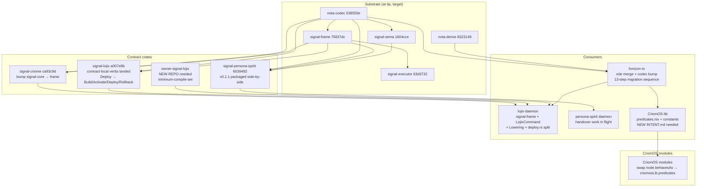

# 5 — overview: horizon/lojix migration topology + psyche decisions

*Kind: Synthesis · Topic: horizon-lojix-low-level-migration · 2026-05-23*

## Top finding

The four-slice audit reveals **a uniform pattern of frozen
contract files describing a destination shape that none of the
code has yet implemented**, with a substrate of low-level libraries
that have moved aggressively beyond every consumer pin.

- **horizon-rs (slice 1):** zero of the 13-step role-merge
  migration has landed in code; `ARCHITECTURE.md` + `INTENT.md`
  describe the destination; `nota-codec` pin (`2618adb`, May 11)
  predates every codec change the destination depends on.
- **lojix (slice 2):** still on `signal-core`, still matches on
  `wire::Request` variants, no `LojixCommand`, no `Lowering`, no
  three-layer wiring; the persona-spirit pilot completed
  2026-05-21 lifted the gate that had blocked all of this.
- **Low-level substrate (slice 3):** `nota-codec`, `nota-derive`,
  `signal-frame`, `signal-sema`, `signal-executor` are at coherent
  main tips with the three-layer model fully landed and `Spirit
  v0.1.1` packaged side-by-side with `v0.1.0` (deployed). The
  v0.1.0 daemon has 4 wire-shape gaps from main; v0.1.1 closes
  them.
- **Guidance drift (slice 4):** workspace `ESSENCE.md` / `AGENTS.md`
  / `INTENT.md` are recently regenerated and clean. Skill files
  and per-repo guidance carry retired-pattern drift: `horizon-rs/
  skills.md` describes `BehavesAs`/`BuilderConfig`/view-side
  derived booleans as current (its own ARCH retires them);
  `signal-lojix/ARCHITECTURE.md` §2 contradicts its own
  migration-history section; `skills/system-specialist.md`
  describes `lojix-cli` as the sole deploy entry. Four `INTENT.md`
  files are missing for the most-affected repos. The
  `skills/system-designer.md` file for this lane does not exist.

The synthesis: the workspace has converged on the *shape* through
the recent design arcs; the migration delta is now mechanical but
substantial, and the safe sequencing across at least six repos is
the real question.

## Cross-slice synthesis

```mermaid
flowchart TB
    subgraph dest["Destination (settled)"]
        d1[role-merge<br/>9-field NodeProposal<br/>Vec Role at pos 1]
        d2[lojix three-layer<br/>Contract → Command → Sema<br/>BatchErrorClassification<br/>Build/Activate/Deploy/Rollback]
        d3[low-level libs at tip<br/>nota-codec 538555e<br/>signal-frame 75837dc<br/>signal-sema 1604cce<br/>signal-executor 63d3732]
        d4[guidance refreshed<br/>workspace clean<br/>per-repo INTENT.md present<br/>skills/system-designer.md created]
    end

    subgraph current["Current code"]
        c1[horizon-rs 18-field NodeProposal<br/>NodeSpecies 11 + NodeService 5 split<br/>Contained not Pod<br/>16 view-side booleans live<br/>BehavesAs::derive in horizon code]
        c2[lojix signal-core<br/>matches on wire::Request<br/>no LojixCommand<br/>deploy.rs 2105 lines<br/>deployment_n string identity]
        c3[horizon-rs pin 2618adb May 11<br/>lojix has 2 nota-codec pins<br/>signal-lojix at 88852e6<br/>Spirit v0.1.0 deployed]
        c4[horizon-rs skills.md drift<br/>signal-lojix ARCH self-contradiction<br/>orchestrate/AGENTS.md system-assistant<br/>4 missing INTENT.md]
    end

    c1 -. 13 migration steps .-> d1
    c2 -. signal-frame rewrite + Lowering + deploy.rs split .-> d2
    c3 -. bump cascade .-> d3
    c4 -. drift sweep + create missing files .-> d4
```

The four migration arcs are interdependent. Slice 1's
horizon-rs type rewrite depends on slice 3's codec pin bump
(struct-head drop won't encode under the pre-`ee90eef` codec).
Slice 2's lojix `LojixCommand` work depends on slice 3's
`signal-lojix` pin bump (which forces signal-core → signal-frame).
Slice 4's guidance refresh follows slice 1+2+3 — agents won't
update skills to describe a shape that doesn't yet exist in code.

The slice-3 audit identifies the substrate as **fully landed and
mutually coherent at main tips** — the bottleneck is consumer-side
bump cascades, not waiting for upstream libraries to land
features.

## The five most important psyche decisions

Each is restated with full inline substance, possible solutions,
and a recommendation.

### Decision 1 — migration order: substrate-up cascade vs horizon-first

**Substance.** Slice 3's dependency-walk shows the natural unlock
sequence: `signal-criome` bump (one commit migrating macro from
`signal-core` to `signal-frame`) → `signal-lojix` pin refresh
(picks up contract-local verbs already landed) → `horizon-rs`
codec bump (the heaviest single repo touch, ~13 nota-codec commits
behind) → `lojix` lock bump (collapses the dual `nota-codec` pin,
picks up signal-frame everywhere) → `persona-spirit` daemon bump
(handover work in flight; v0.1.2 candidate). Each rank is
independent of the next; agents are the bottleneck.

**Possible solutions.**

- **(A) Substrate-up cascade**: signal-criome → signal-lojix lock
  → horizon-rs → lojix lock → persona-spirit. Smallest single
  steps; each commit produces a compiling intermediate; matches
  the dependency graph. Slowest end-to-end because nothing
  parallelises.
- **(B) Parallel branches per consumer**: horizon-rs work on one
  worktree, lojix on another, signal-criome on a third; merge at
  the end. Fastest end-to-end if multiple lanes are working
  simultaneously; coordination overhead at merge.
- **(C) Horizon-first plus signal-criome strip**: skip
  signal-criome entirely (it's a deferred-criome path per
  2026-05-20T17:10), bump horizon-rs first because the role-merge
  is the load-bearing reshape that motivates this whole arc, then
  lojix consumes both new horizon-rs + signal-frame in one bump.

**Recommendation.** (A) — substrate-up cascade. The dependency
chain is clean; signal-criome's single-commit migration is cheap;
skipping it (option C) leaves signal-criome stale even though
criome is deferred operationally. Option B's parallelism only pays
off if multiple system-designer / operator lanes work
simultaneously; today this lane is the only system-designer seat.

### Decision 2 — horizon-rs view-side derivations: parallel cutover with CriomOS-lib, or sequential break-then-fix

**Substance.** Slice 1's view::Node migration drops the 16
derived booleans (7 sibling `is_*` + 9 `BehavesAs.*`) plus
`BuilderConfig` plus the viewpoint-fill plane. Per `/29`, those
derivations move Nix-side into
`CriomOS-lib/lib/predicates.nix` (~25 let-bindings) reading
`node.roles + node.placement + node.pubKeys`. CriomOS today gates
on `node.behavesAs.center`, `node.is_remote_nix_builder`, etc. at
15+ sites across `modules/nixos/*`. If horizon-rs migrates first
and view::Node drops these before predicates.nix exists, every
downstream CriomOS module that reads them breaks.

**Possible solutions.**

- **(A) Parallel branches, joint cutover**: land
  `CriomOS-lib/lib/predicates.nix` on a `horizon-leaner-shape`
  worktree at the same time as horizon-rs's view::Node drop;
  swap CriomOS consumer call sites in the same merge wave.
  Cleanest; no broken intermediate. Coordination overhead.
- **(B) Sequential, accept broken intermediate**: horizon-rs
  drops booleans first; CriomOS modules break; CriomOS-lib +
  CriomOS catch up over the next session(s). Acceptable per
  `INTENT.md` §"Two deploy stacks coexist" — both legacy and lean
  remain in flight; lean stack can be broken transiently. But:
  the `horizon-leaner-shape` worktree builds + tests will fail
  during the gap.
- **(C) Rust-side compatibility shim**: keep the 16 booleans on
  `view::Node` as a transitional shim that computes them Rust-
  side from `roles + placement`. When CriomOS-lib's predicates
  catch up, swap CriomOS consumers from `node.is_*` to
  `criomosLib.predicates.is*`, then drop the shim. Three-step
  migration; no broken intermediates.

**Recommendation.** (A) parallel branches, joint cutover. The
shim approach (C) is the safest but adds an extra cycle of work;
the workspace's no-transitional-shapes discipline (per ESSENCE
"a transitional shape compromises both the old and the new") would
push back. Option A keeps the discipline clean — both repos land
the destination shape together in one cohesive worktree pass.

### Decision 3 — signal-lojix Build/Activate/Deploy/Rollback split, with Activate-vs-Deploy unsettled

**Substance.** Per `intent/deploy.nota` 2026-05-20T17:10:00Z
Maximum, signal-lojix's `Deploy` operation splits into separate
verbs: `Build`, `Activate`, `Deploy`, `Rollback`. The psyche
explicitly left the `Activate`-vs-`Deploy` collapse undecided:
*"isn't activate and deploy the same? Those are different verbs,
so they should be different. That's all I can say right now."*
Today `signal-lojix` still has just one `Deploy` operation. The
contract migration is one of the cleanest concrete next steps
(macro-shape change, contract crate only, no daemon code yet
needs the migration).

**Possible solutions.**

- **(A) Commit to four-way split now**: `Build` (produces a Nix
  artefact, no node side-effects), `Activate` (atomically swaps
  a node's current generation), `Deploy` (builds then activates
  in one operation — convenience composition), `Rollback`
  (atomically swaps to the previous generation). Four verbs;
  semantics distinct.
- **(B) Three-way split, defer Activate**: ship `Build` /
  `Deploy` / `Rollback` now; leave `Activate` to land when
  activation semantics actually need to be exposed independently
  of build (e.g. when reading an already-built closure from
  Arca). Avoids committing to a verb whose semantics are
  unsettled.
- **(C) Two-way split, defer both**: ship `Build` / `Deploy`
  now; leave `Activate` and `Rollback` for later. Most minimal
  initial contract; risks deferred-verbs accumulating as a known
  gap.

**Recommendation.** (A) four-way split. The psyche's "those are
different verbs, so they should be different" + the verbs-are-
cheap principle (`intent/signal.nota` 2026-05-19T20:30:00Z
Maximum) both lean toward making the distinction explicit. The
cost of carrying an underused verb is small; the cost of having
to add it later (with downstream consumer updates) is larger.

### Decision 4 — owner-signal-lojix initial vocabulary: minimum-compile-set vs full

**Substance.** `owner-signal-lojix` does not exist yet (slice 2
+ /28 Gap 1). Per 2026-05-20T17:10:00Z psyche, the owner contract
proceeds now. /28 enumerated the load-bearing vocabulary: builder
selection policy, cache selection / trust policy, believed-
topology baseline + corrections, criome endpoint reference,
per-node Nix signing key reference + rotation, ClaviFaber
certificate trust material, GC retention policy, possibly
lifecycle (start/drain/reload). That's substantial to settle in
one pass.

**Possible solutions.**

- **(A) Minimum-compile-set**: ship `owner-signal-lojix` with
  only the variants needed to drive the working contract through
  a first end-to-end deploy on the lean stack. Likely: builder
  registry (so working `Deploy` knows which nodes can build) +
  nix-config defaults (so working `Deploy` knows the default
  build-cores). Other policy vocabulary lands as second
  owner-contract pass when load-bearing.
- **(B) Full vocabulary**: ship all 8+ policy categories from
  /28 in one pass. Reduces churn; commits to a vocabulary before
  every variant has been exercised.
- **(C) Sequential per-policy commits**: define empty owner
  contract; add one policy category per commit as the working
  side demands it. Maximally incremental; reads as scaffolding
  for many commits before substance lands.

**Recommendation.** (A) minimum-compile-set. The pilot's
discipline (`persona-spirit` shipped `OwnerOperation` with the
operations needed for cognitive policy, not a speculative future
vocabulary) supports this. Most of /28's items relate to deferred
arcs (criome, ClaviFaber); the minimum-compile-set keeps the
contract honest to what's load-bearing today.

### Decision 5 — Spirit v0.1.0 → v0.1.1 flip vs v0.1.2 staging

**Substance.** Slice 3 identified 4 wire-shape gaps between
deployed `Spirit v0.1.0` and main (`Certainty` enum → `signal_sema::
Magnitude`; `RecordAccepted` becomes `NotaTransparent(RecordIdentifier)`;
`TopicCount` + `TopicsObserved` added; `Tap`/`Untap` mandatory).
`v0.1.1` is already packaged side-by-side per
`CriomOS-home/modules/home/profiles/min/spirit.nix:141-145` with
all four shifts; flipping `currentDefault` is a one-line change.
Spirit main is one commit ahead of v0.1.1.

**Possible solutions.**

- **(A) Flip `currentDefault` to v0.1.1**: one-line in
  `spirit.nix`; one CriomOS rebuild; agent clients pick up the
  new wire shape; sema-upgrade migration writes Certainty →
  Magnitude for existing records (slice 3 confirms the
  per-substrate-step migration tool pattern is the place for
  that, not the Spirit daemon).
- **(B) Stage v0.1.2**: bake current main into a new packaged
  version, pin alongside v0.1.0 and v0.1.1, ship the rebuild
  with v0.1.2 as `currentDefault`. Slightly more churn now,
  guaranteed substrate freshness on the next rebuild.
- **(C) Hold the deployed pilot**: keep v0.1.0 default until
  consumer-side migration lands (so agents writing Spirit
  records continue to use the deployed-v0.1.0 wire shape during
  the migration sessions).

**Recommendation.** (A) flip to v0.1.1. The wire-shape shifts
are all forward-compatible from the agent's perspective
(`Magnitude` is just a wider type than `Certainty`; identifier-
only `RecordAccepted` is shorter to parse; `TopicCount` is a new
query agents don't have to use). The flip is cheap; staging
v0.1.2 (option B) costs more for marginal freshness benefit; (C)
keeps a known gap open longer.

## Migration topology — the multi-repo picture



Migration order — recommendation:

```mermaid
flowchart LR
    A1["Rank 0<br/>session deliverables"] --> A2
    A2["Rank 1<br/>signal-criome bump<br/>signal-core → frame"] --> A3
    A3["Rank 2<br/>signal-lojix verb split<br/>Build/Activate/Deploy/Rollback<br/>+ doc refresh"] --> A4
    A4["Rank 3<br/>owner-signal-lojix<br/>minimum vocabulary"] --> A5
    A5["Rank 4<br/>horizon-rs role-merge<br/>+ codec bump<br/>13-step sequence"] --> A6
    A6["Rank 5<br/>CriomOS-lib predicates+constants<br/>parallel-cutover with Rank 4"] --> A7
    A7["Rank 6<br/>lojix Lowering+three-layer<br/>+ deploy.rs split<br/>+ owner-contract wiring"] --> A8
    A8["Rank 7<br/>Spirit flip v0.1.0 → v0.1.1<br/>+ next CriomOS rebuild"] --> A9
    A9["Rank 8<br/>guidance refresh sweep<br/>+ datom rewrites<br/>+ CriomOS module sweep"]
```



Ranks 4 and 5 land as a parallel-cutover worktree pair per
Decision 2; Ranks 1-3 are pure-contract work and can ship in
quick succession; Rank 6 is the heaviest lojix-daemon arc and
benefits from Ranks 4+5 being green first; Rank 7 is a
one-line + rebuild step that closes the Spirit wire gap; Rank 8
is the final hygiene sweep.

## Session deliverables (Rank 0) — landed this session

- `intent/horizon.nota` + `intent/signal.nota` substrate moved to
  Spirit; Spirit records 302 (lane rename) + 303 (migration
  direction) capture this session's psyche statements.
- `reports/system-assistant/` → `reports/system-designer/`
  directory rename; `orchestrate/system-assistant.lock` →
  `orchestrate/system-designer.lock`; `orchestrate/roles.list`
  updated (system-designer added; system-assistant retired).
- This meta-report directory:
  `reports/system-designer/30-horizon-lojix-low-level-migration/`
  with frame + 4 slice audits + this overview.

## Next-session concrete actions

After the 5 psyche decisions above are settled, the actionable
queue:

1. **Create `skills/system-designer.md`** (per slice-4 Q1
   recommendation; thin skill naming the lane as specialized
   designer-for-system-topics, pointing at `designer.md` +
   `system-specialist.md` as inheritance reading).
2. **Create the 4 missing `INTENT.md`** files: `lojix/`,
   `signal-lojix/`, `CriomOS-lib/`, `criomos-horizon-config/`
   (per slice-4 missing-files table). Order of priority:
   `CriomOS-lib` first (destination home for predicates +
   constants; INTENT should precede the Nix files), then `lojix`
   (active implementation home), then `signal-lojix`, then
   `criomos-horizon-config`.
3. **Sweep `orchestrate/AGENTS.md`** for the system-assistant →
   system-designer rename: lane table at :37, claim-text role
   enumeration at :174-175, reports-subdir list at :354-355.
4. **Sweep workspace skills** for retired-pattern drift per
   slice-4 drift table. High-severity: `skills/typed-records-
   over-flags.md` (`behaves_as` / `NodeServices` / `Contained`),
   `skills/system-specialist.md` (lojix-cli as sole deploy
   entry), `skills/feature-development.md` + `skills/
   autonomous-agent.md` (lane-name drift).
5. **Sweep `horizon-rs/skills.md`** (slice-4 flagged as heavily
   drifted; the per-repo skill needs full alignment with
   ARCHITECTURE.md after the migration lands).
6. **Resolve `signal-lojix/ARCHITECTURE.md` §2 vs §"Migration
   history" contradiction** — verify against current `src/lib.rs`
   (signal-frame contract-local verbs landed), update §2 macro
   example accordingly.

## Aggregated questions for the psyche (chat will surface 3-5)

Beyond the five decisions above, the slices surfaced these
secondary clarifications worth eventual psyche attention but not
blocking the next rank:

- **Slice 1 Q4** — does `Role::PersonaDevelopment { capabilities }`
  + `Role::Router(RouterInterfaces)` keep nested-data shape or
  flatten further (e.g. `Role::GitoliteServer` top-level)? The
  /29 design picks "keep nested"; flagged for psyche
  reconsideration if the categorical-no-pre-selection principle
  applies more strictly than /29 weighted.
- **Slice 1 Q3** — `transitional_ipv4_lan` lives in
  `CriomOS-lib/lib/default.nix:constants.network` per /29
  ("hard-coded here because the workspace has exactly one
  cluster"). Worth confirming once the constants land vs
  parametrising for a future second-operator.
- **Slice 2 Q2** — inert criome plumbing in lojix
  (`authorization.rs` 212 lines, `CriomeAuthorization` actor):
  strip during the lean rewrite or leave dormant for the
  eventual criome wiring?
- **Slice 3 Q4** — `signal-core` deprecation timeline. Has the
  deprecation banner; still receives cross-cutting commits.
  Worth a clear "frozen except security/test fixes" line in the
  next migration arc.
- **Slice 4 Q4** — `system-assistant` lane retirement: retire
  fully from `orchestrate/`/`skills/` now, or carry both names
  one transition cycle with a legacy-name pointer?

## See also

- `0-frame-and-method.md` — session frame; slice briefs.
- `1-horizon-rs-state-vs-role-merge.md` — slice 1; horizon-rs
  audit.
- `2-lojix-signal-lojix-state.md` — slice 2; lojix + signal-lojix
  audit.
- `3-low-level-library-substrate.md` — slice 3; library substrate
  audit + per-repo pin matrix.
- `4-system-design-guidance-refresh.md` — slice 4; guidance-file
  audit + missing-INTENT.md table.
- `/home/li/primary/reports/system-designer/29-lean-horizon-cluster-data-shape.md`
  — the role-merge destination shape.
- `/home/li/primary/reports/system-designer/28-lojix-vision-gap-audit.md`
  — the lojix vision gap audit.
- `/home/li/primary/skills/spirit-cli.md` — substrate-migration
  discipline that informs the migration ordering.
