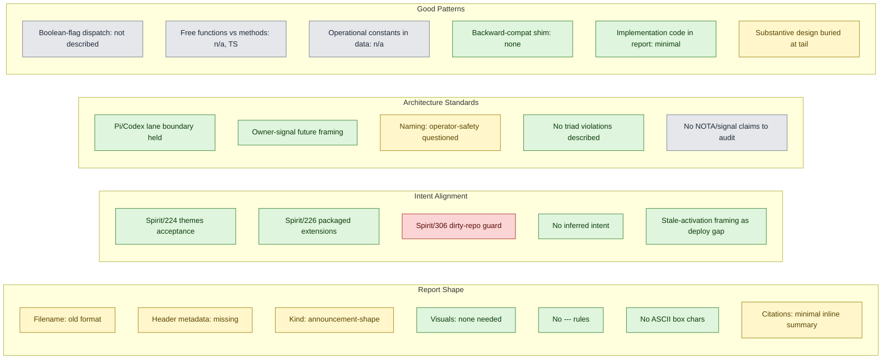

# 31 — audit of cluster-operator/7 (Pi harness follow-up)

*Kind: Audit · Topic: cluster-operator-pi-harness-audit · 2026-05-23*

## 1. Scope

Audit of `/home/li/primary/reports/cluster-operator/7-pi-harness-follow-up-after-third-designer-21-2026-05-23.md` (106 lines; the Pi-harness follow-up landed in `CriomOS-home` commit `f2e9c929`) against three standards:

- **Report shape** — `skills/reporting.md` filename, header, kind, tense, cross-reference, visual rules.
- **Intent alignment** — Spirit records on `persona-pi` (records 76, 77, 78, 79, 223, 224, 225, 226, 236) and `workspace` record 306 ("Pi operator-safety must not ask permission solely because a repository is dirty" — Correction, Maximum, 2026-05-23 13:17:37); plus the verbatim psyche prompts captured in those records' provenance.
- **Architecture standards** — `skills/component-triad.md` (CLI/daemon split, signal-vs-owner-signal authority surfaces, single-argument rule), `skills/naming.md`, `skills/abstractions.md` verb-belongs-to-noun, `skills/beauty.md` diagnostic catalogue.

The report is an operator landing log, not a design proposal — the audit weights are accordingly: shape and intent compliance carry most of the load; architecture-standards weight is light because the report names file paths but ships no Rust contracts or wire vocabulary.

## 2. Summary table

| Dimension | Grade | Key finding |
|---|---|---|
| Report shape | Drift | Old-format filename grandfathered; missing kind+topic+date metadata header; report-kind ambiguous (announcement, not Audit / Design / Postmortem) |
| Intent alignment | Failed | The `dirty jj repo → ask permission` extension explicitly violates record 306 (Correction, Maximum, same day as the report) |
| Architecture standards | Pass with reservations | Lane discipline held; no naming/triad violations in what's described; one open-ended naming question on the `operator-safety` extension |
| Good-pattern compliance | Drift | Substantive design substance (deployment-path problem framing, persona-pi v2 sketch) buried in a closing paragraph instead of a follow-up report |

## 3. Audit dimensions

## 4. Findings in detail

### 4.1 Failed: operator-safety extension #4 contradicts intent record 306 (Maximum)

The report at file:21-24 declares (as a feature shipped) that the `operator-safety` extension:

> "asks confirmation before file mutation in a dirty jj repository"

Intent record 306 (`workspace` topic, Correction, Maximum certainty, 2026-05-23 13:17:37, verbatim *"pi keeps asking me about a dirty directory to give permission, fix that"*) states:

> "Pi operator-safety must not ask permission solely because a repository is dirty."

The Correction landed the same day as the report and is more recent than the design intent that authorised the extension (the `pi-criomos` follow-up direction in `reports/third-designer/21` §3.2 §3 — "dirty_repo_guard refuses operations when the working copy has unrelated changes from other lanes"). Per `ESSENCE.md` §"Intent is the cornerstone" — *"The intent layer has higher authority than every other workspace surface; when two surfaces disagree, the intent layer wins"* — and `skills/reporting.md` §"Periodic review" / the supersession discipline, an audit-report whose contents the psyche has already corrected must be reflected in the next slice's design.

The follow-up `reports/cluster-operator/8-pi-harness-extension-testing-2026-05-23.md` does NOT roll back the dirty-repo prompt either; it tightens the force-push regex and adds tests. Both slices stand on a guard the psyche has explicitly rejected.

**Recommended action**: cluster-operator removes the dirty-repo confirmation from `packages/pi-criomos/src/extensions/operator-safety.ts`, lands a new slice that documents the removal against record 306, and updates the report at file:21-24 to no longer list that prompt as part of the shipped feature set. The other three confirmations (destructive shell, protected-path writes, no-interactive-UI block) are not addressed by record 306 and remain in scope.

### 4.2 Drift: filename and header — old format, no metadata line

The report file is `7-pi-harness-follow-up-after-third-designer-21-2026-05-23.md`. Per `skills/reporting.md` §"Filename convention" — the new format is `<N>-<kind>-<topic-and-title-slug>.md` (kind from the closed set: design / audit / research / proposal / review / synthesis / handover / postmortem). The current shape is the legacy `<N>-<topic>-<date>.md`; the `skills/reporting.md` §"Forward-only" carve-out grandfathers existing reports until the next refresh, so this is **drift, not a hard violation**.

The first body line (file:1) is just `# Pi Harness Follow-Up After Third-Designer 21`. Per `skills/reporting.md` §"Report header — kind, topic, date" the new format requires an italicised metadata line *immediately after the title heading* — `*Kind: ... · Topic: ... · 2026-05-23*`. The audited report does not carry this line.

A second filename smell: `skills/reporting.md` §"Filename convention" explicitly names `response-to-...`, `review-of-...`, and `audit-of-...` as anti-patterns — *"Avoid names like `response-to-...`, `review-of-...`, or `audit-of-...` when they hide the actual subject behind another report number."* The audited filename — `pi-harness-follow-up-after-third-designer-21` — has the same shape: the topic name announces conversational ancestry instead of subject. A future agent reading the path cannot tell that the report's actual subject is "Pi harness theme-switcher + operator-safety extensions packaged in CriomOS-home" without opening `reports/third-designer/21-...`.

**Recommended action**: when next touched (per the forward-only rule), rename to `7-handover-pi-harness-theme-and-safety-extensions.md` or `7-postmortem-pi-stale-activation.md` (depending on which substance the report is preserving) and add the metadata line.

### 4.3 Drift: report kind is ambiguous; substance is more handover-than-audit

The report reads as an announcement: "I did this, here's the verification, here are the remaining gaps." Per `skills/reporting.md` §"Kinds of reports — closed set, with destination" the eight kinds and their destination homes are:

- A `handover` if its purpose is catching the next agent up — what's done, open, load-bearing. Retires when the next handover supersedes.
- An `audit` if it verifies existing work against current intent. Retires when the named gaps land.
- A `postmortem` if it reconstructs a past surprise (the stale-activation incident at file:54-64 is exactly this shape). Retires when the lesson lands in a skill.

The report mixes all three — the result is that none of the destination homes (a future handover that supersedes; a follow-up that closes the gaps; a skill that absorbs the postmortem lesson) can fire cleanly, because there's no clear retire trigger. The most load-bearing substance — the stale-activation incident — sits in §"Activation" with no signal that it should propagate into `skills/feature-development.md` or a lojix discipline rule.

**Recommended action**: split into two reports next slice — a handover that records the live state (extensions packaged, live-active, beads filed), and a postmortem on the GitHub-rate-limit stale-activation incident with the lesson named.

### 4.4 Pass with reservation: operator-safety extension naming

The report at file:17, 21, 25 names the second extension `operator-safety.ts`. Inside `packages/pi-criomos/`, the package itself already carries the role (pi-side, criomos-deployed). The "operator" prefix is doing one of two things:

- naming the kind of agent the safety guards protect (per the workspace's role lexicon — operator runs on this Pi);
- or naming the package's purpose ("safety for operator-class work").

If the former, the prefix is namespace-restating (the package is already the pi-criomos operator harness — per `skills/naming.md` §"Anti-pattern: prefixing names with their namespace or domain"). If the latter, it reads OK because the namespace doesn't supply "safety." This is a quiet drift, not a violation — but the right English name once record 306 is honoured is probably `confirmations.ts` (since the dirty-repo confirmation is the one being dropped, the remaining substance is genuinely about confirmation prompts on destructive actions and protected paths).

### 4.5 Pass: lane discipline held

The report's "Remaining Gaps" section at file:97-101 explicitly recognises:

> "The operator-safety extension is intentionally first-pass. It confirms high-risk actions, protected writes, and dirty-repo writes, but it is not a complete sandbox or policy engine. It should eventually move toward typed owner-signal policy once Pi becomes a real persona-pi triad component."

This is correct lane-respecting framing. The cluster-operator does not unilaterally redesign the Pi safety surface as a typed owner-signal policy — it ships the first-pass TS extension and points at the structural destination (`owner-signal-persona-pi`) without claiming designer authority. Matches `skills/component-triad.md` §"Two authority tiers" — *"owner-signal-<component>` — owner-only authority/configuration surface"* — and the *"sub-agent default stance"* substrate `reports/third-designer/21` §3.3 (carry-over from /20 §4) flagged.

Similarly the report at file:79-85 files two beads (`primary-u7gc` for persona-pi v2 RPC integration, `primary-m1tk` for the broken terminal-cell smoke) instead of editing `persona/` directly — proper claim-flow respect, even when the same agent might have the context to fix in one place.

### 4.6 Pass: stale-activation framing as a deployment-path problem

The report at file:54-64 names the GitHub-rate-limit stale-activation correctly:

> "I first tried to activate from `github:LiGoldragon/CriomOS-home/main`. GitHub returned an unauthenticated API rate-limit response, and Nix used its cached copy of that flake. That stale activation temporarily showed only `packages/pi-linkup` in Pi settings and the unversioned `persona-spirit-daemon.service`. I corrected the live profile immediately by rebuilding and activating from `path:/git/github.com/LiGoldragon/CriomOS-home`."

And at file:103-107:

> "The GitHub-rate-limit stale activation is a deployment-path problem, not a Pi package problem. Lojix should probably authenticate GitHub flake resolution or prefer local path activation for the author's workstation when testing unmerged home-profile work."

This is the correct framing — the stale-activation surface belongs in `lojix` / system-specialist, not in pi-criomos. The pattern matches `intent/deploy.nota` 2026-05-17T13:30Z (*"one of the first thing lojix-daemon should take control of is the nix config, so it can change it and restart the nix-daemon whenever necessary"*) — lojix taking ownership of the deploy-path stance is on-direction.

What's missing: this finding is buried in a closing paragraph. Per `skills/reporting.md` §"Tone in chat replies" and the carry-forward discipline, a deployment-path lesson that affects *every* future home-profile activation under iteration is a postmortem-class finding worth its own report or skill update. Letting it sit in the tail risks it being lost when the report retires.

### 4.7 Drift: cross-reference inline-summary discipline

The report cites `reports/third-designer/21-audit-cluster-operator-6-pi-harness-2026-05-22.md` once (file:5) with no inline summary of what /21 said — bare locator. Per `skills/reporting.md` §"Inline-summary rule":

> "Every external section reference must carry a short inline summary of the cited substance. Naming a path is fine; naming a path *plus* a one-line summary of what's there is what makes the reference useful."

The reader has to open /21 to understand what the follow-up follows up *from*. A one-line inline summary — *"…the third-designer audit naming three v1 gaps: missing theme-switcher, missing operator-safety extensions, undeclared sub-agent default stance"* — would have closed this.

The beads at file:80, 86 (`primary-u7gc`, `primary-m1tk`) carry inline descriptions (good — matches AGENTS.md §"Opaque identifiers in chat carry an inline description"). The single bare-locator citation is the only inline-summary lapse.

### 4.8 Pass: substantive intent honoured (the parts that are on-direction)

The report's positive intent alignment, for the record:

- **Record 223** (*Persona-Pi should become the working Pi harness and Codex replacement path*): file:7-32 (extensions packaged, theme + safety, live-active) matches.
- **Record 224** (*acceptance includes live terminal usability and readable themes*): file:7-16 (theme-switcher reading Chroma `current-mode`, applying via `context.ui.setTheme`) matches.
- **Record 225** (*GPT-5.5 and GPT-5.4-mini model choices*): file:69-70 (verifies live `pi default model: gpt-5.5; default thinking: xhigh`) matches and is verified.
- **Record 226** (*Pi extensions packaged through Nix*): file:25-26 (`packages/pi-criomos/default.nix` packages both extensions) matches.
- **Record 236** (*Third-designer report 20 is relevant Pi harness input*): the report follows third-designer/21's recommended slice (§3 the three gaps and §6 single follow-up slice).

The fail on record 306 is a same-day cross-cutting Correction that the report could not have anticipated when designed but that the next slice must honour.

## 5. What the report does well

- **Witness shape over claim shape.** File:65-78 lists falsifiable live checks (`~/.pi/agent/settings.json` package list; `pi default model: gpt-5.5`; `~/.local/state/chroma/current-mode` exists; versioned `persona-spirit-daemon-v0.1.0.service` and `v0.1.1.service` both active) rather than just narration. Matches `skills/operator.md` §"Land features bundled with their tests".
- **Honest gap-listing.** File:89-107 names what wasn't done (no live mid-stream palette-flip witness; operator-safety first-pass; stale-activation as deploy-path problem) — agent hygiene matching `reports/third-designer/21` §"Strengths/Honest gap-listing".
- **Bead-filing for lane-respecting deferrals.** Two beads filed instead of editing other lanes' code (`primary-u7gc` persona-pi architecture note + `primary-m1tk` terminal-cell smoke fix), each with inline descriptions.
- **Verification reproducibility.** File:40-47 captures exact commands (`nix fmt`, `nix build .#pi-criomos .#checks.x86_64-linux.pi-harness-profile`, `nix flake check`, two `pi -e ... --list-models gpt` extension-load probes). A future agent can re-run.

## 6. Recommended changes

In priority order:

1. **Remove the dirty-repo confirmation prompt from `operator-safety.ts`.** Per record 306. Ship as the next cluster-operator slice. Tests for the remaining three guards (destructive shell, protected paths, no-interactive-UI) stay; the `pi-harness-profile` check at `reports/cluster-operator/8` is updated to no longer assert the dirty-repo behavior.
2. **Add the metadata header** (`*Kind: Handover · Topic: pi-harness-deploy · 2026-05-23*` or similar — psyche or designer can pick the right kind) when the file is next touched.
3. **Split the stale-activation finding into a postmortem report** under cluster-operator or system-specialist (the substance leans system-specialist given lojix ownership) with the lesson named for absorption into `skills/feature-development.md` or a new `skills/deploy-path-discipline.md`. Otherwise the finding will retire with this report and not propagate.
4. **Inline-summary the /21 citation** when the report is next touched (one-line description of what /21 found).
5. **Reconsider the `operator-safety.ts` filename** once record 306 is honoured. `confirmations.ts` reads more accurately; `operator-safety.ts` over-promises (suggests a sandbox / policy engine; the extension is three confirmation prompts).
6. **File a system-specialist bead** for the lojix GitHub-rate-limit / prefer-local-path-on-author-workstation deploy-path question — currently the substance only lives in the closing paragraph.

## 7. Open questions for the psyche

Two questions where the audit can't act without psyche input.

### 7.1 — `operator-safety.ts` after record 306: full removal of confirmation or scoped removal?

Record 306's wording is — *"Pi operator-safety must not ask permission solely because a repository is dirty"* — verbatim *"pi keeps asking me about a dirty directory to give permission, fix that"*. Two readings of "fix that":

- **(a) Remove the dirty-repo confirmation entirely.** No prompt is issued just because the working copy is dirty. The other three confirmations (destructive shell, protected paths, no-interactive-UI block) stay.
- **(b) Make the dirty-repo prompt smarter.** Only prompt when a different lane's uncommitted changes are present (the partial-commit-pattern case `reports/third-designer/21` §3.2 explicitly cited as the motivation). Same-lane dirty work doesn't trigger; cross-lane drift does.

Reading (a) is conservative and matches the verbatim "fix that" without inferring further intent (per ESSENCE §"Inferring intent is forbidden"). Reading (b) preserves the original design rationale but adds inference. Recommendation: (a), since the design-intent that authorised (b)-style dirty-repo guards is `reports/third-designer/21` §3.2, not a recorded psyche statement, and the Correction is Maximum certainty.

### 7.2 — Is the stale-activation incident a lojix-daemon scope expansion, or a skills-level cluster-operator-day discipline?

Two homes for the lesson:

- **(a) Skill** — `skills/feature-development.md` or a new `skills/deploy-path-discipline.md` adds a rule: when iterating on a CriomOS-home profile during the same session as upstream commits, prefer `path:/git/...` over `github:LiGoldragon/...` to avoid stale-cache hits behind unauthenticated GitHub API rate-limits.
- **(b) Lojix-daemon scope expansion** — record an intent that lojix-daemon either authenticates GitHub flake resolution (uses a token from the operator's keyring) or treats `path:/git/...` as the default activation source for the author's workstation when the upstream isn't pushed yet. This matches the deploy intent at `intent/deploy.nota` 2026-05-17T13:30Z (*"lojix-daemon takes control of nix configuration"*) generalising to flake-input resolution.

Reading (a) is cheap and lands now; (b) is more correct but is a structural decision that needs designer-level review and ultimately a Spirit record from the psyche. Recommendation: do (a) now, propose (b) in a system-designer report; both can coexist.

## 8. References

- `reports/cluster-operator/7-pi-harness-follow-up-after-third-designer-21-2026-05-23.md` — the audited report; 106 lines; landed `CriomOS-home` commit `f2e9c929` packaging `theme-switcher.ts` + `operator-safety.ts`.
- `reports/third-designer/21-audit-cluster-operator-6-pi-harness-2026-05-22.md` — the audit /7 follows up from; named three gaps (mid-task theme-switching, operator-safety extensions, sub-agent default stance) for the cluster-operator follow-up slice.
- `reports/cluster-operator/8-pi-harness-extension-testing-2026-05-23.md` — the next slice; tightens the operator-safety force-push regex; does NOT roll back the dirty-repo confirmation (Finding 4.1 applies here too).
- Spirit record 224 (*Persona-Pi acceptance includes live terminal usability and readable themes*, Maximum, 2026-05-22): on-direction.
- Spirit record 226 (*Persona-Pi should package standard Pi extensions through Nix*, Medium, 2026-05-22): on-direction.
- Spirit record 306 (*Pi operator-safety must not ask permission solely because a repository is dirty*, Maximum, 2026-05-23 13:17:37): failed (Finding 4.1).
- Spirit record 243 (*Visuals in reports MUST be mermaid diagrams; no ASCII text-block diagrams*, Maximum, 2026-05-22): respected (the audited report ships no visuals, no ASCII boxes).
- `skills/reporting.md` §"Filename convention", §"Report header", §"Inline-summary rule", §"Kinds of reports": the shape standards Finding 4.2, 4.3, 4.7 are held to.
- `skills/component-triad.md` §"Two authority tiers": the structural destination Finding 4.5 cites.
- `ESSENCE.md` §"Intent is the cornerstone": the supersession rule Finding 4.1 invokes.

This audit retires when Finding 4.1 lands in a follow-up cluster-operator slice (record 306 honoured) AND the metadata header + filename refresh happen (Finding 4.2, 4.3). Findings 4.6 + 4.7 + the open questions are designer-level next steps.
