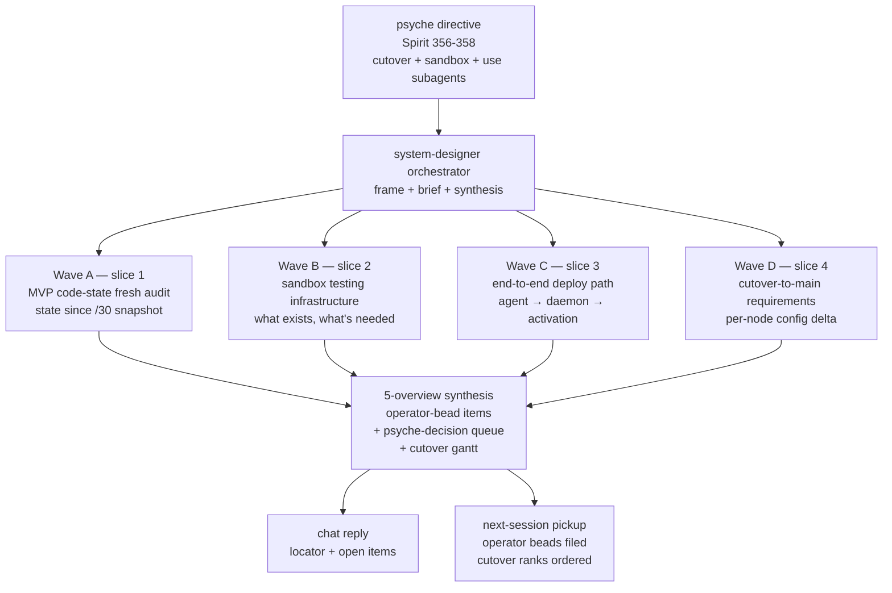

# 34/0 — frame and method: MVP and sandbox audit toward lean-stack cutover

*Kind: Meta-report frame · Topic: lean-stack MVP + sandbox-testing audit · 2026-05-23*

## Purpose

Psyche directive (2026-05-23, captured as Spirit 356/357/358):

> *audit systems that are being developped for getting to MVP new
> lojix/horizon stack, and make it our main deployment. we need
> passing sandbox testing. prometheus has working nspawn sandbox
> testing I think. use subagents.*

The directive sets three load-bearing items:

1. **Decision** (Spirit 356, Maximum): the lean lojix/horizon stack
   becomes the main deployment after MVP. Cutover from the legacy
   `lojix-cli` stack to the lean stack (`lojix` daemon + thin CLI +
   lean horizon library + pan-horizon config) is now the active
   direction; `INTENT.md` §"Two deploy stacks coexist" gets a
   forward-motion endpoint.
2. **Constraint** (Spirit 357, Maximum): passing sandbox testing is
   a precondition for that cutover. MVP is gated on sandbox-pass,
   not just feature-parity.
3. **Clarification** (Spirit 358, Minimum, hedged): Prometheus node
   has existing nspawn-based sandbox testing — pointer for the audit
   to start from.

The audit surfaces three things for psyche review:

- **Where the developed code actually stands today** — fresh state
  audit, not relying on /30's snapshot (one week old; lojix has
  moved substantially in a feature branch since).
- **What "passing sandbox testing" means concretely** — the existing
  CriomOS-test-cluster + Prometheus runners + nspawn deploy path;
  what they cover today, what they need to cover for the lean stack,
  what new tests are MVP-required.
- **What "main deployment" requires** — concrete delta in
  CriomOS-home / CriomOS / per-node config to swap `lojix-cli` for
  the lean stack; per-node consequences; rollback story.

Output is **operator-bead-shaped items** per `skills/designer.md`
§"Audits feed into bead filing" — concrete, file-pathed, dependency-
marked items operator (or other implementation lanes) can pick up
without first reading the full meta-report.

## Method — four parallel slice audits, then synthesis

Per `skills/designer.md` §"Parallel manifestation + audit pattern"
+ `skills/reporting.md` §"Meta-report directories":

The four waves are **independent** (no cross-slice dependencies);
each subagent reads what it needs without coordinating with siblings.
Outputs aggregate at synthesis only.

## Why now — this audit's distinct value over /30

`/30` was the substrate audit: codec/library versions, per-repo
pin matrix, role-merge migration shape. Necessary substrate
groundwork; not bead-output shaped.

`/34` is the **cutover-readiness audit**: with substrate
groundwork done and lojix feature-branch work substantially
advanced (per recent jj log: daemon socket runtime, typed
config, deployment actor pipeline, gc-root pinning, event log
persistence, streaming observations, real build smoke runner —
**none yet on main**), the load-bearing question is: *what's the
shortest path from "this feature branch + missing pieces" to
"sandbox-passing main deployment"?*

The answer the audit produces is the bead queue for the next
implementation arc, in priority order, with dependencies.

## Slice briefs

### Wave A — MVP code-state fresh audit (slice 1)

**Lane.** Subagent dispatched as `Explore` — read-only investigation.

**Question.** Where does the lean stack stand in code, today?
Specifically: how far has the lojix feature branch advanced beyond
/30's snapshot; what's the smallest set of additional commits to
reach feature-parity-with-sandbox-passing?

**Required reading.**
- `/30-horizon-lojix-low-level-migration/` — baseline snapshot.
- `/33-handover-finishing-lean-lojix-horizon-stack.md` — pending
  queue + open decisions.
- `/git/github.com/LiGoldragon/lojix` — read the feature-branch
  commits via `jj log` (working copy has ~20 commits ahead of main).
- `/git/github.com/LiGoldragon/horizon-rs` — `ae8754d horizon-rs:
  refresh main NOTA codec consumers` landed since /30; verify
  what that covers.
- `/git/github.com/LiGoldragon/signal-lojix` — `a007e8b` on main;
  feature branch has more.
- `/git/github.com/LiGoldragon/signal-criome`, `criomos-horizon-config`,
  `CriomOS-lib` — substrate cascade leaves.

**Output shape.** `1-mvp-code-state-fresh-audit.md`, ≤400 lines,
TL;DR + per-repo state table + mermaid showing what's landed vs
what's pending + concrete bead-shaped items (file paths, dependencies).

**Don'ts.** Don't redo /30's library version audit. Don't propose
designs — surface gaps and recommend bead-shaped follow-ups.

### Wave B — sandbox testing infrastructure audit (slice 2)

**Lane.** Subagent dispatched as `Explore`.

**Question.** What sandbox testing exists today? What's tested,
what's not? What needs to evolve for the lean stack to be
testable through this infrastructure?

**Required reading.**
- `/git/github.com/LiGoldragon/CriomOS-test-cluster/` — the
  full repo. Note `README.md` flow, `flake.nix` check + apps,
  `scripts/run-on-prometheus`, `scripts/build-dune-on-prometheus`,
  `scripts/nspawn-dune-on-prometheus`, `clusters/fieldlab.nota`,
  `fixtures/horizon/*.json`, `checks/*.nix`.
- `/git/github.com/LiGoldragon/CriomOS/checks/nspawn-role-policy/default.nix`
- `/git/github.com/LiGoldragon/CriomOS/modules/nixos/nspawn.nix`
- `/git/github.com/LiGoldragon/CriomOS/modules/nixos/criomos.nix`
- `/git/github.com/LiGoldragon/lojix/ARCHITECTURE.md` lines
  ~200 and ~350 (nspawn-dune-on-prometheus references) + any
  sections naming testing.
- `/git/github.com/LiGoldragon/lojix` jj log entry
  `ntxmvyonmsyz lojix: add generic real build smoke runner` — what
  did this land?

**Output shape.** `2-sandbox-testing-infrastructure.md`, ≤400 lines,
TL;DR + mermaid of the test-flow + current-coverage table +
lean-stack coverage-gap table + concrete test-bead items.

**Don'ts.** Don't propose net-new test frameworks; the existing
flake-check + Prometheus-runner shape is established. Identify
ports/additions, not rewrites.

### Wave C — end-to-end deploy-path audit (slice 3)

**Lane.** Subagent dispatched as `Explore`.

**Question.** What's the lean stack's end-to-end deploy path,
step-by-step? Which steps work today vs which are blocked? What's
the smallest end-to-end demo possible today vs after MVP?

**Required reading.**
- `/git/github.com/LiGoldragon/lojix/ARCHITECTURE.md` — full read,
  especially deploy-path sections.
- `/git/github.com/LiGoldragon/signal-lojix/ARCHITECTURE.md` + `src/lib.rs`
  on feature branch (vs main).
- `/git/github.com/LiGoldragon/horizon-rs/ARCHITECTURE.md` —
  projector role.
- `/git/github.com/LiGoldragon/criomos-horizon-config` — config
  surface.
- `/30/2-lojix-signal-lojix-state.md` — baseline lojix state.
- `/33-handover` §"What's open — wire-shape residuals" — 7 lojix-
  mesh-side residuals (idempotency key, GC-root lifetime,
  cancellation, etc.).

**Output shape.** `3-end-to-end-deploy-path.md`, ≤400 lines,
TL;DR + mermaid sequence-diagram of the deploy path + per-step
state table (designed/coded/tested/blocked) + minimal demo
scenario + blocker bead items.

**Don'ts.** Don't redo the wire-shape design work from /33 — only
identify which of those residuals are MVP-gating vs deferrable.

### Wave D — cutover-to-main-deployment requirements (slice 4)

**Lane.** Subagent dispatched as `Explore`.

**Question.** Concretely, what is "main deployment" in this
workspace? What needs to land in `CriomOS-home` / `CriomOS` /
per-node config to swap `lojix-cli` for the lean stack? What's the
rollback story?

**Required reading.**
- `/git/github.com/LiGoldragon/CriomOS-home/` — search for
  `lojix-cli` references; `modules/home/` for per-user binaries
  pinned to lojix-cli (likely a `programs/lojix-cli.nix` or similar);
  `modules/home/profiles/min/` if a min profile carries the
  binary.
- `/git/github.com/LiGoldragon/CriomOS/` — `modules/nixos/` for
  any `lojix-cli` or daemon service references; identify whether
  the new `lojix` daemon needs a systemd service unit and where
  it would land.
- `/git/github.com/LiGoldragon/CriomOS/modules/nixos/nix/` — Nix
  client/builder config; the new lean stack consumes `criomos-
  horizon-config` per /30.
- `/home/li/primary/INTENT.md` §"Two deploy stacks coexist" —
  the cutover the psyche has now directed.
- `/home/li/primary/intent/deploy.nota` — full read; the cutover
  has psyche intent across multiple records.

**Output shape.** `4-cutover-to-main-deployment-requirements.md`,
≤400 lines, TL;DR + per-node consequence table + cutover-day
mermaid sequence + rollback story + concrete cutover-bead items
+ open questions for psyche.

**Don'ts.** Don't propose a date or schedule — psyche owns timing.
Don't decide rollback policy unilaterally — surface options.

## Output shape across all four waves

Each slice report follows `skills/reporting.md` discipline:

1. **TL;DR** — falsifiable summary; reader can stop after this and
   know what was found.
2. **At least one mermaid diagram** — shape at a glance.
3. **Concrete file paths everywhere** — no opaque references.
4. **Bead-shaped output items** — title, 1-2 line description,
   file paths, dependencies on other items (cross-slice deps OK),
   priority lean.
5. **Open questions for psyche** — surfaced, not invented-answered.

## Synthesis (5-overview.md)

The orchestrator (this lane) reads all four slice reports, then:

- Marries bead items across slices (deduplicate; identify
  cross-slice dependencies; assign ranks).
- Surfaces the **most-important psyche decisions** (≤5; each
  with possible-solutions + recommendation per `/30/5`'s pattern).
- Draws the **migration topology refresh** (mermaid; updates
  `/30/5`'s topology to reflect feature-branch state).
- Draws the **cutover gantt** (mermaid; rank-ordered with
  dependency arrows).
- Names the **next-session pickup queue** (concrete file paths,
  in priority order; supersedes /33's pickup queue).

## Risks

- **Stale audit risk**: /30 is one week old; lojix has moved
  substantially. Wave A's primary job is freshness. Synthesis
  should reweigh /30's recommendations against current state.
- **Sandbox-coverage gap risk**: CriomOS-test-cluster currently
  tests the OLD horizon (its `inputs.horizon = github:.../horizon-rs`
  doesn't pin a lean-stack branch). The lean-stack tests may
  require fork or branch-pin updates — Wave B identifies.
- **Cutover-blast-radius risk**: Wave D needs to enumerate every
  consumer touching `lojix-cli` so the cutover-day rebuild is
  comprehensive; missing a per-node consumer leaves it broken
  post-cutover.
- **Decision-overload risk**: /33 carries 5 unsettled psyche
  decisions; /34 likely adds 3-5 more. Synthesis must rank
  decisions by *blocking impact on MVP* so the chat reply
  surfaces the load-bearing few, not the full set.

## Lane state at session open

- Lock: `[draft:horizon-lojix-migration-2026-05-23]` (held; this
  meta-report is the session's work).
- Reports lane: 6 single reports + `/30` meta-report directory.
  `/34` adds a second meta-report directory.
- Spirit substrate: records 302-358 active; this session adds 356,
  357, 358 at open (psyche cutover decision + sandbox constraint
  + nspawn pointer).
- Working copy: clean at session open (no co-mingled files this
  session, per /33's "split-first" discipline lesson).

## See also

- `/30-horizon-lojix-low-level-migration/` — prior substrate audit.
- `/33-handover-finishing-lean-lojix-horizon-stack.md` — open queue
  + wire-shape residuals.
- `/29-lean-horizon-cluster-data-shape.md` — role-merge destination.
- `/32-design-lojix-authenticated-flake-resolution.md` — nix-auth
  design.
- `skills/designer.md` §"Audits feed into bead filing" —
  output-shape discipline.
- `skills/designer.md` §"Parallel manifestation + audit pattern" —
  dispatch pattern.
- `skills/context-maintenance.md` §"Method" — substance migration
  discipline (applied when synthesis bumps /33 to retire).
