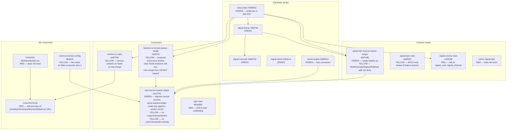

# 1 — MVP code-state fresh audit

*Kind: Audit slice (Wave A of /34) · Topic: lean lojix/horizon stack code state · 2026-05-23*

## TL;DR

The lojix feature branch (`horizon-leaner-shape`, tip
`be12741` (build-smoke service-variant alignment)) has moved
**substantially** past /30's snapshot. The /30 claim that lojix
is "still on `signal-core`, still matches on `wire::Request`
variants, no `LojixCommand`, no `Lowering`, no three-layer
wiring" is **partially outdated**: lojix-daemon now consumes
**signal-frame** through its dep on the `horizon-leaner-shape`
branch of `signal-lojix` (which migrated to
`signal_frame::signal_channel` per commit `ef98dc0` (contract-
local verbs)), has a **typed daemon socket runtime** with
Kameo actor topology, a **build-only deployment pipeline**
gated on `CriomeAuthorization`, **sema-backed event log +
generation ledger + observation subscriptions** that survive
DB reopen, and a **generic real build smoke runner** invokable
as `apps.<system>.real-build-smoke`. What is **NOT yet built**:
(a) the `Deploy` → `Build/Activate/Deploy/Rollback` four-way
split (/30 Decision 3 — signal-lojix still has single `Deploy`
op); (b) closure copy + activation phases (only `Build` of
`SystemAction` accepted; `OsOnly`/`Home` paths reject); (c)
`LojixCommand` enum + explicit `Lowering` impl as a typed
internal command layer; (d) `owner-signal-lojix` repo (/30
Decision 4 — does not exist); (e) `criomos-horizon-config`
integration with CriomOS-home flake (the file exists at
`/git/.../criomos-horizon-config/horizon.nota` but no
consumer pins it); (f) horizon-rs role-merge (both `main`
and `horizon-leaner-shape` still carry the 18-field
NodeProposal, `BehavesAs`/`BuilderConfig` views, view-side
booleans); (g) `CriomOS-lib/lib/predicates.nix` (does not
exist). The shortest MVP path is roughly **6 commit-arcs**
across 4 repos, none individually large.

## Per-repo current-state table

| Repo | Main HEAD (commit) | Feature branch (commit) | What /30 said | Reality (2026-05-23) | MVP-blocking? |
|---|---|---|---|---|---|
| **lojix** | `8b0d585` (ARCH name channel shape) | `horizon-leaner-shape`: `be12741` (align build smoke with service variants) | "Still on signal-core, still matches `wire::Request`, no LojixCommand, no Lowering, deploy.rs 2105 lines, deployment_n string identity" | Feature branch: signal-frame via signal-lojix dep, typed `wire::Request` match in `RuntimeRoot`, Kameo actor topology, sema-backed ledger, build-only pipeline + CriomeAuthorization gate, smoke runner. No `LojixCommand`/`Lowering` yet; `deploy.rs` is **2105 lines** (matches /30). Activation phases NOT implemented. | **YES** — main is far behind; feature branch is the MVP candidate |
| **horizon-rs** | `ae8754d` (refresh main NOTA codec consumers) | `horizon-leaner-shape`: `7a3072c` (migrate NOTA fixtures to bracket strings) | Main 18-field NodeProposal, NodeSpecies+NodeService split, no role-merge | Confirmed: main has **NodeService** Vec (commit `ab0fbb8`) + service-variant projection. Feature branch refactors `proposal/` into 13 modules (placement, services, ai, etc.) + drops shape-equivalent view types — but **still has** `BehavesAs`, `BuilderConfig`, 16 view-side booleans, `species` field on NodeProposal. **Role-merge from /29 is NOT started** on either branch. | **NO for MVP** if MVP scope is "deploy through lean stack" without role-merge first; **YES if /29's role-merge is MVP-required** |
| **signal-lojix** | `ae8b352` (align ARCH with three-layer model per /246-v4) | `horizon-leaner-shape`: `a007e8b` (migrate NOTA sum records to bracket strings) | "Main `a007e8b`; feature branch has more" | **CORRECTION**: feature branch IS `a007e8b`; main is `ae8b352` (ARCH-only commit ahead of feature branch, no src/lib.rs change). Feature branch has the contract-local verb migration (`ef98dc0`) + canonical deployment digest (`df49dae`) + typed startup configuration records. Single `Deploy` op (NOT 4-way split). | Feature branch is current; main is empty-ahead |
| **signal-criome** | `ca93c9d` (refresh bracket-string NOTA) | (no relevant feature branch tip ahead) | "Bump signal-core → frame needed" | **Confirmed UNCHANGED**: `src/lib.rs:6` still imports `signal_core::signal_channel`. /30/3's signal-criome bump is still pending. | **NO** (only blocks consumers of signal-criome; lojix-daemon's signal-criome import is used only for `CriomeAuthorization`-vocab newtypes, not the channel macro on signal-criome itself) |
| **criomos-horizon-config** | `08adcf1` (use transitional IPv4 LAN) | — | Listed as cascade leaf | **Exists** with `horizon.nota` (HorizonProposal in NOTA), `ARCHITECTURE.md`. **No consumer pins it yet** — neither CriomOS-home flake nor any test cluster reads it. lojix's smoke runner takes `LOJIX_SMOKE_HORIZON_CONFIGURATION_SOURCE` as an env var pointing at a caller-provided path. | **YES, soft-block** — the daemon loads pan-horizon from `LojixDaemonConfiguration.horizon_configuration_source`; for MVP cutover this must be a stable flake path |
| **CriomOS-lib** | `526e411` (document shared library boundary) | — | "predicates.nix + constants — NEW INTENT.md needed" | **`lib/predicates.nix` does NOT exist**. Only `lib/default.nix` (small constants ns) + `data/largeAI/`. The /29 view-side derivation migration target file has not been created. | **NO for MVP if /29 role-merge is deferred**; otherwise **YES** |
| **owner-signal-lojix** | (does not exist) | — | "NEW REPO needed, minimum-compile-set" | **Repo does NOT exist on disk** at `/git/github.com/LiGoldragon/owner-signal-lojix`. Other `owner-signal-*` repos exist (cloud, persona-spirit, etc.) so the convention is established but lojix's owner contract is unfiled. | **YES** if lojix-daemon needs typed owner policy at startup (e.g. builder registry); **NO** if first MVP runs with hard-coded policy in `RuntimeConfiguration::for_in_process_tests`-shaped configuration |

## Substrate cascade — landed vs pending

The cascade rank-colors per /30/5 Decision 1's substrate-up
ordering, refreshed against current state:

- **Rank 1** (signal-criome bump): unchanged, still RED.
- **Rank 2** (signal-lojix verb split): YELLOW — contract-local
  migration landed, but the 4-way Deploy split has NOT happened.
- **Rank 3** (owner-signal-lojix): RED — repo missing.
- **Rank 4** (horizon-rs role-merge): YELLOW on feature branch —
  much restructuring landed (placement, services, secret, ai
  modules) but the 13-step migration from /30/1 has not begun.
- **Rank 5** (CriomOS-lib predicates+constants): RED.
- **Rank 6** (lojix Lowering+three-layer + activation): YELLOW —
  daemon socket + build pipeline GREEN; Copy/Activate/Switch
  phases and `LojixCommand`/`Lowering` typed layer NOT done.
- **Rank 7** (Spirit flip): orthogonal to the lojix MVP path.
- **Rank 8** (guidance refresh): orthogonal.

## Detailed deltas from /30 snapshot

### lojix feature branch progress (20 commits ahead of main)

The /30/2 snapshot is one week stale. Since then, on
`horizon-leaner-shape`:

- `mkrwpxsznsmn` (`76bf696` — first daemon socket runtime slice)
  introduced `client.rs`, `runtime.rs`, `error.rs`, the Kameo
  `RuntimeRoot`, and the socket listener. Same commit added
  `flake.lock` and reshaped the binaries.
- `pykvsxpxsltq` (typed configuration migration) added
  `LojixDaemonConfiguration` / `LojixCliConfiguration` reads via
  `nota-config`, satisfying C7b/C7c/C7d in ARCHITECTURE.md §6.
- `lnyqnrxlsprr` + `tuvnwlmzsnvn` + `lxutpkyqsrut` + `mvzvtkvuppmo`
  + `pumvkpwpqprn` + `opozxkxskqvt` built up the build-only
  deployment actor pipeline, GC-root pinning, sema event log
  persistence, streaming observations, and subscription-retraction
  cleanup. `tests/event_log.rs` proves DB-reopen durability;
  `tests/socket.rs` proves push-streaming semantics; `tests/
  build_pipeline.rs` proves CriomeAuthorization gating.
- `ntxmvyonmsyz` (commit `c39dc90` — generic real build smoke
  runner) added `tests/real-build-smoke.sh` + the
  `apps.<system>.real-build-smoke` Nix wrapper. Takes 6 required
  env vars: cluster name, node name, builder name, proposal
  source path, horizon configuration source path, flake
  reference. Drives the full daemon-spawn → request → poll-for-
  `DeploymentBuilt` → verify GC root → verify generation listing
  flow. **No hardcoded cluster** — caller picks.
- `tnmtplkwmvzs` (project deployments with pan-horizon config)
  added pan-horizon `HorizonProposal` reads alongside the
  per-request `ClusterProposal`.
- `prmspmwtxtsr` (gate build effects on criome authorization)
  added the `CriomeAuthorization` actor + policy
  (`unavailable_until_criome_socket_lands` default for daemon;
  `grant_for_tests` for in-process).
- The remaining 8 commits are doc/test alignment work.

What's still NOT done on the feature branch (the gap):

1. **Activation phases.** `deploy.rs:1004-1009` rejects
   `BuildLocally`; lines 1265-1266 reject `BuildLocally` again
   "in build-only daemon slice". The pipeline ends at
   `DeploymentBuilt` — no `Copying`/`Activating`/`Succeeded`
   states emitted, no closure-copy to target, no
   `nixos-rebuild switch` invocation. ARCHITECTURE C16 admits
   this: "Current implemented slice accepts only build-only
   submissions, rejects local builds and activation actions
   before any external tool runs".
2. **No `LojixCommand` enum / `Lowering` impl.** The `RuntimeRoot`
   matches on `wire::Request` directly (`runtime.rs:213-308`).
   `signal-executor` is NOT in lojix's deps — no three-layer
   lowering yet. /30 Decision 3's three-layer wiring (Contract →
   Command → Sema) has NOT been introduced.
3. **Single `Deploy` op, not 4-way split.** `signal-lojix`'s
   `signal_channel!` block (visible at horizon-leaner-shape
   `src/lib.rs`) declares one `Deploy(DeploymentRequest)` op.
   /30 Decision 3's Build/Activate/Deploy/Rollback split is
   contract-level work that has not happened.
4. **No `peer_daemons` wiring beyond static config.** The
   `LojixDaemonConfiguration` carries `peer_daemons:
   Vec<PeerDaemonBinding>`; no discovery, no health-check.
   Matches /33's `peer_daemons` residual.
5. **CriomeAuthorization default policy is "unavailable".**
   `runtime.rs:43-44` returns
   `CriomeAuthorizationPolicy::unavailable_until_criome_socket_lands()`.
   Real builds would be rejected without a test-grant override.

### horizon-rs main vs horizon-leaner-shape

The brief's commit `ae8754d` (codec-consumers refresh) on main
is a small refresh:
- `lib/src/proposal.rs` (+90 lines) — adds the `services: Vec<NodeService>` field on `NodeProposal` plus the `NodeService` enum (TailnetClient, TailnetController, etc.), per commit message "use current nota sum API".
- `lib/src/io.rs`, `lib/src/name.rs`, `lib/tests/proposal.rs` — small adjustments to NOTA grammar (sum-with-data wire shape).
- `Cargo.lock` — bumps nota-codec to `538555e`.

This **partially advances** the role-merge by introducing typed
service variants but does NOT do the headline change from /29:
the position-1 `Role` enum on NodeProposal, the drop of
`species`/`node_ip`/`wireguard_pub_key`/etc. fields, the Pod →
Contained rename, the view-side derivations migration. Main
still has 61 `pub` fields in proposal.rs; horizon-leaner-shape
has 28 across its restructured modules (counts differ because
the feature branch split fields across modules).

`horizon-leaner-shape` adds a different axis of restructuring:
proposal-side cleanup (drop same-value-twice fields, drop
TypeIs+ComputerIs enum-shadows, drop view::Machine+view::Io
that were shape-equivalent to proposal types, add typed
newtypes for public_domain/email_address/matrix_id/ssid/country,
add Cluster.tld + Cluster.public_domain + Cluster.ai_providers,
add NodePlacement (Metal|Contained) module, add NodeService
variants, add SecretReference module). This is **all
substrate restructuring without the position-1 Role merge**.
The /30/1 slice's 13-step migration list is essentially intact.

### What /30 got right, vs what changed

| /30 finding | Status now |
|---|---|
| "horizon-rs zero of 13-step role-merge has landed" | Mostly true — service variants partially landed on main, but the 9-field shape + position-1 Role + view-side predicate migration has not started |
| "lojix still on signal-core, no LojixCommand, no Lowering" | **Partially outdated**: lojix now consumes signal-frame (via signal-lojix's branch). LojixCommand/Lowering still absent. |
| "deploy.rs 2105 lines" | Confirmed (still 2105 lines on feature branch) |
| "Spirit v0.1.0 deployed, v0.1.1 packaged" | Out of scope of Wave A — unchanged from /30/3 |
| "owner-signal-lojix does not exist" | Confirmed |
| "CriomOS-lib predicates.nix needed" | Confirmed — does not exist |
| "signal-criome needs signal-core → frame bump" | Confirmed — still on signal-core |
| "nota-codec dual pin in lojix" | **RESOLVED**: lojix's lock has single nota-codec `538555e` pin (the `horizon-nota-codec` alias resolves to the same source) |

## Smallest path to MVP

Assuming MVP scope is "lean lojix daemon performs a real
build → copy → activate cycle against a sandbox node, observable
end-to-end through a CLI subscription". The /29 role-merge can
be deferred behind a "lean stack runs on current horizon-rs
shape" interpretation. Sandbox-passing is gated through Wave B.

The shortest path is **6 commit-arcs** in dependency order. Sizes
are rough effort estimates relative to landed slices.

1. **lojix-A — activation phases on the build-only pipeline.**
   Add `Copying` and `Activating` `DeploymentObservation` events;
   wire `nix-copy-closure` + `nixos-rebuild switch` via
   `process.rs::ProcessToolchain`; emit `DeploymentSucceeded` or
   `DeploymentFailed` with rollback. Touches `src/deploy.rs`,
   `src/process.rs`, `tests/build_pipeline.rs`, ARCHITECTURE.md.
   Similar weight to `lnyqnrxlsprr` (build-only pipeline). **Largest single commit-arc on the path.**

2. **signal-lojix-A — Deploy → Build/Activate/Deploy/Rollback
   split.** Per /30 Decision 3 + /33's recommendation, commit to
   the 4-way split. Contract-only change on
   `signal-lojix/src/lib.rs`. Adjust lojix-daemon's `RuntimeRoot`
   handlers. Touches signal-lojix's contract + lojix's
   `src/runtime.rs` request match arm.

3. **owner-signal-lojix-A — create the repo with
   minimum-compile-set.** Per /30 Decision 4: builder registry +
   nix-config defaults. Repo bootstrap (Cargo.toml + lib.rs +
   ARCHITECTURE.md + flake.nix + AGENTS.md + skills.md + first
   `signal_channel!` block). lojix-daemon picks up
   `OwnerLojixOperation` for builder selection.

4. **criomos-horizon-config-A — wire as flake input + lojix
   daemon config default.** Add `criomos-horizon-config` as
   `inputs.<name>` somewhere (likely lojix's flake; the daemon
   `LojixDaemonConfiguration` then defaults its
   `horizon_configuration_source` to a buildable flake path).
   Eliminates the env-var dependency for production daemon
   start.

5. **lojix-B — `LojixCommand` enum + `Lowering` impl.** Introduce
   `signal-executor` dep; define `LojixCommand` (Contract layer
   → Command layer); implement `Lowering<wire::Request,
   LojixCommand>`. Move the `RuntimeRoot` request-match logic into
   the Lowering. This is /30 Decision 3's three-layer wiring on
   the lojix side.

6. **lojix-C — CriomeAuthorization production policy.** Replace
   `unavailable_until_criome_socket_lands` with a policy that
   reads from `LojixDaemonConfiguration` (operator-allowlist or
   accept-everything-from-self for first sandbox MVP). Sandbox
   tests need to succeed without `grant_for_tests`. May depend
   on Wave B for sandbox shape.

If the psyche treats /29's role-merge as MVP-required (not
deferrable), insert **horizon-rs-A** (the 13-step migration
sequence per /30/1) + **CriomOS-lib-A** (create predicates.nix
+ migrate CriomOS gates) between arcs 4 and 5. That doubles
the path length and pulls in the Decision 2 cutover
coordination.

## Open question for psyche

**Q1 (MVP scope clarification).** Does the lean-stack MVP
require horizon-rs's /29 role-merge (Role enum at position 1,
view-side booleans → CriomOS-lib predicates, Pod → Contained
rename, drop node_ip via wireguard derivation), OR can the MVP
ship against the current horizon-rs shape (with service variants
already on main + restructured proposal modules on
`horizon-leaner-shape`)? The two answers are ~6-arc vs ~10-arc
paths. The cutover risk is also different: deferring the role-
merge means CriomOS-home + CriomOS modules can keep their
`node.behavesAs.*` gates, but the lean stack is then "lean
daemon on legacy horizon shape" — partial cleanliness. Surfacing
to synthesis.

## Operator beads (bead-shape)

### B-A-1 — lojix: add closure copy + activation phases to build-only pipeline

Files: `/git/github.com/LiGoldragon/lojix/src/deploy.rs`, `/git/github.com/LiGoldragon/lojix/src/process.rs`, `/git/github.com/LiGoldragon/lojix/tests/build_pipeline.rs`, `/git/github.com/LiGoldragon/lojix/ARCHITECTURE.md`. Extend the pipeline past `DeploymentBuilt` to wire `nix-copy-closure` to the target node, then `nixos-rebuild switch --flake <generated>` on target (per `SystemAction::Activate` and the per-`SystemAction` matrix); emit `Copying`/`Activating`/`Succeeded`/`Failed` `DeploymentObservation` variants; promote `Built` → `Activated` generation state on success; rollback GC-root for that kind on activation failure (C18). No dependencies.

### B-A-2 — signal-lojix: split Deploy into Build/Activate/Deploy/Rollback verbs (4-way)

Files: `/git/github.com/LiGoldragon/signal-lojix/src/lib.rs`, `/git/github.com/LiGoldragon/signal-lojix/ARCHITECTURE.md`, `/git/github.com/LiGoldragon/signal-lojix/tests/`. Per /30 Decision 3 + /33 recommendation: extend `signal_channel! { channel Lojix { ... } }` to four operations — `Build`, `Activate`, `Deploy`, `Rollback` — each with its own request record. Add `BuildRequest`, `ActivateRequest`, `RollbackRequest` (Deploy reuses today's `DeploymentRequest`). Update NOTA fixture tests for the new grammar. Depends on B-A-1 (the daemon side needs activation phases to handle `Activate` and `Rollback` separately, otherwise the contract carries verbs the daemon can't service).

### B-A-3 — lojix: bump signal-lojix lock + handle 4-way verb split in RuntimeRoot

Files: `/git/github.com/LiGoldragon/lojix/Cargo.lock`, `/git/github.com/LiGoldragon/lojix/src/runtime.rs`. Bump `signal-lojix` lock to the new tip after B-A-2 lands. Extend `RuntimeRoot::handle(RuntimeRequest)` match arms for `Request::Build`, `Request::Activate`, `Request::Rollback` alongside the existing `Request::Deploy`. Test that `Build` does not invoke activation tooling, `Activate` accepts a built `Generation` without rebuilding. Depends on B-A-2.

### B-A-4 — owner-signal-lojix: create repo with minimum-compile-set

Files: NEW repo at `/git/github.com/LiGoldragon/owner-signal-lojix/` (Cargo.toml, src/lib.rs, ARCHITECTURE.md, flake.nix, AGENTS.md, skills.md, INTENT.md). Per /30 Decision 4 + /33 recommendation: ship initial vocabulary as builder registry (`BuilderRegistry { builders: Vec<NamedBuilder> }`) + nix-config defaults (`NixDefaults { default_build_cores: u32, default_substituters: Vec<Url> }`). One `owner_channel!` block. No daemon-side wiring in this bead — that lands in B-A-5. Depends on nothing.

### B-A-5 — lojix: consume owner-signal-lojix at daemon startup

Files: `/git/github.com/LiGoldragon/lojix/Cargo.toml`, `/git/github.com/LiGoldragon/lojix/Cargo.lock`, `/git/github.com/LiGoldragon/lojix/src/runtime.rs`, `/git/github.com/LiGoldragon/lojix/src/deploy.rs`. Add `owner-signal-lojix` as a dep. `RuntimeConfiguration` reads `BuilderRegistry` + `NixDefaults` from its `LojixDaemonConfiguration`. `DeploymentActor::resolve_builder` uses the registry to map `BuilderSelection::DispatcherChoosesBuilder` to a concrete named builder. Depends on B-A-4.

### B-A-6 — criomos-horizon-config: add as flake input, wire as daemon config default

Files: `/git/github.com/LiGoldragon/lojix/flake.nix` (add `criomos-horizon-config` input), `/git/github.com/LiGoldragon/lojix/src/runtime.rs` or `tests/real-build-smoke.sh`. Make `criomos-horizon-config` a typed Nix-buildable input the daemon configuration can resolve to a path without env vars. Eliminates the `LOJIX_SMOKE_HORIZON_CONFIGURATION_SOURCE` env requirement for production daemon start. Depends on nothing.

### B-A-7 — lojix: introduce LojixCommand enum + Lowering impl (three-layer wiring)

Files: `/git/github.com/LiGoldragon/lojix/Cargo.toml`, `/git/github.com/LiGoldragon/lojix/src/lib.rs`, `/git/github.com/LiGoldragon/lojix/src/command.rs` (NEW), `/git/github.com/LiGoldragon/lojix/src/runtime.rs`. Add `signal-executor` dep. Define `LojixCommand` enum (the typed internal command layer that the Contract layer lowers to). Implement `Lowering<wire::Request, LojixCommand>`. Move `RuntimeRoot`'s match arms into the Lowering. Per /30 Decision 3 + /29's three-layer pattern. Depends on B-A-3 (signal-lojix verb split must be settled before lowering targets stabilize).

### B-A-8 — lojix: production CriomeAuthorization policy from daemon configuration

Files: `/git/github.com/LiGoldragon/lojix/src/authorization.rs`, `/git/github.com/LiGoldragon/lojix/src/runtime.rs`, `/git/github.com/LiGoldragon/signal-lojix/src/lib.rs` (potentially adding a `CriomeAuthorizationPolicy` configuration record). Replace `CriomeAuthorizationPolicy::unavailable_until_criome_socket_lands()` with policy variants the daemon configuration can request: `AcceptFromSelf`, `OperatorAllowlist { operators: Vec<OperatorIdentity> }`. Sandbox MVP path: `AcceptFromSelf`. Depends on B-A-1 (need real activations to test against).

### B-A-9 (optional, if /29 role-merge is MVP-required) — horizon-rs: 13-step role-merge

Files: `/git/github.com/LiGoldragon/horizon-rs/lib/src/proposal/*`, `/git/github.com/LiGoldragon/horizon-rs/lib/src/view/*`. The 13-step sequence from /30/1: move species/services into position-1 `Role` enum on NodeProposal; drop `node_ip`/`wireguard_pub_key` redundancies; rename Contained → keep Pod or rename per /29; drop view-side derived booleans (16) + BehavesAs + BuilderConfig; viewpoint-fill plane removal. The largest single arc on the path if required. Depends on Wave-D's cutover-impact verdict (will it break CriomOS modules in flight?).

### B-A-10 (paired with B-A-9 if it lands) — CriomOS-lib: create predicates.nix + constants

Files: `/git/github.com/LiGoldragon/CriomOS-lib/lib/predicates.nix` (NEW), `/git/github.com/LiGoldragon/CriomOS-lib/lib/default.nix` (extend to expose predicates). Per /29: ~25 let-bindings reading `node.roles + node.placement + node.pubKeys` to derive the 16 view-side booleans. Per /30 Decision 2: parallel-cutover with B-A-9 (joint cutover, not sequential). Depends on B-A-9 + Wave-D's CriomOS-module-sweep verdict.

### B-A-11 — signal-criome: bump signal-core → signal-frame

Files: `/git/github.com/LiGoldragon/signal-criome/src/lib.rs`, `/git/github.com/LiGoldragon/signal-criome/Cargo.toml`, `/git/github.com/LiGoldragon/signal-criome/Cargo.lock`. Per /30 Decision 1 Rank 1 — still pending, single-commit substrate migration: change `use signal_core::signal_channel` to `use signal_frame::signal_channel`. NOT MVP-blocking (lojix consumes signal-criome only for type-level newtypes, not the channel macro), but tidies the cascade. Depends on nothing.

## See also

- `/0-frame-and-method.md` — /34 session frame, Wave A brief.
- `/30-horizon-lojix-low-level-migration/2-lojix-signal-lojix-state.md` — prior lojix audit (baseline).
- `/30-horizon-lojix-low-level-migration/5-overview.md` — substrate-up cascade decisions this report refreshes.
- `/33-handover-finishing-lean-lojix-horizon-stack.md` — open queue this report partially supersedes.
- `/git/github.com/LiGoldragon/lojix/ARCHITECTURE.md` — current feature-branch ARCH (read for §6 constraints C1–C24).
- `/git/github.com/LiGoldragon/lojix/tests/real-build-smoke.sh` — the smoke runner; Wave B will inspect for sandbox integration.
- `/git/github.com/LiGoldragon/signal-lojix/src/lib.rs` (on `horizon-leaner-shape` branch) — current `signal_channel!` block.
