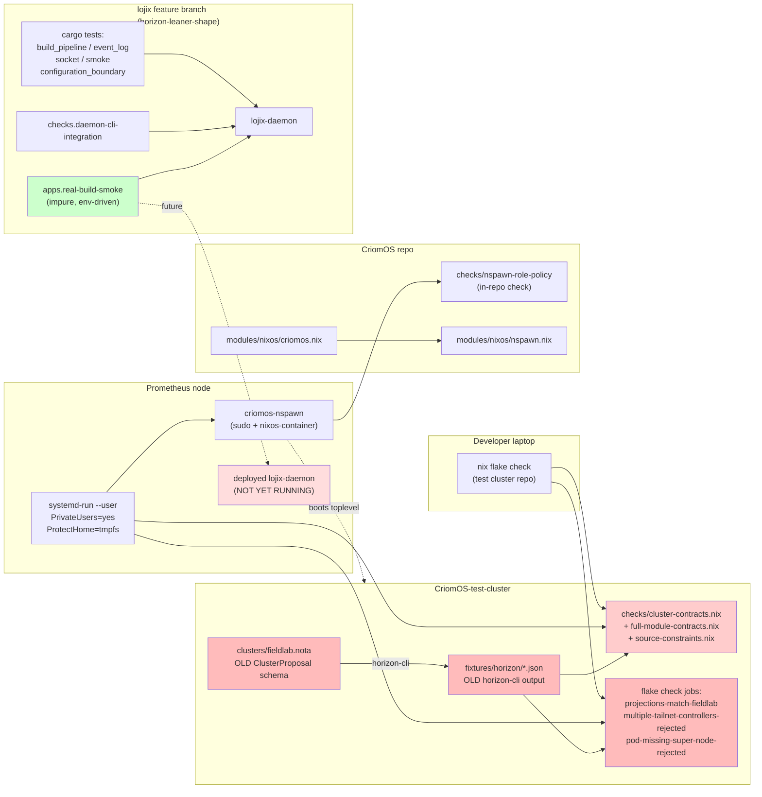

## 2 — sandbox testing infrastructure: what exists, what the lean stack needs

*Kind: Audit slice · Wave B of meta-report 34 · 2026-05-23*

## TL;DR

Three sandbox surfaces exist today, all pinned to the OLD stack:
(1) `CriomOS-test-cluster` `nix flake check` — 8 pure checks built
on `inputs.horizon = github:LiGoldragon/horizon-rs` (no branch ref =
follows `main`), exercising `horizon-cli`-projected JSON fixtures
against CriomOS NixOS modules. (2) `scripts/run-on-prometheus` (+
`build-dune-on-prometheus`) — same flake checks under a Prometheus
`systemd-run --user` sandbox with `PrivateUsers=yes` /
`ProtectHome=tmpfs`. (3) `scripts/nspawn-dune-on-prometheus` —
boots the `dune` Pod node toplevel through the deployed
`criomos-nspawn` wrapper on Prometheus, asserts hostname +
`systemctl is-system-running`. **None of this exercises `lojix-daemon`
or the lean horizon library** — the entire test cluster speaks the
old projection-via-CLI shape, and the fieldlab fixtures embed
super-node/super-user positionally inside `Machine` (old schema),
not as separate `NodePlacement::Pod {…}` (lean schema). For the
lean stack to pass sandbox testing **the test cluster needs a
parallel lean track** (sibling repo or branch) carrying lean-schema
fixtures plus a sandbox runner that exercises `lojix-daemon`'s
deploy actor pipeline against the existing nspawn surface. The
nspawn-dune runner is reusable as-is (it just builds a NixOS
toplevel and boots it); the projection + cluster-contracts checks
need full re-targeting. Lojix already ships `apps.<system>.real-build-smoke`
that drives the daemon over its socket with caller-supplied
cluster/proposal/builder — that's the right scaffold to embed in
the test cluster, but it currently has no fixture cluster to point
at and no Prometheus runner wrapper.

## Sandbox infrastructure map

Red = lean-incompatible schema; pink = lean-incompatible only by
fixture; green = lean-stack-native; the deployed daemon box is the
not-yet-existing endpoint.

## Current coverage table

| Check / runner | File path | What it covers | Lean-compatible? |
|---|---|---|---|
| `projections-match-fieldlab` | `/git/github.com/LiGoldragon/CriomOS-test-cluster/flake.nix:39-50` | Calls `horizon-cli` (from `inputs.horizon` pin to horizon-rs main, the OLD CLI) over `clusters/fieldlab.nota` for each of 4 nodes; cmp output against `fixtures/horizon/<node>.json`. Pin is *bound to OLD CLI + OLD ClusterProposal schema*. | No. Lean horizon-lib has new `HorizonProposal` + restructured `NodeProposal` + `NodePlacement` enum + `Vec<NodeService>` — CLI on `main` cannot decode lean `fieldlab.nota`, and lean lib cannot decode current `fieldlab.nota`. |
| `multiple-tailnet-controllers-rejected` | `flake.nix:52-66` | Negative projection test: 2 controllers → CLI exits non-zero with `multiple tailnet controller servers`. | No, same reason; the failure message also changes in lean lib. |
| `pod-missing-super-node-rejected` | `flake.nix:68-82` | Negative projection test: pod's super-node missing → CLI exits with `references missing super-node`. | Likely no; placement validation moves to `NodePlacement::Pod` containment rule. Message text differs. |
| `cluster-contracts` | `/git/github.com/LiGoldragon/CriomOS-test-cluster/checks/cluster-contracts.nix` | Builds NixOS configs from `fromJSON(fixtures/horizon/<node>.json)` against subsets of CriomOS modules (network/router, nix/default); asserts headscale/tailscale/dnsmasq/nix-serve/distributedBuilds flags, base_domain rewrite, wifi-eap script substrings, builder/known-hosts presence. | No. Consumes the OLD JSON shape. After fixture regen the shape of the consumed JSON changes (lean projection's `horizon.node` carries different field set; e.g. `services` becomes `Vec<NodeService>` not `{tailnet,tailnetController}`). |
| `full-module-contracts` | `/git/github.com/LiGoldragon/CriomOS-test-cluster/checks/full-module-contracts.nix` | Instantiates full `nixosModules.criomos` aggregate against fixture horizon for `beacon` + `cedar` (synthetic builder / edge), asserts top-level system facts (hostname, openssh, tailscale, sshServe/distributedBuilds, no-llama-router). | No. Same fixture-shape dependency. |
| `source-constraints` | `/git/github.com/LiGoldragon/CriomOS-test-cluster/checks/source-constraints.nix` | Greps every `.nix` under `criomos/modules/nixos/` for forbidden host facts (`ouranos`, `prometheus`, …), `node.name ==` predicates, hard-coded `tailnet.${cluster.name}.criome`. | Yes. Stack-agnostic source linting; carries over verbatim. |
| `nspawn-role-policy` (CriomOS-internal) | `/git/github.com/LiGoldragon/CriomOS/checks/nspawn-role-policy/default.nix` | Asserts `criomos-nspawn` package presence on large-center nodes, sudo `%nixdev NOPASSWD` rule, `boot.enableContainers` gating, sudo-fallback wrapper in shell script. | Yes. Tests CriomOS module shape; independent of horizon schema (uses synthetic minimal `horizon.node`). |
| `run-on-prometheus` (sandbox runner) | `/git/github.com/LiGoldragon/CriomOS-test-cluster/scripts/run-on-prometheus` | Pushes `main`, ssh's Prometheus, evaluates the *public GitHub flake* in `systemd-run --user` with `PrivateUsers=yes` `ProtectHome=tmpfs` fresh sandbox dir; runs `nix flake check`. Captures journal on failure. | Mechanism reusable; what it runs is currently old-stack. After lean fixture regen, the same runner sandboxes the lean checks. |
| `build-dune-on-prometheus` | `scripts/build-dune-on-prometheus` | Same sandbox shell; runs `nix build .#dune-toplevel`. Proves the synthetic Pod node's NixOS toplevel actually builds on a target node. | Mechanism reusable; `dune-toplevel` derivation needs lean-schema fixture before build can re-anchor. |
| `nspawn-dune-on-prometheus` | `scripts/nspawn-dune-on-prometheus` | Builds `.#dune-nspawn-toplevel`, invokes deployed `criomos-nspawn create/start/shell`, waits for `hostname == dune`, runs `systemctl is-system-running --wait`, tears the machine down. End-to-end NixOS boot smoke. | Mechanism fully reusable. Only the toplevel-building step is fixture-shape-dependent. |
| lojix `cargo test`s (`smoke / socket / build_pipeline / event_log / configuration_boundary`) + `daemon-cli-integration` flake check | `/git/github.com/LiGoldragon/lojix/tests/*.rs`, `/git/github.com/LiGoldragon/lojix/tests/daemon-cli-integration.sh`, `flake.nix:65-125` | In-process actor + socket + persistence + boundary witnesses on lojix's own flake checks. `build_pipeline.rs` uses fake `nix`/`ssh`/`rsync` toolchain and an in-process `CriomeAuthorizationPolicy::grant_for_tests()`. | Yes — lean-native. Not yet wired into CriomOS-test-cluster's `nix flake check`; lives only in the lojix repo. |
| lojix `apps.<system>.real-build-smoke` | `/git/github.com/LiGoldragon/lojix/tests/real-build-smoke.sh`, `flake.nix:43-63` | Impure operator-runnable runner: starts real `lojix-daemon`, submits `(DeploymentSubmission … (FullOsDeployment Build) (NamedBuilder …) [])`, polls until `DeploymentBuilt`, verifies `GenerationQuery` returns built state + GC root symlink agrees. Requires caller-supplied `LOJIX_SMOKE_*` env. **Fails-closed today** because daemon's Criome authorization is stubbed; needs `signal-criome` daemon-client. | Yes — lean-native. Not yet wrapped in a Prometheus runner; not yet pointed at a fixture cluster. |

## Lean-stack coverage-gap table

| Gap | What's missing | Where it would land | Blocks MVP? |
|---|---|---|---|
| Lean fieldlab proposal | `clusters/fieldlab.nota` rewritten against `horizon-leaner-shape` `ClusterProposal` schema (typed `NodePlacement::Pod { super_node, super_user }` instead of positional `Machine Pod … super-node super-user`; `Vec<NodeService>` instead of `(NodeServices tailnet controller)`; separate `HorizonProposal` for pan-horizon facts). | New repo or new branch of `CriomOS-test-cluster` (`horizon-leaner-shape`). | Yes — every fixture + check downstream depends on a proposal source. |
| Regenerated horizon fixtures | `fixtures/horizon/*.json` regenerated from the lean projection. Schema diff from old: `node.services` is array, `node.machine` no longer carries super-node/super-user, `cluster` carries new domain fields, `horizon` top-level carries `HorizonProposal`-derived data. | Same place as the lean fieldlab proposal. | Yes — `cluster-contracts.nix` + `full-module-contracts.nix` `fromJSON` the fixtures. |
| Pan-horizon `horizon.nota` fixture | Lean stack requires a `HorizonProposal` source separate from `ClusterProposal` (operator identity, domain suffixes, transitional LAN). lojix daemon takes `horizon_configuration_source` as a NOTA file path. Test cluster has nothing equivalent. | New `clusters/horizon.nota` (or `fieldlab-horizon.nota`) in lean test-cluster. | Yes — lojix daemon cannot start without it. |
| Lean projection witness | Replace `projections-match-fieldlab` with a check that calls the lean `horizon-cli` (or a small Rust binary linking `horizon-lib`) using the new CLI flags (`--horizon`, `--proposal`, `--cluster`, `--node`) against the lean fieldlab + pan-horizon, cmp-ing lean-shape fixtures. | New `checks/lean-projections-match-fieldlab.nix` in lean test-cluster. | Yes — without this the projection layer has no fixture witness. |
| Updated cluster-contracts / full-module-contracts | Re-derive the substring/field assertions against the lean horizon JSON shape (different field names: `services` array → check via `lib.any`; pan-horizon-driven domain suffix; service variants per `criomos: consume service variant vector` 2026-05-19). | `checks/cluster-contracts.nix`, `checks/full-module-contracts.nix` in lean test-cluster. | Yes — substantive coverage of CriomOS module rendering. |
| lojix-deploy-path smoke check (pure) | A pure flake check that drives lojix-daemon end-to-end through its socket using fake tool scripts (mirroring `tests/build_pipeline.rs`'s `FakeTool` approach) against the lean fieldlab fixtures. Closes loop: ClusterProposal → daemon → projected horizon → fake nix build → DeploymentBuilt + GC root. | New `checks/lojix-build-only-pipeline.nix` (depends on lojix flake input). | Yes — gates "lean stack passes sandbox testing" per Spirit 357. |
| lojix Prometheus runner | Wrapper script around `apps.real-build-smoke` that ssh's Prometheus, sets `LOJIX_SMOKE_*` from a lean fieldlab fixture under `systemd-run --user PrivateUsers=yes`, captures journal. Mirrors `run-on-prometheus`'s pattern. | New `scripts/lojix-build-on-prometheus` + `packages/apps.lojix-build-on-prometheus` in lean test-cluster. | Strongly recommended; arguably gating per Spirit 358's "passing sandbox testing" interpretation. |
| Lean-nspawn-dune build target | `packages.dune-nspawn-toplevel` re-derived from lean fixture (the synthetic-pod NixOS toplevel built using lean horizon JSON). `nspawn-dune-on-prometheus` runner reusable verbatim once this exists. | `flake.nix` in lean test-cluster. | Yes — the only end-to-end "boots and reports running" smoke. |
| Lojix-driven nspawn smoke (stretch) | A runner that issues a lojix `DeploymentSubmission (FullOsDeployment Switch)` against an nspawn-deployable node and witnesses Switch reaching `Activated` phase. Requires the build→activate lojix pipeline beyond the current build-only slice. | Future: combines lean test-cluster + lojix Switch action support. | No — Spirit 357 "passing sandbox testing" likely satisfies on build-only path; needs psyche clarification. |
| Criome authorization for the smoke runner | `real-build-smoke` fails-closed because `CriomeAuthorizationPolicy` is stubbed (`Unavailable`). The in-process pipeline test uses a fake grant; the real runner needs either a working `signal-criome` daemon-client slice or a documented test-mode bypass for sandboxes. | `lojix/src/authorization.rs` + integration with `signal-criome`. | Yes — without this `apps.real-build-smoke` cannot succeed against real cluster outside test process. |

## Test beads (bead-shape)

### B-B-1 Decide lean-stack test-cluster topology (fork vs branch vs sibling repo)

**Files:** `/git/github.com/LiGoldragon/CriomOS-test-cluster/flake.nix:18`
(current `inputs.horizon` pin — no branch ref); existing branches
in test-cluster repo are `main` + `horizon-re-engineering` (last
commit `mrrkwvmt 2e4e96eb fieldlab: follow final horizon cli package
fix` 2026-05-16, refers to OLD CLI). Reference: `CriomOS` has
`horizon-leaner-shape` branch at `ltoysuxk 325de8a7 criomos: consume
service variant vector` 2026-05-19; `horizon-rs` has the corresponding
`horizon-leaner-shape` branch with the lean ClusterProposal types;
`lojix` is on `horizon-leaner-shape`.

**What to do:** Surface to psyche the choice between (a) new
`horizon-leaner-shape` branch of `CriomOS-test-cluster` mirroring
the cascade, (b) sibling new repo `CriomOS-lean-test-cluster`
preserving the OLD repo intact during the cutover transition, or
(c) hard-replace `main` after a single lean conversion. The
designer recommendation is (a), consistent with the
`horizon-leaner-shape` branch naming already used across
CriomOS/horizon-rs/lojix/signal-lojix; sibling repo (b) only if the
psyche wants OLD-stack regression coverage to survive cutover.

**Deps:** none (precedes every other B-bead). Surfaces an
open-question for the orchestrator's 5-overview.

### B-B-2 Author lean fieldlab `ClusterProposal` + pan-horizon `HorizonProposal`

**Files:** new `clusters/fieldlab.nota` + new `clusters/horizon.nota`
on the chosen lean test-cluster track (B-B-1). Reference for the
lean shape: `horizon-rs` `horizon-leaner-shape`
`lib/src/proposal/cluster.rs`, `lib/src/proposal/node.rs`,
`lib/src/proposal/placement.rs`, `lib/src/proposal/services.rs`,
`lib/src/horizon_proposal.rs`. Reference for pan-horizon content
shape: `lojix/tests/build_pipeline.rs:439-454` (`write_horizon_configuration`).

**What to do:** Translate the 4-node fieldlab cluster (atlas
LargeAiRouter / beacon MediaBroadcast / cedar Edge / dune Pod) into
the lean schema: `Machine` loses super_node/super_user;
`NodeProposal.placement = NodePlacement::Pod { super_node, super_user }`
for dune; `services` becomes `Vec<NodeService>` with explicit
variants. Author a minimal `HorizonProposal` carrying the fieldlab
operator identity + transitional IPv4 LAN.

**Deps:** B-B-1.

### B-B-3 Regenerate `fixtures/horizon/*.json` from lean projection

**Files:** `/git/github.com/LiGoldragon/CriomOS-test-cluster/fixtures/horizon/{atlas,beacon,cedar,dune}.json`
on the lean track. Reference for the lean CLI signature: `horizon-rs`
`horizon-leaner-shape` `cli/src/main.rs` (new `--horizon`,
`--proposal`, `--cluster`, `--node` flags vs old `--cluster`,
`--node` over stdin).

**What to do:** Run `horizon-cli --horizon horizon.nota --proposal
fieldlab.nota --cluster fieldlab --node <each>` and commit the
fresh JSON. These become the new fixtures.

**Deps:** B-B-2.

### B-B-4 Rewrite lean `projections-match-fieldlab` + negative checks

**Files:** `flake.nix:39-82` (the three projection checks) on the
lean track. Reference: `horizon-rs` `horizon-leaner-shape`
`lib/tests/cluster.rs` for what error messages the lean projection
emits (containment validation rules, pod placement).

**What to do:** Re-write the three pure checks to invoke the lean
`horizon-cli` with the new flag layout against the lean fixtures;
update the negative-test error-message `grep -F` strings to match
the lean error texts.

**Deps:** B-B-3.

### B-B-5 Re-derive `cluster-contracts.nix` + `full-module-contracts.nix` for lean JSON

**Files:** `/git/github.com/LiGoldragon/CriomOS-test-cluster/checks/cluster-contracts.nix`,
`/git/github.com/LiGoldragon/CriomOS-test-cluster/checks/full-module-contracts.nix`.

**What to do:** Update the `lib.escapeShellArg`/`grep -F`
assertions to read the lean horizon JSON shape (`node.services` as
array → check via `lib.any (s: s.tag == "NixBuilder")`; pan-horizon
domain-suffix in `cluster.publicDomain` field; ssh known-hosts +
build-machines fields per the lean projection naming). The
`withDomainSuffix` rewrite-helper may simplify once pan-horizon owns
the suffix instead of every node carrying `criomeDomainName`.

**Deps:** B-B-3; informed by `CriomOS` `horizon-leaner-shape`
`modules/nixos/` (which already consumes the lean shape per commits
`vrsrqvts 5027d9ac criomos: consume lean horizon projections`
2026-05-17 and `ltoysuxk 325de8a7 criomos: consume service variant
vector` 2026-05-19).

### B-B-6 Add `checks.lojix-build-only-pipeline` to lean test-cluster flake

**Files:** new `/git/github.com/LiGoldragon/CriomOS-test-cluster/checks/lojix-build-only-pipeline.nix`;
`flake.nix` adds `lojix.url = "github:LiGoldragon/lojix?ref=horizon-leaner-shape"`.
Reference: `lojix/tests/build_pipeline.rs:236-329` for the `FakeTool`
+ `BuildPipelineFixture` shape (run as a Cargo test inside the
check OR shell-driven mirror of `daemon-cli-integration.sh`
extended with a fake `nix build`).

**What to do:** Inside a `pkgs.runCommand`, start `lojix-daemon`
with a daemon-config NOTA pointing at fake `nix`/`ssh`/`rsync` in
PATH, issue a `DeploymentSubmission` over the socket using the
lojix CLI, poll for `DeploymentBuilt`, assert the GC-root symlink
+ `GenerationQuery` reply. Fixture proposal = lean `fieldlab.nota`
(B-B-2); fixture horizon = lean `horizon.nota`. Whichever
authorization path is chosen for sandbox (test-mode bypass vs
in-process grant), document it.

**Deps:** B-B-2, B-B-3, B-B-10 (authorization path decided).

### B-B-7 Add `dune-toplevel` + `dune-nspawn-toplevel` rederivation for lean fixtures

**Files:** `/git/github.com/LiGoldragon/CriomOS-test-cluster/flake.nix:122-137`
(the two `fixtureSystem` derivations). The shape stays — `lib.nixosSystem`
with `specialArgs.horizon = fixtureHorizon node`, modules =
`[ inputs.criomos.nixosModules.criomos ]`. Only the fixture JSON
shape changes underneath.

**What to do:** After B-B-3, verify both `dune-toplevel` and
`dune-nspawn-toplevel` still build through the lean CriomOS
aggregate module (`inputs.criomos` repointed at `horizon-leaner-shape`).
Likely free if B-B-3 and CriomOS `horizon-leaner-shape` are
compatible.

**Deps:** B-B-3; CriomOS `horizon-leaner-shape` branch (Wave A
covers the CriomOS-side state).

### B-B-8 Wrap lojix `apps.real-build-smoke` in Prometheus runner

**Files:** new `/git/github.com/LiGoldragon/CriomOS-test-cluster/scripts/lojix-build-on-prometheus`
and `packages/apps.lojix-build-on-prometheus` entry in `flake.nix`.
Reference: `scripts/build-dune-on-prometheus` for the
`systemd-run --user PrivateUsers=yes ProtectHome=tmpfs` envelope to
mirror; `lojix/tests/real-build-smoke.sh` for the env-var contract
(`LOJIX_SMOKE_CLUSTER`, `LOJIX_SMOKE_NODE`, `LOJIX_SMOKE_BUILDER`,
`LOJIX_SMOKE_PROPOSAL_SOURCE`,
`LOJIX_SMOKE_HORIZON_CONFIGURATION_SOURCE`,
`LOJIX_SMOKE_FLAKE_REFERENCE`).

**What to do:** Push current `main`, ssh Prometheus, set env from
lean fieldlab fixture paths (committed in repo), run
`nix run github:LiGoldragon/lojix?ref=horizon-leaner-shape#real-build-smoke`
inside the same kind of `systemd-run --user` sandbox the existing
runners use. Capture journal on failure.

**Deps:** B-B-2, B-B-10 (authorization path), B-B-1 (lean track exists
on test-cluster repo).

### B-B-9 Re-anchor `nspawn-dune-on-prometheus` to lean dune fixture

**Files:** `/git/github.com/LiGoldragon/CriomOS-test-cluster/scripts/nspawn-dune-on-prometheus`
(no script change needed; the `nix build "$repo#dune-nspawn-toplevel"`
line resolves whatever branch you point at). Run-validate on the
lean track.

**What to do:** Once B-B-7 lands, run this script end-to-end against
the lean toplevel and confirm the `criomos-nspawn` interface still
boots the lean dune container successfully (hostname check +
`systemctl is-system-running --wait`). The runner itself is purely
mechanism; the only risk is the lean `dune-nspawn-toplevel` failing
to evaluate or boot.

**Deps:** B-B-7.

### B-B-10 Decide Criome-authorization path for sandbox runs

**Files:** `/git/github.com/LiGoldragon/lojix/src/authorization.rs`;
`/git/github.com/LiGoldragon/lojix/tests/build_pipeline.rs:271-287`
(`CriomeAuthorizationPolicy::grant_for_tests()` shape);
`/git/github.com/LiGoldragon/lojix/README.md:36-45` ("fails closed
until the real signal-criome daemon-client slice lands").

**What to do:** Surface to psyche the choice between (a) sandbox
runner gets `CriomeAuthorizationPolicy::grant_for_tests()` exposed
via a daemon-config flag (e.g. `LojixDaemonConfiguration` enum
variant `Test { … }`) — fastest path to green sandbox; (b) wait
for `signal-criome` daemon-client slice and have real Criome
authorize the sandbox; (c) ship a stand-alone sandbox criome
fixture daemon. The designer recommendation is (a) for MVP sandbox
testing; (b) is the right long-term answer once the criome client
is implemented.

**Deps:** prerequisite for B-B-6 and B-B-8 to succeed end-to-end.

### B-B-11 (Stretch) End-to-end Switch-action lojix smoke against lean nspawn dune

**Files:** future runner combining lojix Switch path with
`criomos-nspawn` deployment. Currently blocked: lojix
`horizon-leaner-shape` only supports `(FullOsDeployment Build)`
per `tests/build_pipeline.rs:140-158` (`assert_rejected_with("build-only
deployments")` for `SystemAction::Switch`); the activate/switch
pipeline is "a future slice" per ARCHITECTURE.md C20.

**What to do:** Defer until lojix lands the activate pipeline. Worth
holding in the queue as the *target* coverage shape: ClusterProposal
→ lojix-daemon → projected horizon → nix build → criomos-nspawn
deploy + activate → `systemctl is-system-running` check inside the
container, all on Prometheus under the sandbox envelope.

**Deps:** lojix activate pipeline (out of scope of this audit).

## Open question for psyche (Wave B)

**Q-B-1.** *What constitutes "passing sandbox testing" for Spirit
357 / MVP?* Two readings exist:

- **Narrow (minimum).** `nix flake check` on the lean test cluster
  passes (lean projections match fixtures; cluster/module contracts
  hold for lean horizon shape) AND `nspawn-dune-on-prometheus`
  boots the lean dune container — same coverage the OLD stack had,
  just re-anchored. Closes if B-B-1 through B-B-5, B-B-7, B-B-9 land.

- **Broad (recommended).** All of the above PLUS at least one
  end-to-end witness that `lojix-daemon` drives the deploy pipeline
  (either pure `lojix-build-only-pipeline` flake check via B-B-6,
  or `lojix-build-on-prometheus` runner via B-B-8). This is the
  reading consistent with Spirit 356's "lean stack becomes the main
  deployment after MVP" — the deployment-actor pipeline that *is*
  the lean stack's defining novelty should have at least one sandbox
  witness before cutover.

Designer recommendation: **broad** reading, gating MVP on at least
B-B-6 OR B-B-8 in addition to the narrow set. The narrow reading
re-anchors what the OLD test cluster already covered and leaves the
lean daemon entirely un-witnessed at the sandbox level — Spirit 356
intends sandbox-pass to *also* ratify the deploy actor pipeline.

## See also

- `/home/li/primary/reports/system-designer/34-mvp-and-sandbox-audit/0-frame-and-method.md` — meta-report frame.
- `/home/li/primary/reports/system-designer/30-horizon-lojix-low-level-migration/2-lojix-signal-lojix-state.md` — prior lojix snapshot (one week old; superseded by lojix feature-branch state Wave A audits).
- `/git/github.com/LiGoldragon/lojix/ARCHITECTURE.md` §C21-C23 — lojix's own test discipline + smoke-runner intent.
- `/git/github.com/LiGoldragon/CriomOS-test-cluster/README.md` — current sandbox surface as the psyche sees it.
- `/git/github.com/LiGoldragon/CriomOS/checks/nspawn-role-policy/default.nix` — CriomOS-side nspawn package + sudo contract.
