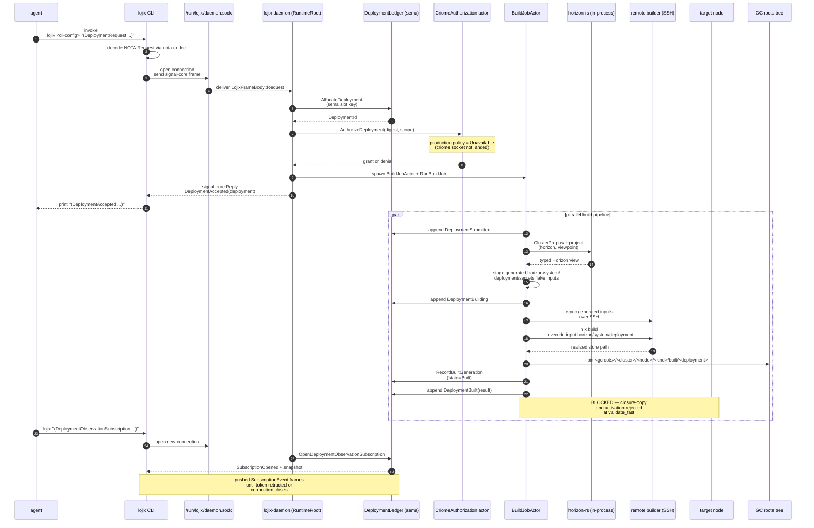

# 34/3 — end-to-end deploy-path audit (Wave C)

*Kind: Audit slice · Topic: lean-stack deploy path · 2026-05-23*

## TL;DR

The lean-stack deploy path is **build-only end-to-end on the feature
branch**: agent → CLI → daemon → projection → SSH-to-remote-builder
→ realized store path → GC-root pinning → sema-backed `Built`
generation → pushed observation stream. Closure-copy-to-target and
activation are **wired in the contract** (signal-lojix carries
`ClosureCopying` / `ActivationRunning` / `ActivationSucceeded` phases)
but **rejected at the daemon** (`BuildOnlyPlan::from_wire` rejects
any `SystemAction::Switch` / `Boot` / `Test`). The path is also
**currently broken at the lock boundary**: lojix's
`horizon-leaner-shape` tip (commit `be12741e`, 2026-05-19) still
imports `wire::Request`, `wire::Reply`, `wire::DeploymentSubmission`,
`wire::LojixFrame`, `wire::LojixChannelReply`, but the pinned
signal-lojix tip (commit `a007e8b6`, 2026-05-23) renamed
`DeploymentSubmission` → `DeploymentRequest` and replaced the
signal-core `Request`/`Reply` envelope with a signal-frame
`LojixOperation`/`LojixReply`. The crate as-pinned **does not
compile**. Minimal demo today: an in-process fake-Nix
`build_only_deployment_pins_output_before_reporting_built` actor
test — assuming the lock unbreaks. Minimal demo at MVP: the
real-build-smoke runner against a single named remote builder
emitting `DeploymentBuilt` plus a sandbox check exercising
closure-copy and activation against an nspawn target.

## End-to-end deploy path (sequence)

## Per-step state table

For each step: `designed` = wire/contract exists; `coded` = daemon
code path exists on horizon-leaner-shape tip; `tested` = green
witness in `tests/`; `blocked` = compile / runtime / scope blocker.

| Step | What happens | State | Blocker if any |
|---|---|---|---|
| 1 | Agent invokes `lojix <cli-config> "(DeploymentRequest ...)"` | designed + coded + tested | NOTA grammar in `tests/real-build-smoke.sh:83` and `tests/build_pipeline.rs:23` still uses `DeploymentSubmission`; signal-lojix renamed to `DeploymentRequest`. Lockstep rename needed to compile. |
| 2 | CLI decodes the typed Nota record via `nota-codec` | designed + coded + tested | `tests/configuration_boundary.rs` proves NOTA → typed Request decode. |
| 3 | CLI opens `/run/lojix/daemon.sock`, sends signal-core frame | designed + coded + tested | `tests/daemon-cli-integration.sh` proves socket bind, mode, argv/stdin request modes. **But** the signal-core `LojixFrame::new(LojixFrameBody::Request { exchange, request })` envelope used at `src/client.rs:24-46` and `src/socket.rs` no longer exists on the pinned signal-lojix tip — replaced by signal-frame `StreamingFrame<LojixOperation, LojixReply, LojixEvent>`. |
| 4 | Daemon dispatches via `RuntimeRoot::handle(RuntimeRequest)` | designed + coded + tested for build-only | `runtime.rs:213-307` matches directly on `wire::Request::DeploymentSubmission` etc. — old variant names per /30/2; LojixOperation switch needed. |
| 5 | Allocate `DeploymentId` via sema-engine slot | designed + coded + tested | `tests/event_log.rs` proves sema-allocated IDs survive reopen. Identity-smell residual: `deploy.rs:81` still formats `deployment_{n}` then re-validates — flagged in /30/2; not blocking. |
| 6 | `CriomeAuthorization::AuthorizeDeployment` over canonical digest | designed + coded + tested | `tests/build_pipeline.rs:128-138` proves denial leaves tool log empty. Production policy is `unavailable_until_criome_socket_lands` (`runtime.rs:43-44`); criome deferred per psyche 2026-05-20T17:10. **Effect:** every production-config deploy is denied today; demos require `grant_for_tests()` override. |
| 7 | Spawn `BuildJobActor`; daemon replies `DeploymentAccepted` immediately | designed + coded + tested | One actor per deployment; no per-target serialisation (see residual). |
| 8 | Build appends `DeploymentSubmitted` to sema event log | designed + coded + tested | `deploy.rs:923-927`. |
| 9 | `ClusterProposal::project(&HorizonProposal, &viewpoint)` over loaded horizon-rs proposals | designed + coded + tested in fixture | `deploy.rs:1077-1083` loads from `horizon_configuration_source` + `submission.source`. The 3-arg `project` exists only on `horizon-rs/horizon-leaner-shape` (lockfile correctly pins). |
| 10 | Stage generated horizon/system/deployment/secrets flake inputs to `<state_dir>/generated-inputs/<deployment>/` | designed + coded + tested | `deploy.rs:1086-1098` + `tests/build_pipeline.rs:99-103`. |
| 11 | Append `DeploymentBuilding(deployment, builder)` | designed + coded + tested | `deploy.rs:938-944`. |
| 12 | rsync generated inputs over SSH to remote builder | designed + coded + tested | `deploy.rs:1099-1105` (`RemoteInputStage`). `BuildLocally` rejected at `validate_fast`. |
| 13 | `nix build --override-input horizon=... --override-input system=... --override-input deployment=...` on the remote builder | designed + coded + tested in fixture | `deploy.rs:1106-1118` (`NixBuild::run`). Tool log assertions cover override-input shape. `tests/real-build-smoke.sh` exercises against a caller-provided builder. |
| 14 | Pin realized store path as GC root at `<gcroots>/<cluster>/<node>/<kind>/built/<deployment>` | designed + coded + tested | `deploy.rs:861-875` + `tests/real-build-smoke.sh:121-128`. |
| 15 | `RecordBuiltGeneration` writes sema generation record with `state=Built` | designed + coded + tested | `deploy.rs:877-892`. `GenerationQuery` returns the live set. |
| 16 | Append `DeploymentBuilt(deployment, result)` | designed + coded + tested | `deploy.rs:959-969`. |
| 17 | Closure-copy to target node (`ClosureCopying` phase) | designed only | **BLOCKED** at `BuildOnlyPlan::from_wire` (`deploy.rs:1152-1177`) — only `SystemAction::Build`/`HomeMode::Build` accepted; `Switch`/`Boot`/`Test` rejected. No `ClosureCopyActor`, no `nix-copy-closure` invocation. Phase variant exists in `signal-lojix::DeploymentPhase` but never emitted. |
| 18 | `nixos-rebuild switch` / `home-manager switch` on target (`ActivationRunning` → `ActivationSucceeded`) | designed only | **BLOCKED** same as step 17. No activation actor; no SSH-to-target; no rollback GC-root flip on activation failure (per C18). |
| 19 | Promote built generation to `current` GC slot | designed only | **BLOCKED**. ARCHITECTURE §1 names `current` / `boot-pending` / `rollback/<n>` / `pinned/<label>` / `recent/<timestamp>` slots; `GarbageCollectionRoots` (`deploy.rs:610-705`) implements only the `built/<deployment>` slot. |
| 20 | Push `SubscriptionEvent` frames over open observation subscription | designed + coded + tested | `tests/socket.rs` proves the Submitted/Building/Built sequence and retraction/disconnect cleanup. |

## Minimal demo scenario today

**What can be demonstrated right now, end-to-end:**

If — and only if — the broken lock is resolved (rename
`DeploymentSubmission` → `DeploymentRequest` across lojix's source +
tests, swap signal-core frame envelope for signal-frame, update
`wire::Request`/`wire::Reply` to `LojixOperation`/`LojixReply`),
two scenarios become demonstrable on the feature branch:

1. **In-process fixture deploy (no real Nix).**
   `tests/build_pipeline.rs::build_only_deployment_pins_output_before_reporting_built`
   drives a `RuntimeRoot` with a synthetic `ClusterProposal`,
   `BuilderSelection::DispatcherChoosesBuilder`, a fake Nix/SSH
   toolchain (records command-lines into a log file), and a
   `grant_for_tests()` Criome policy. Verifies `DeploymentAccepted` →
   `Submitted` → `Building` → `Built` observation sequence; verifies
   the GC-root symlink and sema-backed generation record exist.
   Demo surface: `nix flake check`-style — already wired as
   `checks.<system>.test-build-pipeline`.

2. **Real-build smoke against a single remote builder.**
   `tests/real-build-smoke.sh` launches a real `lojix-daemon` over a
   temp socket, sends a real `DeploymentSubmission` via the real
   `lojix` CLI, waits for `DeploymentBuilt` to appear in the
   subscription snapshot, verifies the GC-root symlink. Builder is
   any reachable SSH host the caller names via
   `LOJIX_SMOKE_BUILDER`. Already exposed as
   `apps.<system>.real-build-smoke` per ARCHITECTURE C22.
   Caller-provided env vars (`LOJIX_SMOKE_CLUSTER`,
   `LOJIX_SMOKE_NODE`, `LOJIX_SMOKE_PROPOSAL_SOURCE`,
   `LOJIX_SMOKE_HORIZON_CONFIGURATION_SOURCE`,
   `LOJIX_SMOKE_FLAKE_REFERENCE`) keep the runner cluster-agnostic.

What CANNOT be demonstrated today, even with the lock fixed:
closure-copy beyond builder; activation; `current` GC slot
promotion; activation-failure rollback; per-derivation events;
concurrent-deploy serialisation; cache-retention mutations
(`runtime.rs:243-253` returns `StoreUnavailable`).

**Scope question for psyche.** Is "build the CriomOS closure on a
named builder, pin it, observe the Built sequence, verify GC root +
generation listing" (no copy, no activation) sufficient for MVP
gate-met? Or does MVP require the closure-copy + activation slice
at least for the single-node case (target = builder)? See "Open
questions".

## Minimal demo scenario at MVP

What unblocks a full MVP demo, in dependency order:

1. **Lock alignment.** Rename
   `wire::Request`→`LojixOperation`, `wire::Reply`→`LojixReply`,
   `wire::DeploymentSubmission`→`wire::DeploymentRequest`, swap
   signal-core `LojixFrame`/`LojixFrameBody`/`SubReply` envelope for
   signal-frame's `StreamingFrame<LojixOperation, LojixReply,
   LojixEvent>`. Without this, NO end-to-end demo runs against the
   pinned dep tree. This is bead B-C-1.

2. **`SystemAction::Switch` acceptance + closure-copy actor.**
   Extend `BuildOnlyPlan` to a `DeploymentPlan` that accepts
   `Switch` action; introduce `ClosureCopyActor` (per `deploy.rs`
   split shape in /30/2) that issues `nix-copy-closure
   --to ssh://<target> <store-path>`; emit `ClosureCopying`
   observation. Bead B-C-2.

3. **`ActivationActor` + `nixos-rebuild switch` via SSH.** Emit
   `ActivationRunning` then `ActivationSucceeded` (or transition to
   `DeploymentFailed`). On `ActivationSucceeded`, promote
   `built/<deployment>` symlink to `current` in the GC tree per
   ARCHITECTURE §1. Bead B-C-3.

4. **Activation-failure rollback (C18).** On activation failure,
   keep the previous `current` symlink intact; emit
   `DeploymentFailed`. Witness: a test that injects an activation
   failure and asserts `current` did not flip. Bead B-C-4.

5. **Sandbox witness covering the full path.** A nspawn-based
   flake check that drives an actual end-to-end deploy through a
   `lojix-daemon` to an nspawn-container target — leans on
   CriomOS-test-cluster's existing `nspawn-dune-on-prometheus`
   pattern per ARCHITECTURE §6 C22. Wave B audits this in
   `2-sandbox-testing-infrastructure.md`.

If the psyche call is **single-node MVP** (target = builder), steps
2–4 collapse: the closure is already on the builder, so "copy" is a
no-op and "activate" is an SSH-to-self `nixos-rebuild switch`. The
sandbox witness in step 5 is straightforward: deploy to the test
container, observe the phase sequence, verify the activated
generation.

If the psyche call is **multi-node MVP**, the SSH-target wiring for
copy and activation is independent of the builder identity, and the
sandbox witness needs two containers (or one container plus the
host as builder).

## Wire-shape residuals — MVP-gating vs deferrable

The /33 handover lists 7 lojix-mesh-side wire-shape residuals. Each
is ranked here as **MVP-gating** (a full end-to-end demo cannot land
without it) or **deferrable** (the demo lands; this becomes a
post-MVP follow-up). Reasoning, not resolution.

| Residual | Rank | Reasoning |
|---|---|---|
| **Idempotency key on `DeploymentRequest`** | Deferrable | The agent → CLI → daemon path is request/reply with an immediate `DeploymentAccepted` reply carrying the allocated `DeploymentId`. The caller learns the ID; retry-after-network-drop can be handled by the caller checking `GenerationQuery` for a matching `(cluster, node, kind)` before re-submitting. Idempotency matters when agents fire-and-forget across unreliable transport; MVP can require the caller to wait for the accepted reply. Wire-shape add is small and additive when needed. |
| **GC-root lifetime across daemons** | Deferrable | Single-daemon MVP. There is exactly one `lojix-daemon` per cluster-operator workstation per ARCHITECTURE §5 ("cluster-operator-owned, not per-host"). Cross-daemon GC-root coordination is a peer-daemon-mesh property, downstream of `peer_daemons` discovery (also deferrable). The local single-daemon GC tree (`built`, `current`, `pinned/<label>`) is sufficient for the MVP demo. |
| **Concurrent-deploy + network-partition failure modes** | Deferrable | The build-pipeline serialises through a per-deployment `BuildJobActor` spawned by `RuntimeRoot`. The actor's failure is bounded: `DeploymentFailed` is emitted; sema records the terminal state; the GC root for an incomplete deploy never lands (pin happens only on Realized result). Network partitions mid-`nix-copy-closure` or mid-`nixos-rebuild switch` are real concerns but are recoverable by re-submitting and verifying via `GenerationQuery`. MVP can tolerate the gap; spec-needed work can sit on the post-MVP queue. |
| **Cancellation wire shape (`CancelDeployment`)** | Deferrable | Build-only MVP lasts minutes per deploy; cancellation is desirable but not gating. An MVP user can `kill` the daemon or stop the connection; no in-flight commits get reverted because the only mutating effects (GC-root pin, RecordBuiltGeneration, append observation) happen at terminal phases. The bigger cancellation concern — activation-in-progress — is not on the MVP path because activation isn't implemented. Wire-shape add is additive when activation lands. |
| **Per-deploy observability granularity (per-phase vs per-derivation)** | Deferrable | Per-phase events already exist and are the demonstrable observation surface. Per-derivation events are a scaling concern (tens of thousands of events per build saturates the stream) — but for an MVP demo, per-phase is sufficient and clearer for a human observer. Filter-via-subscription opt-in can ship later. |
| **Concurrent deploys to same target** | MVP-gating (Low certainty) | Two simultaneous deploys to the same `(cluster, node)` from a single daemon are unguarded today. For a single-operator MVP demo this rarely manifests, but if the demo includes a sandbox test that re-submits before the first deploy terminates, the second deploy's GC-root pin path overwrites the first (filesystem `symlink_force` semantics). Recommend a per-`(cluster, node, kind)` activation lock in `DeploymentActor` before the activation slice lands. **Why Low certainty:** the residual is in the activation slice's blast radius; if MVP stays build-only it's deferrable. |
| **Peer-daemon discovery** | Deferrable | The `LojixDaemonConfiguration` already carries a `peer_daemons` field (typed as `Vec<PeerDaemonBinding>`), but the field is unused by the runtime (`runtime.rs:36, 97-99` stores and exposes the value; no consumer reads it). MVP is single-daemon. v1 static configuration via the daemon's own NOTA config — already designed in the type — is enough; v2 dynamic via ClaviFaber lands when the cross-host mesh resumes. |

**Net effect on the MVP gate.** Six of seven residuals are
deferrable. Only "concurrent deploys to same target" is even
plausibly MVP-gating, and only conditionally (if the activation
slice lands AND the sandbox test exercises overlap). The wire-shape
backlog is not what blocks the MVP demo — the activation slice,
the lock alignment, and the sandbox witness are what block it.

## Demo-path beads (bead-shape)

### B-C-1 — Realign lojix to current signal-lojix lock

**File paths.**
- `/git/github.com/LiGoldragon/lojix/src/lib.rs` (re-exports)
- `/git/github.com/LiGoldragon/lojix/src/socket.rs` (frame envelope)
- `/git/github.com/LiGoldragon/lojix/src/client.rs` (CLI frame
  send/receive)
- `/git/github.com/LiGoldragon/lojix/src/runtime.rs` (match arms)
- `/git/github.com/LiGoldragon/lojix/src/deploy.rs` (StartDeployment
  field, BuildJobActor field)
- `/git/github.com/LiGoldragon/lojix/tests/build_pipeline.rs`,
  `tests/event_log.rs`, `tests/socket.rs`,
  `tests/configuration_boundary.rs`, `tests/real-build-smoke.sh`

**What to do.** Rename `wire::Request` → `wire::LojixOperation`,
`wire::Reply` → `wire::LojixReply`, `wire::DeploymentSubmission` →
`wire::DeploymentRequest` everywhere (types + NOTA grammar in
`real-build-smoke.sh:83`). Replace the signal-core `LojixFrame` +
`SubReply::Ok` envelope in `src/socket.rs` + `src/client.rs` with
the signal-frame `StreamingFrame<LojixOperation, LojixReply,
LojixEvent>` envelope per signal-lojix `tests/round_trip.rs`. Run
`nix flake check` until green.

**Deps.** None — this is the prerequisite for every other bead.

### B-C-2 — `SystemAction::Switch` acceptance + closure-copy actor

**File paths.**
- `/git/github.com/LiGoldragon/lojix/src/deploy.rs` (or a new
  `src/deploy/closure_copy.rs` per /30/2 split shape)
- `/git/github.com/LiGoldragon/lojix/tests/build_pipeline.rs` (new
  test: `switch_deployment_emits_closure_copy_observation`)
- `/git/github.com/LiGoldragon/signal-lojix/src/lib.rs` (no change
  — `ClosureCopying` phase already exists at lib.rs:477-482)

**What to do.** Replace `BuildOnlyPlan::from_wire`'s reject of
`SystemAction::Switch` with a typed `DeploymentPlan` that carries
the requested action through; add a `ClosureCopyActor` Kameo actor
that runs `nix-copy-closure --to ssh://<target> <store-path>` (or
`nix copy --to ssh://<target> <store-path>`) using the existing
`ProcessToolchain`; emit `ClosureCopying { deployment, store_path,
target }` observation before, and a transition observation after.
Fake `nix-copy-closure` in the build_pipeline fixture by extending
`ProcessToolchain::fake_with_log_path`.

**Deps.** B-C-1.

### B-C-3 — `ActivationActor` + `current` GC-root promotion

**File paths.**
- `/git/github.com/LiGoldragon/lojix/src/deploy.rs` (or new
  `src/deploy/activation.rs`)
- `/git/github.com/LiGoldragon/lojix/src/deploy.rs` `impl
  GarbageCollectionRoots` (new `PromoteToCurrent` message)
- `/git/github.com/LiGoldragon/lojix/tests/build_pipeline.rs` (new
  test: `switch_deployment_promotes_built_to_current`)

**What to do.** After `ClosureCopying` succeeds, append
`ActivationRunning { deployment, target, plan }`; SSH to the target
and run `nixos-rebuild switch --flake ...` (or `home-manager switch`
for `HomeOnlyDeployment`); on success, emit
`ActivationSucceeded { deployment, generation }`; flip the GC root
at `<gcroots>/<cluster>/<node>/<kind>/current` to point at the new
store path (atomically via `symlink + rename`); promote the sema
`Generation` record's `state` from `Built` to a new
`GenerationState::Current` variant (signal-lojix change). On
failure, emit `DeploymentFailed`; do not flip `current`.

**Deps.** B-C-2.

### B-C-4 — Activation-failure rollback witness (C18)

**File paths.**
- `/git/github.com/LiGoldragon/lojix/tests/build_pipeline.rs` (new
  test: `activation_failure_keeps_previous_current_intact`)
- `/git/github.com/LiGoldragon/lojix/src/process.rs` (extend
  `ProcessToolchain` so test can force activation-step failure)

**What to do.** Build a fixture that pre-populates `current` with
a known generation X; submit a deploy whose activation step fails;
verify `current` still points at X; verify `DeploymentFailed` is
the terminal observation; verify the new `Built` generation is
recorded but its sema state stays `Built`, not `Current`.

**Deps.** B-C-3.

### B-C-5 — End-to-end nspawn sandbox witness

**File paths.**
- `/git/github.com/LiGoldragon/CriomOS-test-cluster/` (add a new
  check building on `nspawn-dune-on-prometheus`)
- `/git/github.com/LiGoldragon/lojix/flake.nix` (export a check
  consumable by CriomOS-test-cluster)

**What to do.** Per Wave B's sandbox audit and ARCHITECTURE C22,
expose a flake check that launches `lojix-daemon`, drives a real
`DeploymentRequest` for a CriomOS toplevel against an nspawn
container target, and verifies the full
`Submitted → Building → Built → ClosureCopying → ActivationRunning
→ ActivationSucceeded` observation sequence. Single-container case
first; two-container (builder ≠ target) once the basic case is
green.

**Deps.** B-C-3 (probably also B-C-4 for correctness witnessing).

### B-C-6 — Per-target activation lock

**File paths.**
- `/git/github.com/LiGoldragon/lojix/src/deploy.rs` (or
  `src/deploy/activation.rs`)
- `/git/github.com/LiGoldragon/lojix/tests/build_pipeline.rs` (new
  test: `concurrent_deploys_to_same_target_reject_second`)

**What to do.** Add a `BTreeMap<(ClusterName, NodeName,
GenerationKind), DeploymentId>` to `DeploymentActor` tracking
in-flight deploys past the build phase. On a second
`StartDeployment` for the same key, reject with a typed
`DeploymentRejectionReason::ConcurrentDeployment` (new signal-lojix
variant). FIFO-with-rejection per /33's recommendation. Conditional
on the activation slice landing; if MVP stays build-only, defer.

**Deps.** B-C-3 (only relevant once activation lands).

## Open questions for psyche

1. **Is single-node MVP sufficient?** Today's working pipeline can
   build the production CriomOS toplevel for a named node on a
   named remote builder, pin the result, and emit a Built
   observation. If MVP demo scope is "build + pin + observe" for a
   single target node (and the existing production lojix-cli stack
   handles activation), the activation slice (B-C-2 + B-C-3 + B-C-4)
   slides to post-MVP and the gating work is just B-C-1 + B-C-5.
   If MVP demo requires "lean stack performs activation on the
   target", the activation slice is gating.

2. **Same-host builder OK for MVP demo, or different-host required?**
   If the builder and the target are the same host (e.g., the demo
   node both compiles its own toplevel and activates it), the
   closure-copy step (B-C-2) becomes a no-op and the activation
   step (B-C-3) simplifies to a local `nixos-rebuild switch`. This
   substantially shrinks the implementation work for a first MVP.

3. **Inert criome scaffolding — strip or keep?** /30/2 question 2
   carries forward. The `CriomeAuthorization` actor + `signal-criome`
   dependency + production policy "unavailable until criome socket
   lands" all exist today and gate every deploy with a denial.
   Demos require flipping to `grant_for_tests()` or stubbing the
   actor out. Two options: (a) for the MVP demo, ship a documented
   `bootstrap-policy` that grants by default until criome arrives
   (matches the deferred criome auth psyche call); or (b) keep the
   denial production-default and require demo configs to explicitly
   override. The wire-shape residuals don't settle this; psyche
   does.

## See also

- `0-frame-and-method.md` — session frame and slice briefs.
- `/git/github.com/LiGoldragon/lojix/ARCHITECTURE.md` —
  constraint table C1-C24 (especially C16, C17, C18, C22).
- `/git/github.com/LiGoldragon/signal-lojix/ARCHITECTURE.md` —
  contract surface (note: ARCH.md still references
  `DeploymentSubmission`; the source uses `DeploymentRequest`).
- `/home/li/primary/reports/system-designer/30-horizon-lojix-low-level-migration/2-lojix-signal-lojix-state.md`
  — baseline lojix + signal-lojix state.
- `/home/li/primary/reports/system-designer/33-handover-finishing-lean-lojix-horizon-stack.md`
  — wire-shape residuals table, ranked here.
- Wave A (`1-mvp-code-state-fresh-audit.md`) — independent
  read of feature-branch state; cross-check the lock-breakage
  finding above.
- Wave B (`2-sandbox-testing-infrastructure.md`) — sandbox flake-check infrastructure consumed by B-C-5.
