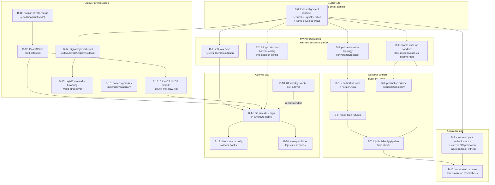
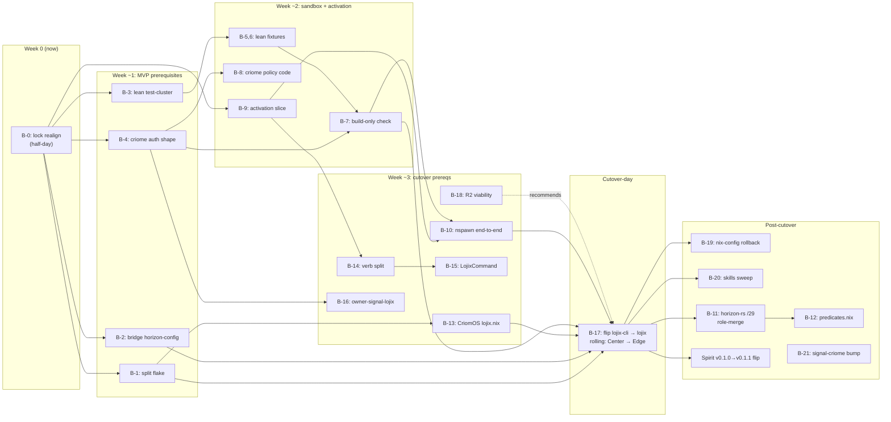

# 34/5 — overview: MVP + sandbox audit synthesis toward lean-stack cutover

*Kind: Synthesis · Topic: MVP + sandbox + cutover · 2026-05-23*

## Top finding

The four-slice audit reveals a **dramatically advanced lojix
feature branch** (vs /30's one-week-old snapshot) **blocked at the
contract-pin boundary** with a single small fix, surrounded by **four
structural prerequisites that don't yet exist anywhere in code**, and
fronted by a **sandbox infrastructure mechanically reusable but
entirely anchored to the OLD horizon schema**.

The single most-blocking item is the **signal-lojix lock break**
(Wave C top finding): lojix's `horizon-leaner-shape` tip
(`be12741e`, build-smoke service-variant alignment) imports
`wire::Request`/`wire::DeploymentSubmission`/`wire::LojixFrame`, but
the pinned signal-lojix tip (`a007e8b6`, NOTA-sum-records bracket-
strings migration) renamed these to `LojixOperation`/
`DeploymentRequest` and replaced the signal-core frame envelope with
signal-frame `StreamingFrame<LojixOperation, LojixReply, LojixEvent>`.
**The crate as-pinned does not compile.** Until this is fixed
(small mechanical rename across 8 files; bead B-0), nothing else
moves.

Once the lock is realigned, the build-only deploy path is
**end-to-end demonstrable**: agent → CLI → daemon → projection → SSH-
to-builder → realized store path → GC-root pinning → sema-backed
`Built` generation → pushed observation stream. Closure-copy and
activation are wired in the contract but rejected at the daemon
(`BuildOnlyPlan::from_wire` rejects `SystemAction::Switch`/`Boot`/
`Test`) — those are the next slice of work.

The cutover itself is blocked on **4 missing structural pieces**
(none on `main`, none on `horizon-leaner-shape`, none as drafts):
(1) lojix flake exposes single `packages.default` so CriomOS-home
can't consume the CLI without the daemon; (2) no NixOS module for
`lojix-daemon` exists in CriomOS; (3) `criomos-horizon-config` is
not bridged into any flake; (4) `CriomOS-lib/lib/predicates.nix`
(the /29 destination home) doesn't exist. These are net-new beads,
not "during cutover" work.

The sandbox infrastructure exists and is structurally reusable —
`nix flake check`, the Prometheus `systemd-run` runner, and the
`nspawn-dune-on-prometheus` end-to-end boot smoke. All of it tests
the OLD stack (fixtures from old `horizon-cli`, fieldlab proposal
uses old `Machine`+positional super-node shape). For the lean stack
to pass sandbox testing, the test cluster needs a parallel lean
track (recommended: `horizon-leaner-shape` branch of
`CriomOS-test-cluster`) with regenerated lean fixtures + a new
check that drives `lojix-daemon` end-to-end through its socket.

## Cross-slice synthesis — topology refresh

Rank-coded against the substrate-up cascade from `/30/5` Decision 1:
the cascade is **partially overtaken by the lojix feature branch**.
What /30 ranked as a 9-rank cascade is now better expressed as
**three parallel arcs converging on cutover**:

- **Arc A: unblock + build-only MVP** (B-0 through B-7) — gets the
  lean stack to a sandbox-passing build-only deploy.
- **Arc B: activation slice** (B-9 + B-10) — extends the path
  through closure-copy and activation; conditional on MVP scope.
- **Arc C: cutover prerequisites** (B-11 through B-16) + cutover
  day (B-17 through B-20) — the structural work for the swap of
  `lojix-cli` → `lojix` on every cluster node.

## The five most important psyche decisions

Each is restated with full inline substance, possible solutions,
and a recommendation. Order is by MVP-blocking impact.

### Decision 1 — MVP scope: build-only single-node, or activation + multi-node?

**Substance.** Wave A Q1 and Wave C Q1 surface the same underlying
question: what is the lean-stack MVP demo? The feature branch can
demonstrably (after B-0) drive **build + GC-root pin + observation
stream against a named remote builder** today. Closure-copy and
activation are designed-only — extending the pipeline through them
is bead B-9 (4 sub-beads' worth of work: closure-copy actor +
activation actor + current GC promotion + failure rollback witness).
Adding multi-node support (target ≠ builder) further extends the
SSH-to-target wiring. The /29 role-merge (horizon-rs reshape: Role
enum at position 1, view-side booleans → predicates.nix) is
similarly independent: deferring it leaves CriomOS modules gating
on `node.behavesAs.*` (works against current horizon-rs), but the
lean stack carries "lean daemon on legacy horizon shape" — partial
cleanliness.

**Possible solutions.**

- **(A) Build-only single-node MVP.** Target = builder. Closure-copy
  is a no-op (closure already on the builder). Activation is local
  `nixos-rebuild switch`. /29 deferred. ~6-arc path: B-0, B-1, B-2,
  B-3, B-4, B-5, B-6, B-7, B-8 (then B-9 collapses to a tiny
  in-place activation, B-10 is single-container). MVP demo: "deploy
  zeus to itself via the lean stack". Fastest to cutover.
- **(B) Activation + multi-node MVP, /29 deferred.** Full
  closure-copy + activation slice. /29 stays out. ~10-arc path.
  MVP demo: "operator on goldragon deploys via lean stack to a
  cluster node". The cutover is cleaner because the lean daemon
  actually does the activation it claims to.
- **(C) Full /29 + activation + multi-node.** All of B-11/B-12
  plus everything in (B). ~14-arc path. MVP demo: full lean stack
  end-to-end including the role-merged data model. Longest path;
  cleanest final shape.

**Recommendation.** **(B) activation + multi-node MVP, /29 deferred.**
Build-only (A) makes the MVP demo so narrow it's hard to call it
"the deploy path" — closure-copy + activation are what the lean
daemon's defining novelty *means* operationally. /29's role-merge
is a clean cleanliness win but its consumer impact (CriomOS-side
gating sweep, CriomOS-home rebuild) is a separate, large arc that
could land post-cutover without breaking the cutover itself
(legacy node.behavesAs.* still works on the lean stack with
view-side booleans still emitted). Defer /29 to a post-cutover
"second wave" — the lean stack becomes main first, then the role-
merge cleans up. Single-node (A) is the right MVP demo for the
intermediate "first time the lean stack actually deploys" sandbox
test, but as the cutover gate, multi-node-with-activation is what
the psyche means when they say "main deployment".

**If (B) is the call:** the bead queue below applies as written.

### Decision 2 — Sandbox-pass criteria: narrow or broad?

**Substance.** Wave B Q-B-1. Spirit 357 (Maximum) says "passing
sandbox testing is a precondition for the lean-stack cutover to
main deployment". Two readings:

- **Narrow (minimum).** `nix flake check` on the lean test cluster
  passes (lean projections match fixtures; cluster/module contracts
  hold for lean horizon shape) AND `nspawn-dune-on-prometheus`
  boots the lean dune container. Re-anchors what the OLD test
  cluster covered.
- **Broad (recommended).** All of the above PLUS at least one
  end-to-end witness that `lojix-daemon` drives the deploy pipeline
  (pure `lojix-build-only-pipeline` flake check via B-7, OR
  `lojix-build-on-prometheus` runner against Prometheus, OR
  `end-to-end nspawn lojix smoke` per B-10).

**Possible solutions.**

- **(A) Narrow.** B-3 through B-6 close the gate. ~4 beads, ~few
  days of operator work.
- **(B) Broad with B-7 (pure check).** Adds the build-only sandbox
  witness on the daemon side. Closes the gate with B-3 through B-7
  + B-8 + B-4. ~6 beads.
- **(C) Broad with B-10 (nspawn end-to-end).** Adds full
  activation-through-nspawn witness. Closes B-3 through B-10. ~10
  beads; depends on Decision 1's activation slice.

**Recommendation.** **(B) broad with B-7 (pure check)** for first
cutover gate. The lean stack's defining novelty IS the deploy actor
pipeline; sandbox-passing without exercising it leaves the
witness gap exactly where the cutover risk lives. The pure check
(B-7) is far cheaper than the nspawn end-to-end (B-10) and
exercises the same daemon code paths. If Decision 1 lands as (B)
activation-required, escalate to (C) nspawn end-to-end before
cutover-day. If Decision 1 lands as (A) build-only single-node,
(B) is the correct stop point.

### Decision 3 — Criome authorization for sandbox runs

**Substance.** Wave B B-B-10, Wave A B-A-8, Wave C Q3. The lean
daemon's `CriomeAuthorization` actor today returns
`unavailable_until_criome_socket_lands()` as production policy
(`lojix/src/runtime.rs:43-44`). Every deploy through the production
daemon gets denied. Tests use `grant_for_tests()`. Sandbox runs
will fail-closed without an explicit decision on auth path. Three
shapes:

- **(A) Test-mode bypass via daemon-config flag.** Add a
  `LojixDaemonConfiguration::criome_authorization` variant —
  `Bypass` for sandbox runs (with documented "production must not
  ship this"), `OperatorAllowlist { operators: Vec<OperatorIdentity> }`
  for production-without-criome, `Criome { socket_path }` for
  production-with-criome (deferred).
- **(B) Wait for signal-criome daemon-client slice.** Real Criome
  authorizes the sandbox. Means MVP gates on signal-criome's
  client work (out of scope of this audit; deferred per psyche
  2026-05-20T17:10).
- **(C) Stand-alone sandbox criome fixture daemon.** A small
  fixture daemon implementing the criome auth socket protocol,
  used only in sandboxes. Adds a maintenance surface.

**Recommendation.** **(A) test-mode bypass with `OperatorAllowlist`
as the production-without-criome default.** Production cutover-day
ships with `OperatorAllowlist { operators: [<psyche's operator
identity>] }`, sandbox tests use `Bypass`. The auth surface is
documented and typed; criome integration (B) lands later as
`Criome { socket_path }` variant addition without breaking the
sandbox or the cutover. This is the right shape regardless of
Decision 1.

### Decision 4 — Lean test-cluster topology: fork vs branch vs replace

**Substance.** Wave B B-B-1. CriomOS-test-cluster's `inputs.horizon`
follows `main` (the old horizon-cli). For lean-stack testing, three
shapes:

- **(A) `horizon-leaner-shape` branch of CriomOS-test-cluster.**
  Mirrors the naming pattern already used on CriomOS, horizon-rs,
  lojix, signal-lojix. Branch carries lean fixtures + lean checks.
  `main` continues testing the OLD stack until cutover-day, at
  which point `horizon-leaner-shape` merges to main.
- **(B) Sibling new repo `CriomOS-lean-test-cluster`.** Preserves
  the OLD test cluster intact during cutover transition.
  Duplicates the test infrastructure across two repos; slower to
  unify post-cutover.
- **(C) Hard-replace `main` after single lean conversion.** Loses
  the OLD test coverage as soon as the conversion lands. Maximally
  clean post-cutover; loses regression coverage during the
  transition.

**Recommendation.** **(A) `horizon-leaner-shape` branch.** Matches
the cascade pattern; preserves OLD test coverage until cutover
ratifies; single repo to merge at cutover-day. The same pattern
already operating across CriomOS/horizon-rs/lojix/signal-lojix.

### Decision 5 — Cutover day policy bundle (atomicity + daemon-on-goldragon + rollback)

**Substance.** Wave D Qs 1, 2, 3. Three sub-decisions, all
policy-shaped:

- **5a Atomicity.** Lockstep (all 5 cluster nodes rebuild
  simultaneously) vs rolling (one node at a time, validate, then
  next). Recommendation: **rolling per role** — Center nodes
  (balboa, prometheus) first, Edge nodes (ouranos, tiger, zeus)
  after, `zeus` as canary because /33 names it as the smoke-built
  target.
- **5b Daemon on goldragon?** Cluster nodes run lojix-daemon (the
  node deploys itself). Goldragon (operator workstation) runs the
  CLI client only — per `intent/deploy.nota` 2026-05-17T15:30 ("the
  operator's machine does not need to run a lojix-daemon — only the
  CLI"). Recommendation: **thin-CLI-only on goldragon**.
- **5c Rollback policy.** R1 (flake.lock revert, cheapest, ~minutes
  per node parallelisable) + R3 (per-node `nixos-rebuild switch
  --rollback`, seconds per node, system-only) as the sanctioned
  pair; R2 (re-deploy from legacy lojix-cli) as the emergency
  lever (gated on B-18 cutover-prep smoke check confirming
  lojix-cli still works). Atomic-cutover tooling deferred —
  engineering cost competes with cutover itself.

**Recommendation as a bundle.** Rolling-per-role (Center → Edge),
thin-CLI-on-goldragon, R1+R3 sanctioned + R2 emergency. Spirit
v0.1.0 → v0.1.1 flip (Wave D Q5) **decoupled** from cutover — ride
it on a separate CriomOS-home commit after cutover stabilises.

## Operator bead queue — deduplicated and rank-ordered

The 35 raw bead-items across the four slices reduce to 20
deduplicated beads in dependency order. Each carries the source
slice in parentheses.

### Rank 0 — gating unblock (1 bead)

- **B-0** — *Realign lojix to current signal-lojix lock* (Wave C
  B-C-1). Rename `wire::Request`/`Reply`/`DeploymentSubmission`/
  `LojixFrame` → `wire::LojixOperation`/`LojixReply`/
  `DeploymentRequest`/signal-frame `StreamingFrame` across
  `src/lib.rs`, `src/socket.rs`, `src/client.rs`, `src/runtime.rs`,
  `src/deploy.rs`, and the 5 affected test files. **Until this
  lands, the lojix feature branch does not compile against its own
  signal-lojix lock and nothing else can proceed.**

### Rank 1 — MVP build-only minimum (4 beads, parallelisable)

- **B-1** — *Split lojix flake outputs* (Wave D B-D-1). Expose
  `packages.lojix-cli` and `packages.lojix-daemon` separately at
  `/git/.../lojix/flake.nix:55-58`. Prerequisite for B-13 + B-17.
- **B-2** — *Bridge criomos-horizon-config into daemon config*
  (Wave A B-A-6 / Wave D B-D-3). Add `criomos-horizon-config` flake
  input on lojix; daemon configuration resolves a buildable path.
  Eliminates `LOJIX_SMOKE_HORIZON_CONFIGURATION_SOURCE` env var
  dependency for production daemon start.
- **B-3** — *Pick lean test-cluster topology + create the lean
  track* (Wave B B-B-1). Recommendation (Decision 4): create
  `horizon-leaner-shape` branch on `CriomOS-test-cluster`. Gates
  every other Wave B bead.
- **B-4** — *Decide + land criome authorization shape* (Wave B
  B-B-10 / Wave A B-A-8 / Wave C Q3). Recommendation (Decision 3):
  add `LojixDaemonConfiguration::criome_authorization` enum with
  `Bypass` / `OperatorAllowlist` / `Criome` variants. Gates B-7
  + B-8 + B-10.

### Rank 2 — sandbox witness for build-only path (4 beads, sequential after Rank 1)

- **B-5** — *Author lean fieldlab.nota + horizon.nota* (Wave B
  B-B-2). Translate the 4-node fieldlab cluster to the lean
  `ClusterProposal` schema + author a minimal `HorizonProposal`.
  Depends on B-3.
- **B-6** — *Regen lean fixtures* (Wave B B-B-3). Run lean
  `horizon-cli --horizon horizon.nota --proposal fieldlab.nota
  --cluster fieldlab --node <each>` and commit. Depends on B-5.
- **B-7** — *Add lojix-build-only-pipeline flake check* (Wave B
  B-B-6). New `checks/lojix-build-only-pipeline.nix` in lean
  test-cluster; drives `lojix-daemon` end-to-end through socket
  with fake nix/ssh/rsync toolchain against lean fixtures.
  Depends on B-2, B-4, B-5, B-6.
- **B-8** — *Implement production criome authorization policy*
  (Wave A B-A-8, distinct from B-4's typed config — this lands the
  actual policy logic per the variant chosen). Depends on B-4.

### Rank 3 — activation slice (conditional on Decision 1, 2 beads)

- **B-9** — *Closure-copy + activation actor + current GC promotion
  + failure rollback witness* (Wave A B-A-1 + Wave C B-C-2 + B-C-3
  + B-C-4 merged). Extends the pipeline past `DeploymentBuilt` to
  closure-copy via `nix-copy-closure`, activation via
  `nixos-rebuild switch`, GC-root flip to `current`, rollback on
  activation failure. Single integrated arc (4 sub-commits) since
  the actors compose into one extension of the existing pipeline.
  Depends on B-0; otherwise independent of Rank 1/2.
- **B-10** — *End-to-end nspawn lojix smoke witness* (Wave C B-C-5
  + Wave B B-B-7 + B-B-8 + B-B-9 merged). New check building on
  `nspawn-dune-on-prometheus`; launches `lojix-daemon`, drives real
  `DeploymentRequest` for a CriomOS toplevel against nspawn
  container target, verifies full observation sequence through
  `ActivationSucceeded`. Depends on B-9 + B-7's infrastructure.

### Rank 4 — cutover prerequisites (5 beads, parallelisable)

- **B-11** — *horizon-rs role-merge (13-step sequence)* (Wave A
  B-A-9). **Conditional on Decision 1**: only required if /29
  role-merge is MVP-gating. Per Recommendation 1 (defer /29 to
  post-cutover): **skipped from MVP queue**, deferred to a
  post-cutover cleanup arc.
- **B-12** — *Create CriomOS-lib/lib/predicates.nix* (Wave A B-A-10
  / Wave D B-D-4). Paired with B-11; deferred under
  Recommendation 1.
- **B-13** — *Write CriomOS NixOS module for lojix-daemon* (Wave D
  B-D-2). Net-new file `CriomOS/modules/nixos/lojix.nix` with
  systemd unit, socket policy, state-dir, GC-root tree, nix-config
  control surface. Depends on B-1 (needs separable `lojix-daemon`
  package).
- **B-14** — *signal-lojix Build/Activate/Deploy/Rollback verb
  split + lojix RuntimeRoot handles new verbs* (Wave A B-A-2 +
  B-A-3 merged). Per /30 Decision 3. Depends on B-9 (needs
  activation phases to be services-able through new verbs).
- **B-15** — *LojixCommand + Lowering (typed three-layer wiring)*
  (Wave A B-A-7). Per /30 Decision 3. Introduce `signal-executor`
  dep; move RuntimeRoot match arms into Lowering. Depends on B-14.
- **B-16** — *owner-signal-lojix repo + lojix consumes* (Wave A
  B-A-4 + B-A-5 merged). Per /30 Decision 4. New repo with builder
  registry + nix-config defaults; lojix-daemon consumes for builder
  resolution. Depends on B-4 (criome auth path informs owner
  contract shape).

### Rank 5 — cutover day (4 beads)

- **B-17** — *Flip lojix-cli → lojix in CriomOS-home* (Wave D
  B-D-5). The cutover commit itself. Two file edits at
  `CriomOS-home/flake.nix:124` + `modules/home/profiles/min/default.nix:181`.
  Depends on B-1, B-2, B-13, plus sandbox-pass per Decision 2.
- **B-18** — *R2-viability smoke check pre-cutover* (Wave D B-D-6).
  Build + deploy `zeus` from current `lojix-cli` on `main` to
  confirm legacy path operational. Run within the week of
  cutover-day. De-risks R2 emergency rollback.
- **B-19** — *Daemon nix-config rollback hooks* (Wave D B-D-7).
  If daemon mutates `/etc/nix/nix.conf`, expose a `ResetNixConfig`
  operation. Post-cutover but pre-first-real-deploy.
- **B-20** — *Sweep skills/system-specialist.md (and others) for
  lojix-cli references* (Wave D B-D-8 + Wave A guidance carry-
  forward from /33). Update to name both shapes during the
  transitional window.

### Rank 6 — deferrable cleanups (3 beads, post-MVP)

- **B-21** — *signal-criome signal-core → signal-frame bump*
  (Wave A B-A-11). Single-commit substrate migration; not
  MVP-blocking (lojix uses signal-criome only for vocab newtypes,
  not the channel macro).
- **B-22** — *Per-target activation lock* (Wave C B-C-6).
  Conditional: only MVP-gating if MVP activation includes
  concurrent-deploy scenarios. Under Recommendation 1 (B), tracks
  as a Rank-2 finish-pass; under (A) deferred.
- **B-23** — *Switch-action lojix nspawn smoke* (Wave B B-B-11,
  stretch). Full deploy-through-activate-through-container witness
  on Prometheus. Stretch coverage; lands post-MVP.

## Cutover gantt — recommended sequence

The horizontal axis is **dependency order**, not calendar — psyche
owns timing per AGENTS.md don't-propose-date rule. Estimated work
units stay out of this diagram.

## Aggregated questions for psyche — chat will surface

Beyond the 5 most-important decisions above, the slices surfaced
these secondary clarifications. Two land in chat (the criome shape
and the test-cluster topology are already in Decisions 3 + 4); the
rest fold into Wave D's open-questions section that the cutover-day
session re-reads.

- **Wave A Q1 + Wave C Q1.** Re-stated as Decision 1 above.
- **Wave B Q-B-1.** Re-stated as Decision 2 above.
- **Wave C Q3 / Wave B B-B-10 / Wave A B-A-8.** Re-stated as
  Decision 3 above.
- **Wave B B-B-1.** Re-stated as Decision 4 above.
- **Wave D Qs 1-5.** Re-stated as Decision 5 above (5a-5c) plus
  the spirit flip co-ship sub-decision (decoupling recommended).
- **Wave C residual ranks.** 6 of 7 /33 wire-shape residuals
  ranked deferrable; only "concurrent deploys to same target" is
  even plausibly MVP-gating (and only if activation lands +
  sandbox tests overlap). The wire-shape backlog is not the MVP
  blocker.

## Next-session pickup queue — supersedes /33

The /33 handover's next-session pickup queue is superseded by this
overview. Concrete pickup, in dependency order:

1. **Confirm Decision 1** (build-only single-node vs activation +
   multi-node vs full-/29) — gates every other rank. Surface to
   psyche before any bead lands.
2. **Land B-0 (lock realignment)** — half-day. Unblocks the lojix
   feature branch and lets the substrate cascade resume against
   real compile witness.
3. **Confirm Decisions 2-5** in parallel — they don't gate B-0 but
   they gate Rank 1 (B-1 through B-4).
4. **Operator beads filed against B-1 through B-4** for the next
   implementation session. Each is small enough to be picked up by
   one operator window without first absorbing this report.
5. **Sandbox track (Rank 2)** can run in parallel to activation
   slice (Rank 3) — different repos, different consumers.
6. **Cutover prerequisites (Rank 4)** start once Rank 1 lands; B-13
   (lojix.nix NixOS module) is the longest single bead.
7. **Spirit deployed flip** decoupled from cutover; rides a
   separate post-cutover commit per Decision 5d.

## What this overview supersedes

- `/33-handover-finishing-lean-lojix-horizon-stack.md` §"What's
  open" and §"Next-session pickup points" — the 5 prior psyche
  decisions are still on the queue but the substrate-up cascade
  description is overtaken by the lojix feature-branch state. /33's
  wire-shape residuals table is preserved as Wave C's deferred-or-
  gating ranking; the table itself moves into a future
  `lojix/INTENT.md` or `signal-lojix/ARCHITECTURE.md` as those
  decisions land.
- `/30/5-overview.md` §"Decision 1 — migration order" — the
  substrate-up cascade is overtaken by parallel arcs (Arc A unblock
  + sandbox, Arc B activation, Arc C cutover prereqs). /30's
  Decisions 2-5 still apply to individual beads (Decision 3 = B-14,
  Decision 4 = B-16, Decision 5 = post-cutover Spirit flip).
- `/30/5-overview.md` §"Migration topology" mermaid — replaced by
  the topology refresh in this overview.

## See also

- `0-frame-and-method.md` — session frame, slice briefs, method.
- `1-mvp-code-state-fresh-audit.md` — Wave A; lojix feature-branch
  fresh audit with 11 raw bead items (deduplicated above).
- `2-sandbox-testing-infrastructure.md` — Wave B; sandbox infra
  audit with 11 raw bead items.
- `3-end-to-end-deploy-path.md` — Wave C; deploy-path trace with
  6 raw bead items + 7 wire-shape residuals ranked.
- `4-cutover-to-main-deployment-requirements.md` — Wave D;
  cutover delta + rollback story with 8 raw bead items + 5 open
  policy questions.
- `/29-lean-horizon-cluster-data-shape.md` — role-merge
  destination (referenced by B-11/B-12, deferred from MVP).
- `/30-horizon-lojix-low-level-migration/` — prior substrate
  snapshot; this overview's "topology refresh" supersedes /30/5's
  migration topology.
- `/32-design-lojix-authenticated-flake-resolution.md` — `nix-auth`
  crate design (independent of MVP; tracks under "post-cutover
  consumer of lojix-daemon's nix-config control surface").
- `/33-handover-finishing-lean-lojix-horizon-stack.md` —
  superseded by this overview (next-session pickup queue +
  substrate-up cascade picture both moved here).
- Spirit records 356, 357, 358 — the psyche directive this audit
  responds to (cutover decision + sandbox constraint + Prometheus
  nspawn pointer).
