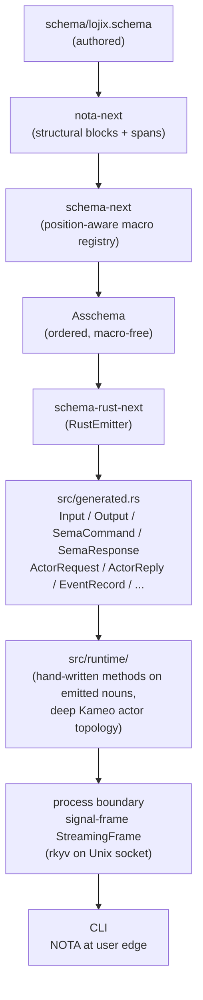

# Vision — schema-deep new logics (lojix-horizon on nota-next + schema-next)

*The vision for how nota-next + schema-next + schema-rust-next
power a schema-deep rewrite of the new lojix-horizon logics:
deep actor system with schema-defined actor interfaces and
schemas, method-only Rust, all tests passing, sandbox OS booted
on the new logics. Per psyche 2026-05-27 (Spirit 883/884/885).
Orchestrator-authored; not a subagent slice. The implementing
subagent reads this as the "what to build" reference.*

## The picture in one sentence

The new lojix-horizon logics — daemon, thin CLI, deploy pipeline, event log, generation ledger, observation streams, GC roots, the whole deploy domain — is rebuilt **schema-deep**: a single authored `schema/lojix.schema` declares every wire noun, every SEMA command/response noun, AND every internal actor message shape; nota-next parses; schema-next lowers (position-aware macros into Asschema); schema-rust-next emits Rust; hand-written Rust attaches **methods** to those emitted nouns; the runtime triad (Signal / Executor / SEMA) is identical in shape to spirit-next; the actor topology fans out from Executor into a dense plane-per-actor graph whose mailboxes carry schema-emitted command/response types; no free functions, no string typification, no hand-rolled wire parsers; every plane is observable through a trace witness; sandbox OS witness: `nspawn-dune-on-prometheus` (or equivalent) boots a sandbox image, the daemon drives a build-only-then-activation deploy against that image, and an architectural-truth test asserts the deploy completed via the schema-emitted SEMA generation ledger.

## The pipeline



## Authoring `schema/lojix.schema`

The schema declares the four runtime-triad surfaces (per spirit-next precedent) PLUS internal actor protocols. The position-aware shape follows schema-next's MVP root layout (per `schema-next/ARCHITECTURE.md` §"Constraints"):

- **position 1** — imports/exports map `{ }` (empty initially; imports from `signal-frame`, `signal-criome` land here when those repos publish their own schemas).
- **position 2** — root enum definitions `[ ]` (the runtime-triad enums).
- **position 3** — namespace map `{ }` (payload records, leaf enums, newtypes).

Concrete position-2 declarations for lojix:

| Root | Variants (rough) |
|---|---|
| `Input` | `(Submit DeploymentRequest)` `(Cancel DeploymentIdentifier)` `(Query DeploymentSelector)` `(Subscribe SubscriptionRequest)` `(Help HelpQuery)` |
| `Output` | `(Accepted DeploymentIdentifier)` `(Rejected RejectionReason)` `(Observation ObservationRecord)` `(Snapshot DeploymentSnapshot)` `(SubscriptionOpened SubscriptionToken)` `(HelpAnswer HelpReply)` |
| `SemaCommand` | `(RecordPlan PlanRecord)` `(RecordBuild BuildRecord)` `(RecordCopy CopyRecord)` `(RecordActivation ActivationRecord)` `(RecordObservation ObservationRecord)` `(RetractObservation ObservationIdentifier)` `(QueryGeneration GenerationSelector)` |
| `SemaResponse` | `(Acknowledged SemaCommandIdentifier)` `(GenerationLedger GenerationRecordSet)` `(ObservationStream ObservationRecordSet)` `(Missed ErrorMessage)` |
| `ActorRequest` | `(PlanRequest DeploymentRequest)` `(AuthorizationRequest AuthorizationContext)` `(BuildRequest PlanRecord)` `(CopyRequest BuildRecord)` `(ActivationRequest CopyRecord)` `(GcPinRequest BuildRecord)` `(ObservationEmit ObservationRecord)` |
| `ActorReply` | `(PlanReady PlanRecord)` `(AuthorizationDecided AuthorizationDecision)` `(BuildComplete BuildRecord)` `(CopyComplete CopyRecord)` `(ActivationComplete ActivationRecord)` `(GcPinned PinReceipt)` `(ObservationAccepted ObservationIdentifier)` |

The **schema-deep** depth is the last two rows: **internal actor messages are also schema-emitted**, not hand-rolled. Every typed noun in the daemon — wire, durable state, and internal actor mailbox — comes from the same authored `.schema` file. One source of truth for every noun the daemon touches.

Position-3 declares the payload records and enums. Following NOTA-schema syntax (`(Name [FieldType ...])` for records, `(Name (Variant ...))` for enums, single-field `[Text]` for newtypes):

| Type | Shape |
|---|---|
| `DeploymentIdentifier` | `[Integer]` (newtype) |
| `GenerationIdentifier` | `[Integer]` (newtype) |
| `DeploymentRequest` | `[HorizonView TargetNode CriomeAuthorization]` |
| `PlanRecord` | `[DeploymentIdentifier HorizonView Plan]` |
| `BuildRecord` | `[GenerationIdentifier ClosurePath BuildLog]` |
| `CopyRecord` | `[GenerationIdentifier TargetNode CopySummary]` |
| `ActivationRecord` | `[GenerationIdentifier TargetNode ActivationKind]` |
| `ObservationRecord` | `[DeploymentIdentifier Phase Status Detail]` |
| `Phase` | `(PlanReceived Authorized Building CopyingClosure Activating Observed Failed)` |
| `Status` | `(Started Progressing Complete Failed)` |
| `CriomeAuthorization` | `(Bypass OperatorAllowlist Criome)` |
| `RejectionReason` | `(Unauthorized PolicyViolation MalformedRequest CapacityExhausted)` |
| `ActivationKind` | `(Switch Boot Test)` |

(And so on for every noun the runtime touches. Subagent expands.)

If schema-next does not yet express vectors (per spirit-next's `Known limits`) and lojix needs `GenerationRecordSet [GenerationRecord]` as a Vec, the psyche authorizes modifying schema-next (record 883). The subagent surfaces a concrete vectors-needed list before forking.

## Runtime triad inside lojix-next-daemon

Per `skills/component-triad.md` §"Runtime triad — signal / executor / SEMA".

### Signal layer

**CLI** (`bin/lojix-next.rs`):
1. Reads one NOTA argument (per single-argument rule).
2. Parses it into generated `Input` (no `clap`, no flags).
3. Asks generated `Input` to frame itself as short-header + rkyv archive bytes (method on `Input`, not a free `serialize_to_frame` function).
4. Sends it over a Unix socket (transport module owns only length-prefix socket I/O).
5. Decodes generated `Output`.
6. Prints NOTA via `Output::format_as_nota()` method.

**Daemon** (`bin/lojix-next-daemon.rs`):
1. Reads a length-prefixed binary frame from socket.
2. Asks generated `Input` to triage by short header + decode itself.
3. Decodes generated `Input`.
4. Dispatches through `Engine` actor.
5. Asks generated `Output` to frame itself as binary rkyv.
6. Writes it back.

The hand-written transport module owns only length-prefix socket I/O. It does NOT own route enums, short-header matching, or rkyv archive encode/decode — those are methods on the schema-emitted `Input`/`Output` types.

### Executor layer

`Engine::handle(input: Input) -> Output` is the executor entry point. It performs the runtime decision shape explicitly:

```text
Input -> SemaCommand -> SemaResponse -> Output
```

The schema emits those nouns. Rust attaches the behavior:

- `Input::lower_to_sema_command` maps the external Signal request to state work.
- `SemaResponse::into_output` maps state response back to Signal reply.
- `Engine::handle` composes the two around the SEMA writer.

Two paths through the executor:
- **State-involving**: `Engine` → `Store::apply(SemaCommand)` → `SemaResponse` → `Output`.
- **Forward-only** (e.g. `Help`): direct method on `Input`, no SEMA round-trip.

Authorization decision (`CriomeAuthorization`) is a method on the schema-emitted `DeploymentRequest`, **not** a free function. `impl DeploymentRequest { fn authorize(&self, gate: &AuthorizationPolicy) -> AuthorizationDecision; }` lives in `src/runtime/authorization.rs` — agent-authored, attached to the emitted type.

### SEMA layer

`Store` is the single-writer state owner. For the MVP, follow spirit-next: in-memory with the `Store::apply(SemaCommand)` discipline already in place. Durable redb arrives in the next slice; the executor shape does not change.

All durable state changes pass through `Store::apply(SemaCommand)`. Generation ledger, event log, observation streams are all SEMA-backed records.

## Deep actor topology

Per `skills/actor-systems.md` §"Actor per plane", every distinct plane gets its own Kameo 0.20 actor whose `Self IS the actor` (state on the actor type, not a marker). Proposed topology for lojix-next:

| Plane | Actor noun | Inbound message type (schema-emitted unless noted) | State field (names the noun the actor IS) |
|---|---|---|---|
| Runtime root | `LojixRoot` | (lifecycle, child supervision) | `LojixChildSet` (typed child refs) |
| Signal accept | `SocketListener` | raw bytes (NOT schema-emitted) | `Option<UnixListener>` |
| Input triage | `OperationDispatcher` | `Input` | `ActorRefSet` (downstream refs) |
| Authorization | `AuthorizationGate` | `AuthorizationRequest` | `AuthorizationPolicy` |
| Plan materialization | `PlanMaterializer` | `PlanRequest` | `HorizonView` |
| Build execution | `Builder` | `BuildRequest` | `Option<InFlightBuild>` |
| Closure copy | `ClosureCopier` | `CopyRequest` | `CopyQueue` |
| Activation | `Activator` | `ActivationRequest` | `Option<ActiveGeneration>` |
| GC root pin | `GcRootPinner` | `GcPinRequest` | `PinnedSet` |
| Generation ledger | `GenerationLedger` | `LedgerCommand` (schema-emitted) | `GenerationRegistry` |
| Event log append | `EventAppender` | `EventRecord` | `EventLog` |
| Observation fan-out | `ObservationFan` | `ObservationRecord` | `SubscriberSet` |
| Subscription stream | `SubscriptionStream` | (per-subscriber) | `Vec<SubscriberHandle>` |

Each actor's State carries the data that names what it holds. **No ZST actors** — the anti-pattern lojix-cli's pre-kameo migration suffered (per `skills/actor-systems.md` §"Zero-sized actors are not actors"). The `State` field IS the noun the actor is.

**No `Arc<Mutex<T>>` between actors.** Push-not-pull per `skills/push-not-pull.md`. Release-before-notify per `skills/actor-systems.md` §"Release before notify" — resource-owning actors (the redb-backed `EventAppender`, `GcRootPinner`, `GenerationLedger`) release their owned resources before death notifications dispatch to supervisors.

**Trace witnesses required** — per `skills/actor-systems.md` §"Traces are required". The deploy pipeline's trace IS the testable claim that the path ran through every plane. Test name pattern: `lojix_next_trace_witnesses_full_pipeline`.

The cross-product between (state, message) at each actor follows `skills/enum-contact-points.md` — every two-enum `match` is the typed relationship; nest the match or extract a `Reaches<Right>` / `Dispatch<Token>` trait. The `signal_channel!` macro shape from `signal-frame` is the precedent for `Dispatch<Token>`.

## No free functions — verbs on schema-emitted nouns

Per `skills/abstractions.md` §"Schema-emitted nouns" and AGENTS.md hard override (intent records 712 + 882): every Rust function lives on a non-zero-sized data-bearing type or trait impl. In the schema-derived stack, **the nouns are emitted by `schema-rust-next` from `schema/lojix.schema`**; agents attach methods to those emitted nouns.

Concrete examples for lojix-next:

| Verb | Method placement |
|---|---|
| `lower an Input into a SemaCommand` | `impl Input { fn lower_to_sema_command(self) -> Result<SemaCommand, RejectionReason>; }` |
| `consume a SemaCommand on the SEMA writer` | `impl Store { fn apply(&mut self, cmd: SemaCommand) -> SemaResponse; }` |
| `convert a SemaResponse back to Output` | `impl SemaResponse { fn into_output(self) -> Output; }` |
| `authorize a deploy` | `impl DeploymentRequest { fn authorize(&self, gate: &AuthorizationPolicy) -> AuthorizationDecision; }` |
| `compare two generations for supersession` | `impl GenerationRecord { fn supersedes(&self, prior: &GenerationRecord) -> bool; }` |
| `migrate from a prior schema version` | `impl From<historical::v0_1::Input> for Input { fn from(...) -> Self ... }` (per `skills/enum-contact-points.md` §"From historical for current") |
| `frame an Input over the wire` | `impl Input { fn into_signal_frame(self) -> Vec<u8>; }` |

Schema-emitted code follows the same rule — macros emit functions inside `impl` blocks of the owning struct/enum, never free helpers. The hand-written `src/runtime/*` lives ON the generated nouns or on state-owning actor types. No free function helpers.

## Sandbox OS witness — the end-to-end test

Per psyche 2026-05-27 Spirit 883 "almost a full rewrite" + "fully working with sandbox operating systems running with the new logics": the pilot must drive an actual sandbox OS deploy via the schema-deep daemon. Not a mocked deploy; not an in-process simulation. A real `nixos-rebuild`-equivalent against a real container/VM.

Proposed test family (the deliverable's witness):

| Test | What it proves |
|---|---|
| `lojix_next_schema_lowering_reaches_nested_macros` | `build.rs` assertion (per spirit-next pattern) — the schema-next macro registry reached every nested struct-field / enum-variant macro. |
| `lojix_next_input_output_round_trip_rkyv` | Wire-frame symmetry over the schema-emitted types. |
| `lojix_next_input_lowers_to_sema_command_exhaustively` | Executor's typed `match` exhaustively covers `Input`. |
| `lojix_next_sema_response_maps_back_to_output_exhaustively` | Executor's typed `match` exhaustively covers `SemaResponse`. |
| `lojix_next_actor_topology_includes_every_plane` | Architectural-truth test per `skills/actor-systems.md` §"Test actor density". |
| `lojix_next_trace_witnesses_full_pipeline` | Trace asserts deploy ran through every named plane. |
| `lojix_next_no_free_functions_outside_main_and_tests` | Architectural test — no free `fn` declarations outside `fn main()` / `#[cfg(test)]`. Can be a `grep` test wrapped in a Nix check. |
| `lojix_next_no_zst_actors` | `mem::size_of::<EachActor>() > 0`. |
| **`lojix_next_build_only_pipeline_on_sandbox`** | Spawn daemon; send NOTA `Input` via CLI; daemon drives full pipeline; writes `GenerationRecord`; sandbox image built and pinned as GC root. Pure check under `nix flake check`. |
| **`lojix_next_activation_on_nspawn_sandbox`** | `nspawn-dune-on-prometheus` (or adapted equivalent) boots a sandbox image; daemon activates a new generation against it; observation stream returns `ActivationComplete`. |

The last two tests are the sandbox-OS witness. Both run under `nix flake check` (per `skills/testing.md` — all tests in Nix). The activation test reuses the existing nspawn pipeline from `CriomOS-test-cluster` or adapts it; the subagent decides based on what's least friction.

## Relationship to the existing lean lojix

The existing `horizon-leaner-shape` branch (audited in `/34`) carries the lean-but-not-schema-deep lojix: typed config, Kameo actors, build-only pipeline, sema event log — all hand-authored on the OLD `signal-core` wire scheme. The schema-deep pilot is PARALLEL to that work, not a replacement. Two reasons:

1. **Existing lean work has near-term cutover blockers.** B-0 (compile break vs signal-lojix rename), 4 structural cutover prerequisites, sandbox witness gap. Those are real and can be operator-shipped on the existing lean baseline; that's `/34`'s arc.
2. **Schema-deep is the longer-arc destination.** Spirit 883 makes clear schema-next/nota-next IS the architecture direction. The schema-deep pilot proves it on lojix the same way spirit-next proved it on spirit.

**Promotion path** (when the pilot proves out): operator amalgamates the schema-deep pilot's best-of into lojix proper, per `skills/double-implementation-strategy.md`. The pilot's job is to be **the convincing forward-looking design**; ops doesn't need to wait on it. If the pilot is unconvincing — schema-deep depth doesn't deliver enough advantage to justify the cutover cost — the pilot stays as documented exploration and the existing lean stack ships on its own.

## What "schema-deep" buys

Three concrete wins worth naming, because the pilot's job is to prove them:

1. **One source of truth for every typed noun in the runtime.** Today's lean lojix has wire types in `signal-lojix`, internal types in `lojix` (the daemon crate), sema types in another module. Three places where the deploy domain's nouns live; three places that drift. Schema-deep collapses all three into `schema/lojix.schema`.
2. **Migration is type-checked at the schema layer.** When `schema/lojix.schema` evolves (new operation, renamed field), the schema-diff produces a known shape change; `schema-next`'s upgrade machinery (planned per `nota-next/INTENT.md` and `schema-next/ARCHITECTURE.md`) projects historical-to-current automatically. Today's lean stack has zero such infrastructure; the B-0 compile break in `/34` is exactly the failure mode this fixes.
3. **Actor protocols are also typed.** Today's Kameo actors carry hand-authored message enums. Schema-deep makes the actor mailbox part of the same typed surface as wire and sema — one schema for everything. The actor topology becomes self-documenting from the schema.

The cost is the build step (schema lowering + Rust emission on every change). spirit-next has paid that cost; the pilot inherits the precedent. The cost is far less than the cumulative cost of drift across three hand-authored type families.

## Open questions for the psyche

1. **Worktree on existing lojix vs new repo `lojix-next`.** Subagent will default to **feature branch `schema-deep` on existing lojix** (psyche said "work tree branch" — implies existing repo + new branch). If psyche prefers a fully separate new repo following the spirit-next pattern exactly (`lojix-next` parallel to `spirit-next` under the schema-derived-stack umbrella), redirect now or in `2-...md`.
2. **Sandbox OS choice.** Defaulting to **nspawn-dune-on-prometheus** (the existing Prometheus runner). If a fresh sandbox OS is wanted, name it. The test will need an OS image source; the simplest is to reuse what CriomOS-test-cluster already produces.
3. **Schema-next vector support.** If lojix's deploy events require vectors (`Vec<GenerationRecord>`, `Vec<SubscriberHandle>`) and schema-next doesn't yet express them, psyche authorized modifying schema-next (per record 883). Subagent will surface concrete vectors-needed list before forking schema-next; psyche confirms the fork OR redirects to a workaround (e.g. one-record-at-a-time observation, as spirit-next does for topics).
4. **/29 role-merge.** The `/34` audit deferred `/29` role-merge post-cutover. The schema-deep pilot doesn't require /29 (it can use the existing role enum, schema-emitted). Confirm /29 stays deferred for this pilot.
5. **Promotion criteria.** When does the pilot earn promotion to lojix proper (operator amalgamation)? Proposed: (a) all the test family above passes under `nix flake check`; (b) sandbox-OS deploy witness lands; (c) the pilot ships a Spirit-record-style "what would land in lojix proper" deliverable in `2-...md`. Confirm or adjust.

## See also

- `reports/system-designer/34-mvp-and-sandbox-audit/5-overview.md` — existing lean lojix MVP picture (parallel arc).
- `/git/github.com/LiGoldragon/spirit-next` — schema-derived pilot precedent (CLI + daemon + schema-emitted nouns + runtime triad).
- `/git/github.com/LiGoldragon/schema-next/ARCHITECTURE.md` — position-aware macro registry, Asschema endpoint.
- `/git/github.com/LiGoldragon/nota-next/INTENT.md` — raw NOTA structural surface (does not decide schema semantics).
- `/git/github.com/LiGoldragon/schema-rust-next/INTENT.md` — Rust emission step.
- `skills/abstractions.md` §"Schema-emitted nouns" — schema-derived stack discipline for verb placement.
- `skills/actor-systems.md` — deep-actor topology rules.
- `skills/component-triad.md` §"Runtime triad" — Signal/Executor/SEMA.
- `skills/feature-development.md` — worktree pattern.
- `skills/double-implementation-strategy.md` — designer-track-vs-operator-track for major architectural breaks.
- `skills/rust-discipline.md` and linked sub-skills — Rust discipline that the new AGENTS.md hard override (intent 884) mandates reading BEFORE rust authoring.
