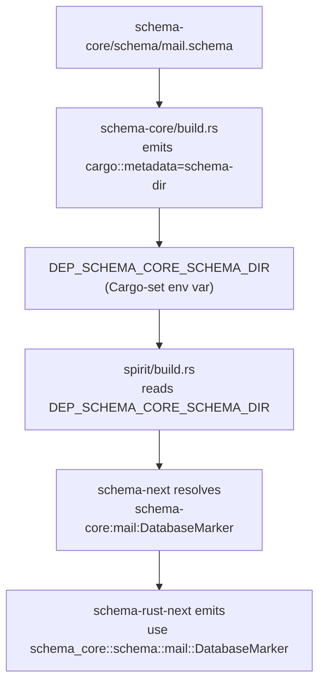

# Frame — cross-crate schema import via Cargo resolution

*Meta-report orchestrator's frame. Psyche directive 2026-05-28 (Spirit record 1009, High): research whether schema-next can reuse Cargo's crate-build setup to find schema libraries by the single-colon module naming (`crate:module:Type`) in parallel with Rust module resolution — so a schema import resolves to the dependency crate, then to its schema files, deterministically; must work in Nix. Prototype with worktrees: shared types in one crate's schema, imported by another crate (spirit), with cross-crate Rust emission. This frame carries the research findings + feasibility determination + mechanism design; the prototype is dispatched to a background subagent.*

## Psyche intent

Spirit record 1009 (Decision, High, 2026-05-28). The psyche's request decomposes into:

- **Research question**: can Cargo's crate-resolution machinery be reused so that a schema import (`schema-core:mail:DatabaseMarker`) resolves to (1) the dependency CRATE, then (2) the right schema FILE inside it, deterministically ("predictively") — mirroring how Rust resolves `schema_core::mail::DatabaseMarker`?
- **Hard constraint**: it must work in Nix builds (the workspace-wide all-builds-are-Nix rule).
- **Prototype**: shared schema types in one crate (the "schema crate" — `schema-core` or similar), imported by another crate's schema (spirit-next), proven with a worktree-based test that LOADS the shared schema from the dependency and EMITS Rust referencing the shared emitted types.

This is the foundational mechanism under `/37/3 §"Open psyche decisions" Decision A` (shared schema home for cross-component mail/marker nouns) — cross-crate schema import must exist before `DatabaseMarker` / `MailLedgerEvent` can live in a shared crate that both lojix and spirit-next import.

## Research findings — feasibility: YES

### Current state (what exists)

- **`SchemaPackage`** (`schema-next/src/module.rs`) resolves schemas WITHIN a crate: `root` (PathBuf) + `crate_name` + `version`. `module_schema_path` already does the colon→slash translation (`module.as_str().replace(':', "/")`), so `signal:public` → `schema/signal/public.schema`. **But `SchemaPackage::new` takes the crate root explicitly** — there is no mechanism to find ANOTHER crate's root. Cross-crate resolution does not exist.
- **Imports are parsed but NOT resolved.** `schema-next/src/engine.rs:184 lower_imports` collects `ImportDeclaration`s via the `RootImports` macro into `Asschema.imports` (a `Vec`). Nothing loads the imported crate's schema or resolves the imported type. Confirmed: imports are recorded, not resolved.
- **No `links` usage anywhere in the schema stack.** Clean slate for the Cargo-native mechanism.
- **spirit-next's `build.rs`** is self-contained per-crate: `SchemaPackage::new(CARGO_MANIFEST_DIR, "spirit-next", "0.1.0")` → `load_lib()` → `SchemaEngine::lower_source_with_context` → `RustEmitter::emit_file` → `src/schema/lib.rs`, with a checked-in-freshness assertion. No dependency-schema loading.
- **Nix build** (`spirit-next/flake.nix`) uses crane: vendors nota-next/schema-next/schema-rust-next as `flake = false` source inputs, patches Cargo.toml to point at vendored paths, `schemaFilter` includes `.schema` files in the build source, `strictDeps = true`, `buildDepsOnly` + `buildPackage`.

### The mechanism — `links` + `DEP_<crate>_SCHEMA_DIR`

Cargo's canonical mechanism for a build script to discover a dependency's files is the **`links` manifest key + build-script metadata + `DEP_*` environment variables** — the same machinery `pkg-config`-style crates use to expose C include paths. It is deterministic, Cargo-orchestrated, and Nix-safe.

The flow:



Three pieces:

1. **The dependency crate (`schema-core`) advertises its schema dir.**
   - `Cargo.toml`: `links = "schema-core"` (unique per crate; no conflict since each schema crate links a distinct name).
   - `build.rs`: emits `cargo::metadata=schema-dir=<path>` — the path being either its `schema/` source dir (`CARGO_MANIFEST_DIR/schema`) or a copy staged into `OUT_DIR/schema`. Cargo turns the `schema-dir` key into the env var `DEP_SCHEMA_CORE_SCHEMA_DIR` for direct dependents.
2. **The importing crate (`spirit`) reads it.**
   - `spirit/build.rs` reads `DEP_SCHEMA_CORE_SCHEMA_DIR`, constructs a `SchemaPackage` rooted there, and hands it (or a resolver carrying it) to the `SchemaEngine` so import resolution can load `schema-core`'s `schema/mail.schema`.
3. **The engine resolves; the emitter references.**
   - `schema-next` gains import RESOLUTION: given `ImportDeclaration { crate: schema-core, module: mail, types: [DatabaseMarker] }` + a resolver mapping crate-name → schema-dir, it loads the dependency module schema and resolves the imported type into the local namespace as an EXTERNAL reference (not a local re-declaration).
   - `schema-rust-next` emits a path/`use` reference (`schema_core::schema::mail::DatabaseMarker`) for imported types, instead of re-emitting the struct/enum. The dependency crate emits its own `src/schema/mail.rs`; the importer references it.

### Why it works in Nix

- `DEP_*` env vars are propagated by Cargo regardless of the build system. crane invokes Cargo; Cargo sets `DEP_SCHEMA_CORE_SCHEMA_DIR` for spirit's build.rs because spirit directly depends on the `links`-declaring schema-core. No Nix-specific plumbing needed.
- The emitted path must point at files that exist when spirit's build.rs runs. Two sub-options, both Nix-safe:
  - **Source-dir path** (`CARGO_MANIFEST_DIR/schema`): works if the dependency's `.schema` files are in the Nix build source (crane's `schemaFilter` must include them — the prototype's flake replicates spirit-next's filter).
  - **OUT_DIR-staged path**: schema-core's build.rs copies `schema/*.schema` into `OUT_DIR/schema` and emits that path; crane retains dependency build outputs, so the path persists for the dependent. Slightly more robust against source-layout assumptions.
- `strictDeps = true` (crane) separates build-deps from normal deps; the `links`/`DEP_*` mechanism works across normal deps (schema-core is a normal runtime dependency of spirit because the emitted Rust references its types). The subagent verifies the exact crane behavior by running `nix flake check`.

### Fallback if `DEP_*` hits a Nix snag

`cargo metadata --format-version=1` emits the full dependency graph with source `manifest_path`s as JSON; a build.rs could shell out to it to find dependency schema dirs. This is heavier (spawns cargo, parses JSON) and may behave differently in crane's sandbox (network / lockfile assumptions). Reserve as fallback; prefer `links`/`DEP_*`.

## What this prototype proves

A worktree-based prototype where:
1. `schema-core` (a crate — new, or repurpose an existing schema-stack crate) declares `schema/mail.schema` with `DatabaseMarker` (the shared type), declares `links`, and its build.rs emits `cargo::metadata=schema-dir`.
2. `spirit` (spirit-next, or a minimal test crate) declares `schema/lib.schema` whose Imports position (`{ }`) imports `schema-core:mail:DatabaseMarker`.
3. `spirit`'s build.rs reads `DEP_SCHEMA_CORE_SCHEMA_DIR`, resolves the import, and emits `src/schema/lib.rs` that REFERENCES `schema_core::schema::mail::DatabaseMarker` rather than re-declaring it.
4. `nix flake check` builds both crates, the cross-crate import resolves, the emitted Rust compiles, and a test asserts spirit consumes the shared type from schema-core.

The deliverable is the FEASIBILITY CONFIRMATION (it builds in Nix) plus the mechanism landed as schema-next + schema-rust-next + build.rs-pattern changes.

## Method

Three threads:
1. **Research + feasibility** — done this turn (this frame). Mechanism: `links` + `DEP_<crate>_SCHEMA_DIR`. Works in Nix. Fallback: `cargo metadata`.
2. **Dispatch subagent in background** — non-blocking per hard override; subagent inherits this system-designer lane per record 920. Brief in §"Subagent dispatch brief" below.
3. **Audit + synthesise on return** — verify the Nix build, confirm the mechanism, synthesise what it unblocks (Decision A shared schema home / persona-mail extraction). Lands as `N-overview.md`.

## Subagent dispatch brief

*Verbatim. The subagent reads this as its complete instruction set.*

### You are a designer subagent

You are a designer-class subagent dispatched by the system-designer lane (per record 920 you INHERIT this lane + lock; do NOT create a `-assistant` lane; reports land in `reports/system-designer/`). Your task is to PROVE cross-crate schema import works in Nix, by prototyping it end-to-end with worktrees and landing the mechanism in schema-next + schema-rust-next.

### Required reading, in order

1. `/home/li/primary/reports/system-designer/39-schema-cargo-cross-crate-import/0-frame-and-method.md` — THIS frame. §"Research findings" gives you the mechanism (`links` + `DEP_<crate>_SCHEMA_DIR`); §"Why it works in Nix" gives the Nix reasoning; §"Fallback" gives the cargo-metadata alternative.
2. `/home/li/primary/AGENTS.md` — workspace contract. Rust-skill hard override (read skills/rust-discipline.md before writing Rust); per-repo INTENT.md+ARCHITECTURE.md manifestation per record 944.
3. `/home/li/primary/skills/rust-discipline.md` + sub-skills + `skills/abstractions.md` + `skills/feature-development.md` (worktree pattern) + `skills/jj.md` (headless jj, `-m` inline) + `skills/testing.md` (all tests in Nix).
4. `/git/github.com/LiGoldragon/schema-next/src/module.rs` (`SchemaPackage` — the within-crate resolver you extend) + `src/engine.rs:184 lower_imports` (where imports are collected but not resolved) + `src/asschema.rs` (`ImportDeclaration`) + `src/macros.rs` (`RootImports`).
5. `/git/github.com/LiGoldragon/spirit-next/build.rs` (the self-contained per-crate build pattern you extend) + `flake.nix` (the crane + vendored-source + schemaFilter pattern you replicate for the prototype) + `schema/lib.schema` (the 4-position document; Imports is position 0, the `{ }` brace).
6. `/git/github.com/LiGoldragon/schema-rust-next/src/lib.rs` (`RustEmitter` — where you add cross-crate path emission for imported types).

### The mechanism to implement (from §"Research findings")

`links` + `DEP_<CRATE>_SCHEMA_DIR`. The dependency crate declares `links` + a build.rs emitting `cargo::metadata=schema-dir=<path>`; the importer's build.rs reads `DEP_<CRATE>_SCHEMA_DIR` and feeds it to the SchemaEngine as the import resolver; schema-next resolves imported types as external references; schema-rust-next emits `use`/path references to the dependency's emitted types.

### Worktrees

Per `skills/feature-development.md`, create worktree branches under `~/wt/github.com/LiGoldragon/<repo>/cross-crate-schema-import/` for each repo you touch (likely: schema-next, schema-rust-next, and a prototype consumer). Same branch name across repos. Claim each:

```sh
tools/orchestrate claim system-designer '[draft:cross-crate-schema-import-2026-05-28]' ~/wt/github.com/LiGoldragon/<repo>/cross-crate-schema-import -- 'cross-crate schema import prototype'
```

(System-designer claim per inheritance per record 920.)

### The prototype — choose the cleanest shape

You decide the exact crate layout; two viable shapes (document your choice):

- **Shape A — minimal two-crate prototype**: create a small `schema-core` crate (shared types: `DatabaseMarker`, maybe `MailLifecycle`) + a small consumer crate that imports them. Smallest surface to prove the mechanism; least entanglement with spirit-next's existing complexity. Recommended for the first proof.
- **Shape B — real consumer**: make spirit-next import from a new `schema-core` crate. More realistic but entangles with spirit-next's full build. Do this AFTER Shape A proves the mechanism, OR if Shape A's lessons transfer cleanly.

The psyche named "the schema crate" + "another crate, like Spirit" — Shape A with crate names `schema-core` + a `spirit`-flavored consumer is the faithful reading. If you create a new `schema-core` repo, follow `skills/major-break-via-new-repo.md` + scaffold it like spirit-next (Cargo + flake + schema/ + build.rs + src/schema/).

### Deliverable

1. **`schema-core` crate** with `schema/mail.schema` declaring `DatabaseMarker` (+ optionally `MailLifecycle`); `links = "schema-core"` in Cargo.toml; build.rs that lowers its own schema → `src/schema/mail.rs` (or `lib.rs`) AND emits `cargo::metadata=schema-dir=<path>`.
2. **Consumer crate** with `schema/lib.schema` importing `schema-core:mail:DatabaseMarker` in the Imports position; build.rs reads `DEP_SCHEMA_CORE_SCHEMA_DIR`, resolves the import, emits `src/schema/lib.rs` referencing `schema_core::schema::mail::DatabaseMarker`.
3. **schema-next changes**: import RESOLUTION — a resolver that maps crate-name → schema-dir (populated from the build.rs's `DEP_*` read), used during lowering so imported types resolve to external references rather than unresolved names or local re-declarations. Methods on data-bearing types per the no-free-functions rule.
4. **schema-rust-next changes**: emit cross-crate path/`use` references for imported types instead of re-emitting their declarations.
5. **Nix witness**: a `flake.nix` (modeled on spirit-next's crane setup) whose `nix flake check` builds both crates, resolves the cross-crate import, compiles the emitted Rust, and runs a test asserting the consumer uses schema-core's `DatabaseMarker` type (e.g. constructs one, or a type-identity assertion). The check MUST dispatch to a remote builder per the workspace Nix discipline if it needs heavy builds.
6. **Per-repo INTENT.md + ARCHITECTURE.md** updates per record 944 in every repo you touch (schema-next, schema-rust-next, the prototype crates).

### Hard rules

- No free functions outside `fn main()` / `#[cfg(test)]`; methods on non-ZST data-bearing types.
- Schema-emitted types are the nouns; don't hand-write parallel mirrors.
- NOTA strings from bracket forms only; never emit `"`.
- Headless jj — `-m` inline; never let jj open `$EDITOR`.
- Designer lanes don't push to main; per-repo feature branches under `~/wt/`. `jj git push --bookmark cross-crate-schema-import --allow-new` is your push surface.
- Sub-sub-agent dispatches (if any) MUST be `run_in_background: true`.
- All tests in Nix per `skills/testing.md`.

### Reporting back

Write your report at `/home/li/primary/reports/system-designer/39-schema-cargo-cross-crate-import/2-<descriptive-name>.md`. Include:
- The feasibility verdict (did it build in Nix? YES/NO with the `nix flake check` output excerpt).
- The exact mechanism as implemented (which `links` name, which `DEP_*` var, source-dir vs OUT_DIR-staged path, any crane gotchas).
- Per-repo changes (schema-next import resolution, schema-rust-next emission, build.rs pattern).
- Whether `DEP_*` worked or you fell back to `cargo metadata` (and why).
- The emitted Rust snippet proving the cross-crate reference.
- What's still rough / iteration-N work (e.g. version mismatch handling, transitive imports, the existing Import/Export records' relationship to this mechanism).
- Any NEW Spirit Clarifications you captured (do NOT re-capture record 1009).

If you hit a hard blocker (e.g. `DEP_*` genuinely doesn't survive crane's sandbox AND `cargo metadata` also fails), REPORT IT with the exact failure — that's a real feasibility finding, not a half-implementation to paper over.

### Don't do these things

- Don't push to `main` of any repo.
- Don't modify workspace guidance files (`AGENTS.md`, `ESSENCE.md`, workspace `INTENT.md`); per-repo INTENT/ARCH is fair game per record 944.
- Don't search `/nix/store`.
- Don't `cat`/`head`/`tail`/`sed`/`awk` when Read/Edit fit.
- Don't conflate the existing `Import [SourcePath LocalPath]` / `Export [LocalPath PublicPath]` schema records (which appear in spirit-next's schema for a path-mapping purpose per `/operator/219`) with this cross-CRATE import mechanism — investigate their relationship and document it, but the cross-crate import is the `{ }` Imports position resolution, a distinct concern.

### Closing

The research says this is feasible via `links` + `DEP_*`. Your job is to PROVE it in Nix and land the mechanism. This unblocks the shared-schema-home decision (`/37/3` Decision A) — once cross-crate import works, `DatabaseMarker` / `MailLedgerEvent` can live in a shared `schema-core` (or `persona-mail`) crate that both lojix and spirit-next import instead of duplicating. Take the depth seriously; a real Nix build is the witness.

Begin by reading this frame's §"Research findings".

## Risks + open questions

- **`DEP_*` survival in crane's `strictDeps` sandbox** — the primary feasibility risk. The research says it works (Cargo propagates `DEP_*` for direct deps regardless of build system) but the subagent's `nix flake check` is the real witness. If it fails, the `cargo metadata` fallback OR an explicit Nix-level schema-dir passthrough (env var set by the flake) are the contingencies.
- **Source-dir vs OUT_DIR-staged schema path** — source-dir is simpler but assumes the dependency's `.schema` files are in the Nix build source (crane `schemaFilter`); OUT_DIR-staged is more robust. Subagent picks + documents.
- **Relationship to the existing `Import`/`Export` schema records** — spirit-next declares `Import [SourcePath LocalPath]` / `Export [LocalPath PublicPath]` (per `/operator/219` these are declared+tested but unresolved). Are these the SAME concern as cross-crate import, or a different path-mapping feature? Subagent investigates + documents; they may converge or be orthogonal.
- **Version resolution** — when `spirit` imports `schema-core:mail:DatabaseMarker`, which VERSION of schema-core? Cargo's dependency resolution picks the version; the schema engine should resolve against whatever Cargo resolved (the `DEP_*` path points at the resolved version's schema). Transitive + diamond-dependency version conflicts are iteration-N concerns; the prototype proves the single-version happy path.
- **Existing `nexus` repo naming collision** (carried from `/37/3`) — unrelated to this work but still open.
