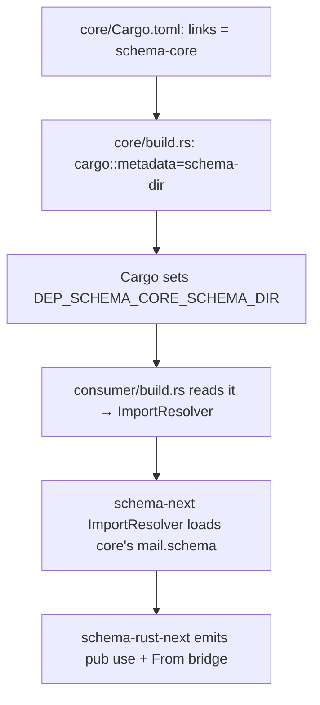

# Overview — cross-crate schema import (orchestrator synthesis)

*Orchestrator synthesis of the `/39` meta-report. Feasibility CONFIRMED and verified: cross-crate schema import works in Nix via Cargo's `links` + `DEP_<crate>_SCHEMA_DIR`, exactly as the research predicted — no `cargo metadata` fallback needed. The mechanism landed across schema-next (import resolution), schema-rust-next (cross-crate emission), and a new `schema-core` witness repo, all on branch `cross-crate-schema-import`, pushed, none on main. This unblocks `/37/3 §"Decision A"` (shared schema home). One load-bearing next design question surfaced: the types-only module shape.*

## Feasibility verdict — YES, verified

`nix flake check` on the new `schema-core` repo passed all 9 checks on remote builder `prometheus.goldragon.criome`, including 3 type-identity tests proving the consumer uses schema-core's `DatabaseMarker`. I independently verified the load-bearing claims:

- `consumer/src/schema/lib.rs:6` — `pub use schema_core::schema::mail::DatabaseMarker as DatabaseMarker;` (the cross-crate reference).
- No `pub struct DatabaseMarker` anywhere in the consumer (grep confirms — it's a reference, not a re-declaration).
- `consumer/src/schema/lib.rs:118` — `impl From<schema_core::schema::mail::NotaDecodeError> for NotaDecodeError` (the error bridge).
- `consumer/src/schema/lib.rs:137` — `Marked(DatabaseMarker)` (local variant carrying the dependency's type).
- `core/Cargo.toml:10` — `links = "schema-core"`.
- Branches pushed: schema-next `sopvwomuqltr`, schema-rust-next `srttqolmxsry`, schema-core `nqkvlrrowqky` (all carrying the cross-crate-import work + per-repo INTENT/ARCHITECTURE per record 944).

The "research if it's possible" question the psyche asked is answered: **possible, proven, in Nix.**

## The mechanism as landed

Exactly the research-predicted shape:

- **schema-next** closed the resolution gap. New `src/resolution.rs` with three data-bearing types: `ImportSource` (`TryFrom<&Name>` splits `crate:module:Type` + computes the Rust path), `ResolvedImport` (carries alias + emits the `pub use`), `ImportResolver` (maps crate-name → schema-dir, loads the dependency module, confirms the type is declared). `SchemaEngine::lower_source_with_resolver` is the new entry; the legacy collect-only path delegates with an empty resolver so all 39 existing tests pass byte-for-byte. 5 new tests, 3 new error variants.
- **schema-rust-next** emits `pub use <dep>::schema::<module>::<Type> as <Local>;` for imported types + a `From<dep::NotaDecodeError>` bridge per imported module. Empty-imports early-return keeps existing emission byte-identical (golden test passes). 2 new tests.
- **schema-core** (NEW repo, created on GitHub, scaffolded per `skills/major-break-via-new-repo.md`): two-member Cargo workspace (`core` = shared types declaring `DatabaseMarker` + `links`; `consumer` = imports it) + crane `flake.nix` with the witness checks. No `main` yet — operators create main when integrating, per designers-don't-push-to-main.

The subagent chose the **source-dir path** (`CARGO_MANIFEST_DIR/schema`) over OUT_DIR-staging — simpler, works because the flake's `schemaFilter` admits the dependency's `.schema` files into the build source. OUT_DIR-staging remains the more-robust option for a future consumer whose dependency schema lives outside the build source.

## Three design findings worth the psyche's attention

### 1. Types-only module shape — the load-bearing next question

The shared-types crate (`schema-core/core`) was FORCED to carry a trivial signal plane (`(Mark DatabaseMarker)` / `(Marked DatabaseMarker)`) purely to compile, because the 4-position document + emitter REQUIRE non-empty `Input`/`Output` root enums (empty enums produce zero-variant `#[repr]` errors + non-exhaustive matches). A pure shared-types crate wants a **types-only module** — a schema document with Imports + Namespace but NO Input/Output signal plane.

This is the cleanest next design question because it directly shapes how the shared schema home works (Decision A below). If `schema-core` / `persona-mail` is to hold ONLY shared types, the schema language needs to express a types-only module. This connects to `/389 §"Open questions"` about the mandatory 4-position document. **Surfaced to the psyche as a decision** (below).

### 2. Cross-crate NOTA codec needs an error bridge

Each emitted module declares its own `NotaDecodeError`; when the consumer's codec calls an imported type's `from_nota_block`, the `?` operator needs `From<dependency::NotaDecodeError>`. The emitter now writes one `From` impl per imported module. This was a real compile failure caught ONLY because the imported type was load-bearing in the consumer's codec — a shallower proof (a type that's imported but never round-tripped) would have missed it. Good evidence the prototype was deep enough.

### 3. `#[rustfmt::skip]` is a standing pattern for schema-derived crates

The emitter output isn't rustfmt-clean for all schemas, and the build.rs freshness check compares against raw emitter output — so rustfmt'ing the checked-in file would break freshness. spirit-next already solves this with `#[rustfmt::skip]`; schema-core does the same. Worth noting as a standing pattern (eventually the emitter could produce rustfmt-clean output — `/391 §"Open questions" #3`).

## What this unblocks

**`/37/3 §"Decision A"` — the shared schema home.** With cross-crate import proven, `DatabaseMarker` / `MailLedgerEvent` / `NexusInput` / `NexusOutput` / the mail-marker nouns can live in ONE shared crate that both lojix (`/37 iter 2`) and spirit-next (`/operator/219`) import, instead of each re-declaring them. The prototype's `core` crate is the seed of that shared home. The duplication I flagged in `/38` (system-operator audit) + `/37/3` now has its enabling mechanism.

This also makes `/37/3 §"Decision B"` (persona-mail extraction) actionable: persona-mail can be a `schema-core`-style crate holding the mail/marker nouns, imported across components.

## Iteration-N + open items

| Item | What it is | Priority |
|---|---|---|
| Types-only module shape | Let a schema module declare namespace types without a forced signal plane (finding 1) | High — gates the clean shared-schema-home shape |
| schema-rust-next flake gap | schema-rust-next's own flake check can't test against feature-branch schema-next (no `schema-next-source` input; pulls from main which lacks `ResolvedImport`). Validated transitively via schema-core's flake. | Medium — small follow-up, add the input |
| Version resolution | The resolver trusts whatever Cargo resolved (the `DEP_*` path points at the resolved version). Single-version happy path only. | Medium — diamond/transitive conflicts unaddressed |
| Transitive imports | A crate importing a type that itself imports from a third crate is untested | Low — prove when a real case arises |
| Richer cross-crate error typing | The bridge collapses dependency parse failures into local `Parse(String)` | Low |
| Committed-flake inputs → main | The schema-core flake points at feature branches; moves to main when operators integrate schema-next/schema-rust-next | Operator-amalgamation-time |

## Recommendations

### For the orchestrator (this lane)

1. **Carry the types-only-module-shape question into the next schema-language iteration.** It's the gate to a clean shared schema home. Likely a designer-lane (or nota-designer) iteration on schema-next: make Input/Output optional at the 4-position document level so a module can be Imports + Namespace only.
2. **Sequence the shared-schema-home extraction (Decision A/B) AFTER the types-only module lands** — otherwise `persona-mail` / `schema-core` inherits the trivial-signal-plane wart. Or accept the wart short-term and clean up when types-only lands.

### For operators (integration)

3. **schema-next + schema-rust-next cross-crate-import branches are integration candidates.** Both pass their own checks (schema-next's full flake; schema-rust-next via schema-core's flake). When integrated to main, the schema-core flake inputs move from feature-branch to main, and the schema-rust-next flake gains a `schema-next-source` input.
4. **schema-core has no main yet** — operators create it when integrating, per the designers-don't-push-to-main rule.

### For the psyche (one decision)

5. **Decision: types-only module shape for schema.** Should the schema language let a module declare Imports + Namespace WITHOUT Input/Output root enums (a pure shared-types module)? This is the clean way for `schema-core` / `persona-mail` to hold shared nouns. Alternative: keep the 4-position document mandatory and accept a token signal plane on shared-types crates. Recommendation: support types-only modules — the shared schema home is a real and recurring need (already two consumers: lojix + spirit-next), and a forced signal plane on a types-only crate is exactly the kind of "special case that should dissolve into the normal case" `skills/beauty.md` warns against.

## Lock reconciliation

The subagent (inheriting this system-designer lane per record 920) left its worktree-path claims for me to reconcile rather than release my parent claims. The cross-crate-import worktree claims (`[draft:cross-crate-schema-import-2026-05-28]` on the schema-next + schema-rust-next worktrees) are now releasable — the work is pushed + complete. My main system-designer lock (`[draft:horizon-lojix-migration-2026-05-23]`) stays. (Released as part of this wrap-up.)

## Bottom line

Cross-crate schema import is proven in Nix. The mechanism (`links` + `DEP_*`) landed cleanly across schema-next + schema-rust-next + the schema-core witness repo, all pushed, none on main, all checks green. The psyche's research question is answered YES with a working witness. The one load-bearing next design question is the types-only module shape — surfaced for psyche decision. The mechanism unblocks the shared-schema-home decision (`/37/3` Decision A/B), turning the cross-component noun duplication (`/38` + `/37/3` finding) into a solvable extraction.

## See also

- `0-frame-and-method.md` — orchestrator frame + research findings + subagent brief.
- `2-prototype-feasibility-and-mechanism.md` — subagent's implementation report (per-repo changes, the Nix witness, the emitted proof).
- `~/wt/github.com/LiGoldragon/schema-next/cross-crate-schema-import/` + `~/wt/github.com/LiGoldragon/schema-rust-next/cross-crate-schema-import/` — the substrate worktrees.
- `/git/github.com/LiGoldragon/schema-core/` — the new witness repo (branch `cross-crate-schema-import`, commit `nqkvlrrowqky`).
- `/system-designer/37-prototype-schema-deep-iteration-2-nexus-mail-sema-engine-2026-05-27/3-overview.md` — Decision A/B (shared schema home + persona-mail) this unblocks.
- `/system-designer/38-source-staging-prototype-audit.md` — the cross-component noun duplication this resolves.
- `/designer/389-schema-macros-canonical-direction.md` §"Open questions" — the mandatory 4-position document the types-only-module question revisits.
- `/designer/392-vision-schema-driven-stack-canonical-2026-05-27.md` — the workspace vision; single-colon mirror-naming (record 952).
- Spirit record 1009 — the directive.
- Spirit records 944 (per-repo manifestation) + 920 (subagent lane inheritance).
