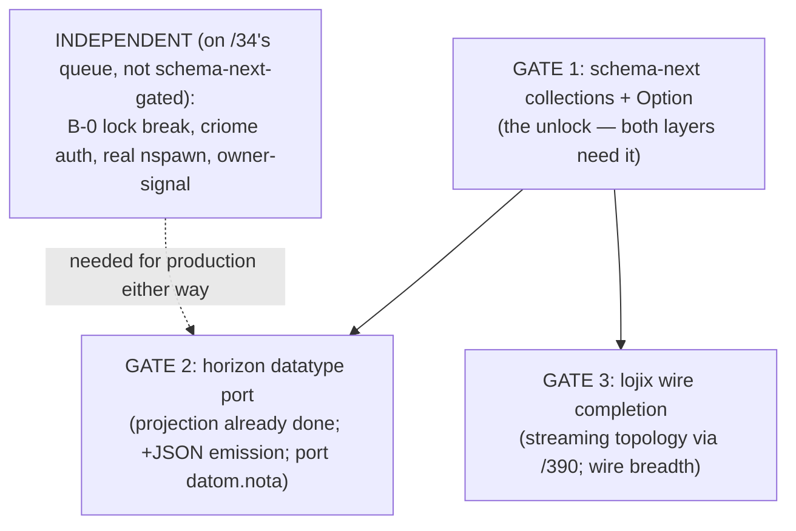

# Overview — horizon/lojix schema-next port feasibility (synthesis)

*Orchestrator synthesis of the `/40` feasibility audit. Psyche directive 2026-05-28 (Spirit 1024): can schema-next + nota-next be ported to be the MAIN datatype/signal/sema driver for the horizon/lojix rewrite — is it possible at all? **Verdict: YES, possible — no architectural blocker. The single feared crux (horizon projection logic) is already schema-at-heart. The remaining blockers are all bounded schema-next CAPABILITY gaps, and both research waves converge on the SAME first gate: schema-next must grow collection types (Vec/BTreeMap) + Option.** The port is a re-grounding, not a re-architecture.*

## The verdict in one paragraph

Porting the horizon/lojix rewrite to schema-next/nota-next as the main datatype/signal/sema driver is **possible**. There is no architectural impossibility. The horizon projection logic — the load-bearing uncertainty going in — turns out to be ALREADY structured as schema-at-heart (pure methods on proposal nouns, zero free projection functions). The lojix signal+sema layer is already pilot-proven schema-driven (6.7/8.0). What blocks a FULL port today is a small, well-scoped set of schema-next CAPABILITY gaps — and both waves independently converge on **collections (Vec/BTreeMap) + Option at type-reference positions** as the first and decisive gate. Land that one schema-next feature and the horizon datatype port (the big one — ClusterProposal) and the lojix wire breadth both unblock. The production-realities (criome auth, real nspawn, owner-signal) are independent prerequisites that belong to `/34`'s bead queue regardless of the schema-next question.

## The three sub-questions answered

| Driver sub-question | Verdict | Evidence | Gate |
|---|---|---|---|
| **Datatype driver** (every horizon/lojix type from schema) | PARTIAL → gated | Wave A: leaf types (scalars/newtypes/enums) emit today; projection logic already methods-on-nouns (GREEN). But ClusterProposal is collection-bearing (112 container-field-lines: 21 BTreeMap, 39 Vec) and `Topics [Topic]` lowers to newtype `Topics(Topic)`, NOT `Vec<Topic>`. | schema-next collections + Option + JSON-emission |
| **Signal driver** (wire protocol schema-derived) | POSSIBLE (types) + gated (topology) | Wave B: pilot wire `Input`/`Output` emit from `schema/lojix.schema`; signal-lojix type vocabulary (enum-with-data, nested records, plain enums) all proven emittable. | the streaming-channel topology (observation stream `opens`/`belongs`/`token`/`close` witnesses) needs `/390`'s schema-derived-signal-frame work; wire breadth needs collections |
| **Sema driver** (durable state via sema-engine + schema-emitted commands) | POSSIBLE — pilot-proven | Wave B: `/37`'s SEMA plane is sema-engine-backed durable with schema-emitted `EngineRecord` (`store.rs:81-138`, restart-survival witnessed); Nexus mail keeper threads `DatabaseMarker` on every reply. Both tracks now MATCH on durability (the in-memory-Vec shortcut is already closed). | none for the layer; production wire breadth needs collections |

## The crux resolved GREEN — projection is already schema-at-heart

The feared failure mode going into this audit: "horizon projection needs computation the schema can't express, forcing a rewrite." **It does not.** Wave A found the projection logic is already pure methods on the proposal nouns — zero free projection functions in the 7,276-line lib. `ClusterProposal::project` (`lib/src/proposal/cluster.rs:74-254`) + ~12 helpers (`node_trust`, `NodeProposal::project`, `BehavesAs::derive`, `UserProposal::project`, the domain/SSID/CIDR/resolver derivations on `HorizonProposal`) all take `&self` on the right noun.

This is the *expected and correct* schema-at-heart outcome (record 1000 / `skills/abstractions.md §"Schema-emitted nouns"`): **schema emits the nouns; agents write the projection as methods on them.** horizon-rs is ALREADY shaped this way — the projection methods simply re-attach to schema-emitted versions of the same nouns. **No projection logic rewrite is needed** — this is the single most important finding of the audit, because it means the hardest-seeming part is free.

## The convergent finding — collections is the first gate

Both waves, investigating different repos, point at the SAME gating item:

- **Wave A** (horizon): the cluster proposal can't emit from schema until schema-next has collection types. `TypeReference` is a bare name with no type arguments; `TypeDeclaration` is only Struct/Enum/Newtype. The entire aggregate-root layer is collection-bearing.
- **Wave B** (lojix): the production wire breadth (cache-retention lists, multi-phase observations) needs collections; secondary to the streaming topology but the same underlying gap.
- **Prior session evidence**: `/37/3` deferred vectors (I-6); `/39` found the types-only-module wart; Spirit record 883 already AUTHORIZED modifying schema-next for vectors.

So the first gate is unambiguous and already psyche-sanctioned in principle: **schema-next grows collection types (Vec/BTreeMap) + Option<T> at `TypeReference` positions, with schema-rust-next emitting them.** This is bounded work — the type model (`asschema.rs` `TypeReference` gains type arguments) + the emitter (collection references) — NOT an architecture change. Critically, Wave A confirmed the **wire substrate is NOT the blocker**: nota-next already parses `{}` brace blocks and the legacy `nota-codec` already has full `Vec`/`BTreeMap`/`Option` codecs. The gap is purely schema-next's type model + the emitter never growing a collection reference.

## The staged port path

1. **Gate 1 — schema-next collections + Option (the unlock).** Grow `TypeReference` to carry type arguments (Vec/BTreeMap/Option); schema-rust-next emits them. Unblocks BOTH the horizon datatype port and the lojix wire breadth. Foundational; everything datatype-side waits on it. Psyche-authorized in principle (record 883). Pairs with the types-only-module shape (`/39`) for the shared schema home.
2. **Gate 2 — horizon datatype port.** With collections, emit `ClusterProposal`/`NodeProposal`/the Horizon view from `schema/horizon.schema`. The projection methods already exist (GREEN) — they re-attach to the schema-emitted nouns. Add JSON-output emission to schema-rust-next (horizon-specific — horizon's purpose is emitting JSON for Nix; lojix never hit this). Port `goldragon/datom.nota` to schema-emitted-types-conforming data (closes the stale-shape problem from `/36`).
3. **Gate 3 — lojix wire completion.** The streaming-channel topology (observation-stream witnesses) via `/390`'s schema-derived-signal-frame work (`/37`'s I-1). Plus full wire breadth (~9 ops + cache-retention + 7-phase observations vs the pilot's 4). The signal+sema LAYERS are already proven (`/37` at 6.7/8.0); this completes the wire CONTRACT.
4. **Independent prerequisites (on `/34`'s bead queue, NOT schema-next-gated).** B-0 lock break, criome auth (real signal-criome digest, fail-closed), real nspawn boot, owner-signal triad leg. These are needed for a production horizon/lojix REGARDLESS of whether it's schema-driven or hand-authored — they belong to the cutover arc, not the port question.

## The B-0 sidestep — an argument FOR the port

Wave B surfaced that the production-track lean lojix (`horizon-leaner-shape`) **does not compile as-pinned** — `/34`'s rank-0 B-0 lock break is still open (lean lib references `wire::Request`/`Reply`/`DeploymentSubmission`/`LojixFrame`; pinned signal-lojix `a007e8b6` renamed these). **The schema-next port SIDESTEPS B-0 entirely**: the schema-deep pilot track doesn't have B-0 because its wire types come from `schema/lojix.schema`, not the hand-authored `wire::Request` names that broke. So porting onto the pilot track DISSOLVES a `/34` blocker rather than requiring it be fixed first. This is a real point in favor of the port: instead of fixing B-0 on the hand-authored production track (then maintaining hand-authored wire types that will break again on the next signal-lojix rename), the port replaces those types with schema-emitted ones that can't drift from the contract.

## Gap ranking — what gates vs what's incremental vs independent

| Gap | Class | Source | Gates the port? |
|---|---|---|---|
| schema-next collections (Vec/BTreeMap) + Option | schema-next capability | Wave A + Wave B + `/37/3` I-6 + record 883 | **YES — first gate, both layers** |
| JSON-output emission in schema-rust-next | schema-rust-next capability | Wave A (horizon-specific) | YES for horizon (Gate 2) |
| streaming-channel topology (schema-derived signal-frame) | schema-next capability | Wave B + `/390` + `/37` I-1 | YES for full lojix wire (Gate 3) |
| types-only module shape | schema-next capability | `/39` | Incremental — clean shared schema home; not strictly blocking |
| cross-crate schema import | schema-next capability | `/39` (DONE) | Already proven — enables horizon+lojix shared nouns |
| schema upgrade traits | schema-next capability | record 950 | Incremental — when first schema diff arrives |
| B-0 lock break | production-track compile | `/34` B-0 + Wave B | Independent — SIDESTEPPED by the port |
| criome auth (real signal-criome) | production prerequisite | Wave B + `/34` B-? | Independent — needed either way |
| real nspawn boot | production prerequisite | `/37` I-8 + `/34` B-10 | Independent — operator-amalgamation work |
| owner-signal-lojix triad leg | production prerequisite | `/34` B-16 + `/37` I-7 | Independent — needed either way |
| cluster-data (datom.nota) port | datatype-driver work | Wave A + `/36` | Part of Gate 2 |

## Recommendation — GO for the port, gated on schema-next collections

**Feasibility: confirmed YES.** No architectural blocker. The projection crux is free (already schema-at-heart). The blockers are bounded schema-next capability features with a crisp dependency order.

**Recommended sequencing** (if the psyche commits to the port):
1. Land **schema-next collections + Option** first — the single unlock both layers need (Gate 1). Relatively contained; psyche-authorized in principle (record 883).
2. Port **horizon datatypes** (Gate 2) — projection's already done; add JSON emission; port datom.nota. This is where the substrate-direction debt (`/36`, `/163`) gets paid: horizon stops walking the legacy nota-codec migration forward.
3. Complete the **lojix wire** (Gate 3) on the schema-deep pilot track, which already has signal+sema proven and sidesteps B-0.
4. The production prerequisites (criome, nspawn, owner-signal) proceed on `/34`'s queue in parallel — they're needed regardless.

**The decision the psyche owns**: commit to the port NOW (starting with schema-next collections) vs continue the legacy lean stack (`horizon-leaner-shape`) to cutover and port later. The case FOR porting now: (a) the substrate-direction debt is recurring (every nota-codec migration re-breaks the hand-authored lean stack — B-0 is the current instance); (b) the port sidesteps B-0 rather than fixing it; (c) the hardest part (projection) is free; (d) the gating blocker is ONE well-scoped, already-authorized schema-next feature. The case for waiting: the legacy lean stack is closer to a production cutover TODAY (modulo B-0), and the port adds the schema-next-collections + JSON-emission + streaming-topology work before horizon can emit. **My recommendation: GO — but stage it.** Land schema-next collections as the next concrete step (it unblocks the most and is already sanctioned), then port horizon datatypes, proving the substrate-direction on the component (horizon) where the legacy debt hurts most. Let lojix continue on the schema-deep pilot track (already 6.7/8.0, sidesteps B-0).

## What this audit does NOT settle

- The actual GO/NO-GO commitment (psyche's call).
- Branch reconciliation across the lojix tracks (`/37/3` Decision C) — production-track vs schema-deep vs schema-deep-iteration-2 vs source-staging. The port path assumes convergence onto the schema-deep pilot track; the merge is operator-amalgamation work.
- The exact schema-next collections design (Vec-only first? BTreeMap? how Option composes with the existing newtype lowering) — a schema-language design task for the next iteration, likely nota-designer or designer lane.

## See also

- `0-frame-and-method.md` — frame + the two wave briefs.
- `1-horizon-datatype-and-projection-state.md` — Wave A: projection GREEN, datatypes gated on collections.
- `2-lojix-signal-sema-state.md` — Wave B: lojix signal+sema POSSIBLE (6.7/8.0 pilot-proven), wire streaming-topology gap, B-0 sidestep.
- `/system-designer/35-schema-deep-new-logics/3-overview.md` + `/37-.../3-overview.md` — the schema-deep pilots proving lojix schema-driving.
- `/system-designer/39-schema-cargo-cross-crate-import/3-overview.md` — cross-crate import (enables shared horizon+lojix nouns) + the types-only-module finding.
- `/system-designer/36-criomos-reconciliation-audit.md` + `/system-operator/163-...` — the substrate-direction reading this audit elevates.
- `/system-designer/34-mvp-and-sandbox-audit/5-overview.md` — B-0 + the production prerequisites (criome, nspawn, owner-signal).
- `/designer/392-vision-schema-driven-stack-canonical-2026-05-27.md` — schema-at-heart vision (record 1000).
- `/designer/390-wire-runtime-canonical-direction.md` — schema-derived signal-frame (Gate 3's streaming topology).
- Spirit records 1024 (this directive), 1000 (schema-at-heart), 883 (vector authorization), 950 (schema upgrade traits).
