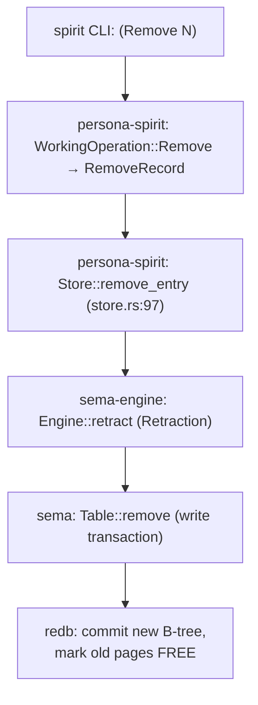
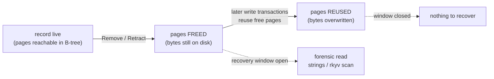
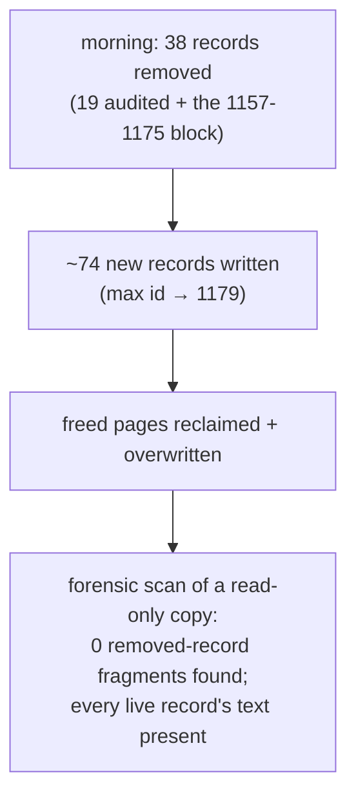

# Sema/redb deletion durability — finding, manifestation, open questions

*A removal in the Spirit intent store is irreversible: redb is
copy-on-write, so a removed record's freed pages are reclaimed and
overwritten by later writes, and the bytes are gone from the file. This
report captures the storage-engine finding behind the
`reports/system-designer/46` recovery dead-end, the architecture files
it was manifested into, and the open questions it raises. Per psyche
2026-05-29 ("document all that in sema and briefly in appropriate
architecture documenting files" + "make a report about this and your
open questions with visuals").*

## The removal chain — Spirit `Remove` down to redb page-free

A thin-CLI `(Remove N)` travels the full storage stack. Each layer was
read from the deployed source (`persona-spirit` main `a279d84b`).

The dependency is one-way and the destructive act bottoms out in redb's
page allocator: `Table::remove` commits a new tree and frees the old
pages. No layer above keeps a copy.

## Why removal is irreversible — copy-on-write page reuse

redb never erases bytes in place. A removed record's rkyv bytes survive
in freed pages **only until a later write transaction reuses them**.
There is a recovery window; it closes the moment subsequent commits
reclaim the pages.

There is no undelete, no tombstone, and no history beyond redb's single
last-committed / in-progress page pair. A type-aware rkyv scan reads the
same overwritten pages a `strings` scan does — it cannot recover what
page reuse already destroyed.

## Empirical confirmation — the persona-spirit incident

The finding is not theoretical. On 2026-05-29, 38 intent records were
removed (the 19 psyche-approved audit removals in
`reports/system-designer/45`, plus the undocumented 1157–1175 block in
`reports/system-designer/46`). By the time recovery was attempted hours
later, the database had grown to id 1179.

Method (read-only on `/tmp` copy; the live daemon was never written):
`strings` over the raw file surfaced live-record descriptions verbatim,
proving the technique works — yet a window-matched subtraction of the
live record set left zero uniquely-deleted descriptions, and the
distinctive text of removed records 109 and 550 was entirely absent from
the bytes. Page reuse had reclaimed every freed page. Old version
databases could not help: each Spirit version keeps its own segregated
redb and migrates forward at cutover, so today's records never existed
in them; the filesystem is ext4 with no snapshots; and no same-day
backup of the v0.3.0 database exists.

## Where it was manifested

| File | Commit | Depth |
|---|---|---|
| `sema/ARCHITECTURE.md` — new §"Deletion durability — copy-on-write page reuse" | `c453d8ca` | Full finding (the kernel owns redb) |
| `sema-engine/ARCHITECTURE.md` — note at the `Retract` constraint | `08d3d2bb` | Brief (the verb inherits it) |
| `persona-spirit/ARCHITECTURE.md` — note in §"State" | `40549e2c` | Brief (intent-store consequence) |

All three landed directly on `main` per explicit psyche authorization
(the designer-worktree default was waived for this task).

## Open questions

1. **Removal-state reconciliation with system-operator — RESOLVED
   2026-05-29.** The open question was: the system-operator listed
   "explicit record removal" as *still undone*, yet the `(Remove N)` path
   is wired in deployed source (`store.rs:97` `remove_entry` →
   `Engine::retract` → `RecordRemoved`) and deleted 38 production records
   today (the "Invalidated" on `(Remove 9999999)` was just
   `RecordNotFound` for a nonexistent id, not an unimplemented op). The
   system-operator confirmed the finding, corrected the misstatement, and
   logged Spirit **Correction 1189** ("Production Spirit already supports
   explicit record removal; record 1093 is satisfied as an implementation
   target; remaining removal work is only deeper policy or audit surface
   if desired") plus marked the topic-set search live in
   `skills/spirit-cli.md` (commit `01ec3b34`). The intent chain is
   coherent and verified: **1093** (ask — "Spirit needs explicit removal
   capability") → **1103** (grant — "deployed Spirit now has removal
   capacity") → **1189** (confirm — implemented). Note: the "deeper
   policy/audit" the operator deems *optional* is precisely OQ2 below —
   and the 1157–1175 permanent loss is the concrete argument for making
   it mandatory rather than optional.

2. **Should removal require tombstone-before-remove?** The 1157–1175
   block was lost permanently because it was removed without a
   pre-capture; report 45's 19 survive precisely because they were
   tombstoned into the report first. Proposal: mandate
   `(Observe (RecordIdentifiers ((Exact N) WithProvenance)))` capture
   into the removing agent's report before any `(Remove N)`, written as
   discipline in `skills/intent-maintenance.md` alongside the
   record-1103 removal-capacity note. Awaiting psyche affirmation before
   it becomes a rule.

3. **Recoverable deletion — DIRECTION SET 2026-05-29: certainty-floor
   soft-delete (`removalCandidates`).** Psyche records **1191** + **1192**
   converge the earlier "archive table vs backup vs retention" options
   onto a cleaner mechanism that reuses the existing certainty/magnitude
   measure rather than adding a parallel store:

   - **Nominate** — an agent marks a record a *removal candidate* by
     lowering its certainty to the floor. The record STAYS in the store,
     recoverable; no hard delete.
   - **Review** — `removalCandidates` is the query for the floor set
     (record 1191: observation filtering by certainty/magnitude).
   - **Hard-remove** — only a reviewed candidate is `(Remove N)`-ed, with
     the OQ2 tombstone capture.
   - **Restore** — raise certainty back to `Some(m)`; fully recoverable.

   **Model (open sub-decision the psyche is weighing).** `Entry.certainty`
   is currently a bare `Magnitude` (always present, `Minimum` floor;
   `signal-persona-spirit/src/lib.rs:297`). `Magnitude`
   (`signal-sema/src/magnitude.rs`) is a 7-variant enum deriving `Ord`
   from declaration order, documented as "ordered qualitative strength
   without carrying component-domain payloads." The candidate state needs
   a value *below* `Minimum`. Two encodings:

   - **(A) New bottom variant on `Magnitude`** — add a neutral zero/absent
     rung (e.g. `Zero`/`Nil`) as the first variant; `certainty` stays a
     bare `Magnitude`. Derived `Ord` puts it below `Minimum` for free; the
     rkyv discriminant stays fixed-byte (per record #11, more variants are
     free); no `Option` handling anywhere. persona-spirit *interprets*
     `certainty == Zero` as "removal candidate"; persona-mind could read
     the same rung as "forgettable." This fits the established intent that
     `Magnitude` is a shared payload-free vocabulary whose variant set is
     the schema and whose consumption is per-component. **Cost:** a
     one-time compiler-guided exhaustive-match update across every
     Magnitude consumer (`signal-mind`, `mind`, `schema-next`,
     `spirit-next`, …), plus discipline that ordinal code treats the
     bottom rung correctly. **Naming is load-bearing:** the variant must
     be neutral (`Zero`), never `None`/`Removed` — the removal meaning is
     persona-spirit policy layered on a universal level.
   - **(B) `certainty: Option<Magnitude>`** — `None` = candidate,
     `Some(m)` = live. Localizes the change to persona-spirit's `Entry`
     (no churn for other consumers) and forces explicit absence-handling.
     **Cost:** `Option` ripple within persona-spirit; a two-readings
     ambiguity (field-unset vs deliberate `None`); persona-spirit's
     certainty shape diverges from the shared scale.

   **DECIDED 2026-05-29 (record 1215): (A), a neutral `Zero` variant.**
   The psyche confirmed `Zero` over `None`/`Option`, explicitly to avoid
   the confusion an Option-flavored `None` carries. It matches the
   shared-vocabulary intent, keeps fields bare, and a universal zero rung
   is coherent across spirit (removal candidate), mind (forgettable), and
   sema (no signal). `Zero` is declared first so derived `Ord` places it
   below `Minimum`. (B) would have won only if "absence of confidence"
   were a different axis than strength, or if forcing every consumer to
   handle absence explicitly were wanted — neither holds.

   **Implied build program (operator territory, multi-repo):**
   - `signal-sema` — add `Zero` as the first `Magnitude` variant; update
     the `as_str`/`from_str`/`NotaEnum` mappings in `magnitude.rs`.
   - Every Magnitude consumer (`signal-mind`, `mind`, `schema-next`,
     `spirit-next`, …) — compiler-guided exhaustive-match update.
   - `signal-persona-spirit` — add the certainty filter to `RecordQuery`
     (implements 1191) for the `removalCandidates` view.
   - `persona-spirit` — interpret `certainty == Zero` as removal
     candidate; add a nominate-for-removal path (`Mutate` certainty to
     `Zero`), likely owner-channel; hard `(Remove N)` stays for reviewed
     candidates with the OQ2 tombstone capture.

   **Remaining wiring:** `RecordQuery` (lib.rs:400) gains a certainty
   filter field to power the `removalCandidates` view (implements 1191);
   nominating is a `Mutate` of `certainty` — a new write path (records are
   currently append + hard-remove), likely owner-channel since changing a
   record's certainty is a maintenance act. The `None` soft state is the
   safety net the 1157–1175 loss lacked; capture-before-remove (OQ2) still
   guards the final hard delete.

4. **Backup cadence.** No same-day backup of the v0.3.0 database existed;
   the only backups are version-cutover snapshots (May 22–25). Any data
   loss between cutovers is unrecoverable. Should the daemon take
   periodic coherent backups, or snapshot before bulk removals? This is
   the safety net the 1157–1175 loss lacked.

5. **The 1157–1175 block itself** (detail in
   `reports/system-designer/46`). Who removed it, and was it deliberate?
   Most-consistent reading: dedup of an over-captured
   forwarded-designer-exchange burst, with the substance preserved in
   the surviving siblings 1153–1156 / 1176–1179, `reports/designer/421-423`,
   and bead `primary-8vzk` — but this is inferred, not proven.

## See also

- `reports/system-designer/46-intent-block-1157-1175-forensic-recovery-2026-05-29.md`
  — the recovery dead-end this finding generalizes.
- `reports/system-designer/45-intent-log-removal-audit-2026-05-28.md`
  — the audit whose tombstone discipline is the model fix for OQ2.
- `sema/ARCHITECTURE.md` §"Deletion durability" — the manifested finding.
- record 1103 (removal capacity) — the psyche grant that made removal
  possible; OQ2 proposes gating it with a tombstone step.
- `skills/spirit-cli.md` — `(Remove N)`, the multi-topic
  `Partial`/`Full` search, and the segregated side-by-side database model.
