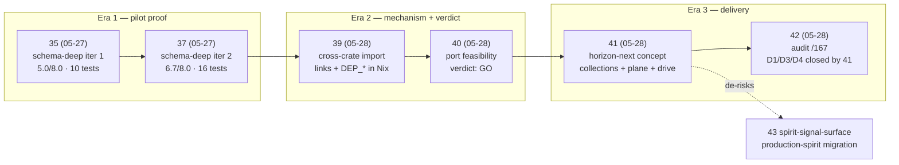
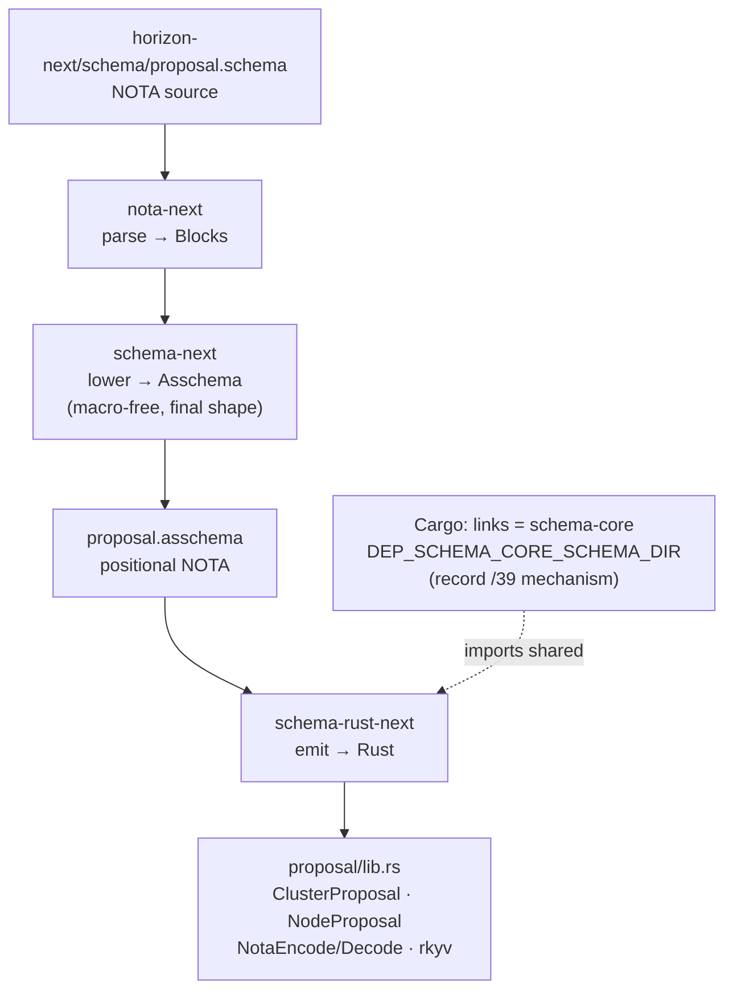
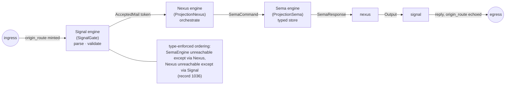
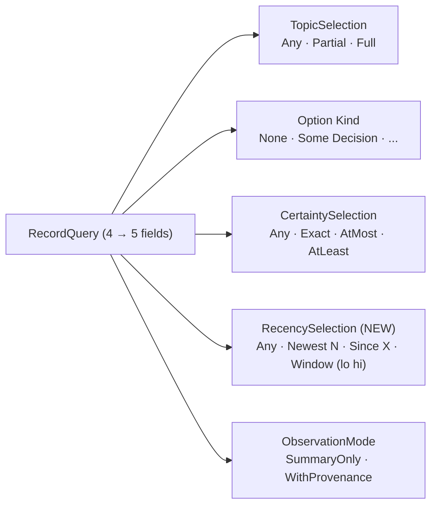
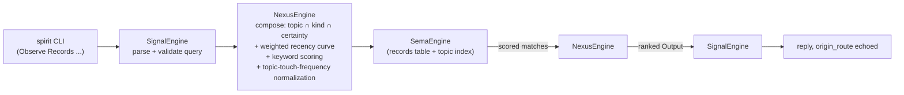

# 49 — Recent context: schema-arc + Spirit search

> **Status update 2026-05-30 (same-day):** The recency-filter
> direction in §"Spirit search — the next direction" was implemented
> and deployed within hours of this report landing. Production
> Spirit 0.3.0's `RecordQuery` is now five-field with
> `RecordedTimeSelection` having variants `Any` / `(Since (YYYY-MM-DD HH:MM:SS))` /
> `(Until ...)` / `(Between ...)` / `Recent`. The bare `Recent`
> variant returns the newest matching records **after**
> topic/kind/certainty filtering — quiet topics naturally reach
> farther back than active ones, which is the
> natural-recency-by-topic-touch-frequency idea (record 1251)
> emerging as a side-effect of filter-first then newest. The
> sketched `(Newest N)` / `(Window …)` variants were NOT adopted;
> psyche/operator chose timestamp-based `Since`/`Until`/`Between`
> + bare `Recent`. `ChangeCertainty` also landed (the nominate
> path closing /48 GAP 1). The Nexus-language adaptive search
> direction (weighted keyword + topic-touch-frequency, record 1251
> Low certainty) remains forward-looking — not yet implemented.
> Production witnesses: `signal-persona-spirit 1bb22635`,
> `persona-spirit c5a3eb9b`, `CriomOS-home cc6bb3d2`,
> `CriomOS 1cf0b747`, primary `skills 180e6f2b`. The
> §"Parallel surface in the operator lane" section below points
> to `/172` which was absorbed into
> `reports/system-operator/173-deep-context-maintenance-2026-05-30.md`
> the same day; read the section as redirected to `/173`.

*2026-05-30 system-designer. Consolidates the schema-deep → horizon-next arc
(reports 35/37/39/40/41/42, retired into this report after the landing-gate
check) and the recent intent surface that drove it. Documents Spirit search
filter-mixing — both the live four-field `RecordQuery` and the recency-and-
Nexus direction the psyche just opened (records 1247/1248/1250/1251/1252).
A presentation, not an audit — substance is in the linked commits and
permanent docs; this surface is the visual map.*

## In one diagram — the arc, ten days



Each step had a working witness (`nix flake check` green on the
named branch). The arc moves left-to-right from in-process pilot
to cross-component proof to a runnable horizon-next that
generates `ClusterProposal { nodes: BTreeMap<NodeName,
NodeProposal>, cache: Option<BinaryCache>, cluster_services:
Vec<ServiceName> }` end to end from a pure schema.

## What landed (commit witnesses)

| # | Topic | Branch / commit | Witness | Key intent |
|---|---|---|---|---|
| 35 | schema-deep pilot — 28 typed nouns, 9-actor topology | lojix `schema-deep` / `rnwxqrlzmrmm` | 10 tests + flake checks green | 883 (schema-deep authorized), 944 (per-repo INTENT) |
| 37 | NexusMailKeeper + sema-engine + Communicate + DatabaseMarker | lojix `schema-deep-iteration-2` / `twvkkpypztsr` | 16 tests + 3 new arch checks green | 963-970 (Nexus is the mail keeper), 971-974 (prototype-driven development) |
| 39 | Cross-crate schema import in Nix | schema-next `sopvwomuqltr`, schema-rust-next `srttqolmxsry`, NEW schema-core `nqkvlrrowqky` | 9 checks green inc. 3 cross-crate type-identity tests | 1009 (research-if-possible), 944 (per-repo INTENT) |
| 40 | Port feasibility — verdict GO, gate-1 = collections | (report only; no code) | — | 1024 (port directive), 883 (collections authorized in principle), 1000 (schema-at-heart) |
| 41 | Collections + horizon-next + three-engine drive | schema-next `f73274f6`, schema-rust-next `419db039`, horizon-next `1b64d1b` (NEW repo) on `collections-horizon-2026-05-28` | 12 checks green inc. `running-three-engine-chain`, `plane-surface-data-carrying`, `types-only-core-has-no-runtime-floor` | 1034 (collections), 1037/1038 (plane + origin route), 1054 (data-carrying Plane enum), 1060 (iterative deepening) |
| 42 | Audit of system-operator/167 — D1/D3/D4 closed | (report only) | — | 1048 (real Horizon datatypes), 1049 (show working, not marketing), 1030 (drive, not scaffold) |

## The pipeline that landed (horizon-next as the canonical example)



NOTA source (the collections form lands per record 1034 sigil + the
ASSchema model per 1116/1120/1122):

```
proposal {
  ClusterProposal {
    cluster_name: ClusterName,
    nodes: {NodeName: NodeProposal},
    cache: ?BinaryCache,
    cluster_services: [ServiceName],
  }
  NodeProposal { name: NodeName, kind: MajorNodeKind, features: [NodeFeature] }
}
```

Emitted Rust (an extract — full file is `schema/proposal/lib.rs`):

```rust
pub struct ClusterProposal {
    pub cluster_name: ClusterName,
    pub nodes: BTreeMap<NodeName, NodeProposal>,
    pub cache: Option<BinaryCache>,
    pub cluster_services: Vec<ServiceName>,
}
```

The cross-crate import (record /39) wires the shared types-only
`schema-core` module into every consumer — `Magnitude`,
`DatabaseMarker`, the plane envelopes — via Cargo's `links` and
the `DEP_<crate>_SCHEMA_DIR` env that schema-next's
`ImportResolver` consumes. No `cargo metadata` fallback was
needed; the simpler path works inside `nix flake check`.

## The three-engine runtime — Signal → Nexus → Sema



In horizon-next, `Plane::drive` threads the chain end-to-end:

- `horizon-next/src/schema/horizon.rs:874` — `Plane::drive`
- `horizon-next/src/lib.rs:133` — `impl SignalEngine for SignalGate`
- `horizon-next/src/lib.rs:168` — `impl NexusEngine for ProjectionNexus`
- `horizon-next/src/lib.rs:215` — `impl SemaEngine for ProjectionSema`

The `Plane` enum variants carry the actual messages (matched
directly per record 1054); the `origin_route` is the leading
tuple element of every variant, auto-minted at ingress (record
1038). The `running-three-engine-chain` flake check enforces
that drive actually runs — no dead scaffolding (record 1030).

## Recent intent surface — schema-driven-stack arc

| Records | Topic cluster | What they settled |
|---|---|---|
| 425-466, 874-877, 886 | schema language foundations (era 1) | namespace shape, header positions, no outer wrapper, root self-description |
| 881-883 | rust + schema-next architecture | no free functions; schema-deep authorization; vector support authorized |
| 944, 971-974, 980 | prototype-driven development | per-repo INTENT/ARCHITECTURE continuous manifestation; 8-component fullness; audit-against-fullness |
| 1000, 1028-1030, 1036-1039 | schema-at-heart + three-engine | schema is canonical truth; three engines must drive, not scaffold; origin route auto-minted on plane envelope |
| 1034, 1037, 1054, 1057, 1060, 1062 | plane + collections + iterative deepening | `Vec`/`Map`/`Optional` collections; data-carrying Plane variants; iterative deepening over one-shot generation; plane payload open question |
| 1048-1050 | Horizon shape | generate all Horizon datatypes from schema; show working, not marketing; runtime shape open |
| 1070, 1071, 1078-1090, 1095-1101 | schema-grammar refinements | positional Input/Output (never labeled); root struct known a priori; sigil grammar lives in schema-next layer; correction of over-capture |
| 1109-1132, 1147-1149 | macros-as-data + ASSchema-first | macros are data objects not parser code; ASSchema is canonical NOTA; surface sugar comes AFTER assembled target is locked; pipe-delimiter struct/enum declarations |
| 1184, 1216 | constraints + universal form | full constraints run on spirit-next with three engines from schema; universal `Name@{}` / `Name@[]` / `Name@()` |
| 1238, 1240, 1241, 1243-1246 | wire + daemon discipline | rkyv universal wire base; NOTA codec opt-in per consumer; daemon goes binary rkyv with no NOTA decoder; configuration as signal not CLI arg; multi-signal-interface daemons; assembled schema must be live NOTA artifact |

## Recent intent surface — intent-removal arc (report 48 carries the detail)

| Records | What they settled |
|---|---|
| 1191, 1192 | Soft-delete via certainty filter; `removalCandidates` becomes `(Exact Zero)` query |
| 1212-1215 | Iteration over the Zero-vs-None question — settled: Zero is a new variant on shared `Magnitude` |
| 1248 (mine, today) | Recency as a fifth `RecordQuery` field (filter mixing should reach four dimensions, not three) |
| 1249 (correction, today) | Zero declared physically LAST for rkyv discriminant stability; manual `Ord` for semantic-bottom |
| 1250, 1252 (operator-capture, today) | Production Spirit must support certainty mutation + Zero floor; production recency-with-topic search |
| 1251 (operator-capture, today, exploratory) | Search may grow toward weighted-keyword and adaptive-recency scoring, potentially as Nexus-language logic |

## Spirit search — how filter-mixing works today

The deployed `RecordQuery` (read from `signal-persona-spirit/src/lib.rs:436-481`)
is a four-positional record. Three of the four positions are
filters; the fourth selects detail level.

```
(Records (TopicSelection KindOption CertaintySelection ObservationMode))
```

| Position | Type | Variants in deployed Spirit 0.3.0 |
|---|---|---|
| Topic | `TopicSelection` | `(Any [])` · `(Partial [a b])` · `(Full [a b])` |
| Kind | `Option<Kind>` | `None` · `(Some Decision)` · `(Some Principle)` · `(Some Correction)` · `(Some Clarification)` · `(Some Constraint)` |
| Certainty | `CertaintySelection` | `Any` · `(Exact Magnitude)` · `(AtMost Magnitude)` · `(AtLeast Magnitude)` |
| Detail | `ObservationMode` | `SummaryOnly` · `WithProvenance` |

Filter mixing is already real — these compose multiplicatively in
a single query.

### Recipes that work today

```sh
# All decisions on schema at High or higher
spirit "(Observe (Records ((Partial [schema]) (Some Decision) (AtLeast High) SummaryOnly)))"

# Removal candidates (the soft-delete query) across all topics
spirit "(Observe (Records ((Any []) None (Exact Zero) WithProvenance)))"

# Records tagged both spirit AND search (intersection)
spirit "(Observe (Records ((Full [spirit search]) None Any WithProvenance)))"

# Identifier-range cheat for recency (today's only path)
spirit "(Observe (RecordIdentifiers ((Range (1240 1252)) WithProvenance)))"
```

The recency cheat (`Range`) does NOT compose with topic or
certainty — it lives on a different operation (`RecordIdentifiers`,
not `Records`). That is precisely the gap.

## Spirit search — the next direction

### Recency as a composable filter (records 1247/1248/1252)

The proposed wire shape grows `RecordQuery` from four positions to
five, with a `RecencySelection` mirroring `CertaintySelection`'s
shape:

```
(Records (TopicSelection KindOption CertaintySelection RecencySelection ObservationMode))
```



What this unlocks in one shell line:

```sh
# "Recent high-certainty decisions about schema-derived runtime"
spirit "(Observe (Records ((Partial [schema runtime]) (Some Decision) (AtLeast High) (Newest 20) WithProvenance)))"

# "Spirit-search records from the last 24 hours"
spirit "(Observe (Records ((Partial [spirit search]) None Any (Since (1240)) WithProvenance)))"
```

The daemon already stamps date-time on every record, so the
storage side has what `Since timestamp` needs. The likely
implementation is a `RecencySelection` enum in
`signal-persona-spirit` with the same shape pattern as
`CertaintySelection`, and a query-time filter pass after
topic/kind/certainty match.

### Beyond recency — Nexus-language adaptive search (record 1251)

Per the psyche this morning: *"some kind of semi-natural
algorithms for relative recency because it depends how often a
project is, the topic is touched … and even some kind of
weighing of certain keywords would be cool. We could do crazy
stuff like that in the engine. That's what the Nexus, I think
that's what the Nexus language is for, to create cool logic like
that."*

This frames a real architectural connection: **the three-engine
chain proven in horizon-next is the same shape Spirit search
would grow into when its logic graduates from RecordQuery-as-
filter to RecordQuery-as-Nexus-program.**



Examples of "cool logic" Nexus could host:

- **Adaptive recency** — same calendar window means different things
  for `spirit` (touched daily, "recent" = last week) vs `pi-harness`
  (touched monthly, "recent" = last quarter). Nexus normalizes
  recency against the topic's touch-frequency profile.
- **Keyword weighting** — `(KeywordWeight [(rkyv 3) (collections 2)])`
  scores records mentioning weighted terms in descriptions.
- **Composable scoring** — `score = certainty_weight * topic_score *
  recency_decay * keyword_match`; the Nexus expresses the
  scoring as data per the macros-as-data discipline (record
  1109/1116/1122), not as hand-rolled code per consumer.
- **Subscribed re-ranking** — a `Watch` that re-scores as new
  records land; the Nexus carries the live scoring state per
  subscription.

The Nexus engine is the right home because it sits between the
signal contract (the wire query) and the storage contract (the
records table) — that's where adaptive composition lives without
contaminating either contract. The current `removalCandidates =
Exact Zero` query is the simplest possible Nexus program; richer
Nexus programs are additive.

## What's open — carried forward

Schema-arc continuation:

- **D2 shared-floor crate** — defers until a second consumer
  exists (one component = no duplication yet). The mechanism
  (record /39 cross-crate import) is proven; the extraction
  triggers on demand.
- **Schema-derived migration of production `signal-persona-spirit`**
  — report 43 §"recommendations": the Group-1 structural fix
  for /168's findings 4 + 8. De-risked by /41; the natural next
  consumer of the stack.
- **Streaming-channel topology** for full lojix wire breadth (gate
  3 per /40); record /37 I-1.
- **Plane payload for distinct execution languages** (record 1062)
  — open psyche question carried in /41.
- **Schema upgrade traits** (record 950) — when the first schema
  diff arrives.
- **Daemons go binary** (records 1238, 1240, 1241, 1244) —
  configuration as signal not CLI arg; multi-signal-interface
  enumeration; no NOTA decoder in the daemon closure.

Spirit-search continuation:

- **Production implementation** of certainty mutation + `Zero`
  floor (record 1250).
- **Production recency-with-topic search** (record 1252).
- **Nexus-language search-logic** as Spirit's adaptive query
  layer (record 1251, exploratory).

Intent-removal continuation (carried in report 48):

- **Nominate write path** — today no operation lowers a record's
  certainty to `Zero`, so `removalCandidates` is permanently
  empty; only the irreversible hard `(Remove N)` is live.
- **Discriminant-stability constraint** into `sema` ARCHITECTURE
  per record 1249.

## Reports retired into this one

Per `skills/context-maintenance.md` landing-gate: substance must
have a permanent home before drop.

| Report | Substance carried by |
|---|---|
| 35 schema-deep-new-logics | This report §"What landed" + lojix `schema-deep` `rnwxqrlzmrmm` (commit IS the artifact) + INTENT.md §schema-driven-stack |
| 37 prototype-schema-deep-iteration-2 | This report §"What landed" + lojix `schema-deep-iteration-2` `twvkkpypztsr` + INTENT.md |
| 39 schema-cargo-cross-crate-import | This report §"The pipeline" diagram + schema-next/schema-rust-next/schema-core `cross-crate-schema-import` branches + INTENT.md |
| 40 horizon-lojix-schema-next-port-feasibility | This report §"In one diagram" verdict-row + record 1024 + gate-1 proven by /41 commits |
| 41 horizon-schema-pipeline-concept | This report §"The pipeline" + §"three-engine runtime" + schema-next `f73274f6` + schema-rust-next `419db039` + horizon-next `1b64d1b` |
| 42 horizon-167-intent-divergence-and-fixes | D1/D3/D4 closed by /41 (commits above); D2 deferred per §"What's open"; this report carries the verdict |

## Reports kept (separate topics)

- **34 mvp-and-sandbox-audit/** — active bead queue (production-
  realities track); referenced by /40.
- **43 spirit-signal-surface-168-review.md** — production-spirit
  migration recommendations; references /41 as the de-risking
  evidence and stays as the open recommendation surface.
- **44 cross-lane-context-maintenance-2026-05-28/** — the most
  recent full cross-lane ledger; retires when a newer full sweep
  reissues its handoffs.
- **48 intent-removal-implementation-audit-and-consolidation-2026-05-29.md**
  — separate intent-removal arc; final consolidation already
  done yesterday.

## Parallel surface in the operator lane

`reports/system-operator/172-system-operator-recent-context-and-spirit-query-surface-2026-05-30.md`
is the operator-lane companion to this report (also written
today, dab148a2). It covers the OPERATOR surface — deployed
Spirit state, Prometheus production base, speech runtime,
DJI-mic keepalive, Arca — and includes its own Spirit query-
surface section from the deployed-behavior angle. Two facts
worth surfacing from it that this report does not duplicate:

- **The installed production `spirit` still rejects `(Exact Zero)`** —
  Zero support is built (operator commit `ee61fefb` etc.) but
  not yet live in the local profile. This is the CriomOS-home
  lock /48 named, restated as user-observable behavior.
- **1214 is the earlier decisive Zero decision** (Maximum), with
  1215 (Medium, mine) carrying the later implementation-detail
  drift that 1249 corrects. The intent-removal lineage starts
  one record earlier than report 48 emphasized.

The two reports are complementary: schema-stack / search-direction
here, deployment / operator-tactical there.

## See also

- `INTENT.md` §"schema-driven stack" — the permanent landing of
  the schema-arc substrate.
- `/git/github.com/LiGoldragon/{horizon-next,schema-next,schema-rust-next,schema-core,lojix}/`
  — the commit witnesses.
- `skills/spirit-cli.md` §"Observe records" — the live four-field
  query shape this report extends.
- `skills/intent-log.md` — capture discipline.
- `skills/intent-maintenance.md` §"Removing a record — tombstone first"
  — the tombstone discipline these reports' retirements honor at
  the report-table level rather than the Spirit-record level.
- `signal-persona-spirit/src/lib.rs:436-481` — the wire-shape
  `RecordQuery` this report's recency proposal extends.
- Spirit records: 944, 1000, 1024, 1028-1030, 1034, 1037-1038,
  1048-1054, 1247, 1248, 1250, 1251, 1252.
