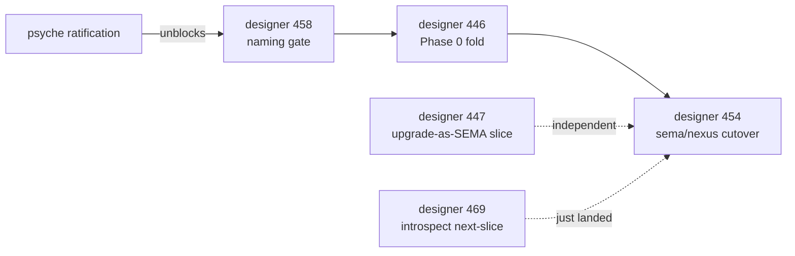

# 51.4 — Lane coordination + recent reports cross-lane audit

*Kind: cross-lane audit · Topics: lane-coordination, convergence-divergence,
handoff-gaps, stale-reports, designer-protocol-cadence · 2026-06-02 ·
system-designer lane*

## Frame

Read-only audit of all report directories under `reports/` for the window
2026-05-30 → 2026-06-02 inclusive. Goal: surface cross-lane patterns —
convergence (multiple lanes arriving at the same finding), divergence
(lanes contradicting each other), handoff gaps (designer reports naming
operator slices without corresponding pickup), stale reports needing
retirement under Spirit 1323, and lane-activity rhythm.

Sources reviewed: all reports under
`reports/{designer,system-designer,operator,system-operator,cloud-designer,cloud-operator,cluster-operator,nota-designer,second-designer,second-operator,third-designer,poet}/`
whose mtime falls in the window. Plus `jj log` queries against `primary`
main for per-lane commit cadence. The dispatcher inherits the
system-designer lane per `skills/role-lanes.md` §"Subagent dispatch
inherits the dispatcher's lane"; this sub-report writes only into the
parent meta-report directory.

## Per-lane recent activity

The window's productivity is concentrated in three lanes — designer +
operator + system-operator — with system-designer and cloud-designer
adding a single substantive contribution each. Other lanes silent.

### designer — 24 reports in window (445-470)

The bulk of the schema-stack era's design pressure. Newest first:

| # | Date | Topic |
|---|---|---|
| 470 | 06-02 | Top-6 psyche backlog with context + code per item |
| 469 | 06-02 | Introspect component design (Spirit 1398 — trace destination + log policy + queryable intel) |
| 468 | 06-02 | Developed interfaces — spirit pilot expansion + persona + orchestrate (Spirit 1395) |
| 467 | 06-02 | Name-only trace research + prototype (Spirit 1394) |
| 466 | 06-01 | Triad engine honesty situation (meta — 0-frame, 1-schema-honesty, 2-actor-model, 3-overview) |
| 465 | 06-01 | Recent decision landscape |
| 463 | 06-01 | Operator trace implementation audit + intent gaps |
| 461 | 06-01 | Context maintenance (meta — 9 sub-reports including engine-trait, spirit-fold, b53f4fc2, bead-cleanup, operator-271, proof-of-usage, single-field-wrapper-and-upgrade-sema) |
| 458 | 06-01 | Spirit-triad naming gate decision |
| 457 | 06-01 | Operator-day audit + bead-sweep continuation |
| 456 | 06-01 | Retire stale design remnants |
| 455 | 06-01 | b53f4fc2 design-implementation-fidelity audit |
| 452 | 06-01 | Rkyv enum-wrapping audit |
| 450/451 | 06-01 | Operator 271 closed-claims verification + falsifiable specs |
| 449 | 06-01 | Bead-staleness audit (209→77 open, 71% retired) |
| 447 | 06-01 | Upgrade-as-SEMA design |
| 448 | 06-01 | Single-field wrapper audit |
| 445 | 06-01 | Next-stack audit |
| 446 | 06-01 | Next-stack porting research (meta) |

### operator — 11 reports in window (271-281)

Mostly implementation closeouts + context maintenance:

| # | Date | Topic |
|---|---|---|
| 281 | 06-02 | Generated interface logic with macros (engine-trait emission live) |
| 280 | 06-01 | Spirit-next live trace + triad situation |
| 279 | 06-01 | Actionable patterns from designer 463 |
| 278 | 06-01 | Gap vision + subagent implementation brief |
| 277 | 06-01 | Spirit-next testing-trace implementation closeout |
| 276 | 06-01 | Schema-thread context maintenance |
| 275 | 06-01 | Schema-runtime instrumentation log socket prototype |
| 274 | 06-01 | Live-architecture-witness research |
| 273 | 06-01 | Spirit-next b53f4fc2 triad runtime audit |
| 272 | 06-01 | Bead-staleness audit implementation (meta — verification, meta-decision, implementation, postmortem) |
| 271 | 06-01 | Context maintenance — current state |

Pre-window stale candidates that operator's 271 sweep classified
"closed but not retired" still on disk (see §"Stale reports for
retirement" below): 260, 262, 263, 264, 265-meta, 266.

### system-operator — 7 reports in window

| # | Date | Topic |
|---|---|---|
| 180 | 06-01 | Pi 0.78 update record |
| 179 | 06-01 | Pi compaction fix + local AI toolkit prefetch |
| 178 | 06-01 | Context maintenance + recent audit (meta — 0-frame, 1-context-maintenance, 2-recent-audit, 3-synthesis-and-actions) |
| 177 | 06-01 | Spirit topic-depth-query implementation |
| 176 | 06-01 | DJI mic keepalive alternative solutions research |
| 175 | 06-01 | DJI mic keepalive profile-churn + deploy fix |
| 174 | 05-31 | Browser-use main Chrome session research |

No system-operator activity after 18:47 on 2026-06-01 — a roughly
15-hour silent stretch into the audit moment.

### system-designer — 1 substantive contribution (this audit, /51)

The /50 cross-lane sweep was the previous landing (commit `xvzuwr`
2026-05-30 19:19); this /51 audit is the next. No other
system-designer report in window apart from `0-frame-and-method.md`
of this directory.

### cloud-designer — 1 commit in window

`wywruo` 2026-06-01 16:05 — land report 17 agentic video editing
research with memory-1356 principle. Did not look at the report;
crosses workspace boundary by addressing video-editing memory
patterns, not schema-stack work.

### cloud-operator, cluster-operator, nota-designer, second-designer, second-operator, third-designer, poet

All silent in window. Most-recent activity in those lanes:

| Lane | Most recent | Days quiet |
|---|---|---|
| cloud-operator | 2026-05-28 — pi-harness-abort-investigation meta-report | 4-5 days |
| cluster-operator | 2026-05-21 — bird-zeus-local-update-authority-design | 12 days |
| nota-designer | (empty directory) | retirement candidate |
| second-designer | 2026-05-25 — upgrade-mechanism soup-to-nuts | 8 days |
| second-operator | (empty directory) | retirement candidate |
| third-designer | (empty directory) | retirement candidate |
| poet | (empty directory) | retirement candidate |

Per `/50/5` §"Pending psyche-attention queue", the four empty lanes
have been carrying retirement candidacy for two sweeps; no psyche
call has landed.

## Cross-lane convergence patterns

The window contains multiple instances of independent lanes arriving
at the same finding — strong evidence that the work is on the right
track and the discipline of three-way-convergence-as-correctness-signal
(landed in `skills/designer.md` per /461) is producing real signal.

### Convergence 1 — Engine trait architecture, schema-emitted

Three lanes independently:

- **designer 453 + 454 + 461 (sub-report 1-engine-trait-architecture)**
  authored the SignalEngine / NexusEngine / SemaEngine trait pattern
  with `triage` / `decide+execute` / `apply+observe` shape.
- **operator 273 + 277 + 280 + 281** implemented and verified the
  same trait surface, with operator 281 (2026-06-02, the freshest
  report) demonstrating `schema-rust-next` actually emits the trait
  surface, default wrapper methods, and trace hook surfaces, and
  spirit-next's actors implement the generated traits.
- **designer 466 (meta — schema-honesty audit + actor-model audit)**
  ratifies that the interface layer is ~75% schema-honest at
  architectural-load level (1456 generated lines from a 44-line
  schema), with three concentrated leakage zones identified.

**Landing**: `skills/component-triad.md` §"Runtime triad engine traits —
Signal triage / Nexus computation / SEMA durable" (landed per /461.8
applied-migrations log). The pattern is now workspace-discipline.

**Convergence verdict**: clean three-way convergence with operator
witness + designer synthesis + designer ratification of the witness.
No divergence.

### Convergence 2 — Trace as trait-first, event-second

Spirit 1394 (Correction High, 2026-06-02) named the shape: trace
records only the **name** of the object being activated; the
macro-generated interface already has the name, so trace should not
carry rich payload snapshots per boundary.

- **designer 467** prototyped the name-only-trace shape on worktree
  `designer-name-only-trace-2026-06-02`. Schema-rust-next bfacb96
  already emits the name-only shape; the prototype repins
  spirit-next, shrinks `src/trace.rs` from 407 to ~180 lines, and
  rewrites the Layer 2 witness test. Net diff: 105 insertions / 462
  deletions across 9 files.
- **operator 281** (2026-06-02) confirms the generated trait surface
  carries `trace_signal_admitted`, `trace_signal_rejected`,
  `trace_signal_triaged`, `trace_signal_replied`, parallel for
  Nexus + SEMA, with default-no-op + override hooks.
- **operator 279** extracted "Pattern 1: Trace is Trait-First,
  Event-Second" from designer 463.

**Convergence verdict**: tight design-implementation loop — psyche
captures intent in Spirit, designer prototypes a worktree, operator
witnesses the integration. Recommend ratification and integration
of the worktree branch as next operator action.

### Convergence 3 — Context maintenance, three lanes in parallel

On 2026-06-01 three lanes ran context-maintenance sweeps in parallel:

- **designer 461** (meta — 9 sub-reports + overview). Applied 3
  migrations to skills + confirmed 4 earlier-session landings.
  Retired 5 designer reports. Authority: designer-lane skill +
  architecture edits.
- **operator 271** (single report) — classified the schema-stack
  state into closed-since-earlier-gap + still-unaddressed,
  retired 4 operator reports per Spirit 1323.
- **system-operator 178** (meta — 4 sub-reports). Migrated DJI
  keepalive boundary, retired report 166, cleaned 18 stale
  browser-use profile copies, tracked Spirit-next production-copy
  acceptance gate as bead `primary-jew3`.

The three sweeps independently landed structural cleanups in
their own lanes without stepping on each other — the per-lane
sweep discipline from `/50/5` §"successor pattern" continues
to operate as designed.

**Workspace pattern**: every active lane self-swept in response
to the day's substrate churn, with no cross-lane interference
and minimal coordination overhead. This validates the per-lane
authority model.

### Convergence 4 — Spirit 1389 slim-Nexus-output pattern

- **designer 466** (3-overview) identifies that `Output::RecordsObserved`
  violates Spirit 1389 — Nexus output carries full `Vec<Entry>` instead
  of slim acknowledgement + client query-for-specifics.
- **designer 468** (developed interfaces) proposes the cross-cutting
  fix: every component splits read into `Observe` (filter-driven) +
  `Lookup` (handle-driven) + `Count` (aggregate). This is a
  candidate workspace pattern.
- **designer 469** (introspect component design) realizes the pattern
  in the introspect Nexus design: `NexusOutput` carries side-channel
  variants (`Fanout` / `Summarize` / `Drop`) plus SEMA writes.

**Convergence verdict**: a design pattern reaching workspace-wide
crystallization across three designer reports in 24 hours.
Recommendation: when Spirit 1389 substance settles, land in
`skills/component-triad.md` as §"Slim Nexus output — handle-driven
specifics retrieval".

### Convergence 5 — "Closed reports are not history" (Spirit 1323)

- **designer 456** retired 5 candidates + 1 opportunistic; nexus.rs
  70% smaller.
- **operator 271** retired 4 operator reports (267-270) per Spirit
  1323 verbatim.
- **system-operator 178** retired report 166 + cleaned profile copies
  + named the rule explicitly: "closed reports are not retained
  merely as rationale or history".
- **system-designer 50** retired the prior 44 ledger.

**Convergence verdict**: Spirit 1323's Correction Maximum is being
honored workspace-wide. The discipline reaches every active lane.

### Divergence — no major contradictions found

No instance of two lanes contradicting each other was surfaced. The
closest to a divergence is a *naming-style* drift:

- **designer 466.3** uses "slim Nexus output" as the principle name.
- **designer 469** uses "Nexus side-channel" as the candidate-2
  ratification name for the same idea (Nexus carries non-SEMA
  variants).

These are two facets of one principle, not a contradiction —
worth a naming-consolidation note when the pattern lands in
`skills/component-triad.md`.

## Handoff gaps — designer-named slices not yet picked up

Multiple designer reports in the window explicitly name "operator
first action" or "first slice" but no operator report shows pickup.

### Gap 1 — Designer 447 upgrade-as-SEMA (NOT picked up)

Designer 447 (2026-06-01) §"Operator-bead-shaped first action"
specifies a 7-step first slice:

1. Fork schema-next → schema-daemon worktree on `upgrade-as-sema`.
2. Author `SchemaEdit` enum.
3. Author `SchemaSemaInput` / `SchemaSemaOutput` enums in schema source.
4. Implement `Asschema::apply_edit(&SchemaEdit) → Result<Asschema, SchemaError>`.
5. Implement `MigrationEmitter::emit(old, new, spec)`.
6. Witness test: round-trip `(ChangeFieldType Entry topic (Vec Topic) WrapSingleton)`.
7. Defer daemon binary + build orchestration + cutover.

Estimated scope: one operator-week. **Search across all operator
reports in window: no pickup found.** Operator 271 lists upgrade-as-SEMA
under "Still Unaddressed §7" with note "Design is fresh in designer 447;
implementation is not started." Designer 461 (sub-report 7) confirms
"awaits operator pickup."

**Ownership**: operator lane. **Status**: gap; no pickup as of 06-02
09:36. **Recommendation**: surface to psyche as next-bead candidate.
Designer 447 names the bead explicitly; operator could open it
without further design.

### Gap 2 — Designer 446 §"Phase 0 fold" (spirit-next → spirit)

Designer 446 (2026-06-01) §"Stage 1 — phase 0 fold" recommends
folding `spirit-next` into the real `spirit` repo as the first
porting move. **Gated** on designer 458's spirit-triad naming
gate decision (Option A — current `signal-spirit` / `owner-signal-spirit`
convention vs Option B — proposed `meta-signal-spirit` rename).

- **designer 458** recommends Option A (current convention)
  per `/50/5` and `/461.8` pending psyche-attention queue. Deferring
  Option B as a separate fleet-wide pass.
- **operator 271** §"Still Unaddressed §8" names "Spirit fold and
  broader porting" with the same gate.
- **psyche**: **decision pending**.

**Ownership**: psyche ratification → then operator pickup.
**Status**: gap on psyche side; once Option A is ratified, designer
446's Stage 1 unblocks. **Recommendation**: surface 458 as the
single most psyche-actionable item in the workspace today.

### Gap 3 — Designer 454 trait surface cutover (sema/nexus/persona-spirit)

Designer 454 (2026-06-01) refined the engine-trait pipeline. The
substance landed at `skills/component-triad.md` §"Runtime triad
engine traits" per /461.8.

- **spirit-next**: canonical implementation. Live (operator 281 witness).
- **sema, nexus, persona-spirit**: cutover not yet started.

**Operator 271** does not name sema/nexus/persona-spirit cutover
explicitly; the only mention is in designer 446's porting waves.

**Ownership**: operator lane (per the existing porting playbook
discipline). **Status**: gap; waiting on designer 446 Phase 0 (which
itself waits on designer 458 ratification). Net: 2-deep gap chain.

### Gap 4 — Designer 469 introspect component (next-slice scope)

Designer 469 (2026-06-02 09:36) recommends next-slice scope:
minimal introspect daemon implementing `IngestTraceEvent` +
`QueryTraceEvents` on schema-next, spirit-next configures push under
`testing-trace`, CLI round-trips. Greenfield migration recommended.

This is too fresh (less than 4 hours old at audit time) for "gap
status" — it's just landed. Track it as the freshest designer-named
slice awaiting operator pickup; revisit at the next audit.

### Gap 5 — Designer 451 falsifiable specs (8 claims, branches pushed)

Designer 451 (2026-06-01) wrote falsifiable specs for the 8 open
claims from operator 271. Branches pushed to remotes (per /461.8).
"Claims retire claim-by-claim as each turns green" — i.e., these
are pickup-by-pickup, not one big chunk.

**Status**: in-progress pickup mechanism; not a gap per se.

### Summary of gap chain



The naming gate is the single load-bearing decision blocking
the longest chain. Designer 447 and 469 are independent of the
chain — operator could pick up either without the gate landing.

## Stale reports for retirement (Spirit 1323)

Per Spirit 1323 (Correction Maximum): closed reports should not
be kept merely for rationale or history; migrate live patterns
to architecture/skills, then retire.

The dispatch frame named 5 known stale candidates from previous
audits. Verifying each by reading the head section:

### operator 262 — total architecture core macro artifacts (2026-05-30)

The substance: macro-library, MacroLibraryArtifact, core.asschema,
schemas/builtin-macros.macro-library, repins of schema-rust-next +
spirit-next. Operator 271 marks the macro-library pattern as
"closed in `schema-next` commit `99078b20`" — substance LANDED in
live code + repo INTENT + ARCHITECTURE. The 262 report is the
implementation-narrative-witness for that landing.

**Verdict**: STALE. Substance lives in schema-next ARCHITECTURE
and operator 271's classification. Retire per Spirit 1323.
**Migration target**: nothing additional needed; substance is
in code. Operator-lane retirement.

### operator 263 — unimplemented gap audit (2026-05-31)

The substance: 8-item gap list after core macro artifacts.
Cross-checked against operator 271 §"Still Unaddressed" (8 items):

| 263 gap | 271 §Still Unaddressed |
|---|---|
| Macro-table nouns still hand-written | matches §6 schema-emitted variant projections (related but framed differently) |
| Declarative expansion via rendered text | not in 271's list (likely closed in macro-node implementation per operator 258 / 261) |
| Strict schema syntax not fully enforced | closed by operator 266 + per 271 §4 |
| Shared support nouns emitted locally | matches 271 §4 schema-core extraction |
| Schema diff/upgrade only a trait surface | matches 271 §7 upgrade-as-SEMA |
| Daemon binary-config only | matches some of 271's daemon work |
| Macro conflict handling | not in 271's list (may be deferred) |
| Self-hosting loop not closed | matches upgrade-as-SEMA realization (447) |

Most items have moved to 271's still-unaddressed list (fresher
framing) OR have closed.

**Verdict**: STALE. Substance is superseded by operator 271's
§"Still Unaddressed" + the upgrade-as-SEMA design (designer 447).
Retire per Spirit 1323. **Migration target**: nothing additional;
271 is the active surface. Operator-lane retirement.

### operator 264 — asschema typed data rkyv sema NOTA presentation (2026-05-31)

The substance: re-presentation of the post-root-shape-correction
stack with the Asschema/.asschema/.asschema.rkyv/AsschemaStore split.
Spirit anchors 1267-1280. The pattern landed in code + 271 §"Closed
Since" §5 explicitly names "Asschema as typed data with NOTA, rkyv,
and SEMA projection" as closed with the four-noun split (Asschema /
AsschemaArtifact / AsschemaStore / RustEmitter).

**Verdict**: STALE. Substance lives in schema-next code + repo
ARCHITECTURE + 271's classification. Retire per Spirit 1323.
**Migration target**: nothing additional. Operator-lane retirement.

### operator 265 — programmable NOTA structural macro vision (2026-05-31, meta)

This is a meta-report directory with 0-frame, 1-nota-layer-programmable-syntax,
2-schema-asschema-consumer-layer, 3-spirit-runtime-layer, 4-overview-and-gaps.
Vision document.

The substance: NOTA-as-programmable-substrate vision. Spirit 1109/1116/1120/1122
anchors. The "macros are data not parser code" principle.

The vision has substantially manifested — operator 261 implemented
macro-node stack; operator 281 confirms `schema-rust-next` now emits
interface logic. Some forward elements still live (eventual macro-table
nouns as schema-derived).

**Verdict**: PARTIALLY STALE. The vision is realized at the substrate
level; forward elements (full macro-table-as-data) are tracked in
271 §"Still Unaddressed" §1. **Migration target**: the realized
substrate is in code + 271. The forward "macros as schema-derived nouns"
elements should land as a single bead, not a kept report. Recommend
operator-lane retirement with a "carry-forward" bead. OR keep under
§3a design-rationale guard if the rejected alternatives in the
vision are load-bearing rationale — verify by quick read of
4-overview-and-gaps.

### operator 266 — strict schema syntax e2e closure (2026-05-31)

The substance: closure of designer 1294 + the surrounding thread on
strict schema syntax (homogeneous bracket vectors, variant signatures,
removal of compatibility branch). 271 §"Closed Since" §4 explicitly
names this as closed.

**Verdict**: STALE. Substance lives in schema-next code + repo INTENT
+ 271's classification. Retire per Spirit 1323. **Migration target**:
nothing additional. Operator-lane retirement.

### Additional stale candidate found in audit — operator 260

Operator 260 (pre-canonical-era agglomeration, 2026-05-30) carries
38 operator reports' worth of arc summary. Per /50/5 it was kept
as the canonical surface for the 210-247 era. Reading the head:
it's a comprehensive era-summary done under explicit psyche override.

**Verdict**: KEEP for now. It's the only surface that carries the
pre-canonical era arc; retiring it would lose substance that hasn't
fully migrated. Migration target: portions of 260 could land in
schema-next's per-repo INTENT.md and ARCHITECTURE.md once the era
is fully behind us. Defer retirement.

### Retirement summary

```
reports/operator/262-total-architecture-core-macro-artifacts-2026-05-30.md     RETIRE
reports/operator/263-unimplemented-gap-audit-2026-05-31.md                     RETIRE
reports/operator/264-asschema-typed-data-rkyv-sema-nota-presentation-2026-05-31.md RETIRE
reports/operator/265-programmable-nota-structural-macro-vision-2026-05-31/     RETIRE (with carry-forward bead)
reports/operator/266-strict-schema-syntax-e2e-closure-2026-05-31.md            RETIRE
reports/operator/260-pre-canonical-era-agglomeration-2026-05-30.md             KEEP (era surface)
```

Five reports recommended for retirement under operator-lane authority.
All have substance already in code + per-repo ARCHITECTURE/INTENT + the
271 classification surface. None require additional migration to
skills or architecture-editor.

## Lane-activity rhythm — designer protocol vs other lanes

Per AGENTS.md hard override: "the **designer protocol** (psyche
2026-05-21) is the exception: the prime designer runs at full capacity
with parallel subagent workflows by default, until disabled or reduced."

### Designer cadence — at-full-capacity

- 2026-06-01: 17 distinct designer commits (445-461 era), with two
  meta-report directories (446, 461) each carrying sub-agent dispatch.
  Sub-agent counts: 461 has 9 sub-reports (8 named topics + frame);
  446 has 5 sub-reports.
- 2026-06-02: 4 designer reports landed (467, 468, 469, 470) by
  09:41 — all substantive.

This is full-capacity output consistent with the designer protocol.
At-full-capacity cadence is operating as designed.

### Operator cadence — sustained

- 2026-06-01: 11 operator commits (271-280 era). Sustained pace.
- 2026-06-02: 1 commit (281 generated interface logic with macros)
  by 08:31.

Operator is keeping pace with designer authoring at roughly half
the report rate but with more code witnesses per report. The
operator → designer ratio is healthy.

### System-operator cadence — episodic

- 2026-06-01: 7 commits between 10:03 and 18:47.
- 2026-06-02: silent at audit time. Last commit ~15h ago.

The lane focus is Pi / DJI / browser-use / Spirit deployment;
work arrives in bursts when a deployment surface needs attention.
Not the designer-protocol pattern; episodic-by-design.

### System-designer cadence — sweep-driven

- 2026-05-30 → 2026-06-02: 1 substantive sweep (commit `xrtmsq`
  2026-06-01 16:00 retiring sweep reports under Spirit 1323) +
  this audit (51).

This lane operates on sweep cadence rather than continuous output.
The 49 / 50 / 51 trio is roughly 3-4 days between substantive
landings. Healthy for cross-lane synthesis.

### Cloud-designer cadence — single-commit days

- 2026-06-01: 1 commit (`wywruo` agentic video editing research).
- Other days in window: silent.

Episodic, single-topic-per-active-day. Not a concern.

### Silent lanes — long stretches

Cloud-operator: 4-5 days silent.
Cluster-operator: 12 days silent.
Empty lanes (nota-designer, second-designer, second-operator, third-designer,
poet): unchanged since /50 surfaced retirement candidacy.

### Cadence verdict

The designer protocol is operating at full capacity per AGENTS.md.
Operator is sustaining the matching implementation pace. System-operator
is episodic-by-design. System-designer is sweep-driven by design.
Cloud lanes are quiet but not concerning. The four empty lanes have
been candidacy-flagged for two sweeps without psyche ratification.

## Recommendations

Concrete next moves, ordered by load-bearing impact:

### 1. Surface designer 458 naming-gate as single load-bearing psyche-call

The naming-gate decision (Option A current convention vs Option B
meta-signal rename) blocks the longest chain in the workspace:
designer 446 Phase 0 fold → designer 454 sema/nexus/persona-spirit
cutover. Recommendation Option A per designer 458 + /50/5. Surface
to psyche as the single most psyche-actionable item.

### 2. Open designer 447 upgrade-as-SEMA first-slice bead

Designer 447 §"Operator-bead-shaped first action" specifies a
1-operator-week slice; no implementation has started. Independent
of the naming-gate chain. Operator could open this bead immediately
and begin the schema-daemon worktree.

### 3. Operator-lane stale-report retirement (5 reports)

Operator retires reports 262, 263, 264, 265-meta, 266 under Spirit
1323. Single commit; substance already in code + 271 classification.
The 265-meta retirement should carry forward the "macros as
schema-derived nouns" forward element as a single bead.

### 4. Land Spirit 1389 slim-Nexus-output pattern in skill

Three designer reports (466, 468, 469) independently surfaced the
slim-Nexus-output pattern. When Spirit 1389 substance settles, land
in `skills/component-triad.md` as §"Slim Nexus output — handle-driven
specifics retrieval". Designer-lane action. Likely belongs in the
next designer context-maintenance sweep.

### 5. Ratify designer 467 name-only trace prototype worktree

The worktree `designer-name-only-trace-2026-06-02` is pushed; 39
tests pass; net -357 lines for the same Layer 2 witness strength.
Operator integration is the next step. Independent of naming-gate.

### 6. Defer no-action lane-retirements

Four empty lanes (nota-designer, second-designer, second-operator,
third-designer, poet) have been carrying retirement candidacy across
two sweeps. /50/5 flagged psyche call required. No new substance to
add; continue carrying. Surface again if a third sweep passes
without ratification.

### 7. Schedule next cross-lane sweep — system-designer 52 cadence target

This /51 audit is the cross-lane synthesis surface for the 2026-05-30 →
2026-06-02 window. The next system-designer cross-lane sweep should
target the 2026-06-03 → 2026-06-05 window to catch any new convergence
patterns from designer 467-470's substrate landings.

## Cross-references

- `reports/designer/461-context-maintenance-2026-06-01/8-overview.md` — designer-lane context-maintenance landing-evidence ledger.
- `reports/operator/271-context-maintenance-current-state-2026-06-01.md` — operator-lane classification + 8-item "Still Unaddressed".
- `reports/system-operator/178-context-maintenance-and-recent-audit-2026-06-01/3-synthesis-and-actions.md` — system-operator-lane synthesis.
- `reports/system-designer/50-cross-lane-context-maintenance-2026-05-30/5-overview.md` — prior cross-lane sweep this audit succeeds.
- `reports/designer/447-upgrade-as-sema-design-2026-06-01.md` §"Operator-bead-shaped first action" — the open-handoff slice.
- `reports/designer/458-spirit-triad-naming-gate-decision-2026-06-01.md` — the load-bearing psyche call.
- `reports/operator/281-generated-interface-logic-with-macros-2026-06-02.md` — the most recent operator witness, demonstrating the engine-trait architecture is live.
- `reports/designer/466-triad-engine-honesty-situation-2026-06-01/3-overview.md` — interface-honest / behavior-partially-filled verdict.
- `skills/component-triad.md` §"Runtime triad engine traits" — the landed pattern.
- `skills/designer.md` §"Three-way convergence as correctness signal" — the discipline this audit validates.
- Spirit records: 1308-1314 (upgrade-as-SEMA), 1323 (closed-reports-not-history), 1326-1336 (engine-trait architecture), 1357 (Maximum, triad-engine architecture), 1387-1389 (interface/behavior honesty), 1394 (name-only trace), 1395 (developed interfaces), 1398 (introspect component).
