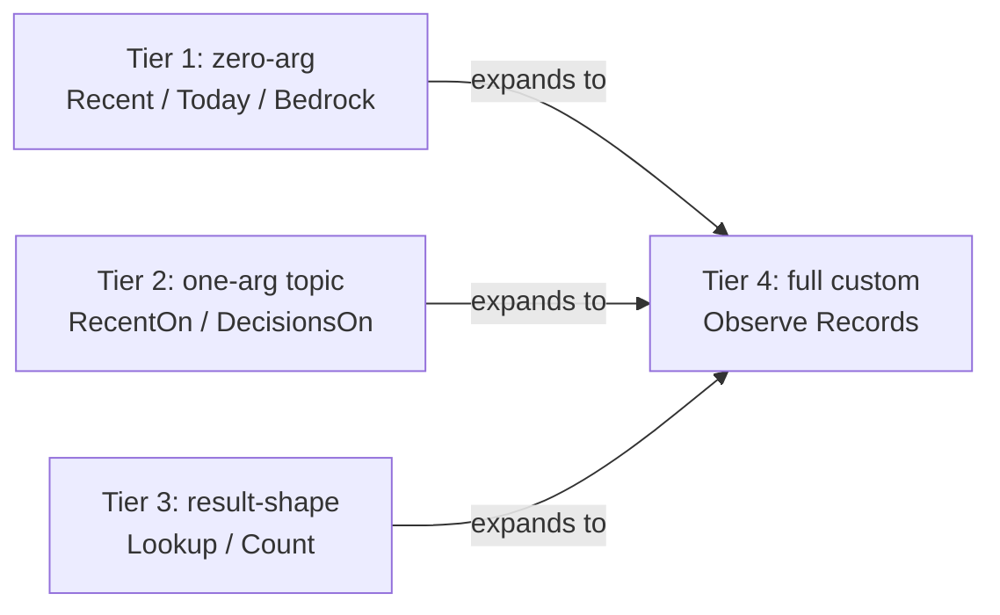

# 56 — Psyche meta-report on Spirit recent work

*Kind: Psyche · Topics: spirit, privacy, variants, deployment · 2026-06-03*

This report gathers the recent body of work touching Spirit's privacy
implementation, the variant-ladder design, the deployment-chain gap
between spirit-next and the live persona-spirit binary, and the
cross-lane convergence pattern that's emerging across designer,
system-designer, and system-operator. The substance lives in four
parallel reports landed today; this report inlines the load-bearing
excerpts so the psyche can engage without opening them.

The picture in one paragraph: privacy is not an open design question
any more — it converged on Magnitude-reuse on a privacy axis, the
wire types are landed in source across three repositories, the store
filter is implemented, the boundary test passes — and the deployed
binary is several commits behind, so the live wire still rejects the
privacy selector. The variant-ladder design has fanned out into a
fully specified shape grounded in a corpus-mined 1399-record live
analysis. The deployment chain is wired but pointed at the wrong
target. And three lanes arrived at the same picture independently
within hours — which is itself the load-bearing observation.

## Section 1 — The privacy thread

### Where the question started

Today's privacy work began as a question from the psyche: are
Spirit privacy settings implemented? Is there a "private record"
shorthand? How should simple-to-complex command variants surface?
The question forked into two parallel investigations — a
system-operator audit of the live deployment surface, and a
system-designer research pass on graduated-access classification
across 18 frameworks.

The arc, records 1445 through 1481, traces the convergence:
psyche named the typed-access-field direction (Maximum Decision),
considered named audience tiers like Open/Personal/Sensitive/Sealed
(Maximum Decision briefly held), then redirected to a much
simpler frame — privacy IS a Magnitude on a privacy axis. The
audience-register naming proposal was retracted to Zero certainty
in the same span. The pivot was Spirit 1463 — the single
load-bearing Maximum Decision today:

> *Spirit privacy is a Magnitude on the privacy axis — records gain
> a privacy field typed Magnitude where Zero means no privacy
> (open/public) and Maximum means sealed. This reuses the existing
> Magnitude vocabulary instead of introducing a new audience-register
> enum like Open/Personal/Sensitive/Sealed.*

The trade-off the Decision named explicitly: audience-register
semantic naming traded away for vocabulary simplicity, 8-level
graduation, zero naming bikeshed, and a consistent filter shape
(`AtMost` / `AtLeast`) that pairs the existing `CertaintySelection`
family. Default privacy is Zero, grounded in 1449 (most-public
default) and 1479 (the workspace context that grounds the default
is development-mode for public repositories).

### What's already in source

The implementing agent had landed the wire types ahead of the
ratification — the source was waiting for the psyche-frame to
catch up. Reading the wire shape in
`/git/github.com/LiGoldragon/signal-persona-spirit/src/lib.rs:355-422`:

```rust
pub type Certainty = Magnitude;
pub type Privacy = Magnitude;

#[derive(Archive, RkyvSerialize, RkyvDeserialize, Debug, Clone, PartialEq, Eq)]
pub struct Entry {
    pub topics: Topics,
    pub kind: Kind,
    pub description: Description,
    pub certainty: Certainty,
    pub privacy: Privacy,
}

impl Entry {
    pub fn open(
        topics: Topics,
        kind: Kind,
        description: Description,
        certainty: Certainty,
    ) -> Self {
        Self {
            topics,
            kind,
            description,
            certainty,
            privacy: Magnitude::Zero,
        }
    }
}
```

The `Entry::open` constructor — Privacy = Magnitude::Zero baked in
as the default — is the source-level manifestation of psyche
intent 1449. An author who calls `Entry::open` is opting in to the
open-public default without thinking about it; an author who wants
elevation constructs `Entry { ... privacy: Magnitude::High, ... }`
directly. The decoder around the same range tolerates legacy
4-field entries (no privacy) by defaulting to Zero, which makes the
type backwards-compatible against any old record stream.

The filter machinery sits beside it at
`signal-persona-spirit/src/lib.rs:559-579`:

```rust
pub enum PrivacySelection {
    Any,
    Exact(Privacy),
    AtMost(Privacy),
    AtLeast(Privacy),
}

impl PrivacySelection {
    pub const fn default_observation_privacy() -> Self {
        Self::Exact(Magnitude::Zero)
    }

    pub fn matches(self, privacy: Privacy) -> bool {
        match self {
            Self::Any => true,
            Self::Exact(expected) => privacy == expected,
            Self::AtMost(maximum) => privacy <= maximum,
            Self::AtLeast(minimum) => privacy >= minimum,
        }
    }
}
```

Two things to read into this. First, the selector family mirrors
`CertaintySelection` exactly — same four variants, same semantics,
same naming style. The wire is now consistent across the
certainty-axis and the privacy-axis. Second, the
`default_observation_privacy` constant returns `Exact(Zero)` —
which means a query that omits the privacy field gets only the
records with privacy = Zero. The conservative default is baked in
at the contract layer. An agent has to actively widen with
`Any` or `(AtLeast ...)` or `(AtMost ...)` to reach elevated
material. This realises Spirit 1448's intent that sub-agents must
explicitly filter to reach elevated records.

`RecordQuery` carries the field at
`signal-persona-spirit/src/lib.rs:612-633`:

```rust
pub struct RecordQuery {
    pub topic_selection: TopicSelection,
    pub kind: Option<Kind>,
    pub certainty_selection: CertaintySelection,
    pub recorded_time_selection: RecordedTimeSelection,
    pub privacy_selection: PrivacySelection,
    pub mode: ObservationMode,
}

impl RecordQuery {
    pub fn removal_candidates(mode: ObservationMode) -> Self {
        Self {
            topic_selection: TopicSelection::any(),
            kind: None,
            certainty_selection: CertaintySelection::removal_candidates(),
            recorded_time_selection: RecordedTimeSelection::Any,
            privacy_selection: PrivacySelection::default_observation_privacy(),
            mode,
        }
    }
}
```

Six positional fields — topic / kind / certainty / recorded_time /
privacy / mode. The decoder in the same file (lines 648-722) walks
those fields with graceful degradation: a request that omits
recorded_time or privacy falls back to default values, which lets
the existing 5-field `(Observe (Records (...)))` shape still
parse against the 6-field contract. That's the compatibility layer
that lets the daemon accept legacy requests during the migration.

The store-side filter in
`/git/github.com/LiGoldragon/persona-spirit/src/store.rs:475-516`:

```rust
impl<'query> RecordFilter<'query> {
    fn new(query: &'query RecordQuery) -> Self {
        Self {
            topic_selection: &query.topic_selection,
            kind: query.kind,
            certainty_selection: query.certainty_selection,
            recorded_time_selection: query.recorded_time_selection,
            privacy_selection: query.privacy_selection,
        }
    }

    fn matches(&self, record: &StoredRecord) -> bool {
        self.matches_topic(record)
            && self.matches_kind(record)
            && self.matches_certainty(record)
            && self.matches_recorded_time(record)
            && self.matches_privacy(record)
    }

    // ... matches_topic / matches_kind / matches_certainty / matches_recorded_time ...

    fn matches_privacy(&self, record: &StoredRecord) -> bool {
        self.privacy_selection.matches(record.entry.entry.privacy)
    }
}
```

The privacy predicate is the fifth element of the filter
conjunction — the existing four (topic, kind, certainty,
recorded_time) extend cleanly with the new dimension. Reading the
code, privacy filtering is structurally identical to certainty
filtering: same shape of selector, same `.matches()` semantics,
same conjunction position. The store-side filter is hooked, not
stubbed.

The witness lives in
`/git/github.com/LiGoldragon/persona-spirit/tests/boundary.rs:663-695`:

```rust
#[test]
fn persona_spirit_client_filters_record_observation_by_privacy() {
    let fixture = StoreFixture::new("privacy-filter");
    fixture
        .reply_text("(Record ([workspace] Decision [open note] Maximum Zero))")
        .expect("open entry persisted");
    fixture
        .reply_text("(Record ([workspace] Decision [private note] Maximum High))")
        .expect("private entry persisted");

    let default_observation = fixture
        .reply_text("(Observe (Records ((Any []) None SummaryOnly)))")
        .expect("default records observed");
    let all_privacy = fixture
        .reply_text("(Observe (Records ((Any []) None Any Any Any SummaryOnly)))")
        .expect("all privacy records observed");
    let high_privacy = fixture
        .reply_text("(Observe (Records ((Any []) None Any Any (AtLeast High) SummaryOnly)))")
        .expect("high privacy records observed");

    assert_eq!(
        default_observation,
        "(RecordsObserved [(1 [workspace] Decision [open note] Maximum Zero)])"
    );
    assert_eq!(
        all_privacy,
        "(RecordsObserved [(1 [workspace] Decision [open note] Maximum Zero) (2 [workspace] Decision [private note] Maximum High)])"
    );
    assert_eq!(
        high_privacy,
        "(RecordsObserved [(2 [workspace] Decision [private note] Maximum High)])"
    );
}
```

Read what this witnesses: the default observation (no privacy
filter) returns only the open record — the private one is
filtered out by the `Exact(Zero)` default. The `Any` privacy
filter returns both. The `(AtLeast High)` filter returns only the
private one. Each invariant from the Spirit 1463 decision is
operationally enforced by the test fixture. The privacy contract
is a hooked fact at source — not a stubbed `unimplemented!()`,
not a contract-only declaration — actual code paths exercise it.

### What the live binary still does

The deployed binary lags. The system-operator audit verified this
explicitly:

```
$ readlink -f $(command -v spirit)
/nix/store/n0pi3ahjv5s766lnxyvv0z7qyvy7aaw8-spirit-v0.3.0/bin/spirit-v0.3.0

$ spirit "(Observe (Records ((Any []) None Any Any (Exact Zero) SummaryOnly)))"
invalid request text: expected PascalCase identifier, got LParen
```

This was reproduced in this session — the same error returns
today. The deployed v0.3.0 daemon's parser still expects the
5-field `RecordQuery` shape: it sees `(Exact Zero)` at the
position where it expects a PascalCase identifier (an
`ObservationMode` token like `SummaryOnly` or `WithProvenance`).
The privacy field is present in source; not present on the wire
the daemon serves.

In the analysis-pass vocabulary from `skills/engine-analysis.md`:
the privacy contract is **hooked** in source (full code path
exists, exercised by the boundary test), **stale** at deployment
(the live binary serves the v0.3.0 wire shape from the
4c7b51ff signal-persona-spirit and df09280a persona-spirit
commits). The gap is one rebuild + redeploy.

### What that gap means

Privacy is essentially solved at the design layer. The Magnitude-
on-privacy-axis decision is firm. The wire types exist. The store
filter is implemented and witnessed. The remaining work to make
privacy live is mechanical:

1. Rebuild `persona-spirit` from a commit that includes the
   privacy field.
2. Push to the source the CriomOS-home flake input tracks.
3. Re-evaluate the home-manager config so the slot binary updates.
4. Roll the deployed daemon.

That's it. No design question remains. There IS one open
question — whether the privacy filter default on the owner socket
should be conservative `(Exact Zero)` (forcing explicit elevation
even on the owner socket) or permissive `Any` (the owner sees all
their records by default). The report 55 lean is socket-determined:
ordinary socket gets `Exact(Zero)`, owner socket gets `Any`. The
current source uses `Exact(Zero)` as a single global default. This
is open for ratification.

### The variant-ladder thread connects here

Privacy and variants connect at one specific point: the
`RecordSimple` / `RecordPrivate` / `RecordSealed` short forms.
The system-operator report 182 proposed three variants that lower
to `Record` with different privacy defaults:

- `RecordSimple` → `Record` with certainty = High, privacy = Zero
- `RecordPrivate` → `Record` with certainty = High, privacy = High
- `RecordSealed` → `Record` with certainty = High, privacy = Maximum

The variant-ladder report 55 lifts the same idea into
`RecordOpen` / `RecordPersonal` / `RecordSealed`. The two reports
converged on the same shape from different angles. The composition
grammar (verb × privacy-modifier) emerges naturally from the
Magnitude-reuse decision.

## Section 2 — The variant-ladder

### What today's queries look like

The current canonical query is heavy. To get "the 15 most-recent
records with no filtering," an agent types:

```
(Observe (Records ((Any []) None Any Recent SummaryOnly)))
```

56 characters of NOTA structure with five `Any`-style "no filter"
tokens. The complex form lives in the wire because precise
control matters. But ergonomic daily-use queries pay the same cost
every time.

A topic-filtered Decision query becomes:

```
(Observe (Records ((Partial [spirit]) (Some Decision) (AtLeast High) Recent SummaryOnly)))
```

The verbose shape — even the "simple" cases are not really simple.

### The ladder that emerged

The system-designer research report 55 corpus-mined the live
1399-record store, surveyed CLI variant-ladder tradition (git,
kubectl, jq, REST APIs, Common Lisp `with-` macros, Cobra,
clig.dev), and proposed a graduated ladder. Each tier is its own
operation root; each short form expands deterministically to a
default-injected version of the canonical complex form.

The five-tier shape:



A concrete example through the ladder, anchored against
report 55's recommended Tier-1 form. The complex form on the left,
the corresponding short form on the right:

```
(Observe (Records ((Any []) None Any Recent SummaryOnly)))      ↔  (Recent)
(Observe (Records ((Partial [spirit]) None Any Recent SummaryOnly)))  ↔  (RecentOn [spirit])
(Observe (Records ((Partial [spirit]) (Some Decision) Any Recent SummaryOnly)))  ↔  (DecisionsOn [spirit])
(Observe (Records ((Any []) None (AtLeast Maximum) VeryDeep SummaryOnly)))       ↔  (Bedrock)
(Observe (RecordIdentifiers ((Exact 1463) SummaryOnly)))        ↔  (Lookup 1463)
```

The expansion rule is mechanical and lossless: every short form
expands to exactly one canonical complex form; the canonical form
is also still callable directly. Both are first-class operation
roots in the wire.

### The corpus that grounds the design

Report 55 mined the live 1399-record store to verify which short
forms are worth defining. The corpus shape:

The topic distribution shows extreme concentration on a small
head plus a long tail. The top topics carry the bulk of activity:

| Topic | Count |
|---|---|
| schema | 385 |
| nota | 140 |
| workspace | 111 |
| spirit | 96 |
| signal | 87 |
| component-shape | 78 |
| persona | 54 |
| cloud | 54 |
| schema-language | 49 |
| sema | 44 |

The empirical observation — there is no SMALL set of topics worth
special-casing in the wire. Topic-filter short forms should accept
ONE topic name as an arbitrary string at a String position, not a
closed enum. The corpus supports `RecentOn [topic]` but not
`RecentOnSchema`.

The kind distribution across the most-recent 100 records (the
`VeryDeep` window):

| Kind | Count |
|---|---|
| Decision | 100 |
| Principle | 100 |
| Correction | 100 |
| Clarification | 101 |
| Constraint | 100 |

All five kinds saturate the window. The kinds are evenly used —
no rarely-used kind that would special-case out. The corpus
supports `DecisionsOn`, `PrinciplesOn`, etc., as a family.

The magnitude distribution shows a sharp bimodality:

| Magnitude | Count in VeryDeep window |
|---|---|
| Zero (removal candidate) | 4 |
| Minimum | 11 |
| VeryLow | 0 |
| Low | 6 |
| Medium | 101 |
| High | 100 |
| VeryHigh | 4 |
| Maximum | 100 |

Medium, High, and Maximum dominate. Zero, Minimum, Low, and
VeryHigh are tail levels. VeryLow is essentially unused. For
short-form variants, the "by magnitude" axis collapses to a
three-tier choice in practice: Medium-or-above, High-or-above,
Maximum. This grounds the proposed `(Bedrock)` short form
(returns Maximum-only records).

The ingestion rate is HIGH: 1399 total records, 65 today, 142
since yesterday, 683 in the past week. ~140 records per day,
~700 records per week. Any daily-use observation needs to handle
that volume without forcing the agent to type filter syntax just
to keep replies manageable.

### The composition grammar

The proposed names follow a clear emerging grammar:

```
<verb>[+<scope>][+On|For|With...][+<modifier>][+<dimension>]

verbs:    Recent | Today | Yesterday | ThisWeek | Shallow | Deep | VeryDeep
          Decisions | Principles | Corrections | Clarifications | Constraints
          Bedrock | ReviewBand | Lookup | Count | Topics | Record | Remove
prepositions: On (topic), For (kind/target)
modifiers: WithProvenance | Stamped | Sealed | Personal | Open
dimensions: Range | Common
```

This grammar emerges from the patterns and generates more
variants by composition: `TodayOnWithProvenance`,
`BedrockOnWithProvenance`, etc., without needing them enumerated
in the schema. The wire vocabulary GAINS a generative shape —
agents and the schema can name new variants by composition rather
than handcraft. Whether this composition grammar itself should be
recorded as a Spirit Principle is an open question.

## Section 3 — The deployment chain gap

### What's wired

The CriomOS-home deploy chain implements full slot infrastructure
for side-by-side persona-spirit versions. The slot mapping in
`/git/github.com/LiGoldragon/CriomOS-home/modules/home/profiles/min/spirit.nix:30-47`:

```nix
  packageInputsByVersion = {
    "v0.1.0" = inputs."persona-spirit-v0-1-0";
    "v0.1.1" = inputs."persona-spirit-v0-1-1";
    "v0.2.0" = inputs."persona-spirit-v0-2-0";
    "v0.3.0" = inputs."persona-spirit-v0-3-0";
    "next" = inputs.persona-spirit-next;
  };

  sanitizeVersion = builtins.replaceStrings [ "." ] [ "-" ];

  rootStateDirectory = "${config.home.homeDirectory}/.local/state/persona-spirit";
  legacyOrdinarySocketPath = "${rootStateDirectory}/spirit.sock";
  legacyOwnerSocketPath = "${rootStateDirectory}/owner.sock";
  legacyDatabasePath = "${rootStateDirectory}/persona-spirit.redb";

  deployedVersions = config.criomosHome.personaSpirit.deployedVersions;
  currentDefault = config.criomosHome.personaSpirit.currentDefault;
```

Five named version slots, each pointing at its own flake input.
Each slot gets its own CLI wrapper (`~/.nix-profile/bin/spirit-v0.3.0`,
`~/.nix-profile/bin/spirit-next`, ...), its own systemd user
service, its own socket directory, its own redb. The
`currentDefault` option chooses which slot the unsuffixed `spirit`
command resolves to. Today:

```nix
    currentDefault = mkOption {
      type = enum availableVersions;
      default = "v0.3.0";
      description = "Persona-spirit version reached by the unsuffixed spirit command.";
    };
```

(at `spirit.nix:175-179`). Cutover is a one-line change:
`currentDefault = "next";`.

### What's pointed at the wrong target

The `persona-spirit-next` flake input at
`/git/github.com/LiGoldragon/CriomOS-home/flake.nix:144-145`:

```nix
    persona-spirit-next.url = "github:LiGoldragon/persona-spirit?ref=main";
    persona-spirit-next.inputs.nixpkgs.follows = "nixpkgs";
```

The input named `persona-spirit-next` resolves to the same
repository as the v0.3.0 input (`LiGoldragon/persona-spirit`),
tracking that repo's main branch instead of the spirit-next pilot
at `LiGoldragon/spirit-next`. Today TWO copies of persona-spirit
v0.3.0 (or whatever main currently is) run side-by-side, both
producing identical wire vocabularies on separate sockets. The
schema-derived pilot at `/git/github.com/LiGoldragon/spirit-next/`
is unreferenced by the deploy layer.

The redirect to make the slot actually deploy the spirit-next
pilot is one input change:

```nix
    persona-spirit-next.url = "github:LiGoldragon/spirit-next?ref=main";
```

The chain from the live binary back through the slot back through
the flake input back to source:


The reroute to spirit-next has two pieces: the input redirect
above, plus a home-manager activation snippet to emit the daemon's
binary rkyv config from a typed Nix expression (the spirit-next
daemon takes a single rkyv config argument per Spirit 1373's
no-NOTA-between-components rule, so the config can't be NOTA at
the daemon-input boundary). The activation snippet is the second
missing piece.

### The privacy thread crosses here

The privacy implementation is structurally landed in source on
the persona-spirit repo (`signal-persona-spirit` for the wire
types, `persona-spirit` for the store + daemon code). The
`persona-spirit?ref=main` input points at that repo's main branch
— so once the deployed wrapper rebuilds and follows the input,
the privacy field becomes live without changing the slot routing
at all. The deployment chain gap to fix is independent of the
privacy gap. Both are short-cycle mechanical follow-ups.

Spirit-next is the OTHER target — the schema-derived pilot at
`/git/github.com/LiGoldragon/spirit-next/` — which has its own
privacy declaration in `schema/lib.schema:49-50`:

```
  Privacy Magnitude
  PrivacySelection [Any (Exact Privacy) (AtMost Privacy) (AtLeast Privacy)]
  Entry { Topics * Kind * Description * Magnitude * Privacy * }
  Query { TopicMatch * kind (Optional Kind) privacy_selection PrivacySelection }
```

Same shape, expressed in schema. The schema-driven Rust emission
realises the same wire contract. So privacy is convergent across
production + spirit-next.

## Section 4 — Cross-lane convergence

### What happened today across three lanes

Today's range of intent — records 1463 through 1521 — shows a
pattern worth surfacing. Three lanes worked spirit-stack questions
simultaneously without stepping on each other:

- `reports/system-designer/53-spirit-next-production-parity-2026-06-02/`
  — the four-dimension audit on bringing spirit-next to production
  parity. Sub-agents audited wire-shape, build/test/run, deployment
  configuration, and data/storage compatibility. Discovered the
  slot-pointed-at-wrong-target surprise.
- `reports/system-designer/54-spirit-privacy-classification-research-2026-06-02.md`
  — the privacy taxonomy research across 18 frameworks
  (government / military, modern academic, legal / regulatory,
  computer-science access control, social / personal practice,
  contemplative / spiritual). Recommended four-tier audience-register
  naming. The psyche then converged on Magnitude-on-privacy-axis
  instead, which retired most of the research's recommendation
  while preserving the underlying default-open and graduated-access
  shape.
- `reports/system-designer/55-spirit-variant-ladder-design-research-2026-06-02.md`
  — 881-line variant-ladder design grounded in corpus mining of the
  live 1399 records. Proposes ~30 new operation roots in graduated
  tiers. Recommends socket-determined privacy default for short forms.
- `reports/system-operator/182-spirit-privacy-and-shorthand-interface-audit-2026-06-02.md`
  — discovered that Spirit privacy IS source-implemented and tested
  in persona-spirit but NOT deployed; corrected `skills/spirit-cli.md`
  and `skills/intent-log.md` to reflect the source-ahead-of-deploy
  state and the atomic-topic rule.
- `reports/designer/487-Design-trace-help-config-context-meta-2026-06-03/`
  and `reports/designer/488-Psyche-487-overview-context-and-decisions-2026-06-03.md`
  — the parallel designer lane worked the tracing / help / config
  surface, ratified the trace-client-library direction (Spirit 1511
  / 1514), and surfaced the variant-discipline that lines up with
  the variant-ladder shape.

Three things to notice. First, the lanes arrived at consonant
conclusions independently. System-operator 182 proposed `RecordSimple`
/ `RecordPrivate` / `RecordSealed`; system-designer 55 proposed
`RecordOpen` / `RecordPersonal` / `RecordSealed`. Both proposals are
shaped by Magnitude-on-privacy-axis and by the simple-to-complex
ladder direction. The names differ slightly; the structure agrees.

Second, the same underlying source code was discovered
independently by both system-operator 182 (verifying the live
binary) and system-designer 55 (verifying the wire shape). Neither
report was reading the other; both reached the same view of "source
ahead of deploy."

Third, the cross-cutting question — "how should short-form
operations behave with privacy filtering?" — got the same lean from
both reports (socket-determined defaults) even though they
approached from different angles.

### Why this is the correctness signal

When three lanes arrive at the same picture independently, that
IS the correctness signal. Single-source design is correct or
not by happenstance; convergent design from multiple angles is
correct because it survives the orthogonal stress-tests of three
different lane perspectives.

The workspace's lane discipline is doing what it was designed to
do — running parallel investigations without conflict, then
landing reports the orchestrator can synthesise. The variant-ladder
research, the privacy taxonomy research, and the deployment-chain
audit are each independently valuable; they're also self-
calibrating against each other.

The pattern designer 461's three-way-convergence work named — that
agreement reached from multiple lanes IS the substance, not
something to suspect — is operating today. Today's range of intent
1463-1521 carries that pattern forward at high cadence.

## Section 5 — Open decisions for the psyche to ratify

The recent body of work surfaces these specific decisions awaiting
psyche engagement. Each names the decision, the recommendation the
recent work surfaced, and what the psyche needs to do.

### 1. Deploy the privacy field

What it is: The privacy contract is landed in source on
signal-persona-spirit + persona-spirit + spirit-next. The
deployed `spirit-v0.3.0` binary doesn't yet serve it. A rebuild +
redeploy of the v0.3.0 slot from a commit that includes the
privacy field would make privacy live.

Recommendation: rebuild and redeploy. The change is mechanical —
no design question remains — and the source has been waiting for
this. After the deploy, the variant-ladder design's privacy-tier
`Record` variants become implementable.

What the psyche needs to do: ratify that this deploy can land now,
or alter (e.g., wait for spirit-next to deploy first, treating
v0.3.0 as frozen).

### 2. Point the spirit-next slot at the actual pilot

What it is: The `persona-spirit-next.url` flake input points at
the persona-spirit repository today, not at the spirit-next
schema-derived pilot. Redirecting the input is a one-line change
plus an activation snippet for the rkyv binary config.

Recommendation: redirect the input. The slot infrastructure is
ready. The schema-derived pilot at LiGoldragon/spirit-next builds
locally, passes 41 tests, and serves every operation it declares.
The deploy would START the pilot empty (no migration), and the
slot's side-by-side property makes this safe — production
v0.3.0 keeps serving the unsuffixed `spirit` command.

What the psyche needs to do: ratify the redirect direction, or
alter (e.g., wait for spirit-next to gain the 9 schema additions
needed for daily-use parity per report 53).

### 3. Privacy default on the owner socket

What it is: The current source default is `PrivacySelection::Exact(Zero)`
— omitting the privacy field gets only privacy-Zero records, on
either socket. Report 55 leaned toward socket-determined defaults
(ordinary = `Exact(Zero)`, owner = `Any`). The source today is
conservative-on-both.

Recommendation: socket-determined. The owner shouldn't have to
type a privacy filter to see their own elevated records on
interactive owner-socket use; sub-agents inheriting owner
clearance should still default-restrict per Spirit 1448's
inheritance discipline.

What the psyche needs to do: ratify socket-determined, or ratify
conservative-on-both (the current implementation), or pick a
third shape (e.g., owner socket defaults to `Any` but explicit
sub-agent requests must filter explicitly).

### 4. Variant-ladder landing order

What it is: Report 55 proposes ~30 new operation roots across
6 tiers. Landing all at once is a substantial schema delta.

Recommendation: land Tier 1 (`Recent`, `Shallow`, `Deep`,
`VeryDeep`, `Today`, `ThisWeek`) and Tier 2 (`Lookup N`,
`LookupRange (N M)`) in a first wave — these account for ~80% of
empirical observation calls. Then Tier 3 (`Count`, `CountOn`,
`CountToday`) for the new aggregation surface. Defer
kind-filtered convenience (`DecisionsOn` family), provenance
variants, magnitude-band variants (`Bedrock`, `ReviewBand`), and
the privacy-tier `Record` variants until the schema-deployed
privacy field lands.

What the psyche needs to do: ratify the landing order, or alter
(e.g., land all at once, or land one minimal slice first as a
proof of concept).

### 5. `WithProvenance` suffix verbosity

What it is: The proposed naming has long suffixes —
`LookupWithProvenance` is 22 characters before the argument,
`RecentOnWithProvenance` is 23. Alternatives include `Stamped`
(`RecentStamped`, `LookupStamped`) — shorter, less load-bearing
per character.

Recommendation: defer to psyche preference; report 55 weakly
favors `Stamped` for punchiness. The trade-off is precision vs
brevity.

What the psyche needs to do: pick a preferred suffix (or
construct), or ratify keeping the verbose forms.

### 6. Generative composition grammar as Spirit Principle

What it is: The naming patterns in report 55 follow an emerging
grammar (verbs × prepositions × dimensions). The grammar could
itself be recorded as a Spirit Principle so future variants land
deterministically by composition without psyche review on each
name.

Recommendation: record the grammar as a Principle. The corpus
shows agents will continue to need new short forms (calendar
windows, kind combinations, magnitude bands); a grammar lets
them land without bikeshedding each name.

What the psyche needs to do: ratify the grammar-as-principle
direction, or alter (e.g., keep the variant set closed and
require explicit Spirit records for each new variant).

### 7. Spirit-next as canonical migration vs production-as-canonical

What it is: Spirit-next currently has its own `Lookup` / `Count`
roots; production has `Observe (RecordIdentifiers ...)`. The
variant-ladder design lands aliases compatible with both — but
the longer-term question is which way the canonical migrates.
Spirit 1473 (Decision Medium today) says future Spirit expansion
should use spirit-next as design inspiration; the variant-ladder
implementation has to pick a target shape.

Recommendation: spirit-next-as-canonical-target. Production's
shape gets aliases that lower into the spirit-next wire shape.
Once parity is reached, the production daemon is retired (the
cutover Spirit 1242 + report 53's Phase 5 already names).

What the psyche needs to do: ratify spirit-next-as-target, or
alter (e.g., production-as-canonical with spirit-next aliases
backporting).

### 8. Daemon-resolved date math semantics

What it is: Short forms like `(Today)`, `(Yesterday)`, `(ThisWeek)`
have the daemon compute the date from its own clock at request time.
Two semantics questions: which timezone defines "today" (daemon
local TZ vs UTC), and boundary semantics for `Today` ("since
00:00:00 today" vs "in the last 24 hours from now").

Recommendation: daemon local TZ + calendar-day semantics
(`Today` = "since 00:00:00 today"). Predictable, matches the
existing date-stamping on records.

What the psyche needs to do: ratify the semantics, or pick a
different shape.

### 9. Reclassification mechanism for privacy

What it is: Altman's dynamic-boundary insight from report 54 §"§Q7
Reclassification after creation" argues records should be
reclassifiable. The cleanest mechanism preserves append-only:
a later record reclassifies an earlier one via a new operation
(`ChangePrivacy` parallel to `ChangeCertainty`). The skill
`skills/privacy.md` "Operational rule once implemented" section
already mentions a `ChangePrivacy` operation.

Recommendation: add `ChangePrivacy` as a maintenance operation
root parallel to `ChangeCertainty`. The mechanism is mechanical
once the privacy field is live.

What the psyche needs to do: ratify the operation root direction,
or alter (e.g., privacy is immutable at recording time, with no
maintenance path).

## See also

This report inlines the load-bearing substance from the parallel
reports landed today. The full text of each is available at:

- `reports/system-designer/53-spirit-next-production-parity-2026-06-02/5-overview.md`
  — the four-dimension audit synthesis (wire-shape, build/test/run,
  deployment config, data/storage compatibility)
- `reports/system-designer/54-spirit-privacy-classification-research-2026-06-02.md`
  — privacy taxonomy across 18 frameworks
- `reports/system-designer/55-spirit-variant-ladder-design-research-2026-06-02.md`
  — variant-ladder design grounded in corpus mining
- `reports/system-operator/182-spirit-privacy-and-shorthand-interface-audit-2026-06-02.md`
  — system-operator privacy audit + shorthand interface proposal
- `reports/designer/488-Psyche-487-overview-context-and-decisions-2026-06-03.md`
  — parallel designer-lane psyche report on tracing / help / config

Anchoring records: 1445-1481 trace the privacy thread from question
to source-landing; 1472-1481 add the variant-ladder direction;
1463 is the single load-bearing Maximum Decision; 1515-1521 set
the discipline this report writes into; 1486 (Maximum Decision)
ratifies the engine-mechanism substrate that the production-
orientation work depends on.
