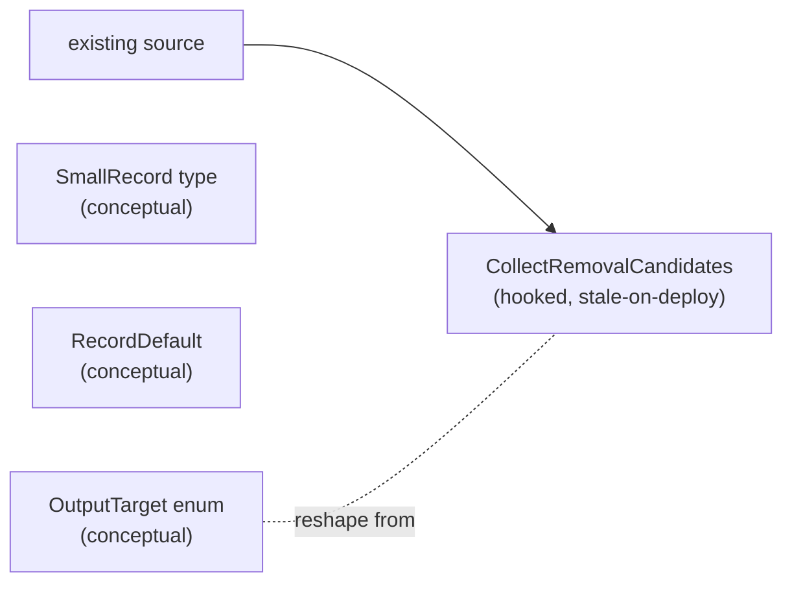
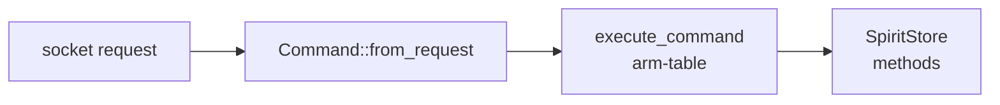

# 58 — Spirit engine direction (psyche report)

Kind: psyche
Topics: spirit, variants, collect, defaults, deployment, direction
Date: 2026-06-03

## Intent Anchors

[Spirit gains an explicit CollectRemovalCandidates operation as a
Signal root. It collects all records currently at Zero certainty (the
removal-candidate marker per the existing supersession protocol) and
emits their summary form to a configurable output target. Separates
the discovery / extraction concern from the destruction concern in
Remove — gives agents a discrete step to archive or inspect candidates
before any irreversible action.] (Decision High, today)

[Operations that extract or emit content from Spirit accept a
customizable output-target enum as the final field in the request
shape. Variants include Stdout, Stderr, and File with a path payload.
Not an error channel — Stderr is one option among normal outputs.
Keeps the wire interface uniform across extraction operations.]
(Decision High, today)

[Spirit defines a small-record data type carrying the core
load-bearing fields — identifier, topics, kind, description summary,
magnitude, daemon-stamped date and time. The variant-ladder short
forms and CollectRemovalCandidates emit the small record; archiving
and downstream tools consume it. Reduces wire weight; matches the
natural reading shape an agent or human wants.] (Decision High, today)

[Spirit gains a RecordDefault short-form recording operation taking
only fields agents commonly customize — topics, kind, description,
magnitude — with defaults injected for the rest (privacy at Zero per
the dev-mode public-repo grounding, daemon-stamped date and time,
plus any other rarely-customized field). Record remains the canonical
full-fidelity operation; RecordDefault is the daily-use shortcut.]
(Decision High, today)

[Spirit operations should support a simpler-to-more-complex variant
ladder — short forms with summary defaults for normal operations,
complex forms with full metadata for custom operations.] (Decision
High, today — the parent direction)

[Spirit privacy is a Magnitude on the privacy axis — records gain a
privacy field typed Magnitude where Zero means no privacy
(open/public) and Maximum means sealed. This reuses the existing
Magnitude vocabulary instead of introducing a new audience-register
enum like Open/Personal/Sensitive/Sealed.] (Decision Maximum,
yesterday — the upstream)

[The workspace context that grounds Spirit's most-public default is
development-mode for public repositories — collaborative work on
shared open-source software where most intent captures inform future
agents and contributors.] (Clarification High, yesterday)

## Opening — what the psyche is engaging with

Today's directive arrived as four bracket-quoted Decisions sitting
inside one broader variant-ladder principle. Read literally, the
direction says: build four new Spirit operations — `CollectRemovalCandidates`,
a configurable `OutputTarget`, a `SmallRecord` data shape, and a
`RecordDefault` short-form record — that pull apart what is being
captured, where output goes, and which defaults are convenient. Read
in context, the directive lands into a stack where one of those four
operations is **already in source today** in a slightly different
shape, the privacy field landed in source weeks ago but is not yet
deployed, and the variant ladder has been worked out empirically
against a 1399-record live corpus. The work is mostly **reshape**
plus **two new pieces** plus **deploy** — not de-novo construction.

The pivotal finding worth knowing before reading further: a verbatim
query against the live binary this session returned *"cannot route
command-line request: unknown request head: CollectRemovalCandidates"*,
yet the same operation is fully implemented in source — typed in the
schema, declared on the wire, dispatched in the actor table, and
exercised by two boundary tests that pass green. The deployed binary
is several commits behind. The slice's true shape is **reshape an
existing operation, add two small new pieces, and close the deploy
gap that has been open for two days**. Everything else — the
operator vision's seven phases, the open decisions in plain terms,
the variant-ladder Tier-1 sketch — flows from that reframe.

## The four threads, in narrative

Four threads have woven together since the privacy work began
yesterday. Each thread carries its own state on the hooked /
contract-only / stale axis, and each needs the psyche's eye to know
where it stands before the next move.

### Thread 1 — Privacy as a Magnitude on the privacy axis

Yesterday's most load-bearing intent capture — the privacy direction
— converged on Magnitude reuse on the privacy axis after a brief
detour through named audience-tier vocabulary. The trade the
Decision named explicitly: audience-register semantic naming traded
away for vocabulary simplicity, 8-level graduation, zero naming
bikeshed, and a filter shape (`AtMost` / `AtLeast`) that pairs the
existing `CertaintySelection` family. Default privacy is Zero,
grounded in the dev-mode public-repo Clarification.

The wire types landed in source the same day. At
`/git/github.com/LiGoldragon/signal-persona-spirit/src/lib.rs:375-402`,
the `Entry` type carries five positional fields with the privacy
field at the end, and an `Entry::open` four-field constructor bakes
the default:

```rust
pub type Certainty = Magnitude;
pub type Privacy = Magnitude;

#[derive(Archive, RkyvSerialize, RkyvDeserialize, Debug, Clone, PartialEq, Eq)]
pub struct Entry {
    pub topics: Topics,
    pub kind: Kind,
    pub description: Description,
    pub certainty: Certainty,
    pub privacy: Privacy,
}

impl Entry {
    pub fn open(
        topics: Topics,
        kind: Kind,
        description: Description,
        certainty: Certainty,
    ) -> Self {
        Self {
            topics,
            kind,
            description,
            certainty,
            privacy: Magnitude::Zero,
        }
    }
}
```

`Entry::open` is the in-process API every author calling
`Entry::open` is opting in to the open-public default without
thinking about it; an author who wants elevation constructs the full
`Entry` directly. The decoder around the same range tolerates legacy
four-field entries by defaulting privacy to Zero, which makes the
type backwards-compatible against any old record stream.

The filter machinery sits beside it at
`signal-persona-spirit/src/lib.rs:571-594`:

```rust
pub enum PrivacySelection {
    Any,
    Exact(Privacy),
    AtMost(Privacy),
    AtLeast(Privacy),
}

impl PrivacySelection {
    pub const fn default_observation_privacy() -> Self {
        Self::Exact(Magnitude::Zero)
    }

    pub fn matches(self, privacy: Privacy) -> bool {
        match self {
            Self::Any => true,
            Self::Exact(expected) => privacy == expected,
            Self::AtMost(maximum) => privacy <= maximum,
            Self::AtLeast(minimum) => privacy >= minimum,
        }
    }
}
```

Status in the engine-analysis vocabulary: **hooked** in source. Full
code path, exercised by the boundary test
`persona_spirit_client_filters_record_observation_by_privacy` at
`/git/github.com/LiGoldragon/persona-spirit/tests/boundary.rs:746`.

Status against the live binary: **stale**. The deployed `spirit-v0.3.0`
binary serves the prior wire shape — the parser sees `(Exact Zero)`
at the position where it expects an `ObservationMode` token like
`SummaryOnly` and rejects. Full detail of the source-versus-deploy
gap lives at
`/home/li/primary/reports/system-designer/56-psyche-meta-report-spirit-recent-work-2026-06-03.md`
§"What the live binary still does".

### Thread 2 — The variant ladder

Yesterday's Decision [Spirit operations should support a
simpler-to-more-complex variant ladder — short forms with summary
defaults for normal operations, complex forms with full metadata for
custom operations.] (Decision High) opened a research arc that landed
as `/home/li/primary/reports/system-designer/55-spirit-variant-ladder-design-research-2026-06-02.md`.
The substance is corpus-grounded: the live store carries 1399 records,
~140 records per day ingestion rate, and the daily-use query —
*"the 15 most-recent records with no filtering"* — costs 56
characters of NOTA with five `Any`-style "no filter" tokens.

The variant ladder proposes a five-tier shape. Tier 1 zero-argument
shortcuts (`Recent`, `Today`, `Shallow`, `Deep`, `VeryDeep`,
`ThisWeek`) cover the daily-use cases. Tier 2 takes one topic
(`RecentOn [topic]`). Tier 3 takes one topic plus a kind selector
(`DecisionsOn [topic]`). Tier 4 covers magnitude bands (`Bedrock` for
Maximum-only records, `ReviewBand` for Low-or-below). The `Lookup N`
and `Count` variants live alongside.

Three corpus findings ground the tier choices empirically. The
topic distribution is long-tailed — `schema` dominates at 385, then
`nota` 140, `workspace` 111, `spirit` 96, `signal` 87,
`component-shape` 78, falling fast — so topic-filter short forms
should accept ONE topic name as a String, not a closed enum (no
`RecentOnSchema` shape). The kind distribution is even — all five
kinds saturate any 100-record window — so no kind is special-cased.
The magnitude distribution is sharply bimodal at Medium / High /
Maximum, so the *"by magnitude"* axis collapses to a three-tier
practical choice that grounds the `Bedrock` Tier-4 variant.

Status in the engine-analysis vocabulary: **conceptual**. The
variant-ladder shape exists as a research report; no schema or code
changes have landed.

### Thread 3 — The four new operations directed today

Records 1547-1550 today are the four bracket-quoted Decisions the
Intent Anchors section opens with. Each names a distinct piece:

- [Spirit gains an explicit CollectRemovalCandidates operation as a
  Signal root. It collects all records currently at Zero certainty
  ... and emits their summary form to a configurable output target.
  Separates the discovery / extraction concern from the destruction
  concern in Remove.]
- [Operations that extract or emit content from Spirit accept a
  customizable output-target enum as the final field in the request
  shape. Variants include Stdout, Stderr, and File with a path
  payload.]
- [Spirit defines a small-record data type carrying the core
  load-bearing fields — identifier, topics, kind, description
  summary, magnitude, daemon-stamped date and time.]
- [Spirit gains a RecordDefault short-form recording operation taking
  only fields agents commonly customize — topics, kind, description,
  magnitude — with defaults injected for the rest (privacy at Zero
  per the dev-mode public-repo grounding ...). Record remains the
  canonical full-fidelity operation.]

These four arrived inside one session early today, before any code
was written. The full per-operation walkthrough is in
`/home/li/primary/reports/system-designer/57-spirit-engine-variant-and-collect-vision-2026-06-03/`,
which holds the operator-vision sub-agent's seven-phase
implementation sketch (file `1-operator-vision.md`), the
designer-side psyche-analysis sub-agent's matching reading against
current source (file `2-designer-psyche-analysis.md`), and the
orchestrator's synthesis (file `3-overview.md`). Section 3 of this
report shows each new operation in code; the load-bearing finding —
that the first of the four is already implemented in a slightly
different shape — is the substance of Section 4.

### Thread 4 — Cross-lane convergence and the deployment-chain gap

Three lanes worked spirit-stack questions in parallel today and
yesterday. The system-operator parallel report at
`/home/li/primary/reports/system-operator/189-production-spirit-collect-removal-candidates-2026-06-03/`
audits the same operation from a different angle and independently
ratifies the same shape the existing source has. The
contract-shape-review sidecar at
`/home/li/primary/reports/system-operator/189-production-spirit-collect-removal-candidates-2026-06-03/1-contract-shape-review.md`
names the same enum variants (`ArchiveTarget::Inline` and
`::File(ArchivePath)`), the same reply shape (three vectors —
archived, removed, skipped — plus typed skip reasons), and the same
guard rail (reject any request whose certainty selector isn't
`Exact(Zero)`). The archive-policy sidecar at
`/home/li/primary/reports/system-operator/189-production-spirit-collect-removal-candidates-2026-06-03/2-archive-policy-and-test-review.md`
ratifies the archive-before-retract invariant and proposes concrete
tests.

The cross-lane TRIPLE convergence — designer 57 + operator 189 + the
existing source — IS the correctness signal. The same shape arrives
from three directions independently.

The deployment-chain gap stays the bottleneck. The CriomOS-home
slot infrastructure is wired with five named version slots (`v0.1.0`,
`v0.1.1`, `v0.2.0`, `v0.3.0`, `next`), each pointing at its own flake
input, but the `persona-spirit-next` input currently resolves to the
wrong repository — it tracks `persona-spirit?ref=main` instead of the
schema-derived pilot at `spirit-next?ref=main`. The exact wrong line at
`/git/github.com/LiGoldragon/CriomOS-home/flake.nix:144-145`:

```nix
    persona-spirit-next.url = "github:LiGoldragon/persona-spirit?ref=main";
    persona-spirit-next.inputs.nixpkgs.follows = "nixpkgs";
```

Full deployment-chain detail in
`/home/li/primary/reports/system-designer/56-psyche-meta-report-spirit-recent-work-2026-06-03.md`
§"The deployment chain gap" and
`/home/li/primary/reports/system-designer/53-spirit-next-production-parity-2026-06-02/5-overview.md`.

## The deployment chain, visualised

The chain from the live binary back through the slot infrastructure
back through the flake input back to source has the same shape today
as yesterday — wired but mis-targeted.


The current state: the input resolves to
`github:LiGoldragon/persona-spirit?ref=main`, which means the
`next` slot deploys a second copy of persona-spirit instead of the
schema-derived pilot. The redirect is a one-line edit of the URL.
The cutover at
`/git/github.com/LiGoldragon/CriomOS-home/modules/home/profiles/min/spirit.nix:175-179`
is a different one-line edit:

```nix
    currentDefault = mkOption {
      type = enum availableVersions;
      default = "v0.3.0";
      description = "Persona-spirit version reached by the unsuffixed spirit command.";
    };
```

The flip is `default = "v0.3.0"` to `default = "next"`. The
infrastructure is ready; the targets are the gap.

## The four operations, in code

Each subsection below shows the operation's wire shape, the schema
declaration if it exists, the source-level handler if any, the
status in engine-analysis vocabulary, and a witness sketch.

### CollectRemovalCandidates

**Wire shape** (canonical, as the existing schema declares it):

```
(CollectRemovalCandidates (((Any []) None (Exact Zero) Any (Exact Zero) SummaryOnly) Inline))
(CollectRemovalCandidates (((Any []) None (Exact Zero) Any (Exact Zero) SummaryOnly) (File [/tmp/spirit-removal-2026-06-03.nota])))
```

**Schema declaration** at
`/git/github.com/LiGoldragon/signal-persona-spirit/spirit.schema:6-15`
(the operation roots block):

```
[
  (State (Statement))
  (Record (Entry))
  (Observe (Observation))
  (Watch (Subscription))
  (Unwatch (SubscriptionToken))
  (Remove (RecordIdentifier))
  (ChangeCertainty (CertaintyChange))
  (CollectRemovalCandidates (RemovalCandidateCollection))
]
```

The operation root is already declared (line 14). The payload type
`RemovalCandidateCollection` is declared in the same file's types
block at line 65:

```
  RemovalCandidateCollection [RecordQuery ArchiveTarget]
```

And the reply variant at line 71:

```
  RemovalCandidatesCollected [(Vec RecordSummary) (Vec RecordIdentifier) (Vec SkippedRemovalCandidate)]
```

The `OperationKind` at line 97 already names it:

```
  OperationKind (State Record Observe Watch Unwatch Remove ChangeCertainty CollectRemovalCandidates Tap Untap)
```

And the reply block at lines 102-115 includes the receipt:

```
  (Reply
    RecordAccepted
    RecordRemoved
    StateObserved
    RecordsObserved
    RecordProvenancesObserved
    TopicsObserved
    QuestionsObserved
    SubscriptionOpened
    SubscriptionRetracted
    RequestUnimplemented
    CertaintyChanged
    RemovalCandidatesCollected)
```

**The wire payload type** at
`/git/github.com/LiGoldragon/signal-persona-spirit/src/lib.rs:814-848`:

```rust
#[derive(Archive, RkyvSerialize, RkyvDeserialize, NotaRecord, Debug, Clone, PartialEq, Eq)]
pub struct RemovalCandidateCollection {
    pub record_query: RecordQuery,
    pub archive_target: ArchiveTarget,
}

impl RemovalCandidateCollection {
    pub fn new(record_query: RecordQuery, archive_target: ArchiveTarget) -> Self {
        Self {
            record_query,
            archive_target,
        }
    }

    pub fn inline() -> Self {
        Self::new(
            RecordQuery::removal_candidates(ObservationMode::SummaryOnly),
            ArchiveTarget::Inline,
        )
    }

    pub fn file(path: impl Into<String>) -> Self {
        Self::new(
            RecordQuery::removal_candidates(ObservationMode::SummaryOnly),
            ArchiveTarget::file(path),
        )
    }

    pub fn is_exact_zero_candidate_query(&self) -> bool {
        matches!(
            self.record_query.certainty_selection,
            CertaintySelection::Exact(Magnitude::Zero)
        )
    }
}
```

Two ergonomic constructors `::inline()` and `::file(path)` already
exist, each pre-baked with the canonical `RecordQuery::removal_candidates`
filter. The `is_exact_zero_candidate_query` predicate feeds the
guard rail downstream.

The handler in `/git/github.com/LiGoldragon/persona-spirit/src/store.rs:127-160`:

```rust
pub fn collect_removal_candidates(
    &self,
    collection: RemovalCandidateCollection,
) -> Result<RemovalCandidatesCollected> {
    CollectionQueryGuard::new(&collection).validate()?;
    let candidates = self.records_for_query(&collection.record_query)?;
    let archive = RemovalCandidateArchive::from_stored_records(&candidates);
    if archive.write_to_target(&collection.archive_target).is_err() {
        return Ok(RemovalCandidatesCollected::new(
            Vec::new(),
            Vec::new(),
            candidates
                .iter()
                .map(|record| SkippedRemovalCandidate {
                    identifier: record.identifier,
                    reason: RemovalCandidateSkipReason::ArchiveFailed,
                })
                .collect(),
        ));
    }
    for record in &candidates {
        self.engine
            .retract(Retraction::new(
                self.records,
                StoredRecord::key(record.identifier),
            ))
            .map_err(Error::spirit_store)?;
    }
    Ok(RemovalCandidatesCollected::new(
        archive.records(),
        candidates.iter().map(|record| record.identifier).collect(),
        Vec::new(),
    ))
}
```

The handler does archive-first then retract-only-on-success — the
load-bearing safety invariant the system-operator sidecar names
explicitly. If archive emission fails, no records get retracted and
the reply names each candidate's identifier with reason
`ArchiveFailed`. The guard rail at lines 375-388 rejects any request
whose certainty selector is not exact `Zero`:

```rust
impl<'collection> CollectionQueryGuard<'collection> {
    fn new(collection: &'collection RemovalCandidateCollection) -> Self {
        Self { collection }
    }

    fn validate(&self) -> Result<()> {
        if self.collection.is_exact_zero_candidate_query() {
            return Ok(());
        }
        Err(Error::RequestRejected {
            reason: "CollectRemovalCandidates requires an exact Zero certainty query".to_string(),
        })
    }
}
```

The dispatch arm in
`/git/github.com/LiGoldragon/persona-spirit/src/actors/dispatch.rs:237-269`:

```rust
async fn execute_command(&self, command: Command) -> Result<CommandEffect<Command, Effect>> {
    let reply = match command.clone() {
        Command::ClassifyStatement(statement) => self.classify_statement(statement).await?,
        Command::AssertEntry(entry) => self.capture_entry(entry).await?,
        Command::RemoveRecord(identifier) => self.remove_entry(identifier).await?,
        Command::ChangeCertainty(change) => self.change_certainty(change).await?,
        Command::CollectRemovalCandidates(collection) => {
            self.collect_removal_candidates(collection).await?
        }
        Command::ReadRecords(observation) => self.observe_records(observation).await?,
        ...
    };
    Ok(CommandEffect::new(command, Effect::from_reply(reply)))
}
```

And the `Command::from_request` mapping in
`persona-spirit/src/observation.rs:55-88`:

```rust
impl Command {
    pub fn from_request(request: WorkingOperation) -> Option<Self> {
        match request {
            WorkingOperation::State(statement) => Some(Self::ClassifyStatement(statement)),
            WorkingOperation::Record(entry) => Some(Self::AssertEntry(entry)),
            WorkingOperation::Remove(identifier) => Some(Self::RemoveRecord(identifier)),
            WorkingOperation::ChangeCertainty(change) => Some(Self::ChangeCertainty(change)),
            WorkingOperation::CollectRemovalCandidates(collection) => {
                Some(Self::CollectRemovalCandidates(collection))
            }
            ...
        }
    }
}
```

**Status**: **hooked in source, stale in the live binary**.

The witness lives at
`/git/github.com/LiGoldragon/persona-spirit/tests/boundary.rs:391-433`:

```rust
#[test]
fn persona_spirit_client_collects_zero_candidates_to_file_before_removing_them() {
    let fixture = StoreFixture::new("collect-zero-candidates");
    let mut archive_path = std::env::temp_dir();
    archive_path.push(format!(
        "persona-spirit-boundary-collect-{}.nota",
        SystemTime::now()
            .duration_since(UNIX_EPOCH)
            .expect("system clock after epoch")
            .as_nanos()
    ));
    fixture
        .reply_text("(Record ([workspace] Correction [candidate description] Zero))")
        .expect("candidate persisted");
    fixture
        .reply_text("(Record ([workspace] Decision [active description] High))")
        .expect("active record persisted");

    let request = format!(
        "(CollectRemovalCandidates (((Any []) None (Exact Zero) Any (Exact Zero) SummaryOnly) (File [{}])))",
        archive_path.to_string_lossy()
    );
    let collected = fixture.reply_text(&request).expect("candidate collected");
    let candidates = fixture
        .reply_text("(Observe (Records ((Any []) None (Exact Zero) SummaryOnly)))")
        .expect("remaining candidates observed");
    let active = fixture
        .reply_text("(Observe (Records ((Any []) None (AtLeast Minimum) SummaryOnly)))")
        .expect("active records observed");

    assert_eq!(
        collected,
        "(RemovalCandidatesCollected ([(1 [workspace] Correction [candidate description] Zero Zero)] [1] []))"
    );
    assert_eq!(
        fs::read_to_string(&archive_path).expect("archive file readable"),
        "(RecordsObserved [(1 [workspace] Correction [candidate description] Zero Zero)])\n"
    );
    assert_eq!(candidates, "(RecordsObserved [])");
    assert_eq!(
        active,
        "(RecordsObserved [(2 [workspace] Decision [active description] High Zero)])"
    );
}
```

Each invariant is enforced — the archive file contains the
candidate; the candidate is removed from the hot store after the
archive succeeds; non-Zero records (the active Decision at High) are
preserved.

A companion test at `tests/boundary.rs:435-470` proves the inverse —
that archive failure preserves the candidate:

```rust
#[test]
fn persona_spirit_client_archive_failure_preserves_zero_candidates() {
    let fixture = StoreFixture::new("collect-archive-failure");
    // ... directory-as-path target makes write_to_file fail ...
    assert_eq!(
        collected,
        "(RemovalCandidatesCollected ([] [] [(1 ArchiveFailed)]))"
    );
    assert_eq!(
        candidates,
        "(RecordsObserved [(1 [workspace] Correction [candidate description] Zero Zero)])"
    );
}
```

**Live binary verification this session**:

```
$ readlink -f $(command -v spirit)
/nix/store/n0pi3ahjv5s766lnxyvv0z7qyvy7aaw8-spirit-v0.3.0/bin/spirit-v0.3.0

$ spirit "(CollectRemovalCandidates (Inline))"
cannot route command-line request: unknown request head: CollectRemovalCandidates

$ spirit "(CollectRemovalCandidates (((Any []) None (Exact Zero) Any (Exact Zero) SummaryOnly) Inline))"
cannot route command-line request: unknown request head: CollectRemovalCandidates
```

The reply is identical regardless of payload shape — the parser
rejects the head before any payload parsing happens. The deployed
binary truly does not know this operation; the live wire is two
deploys behind the source.

For grounding: the live store today carries about 1567 records (the
most-recent identifier observed this session) and a `(Observe Topics)`
call returns a long-tailed distribution starting with `CriomOS`,
`Prometheus`, `accepted`, `access`, `access-control` and continuing
across hundreds of topics.

### OutputTarget — the reshape question

The directive names a new enum `OutputTarget` with three variants
`Stdout`, `Stderr`, `File(path)`. The existing wire vocabulary has
an analogous enum `ArchiveTarget` with two variants `Inline` and
`File(ArchivePath)`. Both live in the same neighbourhood at
`/git/github.com/LiGoldragon/signal-persona-spirit/src/lib.rs:802-812`:

```rust
#[derive(Archive, RkyvSerialize, RkyvDeserialize, NotaEnum, Debug, Clone, PartialEq, Eq)]
pub enum ArchiveTarget {
    Inline,
    File(ArchivePath),
}

impl ArchiveTarget {
    pub fn file(path: impl Into<String>) -> Self {
        Self::File(ArchivePath::new(path))
    }
}
```

And the typed path wrapper at lines 296-309:

```rust
#[derive(
    Archive, RkyvSerialize, RkyvDeserialize, NotaTransparent, Debug, Clone, PartialEq, Eq, Hash,
)]
pub struct ArchivePath(String);

impl ArchivePath {
    pub fn new(value: impl Into<String>) -> Self {
        Self(value.into())
    }

    pub fn as_str(&self) -> &str {
        &self.0
    }
}
```

**Status**: `ArchiveTarget` and `ArchivePath` are **hooked**.
`OutputTarget` is **conceptual** — it appears in today's directive
but has no schema or code presence.

The relationship between `ArchiveTarget` and `OutputTarget` is the
central reshape decision in this slice. The two readings of the
relationship, in plain English:

- **Rename and extend.** The existing `ArchiveTarget` becomes
  `OutputTarget` and gains a third variant `Stderr`. The `Inline`
  variant collapses into the new `Stdout` variant — both mean
  *"reply carries the records back, CLI wrapper routes the reply
  text to its terminal."* The existing constructors update; the
  semantic content stays the same.
- **Parallel types.** Keep `ArchiveTarget` for `CollectRemovalCandidates`
  semantics; add a new `OutputTarget` for the broader variant-ladder
  short-reads that consume it. Two enums in the wire vocabulary with
  overlapping intent.

The system-operator sidecar at
`/home/li/primary/reports/system-operator/189-production-spirit-collect-removal-candidates-2026-06-03/1-contract-shape-review.md`
ratifies the existing `ArchiveTarget::Inline` direction: *"For
ordinary CLI use Inline is the better first target ... Inline means
the daemon returns the compact archive material as typed reply data;
the CLI can then render that material to stdout. This is the clean
way to satisfy stdout behavior without commanding the daemon to write
into its own systemd/service stdout stream."* Reading-wise, the
sidecar agrees with the rename-and-extend direction.

### SmallRecord — what the variant-ladder short-forms emit

The directive's small-record field list — *identifier, topics, kind,
description summary, magnitude, daemon-stamped date and time* —
seven fields, no privacy. Two existing types live adjacent in source.
`RecordSummary` at `signal-persona-spirit/src/lib.rs:856-864`:

```rust
#[derive(Archive, RkyvSerialize, RkyvDeserialize, NotaRecord, Debug, Clone, PartialEq, Eq)]
pub struct RecordSummary {
    pub identifier: RecordIdentifier,
    pub topics: Topics,
    pub kind: Kind,
    pub description: Description,
    pub certainty: Certainty,
    pub privacy: Privacy,
}
```

Six fields including privacy, no date/time. `RecordProvenance` at
`signal-persona-spirit/src/lib.rs:866-871`:

```rust
#[derive(Archive, RkyvSerialize, RkyvDeserialize, NotaRecord, Debug, Clone, PartialEq, Eq)]
pub struct RecordProvenance {
    pub summary: RecordSummary,
    pub date: Date,
    pub time: Time,
}
```

Wraps the summary plus date and time — effectively eight fields with
privacy still present.

The directive's `SmallRecord` matches neither: it includes date and
time (which `RecordProvenance` has) but explicitly OMITS privacy
(which `RecordProvenance` keeps). The natural shape is its own type,
either as a parallel addition next to `RecordSummary` and
`RecordProvenance` or as a renamed projection of `RecordProvenance`
that drops the privacy field.

**Status**: **conceptual**. Neither type matches exactly; the new
type lands at the next available insertion point. The mechanical
projection from `RecordProvenance` is one `impl From<&RecordProvenance>
for SmallRecord` method.

### RecordDefault — the wire-level twin of Entry::open

The directive: a short-form `Record` operation taking only the four
fields agents commonly customize (topics, kind, description,
magnitude), with privacy defaulted to Zero, date and time daemon-stamped.

The source-level twin already exists as `Entry::open` (the in-process
constructor shown in Thread 1 above). The wire-level twin lands as a
new `OpenEntry` payload type wrapping the same four fields, plus a
new `RecordDefault` operation root taking `(OpenEntry)`. The handler
delegates: `OpenEntry::into_entry()` calls `Entry::open(...)`, which
bakes `privacy: Magnitude::Zero`. The clock-actor pipeline at
`persona-spirit/src/actors/dispatch.rs:276-285` already stamps date
and time on every `Entry` going through `Command::AssertEntry`, so
the daemon-stamping happens for free.

The operator-vision sketch in
`/home/li/primary/reports/system-designer/57-spirit-engine-variant-and-collect-vision-2026-06-03/1-operator-vision.md`
§"RecordDefault — short-form recording" walks the full code shape —
a ~35-line `OpenEntry` type with hand-coded `NotaEncode`/`NotaDecode`
mirroring the existing `Entry` encode/decode pattern, plus a
one-arm addition to `Command::from_request`:

```rust
impl Command {
    pub fn from_request(request: WorkingOperation) -> Option<Self> {
        match request {
            WorkingOperation::Record(entry) => Some(Self::AssertEntry(entry)),
            WorkingOperation::RecordDefault(open_entry) => {
                Some(Self::AssertEntry(open_entry.into_entry()))
            }
            // ... rest ...
        }
    }
}
```

That's the entire daemon-side change for `RecordDefault`. The
dispatch arm reuses `Command::AssertEntry` so no new dispatch arm is
needed.

**Status**: **conceptual on the wire, contract-only on the in-process
side**. `Entry::open` exists; the wire-level twin does not.

**Wire shape example**:

```
(RecordDefault ([workspace spirit] Decision [observation about something] Maximum))
=> (RecordAccepted N)
```

One fewer positional field per call than the canonical:

```
(Record ([workspace spirit] Decision [observation about something] Maximum Zero))
=> (RecordAccepted N)
```

The agent doesn't type `Zero` in the dev-mode public-repo case that
dominates the corpus.

## The operation status map

The four operations together, summarised on the engine-analysis
status axis:



The component-status table for the existing pieces and the new ones:

| Piece | Status | Where |
|---|---|---|
| `CollectRemovalCandidates` operation root | hooked | `spirit.schema:14` |
| `RemovalCandidateCollection` payload type | hooked | `signal-persona-spirit/src/lib.rs:814-848` |
| `ArchiveTarget` enum (Inline / File) | hooked | `signal-persona-spirit/src/lib.rs:802-812` |
| `ArchivePath` typed path | hooked | `signal-persona-spirit/src/lib.rs:296-309` |
| `RemovalCandidatesCollected` reply | hooked | `signal-persona-spirit/src/lib.rs:891-922` |
| `SkippedRemovalCandidate` + reasons enum | hooked | `signal-persona-spirit/src/lib.rs:873-889` |
| `collect_removal_candidates` handler | hooked, combines archive + retract | `persona-spirit/src/store.rs:127-160` |
| `CollectionQueryGuard` (exact-Zero gate) | hooked | `persona-spirit/src/store.rs:375-388` |
| `RemovalCandidateArchive::write_to_file` | hooked, POSIX `O_TRUNC | O_CREAT` | `persona-spirit/src/store.rs:408-420` |
| `execute_command` dispatch arm | hooked | `persona-spirit/src/actors/dispatch.rs:243-245` |
| `Command::CollectRemovalCandidates` variant | hooked | `persona-spirit/src/observation.rs:24` |
| `Effect::RemovalCandidatesCollected` variant | hooked | `persona-spirit/src/observation.rs:43` |
| `Command::from_request` mapping arm | hooked | `persona-spirit/src/observation.rs:62-64` |
| Boundary test: archive then remove | hooked, green | `persona-spirit/tests/boundary.rs:391-433` |
| Boundary test: archive failure preserves | hooked, green | `persona-spirit/tests/boundary.rs:435-470` |
| `Entry::open` (privacy-Zero default) | hooked (in-process) | `signal-persona-spirit/src/lib.rs:387-402` |
| `RecordDefault` wire-level operation | conceptual — new | needs schema + wire + handler-arm |
| `OpenEntry` payload type | conceptual — new | needs lib.rs type + impls |
| `SmallRecord` data type | conceptual — new | needs lib.rs type + projection |
| `OutputTarget` enum (Stdout/Stderr/File) | conceptual OR reshape of ArchiveTarget | reshape decision |
| Deployed binary serves `CollectRemovalCandidates` | stale | live binary returns *unknown request head* |
| Deployed binary serves privacy field | stale | live binary rejects `(Exact Zero)` privacy selector |
| Spirit-next has CollectRemovalCandidates | absent | `/git/github.com/LiGoldragon/spirit-next/schema/lib.schema` does not declare it |

## The pivotal decision — Reading A versus Reading B

The directive's clause [Separates the discovery / extraction concern
from the destruction concern in Remove] reads two ways when matched
against the existing source. This is the most important question for
the psyche to engage with in this slice — it determines whether
today's directive RESHAPES the existing source or PRESERVES it.

### What the existing handler does

Verbatim from `/git/github.com/LiGoldragon/persona-spirit/src/store.rs:127-160`,
already shown in Section 3 but repeated here for the side-by-side:

```rust
pub fn collect_removal_candidates(
    &self,
    collection: RemovalCandidateCollection,
) -> Result<RemovalCandidatesCollected> {
    CollectionQueryGuard::new(&collection).validate()?;
    let candidates = self.records_for_query(&collection.record_query)?;
    let archive = RemovalCandidateArchive::from_stored_records(&candidates);
    if archive.write_to_target(&collection.archive_target).is_err() {
        return Ok(RemovalCandidatesCollected::new(
            Vec::new(),
            Vec::new(),
            candidates.iter().map(|record| SkippedRemovalCandidate { ... }).collect(),
        ));
    }
    for record in &candidates {
        self.engine
            .retract(Retraction::new(self.records, StoredRecord::key(record.identifier)))
            .map_err(Error::spirit_store)?;
    }
    Ok(RemovalCandidatesCollected::new(
        archive.records(),
        candidates.iter().map(|record| record.identifier).collect(),
        Vec::new(),
    ))
}
```

The handler does five things in order — validate the query is exact
`Zero`, fetch the candidates, archive them to the chosen target,
retract every candidate from the hot store, return the receipt
showing what was archived and what was removed. **Archive-first;
retract-only-on-success.** If archive write fails, no records get
removed.

### Reading A — pure extract

**What it means in plain terms.** The directive's *"separates"*
clause is asking for STRICT EXTRACTION. `CollectRemovalCandidates`
collects records into the output target but never retracts. To
actually delete the records, the caller follows up with `(Remove N)`
per identifier, or with some future multi-remove operation.

**What the work scope is.** The existing combined handler shrinks
into a pure-extract handler — the four retract lines disappear. A
new multi-remove flow gets designed for the destroy half. The
archive-before-retract safety property no longer holds atomically —
it now requires two-call coordination. New tests cover both calls.
A new `MultiRemove` operation or batched delete enters the wire
vocabulary. Estimated work: ~250 lines of production Rust spread
across the existing handler shrink, the new operation, and the new
tests.

**What's affected.** The existing two boundary tests
(`persona_spirit_client_collects_zero_candidates_to_file_before_removing_them`
and `persona_spirit_client_archive_failure_preserves_zero_candidates`)
both check the combined behavior and would be reshaped. The
system-operator sidecar at report 189 §"Use An Owning Command" needs
re-reading. The architecture notes in
`/git/github.com/LiGoldragon/persona-spirit/ARCHITECTURE.md` may
need updating.

**Convergence direction.** This reading sits against the existing
source, against the system-operator sidecar's archive-then-retract
ratification, and against the designer-psyche-analysis sub-agent's
recommendation. It needs the psyche to over-ride the
triple-convergence on first-principles grounds.

### Reading B — bulk collect distinct from per-record Remove

**What it means in plain terms.** The directive's *"separates"*
clause is naming the SEPARATION FROM THE PER-RECORD `(Remove N)`
flow, not the separation of archive from retract within
`CollectRemovalCandidates` itself. The existing combined operation
ALREADY separates bulk-archive-then-retract (called once for the
whole removal-candidate set, with archive-before-retract safety)
from per-record `Remove` (called individually for specific
records). Both flows achieve a distinction; the existing one is the
bulk direction.

**What the work scope is.** The existing handler stays as-is or
gets a cosmetic rename of `ArchiveTarget` to `OutputTarget` and
`Stderr` gets added as a third variant. The `SmallRecord` type
lands as a new shape. `RecordDefault` lands as a one-arm addition
in `Command::from_request`. The variant-ladder Tier-1 short-reads
(if included in the slice) each land as one-arm operation roots.
Estimated work: ~80 lines of production Rust this cycle plus
~60 lines of new boundary tests.

**What's affected.** The existing two boundary tests stay green
without modification. The existing `RemovalCandidateCollection::inline()`
and `::file(path)` constructors keep their semantic role. The
existing reply shape (three vectors plus typed skipped reasons)
already carries what consumers need. The system-operator sidecar
agrees. The ARCHITECTURE.md notes stay accurate.

**Convergence direction.** This reading converges with the existing
source, with the system-operator sidecar's ratification, with the
designer-psyche-analysis sub-agent's recommendation. Three lanes
arrive at the same shape independently.

### The recommendation

The designer-psyche-analysis sub-agent at
`/home/li/primary/reports/system-designer/57-spirit-engine-variant-and-collect-vision-2026-06-03/2-designer-psyche-analysis.md`
§4 Decision 1 recommends **Reading B** explicitly. The system-operator
parallel report at
`/home/li/primary/reports/system-operator/189-production-spirit-collect-removal-candidates-2026-06-03/1-contract-shape-review.md`
§"SEMA Classification" reaches the same conclusion: *"The operation
removes candidates from the hot intent store after archive emission
succeeds, so the visible store effect is retraction."* The existing
source is already shipped and tested with the combined shape.

Reading B is the recommended direction. Reading A is psyche-only — it
needs an explicit first-principles ratification to over-ride the
three-way convergence.

## The other open decisions, in plain terms

The other decisions are parameters that compose with whichever
Reading the psyche picks. Each follows the *"explain opaque items in
plain terms"* discipline.

### File-target failure mode

**What it is.** When the daemon receives a request with
`File(path)` and the file doesn't exist, the daemon could create it
(POSIX `O_CREAT`), fail if absent (`O_EXCL`), append (`O_APPEND`),
or split into two named variants (`File` for fail-if-exists,
`FileOverwrite` for truncate). The existing implementation at
`store.rs:408-420` uses POSIX `O_TRUNC | O_CREAT` — create-or-truncate.

**Why it matters.** Accidental overwrites of files agents care
about. A typo in a path silently destroys the file's prior contents
under the current behavior. The conservative shape (fail-if-exists)
makes the agent re-confirm via explicit cleanup. The split-variant
shape lets the call site state intent explicitly.

**The options.**

- **A.** Current behavior: create-or-truncate. POSIX `O_TRUNC | O_CREAT`.
- **B.** Create-or-fail: POSIX `O_EXCL | O_CREAT`. Agent deletes
  between calls.
- **C.** Two variants: `File(path)` for create-or-fail,
  `FileOverwrite(path)` for create-or-truncate.
- **D.** Append-or-create: POSIX `O_APPEND | O_CREAT`. Log-file
  semantics.

**Recommendation.** B for the safety-conscious default. The
deployed binary doesn't yet route `CollectRemovalCandidates` at all,
so changing the file-open semantics now has no behavioral risk to
existing users — there are no existing users. C is strictly more
expressive than B and adds one enum variant.

### Small-record field list extent

**What it is.** The directive names *identifier, topics, kind,
description summary, magnitude, daemon-stamped date and time* —
seven fields, no privacy, no provenance envelope. Two sub-questions
in the same axis: does `SmallRecord` include the `privacy` field
(matching `RecordProvenance`), and does it carry a `DatabaseMarker`
provenance envelope (matching the spirit-next discipline)?

**Why it matters.** Every emission of `SmallRecord` carries those
fields and only those fields. Adding or omitting a field is a wire-
contract commitment. If `privacy` matters downstream and the small
record omits it, every emission becomes mis-shaped against the
later need. If `privacy` is included unnecessarily, every emission
carries an extra field forever.

**The options.**

- **A. Strict directive on both axes.** Seven fields, no privacy,
  no marker. The small record is for archival reading; archive tools
  needing privacy or database-state provenance query separately.
- **B. Include privacy.** Match `RecordProvenance`'s existing eight-
  field shape with one rename. Loses the *"natural reading shape"*
  property the directive names.
- **C. Two variants.** `SmallRecord` per directive plus
  `SmallPrivateRecord` with privacy. Overengineered for this slice.

**Recommendation.** A. The directive's field list is specific. The
*"matches the natural reading shape an agent or human wants"*
clause grounds the strict reading.

### RecordDefault privacy override

**What it is.** The directive's framing — *"taking only fields
agents commonly customize — topics, kind, description, magnitude —
with defaults injected for the rest (privacy at Zero ...)"* — reads
as four fields. The variant-ladder design at report 55 proposes a
named privacy family (`RecordPersonal`, `RecordSealed`) where each
name carries a specific privacy default. Does `RecordDefault` admit
an optional fifth field that overrides privacy?

**Why it matters.** Agent ergonomics. Strict four fields forces an
author wanting elevated privacy to reach for the full `Record` form
(more typing) or a named variant. Optional fifth field defeats the
no-think-about-privacy convenience.

**The options.**

- **A.** Strict four fields. Elevation requires `Record` or a
  named variant.
- **B.** Optional fifth field. Both 4-field and 5-field shapes
  parse.
- **C.** Strict four for `RecordDefault`, plus named privacy
  variants (`RecordSealed`, etc.) as siblings.

**Recommendation.** A this cycle, C as a clean follow-up. The
directive is specific.

### Source-first versus deploy-first sequencing

**What it is.** The existing privacy thread shows the
source-ahead-of-deploy pattern is tolerated — privacy is in source
weeks before the deployed binary serves it. Today's
`CollectRemovalCandidates` is in the same state. Does this slice
ship in source first and let the deploy follow whenever, or land
source + deploy in the same cycle?

**Why it matters.** Source-first lets the design absorb feedback
before deployment costs are sunk. Source-and-deploy together makes
the new operations live for agents to use; otherwise they're
type-system facts nobody can call.

**The options.**

- **A.** Source-first. Ship the source; redeploy whenever Phase 2/3
  cutover happens.
- **B.** Source-and-deploy. Land source AND rebuild the v0.3.0
  slot from the new commit in the same cycle.
- **C.** Source-and-deploy on the spirit-next slot. Once the slot
  is repointed at the actual pilot (per report 53's Phase 2), new
  operations land on spirit-next first; v0.3.0 follows.

**Recommendation.** B for the immediate cycle. The deploy chain
is short (rebuild + slot version flip), the source-ahead-of-deploy
gap accumulates if left, and the same code re-lands on spirit-next
when Phase 2 cuts over.

### DatabaseMarker envelope question

**What it is.** Per report 56 §"Move 2", every spirit-next reply
carries a `DatabaseMarker { CommitSequence, StateDigest }` envelope.
Production's `RemovalCandidatesCollected` today doesn't carry one.
If this slice ships in production AND spirit-next, the marker
question needs to be settled.

**Why it matters.** Cross-stack consistency. Markers present on
spirit-next replies but absent on production replies make downstream
consumers handle both shapes.

**The options.**

- **A.** No marker on production replies; marker on spirit-next.
- **B.** Add marker to production replies. Adopt spirit-next
  discipline globally.
- **C.** Per-reply choice — markers on extraction replies, not on
  per-record replies.

**Recommendation.** A. Each stack respects its discipline. The
cutover (production → spirit-next) is broader than this slice and
should not be forced now.

### File path encoding question

**What it is.** The existing `ArchivePath` is a transparent string
newtype carrying a raw String. The system-operator sidecar
explicitly names *"Do not put `PathBuf` in the contract vocabulary.
Runtime code can project `ArchivePath` into `PathBuf` inside
persona-spirit."* The new `OutputPath` (if it lands as a parallel
type) follows the same discipline.

**Why it matters.** Wire-vocabulary stability. `PathBuf` is a
platform-specific type that doesn't serialise cleanly across the
wire.

**The options.**

- **A.** Transparent string newtype, per the existing
  `ArchivePath` pattern. Runtime projects to platform paths.
- **B.** Inline `String`. Loses typing.
- **C.** Structured path type with components. Overengineered.

**Recommendation.** A. The pattern is established and works.

### Variant-ladder Tier-1 naming

**What it is.** The Tier-1 zero-argument shortcuts in report 55
proposes `Recent` (15-record most-recent), `Today` (since 00:00:00
daemon-local), `ThisWeek`, `Shallow` (5 records), `Deep` (30
records), `VeryDeep` (100 records). The naming is `Recent` not
`(Recent <N>)` — zero-argument operations rather than parametrised.

**Why it matters.** Wire-vocabulary terseness. A zero-arg shape is
~12 characters of NOTA versus ~20 for a one-arg shape. The trade is
typing speed against tuning flexibility.

**The options.**

- **A.** Zero-arg Tier-1 with fixed counts per Spirit 1338's
  vocabulary (`Recent` = 15, `Shallow` = 5, etc.).
- **B.** One-arg Tier-1 (`(Recent N)`, `(Shallow N)`, etc.) with
  default counts.
- **C.** Both forms — bare `Recent` defaults to 15, `(Recent N)`
  overrides.

**Recommendation.** A. The corpus shows 15-record `Recent` is the
right daily-use default. Tuning is rare enough to warrant the full
canonical form when needed.

### Privacy filter default behavior on the new variants

**What it is.** The current source default is
`PrivacySelection::Exact(Zero)` — omitting the privacy field gets
only privacy-Zero records, on either socket. Report 55 leaned
toward socket-determined defaults (ordinary = `Exact(Zero)`,
owner = `Any`). The new variant-ladder short reads inherit
whichever shape gets ratified.

**Why it matters.** The owner shouldn't have to type a privacy
filter to see their own elevated records on interactive
owner-socket use; sub-agents inheriting owner clearance should
still default-restrict.

**The options.**

- **A.** Conservative on both sockets (current source). Explicit
  elevation everywhere.
- **B.** Socket-determined (ordinary = `Exact(Zero)`, owner = `Any`).
- **C.** Owner socket = `Any` plus explicit sub-agent filter
  requirement.

**Recommendation.** B per report 55. Owner interactive use should
not require typing a privacy filter to see all owner records.

### Witness-test pattern for new operations

**What it is.** The new operations need boundary tests. The
existing pattern uses `StoreFixture` with NOTA text round-trip per
the two existing tests at `boundary.rs:391-470`. The new tests
follow the same pattern.

**Why it matters.** Consistency. Every operation's behavior should
be exercisable from the NOTA wire end through the actor system to
the store and back.

**The options.**

- **A.** One test per operation in `tests/boundary.rs`, following
  the existing pattern.
- **B.** Multiple tests per operation (happy-path + failure-path +
  edge cases).
- **C.** Reuse the existing tests via shared helpers.

**Recommendation.** A primarily, B for operations with meaningful
failure modes (the file-target failure case). The existing pattern
works; the new operations slot into the same shape.

## Engine flow with the new operations placed

The persona-spirit engine flow from socket through actor dispatch
through the store is well-established. The new operations land at
specific places in that flow.



For the four operations: `CollectRemovalCandidates` is already
hooked at every node — its `Command` variant exists, its
dispatch arm exists, its store method exists. `RecordDefault`
needs only the one-arm `Command::from_request` addition; the rest
of the chain (dispatch arm for `Command::AssertEntry`, store method
`capture_entry`) is already in place. `OutputTarget` either renames
the existing `ArchiveTarget` everywhere or lands as a new enum next
to it. `SmallRecord` is a new wire-vocabulary type used in the
projection from `StoredRecord` to reply payload.

## Path to ship, narrated

The slice composes cleanly with the larger picture. The
operator-vision's seven-phase sequence
(`/home/li/primary/reports/system-designer/57-spirit-engine-variant-and-collect-vision-2026-06-03/1-operator-vision.md`
§"Sequencing and dependencies") reshapes under the Reading B
recognition into something substantially smaller.

Under Reading B, the source-side work is:

- Add `SmallRecord` type next to `RecordSummary` and
  `RecordProvenance` in `signal-persona-spirit/src/lib.rs`. ~25
  lines.
- Add `OpenEntry` type with hand-coded `NotaEncode`/`NotaDecode`
  next to `Entry` in `signal-persona-spirit/src/lib.rs`. ~35 lines.
- Add `RecordDefault` operation root to `spirit.schema:6-15`
  alongside the existing roots. 1 line of schema; the
  `signal_channel!` macro at `signal-persona-spirit/src/lib.rs:1166`
  picks it up.
- Add the `Command::from_request` arm for `RecordDefault` in
  `persona-spirit/src/observation.rs:55-88`. ~3 lines.
- If reshaping `ArchiveTarget` → `OutputTarget` plus `Stderr`:
  rename the enum at `signal-persona-spirit/src/lib.rs:802-812`,
  add the third variant, update the existing constructors and the
  two boundary tests' text. ~15 lines + test updates.
- If keeping `ArchiveTarget` separate from a new `OutputTarget`:
  add the new enum as a parallel type. ~12 lines.
- Add two new boundary tests for `RecordDefault` (one happy-path,
  one elevated-privacy-requires-Record). ~40 lines.

Net source effort: ~80 lines of production Rust + ~60 lines of new
test Rust + ~3 lines of schema source. The exact number depends on
the `OutputTarget` decision.

The deployment-side work is one redirect + one cutover. The flake
input redirect is the one-line edit at
`/git/github.com/LiGoldragon/CriomOS-home/flake.nix:144`:

```nix
    persona-spirit-next.url = "github:LiGoldragon/spirit-next?ref=main";
```

And — once the slice is ready for the live binary — the
`currentDefault` flip at
`/git/github.com/LiGoldragon/CriomOS-home/modules/home/profiles/min/spirit.nix:177`:

```nix
      default = "v0.3.0";
```

becomes

```nix
      default = "next";
```

Or, if the slice ships on the v0.3.0 slot first, the v0.3.0 input
gets re-pointed at a commit that includes `CollectRemovalCandidates`
in the live wire. The current `v0.3.0` input at `flake.nix:142-143`
pins a specific revision:

```nix
    persona-spirit-v0-3-0.url = "github:LiGoldragon/persona-spirit?rev=df09280a464f8a7be1c20ff433de4bfc4afc7f53";
    persona-spirit-v0-3-0.inputs.nixpkgs.follows = "nixpkgs";
```

That `df09280a` rev predates the privacy field and the
`CollectRemovalCandidates` operation. Rebuilding the v0.3.0 slot
from a privacy-aware + collect-aware commit closes the gap; the
mechanical work is updating the rev pin.

The same source-ahead-of-deploy pattern the privacy thread runs into
is the same gap this slice runs into. Both close together when the
deployment chain absorbs the source-side work.

Under Reading A, the slice is meaningfully larger — the existing
combined handler shrinks, the multi-remove flow gets designed, the
archive-before-retract safety property gets re-derived from two-call
coordination. ~250 lines of production Rust, ~150 lines of test Rust,
plus the design-pass on the multi-remove follow-on. The cycle takes
days rather than hours.

## What this means for the psyche

The psyche's engagement with this slice has one essential question:
which Reading of [Separates the discovery / extraction concern from
the destruction concern in Remove] is the intended one. Reading B
gets the slice shipped in ~80 lines this cycle and matches existing
source + system-operator ratification. Reading A reshapes the engine
substantially and discards working code to chase a literal
interpretation.

The other open decisions are parameters — file-target failure mode,
small-record field list, privacy filter default, source-or-deploy
sequencing — that compose with whichever Reading the psyche picks.
None of them block the slice; they shape it.

The deployment-chain gap stays the load-bearing external constraint.
Privacy is hooked in source but stale at deploy; the slice's
operations would land in the same source-ahead-of-deploy state if
shipped today without the deploy cutover. The redirect at
`flake.nix:144` and the slot rebuild are the bottleneck that
closes both gaps at once.

## See also

The contributing reports and source files cited above. Each path
is given in full; the reader can open any of them to verify or go
deeper.

- `/home/li/primary/reports/system-designer/57-spirit-engine-variant-and-collect-vision-2026-06-03/0-frame-and-method.md`
  — the meta-report frame for today's sub-agent session
- `/home/li/primary/reports/system-designer/57-spirit-engine-variant-and-collect-vision-2026-06-03/1-operator-vision.md`
  — operator-perspective sub-agent vision with the seven-phase
  sequencing
- `/home/li/primary/reports/system-designer/57-spirit-engine-variant-and-collect-vision-2026-06-03/2-designer-psyche-analysis.md`
  — designer-side psyche-analysis with the per-piece status mapping
- `/home/li/primary/reports/system-designer/57-spirit-engine-variant-and-collect-vision-2026-06-03/3-overview.md`
  — orchestrator synthesis
- `/home/li/primary/reports/system-operator/189-production-spirit-collect-removal-candidates-2026-06-03/0-frame-and-method.md`
  — parallel system-operator lane frame
- `/home/li/primary/reports/system-operator/189-production-spirit-collect-removal-candidates-2026-06-03/1-contract-shape-review.md`
  — contract-shape sidecar
- `/home/li/primary/reports/system-operator/189-production-spirit-collect-removal-candidates-2026-06-03/2-archive-policy-and-test-review.md`
  — archive policy + test review sidecar
- `/home/li/primary/reports/system-operator/182-spirit-privacy-and-shorthand-interface-audit-2026-06-02.md`
  — privacy implementation state and shorthand-interface direction
- `/home/li/primary/reports/system-designer/53-spirit-next-production-parity-2026-06-02/5-overview.md`
  — deployment-chain gap synthesis
- `/home/li/primary/reports/system-designer/55-spirit-variant-ladder-design-research-2026-06-02.md`
  — variant-ladder design grounded in corpus mining (881 lines)
- `/home/li/primary/reports/system-designer/56-psyche-meta-report-spirit-recent-work-2026-06-03.md`
  — yesterday's psyche-style meta-report covering privacy, variants,
  deployment-chain, and cross-lane convergence
- `/git/github.com/LiGoldragon/signal-persona-spirit/src/lib.rs` —
  the hand-written wire types and contract surface
- `/git/github.com/LiGoldragon/signal-persona-spirit/spirit.schema`
  — the schema declaration that drives `signal_channel!`
- `/git/github.com/LiGoldragon/persona-spirit/src/store.rs` —
  the daemon-side store with the existing
  `collect_removal_candidates` handler at lines 127-160
- `/git/github.com/LiGoldragon/persona-spirit/src/observation.rs`
  — the `Command` and `Effect` projection layer
- `/git/github.com/LiGoldragon/persona-spirit/src/actors/dispatch.rs`
  — the dispatch fan-out with the `execute_command` arm-table at
  lines 237-269
- `/git/github.com/LiGoldragon/persona-spirit/tests/boundary.rs`
  — the boundary tests including the two green
  `CollectRemovalCandidates` tests at lines 391-470
- `/git/github.com/LiGoldragon/spirit-next/schema/lib.schema` —
  the schema-derived pilot's schema (does not yet declare
  `CollectRemovalCandidates`)
- `/git/github.com/LiGoldragon/CriomOS-home/flake.nix` — the flake
  with the `persona-spirit-next.url` input at lines 144-145 currently
  mis-targeted
- `/git/github.com/LiGoldragon/CriomOS-home/modules/home/profiles/min/spirit.nix`
  — the deploy chain with the per-version slot infrastructure and
  the `currentDefault` cutover machinery at lines 175-179

Anchoring records: 1543-1545 yesterday establish the production
Spirit collect direction; 1546 establishes the Intent Anchors
section discipline; 1547-1550 today are the four bracket-quoted
Decisions for the new operations; the broader privacy thread spans
1445-1481 with 1463 as the load-bearing Maximum Decision; the
variant-ladder direction lives at 1472-1481; the workspace-context
public-default Clarification is 1479.
