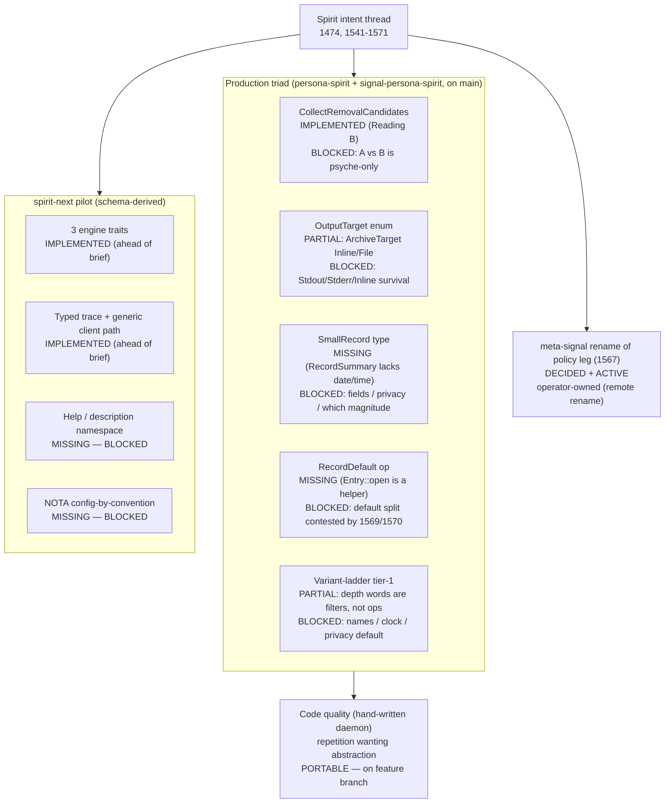
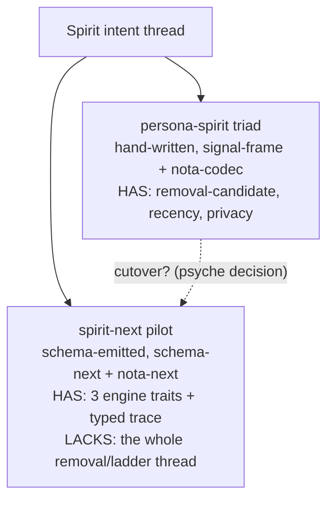

# 59.5 — Psyche report: design-to-implementation audit (the low-down)

Kind: psyche
Topics: spirit, audit, design-manifestation, implementation-gap, repetition, abstraction, decision-queue, privacy
Date: 2026-06-04

## Intent Anchors

[Production Spirit implements an explicit collect-removal-candidates operation that archives or emits reviewed Zero-certainty records before retracting them from the hot store.] (Spirit 1543 Maximum)

[Spirit gains an explicit CollectRemovalCandidates operation as a Signal root collecting all Zero-certainty records and emitting their summary form to a configurable output target; separates discovery/extraction from the destruction concern in Remove.] (Spirit 1547 High)

[Operations that extract or emit content accept a customizable output-target enum as the final field; variants Stdout, Stderr, File(path); not an error channel; uniform across extraction operations.] (Spirit 1548 High)

[Spirit defines a small-record data type carrying core load-bearing fields — identifier, topics, kind, description summary, magnitude, daemon-stamped date and time.] (Spirit 1549 High)

[Spirit gains a RecordDefault short-form recording operation taking only fields agents commonly customize, with defaults injected for the rest; Record remains the canonical full-fidelity operation.] (Spirit 1550 High)

[Medium certainty should be the normal default for routine Spirit captures unless the psyche wording, emphasis, repetition, or context justifies a higher or lower certainty.] (Spirit 1570 High)

[Spirit should become usable for more private concerns, so privacy filtering and default visibility behavior must be clear before the user relies on it for private material.] (Spirit 1571 High)

[Landed means on main. Work on a branch has no material existence — it is a concept until an operator integrates it to main. Agents must never report pushed or branch-resident work as landed.] (Spirit 1568 Maximum)

[When something feels ugly, slow down and find the structure that makes it beautiful — special cases collapse into the normal case; repetition resolves into a single named pattern.] (ESSENCE §"Beauty is the criterion")

## 1. The low-down, in one breath

You asked me to acquire intent and design, audit the code for design that
exists in the guidance layer but is missing from implementation, and port
it. Four read-only audit sub-agents swept the Spirit stack; every gap one
of them called "portable" was then challenged by an independent skeptic
told to refute portability. The skeptics refuted **all of them**. That is
the headline finding, and it is a true and useful answer, not a failure:

**There is nothing in the "missing design" column that an agent can port
without inferring intent — and inferring intent is the one act ESSENCE
forbids absolutely.** Every new design the Spirit thread spun off
(`OutputTarget`, `SmallRecord`, `RecordDefault`, the variant ladder) carries
at least one open field-level parameter that only you can settle. The
load-bearing operation the thread is *about* — `CollectRemovalCandidates` —
already exists in source, fully wired and tested, in the **combined
archive-then-retract** shape (Reading B). The single most important question
in the whole thread, Reading A vs Reading B, is still yours to call.

And the blocks got **sharper this week, not looser.** Three records that
landed after the original four-operation slice reopened parameters the
earlier records seemed to settle:

- **1570** (High): Medium — not Zero, not "whatever you pass" — should be
  the *default certainty* for routine captures. That directly contests
  `RecordDefault`'s field/default split (1550 listed magnitude as a
  customized field; 1570 says the default, when omitted, is Medium).
- **1569** (High): agents should be able to *omit* routine fields "such as
  default certainty" — pushing `RecordDefault` toward defaulting certainty,
  not requiring it.
- **1571** (High): Spirit should become usable for *private* concerns, and
  privacy default-visibility "must be clear before the user relies on it" —
  which reframes the privacy-Zero-by-default assumption baked into
  `Entry::open` and every short-form. This is no longer a small parameter;
  it is a direction.

So the design is **mature on the existing operation and decision-starved on
everything new.** The portable work that genuinely exists is a different
thing entirely: the triad carries real, mechanical **repetition that wants
named abstractions** (your explicit ask), and I have put a verified subset
of those onto a designer feature branch — reported below per Spirit 1568 as
branch work, not as "landed."

## 2. Status map — what is landed, blocked, missing



The same picture as a ledger:

| Thread | State | Why it can't just be ported |
|---|---|---|
| CollectRemovalCandidates (1543/1547) | implemented, Reading B, tested | Reading A vs B is psyche-only |
| OutputTarget enum (1544/1548) | partial — `ArchiveTarget {Inline, File}` | Stdout/Stderr semantics on a daemon-side op; does Inline survive vs Stdout |
| SmallRecord (1549) | missing — `RecordSummary` lacks date/time; `RecordProvenance` has them + privacy | which fields; privacy in/out; "magnitude" = certainty? privacy? both; absorb `RecordProvenance`? |
| RecordDefault (1550) | missing as wire op; `Entry::open` is the helper | field/default split contested by 1569/1570; privacy override reframed by 1571 |
| Variant-ladder tier-1 (1474) | partial — recency depths are filter variants | op name set (Today/ThisWeek?); clock semantics absent; per-shortcut privacy default |
| spirit-next engine traits / trace (1330-1332, 1489-1492) | implemented — ahead of the brief's snapshot | nothing to port; already on main of the pilot |
| spirit-next help namespace (1493) / config convention (1494) | missing | storage shape / SymbolPath home / registry shape all open |
| Repetition cleanups (ESSENCE beauty) | portable | behavior-preserving; on a feature branch |
| meta-signal rename (1567) | decided + active | operator territory (remote rename + cross-repo retarget) |

## 3. The decision queue — what you need to define (the heart of this report)

This is the "what I need to define further or better" you asked for. Each
item names what it is in plain terms, why it matters, the options, and a
recommendation where one is justified. I distinguish a **lean** (my read of
where it should land) from a **ratification** (your call) — per
`skills/reporting.md` §"Decisions in Psyche reports".

### D1 (pivotal) — Is CollectRemovalCandidates combined or pure-extract?

**What.** The deployed handler does archive-then-retract in one guarded
call. `persona-spirit/src/store.rs:127-160`:

```rust
pub fn collect_removal_candidates(
    &self,
    collection: RemovalCandidateCollection,
) -> Result<RemovalCandidatesCollected> {
    CollectionQueryGuard::new(&collection).validate()?;
    let candidates = self.records_for_query(&collection.record_query)?;
    let archive = RemovalCandidateArchive::from_stored_records(&candidates);
    if archive.write_to_target(&collection.archive_target).is_err() {
        return Ok(RemovalCandidatesCollected::new(
            Vec::new(), Vec::new(),
            candidates.iter().map(|record| SkippedRemovalCandidate {
                identifier: record.identifier,
                reason: RemovalCandidateSkipReason::ArchiveFailed,
            }).collect(),
        ));
    }
    for record in &candidates {
        self.engine
            .retract(Retraction::new(self.records, StoredRecord::key(record.identifier)))
            .map_err(Error::spirit_store)?;
    }
    Ok(RemovalCandidatesCollected::new(
        archive.records(),
        candidates.iter().map(|record| record.identifier).collect(),
        Vec::new(),
    ))
}
```

This is Reading B: extraction and destruction are fused, with an
archive-first safety invariant (archive fails → nothing is retracted, every
candidate returns as `ArchiveFailed`). It is proven by three witnesses
(`store.rs:944, 1042, 1090`).

**Why it matters.** 1547's own words — [separates discovery/extraction from
the destruction concern in Remove] — read *toward* Reading A (pure-extract,
destruction stays in a separate `Remove`). The code and all three context
reports (designer 57/58, operator 189/190) converge on B. This single answer
decides whether the slice is an ~80-line reshape (keep B, rename to the
directed wire name) or a ~250-line re-architecture (strip the retract +
archive-failure branch, design a separate batched-remove flow, re-derive the
archive-before-retract safety from two-call coordination).

**Options.** A: pure-extract. B: keep combined (the "separation" means
separation from per-record `(Remove N)`, which B already provides). C: both
as two operation roots.

**Lean: B.** Triple cross-lane convergence; B preserves the
archive-before-retract atomicity that A would have to reconstruct. **Your
call to ratify** — A is psyche-only.

### D2 — OutputTarget: what are the variants, and what does Stdout mean on a daemon?

**What.** 1548 names `Stdout | Stderr | File(path)`. Source has:

```rust
pub enum ArchiveTarget {
    Inline,
    File(ArchivePath),
}
```

`Inline` is not a process stream — it is a no-op at write time
(`ArchiveTarget::Inline => Ok(())`) and the records ride back in the reply's
`archived_records` vector. **The hard part**: a *daemon* has no stdout the
caller sees — the *CLI* does. So `Stdout`/`Stderr` as daemon-side targets are
semantically odd; the natural mapping is "daemon returns records in the
reply (the existing `Inline`), CLI routes them to its own stdout/stderr."

**Why it matters.** This sets the wire vocabulary for every future
extraction op (1548 wants it uniform). Get it wrong and `Inline` vs `Stdout`
become two names for one thing on the wire.

**Options.** A: rename `ArchiveTarget` → `OutputTarget`, map `Inline` →
`Stdout` (daemon returns in reply; CLI prints), keep `File`, add `Stderr` as
a CLI routing flavor of the same reply. B: keep `Inline` as a fourth variant
distinct from `Stdout`. C: leave it; `OutputTarget` is a CLI-side concern,
not a wire field.

**Lean: A**, with the explicit understanding that `Stdout`/`Stderr` are
*CLI routing of the returned reply*, not daemon stream writes. But the
"not an error channel — Stderr is one option among normal outputs" clause
(1548) needs your confirmation that Stderr is wanted at all. **Your call.**

### D3 — SmallRecord: exact fields, privacy in or out, which "magnitude," and does it absorb RecordProvenance?

**What.** Two adjacent types exist, neither matching 1549:

```rust
pub struct RecordSummary {            // no date/time
    pub identifier: RecordIdentifier,
    pub topics: Topics,
    pub kind: Kind,
    pub description: Description,
    pub certainty: Certainty,
    pub privacy: Privacy,
}
pub struct RecordProvenance {          // summary + date + time (and so + privacy)
    pub summary: RecordSummary,
    pub date: Date,
    pub time: Time,
}
```

1549 says "identifier, topics, kind, description summary, **magnitude**,
daemon-stamped date and time" — seven fields, says "magnitude" (singular),
omits privacy. Spirit has **two** magnitudes (`Certainty = Magnitude`,
`Privacy = Magnitude`), so "magnitude" is itself ambiguous.

**Why it matters.** Every emission of the small record commits to this field
set on the wire, and it interacts with the `ObservationMode`
(`SummaryOnly` / `WithProvenance`) split that exists *today specifically to
toggle between the two existing types*. If SmallRecord absorbs date/time,
`RecordProvenance` likely retires and the mode split changes.

**Options for privacy.** A: omit (the small record is for archival reading;
privacy lives on the full record). B: include (match `RecordProvenance`).
And note **1571 pushes against A** — if Spirit must become reliable for
private material, hiding privacy from the small record may be wrong.

**Lean: previously A; now genuinely reopened by 1571.** This is the clearest
case where a record that landed *after* the original slice changed the
answer. **Your call — and it is coupled to D6 below.**

### D4 — RecordDefault: which fields default, which stay customizable? (contested by 1569/1570)

**What.** 1550 named the customizable set {topics, kind, description,
magnitude} with the rest defaulted. `Entry::open` is the source-level twin —
it defaults *privacy* to Zero but keeps *certainty* customizable:

```rust
pub fn open(topics: Topics, kind: Kind, description: Description, certainty: Certainty) -> Self {
    Self { topics, kind, description, certainty, privacy: Magnitude::Zero }
}
```

But 1569 says agents should be able to *omit* "default certainty," and 1570
says the default certainty is **Medium**. So the live question is no longer
1550's clean list — it is: does `RecordDefault` take {topics, kind,
description} and default certainty to **Medium** (1570) and privacy to Zero?
Or keep certainty customizable? The codec *already* tolerates an omitted
trailing privacy field (defaults Zero), so a 3- or 4-field record NOTA
already round-trips at the parser layer — the operation root is what is
missing.

**Why it matters.** This is the daily-use ergonomic surface; the whole point
is "don't type the routine fields." If the defaults are wrong, the shortcut
is wrong.

**Lean.** `RecordDefault ([topics] Kind [description])` defaulting certainty
to **Medium** (1570) and privacy to Zero (subject to D6), with the full
`Record` for anything non-default. **Your call** — 1570 reset this; please
confirm the Medium default and whether certainty is omittable.

### D5 — Variant-ladder tier-1: which zero-arg ops, and where do clock-relative ones get their bounds?

**What.** The recency words exist, but as nested filter variants, not as
zero-arg operations:

```rust
pub enum RecordedTimeSelection {
    Any, Between(RecordedTimeRange), Since(RecordedTime), Until(RecordedTime),
    Recent, Shallow, Deep, VeryDeep,
}
```

with caps `SHALLOW=5, RECENT=15, DEEP=30, VERY_DEEP=100`. There is no
`(Recent)` top-level operation that lowers to the full query; `Today` and
`ThisWeek` (1474's examples) don't exist, and the daemon computes no
clock-relative bounds.

**Why it matters.** This is the broader ergonomic direction; it reuses
SmallRecord and OutputTarget, so it sits downstream of D2/D3.

**Lean: defer the time-range ops (Today/ThisWeek need clock semantics the
daemon lacks); the depth shortcuts (Recent/Shallow/Deep/VeryDeep) could
become zero-arg operation roots now.** **Your call** on the closed name set.

### D6 (meta) — The privacy direction (1571): what does "default visibility" mean now?

**What.** 1571 (High): [Spirit should become usable for more private
concerns, so privacy filtering and default visibility behavior must be clear
before the user relies on it for private material]. Today the entire
short-form surface bakes `privacy = Magnitude::Zero` (most public) as the
default, grounded in the "dev-mode public-repo" clarification. 1571 signals
you intend to use Spirit for private material — which makes the
public-by-default a *liability* unless the private path is equally clear and
hard to get wrong.

**Why it matters.** This is upstream of D3 (does SmallRecord carry privacy)
and D4 (can RecordDefault elevate privacy). It is the difference between
"privacy is a field most agents ignore" and "privacy is a first-class axis
with a clear default and a clear elevation path." It may also want a named
private short-form (`RecordSealed` / `RecordPrivate`) so private capture is
one ritual, not a remembered fifth field.

**Lean: this deserves its own short design pass before D3/D4 are finalized.**
**Your call** — what is the default visibility, and what is the deliberate,
hard-to-forget private-capture path? This is the highest-leverage decision
after D1, because it unblocks two others.

### D7 — Two implementations of Spirit: when does the schema pilot absorb the production thread?

**What.** Production `persona-spirit` (hand-written actor stack on
`signal-frame`/`nota-codec`) has the removal-candidate operation, the
recency filters, privacy. The schema pilot `spirit-next` (schema-emitted on
`schema-next`/`nota-next`) has the three engine traits and the typed trace
interface but **none** of the removal/variant-ladder thread. These are two
living realizations of the same component.



**Why it matters.** Every new operation you decide (D1-D5) lands in
production source first and then has to be re-landed in the pilot when it
catches up — or the pilot never catches up and production stays the daemon.
The longer the two diverge, the harder the eventual cutover.

**Lean: the pilot should prove the schema-derived engine, not feature-match
production yet; let the parity work (designer report 53) sequence the
absorption.** **Your call** on whether the new operations target production,
the pilot, or both.

### D8 — spirit-next's last hand-written pieces

The pilot's one remaining hand-written trace seam is a 12-line rkyv
round-trip impl that is identical for every component — the natural
candidate to emit from schema. Help namespace (1493) and config convention
(1494) are pure design with no source. All three are field-level undecided
(derive vs schema-emission vs blanket impl; mirror storage shape; registry
shape). **Surfaced, not portable.**

## 4. The repetition that wants a name (propositions, in code)

This is your "look for repetition — it means we could create another
abstraction" ask, made concrete. ESSENCE: [repetition resolves into a single
named pattern]. Slice A3 is the full treatment
(`3-rust-discipline-and-repetition.md`); the headline findings:

### R1 — The civil-date algorithm exists THREE times (headline)

The Howard Hinnant days-from-civil body is character-for-character identical
in two type holders, plus a third seconds-of-day splitter:

```rust
// persona-spirit/src/actors/clock.rs:90      (builds signal_persona_spirit::Date)
impl CivilDate {
    fn from_unix_days(days: i64) -> Self {
        let zero_based_days = days + 719_468;
        let era = if zero_based_days >= 0 { zero_based_days } else { zero_based_days - 146_096 } / 146_097;
        // ... identical body ...
    }
}
// persona-spirit/src/store.rs:480             (builds signal_version_handover::Date)
impl HandoverCivilDate {
    fn from_unix_days(days: i64) -> Self { /* byte-identical */ }
}
```

**The named pattern:** one `CivilDate` with `from_unix_days`, and the two
component-`Date` projections become `impl From<CivilDate> for
signal_persona_spirit::Date` and `impl From<CivilDate> for
signal_version_handover::Date`. The algorithm is written once. (This is on
the feature branch — see §5.)

### R2 — Five identical send-error helpers

```rust
fn state_send_error<M>(error: SendError<M, Infallible>) -> Error { Error::actor_runtime(error.to_string()) }
fn classifier_send_error<M>(error: SendError<M, Infallible>) -> Error { Error::actor_runtime(error.to_string()) }
fn clock_send_error<M>(error: SendError<M, Infallible>) -> Error { Error::actor_runtime(error.to_string()) }
// ... subscription_send_error, reply_send_error — all identical
```

**The named pattern:** `impl<M> From<SendError<M, Infallible>> for Error` —
the five helpers vanish, the call sites use `?`. (On the feature branch.)

### R3 — The dispatch trace-shuttle, ×14

Every executor handler in `dispatch.rs` repeats the same five lines around a
single `ask`:

```rust
let trace = self.trace.snapshot();
let pipeline = self.store.ask(store::SomeMessage { ..., trace }).await.map_err(Self::store_send_error)?;
let (reply, trace) = pipeline.into_parts();
self.trace.replace(trace);
Ok(reply)
```

14 times (verified: 14 `into_parts()`, 14 `self.trace.replace`). **The named
pattern:** `SharedTrace::ask_pipeline(actor, build_message, map_error)` — the
verb "ask a plane a trace-carrying message, splice the trace back, return the
reply" belongs on `SharedTrace`. **Partial-portable** — the generic bound
across Infallible-reply and Error-reply actors is a real shape choice, so I
left it off the branch and flag it here.

### R4 — Effect mirrors WorkingReply: two 13-variant enums, inverse 1:1 maps

`observation.rs` defines `Effect` (13 variants) whose `from_reply` and
`into_reply` are 26 match arms expressing one fact: `Effect` is
`WorkingReply` wearing a component-local label (plus a real
`ToSemaOutcome` projection). `WorkingReply` is macro-emitted from
`spirit.schema`; `Effect` is its hand-written shadow. **The named pattern:**
`impl From<WorkingReply> for Effect` / `impl From<Effect> for WorkingReply`,
and the open question of whether the executor enum should be schema-derived
too. **Blocked** — touches the `signal_channel!` schema surface.

### R5 — RecordFilter copies RecordQuery's fields to host one verb; Topics validated twice

`RecordFilter` (store.rs:434) re-shelves five of `RecordQuery`'s six fields
purely to host `matches(record)` — the verb belongs on `RecordQuery` itself
(the selection types already carry their own `matches`). And `Topics`
validation (non-empty + no-duplicate) is written once in the contract
(`lib.rs:79`) and again in the daemon (`store.rs:324`) with different error
types — because `Topics::new` is non-validating. **The named pattern:** a
validating `Topics` constructor so the invariant lives once. Both are
**cross-crate** (touch `signal-persona-spirit`), so they need a coordinated
contract+daemon move (operator integration) rather than a single-crate
designer branch.

## 5. What I ported (honest, per Spirit 1568)

A background designer agent ported the safe, single-crate,
behavior-preserving subset — **R1 (civil-date collapse + retire the
`HandoverClock` ZST), R2 (send-error `From` dedup), and the duplicated
argument-text free-function** — onto feature branch
`spirit-repetition-cleanups` in a `~/wt` worktree of `persona-spirit`, each
fix its own commit. Per Spirit 1568 this is **branch work awaiting operator
integration, NOT landed** — it has no material existence until an operator
integrates it to main.

Verified outcome (2026-06-04):

| Fix | Commit | Δ lines | What |
|---|---|---|---|
| R2 (send-error `From` dedup) | `efdc630d` | +17 / -40 | `impl<Message> From<SendError<Message, Infallible>> for Error`; 5 identical `Self::<plane>_send_error` call sites become bare `?`; 5 helpers deleted; `store_send_error` (distinct Error-reply body) kept |
| V2 (argument-text dedup) | `45e36cfb` | +35 / -23 | new `SpiritArgument(SingleArgument)` newtype with `into_nota_text`; both byte-identical free fns deleted; called from daemon.rs + migration.rs |
| R1 + V3 (civil-date collapse) | `a030a102` | +100 / -71 | one `CivilInstant{CivilDate,CivilTime}` owns the sole Hinnant algorithm (`719_468` now appears once in `src/`); projections are `impl From<CivilDate/CivilTime>` for both `signal_persona_spirit::` and `signal_version_handover::` Date/Time; `HandoverClock` ZST + `HandoverCivilDate` deleted; wall-clock read moved to `HandoverClockReading::from_now()` |

Verification: `cargo build --tests` **pass**, no compiler warnings;
`cargo test` **120 passed; 0 failed; 0 ignored** across all binaries. Each
of the three commits builds and tests green on its own, so partial
integration is safe. The branch is pushed to origin at `a030a102`. The
canonical `/git` checkout is confirmed clean on `main` (`@` is an empty
change; `origin/main` and the local `main` bookmark remain at `7233075c` —
untouched).

Operator note: the sub-agent twice had an Edit land on the canonical-checkout
working copy (the Edit/Read tools resolved the audit's `/git/...` paths, not
the `~/wt/...` worktree paths) and recovered each time via
`jj squash --from <canonical> --into <feature>` + `jj workspace update-stale`.
No content lost, main never affected — but a future worktree sub-agent should
edit through the `~/wt/...` paths from the first edit.

R3 (trace-shuttle), R4 (Effect mirror), and R5 (cross-crate) are **not** on
the branch — R3's generic bound is an open shape, R4 touches the schema
surface, R5 needs coordinated cross-crate movement. They are staged here for
your direction.

## 6. Bad patterns — the auditor seed list

These are exactly the beat of the proposed **auditor** role (Spirit 234/235:
[the auditor finds flaws or bad patterns … things that broke rules]) — all
mechanically detectable, which is why the intent names a smaller
pattern-checking model (DeepSeek) for it:

| Pattern | Where | Auto-detector |
|---|---|---|
| Identical-body functions | `daemon.rs:722` ≡ `migration.rs:247`; the 5 send-errors | diff-of-bodies after signature |
| Free functions outside `main`/`#[cfg(test)]` | `store.rs:423`, `daemon.rs:1775`, `migration.rs:117/134/247` | `fn` at module scope |
| ZST namespace method-holder | `store.rs:427` `HandoverClock` | unit struct whose impl methods take no `self` |
| Stringly-typed errors at a typed boundary | `error.rs` `SpiritStore{reason:String}`, `RequestRejected{reason:String}` matched by `reason.contains("exact Zero")` | `{ reason: String }` + `.contains(` on it |
| Parallel hand-mirrored enums | `Effect` vs `WorkingReply` | two enums, 1:1 arm map |
| Dead schema artifact | `signal-persona-spirit/schema/...concept.schema` (stale operation tree; NOT consumed — `spirit.schema` is) | unreferenced `.schema` |

The stale `.concept.schema` is worth a direct note: it lists only
`State/Record/Observe/Watch/Unwatch` and a pre-privacy `Entry`, and reading
it as the contract would mislead. The build consumes `spirit.schema`. It
should be deleted.

## 7. The meta-signal rename (active, operator-owned)

1567 (High): [the owner-signal to meta-signal rename is now active work, not
tentative]. The Spirit policy leg is still `owner-signal-persona-spirit`
(zero `meta-signal` references anywhere; 30+ `owner-signal` references in
`persona-spirit` alone). The target name `meta-signal-persona-spirit` is
fully determined by the triad rule — no psyche choice remains — but landing
it is a coordinated remote-rename + cross-repo Cargo retarget that **only an
operator lane can land** (GitHub remote rename authority + main across
repos). Operator report 300 ran the rename for the *upgrade* triad and
listed the spirit policy leg in its remaining gaps. A4's report
(`4-...drift.md`) has the full edit set. I am surfacing this, not
duplicating the operator's active pass.

## 8. Manifestation drift to fix (portable prose)

Three per-repo doc edits just record decided direction and are portable as
prose (operator integrates):

- `persona-spirit/INTENT.md` should record the **Medium default-certainty**
  heuristic (1570) — currently neither INTENT.md names a default.
- `spirit-next/INTENT.md:206` overstates currency ("tracks production Spirit
  0.3 behavior") — the pilot tracks multi-topic/privacy/lookup but
  deliberately not removal-candidate collection or recency depth. Soften to
  the true state.
- The `ArchiveTarget` documentation faithfully tracks the *landed* code but
  is stale to the *decision* (1548) — reconcile both together when D2 lands.

## 9. What this means for you — the recommendation

The Spirit thread is **design-mature on the existing operation and
decision-starved on everything new.** The audit cannot move it forward by
porting, because moving it forward requires *deciding*, and deciding is
yours. The two highest-leverage decisions, in order:

1. **D1 (Reading A vs B).** Ratify B and the whole CollectRemovalCandidates
   slice becomes a small reshape; choose A and it becomes a re-architecture.
   Everything about the operation's final shape hangs here.
2. **D6 (the privacy direction, 1571).** This is newly load-bearing and it
   unblocks D3 (SmallRecord privacy) and D4 (RecordDefault privacy). A short
   design pass on "what is the default visibility, and what is the clear,
   hard-to-forget private-capture path" would unblock the largest fan-out.

A process observation worth your attention: the variant-ladder/defaults
design is **generating intent faster than it is resolving it.** The same
parameter — what does a routine capture default to — has now been touched by
1474, 1545, 1550, 1569, and 1570, each refining or contesting the last. That
is a signal the defaults/ladder design wants **one consolidating decision
session** that settles the field/default partition, the privacy direction,
and the small-record shape together, rather than another incremental record.
If you want, the next designer pass can frame exactly that session: a single
page, every open parameter, every option, one sitting.

The genuinely portable work — the repetition cleanups — is on a feature
branch, verified, and reported per 1568 as awaiting operator integration. It
manifests the ESSENCE beauty principle into the code; it does not touch any
of the decisions above.

## See also

- `0-frame-and-method.md` — the meta-report frame + capture-first note.
- `1-spirit-production-triad-gap.md` — A1: the five designs vs source, with the Reading-B handler verbatim.
- `2-spirit-next-schema-parity.md` — A2: the schema pilot is ahead; the two-implementations divergence.
- `3-rust-discipline-and-repetition.md` — A3: the full repetition + discipline treatment (the propositions in code).
- `4-triad-shape-naming-and-manifestation-drift.md` — A4: triad shape, the meta-signal rename edit set, manifestation drift.
- `reports/system-designer/57-spirit-engine-variant-and-collect-vision-2026-06-03/` — the prior vision + psyche analysis this builds on.
- `reports/system-operator/189-...`, `190-...` — the parallel operator-lane work converging on Reading B.
