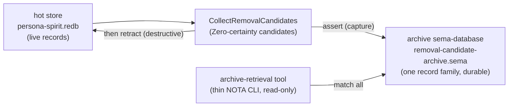
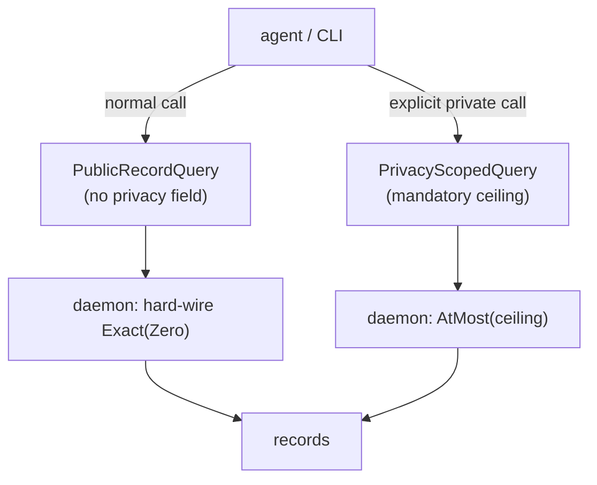

# 60 — Concept: Spirit archive system, explicit privacy queries, typed feedback

Kind: concept (designer concepts the shape; operator implements after ratification)
Topics: spirit, archive, sema-database, privacy, typed-feedback, collect-removal-candidates, versioning
Date: 2026-06-04

## Intent Anchors

[The normal Spirit query returns only Zero-privacy most-public records by default; seeing more private records requires an explicit privacy-query subtype that carries a privacy level and unfilters up to that level — accessing private material is always an explicit distinctly-typed call, never an accidental default.] (Spirit 1610 Decision High)

[Introduce an archive system as a specialized sema-database that holds exactly one kind of archived object, with the database name stating what it archives; pair it with a small archive-retrieving tool that reads archived objects back.] (Spirit 1608 Decision High)

[CollectRemovalCandidates archives collected records to a default location derived from where the daemon runs; if it cannot write the default it tries a backup, and if that also fails it errors; the outcome is reported through properly named result enums, never long string messages.] (Spirit 1609 Decision High)

[Component feedback, status, and error reporting is expressed as typed self-descriptive NOTA enums and structs whose names carry the meaning, not as long string description messages; a result type should be so well named it needs no accompanying message string.] (Spirit 1611 Principle High)

[Every code or logic change to a component must bump the component version, at minimum the patch component, so changes stay trackable.] (Spirit 1607 Decision High)

[Spirit should become usable for more private concerns, so privacy filtering and default visibility behavior must be clear before the user relies on it for private material.] (Spirit 1571 Clarification High)

[Retract is destructive at the storage layer — redb is copy-on-write, freed pages are reclaimed, a retracted record becomes unrecoverable; callers that might need a removed record back must capture it before retracting.] (sema-engine ARCHITECTURE)

## 1. Frame

The psyche set five directions today and asked the designer to *make a
concept* while the system-operator reads it and implements. The psyche's
active focus is **CollectRemovalCandidates** — they want every lane to know
it. The psyche authorized me to lean on my strong leans: *"if his leans are
good and strong, he can go ahead and lean on them for his concept, and then
his concept will tell us if it is a good idea."* So this concept leans where
the structure is clear and asks where it is not — leans are marked **Lean**,
ratification points are marked **Your call**.

I authored this concept directly rather than fanning out sub-agents: the
direction is psyche-specified (a specialized sema-database + retrieval tool,
explicit privacy typing, typed feedback), so the work is synthesis against a
known direction, not exploration of an open space. The grounding is the audit
in report 59 plus the sema-engine and signal-persona-spirit source read for
this concept.

## 2. Conformance audit — is it the way you said it?

You asked me to check that everything you said *that should be* is the way you
said it, *unless it is not implemented yet*. Here is current source against
each statement:

| Your statement | Current source | Verdict |
|---|---|---|
| Normal query returns only Zero-privacy by default | `PrivacySelection::default_observation_privacy()` returns `Exact(Magnitude::Zero)` (`signal-persona-spirit/src/lib.rs:582`) | **conformant** at the default level |
| Private access must be an explicit, distinctly-typed call | privacy is a *field* (`PrivacySelection`) inside the single `RecordQuery`; any caller can set `AtLeast(High)` — private access is a field value, not a distinct type | **not yet** — needs the typed split (Concept C) |
| Feedback via self-descriptive enums, not string messages | reply outcomes ARE typed enums (`RemovalCandidateSkipReason`, `WorkingReply`) — the good exemplar; but the error surface is stringly: 10+ `{ reason: String }` variants in `persona-spirit/src/error.rs` (`RequestRejected`, `InputOutput`, `ArchiveWrite`, `InvalidSpiritRequest`, …) and a `reason.contains("exact Zero")` string-match | **split** — replies conformant, errors not (Concept D) |
| CollectRemovalCandidates archives to a default location | the archive target is explicit (`ArchiveTarget::{Inline, File}`); there is no default-location auto-archive, no backup, no derive-from-daemon-location | **not yet** (Concept B) |
| Archive system = a sema-database holding one kind, named for it, + retrieval tool | the `File` target writes a flat NOTA file (`RecordsObserved`), not a sema-database; no retrieval tool exists | **not yet** (Concept A) |
| Every code/logic change bumps the version | `skills/versioning.md` exists and is correct; but `persona-spirit` and `signal-persona-spirit` are **still `0.3.0`** despite CollectRemovalCandidates + privacy landing since the 0.3.0 tag | **violated in fact** — see §7 |

So: the privacy *default* is already right; everything else is either
not-yet-built (fine — you said so) or, in the versioning case, a discipline
the source is currently violating.

## 3. Concept A — the archive system (a specialized sema-database + retrieval tool)

An **archive** is a sema-database (its own redb file behind its own
`sema-engine::Engine`) that registers **exactly one record family** — the one
kind of object it archives — and whose **file name states what it archives**.
This is the durable home the psyche described.

Why a sema-database and not the current flat NOTA file: the sema-engine
ARCHITECTURE makes the case directly — [Retract is destructive … a retracted
record becomes unrecoverable; callers that might need a removed record back
must capture it before retracting]. The archive **is** that capture, and a
sema-database gives the capture durability (`CommitSequence` high-water mark),
typed records, duplicate-key rejection, and queryability that a flat file does
not. The archive is the typed, durable, queryable record of what left the hot
store.

The shape, grounded in the sema-engine surface:

```rust
// Opening / writing an archive: one Engine, one registered family named for the kind.
let mut archive = Engine::open(EngineOpen::new(archive_path, SchemaVersion::new(1)))?;
let family = archive.register_table(TableDescriptor::new(TableName::new("removal-candidate")))?;
archive.assert(Assertion::new(family.clone(), small_record))?;   // capture, durable
```

The **retrieval tool** is a thin reader — a small CLI, single NOTA argument
like every component binary — that opens the archive `Engine` read-only and
projects records to NOTA at the edge:

```rust
let archive = Engine::open(EngineOpen::new(archive_path, SchemaVersion::new(1)))?;
let snapshot = archive.match_records(QueryPlan::all(family))?;    // read all archived records
// render snapshot to NOTA only at the display edge
```

**Naming the archive by its content** is the NOTA-config-by-convention
direction (Spirit 1494): the file path fixes the expected root type. An
archive at `…/removal-candidate-archive.sema` is, by convention, a
sema-database whose one family is the small-record kind. The retrieval tool
resolves the kind from the path convention.

**Lean (L5):** an archive is *a sema-database with one record family, named by
content*. The generalization is clean — any component can stand up named
archives (one per archived kind) using a small shared archive library; the
retrieval tool is generic over the archived record type. **Your call:** does
the archive library live as its own micro-component, or inside the component
that owns the data? (Lean: a small shared `archive` library + per-archive
named databases, so the retrieval tool is one generic tool, not one per
component.)



## 4. Concept B — CollectRemovalCandidates: default + backup archiving, typed outcome

The default location derives from **where the daemon runs**: the daemon
already knows its redb path (the 9-field config tuple — sockets, redb path,
magnitude limit, four reserved slots — under
`~/.local/state/persona-spirit/<version>/`). The default archive is a
sema-database **beside the hot redb in that state directory**, e.g.
`<state-dir>/removal-candidate-archive.sema`. No new config field needed; it
is derived from the redb path's directory.

The flow keeps the **combined, guarded shape** the source already has (Reading
B from report 59), now with the archive sema-database as the capture step:

1. Collect Zero-certainty candidates (the existing exact-Zero guard).
2. **Assert** them into the default archive sema-database (durable capture).
3. On capture success, **retract** from the hot store.
4. If the default location is unwritable, try a **backup location**; if the
   backup also fails, **error and retract nothing** (the archive-before-retract
   invariant holds — the hot store stays intact).

The outcome is a **typed enum**, not a string message (Spirit 1609 + 1611):

```rust
// Self-descriptive — the variant name IS the message. No `message: String`.
pub enum RemovalCandidateOutcome {
    ArchivedAndRemoved(ArchiveReceipt),            // new archive created, candidates removed
    AppendedAndRemoved(ArchiveReceipt),            // appended to existing archive, candidates removed
    ArchivedToBackupAndRemoved(BackupReceipt),     // default failed, backup succeeded, candidates removed
    NotCollectedArchiveUnavailable(ArchiveFailure),// both locations failed; hot store untouched
}
```

`ArchiveReceipt` carries typed values — `archived: Vec<RecordIdentifier>`, the
`ArchiveLocation` (a typed enum `Default | Backup`, not a path string for the
human), and the `CommitSequence` the archive reached. The path, where it must
appear, is a typed `ArchivePath` value rendered to NOTA only at the display
edge.

**Lean (L1) — the strong one:** the default sema-database archive is **always
written** (it is the durable capture the destructive retract requires);
`OutputTarget` becomes the *optional human-facing copy on top* ("also give me
the records to stdout / a file"), not the archive itself. This cleanly splits
two concerns the current `ArchiveTarget` conflates: **durable capture**
(always, to the archive sema-database) versus **show-me / hand-me-a-copy** (the
`OutputTarget`, optional). It also resolves report 59's open D2: `Inline`
becomes "return a copy in the reply," `File` becomes "also write a copy here,"
and the archive is no longer one of the target's responsibilities. **Your
call** — this changes the meaning of the output-target enum from "where the
archive goes" to "where an optional extra copy goes."

## 5. Concept C — explicit privacy queries (the typed split)

Today there is one `RecordQuery` whose `privacy_selection` field defaults to
`Exact(Zero)` but can be set to `AtLeast(High)` etc. Private access is a field
value — reachable by accident if an agent fills the field. The psyche wants it
to be **impossible by default and explicit by type**.

The concept: **the default query type cannot express non-Zero privacy.** A
distinct query subtype carries the privacy ceiling and is the *only* way to
see beyond Zero.

```
# Public-only — the normal call. No privacy knob exists on this shape;
# the daemon hard-wires Exact(Zero).
(Observe (Records ((Any []) None Any Recent SummaryOnly)))

# Explicit privacy-scoped call — a DISTINCT root carrying the ceiling.
# "Show me up to High-privacy records" — you had to ask, by type.
(ObservePrivate (High ((Any []) None Any Recent SummaryOnly)))
```

The `PrivacySelection` mechanism stays (it is good), but it moves OUT of the
default query shape and onto the explicit subtype. The default shape literally
has no field for it; the type system enforces "you have to be explicit."

```rust
// Default observation: no privacy field — daemon applies Exact(Zero).
pub struct PublicRecordQuery { topic_selection: TopicSelection, kind: Option<Kind>,
    certainty_selection: CertaintySelection, recorded_time_selection: RecordedTimeSelection,
    mode: ObservationMode }

// Explicit privacy-scoped observation: the ceiling is mandatory, by type.
pub struct PrivacyScopedQuery { ceiling: Privacy, query: PublicRecordQuery }  // unfilters up to `ceiling`
```

**Lean (L2):** type-enforced explicitness — the default query cannot name a
privacy above Zero; the explicit subtype's `ceiling` is `AtMost`-semantics
("up to that level"). **Your call:** is the ceiling inclusive `AtMost`
(everything Zero..=ceiling) — my lean — or exact-band? And does the explicit
subtype need owner-channel gating, or is being-explicit enough?



## 6. Concept D — typed feedback as a language (manifested into architecture)

The principle (Spirit 1611): feedback, status, and errors are **typed
self-descriptive NOTA enums/structs**; the name carries the meaning; no
`message: String`. The reply surface already lives this (the
`RemovalCandidateSkipReason` enum is the exemplar). The **error** surface does
not: `persona-spirit/src/error.rs` carries `RequestRejected { reason: String }`,
`InputOutput { reason: String }`, `ArchiveWrite { reason: String }`, and 7
more `{ reason: String }` variants — and `RequestRejected` is matched
elsewhere by `reason.contains("exact Zero")`, which is a string standing in
for a type.

The concept: replace the stringly payloads with typed ones.

```rust
// Before — a string carries the meaning, matched by substring elsewhere.
RequestRejected { reason: String }

// After — the meaning IS the type; Display renders NOTA only at the edge.
RequestRejected(RejectionReason)
pub enum RejectionReason {
    NonZeroCollectionQuery,   // replaces reason.contains("exact Zero")
    EmptyTopics,
    DuplicateTopic(Topic),
    PrivacyScopeRequiresExplicitQuery,   // when a public query is asked for private data
}
```

Foreign errors (`std::io::Error`, `sema_engine::Error`) convert via `#[from]`
and are rendered, not stringified into the API surface. A single `Display`
impl walks the typed value to NOTA — the one edge where a string appears.

**Manifestation (you said "add that into the architecture too"):** this is
both a per-repo and a workspace surface. Lean: (a) a short section in
`persona-spirit/ARCHITECTURE.md` — "Feedback is typed NOTA, not strings" — and
the matching INTENT.md note; (b) the cross-cutting discipline folded into
`skills/rust/errors.md` (which already mandates typed per-crate errors) as the
"no `{ reason: String }`; carry a typed reason" rule, rather than a brand-new
skill (skills must not grow noisy). This converges exactly with report 59's
A3-V4 finding — the audit and your principle name the same fix.

## 7. Versioning conformance (§2 made concrete)

`skills/versioning.md` already states the discipline correctly (every
behavioral change bumps the version in the same change set; patch for internal
logic, minor for new operation roots). But the source is **violating it now**:
`persona-spirit` and `signal-persona-spirit` are still `0.3.0` though
CollectRemovalCandidates (a new operation root) and the privacy field landed
since the 0.3.0 tag. By the skill's own rule that is a **minor bump to
`0.4.0`** (new operation root + new wire field), not merely a patch. The
deployed binary is further behind still — it does not serve
CollectRemovalCandidates at all (source-ahead-of-deploy).

**Lean (operator action):** bump both crates to `0.4.0` as part of the next
change that touches them, and going forward bump on every behavioral change
per the skill. **Your call** if you prefer `0.3.1` (treating the additions as
internal until deploy).

## 8. The leans, gathered (you authorized leaning on the strong ones)

| # | Lean | Strength | Resolves |
|---|---|---|---|
| L1 | The default sema-database archive is always written (durable capture); OutputTarget is the optional extra copy on top | strong | report 59 D2 (output-target meaning) |
| L2 | The default query type cannot express non-Zero privacy; a distinct subtype carries the ceiling (AtMost) | strong | Spirit 1610, report 59 D6 |
| L3 | CollectRemovalCandidates stays combined (archive-then-retract); the archive sema-database IS the capture the destructive retract requires | strong | report 59 D1 (Reading A vs B) — the archive system gives B a stronger rationale |
| L4 | Typed feedback replaces stringly errors; Display renders NOTA at the edge | strong | Spirit 1611, report 59 A3-V4 |
| L5 | An archive = a sema-database with one record family, named by content (1494 path-convention) | strong | Spirit 1608 |

Genuine open questions where my lean is not strong enough to decide for you:

- **Q1 (backup location).** Sibling fallback then a temp directory? A
  configured fallback slot? (Lean: try `<state-dir>`, then a temp dir; error
  if both fail. Policy is yours.)
- **Q2 (OutputTarget after L1).** If the durable archive is always written,
  does the output-target keep `Stdout`/`Stderr`, or collapse to
  "return-in-reply / also-write-a-copy-to-file"? (Lean: drop `Stderr`; keep
  `None | InReply | File`.)
- **Q3 (privacy ceiling).** `AtMost(ceiling)` inclusive — my lean — or an
  exact band? Owner-gating on the explicit subtype, or is explicit-by-type
  enough?
- **Q4 (version magnitude).** `0.4.0` (minor — new operation roots, my lean)
  or `0.3.1` (patch) for the already-landed CRC/privacy work?

Notably, **L3 means report 59's pivotal Reading A vs B question now has a
stronger answer**: B (combined) is not just the converged recommendation, it
is *required* by the storage layer — destructive Retract demands a capture
step, and the archive sema-database is that step. Pure-extract (A) would leave
the capture-before-retract guarantee to fragile two-call coordination.

## 9. Path for the operator (the report you wanted operator to read)

Designer (me): this concept. System-operator: implement after the psyche
ratifies the leans, in this order — each its own version bump per
`skills/versioning.md`:

1. **Bump versions** to `0.4.0` (Q4) — close the discipline violation first.
2. **Typed feedback** (Concept D): `RejectionReason` + `#[from]` foreign
   errors + NOTA `Display`; manifest the principle into ARCHITECTURE/INTENT.
3. **Explicit privacy split** (Concept C): `PublicRecordQuery` (no privacy
   field) + `PrivacyScopedQuery` (mandatory ceiling).
4. **Archive library + retrieval tool** (Concept A): a small shared archive
   over `sema-engine`, named-by-content sema-databases, one generic NOTA
   retrieval CLI.
5. **CollectRemovalCandidates default+backup archiving** (Concept B): always
   capture to the default archive sema-database; backup; `RemovalCandidateOutcome`.

Everything here is **concept awaiting psyche ratification of the leans** —
nothing is decided until the psyche confirms, and nothing is landed until an
operator integrates it to main (Spirit 1568). The repetition cleanups on
branch `spirit-repetition-cleanups` (report 59 §5) are an independent,
already-verified prerequisite cleanup the operator can integrate regardless.

## See also

- `reports/system-designer/59-design-to-implementation-audit-2026-06-04/` — the audit this builds on (D1 Reading A/B, D2 output-target, D6 privacy, A3-V4 stringly errors).
- `skills/versioning.md` — the versioning discipline (already exists; §7 names the current violation).
- `/git/github.com/LiGoldragon/sema-engine/ARCHITECTURE.md` — the Engine/register_table surface + the destructive-Retract rationale grounding Concept A.
- `/git/github.com/LiGoldragon/signal-persona-spirit/src/lib.rs` — `PrivacySelection` (574), `ArchiveTarget` (803), `RemovalCandidateSkipReason` (876).
- `/git/github.com/LiGoldragon/persona-spirit/src/error.rs` — the stringly `{ reason: String }` surface Concept D replaces.
- Spirit 1607-1611 (today's directions), 1571 (privacy must be clear), 1494 (NOTA config-by-convention).
