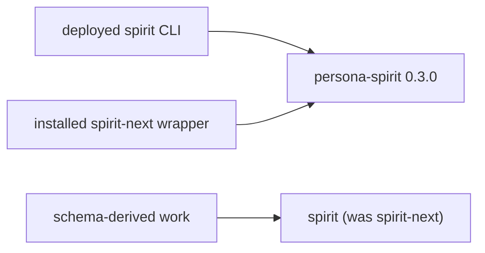
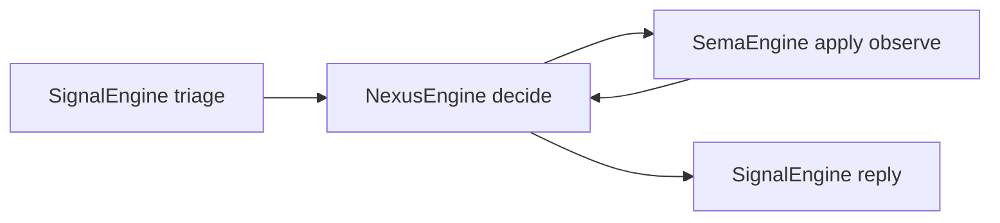

# 61 — Spirit situation, projection-engine analysis, proposals

Kind: psyche (engine-report variant + situation + ratified decisions + proposals)
Topics: spirit, engine-analysis, projection, situation, archive, privacy, typed-feedback, proposals, cutover
Date: 2026-06-04

## Intent Anchors

[The output target for extraction operations is the location of the archive database, with default-then-backup-then-error fallback; it also gains a Print style (Print Stdout, Print Stderr) where the daemon returns the typed NOTA-decodable record and the client renders it — Print means no archive is written, the agent just receives the records.] (Spirit 2271 Decision High)

[The explicit privacy query exposes all privacy selectors as operations — at most inclusive, exact, and at least — not just at-most; the normal query stays Zero-only.] (Spirit 2272 Decision High)

[Version magnitude — patch for small changes, minor for functionality changes such as privacy, major reserved to explicit psyche authorization; agents may propose a major bump but the psyche gives the go.] (Spirit 2273 Decision High)

[Introduce an archive system as a specialized sema-database holding one kind of object, named for what it archives, plus a retrieval tool.] (Spirit 1608 Decision High)

[Spirit should become usable for more private concerns; privacy default visibility must be clear before private use.] (Spirit 1571 Clarification High)

[Retract is destructive — a retracted record becomes unrecoverable; callers that might need a removed record back must capture it before retracting.] (sema-engine ARCHITECTURE)

## 1. The low-down — the current situation

The Spirit work is now **two implementations and a naming trap**, and the
repo topology shifted under us this session (operator report 304 landed the
rename mid-flight):

- **Production Spirit is `persona-spirit`** (version `0.3.0`, hand-written
  actor stack). It provides the deployed `spirit` CLI/daemon. It has the
  removal-candidate + privacy thread you have been driving.
- **The projection Spirit is now the repo `spirit`** — renamed this session
  from `spirit-next`. It is the schema-derived pilot. Its checkout moved from
  `/git/github.com/LiGoldragon/spirit-next` to
  `/git/github.com/LiGoldragon/spirit`; `repos/spirit` points there;
  `repos/spirit-next` is gone. **But its internal names still say
  `spirit-next`** (package, library, binaries, repository URL) — the repo-level
  rename landed, the code rename is an operator follow-up.
- **The trap:** the installed `spirit-next` command in your profile is *not*
  the renamed `spirit` repo — it is `persona-spirit`'s side-by-side next slot.
  Three things wear "spirit-next"-ish names and mean different sources.



Against this backdrop, your four ratifications today land cleanly (§2), but
they currently have **no home in the projection** — the schema-derived
`spirit` does not yet have CollectRemovalCandidates, privacy filtering, or
ChangeCertainty (§3). So today's archive/privacy/typed-feedback decisions are,
right now, production-`persona-spirit` work — which sharpens the cutover
question (§4, P4).

## 2. Your decisions, recorded (Q1-Q4)

| # | Decision | Shape consequence |
|---|---|---|
| Q1 | Backup location is fine | CollectRemovalCandidates writes the default archive db; on failure tries a backup; if both fail it errors and retracts nothing (capture-before-retract holds). |
| Q2 | OutputTarget is reshaped, not dropped | It is the **location of the archive database**. It also gains a **Print** style — `Print(Stdout)` / `Print(Stderr)` — where the daemon returns the typed NOTA-decodable record and the **client** renders it. Print means **no archive**; the agent just gets the records. So the operation either archives to a database location or prints to a stream. |
| Q3 | All privacy selectors | The explicit privacy query exposes `AtMost` (inclusive, the main one), `Exact`, and `AtLeast` as operations — build them all. The normal query stays Zero-only and carries no privacy knob. |
| Q4 | Version magnitude | Patch (`0.3.0→0.3.1`) for small changes; minor (`0.3→0.4`) for functionality such as privacy; **major reserved to your explicit go** — agents propose, you authorize. Already added to `skills/versioning.md`. |

The Q2 reshape is the cleanest resolution of the old output-target ambiguity:
the durable **archive db location** and the ephemeral **print-to-stream** are
two distinct intents, and a `Print` variant where the client renders the typed
record is exactly the strings-only-at-the-edge discipline — the daemon ships
the typed value, the client makes the text.

```rust
// Q2 in code — the daemon never prints; it returns the typed record. The client renders.
pub enum OutputTarget {
    Archive(ArchiveLocation),   // default | backup db location — the durable path
    Print(Stream),              // no archive; daemon returns records, client renders NOTA
}
pub enum Stream { Stdout, Stderr }

// Q3 — the explicit privacy query carries one of all three selectors.
pub enum PrivacyScope { AtMost(Privacy), Exact(Privacy), AtLeast(Privacy) }
```

## 3. Engine analysis — the projection Spirit (schema-derived `spirit`)

You asked for an engine analysis of the projection Spirit. This is the
engine-report Psyche variant: from first principles, with the size ledger and
the interfaces, ending at what is proven and what is missing.

### What it is

The schema-derived Spirit pilot: a `.schema` file is lowered to assembled
schema and emitted to Rust, which a real NOTA CLI and rkyv Unix-socket daemon
use. Repo renamed `spirit-next → spirit` this session; package still
`spirit-next 0.1.0` (internal rename pending). It is the forward, generated
architecture — distinct from the hand-written production `persona-spirit`.

### Size ledger

| Surface | Lines / count |
|---|---:|
| Production Rust (hand-written) | 1915 |
| Generated Rust (`src/schema/lib.rs`) | 1951 |
| Test Rust | 2890 |
| Authored schema (`schema/lib.schema`) | 94 |
| Assembled schema (`lib.asschema`) | 5 |
| Public types | 90 |
| Tests | 59 |

The headline: **about half the Rust is generated**, and **94 lines of authored
schema emit 1951 lines of Rust** — a ~21× amplification. This is the
schema-IS-the-architecture property made measurable: the contract is 94 lines
you read; the rest is mechanical emission.

### What the schema defines

The operation roots are a bare-name header (the 1551-1554 shape):

```
[Record Observe Lookup Count Remove LookupStash]
[RecordAccepted RecordsObserved RecordsStashed RecordFound RecordsCounted RecordRemoved Error Rejected]
```

So the projection has `Lookup`, `Count`, and `LookupStash` that production
lacks — and it lacks `CollectRemovalCandidates`, `ChangeCertainty`, and any
privacy-scoped query that production has. The two implementations have
**diverged in both directions**.

### What Rust was generated — the three engine traits

The runtime is genuinely composed of three schema-emitted engine traits on
data-bearing nouns (verified verbatim in report 59 A2, `src/schema/lib.rs:1843-1937`):
`SignalEngine` (triage-only, inner/outer split + trace hooks) on `SignalActor`;
`NexusEngine` (heavy logic + mail keeper + Signal↔SEMA translator) on `Nexus`
(owns `MailLedger`, `Store`, `StashTable`); `SemaEngine` (durable single-writer,
the `apply` `&mut self` / `observe` `&self` split) on `Store` (owns the redb
`Database`). The composition is the `Engine` struct; the record-970 flow
(Signal admits → Nexus owns mail → SEMA writes → Nexus translates reply) is a
real call path, not a procedural chain.

### What handwritten code remains

The three trait impls (the real algorithm — match typed input, decide, call
the next typed interface, return typed output), plus two small seams: the
12-line `TraceEventFrame` rkyv round-trip (identical for every component — the
last hand-written trace code) and a hand-written rkyv-binary `Configuration`
(not yet schema-emitted).

### Runtime path



### What tests prove

59 tests, 2890 lines — including the record-970 flow witnesses (single-flight
`&mut Nexus` borrow, mail-ledger transitions, the apply/observe split). The
trace surface is schema-emitted and the client trace path is generic
(`triad-runtime`). This is the strongest part of the projection: the
schema-derived engine is real and tested, not a sketch.

### What still needs to move / drift risks

- **No removal/privacy thread** — the projection has none of today's work
  (archive, privacy split, typed outcomes); these live only in production.
- **Internal names lag** — package/lib/binaries/URL still say `spirit-next`.
- **redb generation drift** — `spirit` uses redb `2.6.3`; `sema`/`persona`/
  production use `4.1.0` (operator 304). The archive sema-database (Concept A)
  rides on `sema-engine`, which is on `4.1.0` — so an archive built in the
  projection needs the redb versions unified first.

## 4. Proposals — more functionality and things you may have missed

You asked me to propose more functionality and catch what you missed. These
are leans, marked by strength.

**P1 — Restore is the missing half of the loop (strong).** You have nominate
(`ChangeCertainty` to Zero) and collect (archive + retract). The loop is open:
nothing reads from the archive *back into* the hot store. Propose a **Restore**
operation — re-assert archived records into the live store — alongside the
read-only retrieval tool. Collect and Restore are inverses; the archive
sema-database is the pivot. Without Restore, a wrongly-collected record can be
read but not reinstated except by hand.


**P2 — The data-lifecycle ladder is a closed set, not ad-hoc ops (strong).**
Operator 188 already named it: nominate → tombstone → archive → collect →
compact → purge. We have nominate + collect. Propose the rest as a closed,
named ladder: **compact** (reclaim freed pages / vacuum the hot db), **purge**
(hard-delete archived records past a retention class), and an explicit
**tombstone** marker distinct from Zero-certainty. Naming the whole ladder now
keeps each operation a deliberate rung rather than a one-off.

**P3 — Archive privacy is the thing most likely missed (strong).** If private
records (privacy above Zero) get collected, the archive sema-database holds
private material. So the archive must (a) preserve each record's privacy, and
(b) make the retrieval tool honor the **explicit-privacy-query** discipline
(2272) — you cannot read private archived records without an explicit privacy
call, exactly as in the live store. Otherwise the archive becomes a privacy
back door. The privacy direction (1571) must extend to the archive, not stop
at the hot store.

**P4 — The cutover plan is the load-bearing missing decision (strong).** Every
feature you decide now is being built in production `persona-spirit` while the
schema-derived `spirit` is the forward architecture. Without a cutover plan
each feature risks being built twice. Propose deciding explicitly: **new
functionality (archive, privacy split, typed feedback, RecordDefault, variant
ladder) targets the projection `spirit` as the forward home**, production
`persona-spirit` is frozen-except-fixes, and a dated parity+cutover slice
brings the projection to production parity (it already has Lookup/Count/
LookupStash production lacks). This is the single decision that stops the
double-build. **Your call.**

**P5 — Schema-emit the typed-feedback language (medium).** Your typed-feedback
principle (1611) plus the already-schema-emitted Reply tree and trace
vocabulary point one way: outcome and rejection enums should *also* be
schema-emitted, so every component speaks the same typed-feedback language by
construction (not by each crate hand-rolling a `RejectionReason`). The
projection already emits its Reply tree from 94 lines of schema — feedback
enums belong in that same emission.

**P6 — Fold the prior unbuilt thread into the forward target (medium).**
RecordDefault (1550), the small-record with date/time (1549), and the
variant-ladder tier-1 zero-arg ops (1474) are still unbuilt. If P4 lands, they
target the projection, not a second production build. The Q3 default-certainty
(Medium, 1570) and RecordDefault's field split get settled in one place.

**P7 — Intent-maintenance as a first-class concern (light).** The intent log
is growing fast (record ids passed 2270 today; 1586 is already at Zero per
operator 304 awaiting cleanup). The collect/archive machinery you are building
for Spirit records *is itself* the intent-maintenance tool — dedup and
supersession are the same archive-then-retract shape. Worth naming that the
removal-candidate system you are building is the intent-gardening system.

## 5. What needs your definition

- **P4 cutover** — the biggest one: does new functionality target the
  projection `spirit` or keep landing in production `persona-spirit`?
- **P3 archive privacy** — does the archive preserve privacy and gate reads
  behind the explicit privacy query? (My lean: yes.)
- **redb unification** — `2.6.3` vs `4.1.0` must reconcile before the archive
  sema-database can live in the projection (operator slice).
- **Version bump** — production `persona-spirit` should go to `0.4.0` for the
  already-landed CRC + privacy (Q4 minor); your go is only needed for major.

## 6. Path for the operator (implement all this)

Synthesizing concept 60 (now ratified by Q1-Q4) plus the proposals, in order,
each its own version bump per `skills/versioning.md`:

1. **Version honesty first** — bump `persona-spirit` + `signal-persona-spirit`
   to `0.4.0` (Q4 minor; already-landed CRC + privacy).
2. **Typed feedback** — `RejectionReason` + `#[from]` foreign errors + NOTA
   `Display`; ideally schema-emitted (P5); manifest into ARCHITECTURE/INTENT.
3. **Explicit privacy split** — default query with no privacy knob;
   `PrivacyScopedQuery` carrying `AtMost`/`Exact`/`AtLeast` (Q3); the normal
   query stays Zero-only.
4. **Archive library + retrieval tool** — a small `sema-engine`-backed archive
   (one record family, named by content), one generic NOTA retrieval CLI; the
   archive preserves privacy and gates reads (P3).
5. **CollectRemovalCandidates archiving** — always capture to the default
   archive db; backup; the reshaped `OutputTarget` (`Archive(location)` |
   `Print(stream)`) (Q1, Q2); typed `RemovalCandidateOutcome` (no strings).
6. **Restore** — the inverse operation closing the loop (P1).
7. **Lifecycle ladder** — name compact/purge/tombstone as a closed set (P2).

Targeting decision for steps 2-7 is **P4** — projection `spirit` (forward) vs
production `persona-spirit` — and is yours to make before the operator picks a
home. Nothing here is landed until an operator integrates it to main
(Spirit 1568); the verified repetition cleanups on branch
`spirit-repetition-cleanups` (report 59 §5) are an independent prerequisite the
operator can integrate regardless.

## See also

- `reports/system-designer/60-spirit-archive-privacy-typed-feedback-concept-2026-06-04.md` — the concept these decisions ratify.
- `reports/system-designer/59-design-to-implementation-audit-2026-06-04/` — the audit; A2 has the verbatim projection engine-trait read.
- `reports/operator/304-Psyche-repository-stack-state-2026-06-04.md` — the rename/topology change and the operator's parity leans.
- `skills/versioning.md` — updated with the major-requires-psyche-authorization rule (Q4).
- `skills/engine-report.md` — the engine-report discipline this §3 follows.
- `/git/github.com/LiGoldragon/spirit` — the projection (schema-derived) Spirit, package still `spirit-next 0.1.0`.
- `/git/github.com/LiGoldragon/persona-spirit` — production Spirit `0.3.0` (deployed).
- Spirit 2271-2273 (today's ratifications), 1607-1611 (the concept directions), 1571 (privacy must be clear), 1494 (NOTA config-by-convention).
