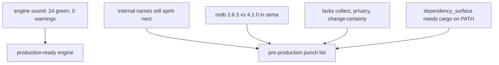
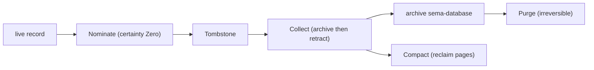

# 62 — Spirit data-lifecycle ladder concept + new-spirit production-readiness

Kind: concept (designer concepts the ladder; operator implements after ratification) + readiness assessment
Topics: spirit, data-lifecycle, archive, collect, compact, purge, restore, new-spirit, production-readiness, privacy
Date: 2026-06-04

## Intent Anchors

[The data-lifecycle ladder is a closed named set worth building — nominate, tombstone, archive, collect, compact, purge — rather than ad-hoc operations; the designer concepts it; it lands on the new schema-derived spirit.] (Spirit 2539 Decision High)

[The new schema-derived spirit is the forward target and is nearly ready to move to production; new functionality targets it; a heavy formal cutover plan is not wanted — we are in very early territory; move when it is close enough; assess how close.] (Spirit 2540 Decision High)

[When a record moves into the archive its privacy variable moves with it and is preserved; archive reads honor the same explicit privacy discipline as the live store.] (Spirit 2541 Decision High)

[Every architecture file carries a Possible future design section; Restore — re-asserting archived records back into the hot store, the inverse of collect — is the first such entry, a possible future feature not current work.] (Spirit 2538 Principle High)

[Retract is destructive — a retracted record becomes unrecoverable; callers that might need a removed record back must capture it before retracting.] (sema-engine ARCHITECTURE)

## 1. Frame — your reactions, recorded

- **P1 Restore → deferred.** Restore is a possible future feature, not now. It lives in the new "Possible future design" architecture section (§5), and that section is now a standard part of every architecture file (`skills/architecture-editor.md` updated).
- **P2 lifecycle ladder → ratified, concept it, on the new spirit.** This report §3 is the concept. It lands on the new schema-derived spirit, not the hand-written production daemon, since it is a large feature.
- **P3 archive privacy → the privacy variable moves with the record.** Privacy is preserved through every move (§3 makes it a property of every rung).
- **P4 cutover → don't over-formalize; early territory; nearly ready to move.** No heavy cutover plan. Instead, a readiness assessment (§2) and the punch list of what stands between the new spirit and production.

## 2. Production-readiness assessment — the new spirit (how close?)

You asked how close the new schema-derived spirit (now the repo `spirit`,
package still `spirit-next 0.1.0`) is to production use. I built and tested it.

### Build and test

`cargo test` on `/git/github.com/LiGoldragon/spirit`:

- **24 tests pass, 0 failed, 0 compiler warnings** across the real surfaces —
  20 runtime-triad tests, 3 socket negative tests, 1 doctest. The runtime is
  genuinely exercised: tests named
  `nexus_runner_loop_routes_record_input_to_sema_write_command_then_back_to_reply`,
  `signal_actor_pushes_accepted_message_through_sent_hook_before_nexus_holds_mail`,
  `sema_store_persists_records_across_reopen_of_the_same_sema_file`,
  `sema_engine_observes_through_shared_reference_for_parallel_readers` — the
  record-970 Signal→Nexus→SEMA flow, the mail hook, durable reopen, and the
  parallel-read split are all witnessed.
- **One test target fails for an environment reason, not a code defect:**
  `dependency_surface` (2 tests) shells out to `cargo tree` to assert the
  dependency surface (binary-only has no `nota-next` runtime dep; text-client
  does), and `cargo` is not on PATH in this sandbox
  (`Os { code: 2, kind: NotFound }`). These are *good* constraint-witness
  tests — they just need `cargo` available to run. Not a blocker on the code.

So the engine is sound: real, tested, schema-derived, warning-free.

### The gap to production is naming, redb, and feature parity — not engine soundness



The punch list, in priority order:

1. **Internal name rename** — package, library, binaries, repository URL still
   say `spirit-next`; the repo-level rename to `spirit` landed but the code did
   not (operator 304's slice).
2. **Storage-kernel adoption (the redb split, really).** The new spirit
   hand-rolls its own redb store *directly* — `store.rs` does
   `use redb::{Database, …}` on redb `2.6.3` and writes its own
   `From<redb::*Error>` impls. It does **not** use the workspace storage kernel
   `sema`/`sema-engine`, which are on redb `4` (a different major with an
   incompatible on-disk format and a changed API). So the gap is not a version
   bump — it is a kernel decision. The archive (§3) is built on `sema-engine`
   (redb 4); bolting it onto the bespoke redb-2 store would link **two redb
   majors in one binary** (two `Database` types, two file formats, no interop).
   The clean move is to put the new spirit's SEMA plane on `sema-engine` too —
   that unifies on redb 4, removes the dual-redb risk, and gives it the typed
   kernel, the schema-version guard, the rkyv table machinery, and the
   `CommitSequence` handover marker the rest of the stack already uses. Do it
   **now**, before the pilot has any deployed redb-2 data, so there is no
   file-format migration debt — exactly the early-territory window.
3. **Daily-use feature parity** — the new spirit has `Record/Observe/Lookup/
   Count/Remove/LookupStash` but lacks `CollectRemovalCandidates`, privacy
   filtering, and `ChangeCertainty` (the thread you have been driving). For
   production use as the intent daemon, at least the privacy split (2272) and
   collect (the ladder) need to land here.
4. **`dependency_surface` environment** — make `cargo` reachable in the test
   sandbox so the constraint witnesses run.

**Verdict:** "almost ready" is accurate. The engine is production-grade today;
the distance to production is the rename + redb + the daily-use surface, all
mechanical or already-designed, none a soundness question. Moving to the new
spirit is a matter of closing this punch list, not re-proving the architecture.

## 3. The data-lifecycle ladder concept (closed set, on the new spirit)

The ladder is a **closed, named set** of operations on a record's lifetime —
not ad-hoc verbs. Each rung has a typed outcome (no string messages, per the
typed-feedback direction), and **privacy is preserved through every move**
(2541).

| Rung | What it does | Reversible? | Typed outcome |
|---|---|---|---|
| **Nominate** | mark a record removal-candidate (`ChangeCertainty` to Zero) | yes (change certainty back) | `CertaintyChanged` |
| **Tombstone** | explicit "scheduled for removal" marker, stronger than Zero | yes (until collected) | `Tombstoned` |
| **Archive** | capture into the archive sema-database (one family, named by content; privacy carried) | n/a (additive) | `Archived(ArchiveReceipt)` |
| **Collect** | combined archive-then-retract (the existing Reading-B handler) | no (retracted from hot store, but recoverable from archive) | `RemovalCandidateOutcome` |
| **Compact** | reclaim the hot db's freed pages after retraction (redb is copy-on-write) | n/a (maintenance) | `Compacted(SpaceReclaimed)` |
| **Purge** | hard-delete archived records past a retention class — the archive's own collect | **no — the only irreversible rung** | `Purged(PurgeReceipt)` |

The shape is one closed enum, schema-emitted so it reads as the component's
lifecycle contract (the schema-IS-the-architecture property the new spirit
already lives — 94 schema lines emit 1951 Rust):

```
# the ladder as a closed operation set in the schema header (bare-name form)
[Record Observe ... Nominate Tombstone Archive Collect Compact Purge]
```

```rust
// Each rung returns a typed outcome; the name carries the meaning (1611).
pub enum LifecycleOutcome {
    Nominated(RecordIdentifier),
    Tombstoned(RecordIdentifier),
    Archived(ArchiveReceipt),
    Collected(RemovalCandidateOutcome),   // archive (capture) then retract
    Compacted(SpaceReclaimed),
    Purged(PurgeReceipt),                 // the one irreversible rung
}
```



Two load-bearing properties:

- **Privacy moves with the record (2541).** Archive stores each record at its
  original privacy level; the retrieval tool gates reads behind the same
  explicit privacy query (2272) the live store uses. The archive is never a
  privacy back door.
- **Recoverable until Purge.** Nominate/Tombstone are reversible; Collect
  removes from the hot store but the record survives in the archive; only Purge
  is irreversible. This is the durable answer to sema-engine's destructive
  Retract: the archive is the capture, and the lifecycle preserves
  recoverability up to the single explicit irreversible rung.

## 4. Where it lands

On the new schema-derived spirit (2539), which today has neither collect nor
the archive. So the ladder is part of the same arc that closes the readiness
punch list (§2): the new spirit gains the daily-use surface (privacy split +
collect) and then the full ladder, rather than the ladder being built twice
(once in production, once in the new spirit). This is consistent with the
forward-target direction (2540) — build it where the system is going, not where
it has been.

## 5. Possible future design (modeling the standard section)

This section demonstrates the every-architecture-file discipline now in
`skills/architecture-editor.md`. It is the content the operator drops into
`/git/github.com/LiGoldragon/spirit/ARCHITECTURE.md` under a `## Possible
future design` heading:

- **Restore** — re-assert archived records back into the hot store, the inverse
  of Collect. Deferred (2538): slated as a possible future feature, not current
  work. Open question when revisited: does Restore reverse a Collect by id, or
  re-import a whole archive? It closes the collect/archive loop when built.
- **Tombstone as a distinct marker** — open question: is a separate Tombstone
  rung needed, or is Zero-certainty (Nominate) sufficient as the
  scheduled-for-removal marker? Considered: Zero-only (simpler) vs explicit
  Tombstone (clearer intent). Undecided.
- **Retention classes for Purge** — open question: what policy governs when
  archived records become purgeable (age, count, an explicit retention tag)?
  Purge is the only irreversible rung, so its policy wants deliberate design.

## 6. For the operator

Folding the ratified decisions (reports 60, 61) plus this concept, on the new
spirit as the forward target, each its own version bump per
`skills/versioning.md`:

1. **Close the readiness punch list** — internal name rename (`spirit-next` →
   `spirit`), redb unification (`2.6.3` → `4.1.0`), `dependency_surface` env.
2. **Daily-use parity on the new spirit** — privacy split (`PublicRecordQuery`
   no privacy knob; `PrivacyScopedQuery` carrying `AtMost`/`Exact`/`AtLeast`,
   2272); typed feedback (`RejectionReason`, schema-emitted; 1611).
3. **The archive** — `sema-engine`-backed archive (one family, named by
   content), privacy preserved (2541), retrieval tool that gates private reads.
4. **The ladder** — Nominate, Tombstone, Archive, Collect (reshaped
   `OutputTarget`: `Archive(location)` | `Print(stream)`, 2271), Compact, Purge
   — as the closed `LifecycleOutcome` set.
5. **Possible-future-design section** — add it to the new spirit's
   `ARCHITECTURE.md` with Restore + tombstone-question + retention-classes (§5).

Nothing is landed until an operator integrates it to main (Spirit 1568). The
verified repetition cleanups on branch `spirit-repetition-cleanups` (report 59
§5) remain an independent prerequisite. The cutover is not formalized (2540) —
the new spirit becomes production when the punch list closes.

## See also

- `reports/system-designer/61-spirit-situation-projection-engine-analysis-proposals-2026-06-04.md` — the situation + engine analysis these decisions react to.
- `reports/system-designer/60-spirit-archive-privacy-typed-feedback-concept-2026-06-04.md` — the archive/privacy/typed-feedback concept the ladder extends.
- `reports/operator/304-Psyche-repository-stack-state-2026-06-04.md` — the rename/topology and the operator's parity leans.
- `skills/architecture-editor.md` — updated: the Possible-future-design section is now standard in every architecture file.
- `skills/versioning.md` — the version-magnitude discipline (major reserved to the psyche).
- `/git/github.com/LiGoldragon/spirit` — the new (schema-derived) Spirit, assessed in §2.
- `/git/github.com/LiGoldragon/sema-engine/ARCHITECTURE.md` — the archive's storage substrate + the destructive-Retract rationale.
- Spirit 2538-2541 (today's ratifications), 2271-2273 (output-target/privacy/version), 1608-1611 (archive/privacy/feedback), 1571 (privacy clarity).
