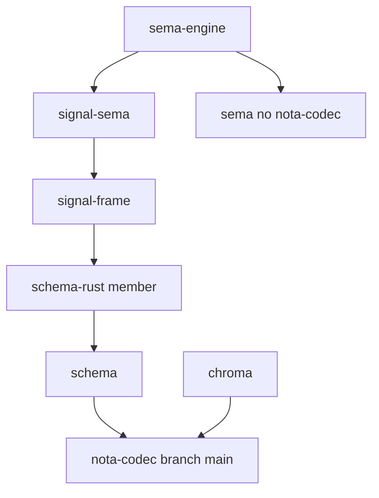

# nota-codec entanglement — version delta and dependency graph (angle 1)

The conflict is real but its topology is sharper than the brief's framing: `nota-codec` has a **single linear history**, not two divergent branches. The chroma seed pins `538555e` ("nota-codec support bracket strings", 2026-05-21) which has BOTH `Token::Str` AND bracket strings but NO structural-shape layer; the schema chain's lockfiles pin `d00fbf5` (2026-05-25 12:26) which adds the `NotaRecordShape` / `NotaMapEntry` shape layer but STILL carries `Token::Str`; and the live `branch = "main"` tip is `24e7823` (HEAD, 2026-05-27), which sits past `f761421` ("reject quoted string delimiters", 2026-05-25 23:09) where `Token::Str` was deleted and `"` became a hard `Error::QuoteStringDelimiter`. Every repo in the chain — chroma, sema-engine, signal-sema, signal-frame (incl. its `schema-rust` and `macros` members), and schema — declares `nota-codec = { branch = "main" }`, so the only thing holding the collision off is each repo's pinned `Cargo.lock` rev. The instant any of them is re-resolved (`cargo update -p nota-codec`, a fresh checkout, or a CI without the lock), they all unify on HEAD `24e7823`, and chroma's `Token::Str` match + its hand-rolled bracket-to-quote re-encoder stop compiling. The schema chain is already fine at HEAD; chroma is the lone holdout that depends on removed migration-only API.

## Confirmed revs (verified against current source, not the brief)

The brief's two revs are both real commits, but the "old chroma pins / current chain needs" split needs correction. The actual pins:

| Consumer | `Cargo.lock` nota-codec rev | Date | Has `Token::Str`? | Has shape layer? |
|---|---|---|---|---|
| chroma | `538555e` | 2026-05-21 | yes | no |
| sema-engine | `538555e` | 2026-05-21 | yes | no |
| signal-sema | `d00fbf5` | 2026-05-25 12:26 | yes | yes |
| signal-frame | `d00fbf5` | 2026-05-25 12:26 | yes | yes |
| schema | `d00fbf5` | 2026-05-25 12:26 | yes | yes |
| `branch = "main"` tip (HEAD) | `24e7823` | 2026-05-27 | **no** | yes |

Two surprises versus the brief. First, **sema-engine's own lock pins `538555e`** — the same old rev as chroma, not a newer one; its lock has simply not been refreshed since the shape layer landed. Second, **none of the pinned revs is the quote-rejecting `f761421`/HEAD** — every committed lock still has `Token::Str`. The break is latent, gated entirely by stale lockfiles, and fires on the next resolve to `branch = "main"`.

Ancestry, verified with `git merge-base --is-ancestor`: the history is strictly linear — `538555e` → `323a3a7`/`a7aa75b`/`6a851eb` (shape layer) → `d00fbf5` → `9e855d4` → `f348d2c` → `f761421` (quote removal) → `24e7823` (HEAD). `538555e` predates `f761421`; `d00fbf5` is an ancestor of `f761421`; `f761421` is an ancestor of HEAD. There is no fork — only a sliding pin along one line.

## API / behavior delta — `538555e`/`d00fbf5` → HEAD

### Removed at `f761421` ("reject quoted string delimiters")

The `Token` enum lost its string variant. Verbatim from the diff:

```
-    Str(String),
```

and the lexer's quote entry point changed from accepting a legacy quoted string to a hard error:

```
-            b'"' => self.read_legacy_quote_string(),
+            b'"' => Err(Error::QuoteStringDelimiter { offset: self.pos }),
```

The whole legacy quoted-string machinery was deleted: `read_legacy_quote_string`, `read_inline_string` (with its `\\ \" \n \t \r` escape table), and `read_multiline_string` (the `""" """` triple-quote / auto-dedent path) — 95 lines removed from `lexer.rs`, plus the matching `Error` variants (`UnterminatedInlineString`, `NewlineInInlineString`, `UnterminatedEscape`, etc.) collapsed to the single `Error::QuoteStringDelimiter { offset }` (current `src/error.rs:121`). This is the codec structurally enforcing the workspace root discipline: NOTA strings come exclusively from bracket forms; the encoder cannot emit a quote and the lexer now refuses to read one.

### Added before that, at `323a3a7`/`a7aa75b`/`6a851eb` ("structural value shape layer")

The shape layer that the schema-macro chain needs (`src/value.rs`, exported from `src/lib.rs:27`): `NotaValue`, `NotaDocument`, `NotaAtom`, `NotaValueKind`, `NotaString` + `NotaStringKind` (whose only variant is `Block` — bracket-form only), and the borrow-view shapes `NotaRecordShape<'value>`, `NotaSequenceShape<'value>`, `NotaMapShape<'value>` plus the `NotaMapEntry { key, value }` record. `as_record_shape()`, `as_map()`, `entries()`, and `NotaMapEntry::value` give the macro passes a way to inspect NOTA shape before handing sub-objects to typed decoders. Confirmed absent at chroma's `538555e` pin (`git show 538555e:src/value.rs | grep -c NotaRecordShape` → `0`) and present from `323a3a7` onward.

### Net delta a consumer sees moving its pin to HEAD

Gained: the structural-shape API (`NotaRecordShape`, `NotaMapEntry`, `NotaMapShape`, `NotaSequenceShape`, `NotaValueKind`, `NotaString`/`NotaStringKind`). Lost: `Token::Str` and any ability to lex a `"`-delimited string — `"` is now a compile-surviving but parse-time `Error::QuoteStringDelimiter`.

## Where the single-version unification collides

Cargo unifies a git dependency to ONE resolved rev per `source` (here `git+...nota-codec.git?branch=main`) across a build graph. So any workspace or transitive graph that contains both chroma and the schema chain — or that simply re-resolves chroma's lock — must land all of them on one nota-codec rev.

- The **schema chain is already HEAD-clean.** signal-sema / signal-frame / schema use the shape layer and (where they touch strings) bracket forms; moving them from their `d00fbf5` pin to HEAD `24e7823` is a no-op for the quote removal (they don't lex quotes) and keeps the shape layer they need. They are not the problem.
- **chroma is the holdout.** It is pinned to `538555e` *specifically because* `src/config.rs` consumes the removed API. Two hard dependencies on the old codec:

  `src/config.rs:17` imports the token type:
  ```rust
  use nota_codec::{Lexer, Token};
  ```
  `src/config.rs:101` matches the removed variant:
  ```rust
  Token::Ident(value) | Token::Str(value) => {
  ```
  At HEAD `Token` has no `Str`, so this arm fails to compile — chroma cannot be unified onto any rev `>= f761421`.

The collision is therefore not "two repos need two different revs of a shared lib at the same time in one graph" (chroma and the schema chain are not currently in a single cargo graph together); it is **"chroma is frozen below `f761421` while the shared `branch = "main"` it declares has moved past it."** Porting chroma to the current sema-engine pulls in the schema chain, which is happy at HEAD, which forces a resolve to HEAD, which is exactly the rev chroma's config code cannot compile against. The lock pin is load-bearing; remove it and chroma breaks.

## The deeper chroma violation (relevant to the fix, not just the version)

chroma doesn't merely match `Token::Str`; it actively manufactures quoted strings to feed the old lexer. `src/config.rs:97` and `:119` run a **hand-rolled lexer** `config_text_with_bracket_strings_as_quoted` that walks bytes and rewrites every bracket string `[...]` / `[| |]` BACK into a `"`-quoted string via `push_quoted_string` (`:128`, `:133`), then lexes the rewritten text. Verbatim, `src/config.rs:119-135`:

```rust
fn config_text_with_bracket_strings_as_quoted(text: &str) -> Result<String> {
    let mut output = String::with_capacity(text.len());
    let mut offset = 0;
    while offset < text.len() {
        let bytes = text.as_bytes();
        match bytes[offset] {
            b'[' if bytes.get(offset + 1) == Some(&b'|') => {
                offset += 2;
                let value = read_config_block_string(text, &mut offset)?;
                push_quoted_string(&mut output, &value);
            }
            b'[' => {
                offset += 1;
                let value = read_config_bracket_string(text, &mut offset)?;
                push_quoted_string(&mut output, &value);
            }
            b'"' => copy_config_quoted_string(text, &mut offset, &mut output)?,
```

This is the exact inversion of the root discipline — it turns bracket forms (the only legitimate NOTA string form) into quoted strings so a quote-accepting lexer can read them — and it is a bespoke parser, both violations the brief names. These are also free functions (`fn config_text_with_bracket_strings_as_quoted`, `read_config_block_string`, `push_quoted_string`, `copy_config_quoted_string`, `read_config_bracket_string`, `copy_config_comment`), so the file also violates the method-only rule. The correct fix is not "re-pin nota-codec for chroma" but "delete chroma's quote re-encoder and shape-token scanner; decode `config.nota` through `NotaDecode` / `NotaRecordShape` on current nota-codec." That dissolves the version entanglement at the source rather than perpetuating the stale pin.

## Dependency chain

`sema` is a sibling leaf (deps are only `redb` / `rkyv` / `thiserror`); it does NOT depend on nota-codec. The nota-codec edge enters the sema-engine graph via `signal-sema`, not via `sema`. `schema-rust` is a workspace member of `signal-frame` (`signal-frame/Cargo.toml` `members = [".", "macros", "schema-rust"]`), and `signal-frame/schema-rust/Cargo.toml` depends on `schema` which depends on `nota-codec`.



All consumers declare `branch = "main"`; the divergence lives only in each repo's `Cargo.lock` (chroma+sema-engine at `538555e`, signal-sema/signal-frame/schema at `d00fbf5`, live tip `24e7823`). One `source`, one unified rev on resolve — and chroma's `config.rs` is the only code that cannot survive that unification.
