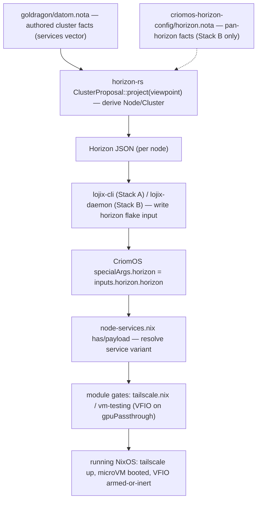

# Cluster data — the Horizon model across horizon-rs and CriomOS

System-designer lane. 2026-06-04. Engine / explanation report. Foregrounds
schema and data: what is authored, what it projects to, and the runtime it
creates. The just-landed `VmTesting` node-service (report 69, on the `next`
branches) is the worked example.

The question this report answers: when the LiGoldragon cluster wants a node to
do something — join the tailnet, serve a nix cache, run a VM-testing harness —
where is that fact written, how does `horizon-rs` turn it into a per-node view,
and how does CriomOS turn that view into running NixOS config? The whole path is
**authored NOTA facts → horizon-rs projection → CriomOS node config → runtime**,
and it exists today in two parallel deploy stacks that must not be conflated.

## 1. What cluster data IS — the Horizon model

`horizon-rs` is the Rust model of a cluster. It has two halves: an **input**
shape (the proposal — raw authored facts, no derived fields) and an **output**
shape (the projected `Horizon` — one node's full enriched view, every computed
field present). The single entry-point is `ClusterProposal::project(viewpoint)`.

The top input record is the cluster proposal — nodes, users, domains, trust
(`horizon-rs/lib/src/proposal.rs:26`):

```rust
#[derive(Debug, Clone, Serialize, Deserialize, NotaRecord)]
#[serde(rename_all = "camelCase")]
pub struct ClusterProposal {
    #[serde(default)]
    pub nodes: BTreeMap<NodeName, NodeProposal>,
    #[serde(default)]
    pub users: BTreeMap<UserName, UserProposal>,
    #[serde(default)]
    pub domains: BTreeMap<DomainName, DomainProposal>,
    pub trust: ClusterTrust,
}
```

A node carries its species, machine, keys, network facts, and — the part this
report follows — its **service roles** (`proposal.rs:38`, fields elided):

```rust
pub struct NodeProposal {
    pub species: NodeSpecies,
    ...
    /// Per-node service roles. This is cluster role data: consumers
    /// must not infer it from node names, and role variants must not
    /// carry CriomOS-standard ports, domains, or implementation
    /// defaults.
    #[serde(default)]
    pub services: Vec<NodeService>,
}
```

`NodeService` is the closed set of role variants. Note the design rule baked
into the doc comments: a variant names a *role*, never CriomOS implementation
details (ports, domains, defaults). Those belong to CriomOS, the consumer
(`proposal.rs:98`):

```rust
#[derive(Debug, Clone, PartialEq, Eq, Serialize, Deserialize)]
#[serde(rename_all_fields = "camelCase")]
pub enum NodeService {
    /// Join the cluster tailnet. CriomOS currently renders this with
    /// Tailscale.
    TailnetClient {},
    /// Host the cluster tailnet controller. CriomOS derives the
    /// Headscale port and MagicDNS base domain.
    TailnetController {},
    /// Receive remote Nix builds. `maximum_jobs` is cluster-authored
    /// capacity policy; absent means one job at a time.
    NixBuilder {
        #[serde(default)]
        maximum_jobs: Option<u32>,
    },
    /// Serve a cluster Nix binary cache. CriomOS owns the service port
    /// and signing-key path.
    NixCache {},
    /// Host Persona development infrastructure. ...
    PersonaDevelopment {
        #[serde(default)]
        capabilities: Vec<PersonaDevelopmentCapability>,
    },
}
```

The output side is the projected `Node` — the enriched per-node view with every
computed field present, plus viewpoint-only fields filled for the one node the
projection is *for* (`horizon-rs/lib/src/node.rs:29`, abridged):

```rust
pub struct Node {
    // input pass-through (always present)
    pub name: NodeName,
    pub species: NodeSpecies,
    pub machine: Machine,
    pub node_ip: Option<NodeIp>,
    /// Per-node service roles. Projected from proposal data; never
    /// inferred from the node name.
    pub services: Vec<NodeService>,

    // identity / connectivity (always derived)
    pub criome_domain_name: CriomeDomainName,
    pub system: System,
    ...
    // computed booleans (always derived)
    pub is_remote_nix_builder: bool,
    pub is_nix_cache: bool,
    ...
}
```

The cluster-level roll-up is small — identity plus a couple of fan-in lists
(`horizon-rs/lib/src/cluster.rs:10`):

```rust
pub struct Cluster {
    pub name: ClusterName,
    /// Derived MagicDNS domain for the cluster tailnet.
    pub tailnet_base_domain: DomainName,
    /// One entry per node that has a nix signing key.
    pub trusted_build_pub_keys: Vec<NixPubKeyLine>,
}
```

And the thing CriomOS actually receives — `Horizon`, the view from one node
(`horizon-rs/lib/src/horizon.rs:18`):

```rust
pub struct Horizon {
    pub cluster: Cluster,
    pub node: Node,
    pub ex_nodes: BTreeMap<NodeName, Node>,
    pub users: BTreeMap<UserName, User>,
}
```

`node` is "me", `ex_nodes` is "every other node from my viewpoint", `cluster` is
the roll-up, `users` is the user set. Every node deploys with its own `Horizon`.

## 2. Where it's authored — the cluster facts

The production cluster facts live in `goldragon/datom.nota` — one positional
NOTA `ClusterProposal` record (source-declaration order, no field keywords,
bracket strings). Here is `prometheus`, the cluster router, verbatim
(`goldragon/datom.nota:58`, abridged to the head and the services tail):

```nota
    prometheus (LargeAiRouter
      Max
      Max
      (Metal (Some X86_64) 8 (Some [GMKtec EVO-X2]) None None None None (Some 128))
      ...
      (Some (eno1 wlp195s0 TwoG 6 Wifi4 (Some (routerWifiSaePasswords)) (Some (wlp199s0f0u4 criome-backup TwoG 11 Wifi4 (routerBackupWifiPassword)))))
      (Some True)
      [(TailnetClient) (NixBuilder (Some 6)) (NixCache)])
```

That trailing vector `[(TailnetClient) (NixBuilder (Some 6)) (NixCache)]` is the
`services: Vec<NodeService>` field — prometheus joins the tailnet, accepts six
parallel remote nix builds, and serves the cluster cache. Compare `ouranos`,
which additionally hosts the tailnet controller and the git receive surface
(`datom.nota:57`):

```nota
      [(TailnetClient) (TailnetController) (NixBuilder None) (PersonaDevelopment [(GitoliteServer)])])
```

This file is the entire authored cluster-role surface for the production stack.
A node "becomes" a cache or a builder by editing this vector — nothing in CriomOS
keys off node names.

## 3. How horizon-rs processes/projects it

`ClusterProposal::project(&viewpoint)` is the whole engine
(`horizon-rs/lib/src/horizon.rs:33`). It validates cluster-wide invariants,
projects every node, fills viewpoint-only fields on the one node, then drops the
viewpoint from `ex_nodes`:

```rust
pub fn project(&self, viewpoint: &Viewpoint) -> Result<Horizon> {
    if !self.nodes.contains_key(&viewpoint.node) {
        return Err(Error::NodeNotInCluster(viewpoint.node.clone()));
    }
    let cluster_trust_floor = self.trust.cluster;
    self.validate_tailnet_controller_singleton(cluster_trust_floor)?;
    // Build every Node (no viewpoint fill yet).
    ...
}
```

Service roles drive two kinds of derivation. First, **cluster invariants** — a
cluster may name at most one tailnet controller, checked by scanning the
`services` vectors (`horizon.rs:148`):

```rust
fn validate_tailnet_controller_singleton(&self, cluster_trust_floor: Magnitude) -> Result<()> {
    let mut server: Option<NodeName> = None;
    for (name, proposal) in &self.nodes {
        ...
        if !proposal.has_service(NodeServiceKind::TailnetController) {
            continue;
        }
        if let Some(first) = server {
            return Err(Error::MultipleTailnetControllers { first, second: name.clone() });
        }
        server = Some(name.clone());
    }
    Ok(())
}
```

Second, **derived per-node booleans**. The raw service role plus trust/key/online
facts collapse into the computed flags CriomOS gates on
(`horizon-rs/lib/src/node.rs:363`):

```rust
let is_remote_nix_builder = self.has_service(NodeServiceKind::NixBuilder)
    && online
    && is_fully_trusted
    && has_base_pub_keys;
...
let is_nix_cache = self.has_service(NodeServiceKind::NixCache)
    && online
    && is_fully_trusted
    && has_base_pub_keys;
```

`has_service` is the projection-side reader over the typed vector
(`proposal.rs:277`):

```rust
pub fn has_service(&self, kind: NodeServiceKind) -> bool {
    self.services.iter().any(|service| service.is_kind(kind))
}
```

Identity is derived too. The Criome domain is computed from node + cluster name,
never authored (`horizon-rs/lib/src/name.rs:101`):

```rust
pub fn for_node(node: &NodeName, cluster: &ClusterName) -> Self {
    Self(format!("{node}.{cluster}.criome"))
}
```

The CLI wrapper is thin: read proposal NOTA on stdin, project for a
`--cluster`/`--node` viewpoint, write `Horizon` JSON on stdout
(`horizon-rs/cli/src/main.rs:63`):

```rust
let horizon = match proposal.project(&viewpoint) { ... };
let json = serde_json::to_string_pretty(&horizon) ...;
```

## 4. How CriomOS consumes it

CriomOS receives the projected `Horizon` JSON as a flake input and reads it as a
NixOS module argument. The flake input is `horizon`, and the projected object is
handed to every module via `specialArgs` (`CriomOS/.../flake.nix:85`,`126`):

```nix
horizon = inputs.horizon.horizon;
...
specialArgs = {
  inherit horizon system deployment ...;
};
```

So every CriomOS module can take `{ horizon, ... }` and read `horizon.node`,
`horizon.cluster`, `horizon.exNodes` (camelCase — serde renamed the Rust fields).

### Resolving a node-service variant — node-services.nix

The bridge between "the projected `services` vector" and "should this module turn
on" is `modules/nixos/node-services.nix`. It treats each service as either a bare
string (`TailnetClient`) or a single-key attrset (`{ VmTesting = {payload}; }`),
and exposes `has` / `payload` (`CriomOS/.../node-services.nix:37`):

```nix
rec {
  has = services: name: builtins.any (service: serviceName service == name) (servicesList services);

  payload =
    services: name:
    let
      matches = builtins.filter (service: serviceName service == name) (servicesList services);
    in
    if matches == [ ] then { } else servicePayload (head matches) name;
  ...
}
```

The simplest consumer is the `TailnetClient` pattern — gate the whole module on
`has` (`CriomOS/.../network/tailscale.nix:11`):

```nix
config = lib.mkIf (nodeServices.has (node.services or [ ]) "TailnetClient") {
  # Phase 1 scaffolding only: enrollment remains manual.
  services.tailscale = {
    enable = true;
    openFirewall = true;
  };
};
```

That is the canonical shape: cluster authors the role; CriomOS owns the
implementation (tailscale, firewall) the role renders into.

### The worked example — VmTesting + gpuPassthrough

The new `VmTesting` service follows the identical pattern but carries a payload.
The module reads `has` to enable and `payload` to pull per-node fields, with
chosen-adjustable defaults (`CriomOS/next/.../vm-testing/default.nix:48`):

```nix
enabled = nodeServices.has (node.services or [ ]) "VmTesting";
payload = nodeServices.payload (node.services or [ ]) "VmTesting";

gpuPassthrough = payload.gpuPassthrough or false;
display = payload.display or "Spice";
gpu = payload.gpu or null;
```

The Criome domain is rendered from horizon-derived cluster facts — never a Nix
control-flow predicate on a node name, per CriomOS's network-neutrality rule
(`vm-testing/default.nix:63`):

```nix
clusterName = cluster.name or node.name;
criomeDomain = "vm-testing.${clusterName}.criome";
...
rawNodeIp = node.nodeIp or null;
nodeAddress = if rawNodeIp == null then null else head (split "/" rawNodeIp);
```

The base config installs the QEMU/KVM runtime, publishes the domain as a
`networking.hosts` entry, surfaces a structured projection for the domain-criome
path, and declares the persistent routed test microVM
(`vm-testing/default.nix:113`, abridged):

```nix
config = mkIf enabled (mkMerge [
  {
    virtualisation.libvirtd.enable = mkDefault true;
    environment.systemPackages = with pkgs; [ qemu_kvm OVMF.fd ] ++ ...;
    networking.hosts = optionalAttrs (nodeAddress != null) {
      "${nodeAddress}" = [ criomeDomain ];
    };
    criomos.vmTesting = {
      enable = true;
      inherit display gpuPassthrough gpu criomeDomain;
      address = nodeAddress;
      vfioArmed = gpuPassthrough;
    };
    microvm = lib.mkIf haveMicrovm { vms.vm-testing = { ... }; };
  }
```

The data-gated half is VFIO. It arms **only** when `gpuPassthrough = true` — a
separate `mkIf` branch, inert when the payload says false
(`vm-testing/default.nix:190`):

```nix
  (mkIf gpuPassthrough {
    boot.kernelParams = [ "intel_iommu=on" "amd_iommu=on" "iommu=pt" ]
      ++ optionals (gpu != null) [ "vfio-pci.ids=${gpu}" ];
    boot.kernelModules = [ "vfio_pci" "vfio" "vfio_iommu_type1" ];
    boot.initrd.kernelModules = [ "vfio_pci" "vfio" "vfio_iommu_type1" ];
  })
]);
```

The module is wired into the top aggregate and pulls in the microvm.nix host
module only when the flake input is present (`CriomOS/next/.../criomos.nix:38`):

```nix
  ++ [ ./metal/default.nix ./router/default.nix ./vm-testing/default.nix ]
  ++ lib.optionals (inputs ? microvm) [ inputs.microvm.nixosModules.host ];
```

### Honest gap — VmTesting is not yet authored as a typed service

This is the one place the layers are not yet end-to-end. `VmTesting` is **not** a
variant of the Rust `NodeService` enum in either horizon-rs branch, and it is
**not** in `goldragon/datom.nota`. The CriomOS module resolves it purely through
the string/attrset-based `node-services.nix`, which accepts any service name the
projected JSON happens to carry. The landed work proves the module end with a
synthetic horizon fixture in the eval check
(`CriomOS/next/checks/vm-testing-prometheus-policy/default.nix:80`):

```nix
  prometheusHorizon = {
    cluster.name = "criome";
    node = {
      name = "prometheus";
      ...
      services = [
        {
          VmTesting = {
            gpuPassthrough = false;
            display = "Spice";
          };
        }
      ];
    };
  };
```

So the projection-side type and the authored fact for `VmTesting` are still to
land; only the consumption end is built and tested. Closing the loop means adding
a `VmTesting { gpu_passthrough, display, gpu }` variant to `NodeService` (with its
`NotaEncode`/`NotaDecode`, mirroring `NixBuilder`) and authoring it in the cluster
facts — at which point the worked example would flow from authored NOTA all the
way to the running microVM with no fixture.

## 5. The two deploy stacks

Per `primary/protocols/active-repositories.md` §"Two deploy stacks coexist",
cluster data is carried by two parallel stacks today. They have **diverged
schemas** and must not be folded together piecemeal.

**Stack A — production today** (running on every node). `main` branches of
`horizon-rs`, `lojix-cli`, `CriomOS`, `CriomOS-home`, `goldragon`. The monolithic
`lojix-cli` projects `horizon-rs/main` over `goldragon/datom.nota` and writes the
flake inputs into CriomOS at deploy time. `lojix-cli`'s `project()` is a thin
wrapper over horizon-rs (`lojix-cli/src/project.rs:18`):

```rust
pub fn project(&self) -> Result<Horizon> {
    self.proposal.project(&self.viewpoint).map_err(Into::into)
}
```

It serializes the projected `Horizon` to `horizon.json` beside a tiny generated
flake whose only output reads that JSON back — that flake becomes the `horizon`
input (`lojix-cli/src/artifact.rs:11`,`65`):

```rust
const HORIZON_FLAKE_TEMPLATE: &str = "{
  outputs = _: {
    horizon = builtins.fromJSON (builtins.readFile ./horizon.json);
  };
}
";
...
pub fn write(&self, horizon: &Horizon) -> Result<()> {
    let json = serde_json::to_string_pretty(horizon)?;
    std::fs::write(self.0.join("horizon.json"), json)?;
    std::fs::write(self.0.join("flake.nix"), HORIZON_FLAKE_TEMPLATE)?;
    Ok(())
}
```

The deploy step then builds the target system with `horizon` (and `system`,
`deployment`, `secrets`) pinned to these generated input dirs by narHash
(`lojix-cli/src/build.rs:310`). There is no daemon, no `lojix` repo, no
`criomos-horizon-config` here. **Production fixes go to Stack A.**

**Stack B — the lean rewrite** (`horizon-leaner-shape` worktrees,
smoke-built, not deployed). Two new repos split out: `lojix` (a daemon
`lojix-daemon` plus a thin `lojix` CLI client) and `criomos-horizon-config` (the
pan-horizon constants previously inlined in goldragon). Stack B's horizon-rs has a
restructured `view/` model, and crucially `project` takes **two** inputs — cluster
facts AND the pan-horizon config — where Stack A's took only a viewpoint. The
lojix daemon loads both and projects (`lojix/.../src/deploy.rs:1077`):

```rust
let horizon_proposal = self.horizon_configuration_source.load()?;
...
let horizon = proposal.project(&horizon_proposal, &viewpoint)?;
```

The pan-horizon config is one small authored record — horizon identity plus the
transitional IPv4 LAN (`criomos-horizon-config/horizon.nota`):

```nota
(HorizonProposal
  LiGoldragon
  (DomainSuffixes [criome] [criome.net])
  (TransitionalIpv4Lan
    [10.18.0.0/24]
    [10.18.0.1]
    (DhcpPool [10.18.0.100] [10.18.0.240])
    [TEMPORARY: single-router IPv4 LAN until IPv6-first networking lands])
  [])
```

ARCHITECTURE.md states the boundary plainly: cluster repos author cluster facts;
this repo authors horizon-wide identity and temporary network facts; horizon-rs
derives views from both; CriomOS owns runtime defaults. **Rewrite edits go to
Stack B.**

**`lojix-cli` vs `lojix`.** `lojix-cli` is the legacy Stack-A monolith (CLI does
project + stage + build + deploy in one process; CriomOS flake locks pin it at
`4c66b8a6fa55`). `lojix` is the Stack-B replacement: a one-crate, two-binary split
— `lojix-daemon` (long-lived orchestrator) and `lojix` (thin NOTA CLI client over
a Unix socket). `lojix-cli` is untouched by the rewrite arc and retires only after
CriomOS migrates to the daemon's projection.

**Where the VmTesting work sits.** The VmTesting feature landed on the CriomOS /
CriomOS-home **`next`** branches (per Spirit 1568 / report 69), which are based on
`main` — i.e. it targets the **Stack A** consumption surface (`node-services.nix`
`has`/`payload`, the `main`-shaped `horizon.node.services` JSON). It is not on
`horizon-leaner-shape`. So: cluster data flows in production through Stack A
today; Stack B is the smoke-built rewrite; and the VmTesting consumption end was
built against Stack A's resolver, fed by a fixture pending the typed/authored
ends.

## 6. The flow



## Anchors

- Stack split + cutover discipline: `primary/protocols/active-repositories.md`
  §"Two deploy stacks coexist".
- VmTesting landing + test evidence: `reports/system-designer/69-criomos-vm-testing-feature-landed-2026-06-04.md`.
- VmTesting concept/design: `reports/system-designer/67-criomos-vm-testing-node-feature-concept-2026-06-04.md`.
