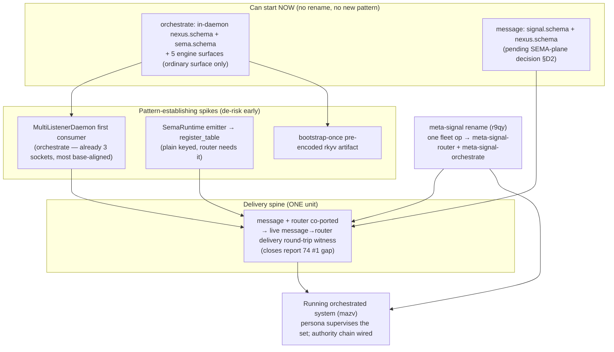

# 75.8 — Overview: bringing message, router, orchestrate to production on the base

Kind: psyche (orchestrator synthesis). Date: 2026-06-05. All claims source-grounded
via reports 1-7; the three port maps were adversarially verified SOUND (report 7).

## The one finding that reframes the task

**All three components are pre-triad-engine.** Not "nearly done" — they are
hand-written daemons (message: one Kameo actor; router: six Kameo child actors over a
raw `sema`; orchestrate: `std::thread` + free functions over the `signal-executor`
stack) carrying the OLD `.concept.schema` (orchestrate also four legacy versioned
schemas). None depends on `triad-runtime` or `schema-rust-next`. So "production on the
new base" is a **port of each onto the spirit-pilot shape**, not an incremental finish.
The domain models are mature and transfer; the *runtime layer* is rebuilt.

## The port shape is identical for all three (the recipe, from report 3)

A production triad daemon is: **three `.schema` files** (`signal`/`nexus`/`sema`) →
`build.rs` emits `src/schema/*.rs` via `schema-rust-next` → **hand-write exactly five
surfaces** (`SignalEngine` triage, `NexusEngine` heavy-logic, `SemaEngine` over
`sema-engine`, the effect handler, the budget-exhausted reply) → a small hand-written
daemon shell on `triad-runtime`'s `SingleListenerDaemon`/`MultiListenerDaemon` → a thin
CLI. The generator writes the runner loop + adapter (`rpr5`); the author writes the
five surfaces (`rpr5`). The **Nexus schema is the load-bearing artifact** (`z6qu`): every
internal decision feature — router's channel adjudication, orchestrate's claim/role
logic, message's stamping/triage — must become a *declared Nexus verb+object*, not the
inline `match` arms they are today. The acceptance test (`vpi8`): if the ported daemon
still carries thick hand-written logic, the schema is incomplete.

**The base is LANDED for this recipe** (report 3 table): `.schema`→rust emission, the
three engine traits + `on_start`/`on_stop` lifecycle, the `NexusEngine::execute` runner
loop + continuation budget, effects, `sema-engine` persistence-across-reopen, the
single-listener daemon, length-prefixed rkyv transport, and the single-NOTA-argument
parser are all committed and tested. The pilot (`spirit`) is the worked example for
every line.

## The base gaps that are real work — but small, and NOT blockers

- **No `triad_main!` macro** — the daemon `main` + listener wiring is hand-written per
  component (budget small real code).
- **`MultiListenerDaemon` is committed + tested but unexercised by any reference
  daemon** — spirit is single-listener. The two-socket components (router, orchestrate;
  and message on its origin-attribution axis) are *pattern-establishing*.
- **The `SemaRuntime` emitter targeting `register_table` (plain keyed) is unproven** —
  spirit's `Store` calls `register_identified_table` once; router needs plain keyed
  append-logs + a triple index. The `sema-engine` API already has both primitives; the
  *emitter path* is the unexercised surface (report 7 downgrade of `ox7e`).
- **The bootstrap-once pre-encoded-policy artifact (`7x50`) has no worked example** —
  router and orchestrate establish it. (And orchestrate's config ingestion still parses
  NOTA *text* at startup — report 7's new catch — so that path also moves to rkyv.)
- **Cross-plane `From`-glue (`plane.rs`) is hand-written** — a `schema-core` candidate,
  not blocking.

Two scares were **retired** by the adversarial pass: the payload-less dual-lowering
(`primary-vllc`) defect is *not grounded in any base repo* and the emitter affirmatively
handles `None`-payload variants (spirit's own enums prove it); and `sema-engine` is not
missing API. Both downgraded from "verify before unblocked" to "low-risk."

## The single shared prerequisite: the meta-signal rename (`r9qy`)

`owner-signal-router` and `owner-signal-orchestrate` must become `meta-signal-router` /
`meta-signal-orchestrate` before either component's **meta-tier** (the second, owner-only
listener socket) can be wired. This is **one fleet rename covering both**, it is
**mechanical** (the standard is already realized — `meta-signal-cloud`, `-domain-criome`,
`-upgrade` exist), and it gates ONLY the meta-tier slice. message has no owner contract,
so the rename does **not** touch it. (Note: the stale `core-signal-*` rename direction
in older spirit records is superseded — target is `meta-signal-*`.)

## The sequenced roadmap

**Wave A — start now (no rename, no new contract):** orchestrate's standalone triad
port (in-daemon `nexus.schema` + `sema.schema` + the five engine surfaces over its
already-`sema-engine` state, ordinary surface only) is the cleanest first move — it is
the most base-aligned (state plane, argv, CLI, two-tier separation already there) and is
the natural **first `MultiListenerDaemon` consumer** (spike S1), so it retires the
two-socket-pattern risk for everyone. message's Signal+Nexus planes can proceed in
parallel once the SEMA-plane decision (§ below) is made.

**The rename slice (`r9qy`):** run once; unblocks the meta tier for router AND
orchestrate. Mechanical.

**Wave B — the delivery spine (message + router as ONE unit):** this is report 74's #1
critical gap. Port router's receive side onto the contract/runner and complete message's
`ForwardToRouter` effect, then the live `message→router` delivery round-trip witness
goes green. Router needs the rename (it has a meta tier); router also drives spike S2
(plain-keyed SEMA tables).

**Wave C — the running orchestrated system (`mazv`):** persona supervises message +
router + orchestrate (+ introspect + schema daemon) as one whole. Gated on the authority
chain (orchestrate cuts over after Spirit + mind) and on `sema-upgrade` covering the
stateful daemons (`veqq`) so deploy→restart→iterate doesn't break on schema drift.

## Per-component one-liners

- **message** — stateless boundary; the smallest port. Recipe: Signal+Nexus planes
  (SEMA carve-out recommended), `MultiListenerDaemon` on its external/internal
  origin-attribution sockets, `ForwardToRouter` as a *declared Nexus effect* (replacing
  today's synchronous `UnixStream` inside a Kameo handler). No meta-signal repo (no
  owner). Fix the live-contract `Assert`/`Match` Sema words. Map: report 4.
- **router** — richest decision + state; a near-rewrite of the runtime layer. The Nexus
  catalog is the whole adjudication engine (authorize / check / one-shot-retire /
  time-bound-expiry / park-retry / deny-reject) made into declared verbs; SEMA = the
  seven delivery/channel tables; harness delivery = a declared effect; two sockets via
  `MultiListenerDaemon`. Needs the rename. Map: report 5.
- **orchestrate** — most advanced, furthest from the runner in one way (free-function
  `std::thread` daemon — the biggest mechanical R26 cleanup). State plane already on
  `sema-engine`. The Nexus catalog is the claim/role/lane/activity/divergence logic.
  Three sockets (ordinary + meta + upgrade) → `MultiListenerDaemon`. Map: report 6.

## The five open decisions for the psyche

1. **Supervision ownership (the #1 decision).** Source + intent say **persona** is the
   manager/supervisor (the privileged `owner-signal-persona` Launch/Retire/Start/Stop
   surface, `tq18`/`mazv`/`kzk5`/`my4g`). Report 6 §7 concludes orchestrate should NOT
   own a manager surface — it should implement the engine-management **child** surface
   (like mind's `supervision.rs`, built on the `on_start`/`on_stop` hooks the port
   introduces), as a post-port slice. This *reverses* report 74's P1 framing ("give
   orchestrate the supervision surface"): orchestrate is the work-layer runtime
   (agent-runs, roles, scheduling); persona is the OS-process supervisor. **Inferred,
   not stated verbatim in intent — needs your confirmation.**
2. **Does message get a SEMA plane?** Recommended: a named Signal+Nexus **stateless
   carve-out** (matches INTENT.md "no durable ledger"; `lc2r`'s "≥3 plane schemas" reads
   as default, not mandate, for a genuinely stateless boundary). Reading (b) — a thin
   durable forwarded-log SEMA — would override INTENT.md and needs explicit intent.
   Decides 2-vs-3 planes for message.
3. **Does the `agent` abstraction (`w4jp`/`gdbf`) land before or after these ports?**
   Router is meant to talk to a new `agent` component (backends persona-claude/-codex/…),
   not the harness directly — which reshapes router's delivery target (the other end of
   message's delivery path). No record sequences this.
4. **Origin-route encoding (`b559`, Medium).** Leading tuple element vs named struct
   field — threads correlation through all three planes. Psyche-gated; a soft blocker on
   each NexusEngine impl.
5. **orchestrate's upgrade socket + upgrade mechanism.** Keep the `signal-version-handover`
   Mirror handover as a third listener (low-risk) vs fold into meta-signal; and is the
   OLD Mirror path the durable upgrade mechanism or does it yield to schema-rust-next
   `UpgradeFrom`/`AcceptPrevious` (PROPOSED, nothing implements it)?

## Who does this, and what this session produced

Per workspace discipline these are code repos under `/git`: **designers author the port
on `~/wt` `next`/feature branches; operators own main + integrate** — and each repo's
`INTENT.md`/`ARCHITECTURE.md` is updated on the *same* port branch (continuous
manifestation; the maps §7/§8 each list the specific edits). This session is the
**design**: the rulebook (report 1), the binding intent (report 2), the build recipe
(report 3), the three verified port maps (reports 4-6), and the adversarial pass (report
7). The next step is the psyche's calls on the five decisions, then the port branches.

## See also

- `1-skills-production-rulebook.md` — the 37-rule rulebook + the per-component checklist.
- `2-intent-agglomeration.md` — the binding intent + the open forks.
- `3-triad-base-state.md` — the build recipe + the landed-vs-blocked table.
- `4`/`5`/`6-*-production.md` — the per-component port maps.
- `7-verification.md` — the adversarial pass (downgrades + the new catch).
- `reports/system-designer/74-engine-forward-exploration-2026-06-05/8-overview.md` —
  the prior engine-forward set (this session sharpens its P1 supervision framing — see
  decision 1).
