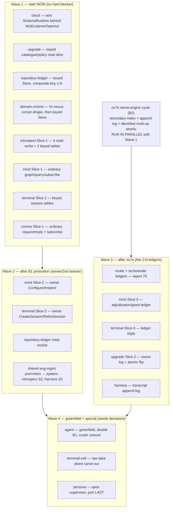

# 77.3 — Overview: the cross-component port roadmap

Synthesis of the all-component sweep (reports `77.0`–`77.2`). The refreshed recipe
(`77.1`) carries the whole fleet; this is how to sequence porting **every** component
onto it. Source-grounded via the sweep (`wnrg3eifm`, 14 agents, ~1.24M tok). Already
designed in report 75: message/router/orchestrate. Pilot: spirit. Multi-listener worked
example: lojix.

## The shape of the work — two blockers and three decisions partition everything

Every remaining component falls out cleanly once you see that the work is gated by exactly
**two engineering blockers** plus **three psyche decisions**:

- **B1 — `meta-signal-*` concept-to-contract promotion.** The dominant blocker, in three
  source-verified severities: **already cleared** (cloud, upgrade — real
  `GenerationPlan::wire_contract` crates; do not re-promote); **promote an existing stub**
  (router, mind, terminal, repository-ledger, orchestrate — vocabulary already designed, so
  transcription not design); **author from scratch** (`owner-signal-criome`,
  `meta-signal-persona` repos are absent; agent needs a DOUBLE promotion). Mechanical —
  lojix already did it for `meta-signal-lojix`.
- **B2 — one `sema-engine` `ox7e` cycle.** The highest-leverage single fix:
  `match_identified` reads are AllRows/ByIdentifier/ByIdentifierRange only (verified
  `engine.rs:707`), no filter, no `subscribe_identified`, no append-log, no identified
  multi-op atomic. Clearing it ONCE unblocks the 1:N-ledger slice of router, orchestrate,
  persona, agent-transcript, upgrade-event-log, harness-transcript, mind-grant-ledger,
  terminal-ledger-triple. Until then, the **composite-key-prefix workaround**
  (repository-ledger, introspect already use it) carries any 1:N that needs neither
  engine-side filtered reads nor atomic multi-table commit.
- **Three psyche decisions** (see §"Decisions for the psyche").

## The waves

**Wave 1 — start now, fully unblocked** (cloud, upgrade-readpath, repository-ledger,
domain-criome, introspect-S1, mind-S1, terminal-S1, criome-S1). Each has a first slice that
dodges both hard blockers using keyed tables + daemon-layer push. **cloud is the fastest
win** (everything authored; just wire the daemon). These exercise the spirit/lojix
templates on real daemons.

**Wave 2 — the owner/second listener** (after B1 promotion). mind, terminal, repository-
ledger promote their per-component owner/meta contract; system/introspect/harness instead
gate on **one shared `signal-engine-management` + `owner-signal-persona` promotion** that
unblocks all three at once.

**Wave 3 — the 1:N ledgers** (after the single `ox7e` cycle). router + orchestrate (report
75) are the canonical triggers; mind/terminal/upgrade/harness ship their Wave-1 keyed slice
first and add the ledger slice here.

**Wave 4 — greenfield + special** (need decisions): agent (greenfield daemon, double B1,
first outbound-backend effect, router cutover), terminal-cell (raw data-plane carve-out, the
only `canStartNow=false`), persona (apex supervisor — port LAST, after router/orchestrate
prove the shared ledger primitive).

## Cross-cutting findings

- **B1 has three severities** — do NOT treat it as uniform: cloud/upgrade are already real
  contracts (don't re-promote); five are stub-promotions (transcription); two repos
  (`owner-signal-criome`, `meta-signal-persona`) are absent and need authoring; agent is a
  double.
- **B2 is one fix for eight ports.** The composite-key-prefix workaround already carries
  1:N on keyed tables today (repository-ledger, introspect) without `ox7e` — the recommended
  interim for any 1:N needing neither filtered engine reads nor atomic multi-table commit.
- **Statefulness split decides the safe first wave.** Stateless/no-sema: system, harness-S1,
  terminal-cell (by intent). Keyed-only (no B2): repository-ledger, domain-criome, cloud,
  introspect, upgrade-catalogue. Mixed keyed + 1:N (hits B2): mind, terminal, criome,
  upgrade-eventlog, persona, agent, router, orchestrate.
- **Supervision is more uniform than the per-component naming suggests.** system, introspect,
  harness all reuse the **shared `signal-engine-management`** contract for their second
  listener — their B1 collapses into ONE shared promotion. Only mind/terminal/repository-
  ledger/router/orchestrate/cloud/upgrade/agent carry a genuinely per-component owner/meta
  contract.
- **Five daemons are already two-listener in behavior** (harness, introspect, repository-
  ledger, domain-criome, cloud bind two raw `std::thread` listeners today) — the port
  *consolidates* them onto `MultiListenerDaemon` (lojix template). Simplification, not new
  surface.
- **The Nexus runner-shape gate is self-inflicted, not foundational.** domain-criome's
  `NexusEngine`/`NexusRunnerAdapter` are verifiably NOT emitted today because its action
  vocabulary is incomplete (the runner-shape gate refuses to emit on a non-exhaustive
  vocabulary). Every pre-triad port's inline `match` must become the declared Nexus
  verb+object catalog (`z6qu`); exhaustive vocabulary is the precondition for trait
  emission.
- **The "carve-out" is NOT a triad-shell problem (corrected 2026-06-06).** terminal-cell
  is a library, not a triad daemon; its raw `data.sock` (and terminal's per-session viewer
  data socket) is bound and pumped by the embedded terminal-cell library, off the triad
  shell, and raw bytes never cross a signal-frame socket. So no `MultiListenerDaemon`
  raw-listener template is needed; terminal-cell drops out of the port sweep.

## Recommended first moves

1. **Trigger the `ox7e` `sema-engine` cycle FIRST, in parallel with Wave 1** — the single
   highest-leverage move. One cycle (secondary-index + append-log + identified multi-op
   atomic) unblocks eight ports. Runs as an independent sema-engine workstream while the
   schema-authoring ports proceed.
2. **Start cloud immediately** on a `cloud` `next`/feature worktree — furthest-along port;
   the first slice is just wiring the existing `SchemaRuntime` behind a `MultiListenerDaemon`
   (copy lojix). Fastest visible win; proves engine-track-behind-MultiListenerDaemon.
3. **Run the B1 promotion batch as one mechanical sweep** — promote `meta-signal-router`,
   `owner-signal-mind`, `owner-signal-terminal`, `meta-signal-repository-ledger` by copying
   `meta-signal-lojix/build.rs` verbatim (vocabularies already designed). **Separately scope**
   the from-scratch contracts (`owner-signal-criome`, `meta-signal-persona`) as design work.
4. **Promote the shared `signal-engine-management` + `owner-signal-persona` contract early**
   — it's the second-listener dependency for system, introspect, harness simultaneously and a
   prerequisite for persona.
5. **Land the Wave-1 keyed/stateless ports in parallel lanes** (upgrade read-path,
   domain-criome after its nexus fix, repository-ledger, mind/introspect/terminal/criome
   first slices).
6. **Defer persona, agent (daemon), terminal-cell to LAST** and settle their blocking
   decisions with the psyche NOW (below) so answers are ready when those ports come up.

## Decisions for the psyche — RESOLVED (psyche answers 2026-06-05)

All three were settled by the psyche on 2026-06-05:

1. **Authority/policy lane — RESOLVED.** `MetaSignal` is the canonical name; `OwnerSignal`
   is **deprecated**. Every component policy contract is `meta-signal-<component>`
   uniformly, including the from-scratch ones — `meta-signal-persona`, `meta-signal-criome`,
   `meta-signal-agent` are born meta-signal, never owner-signal. Captured as Spirit `hnpo`
   (confirms + generalizes `r9qy`). **Consequence for the sweep:** the B1 promotion batch
   and the from-scratch contracts all target `meta-signal-*`; the existing `owner-signal-*`
   repos (`owner-signal-mind`, `owner-signal-terminal`, `owner-signal-persona`, …) are
   renamed to `meta-signal-*` as part of their port.
2. **Upgrade mechanism — RESOLVED.** `UpgradeFrom`/`AcceptPrevious` are stub code, not yet
   reached; **upgrades are done manually for now.** Captured as Spirit `4lcv`.
   **Consequence:** the upgrade port does NOT build on `UpgradeFrom`/`AcceptPrevious`
   dispatch — that schema-emitted surface is deferred future work.
3. **Raw data-plane carve-out — DISSOLVED (psyche reframe 2026-06-06).** The premise was
   wrong: terminal-cell is **not a triad component** — it is a standalone PTY-wrapper
   binary + library crate (`terminal-cell-daemon` + CLI tools + a `terminal_cell` lib),
   deps `kameo`/`signal-core`/`signal-terminal` only, no Sema, no engine. So there is no
   raw listener to fit into `MultiListenerDaemon`: the raw `data.sock` lives in the cell,
   off terminal's triad shell, and raw bytes never cross a signal-frame socket
   (`terminal/INTENT.md`, `terminal-cell/INTENT.md`). terminal's shell stays pure
   signal-frame; terminal-cell drops out of the triad port sweep. No `MultiListenerDaemon`
   change needed; report 78 carries the corrected analysis. Nothing captured to Spirit —
   this affirms existing repo INTENT, not new intent. **One open integration-model
   question remains for the psyche:** does `terminal-daemon` run cells as separate child
   processes (`terminal-cell-daemon` per session — the abduco/conmon model) or as
   in-process library actors (current `terminal/ARCHITECTURE.md`)? Both keep the shell pure
   signal-frame; the difference is process isolation vs in-process lifecycle.

## See also

- `0-frame-and-method.md` — the session frame + the two-workflow method.
- `1-refreshed-port-recipe.md` — the recipe + the gap/blocker table.
- `2-per-component-port-plans.md` — the 13 per-component plans + status table.
- `reports/system-designer/75-message-router-orchestrate-production-2026-06-05/` — the
  delivery-spine ports (message/router/orchestrate) this sweep generalizes.
- `reports/system-designer/76-message-router-overlap-2026-06-05/` — the message-existence-log
  decision (Option A, Spirit `alom`) that motivated the broadened port.
