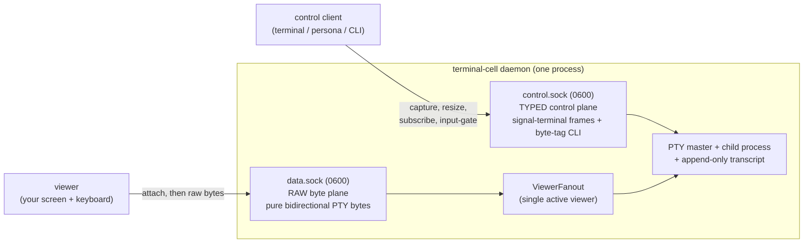
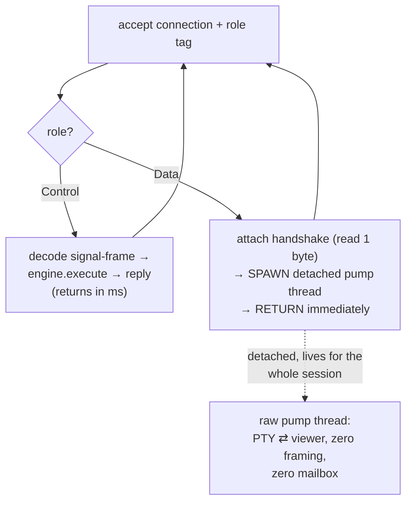

# 78.1 — The terminal raw data-plane carve-out, explained in full

Variant: **Psyche** (a teaching + decision report). Source-grounded via workflow
`w43o3klf0`. The short version up front, then the whole thing.

## TL;DR

- **Your fear was the wrong fear.** `MultiListenerDaemon` does **not** hard-code
  signal-frame. It hands a port a *bare socket* + a role tag and touches zero bytes
  (`triad-runtime/src/daemon.rs:368-380`); the framing/decoding lives entirely in the
  *port* (lojix), and the framework even has a passing test that runs a frameless handler
  (`tests/daemon.rs:120-141`). So a "raw-passthrough listener" needs **zero framework
  change** — your lean is sound and already structurally supported.
- **The real obstacle is concurrency, not framing.** `MultiListenerDaemon` serves
  connections **serially** — one handler runs to completion before the next connection is
  accepted, on *any* socket. A raw PTY viewer session lasts minutes-to-hours; run it
  inline and it freezes the control plane for the whole session. That's the actual problem
  to solve.
- **The solution is the idiom the codebase already uses:** the raw arm does the one-byte
  attach handshake, then **spawns a detached pump thread and returns immediately**, freeing
  the serial loop in milliseconds. terminal-cell already does exactly this per connection
  today.
- **Recommendation: do it port-side now (Solution 1), promote to a framework-blessed
  listener-lifetime policy later (Solution 2)** when a second carve-out consumer appears.

## 1. What terminal-cell and terminal are

**terminal-cell** is the low-level "one PTY in a box" daemon. It owns exactly one child
process group, one pseudo-terminal (PTY), and an append-only transcript of every byte the
child has printed (`INTENT.md:7-12`). It is the byte-level mechanics; the higher-level
**terminal** component consumes it as a *library* and owns the things terminal-cell
deliberately doesn't — names, the session registry, viewer-adapter launch policy, and the
durable observation tables (terminal is *allowed* a Sema DB; terminal-cell is forbidden
one by INTENT).

Both rest on the same design: **two Unix sockets that never change roles.**

- **control.sock — the typed control plane.** Carries `signal-terminal` length-prefixed
  rkyv frames (the real cross-component contract) *and* a hand-rolled one-byte-tag CLI
  protocol for human/test convenience (`C`=capture, `S`=subscribe, `R`=resize, `W`=wait,
  …). Everything that lives across time arrives here: capture transcript, register prompt
  patterns, lease/inject through the input gate, resize, wait-for-text, subscribe to
  worker lifecycle (`socket.rs:31-47`, `ARCHITECTURE.md:71-97`).
- **data.sock — the raw byte plane.** A viewer connects, sends **one** attach byte (`T`),
  gets back accept (`I`) or reject (`J`), and from then on the socket is a **pure,
  unframed, bidirectional pipe of PTY bytes** — child output flows out to your screen, your
  keystrokes flow in to the child. No tags, no length prefixes, no interpretation
  (`ARCHITECTURE.md:99-127`, `daemon.rs:1054-1111`, `session.rs:714-717`).

## 2. The data plane in detail (and why it must stay raw)

The data plane is **truly raw**, not lightly framed. The `T`/`I`/`J` bytes exist *only* in
the one-time handshake; after that, the viewer write path is plain `stream.write_all(bytes)`
with no framing, and the input pump is plain `stream.read(buf)` with no framing
(`session.rs:714-717`, `daemon.rs:1096-1111`). The full byte trace, both directions, with
no interpretation anywhere:

- **out:** PTY master read → `output_port.write_bytes` → `ViewerFanout` → active viewer
  `stream.write_all` (`session.rs:1404-1417`, `872-975`).
- **in:** viewer `stream.read` → `input_port.accept(InputSource::Viewer)` →
  `TerminalInputWriter` → PTY (`daemon.rs:1096-1111`).

Four load-bearing INTENT constraints bind any redesign:

1. **Do not interpret bytes.** The data plane keeps escape-sequence interpretation,
   transcript replay, screen projection, actor-mailbox delivery, and wait-conditions *off*
   the path. abduco is cited as the raw-byte reference that doesn't parse escapes
   (`INTENT.md:62-68`, `ARCHITECTURE.md:64-69,104-127`).
2. **Viewer latency off the actor mailbox.** A replay snapshot is written once at attach
   time; after that, live bytes flow directly off the fanout and **never** through the
   actor mailbox (`daemon.rs:1113-1123`). This is why "just make it a signal subscription"
   (Solution 5 below) is disqualified.
3. **Single active viewer.** Enforced in the fanout, not the socket: a second attach is
   rejected with a typed `ATTACH_REJECTED` *before* any replay or live byte crosses
   (`session.rs:883-893`, `daemon.rs:1054-1070`).
4. **The daemon owns the PTY master.** Viewer attach/detach/crash never owns or kills the
   child. (This is why fd-passing — Solution 4 — is dangerous.)

And terminal-cell is forbidden a Sema DB; a running session is discoverable only via its
runtime directory (`INTENT.md:62-68`). So the carve-out is genuinely *not* a triad state
plane — it's a byte pipe with a tiny attach handshake.

## 3. The misconception vs. the real problem

Report 77 framed the blocker as *"`MultiListenerDaemon` assumes every listener carries
signal-frame, so a raw data socket doesn't fit."* **Reading the actual source, that is
false.** Here is what `MultiListenerDaemon` really does (`daemon.rs:368-397`):

1. Poll the listeners round-robin; accept one connection.
2. Tag it with the per-listener **role enum** (`Runtime::Listener`).
3. Hand the **bare `UnixStream` + role** to `runtime.handle_stream(listener, stream)` —
   **touching zero bytes.**
4. Run that `handle_stream` **to completion**, then go back to step 1.

The signal-frame decode (`read_body` → `decode_signal_frame` → `engine.execute` → reply)
lives entirely in the **port's** `handle_stream` (lojix `daemon.rs:131-155`), which
dispatches on its `ListenerRole { Ordinary, Owner }` tag. The framework imposes **no**
contract on what `handle_stream` does — its own test runs a frameless handler and passes
(`tests/daemon.rs:120-141`). So a third `ListenerRole::Data` arm that simply *doesn't
decode* is a natural extension, no framework change.

**The real obstacle is step 4: the loop is serial / single-flight.** It runs one handler
to completion before accepting anything else, on any socket — an invariant lojix documents
as load-bearing for its single-slot engine state (lojix `daemon.rs:106-117`). A raw PTY
pump runs for the **entire viewer session**. Put it inline on the serial loop and it
**starves the control plane and every other connection for hours.** That is precisely why
terminal-cell today does **not** use `MultiListenerDaemon` at all — it hand-rolls two
`UnixListener` loops and spawns **one OS thread per connection** (`terminal-cell-daemon.rs:
141-142, 243-257`), so a long-lived pump never blocks control.

So the decision is **not** "how do we decode two contracts" (already answered) but **"how
does a long-lived, never-returning raw handler coexist with a serial single-flight control
loop"** while honoring do-not-interpret-bytes, two-planes-never-mode-shift, single-viewer,
and latency-off-the-mailbox.

## 4. The solution space

Six credible options. The table first, then the reasoning.

| # | Solution | Framework change? | Perf | Intent fit | Verdict |
|---|---|---|---|---|---|
| 1 | **Raw-passthrough listener role (port-side, spawn+return)** | none | optimal | strong | **Recommended now** |
| 2 | **Framework-blessed long-lived listener policy** | yes (small) | identical to 1 | strongest (typed) | **Target shape later** |
| 3 | Control on MultiListenerDaemon + data as sibling accept loop | none | optimal | strong | Conservative fallback |
| 4 | FD-passing via `SCM_RIGHTS` | high | best (kernel-direct) | mixed→poor | Not for viewer attach |
| 5 | Tunnel bytes as opaque signal-frame chunks | none | **worst** | disqualifying | Rejected (local) |
| 6 | Separate data-only process | high | excellent | mixed | Against the grain |

### Solution 1 — raw-passthrough listener role (the recommendation)
The port's `MultiListenerRuntime` adds a third `ListenerRole::Data` arm beside the
signal-frame `Control`/`Owner` arms — exactly mirroring how lojix already dispatches
`Ordinary` vs `Owner`. The Data arm does the one-time attach handshake (read one byte,
reserve the single-viewer lease, write `I` accept or `J` reject), writes the transcript
snapshot once, then **spawns a detached pump thread** that owns the bidirectional raw copy
and **returns immediately** so the serial loop is freed within milliseconds. The
spawn-and-return is the exact idiom terminal-cell already uses per connection
(`terminal-cell-daemon.rs:243-257`), so this is lift-and-shift, not new design.
**Pros:** zero framework change (provably works today); both planes in one process with
one uniform bind/teardown (the daemon's `BoundSocketFile` Drop cleans both sockets); the
role tag makes the carve-out **self-documenting at the dispatch point** (Control decodes,
Data does not). **Cons:** it *smuggles* a concurrency model the framework doesn't know
about — fine for terminal (engine state in Kameo actors, not single-slot fields) but a
footgun if a future single-slot-engine port copies it; shutdown of the detached pump and a
handshake read-timeout become port bookkeeping the framework doesn't help with.
**Precedent:** this is the abduco/dtach and conmon shape — a control channel for attach
negotiation + a raw channel for PTY bytes, with the pump detached from the accept path.

### Solution 2 — framework-blessed long-lived listener policy (the target)
Same as Solution 1 from the port's view, but the serial-vs-detached distinction becomes
**first-class** in triad-runtime: a `ListenerSocket` carries a typed lifetime policy —
`RequestReplySerial` (today's default, preserves the single-flight invariant) vs
`LongLivedDetached` (the shell spawns the handler on its own thread and the accept loop
continues). Expressed per the workspace's method-only discipline as a typed noun with a
`should_detach()` method, not a bool flag. **Pros:** makes the concurrency contract
*honest* — lojix's single-slot safety is preserved *by the type*, not by hoping no one
adds a detached role; the shell can own pump-thread lifecycle (signal on `should_continue`,
join on `stop()`), closing Solution 1's shutdown gap; any future high-bandwidth carve-out
(video/audio, per `component-triad.md:621-623`) gets it for free. **Cons:** touches the
shared shell every triad daemon depends on (must keep the default serial so lojix is
byte-for-byte unchanged); `handle_stream` takes `&mut self`, which a spawned thread can't
hold for hours, so detached roles likely need a separate `handle_detached_stream(&self,…)`
with `Send + 'static` bounds — real design surface. **Precedent:** how gRPC distinguishes
unary vs streaming handlers, and how OpenSSH's `ControlMaster` spawns per-channel handlers.

### Solution 3 — sibling hand-rolled data loop (conservative fallback)
Keep the data plane out of `MultiListenerDaemon` entirely: bind control via the shell, run
`data.sock` as a separate accept loop on another thread (today's terminal-cell shape,
cleaned up). **Pro:** the serial control loop is *never* perturbed — the lojix invariant
holds by construction, zero framework change. **Con:** the daemon runs two accept models
side by side (duplicated bind/mode/teardown the shell already provides), the carve-out is
*less* visible (a reader must discover the separate loop), and it keeps the structural seam
the consolidation wants gone. Choose this only if any risk to the serial invariant is
unacceptable *and* the Solution-2 framework change is off the table.

### Solution 4 — FD-passing via `SCM_RIGHTS` (not for viewer attach)
The viewer connects only to control, sends a signal-frame Attach, and the daemon passes a
file descriptor (the PTY master, or a pipe end) over the control socket via `SCM_RIGHTS`.
**The dup-the-master variant** lets the daemon leave the byte path entirely (kernel-direct,
zero copies — theoretical max purity) **but breaks single-active-viewer, detach/reattach,
and PTY-master ownership** — the daemon can't revoke a duped fd or keep the child alive
across a viewer crash, surrendering a load-bearing INTENT. **The pipe variant** keeps
ownership but **re-introduces a long-lived daemon-side splice** — so it doesn't escape the
concurrency problem. It also collapses the two-socket separation (the control socket now
carries the data bootstrap as ancillary data) and forecloses the published-`data_socket_path`
future (`ResolveSession` returns a dialable data socket). **Precedent:** conmon/containerd
*do* pass the PTY master fd — but to a *trusted in-family shim that becomes the owner*, not
to an ephemeral viewer that may crash. Keep `SCM_RIGHTS` in mind for a *different* problem
(handing the PTY to a trusted supervisor), not viewer attach.

### Solution 5 — tunnel bytes as opaque signal-frame chunks (rejected, locally)
No data socket; the control listener carries everything, with child output as a streaming
subscription of opaque `ByteChunk` events and keystrokes as `ViewerInput` requests.
**Cleanest triad story, worst fit.** It **directly violates viewer-latency-off-the-mailbox**
(every chunk routes through `NexusEngine::execute`), pays per-chunk rkyv framing on every
PTY read, and on the serial loop a busy child (a TUI redraw, a fast build log) **starves all
control traffic**. This is the exact model the carve-out exists to avoid. Its *only*
legitimate use is a **future remote/networked viewer** where no raw fd can cross the
boundary — there, framed byte-chunk streaming is the right (and only) shape, but as a
remote-gateway concern bridging to a *local* `data.sock`, not a change to the local plane.
**Precedent:** ssh channel muxing / mosh — which accept framing *because they must cross a
network*; a local unix socket with a raw-fd shortcut shouldn't pay that tax.

### Solution 6 — separate data-only process (against the grain)
A tiny separate process owns `data.sock` and the pump; the control daemon stays pure
signal-frame. **Perfect serial-loop isolation and crash isolation** — the textbook
conmon/shim pattern. But it **contradicts the stated consolidation direction** (terminal is
moving *toward* one component daemon consuming terminal-cell as an in-process library,
`terminal/ARCHITECTURE.md:156-180`, `terminal/INTENT.md:70`), re-introduces an
inter-process boundary terminal-cell deliberately collapsed, and splits single-viewer +
input-gate arbitration across a process boundary. conmon exists because the container
*engine* is a short-lived CLI; terminal's daemon is already long-lived, so the motivating
asymmetry is absent. Keep as the answer only if crash-isolating the byte plane ever becomes
a hard requirement — Solution 1 already gives that isolation via a thread.

## 5. Recommendation

**Adopt Solution 1 now; name Solution 2 as the target to promote to.** Your lean is
correct and the source confirms it: the signal-frame assumption is not in the framework, so
a `ListenerRole::Data` arm that handshakes-then-spawns-and-returns is achievable **today
with zero edits to the shared shell**, and the data-plane logic is lift-and-shift from
terminal-cell's existing per-connection threads. Then, **once a second carve-out consumer
appears** (video/audio) **or a single-slot-engine port needs the type-enforced serial
guarantee**, promote to Solution 2 so the concurrency contract is honest in the type system
rather than smuggled. Sequencing this way avoids designing the framework policy against a
single example — terminal hasn't even consolidated onto `MultiListenerDaemon` yet (grep
found zero references), so a speculative shared-shell change now would be premature.

Reject Solution 5 for the local plane (engine on the latency path). Hold Solutions 4 and 6
as answers to *different* problems. Solution 3 is the conservative fallback if any risk to
the serial invariant is judged unacceptable.

The rationale rests on three source facts: (1) the framework is contract-agnostic
(`daemon.rs:368-380` + the frameless test), collapsing "change the shell" into "add a
non-decoding arm"; (2) the one real obstacle — the serial loop — is solved by
spawn-and-return, already the codebase idiom, and terminal's actor-held engine state means
detaching one role doesn't endanger the control role's invariant; (3) the carve-out is
canonical narrow workspace intent (`component-triad.md:621-628`), and Solution 1 makes it
visible at the dispatch point — the most self-documenting realization.

## 6. Open sub-questions a final decision needs

1. **Pump-thread shutdown.** Solution 1's detached pump lives outside the `should_continue`
   gate (`daemon.rs:383,393`). Does the cell's existing `ViewerFanout`/lease teardown
   already cover joining the per-viewer threads on detach, or is new bookkeeping needed?
2. **Handshake read-timeout.** The attach byte is read inline before the spawn; a
   connect-and-never-send client would wedge the serial loop (lojix bounds this with
   `REQUEST_READ_TIMEOUT`). Should the timeout be a per-port detail or a framework
   affordance (per-listener accept/handshake timeout)?
3. **Which repo lands it first** — terminal-cell (no triad-runtime dep today, hand-rolls
   both loops) or terminal's consolidated daemon (uses neither today)? The consolidation
   target is one terminal-daemon consuming terminal-cell as a library.
4. **Promotion trigger** for Solution 1 → 2: a second carve-out consumer? a single-slot
   engine port? the first time someone copies the smuggled-spawn wrong?
5. **Remote viewer scope.** Solution 5 is the right shape for a *networked* viewer. Is one
   in scope? If so it's a separate gateway concern, not a local-plane change.

## 7. What gets captured to Spirit (after you confirm)

Per the carry-uncertainty discipline, nothing about the carve-out is captured yet. Once you
confirm, the durable intent to record is roughly: *the raw data-plane carve-out is realized
as a non-decoding `ListenerRole` on `MultiListenerDaemon` that spawns a detached pump and
returns (Solution 1); the framework-blessed long-lived-listener lifetime policy (Solution
2) is the named target once a second carve-out consumer appears.* Tell me if that matches
your intent and I'll record it.

## See also
- `0-frame-and-method.md` — the question + workflow method.
- `reports/system-designer/77-all-component-port-on-refreshed-base-2026-06-05/2-per-component-port-plans.md`
  — the terminal + terminal-cell port plans this unblocks.
- Workspace intent: `component-triad.md` §"carve-out" (the blessed data-plane exception).
