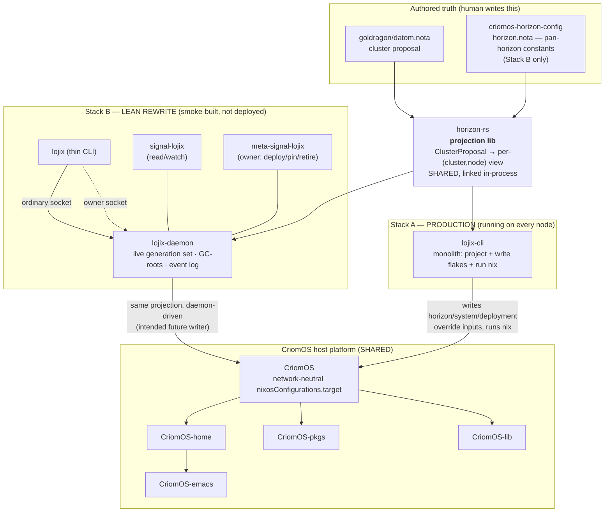

# Lojix / Horizon / CriomOS — Situation Analysis

*system-designer · 2026-06-11 · light survey of the deploy stack: what the
repos are, which does what, how they fit together.*

## TL;DR

These repos are **the CriomOS deploy stack** — the machinery that turns a
human-authored cluster description into a built, activated NixOS host. The
defining fact is that **two versions of this stack coexist**:

- **Stack A (production today).** A single monolithic CLI — `lojix-cli` —
  links `horizon-rs` in-process, projects a cluster proposal, writes a few
  override flake inputs, and runs `nix` against `CriomOS`. No daemon, no
  wire contract. This is what runs on every node. **Production fixes go
  here.**
- **Stack B (lean rewrite, smoke-built, not deployed).** The deploy logic
  becomes a long-lived `lojix-daemon` + a thin `lojix` CLI client, talking
  over a typed Signal wire (`signal-lojix` / `meta-signal-lojix`), with the
  pan-horizon constants split into their own `criomos-horizon-config` repo.
  Built end-to-end on `zeus` through `prometheus`, but **cut over to no
  node**. **Rewrite edits go here** (`horizon-leaner-shape` branch).

`horizon-rs` and the `CriomOS*` family are **shared** — the same OS layer
and the same projection library serve both stacks. Only the *driver* (CLI
monolith vs daemon+thin-client) and the *config split* differ between A
and B.

The one thing not to do: fold one stack into the other piecemeal. The
schemas have diverged; cutover is a coordinated multi-repo merge after the
rewrite reaches parity.

## The cast — which repo does what

| Repo | What it is | Stack | Status |
|---|---|---|---|
| **lojix-cli** | Production deploy CLI (monolith). Reads one NOTA request, projects horizon in-process, writes override flakes, runs `nix`. | A | **Deployed.** Pinned into the CriomOS graph. Retires after cutover — does *not* grow into a daemon client. |
| **lojix** | The Stack-B replacement: one crate, two binaries — `lojix-daemon` (long-lived deploy orchestrator) + `lojix` (thin CLI client). | new-in-B | Implemented crate under `triad-port/`, smoke-built. In-memory store; durable backing pending. |
| **signal-lojix** | Working-signal wire contract: deploy + retention + watch verbs the CLI/clients exchange with the daemon. Pure contract crate. | new-in-B | Implemented. rkyv + NOTA round-trip witnessed. |
| **meta-signal-lojix** | Owner-only **meta policy** contract: privileged `Deploy`/`Pin`/`Unpin`/`Retire` over the owner socket. | new-in-B | Builds clean. Wire-only, no behavior. |
| **horizon-rs** | The **projection library**. Owns the `ClusterProposal`/`NodeProposal` schema and projects it to a per-`(cluster,node)` view. Linked in-process. | **shared** | **CANON, active on both stacks.** Two crates: `lib/` + `cli/`. |
| **criomos-horizon-config** | Tiny pan-horizon constants repo (operator identity, DNS suffixes, transitional LAN block). Split out of `goldragon/datom.nota`. | new-in-B | Single 367-byte `horizon.nota`. Complete for its scope. |
| **CriomOS** | The **NixOS OS layer**. Network-neutral `nixosConfigurations.target`; identity enters only as projected flake inputs. Never built directly. | A (shared host) | **Deployed / CANON.** Also the cluster meta-repo. |
| **CriomOS-home** | Home-Manager profile flake (min/med/max). User desktop: Niri, theming, editors, Spirit user service. | A (shared host) | **Deployed / CANON.** Bakes Spirit's rkyv startup archive at build time. |
| **CriomOS-lib** | Dependency-free shared Nix lib (constants, `fetchHfModel`, model catalog). | support | Stable, shrinking by design. No INTENT.md yet. |
| **CriomOS-pkgs** | The `pkgs` axis — does the one expensive `import nixpkgs` with overlays, cached independently. | A infra | Live infra flake. No INTENT.md/ARCHITECTURE.md yet. |
| **CriomOS-emacs** | Emacs distribution as a home-manager module, split out for independent versioning. | support | Scaffold (Phase 0). Legacy `mkEmacs` not yet converted. |

## How it fits together

The deploy mechanism, in one breath: **a cluster proposal in NOTA →
projected by `horizon-rs` into a per-node view → that view written as
override flake inputs (`horizon` / `system` / `deployment`) → `nix` builds
`CriomOS.nixosConfigurations.target` → activate.** Stack A does all of
this inside one CLI process; Stack B splits the "write inputs + run nix"
half behind a daemon and puts the request on a typed wire. CriomOS itself
is identical to both — it holds no node names and renders whatever the
projected inputs say.

The four content-addressed input axes into CriomOS — `system`, `pkgs`,
`horizon`, `deployment` — each cache independently in the nix flake-eval
cache, which is why CriomOS can iterate its module tree without re-evaluating
the costly nixpkgs instantiation (`CriomOS-pkgs`'s whole reason to exist).

## Production vs development intent, distilled

- **Production intent is "keep Stack A correct and untouched by the
  rewrite."** `lojix-cli` is the deploy entry point; `horizon-rs` is the
  CANON typed proposal boundary that stops the cluster owner from
  authoring the operating system; `CriomOS`/`-home`/`-pkgs`/`-lib` are the
  live host platform. All explicitly transitional — *built rightly for
  today's Nix stack, not as a draft of the eventual.*
- **Development intent is the triad shape.** The rewrite's thesis: deploy
  is a **component triad** — `lojix` (daemon + its first client, the thin
  CLI) + `signal-lojix` (working signal) + `meta-signal-lojix` (meta
  policy). Push-not-poll observation, authority-tiered sockets (ordinary
  read socket vs owner mutation socket with kernel-vouched peer creds),
  operator-sovereign (the daemon never self-initiates a deploy).
  Notably, **lojix is explicitly *not* a Persona component** — so the
  usual Tap/Untap observable block doesn't apply; observation stays as
  domain-specific `Watch`/`Unwatch`.
- **`horizon-rs` stays a linked-in-process library in both stacks** — the
  daemon is not a "horizon daemon." Its constants split out to
  `criomos-horizon-config` only in Stack B so the daemon takes config as
  binary.

## For your attention

1. **The cutover gate is durable storage + safe activate in the daemon.**
   The `lojix-daemon` runs on an in-memory store behind a shared lock; the
   named next step is durable redb/`sema-engine` backing, and *activating*
   deploys still self-reject until copy/activate is target-safe. Until
   those land, Stack B can build but can't safely deploy — which is exactly
   why it's smoke-built-not-cutover. This is the real blocker, not parity
   of the wire contracts (those are implemented).

2. **A pin-fact in our protocols doc is stale.** `protocols/active-repositories.md`
   (and AGENTS-adjacent context) says *"CriomOS and CriomOS-home flake locks
   pin `lojix-cli` at `4c66b8a6fa55`."* The actual locks now read
   `fc2ff0287f53` — the lock advanced, and `lojix-cli` reaches CriomOS as a
   **transitive** input via `criomos-home`, not a direct `flake.nix`
   declaration. The pin in the doc is a frozen snapshot, not current truth.
   Worth a one-line correction to the protocols doc — flag before I touch it
   since it's an operator/system-operator-adjacent surface.

3. **Three repos have no `INTENT.md`** — `CriomOS-lib`, `CriomOS-pkgs`,
   `CriomOS-emacs`. Per the workspace rule, a missing `INTENT.md` is "the
   first gap to fill." These three are support/infra, so the gap is low-
   stakes, but if we want the intent layer complete across the stack, they
   are the three open slots.

4. **`CriomOS-emacs` is the least-built leg** — Phase 0 scaffold, legacy
   `mkEmacs` not yet converted to a blueprint package, `homeModules.default`
   still an empty aggregate. Tracked by beads `emacs-plb` / `emacs-y55` /
   `home-tl6`. Not on the deploy critical path, but it's the one repo here
   that isn't actually doing its job yet.

## Method

Eleven sub-agents read one repo each (`INTENT.md` → `ARCHITECTURE.md` →
`AGENTS.md`/`README` heads) and returned structured summaries; this report
synthesizes them. Source frame and per-repo returns: workflow
`wf_6561ae56-9f1`. No Spirit capture — the prompt was a task-only order
(produce an analysis), not durable intent.
