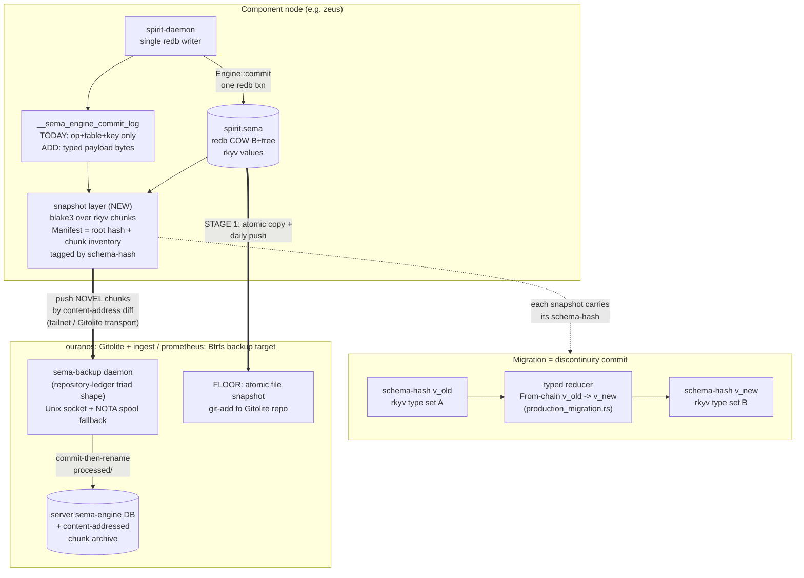

## Beads today

**Verdict: installed and functional, but effectively retired in practice since Jun 9 2026.** The store at `/home/li/primary/.beads/` is a real `steveyegge/beads` install (`bd v1.0.0`) over an embedded Dolt database (`dolt v1.86.2`) at `embeddeddolt/primary/` — genuine and deep: 2031 Dolt commits on `main`, 23 tables, 654 issues (546 closed / 99 open / 6 in_progress / 3 blocked). But the activity curve has collapsed: `interactions.jsonl` falls from 70-80 field-changes/day in late May to single digits in June, and the last *substantive* mutation was `primary-5top` (a NOTA-bracket short-tracked item, closed) on Jun 9 19:28Z — closed with the reason "Resolved by spirit commit 20793846…". The only Dolt commits newer than the last push are heartbeat noise: `dolt diff origin/main..HEAD` shows the sole change is one `metadata` cell, `tip_claude_setup_last_shown`, bumped by bd's upgrade-nag. Work has migrated into Spirit; agents have stopped reaching for beads.

**What Dolt-embedding gives beads** (and why it is the reference design for this whole report): beads version-controls a *database* on disk exactly the way Dolt does — a content-addressed noms/NBS chunk store (`manifest` line `5:__DOLT__:<root>:<gcGen>:<lock>:<journal>:<size>`, an append-only journal table file that conjoins into hash-named `oldgen` table files), a Git-shaped commit DAG (`main`, `remotes/origin/main`), and remote sync that ships only novel chunks by content-address diff. The cheap-diff/merge property comes from Dolt storing each table as a **prolly tree** — a Merkle B-tree whose node boundaries are cut by a rolling hash over keys (content-defined chunking, ~4 KB chunks); a one-cell edit copies one leaf chunk plus its ~log(n) ancestors and structurally shares everything else, so Dolt never hits git's whole-blob-rewrite problem. Crucially, beads itself **does not `git add` the Dolt file** — and note the `.beads/.gitignore` `dolt/` pattern is vestigial (the real store is `embeddeddolt/`, which no add rule covers), so what actually keeps the DB out of git is the Dolt-as-git-remote push model, not the ignore line. It (a) pushes the Dolt chunk store to a *Git* remote (`origin = git+ssh://git@github.com/LiGoldragon/primary.git`, Dolt-as-git-remote) and (b) writes a local `backup/` of 288 content-addressed `.darc` archive files (86 MB). It rides the existing Gitolite host as a chunk transport.

**Recommendation: harvest the Dolt lesson and let beads die on schedule — do not deepen it, do not export-migrate it.** This is exactly `INTENT.md:102-107` ("`.beads/` coordinates short-tracked items today; the destination is persona-mind's native typed work graph. Don't deepen the bd investment or build a bridge to it — design assuming it goes away"). Concrete moves: (1) treat the 99 open issues as re-trackable in Spirit/persona-mind on touch rather than bulk-exported — they are already being closed with spirit-commit references; (2) suppress the heartbeat auto-commits (the local Dolt is 2 commits ahead of origin with pure nag-timestamp noise — leave it, but stop the bleed); (3) keep the structural lessons (prolly tree, manifest-root atomic swap, chunk push/pull, Git-as-transport) as the input to the *native* Sema-versioning design below, which is where the real value is.

## Short codes: beads vs Spirit

**They are not the same hash space, but they draw from the identical alphabet and there is no content derivation to recompute against — so a bare code is genuinely ambiguous.**

| Property | Bead | Spirit record |
|---|---|---|
| Carrier shape | `primary-<code>` (prefix **mandatory**) | bare `<code>` (no prefix) |
| Alphabet | lowercase base36 `[0-9a-z]` | lowercase base36 `[0-9a-z]` — **identical** |
| Length range | 3-8 chars | 4-7 chars (`store.rs:43-44`) |
| Sub-token | `.N` sub-issue suffix | none |
| Minting | upstream bd / embedded Dolt, per-repo opaque | random `getrandom`, collision-checked, shortest-first (`store.rs:925-970`) |
| Uniqueness scope | per beads repo (`primary`) | per `.sema` store (the live `~/.local/state/spirit/`) |

`RecordIdentifier` is a transparent `String` newtype (defined `pub struct RecordIdentifier(String)` at `spirit/src/schema/signal.rs:996`; Deref/Display impls at `engine.rs:1001-1013`); the mint is per-store, not global (`store.rs:848-849`), so collision-freedom holds only inside one Spirit database. The overlapping 4-7 char base36 band means a bare token like `2xzv` could be the bead `primary-2xzv` written without its prefix or a Spirit record id; neither is content-derived, so you cannot recompute and check.

**Minimal disambiguation convention (no code change — pure writing rule, layered on the existing AGENTS.md opaque-identifier override):**
1. **Beads always carry the `primary-` prefix** in chat and reports — never the bare code. The prefix is the only structural distinguisher; dropping it *creates* the ambiguity.
2. **Spirit codes are written bare but always tagged with the word "Spirit"** — "Spirit record `4ups`". The wire form (`(RecordAccepted 4ups)`, `Lookup 4ups`) is bare by contract; do not invent a prefix.
3. **Both keep the inline content gloss** AGENTS.md already mandates — "bead `primary-hj63` (the README rewrite)", "Spirit record `4ups` (the no-backward-compat principle)".
4. One-line edit to the AGENTS.md opaque-identifier override to *name Spirit record codes* alongside beads/jj/commit ids and state the prefixed-vs-bare-plus-word rule. (Recommended, not yet made.)

## The Sema store today

A precise model of how a component database persists right now, verified against source:

- **On-disk: one mmap'd redb 4.1.0 file per component** (`*.sema`). `sema::Sema` wraps a single `redb::Database` at one path (`sema/src/lib.rs:471-508`); the live `~/.local/state/spirit/spirit.sema` begins with the `redb` magic. redb is a single-file copy-on-write B+tree. Values are **rkyv archives** stored as `&[u8]` behind a typed `Table<K,V>` (`sema/src/lib.rs:381-388`, decode + bytecheck at `456-461`); rkyv features pinned `little_endian`/`pointer_width_32`/`unaligned`/`bytecheck`. Tables are created lazily on first write; the schema carries only a `u64` version. Kernel internal tables `__sema_meta`, `__sema_headers`; `sema-engine` adds `__sema_engine_catalog`, `__sema_engine_counters`, `__sema_engine_commit_log`, `__sema_engine_subscriptions`, `__sema_engine_identified_counters`.
- **Operation model: destructive current-state.** `signal-sema`'s `SemaOperation` is a payloadless six-label vocabulary — `Assert`/`Mutate`/`Retract`/`Match`/`Subscribe`/`Validate` (`signal-sema/src/operation.rs:19-32`, classed Write/Read/Stream/Validation at `67-74`). The engine executes them destructively: Assert inserts (rejects dup key), Mutate overwrites in place (old bytes gone, redb last-writer-wins), Retract `remove`s (no tombstone). No prior-value retention.
- **Log: metadata only, NOT replayable into state.** `CommitLogEntry { commit_sequence, snapshot, NonEmpty<CommitLogOperation> }` (`sema-engine/src/log.rs:15-19`), and `CommitLogOperation` is `{ operation, table_name, key: Option<RecordKey> }` (`log.rs:63-68`) — **the record value/bytes are never logged.** So `replay_from_sequence` / `commit_log_range` (`engine.rs:901-918`) return only the *shape* of past writes, not the data; you cannot reconstruct a prior state from the log.
- **"Snapshot identity" is a monotonic counter, not a content hash.** `SnapshotIdentifier(u64)` with `next() = +1` (`snapshot.rs:19,53-55`); `DatabaseMarker = (CommitSequence, SnapshotIdentifier)` is two `u64`s (`snapshot.rs:35`). The only real content hash anywhere is consumer-local: spirit's blake3 `state_digest` over `(commit_sequence, record id + rkyv bytes, referents)`, recomputed on demand and **not persisted** (`spirit/src/store.rs:714-758`). The one first-party content hash *type* in the wider stack is criome's `ObjectDigest = blake3::hash(bytes).to_hex()` (`signal-criome/src/lib.rs:55-57`) — a precedent to copy, not something Sema uses.
- **Atomicity: single-writer ACID, fsync-on-commit.** `Sema::write` is one `begin_write`/`commit`, rollback-on-Err (`sema/src/lib.rs:568-573`); `Engine::commit` writes all ops + log + counters in ONE redb txn (`engine.rs:635-661`). **But no savepoint / persistent-snapshot / custom-durability code exists** — grep across all three crates + spirit returns nothing. There is no online point-in-time backup path while the daemon holds the file lock.
- **Resume is implicit:** `Engine::open` reopens the redb file and rebuilds the catalog from `__sema_engine_catalog`; counters read live. Subscription *registrations* survive; live sink callbacks do not.
- **Migration: full rewrite into new rkyv types, old file renamed aside.** Implemented in the consumer (`spirit/src/production_migration.rs`), not the kernel. Spirit is at `SchemaVersion::new(7)` (`production_migration.rs:27`). Each migrated version has a frozen rkyv reader — V1, V2, V4, V5, V6 (V3 reuses the V2 reader, `production_migration.rs:354`); `into_new_entry()` is the per-version `From`-chain (`production_migration.rs:303,617-731`); the `SpiritStoreUpgrade::run` method opens at the old version, reads all rows, writes a fresh current-version temp store, then `fs::rename(live → *.schema-old-backup-N.sema)` and `fs::rename(temp → live)` (`production_migration.rs:380-403`). The kernel only hard-fails on version skew (`SchemaVersionMismatch`, `sema/src/lib.rs:527-552`). Verified on disk: `spirit.schema-old-backup-{0..3}.sema` siblings, all redb files. **This rename-aside is the only whole-store backup that exists today, and it only fires on a schema bump.**

## The core tension

**Strict-typed hard-migration and database version control pull against each other at the bytes.** Dolt gets cheap version control because its rows are *dynamically-typed SQL cells*: the prolly tree diffs bytes of rows, and a schema change is "just" a new schema recorded in the commit — the storage layer stays type-agnostic, so structural sharing works across schema changes. **Sema is the opposite by doctrine.** The on-disk bytes *are* a specific Rust type's rkyv-archived layout. Change the type — which happens on *every* schema migration, with no backward-compat pre-production — and the old chunks become undecodable by the new code. A migration rewrites the entire store through a `From`-chain (`SpiritStoreV5 → … → current Entry`), so the post-migration byte image shares *nothing* with the pre-migration one.

The sharp statement: **cross-version diffs are typed transforms, not cell diffs.** A prolly-tree/Merkle-DAG buys real structural sharing *within* one schema version, but at a migration boundary the sharing ratio is ~zero — old rkyv bytes and new rkyv bytes are different types with different layouts. Chasing byte-level structural sharing across a migration is a mirage. The design must therefore: (1) get structural sharing *within* a schema version (content-address rkyv chunks for cheap incremental sync between commits of the same type set); (2) represent a migration as an explicit **typed-transform discontinuity commit** carrying the schema identity and (ideally) the reducer, not as a giant cell-diff; (3) keep each version's bytes restorable *under its own type set* — which means schema identity has to travel *inside* the snapshot, not as ambient global state. This is exactly the content-addressed-schema endpoint sema already names (`sema/ARCHITECTURE.md:235-256`): schema = hash of its Sema source, multiple versions decode concurrently, migration = a typed reducer `v3-record → v4-record`, both coexisting until v3 is retired.

## Design options

| Option | What it is | Cost / fit | Verdict |
|---|---|---|---|
| **(a) git-blob stopgap** | `git add spirit.sema` (the redb file) into a Gitolite repo, periodically | redb is one COW B+tree file; a commit relocates pages and scrambles byte offsets, defeating git's delta heuristic → ~one near-full-size near-incompressible blob per snapshot (a 1.2 MB store × N snapshots ≈ 1.2N MB **worst-case** stuck in history — an unmeasured upper bound; git still delta-compresses across pack windows, so real growth may be lower). No cheap diff/merge/blame. **But** it is atomic, dead-simple, schema-unaware, and a guaranteed restore point. | **Floor, not the answer.** Use it as the immediate correctness floor; never mistake it for version control. Note beads itself refuses this path (gitignores the Dolt file). |
| **(b) Dolt-as-store** | Adopt Dolt/noms as the component DB engine | Dolt's diff/merge superpower depends on dynamically-typed SQL cells + prolly trees over untyped rows. It is the *wrong* type model: it throws away strict rkyv typing, runs a SQL engine we do not want, and its cross-schema sharing is exactly the property that does not survive our hard type migration anyway. | **Reject as a store.** Keep it only as the *reference design* (chunk store + manifest-root atomic swap + commit DAG + chunk push/pull + Git-as-transport). |
| **(c) NATIVE content-addressed Sema** | Extend sema-engine: an accretive operation log that carries record *payloads*, a real content-addressed snapshot hash (blake3 over rkyv chunks), a prolly-tree/Merkle-DAG of rkyv chunks tagged by schema-hash, with push/pull of novel chunks to a server. | Net-new work: the log is metadata-only today (`log.rs:63-68`) and the snapshot id is a counter (`snapshot.rs:19`). But it is the model sema *already names* as its endpoint (`ARCHITECTURE.md:235-256`), maps onto existing infra (repository-ledger triad shape, Gitolite host, criome's blake3 precedent), and is the only option that respects strict typing while giving cheap intra-version sync and a clean migration-discontinuity representation. | **Recommended direction.** |
| **(d) Datomic-style append-only typed log → server** | Make the operation log the source of truth (each op carries the typed payload), current state a materialized view; ship the log stream to a server; time-travel by replay. | `signal-sema` + `sema-engine`'s `CommitLogEntry` over monotonic `CommitSequence` *already is* a Datomic-shaped accretion frame (adds first-class `Mutate`). Cheapest path to time-travel/audit/restore. Weaker at incremental *whole-store* sync (replay vs chunk-diff) and says nothing about reading old bytes under new types. | **Adopt as the log layer of (c).** Not a standalone competitor — it is the value-bearing-log half; (c) adds the content-addressed snapshot/transport half. |

**Recommended: (c), built as (d)'s payload-bearing log under a content-addressed snapshot+transport layer, riding the repository-ledger/Gitolite precedent — with (a) as the immediate floor.** Rationale: (d) alone gives time-travel but not efficient sync or schema-aware restore; (c) alone without a value-bearing log can't reconstruct state. Fused, they are the sema ARCHITECTURE endpoint: an append-only typed operation log over a content-addressed-schema substrate, structural-sharing within a version, reducer-bridging across versions.

## How schema migration lives in version control

A migration appears in the history as a **typed-transform discontinuity commit**, not a cell diff:

- **In the history:** the commit at the boundary is tagged with two schema-hashes (the producing `v_old` and the resulting `v_new`) and references the reducer (the `From`-chain) that produced `v_new` from `v_old`. Its "diff" is not "these 654 rows changed bytes" — that diff is total and meaningless — it is "schema `v_old` → `v_new` via reducer R". This is Dolt's "schema-in-the-commit" (the manifest/commit carries the format/schema identity that decodes its rows) fused with Datomic's "schema-as-data" (schema evolves by accretion as queryable facts). The discontinuity is *named*, so a reader knows a byte-level diff across it is nonsense.
- **Time-travel / restore across the boundary:** because each snapshot carries the schema-hash that produced it, a restore of a pre-migration state decodes its chunks *through `v_old`'s type set* (the `historical` rkyv structs, frozen — exactly spirit's `SpiritStoreV1..V6` today). You can stand at any past commit and read it under its own types, then optionally replay the reducer forward to the current schema. Today's mechanic — full rewrite + `fs::rename` to `*.schema-old-backup-N.sema` (`production_migration.rs:380-403`) — is the degenerate one-version-at-a-time realization: the old image survives as exactly one renamed-aside file. The native version makes that "renamed-aside file" a first-class content-addressed snapshot under its schema-hash, retained in the archive rather than a lone sibling.
- **What Dolt/Datomic teach precisely:** Dolt — keep the schema identity *in the commit* and let cheap structural diff work *within* a schema; TerminusDB — keep history read-fast by compacting cold layers (its delta-rollup mirrors Dolt's journal→oldgen conjoining), the model for compacting an old-schema archive after its reducer has run; Datomic — make the *log* the source of truth so the reducer is just another accretive transformation and "current state" is a materialized view. The decisive lesson for us: **don't chase byte sharing across the boundary; carry the schema identity and the reducer instead.**

## Staged path

Three stages, each independently shippable, each atomic by construction. The Gitolite + ingest host is **ouranos** — the `GitoliteServer` + `TailnetController` node (`goldragon/datom.nota:28-58`; the `repository-ledger` systemd service is role-gated to `PersonaDevelopment [(GitoliteServer)]`, `CriomOS/modules/nixos/repository-receive.nix:216`). The dedicated backup *target* is **prometheus** (`datom.nota:59-97`): NixBuilder + NixCache, owner of the `criome-backup` SSID (`datom.nota:95`), and Btrfs (root/home/nix/var subvolumes) — so it supports atomic CoW reflink/subvolume snapshots with no blob bloat. Caveat: the lean horizon stack has not cut over to any node, so these are role-assigned hosts — verify the live Gitolite host before wiring.

- **Stage 1 — atomic file snapshot + daily server push (the floor, NOW).** Operator/system-operator task. Quiesce the single writer (the daemon holds the lock), atomically `cp` the `*.sema` file (or, if redb savepoints land, snapshot via the kernel), commit it into a dedicated Gitolite repo on **ouranos** over the existing git+ssh transport — the same path beads already uses — and/or, on the Btrfs backup target (prometheus), take a `cp --reflink` / subvolume snapshot for a zero-bloat on-host restore point. **Atomicity:** the copy is of a crash-consistent redb file taken between writes; the git commit is atomic; the Btrfs reflink is atomic and schema-unaware; identical to beads' working model minus the Dolt engine. This is the cheap correctness floor — restore points, not version control. Operational note: the live workstation is ext4 and ~99% full, so push off-host promptly rather than accumulating local snapshots; reflink retention belongs on the Btrfs target.
- **Stage 2 — operation-log shipping (MEDIUM).** Make `CommitLogOperation` carry the typed record *payload* (today only `op+table+key`, `log.rs:63-68`), then ship the `CommitLogEntry` stream by sequence cursor to a server `sema-engine` ingest daemon cloned from the repository-ledger triad shape. **Atomicity:** reuse repository-ledger's exact spool primitive — write `.tmp`, atomic `fs::rename` into the spool as a `<timestamp>-…-<pid>.nota`, a ticker-driven actor commits to the store *then* `move_to_processed` (`spool.rs:63-73`); commit-then-move = at-least-once with no loss/dup. Cursor = `replay_from_sequence(CommitSequence)` (`engine.rs:901`). Gives durable, replayable, value-bearing history off-machine.
- **Stage 3 — native content-addressed remote (LONG).** Add the snapshot layer to sema-engine: blake3 over rkyv chunks (criome's `ObjectDigest` precedent, `signal-criome/src/lib.rs:55-57`), a manifest holding the root hash + chunk inventory (Dolt's atomic-commit primitive — advancing the root atomically commits the DB), prolly-tree/CDC chunking for structural sharing within a schema-hash, and push/pull of *novel chunks only* to the server over the tailnet (all nodes are TailnetClients; **ouranos** is TailnetController) or piggybacked on Gitolite-as-transport (Dolt-as-git-remote proves this works). **Atomicity:** the manifest root-hash swap is the atomic commit; chunk push is content-addressed so partial transfer self-heals (re-push ships only what is missing). This realizes the `sema/ARCHITECTURE.md:235-256` endpoint and builds on the repository-ledger contract's `MirrorPolicy` — whose policy *type and storage* already exist and are wired (`StoredMirrorPolicy`, `SetMirrorPolicy` verb, `mirror_policies` table in `repository-ledger/src/lib.rs`); only the mirroring *execution* (GitHub mirroring) is deferred.

## Open questions for the psyche

1. **The 99 open beads** — confirm they get re-tracked in Spirit/persona-mind on touch (abandon the Dolt store), rather than a bulk export? The closing pattern already points to spirit commits, suggesting yes.
2. **Cross-store atomicity** — does a server backup need a *single cross-store atomic snapshot* (spirit + introspect.sema + criome.sema + repository-ledger), or is per-`*.sema`-file backup sufficient? Per-file is far simpler and matches the single-writer-per-store reality.
3. **Snapshot transport** — extend a sema-engine daemon to listen on the tailnet, piggyback on Gitolite-as-transport (Dolt-as-git-remote precedent), or reuse beads' git-remote-push model? No network ingest socket exists today; all current sockets are local Unix.
4. **redb savepoints vs quiesce-and-copy** — should the kernel expose redb 4.1's persistent-savepoint API for online atomic snapshots, or is daemon quiesce-and-copy acceptable given the single-writer lock? Stage 1 can ship with quiesce-and-copy regardless.
5. **Schema-hash tagging timing** — tag each archived snapshot/chunk with its producing schema-hash now (enabling concurrent multi-version decode), or keep the single global `SchemaVersion` for the first prototype and add hash-tagging at Stage 3? ARCHITECTURE names the multi-version model as future work without fixing when it lands.
6. **AGENTS.md edit** — make the bead-prefix-always / Spirit-bare-plus-word / gloss-always rule explicit by editing the opaque-identifier override now, or leave it to the existing gloss rule? (Recommended to edit; not yet done.)

## Corrections from the adversarial critique

This synthesis went through an adversarial accuracy pass (the workflow's final agent) re-checking every claim against source. One high-severity and several minor corrections were applied to the text above; recorded here for traceability.

- **[HIGH — host attribution, corrected inline] GitoliteServer/TailnetController is ouranos, not prometheus.** `goldragon/datom.nota` defines ouranos at lines 28–58; line 58's role vector `[(TailnetClient) (TailnetController) (NixBuilder None) (PersonaDevelopment [(GitoliteServer)])]` *closes the ouranos block*. Prometheus (lines 59–97) carries `[(TailnetClient) (NixBuilder (Some 6)) (NixCache)]` — NixBuilder + NixCache, not Gitolite and not the controller. The inventory finding (file `4-content-addressing-and-server.md`) conflated ouranos's trailing role-line with prometheus; the design above is corrected to name **ouranos** as the Gitolite/repository-ledger/ingest host. Prometheus stays relevant as a backup *target* — it owns the `criome-backup` SSID (`datom.nota:95`) and is Btrfs (root/home/nix/var subvolumes), so it supports CoW reflink/subvolume snapshots. Verified directly against `datom.nota:28-97`.
- **[MEDIUM] beads gitignore is vestigial.** The real Dolt store is `.beads/embeddeddolt/`, not `.beads/dolt/`; the `dolt/` ignore pattern matches nothing. What keeps the DB out of git is the absence of any add rule for `embeddeddolt/` plus the Dolt-as-git-remote push model — not the gitignore line. (Conclusion unchanged; corrected inline.)
- **[MEDIUM] repository-ledger MirrorPolicy is partly implemented.** The policy *type and storage* exist and are wired (`StoredMirrorPolicy`, `SetMirrorPolicy` verb, `mirror_policies` table); only the mirroring *execution* (GitHub mirroring) is deferred per ARCHITECTURE. Stage 3 builds on existing policy scaffolding, not a greenfield contract. (Corrected inline.)
- **[LOW] RecordIdentifier definition site** is `spirit/src/schema/signal.rs:996`, not `engine.rs` (which holds only the Deref/Display impls). Corrected inline.
- **[LOW] Frozen historical readers** are V1, V2, V4, V5, V6 — V3 reuses the V2 reader; the rename-aside lives in `SpiritStoreUpgrade::run`. Corrected inline.
- **[LOW] git-blob bloat** is an unmeasured worst-case bound, not a measurement; flagged inline. Operational note: the live workstation is ext4 and ~99% full.
- **[LOW — added to Stage 1] Btrfs CoW snapshot** on the Btrfs target gives an atomic, schema-unaware, zero-bloat restore point — a cheaper on-host floor than git-add; git-add/Gitolite remains the off-host transport. Added inline.

Everything else the critic spot-checked held against source: the destructive Sema operation model, the metadata-only commit log, the counter-not-hash snapshot id, the no-savepoint finding, criome's blake3 `ObjectDigest`, the Dolt prolly-tree mechanics, and the on-disk beads facts.
