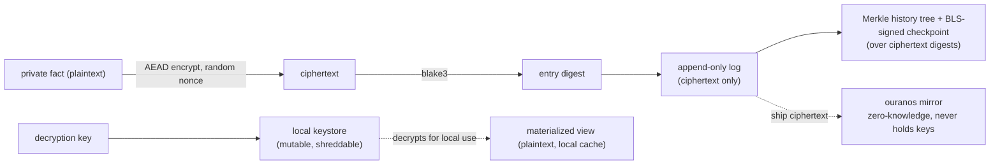

# 11 — Privacy, retention, and erasure: thinking it through

The psyche asked me to think deeply about the one decision that escalates
past the owners: an **append-only verifiable log** (the whole point of which
is that nothing can be removed without detection) versus the **right to
erase** private state (the whole point of which is that some things must
become truly gone). Crypto-shredding is the surface answer. This report is
the deep version: where the surface answer is exactly right, where it is
subtly wrong, and where the tension is *real and irreducible* and therefore
a values-call only the psyche can make. A research pass
(`privacy-erasure-verifiable-log-research`) is validating this against the
latest prior art in parallel; findings will be folded in.

## 1. The reframe: it is not a contradiction

The instinct is that "append-only" and "erasable" contradict. They do not —
because they are about *different things*.

What "append-only verifiable" actually protects is the **sequence of
commitments**: the blake3 hash-chain, the RFC-6962 Merkle history tree, the
BLS-signed checkpoints. Every one of those is a structure over **digests**,
not over **plaintext**. Their job is to make it impossible to *rewrite what
happened* undetected — integrity, durability, verifiability of the *record
that something occurred*.

What erasure needs is the **content** — the actual private fact — to become
unrecoverable, ideally while leaving the commitment intact.

These are separable, and that is the whole game: **destroy the content while
keeping the structure verifiable.** Crypto-shredding does exactly this, but
only if one subtlety is respected.

### The load-bearing subtlety: commit over ciphertext, never plaintext

If `entry_digest = blake3(plaintext)`, the digest is a **confirmation
oracle**. An adversary who *guesses* a low-entropy plaintext — a boolean, a
mood, a name from a small set, a yes/no about a person — confirms the guess
by recomputing the hash. "Delete the plaintext, keep the hash" does **not**
erase low-entropy private facts.

Real erasure requires the committed value to be **indistinguishable from
random** once the key is gone. So a private payload is **encrypted with a
semantically-secure AEAD** (random nonce per record, so identical facts do
not produce identical ciphertext), and the log commits over the
**ciphertext**. `blake3(ciphertext)` then reveals nothing and confirms
nothing. The integrity is over ciphertext; the content lives behind a key.

## 2. The mechanism: zero-knowledge mirror + local keystore

The consequence of committing over ciphertext is an architecture that is
*cleaner* than the "GC the mirror" instinct I started with:

- **The mirror holds only ciphertext it cannot read.** ouranos becomes
  **zero-knowledge**: it verifies hash continuity, inclusion/consistency
  proofs, and BLS signatures — all over ciphertext — but never sees content.
- **Keys live in a separate, mutable, *local* keystore** — the one
  non-append-only surface in the whole system. The keystore is the privacy
  boundary.
- **Erasure = shred the key.** The content becomes **globally inert at
  once**: the log, the checkpoints, and the mirror all hold only ciphertext,
  and with the key destroyed *no party anywhere* can read it.

The payoff: **"ouranos never GCs" can stay true for private stores.** Erasure
never touches the mirror — you do not have to trust the mirror to actually
delete, and you do not break append-only verifiability. The mirror keeps the
ciphertext forever; the ciphertext is already unreadable. **Crypto-shredding
is strictly stronger than mirror-GC**: GC requires a trusted deleter and
breaks the proof chain; key-shred requires neither.

And the verifiable structure **survives erasure intact**: every inclusion
and consistency proof (over ciphertext digests) and every BLS checkpoint
still verifies. You can still prove "entry N existed and the log is a
consistent extension" — you simply cannot read N. That is precisely the
right shape: **tamper-evidence of history without content recoverability.**

## 3. It is a spectrum, not a two-row matrix — and Spirit already has the dial

My earlier "never-GC vs crypto-shred" was too coarse. The real structure is
a **spectrum of durability/erasability classes driven by the privacy
class** — and Spirit *already carries the classifier*: the `Entry` has a
`Privacy` magnitude (`Zero..Maximum`), and the guardian already gates on it
(its `UnclearPrivacy` rejection reason). The dial exists; the design just
maps it to a durability class.

| Privacy class | Stored as | Mirror | Erasure | Verifiable history |
|---|---|---|---|---|
| **Public** (Privacy `Zero`) | plaintext | append-only, never-GC | none needed | full |
| **Private** (mid) | **ciphertext** | zero-knowledge | **crypto-shred content** | full (over ciphertext) |
| **Maximum** | local-only or trusted-private; often *not* committed to a verifiable structure | not mirrored, or mirrored under stricter rules | by *not durably logging* | **forgone by choice** |
| **Ephemeral** | never persisted | none | n/a | none |

The clean unification: **the guardian (`IntakePolicy`) is the classifier.**
Admission and privacy-classification are the *same gate* — the guardian
already decides "may this enter, and at what privacy" — so it routes each
entry to its durability/erasability class on the way in.

## 4. The hard residue: content-erasure is solved; existence-erasure is not

This is the part that does not have a clean answer, and pretending otherwise
would be the failure.

Crypto-shredding erases **content**, not **existence**. After shredding, the
ciphertext, a tombstone, and the *timing* remain visible: "an encrypted
thing existed at sequence N and its key was destroyed at M" is **permanently
visible**. For most private content that is fine — the *content* is the
private part. But for the most sensitive material, the very **existence and
timing** is the private fact (that a record about a person, a diagnosis, a
relationship ever existed at all).

True existence-erasure has only two routes, and both cost something real:

- **Redactable structures (chameleon hashes,** Ateniese et al.**).** A
  trapdoor holder can rewrite a block without breaking the chain. But that
  trapdoor is *a privileged party who can silently rewrite history* — which
  **undermines tamper-evidence for everyone**. Redactability *requires* a
  trapdoor; a trapdoor *weakens* immutability. For a single-trusted-psyche
  deployment this buys little and complicates the BLS/Merkle story; I lean
  against it. (Research is checking whether a *fine-grained, policy-bound*
  chameleon variant changes this.)
- **Do not durably log it.** The most existence-private material lives in a
  *different durability class entirely* — local-only, never-mirrored, no
  verifiable history — **precisely because** versioning and verifiable backup
  are the opposite of deniable. The privacy discipline already has the closed,
  never-version-controlled surface for exactly this.

**The deep point: versioning and forgetting are genuinely opposed for
existence (not content).** A perfectly verifiable, durable, branchable
history is the *opposite* of forgettable. You can crypto-shred content and
keep verifiability; you **cannot** keep verifiable durable history *and* make
existence forgettable — not without a trapdoor that defeats the verifiability
you wanted. So the honest design does not paper this over with one mechanism.
It offers the **spectrum** and makes the trade **explicit and per-class**:
the psyche chooses, per privacy class, how much forgettability to trade for
how much durability and verifiability — and accepts that the most-forgettable
class **gives up verifiable durable history**. That acceptance is the
content of the decision.

## 5. The dual failure mode: accidental erasure is as dangerous as failure-to-erase

Erasure-by-key-destruction has a symmetric hazard. **Lose a key = permanent
accidental erasure = silent data loss** — the exact opposite failure. The
keystore is the crown jewel: lose it and all private content is gone; leak
it and all privacy is gone.

So the keystore needs **its own backup** — but a key backup *re-introduces
un-erasure* (a backed-up key is not really destroyed). This is recursive,
and it bottoms out at a **root secret**:

- Per-record/class keys are escrowed **individually** (not as one monolithic
  blob) under a **root secret**, so a single key can be destroyed in both the
  live keystore and its escrow.
- The **root secret** is the ultimate trust anchor — held by the psyche
  (hardware token / master key), and **its destruction is the nuclear option**
  ("burn it all": destroy the root and every private payload becomes inert at
  once). That the nuclear option *exists* is itself a property worth deciding
  on.
- Natural custodian: **criome** (our identity/attestation/secrets component).
  Erasure becomes a **criome capability** — a signed erase request — which
  keeps the crypto basis consistent (`x0ja`) and puts key custody where
  identity and trust already live. The symmetric AEAD cipher is then *one
  consistent choice* across components (a modern AEAD such as
  XChaCha20-Poly1305), extending `x0ja`'s "one crypto basis" to the symmetric
  layer — new machinery to build, like the BLS aggregation, not extant reuse.

## 6. Accountable vs deniable erasure (a second trade inside the first)

Should a shred be *recorded*? A typed, signed **`Erasure` entry**
(append-only) lets you **prove what was erased and when, without revealing
content** — erasures become **accountable** (you openly erased content; you
did not secretly rewrite history). That is the right default for the
private-but-durable class.

But the `Erasure` entry *is* the existence-leak from §4 — "an erasure
happened at M" is now permanent. So **accountability and existence-privacy
are themselves opposed**: accountable erasure is visible; deniable erasure is
invisible and forces the don't-log class. Another explicit per-class trade,
not a contradiction to resolve.

## 7. How it composes with the rest of the design

- **Branch / merge / rebase** are unaffected in structure: the log carries
  ciphertext; the policy/reducer operate on *decrypted* content **locally**,
  for a key-holder. So **branching a private store is a key-holder-only
  operation** — a zero-knowledge peer can verify structure and relay
  ciphertext but cannot merge content. That is correct and expected.
- **The guardian** is the classifier (admission = privacy-classification);
  `UnclearPrivacy` already exists as its refusal.
- **Checkpoints** hold ciphertext segments for private stores (plaintext for
  public); one key-shred erases the log *and* the checkpoint together.
- **Consistent crypto (`x0ja`)** extends cleanly: blake3 over ciphertext;
  criome BLS over checkpoints; criome custodies keys; one AEAD cipher
  workspace-wide.

## 8. Recommendation, and the questions only the psyche can answer

**Recommendation.** Adopt the **privacy-class-driven durability/erasability
spectrum** (§3), with:

- **Content-erasure via crypto-shredding** for the private-but-durable class —
  encrypt-then-commit-over-ciphertext, zero-knowledge mirror, local
  criome-custodied keystore. **"ouranos never GCs" stays** (erasure is
  key-shred, not mirror-GC).
- **Existence-erasure via not durably logging** (the closed local-only
  surface) for the maximum class — explicitly forgoing verifiable durable
  history there.
- **Accountable erasure** (typed signed `Erasure` entries) as the default for
  content-erasure; **deniable** (don't-log) where existence must vanish.
- **The guardian as classifier**; a **root secret** (psyche/hardware) as the
  trust anchor and the nuclear option.

**The questions are genuinely yours — they are trades between durability,
verifiability, accountability, and forgettability, which are values, not
mechanisms:**

1. **Accountable vs deniable.** For private-but-durable state, is
   *accountable* content-erasure acceptable — the *fact and timing* of an
   erasure stays visible while content is gone — or do you need *deniable*
   erasure (existence and timing gone too) for some state, which forces *not
   durably logging* it?
2. **Granularity.** Per-record, per-privacy-class, or per-store erasure?
   (Finer = stronger right-to-erase, more key management.)
3. **The root and the nuclear option.** criome-custodied keys under a
   psyche/hardware root secret — and do you want the "destroy the root =
   erase all private content" capability to *exist*?
4. **The threshold.** What **Privacy magnitude** crosses the line from
   *crypto-shred-and-version* (encrypted, durable, verifiable, content-
   erasable) to *do-not-version-at-all* (local-only, not mirrored,
   existence-forgettable)? This is the single dial that assigns every record
   to a class.

The design can ship the public and private-encrypted classes now and treat
the maximum/ephemeral classes as "route to the closed surface, do not
version." The four questions decide where the lines fall — and the one
irreducible truth to hold onto is that **for existence (not content),
verifiable durable history and forgettability cannot both be had; the system
should let you choose per class, and be honest that the choice is a real
loss on one side.**
