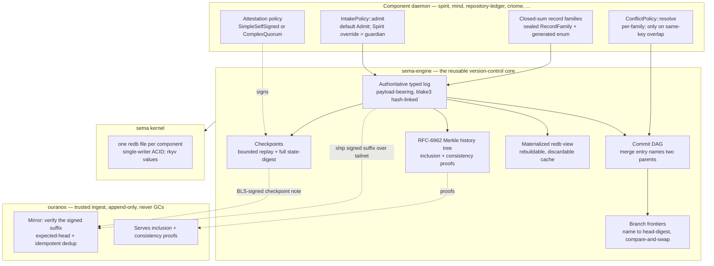
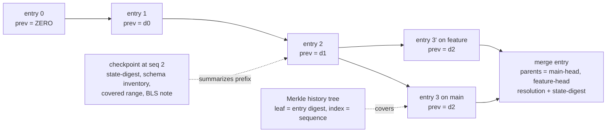
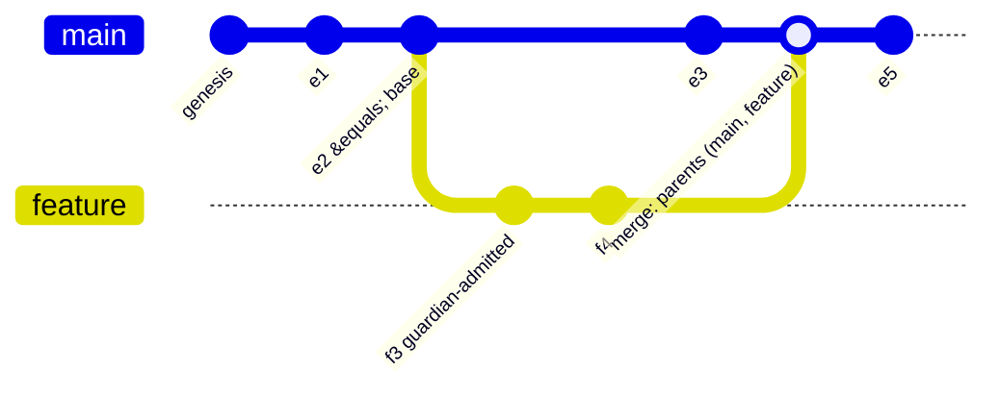
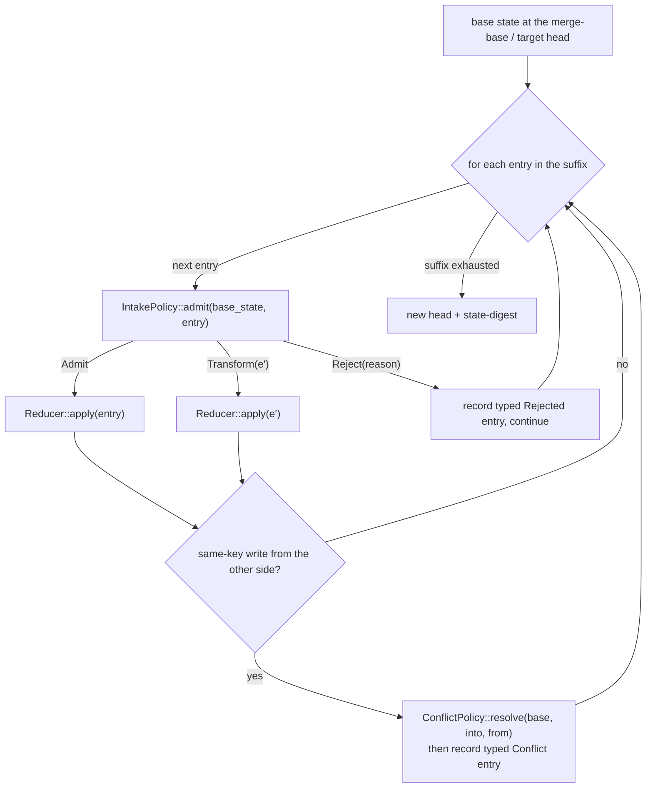
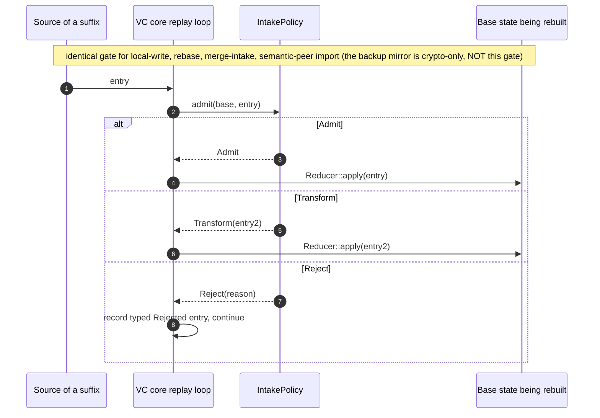
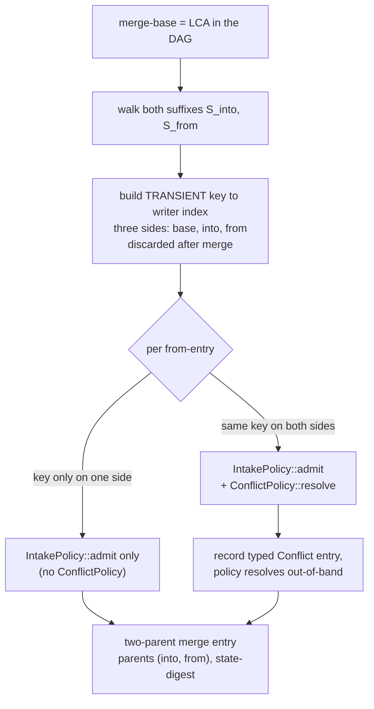
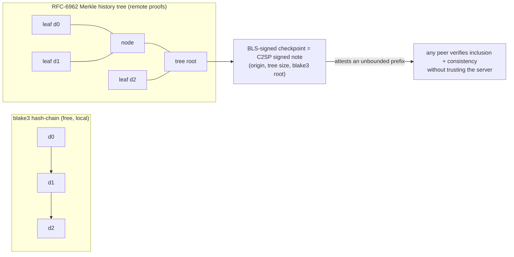
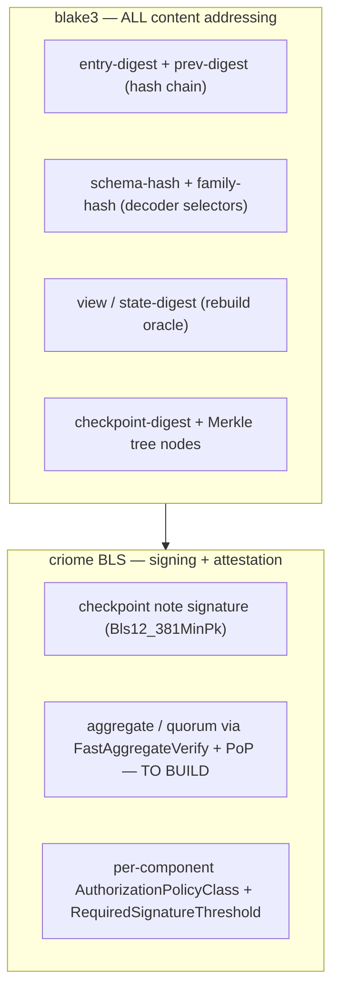

# 8 — The versioned-state grand design (visual)

This is the centerpiece: what the design *looks like*, how it *works*, and
what is *clever*. It is the synthesis of the frontier research (chapters
1-7), the prior arc (reports 92/93/94, the operator mainline, audit 211),
and the psyche's escalation (Spirit `i4ak` / `x0ja` / `jys2`). Diagrams
carry the load; prose explains and flags the clever moves.

## 0. The thesis in one breath

**Version the log, not the store.** A per-component, payload-bearing,
blake3-hash-linked typed **event log** is the single source of truth; the
redb store is a rebuildable cache. Because every change is already a typed
entry, **the log suffix *is* the diff** — so branching, forking, rebasing,
and merging are not new machinery: they are the *same fold* —
**replay-a-suffix-through-a-per-component-policy** — applied to different
ranges. The whole history is **verifiable** (a blake3 Merkle tree gives
inclusion + consistency proofs) and **attestable** (BLS-signed checkpoints).
One crypto basis throughout: **blake3 + criome BLS**.

## 1. What's clever (the eight moves)

The psyche asked specifically what is thought to be clever. These are the
load-bearing insights, each validated against 2024-2026 state of the art:

1. **The diff-carrying log makes branching *cheaper* than Dolt — we never
   recover a diff.** Dolt's 2025 fast-merge still has to *walk two prolly
   trees* to recover node-level patches before it can merge; we stored the
   typed suffix, so the suffix already *is* the patch set. The strongest
   possible witness: **ATProto** — the most Merkle-Search-Tree-native system
   in production — moved repo-sync *diffing* onto a causal write-ordered
   stream in Sync v1.1 (2024, relay rollout May 2025), keeping the tree only
   to *verify*. A Merkle-native system used the write-ordered log to carry
   the diff. That is exactly our thesis.

2. **Rebase-through-guardian: the guardian is not a merge algorithm — it is
   the existing write-admission function, now also invoked on replayed
   entries.** One interface (`IntakePolicy`) gates *every* path an entry
   takes into a branch (local write, rebase, merge-intake, remote ingest),
   so a rebased entry is admitted on identical terms to an authored one.
   **You cannot smuggle an entry past Spirit's guardian by routing it
   through rebase.**

3. **One primitive, several jobs.** Replay-suffix-through-policy is the
   shared fold under rebase, merge-intake, crash recovery, remote-mirror
   ingest validation, *and* schema migration. They differ only in *source
   range* and *policy function* — not in mechanism.

4. **Only one real conflict needs structure, and it is transient.**
   Concurrent writes to the *same key* are the only genuine merge conflict;
   everything else is order-independent replay. Detecting it needs a
   throwaway three-sided (`base` / `into` / `from`) `key → writer` hash map
   built from the two suffixes and **discarded after the merge** —
   eg-walker's (EuroSys '25) "temporary CRDT built during merge, thrown
   away after." Trivial for us because our keys are explicit record
   identifiers (no positional-tombstone problem that makes text hard).

5. **Sign the tree *head*, not every entry.** One BLS-signed checkpoint
   attests an unbounded prefix via Merkle inclusion proofs, keeping the
   latency-sensitive write path signature-free. A same-message
   `FastAggregateVerify` collapses an N-witness quorum to one ~48-byte
   signature verified in ~2 pairings.

6. **Two orthogonal per-component policy layers on one log.** A
   *content-admission* policy on intake/rebase (the guardian; default
   `Admit`) and a *history-integrity* policy on checkpoints (the BLS
   attestation threshold) — both default-plus-override, the second mapped
   onto criome's real `AuthorizationPolicyClass::{SimpleSelfSigned,
   ComplexQuorum}` + `RequiredSignatureThreshold`.

7. **Migration is a branch.** Replay the reducer over history on a side
   branch, verify the rebuilt state digest offline, BLS-attest it, then
   atomic head-swap (gh-ost's cut-over invariant). The zero-downtime
   complex upgrade `jys2` says is now routine.

8. **MST (not prolly tree) only where structure is actually earned.** The
   *log* never needs a tree (the suffix is the diff). The *only* place a
   structure helps is diffing two *distant checkpoint states* without their
   shared log, and there a **Merkle Search Tree** (order-preserving,
   hash-determined depth, native anti-entropy, clean single-record
   inclusion proofs for BLS) is the right variant — for the properties it
   earns, not because branching "revived" prolly trees (it did not).

## 2. The layered architecture



The component owns *meaning* (families + policy); the engine owns the
*reusable mechanism* (log, DAG, frontiers, checkpoints, history tree, view);
the kernel owns *bytes*; the server is a *dumb, trusted, append-only*
endpoint. Nothing about DVCS changes the kernel — the view stays a cache.

## 3. The data model: log → DAG, checkpoints, frontiers, history tree



Each entry is one `ReplayEnvelope`: `op`, `family schema-hash` (the typed
decoder selector), `key`, `payload` (rkyv bytes — typed in motion, erased
at rest), `prev-digest`, `sequence`, `entry-digest`. The **only structural
change branching forces** is promoting the hash *chain* to a *DAG*: a merge
entry carries **two parents in fixed canonical order** `(parent_into,
parent_from)` plus the recorded resolution and the resulting state-digest.
The Merkle **history tree** is maintained *beside* the chain (same entries,
leaf = entry's blake3, index = `CommitSequence`) purely to serve O(log n)
remote inclusion/consistency proofs; the chain still gives free local
integrity.

## 4. The branch model: branches as frontiers over a commit DAG

A **branch** is a *named movable cursor* — `name → head-digest` — never a
copy. Entries are shared by content address up to the divergence point.
**Fork** = take a head and append a private suffix. **Branch-cursor advance
is a compare-and-swap** `(name, expected_old_digest → new_digest)`, not an
unconditional write.



A branch head is a **frontier** (Loro's concept) instantiated with our
blake3 head digests, because heads are content-addressed. **Bitemporality
is orthogonal**: valid-time lives as a *payload field* inside the typed
record, never as a branch (rejecting Datomic's single-timeline conflation).

**Hard invariant (the Datomic trap, avoided):** every intake / merge /
rebase decision is a *pure function of the base state being rebuilt and the
entry* — **never the live head**. Branch points are content-addressed
checkpoints, not bare log offsets into a shared mutable index. This is a
tested property: fork from a pruned-past checkpoint, append, assert no
live-head leakage.

## 5. The one primitive: replay-suffix-through-policy

Every DVCS verb reduces to folding a suffix of typed entries through two
per-component policy hooks. This is the reusable core's heart.



```rust
// the reusable core defines exactly two seams; the component implements them
trait IntakePolicy {                         // content admission — runs on EVERY entry
    fn admit(&self, base: &State, entry: &Entry) -> Admission;
}
enum Admission { Admit, Reject(Reason), Transform(Entry) }

trait ConflictPolicy {                       // resolution — runs ONLY on same-key overlap
    fn resolve(&self, base: &Record, into: &Record, from: &Record) -> Resolution;
}
```

The two legs are **independent**: `IntakePolicy` runs on every `from`-entry
regardless of key disjointness; `ConflictPolicy` runs *only* when the
transient overlap index reports a same-key collision. Both are
default-plus-override (default `Admit`; default resolution is a per-component
choice — last-writer-by-sequence or hard-fail-as-typed-conflict).

## 6. `IntakePolicy::admit` on all four paths (the unification)



For Spirit, `IntakePolicy` *is* the guardian — and the guardian already
exists in the live schema with a typed verdict surface
(`GuardianRejectionReason [Duplicate Contradiction Compound NonIntent
UnclearPrivacy ClarifyTramples SupersedeTargetMissing ...]`). So
`IntakePolicy` is the *generalization of a thing Spirit already has*;
`Reject(reason)` is the guardian's existing verdict. The interface is not
invented to fit the design — it names the function the guardian was already
implementing.

## 7. Merge: disjoint keys vs concurrent same-key



Precise claim (corrected from an earlier overstatement): disjoint keys
eliminate the **ConflictPolicy** leg, **not** the **IntakePolicy** leg —
under a *stateful* guardian, every `from`-entry is still admitted
entry-by-entry against the evolving merged base and may be rejected or
transformed on aggregate / referential / invariant grounds. "Free merge"
means *free of structural conflict resolution*, not *free of admission*.

**Convergence is deterministic** because the merge entry records
`(parent_into, parent_from)` in fixed order and the result is the
deterministic fold `base → S_into → policy(S_from)` — so two honest peers
merging the same two heads recompute the identical head. **A merge or
rebase never blocks at the log level**: it always succeeds, emitting a typed
`Conflict` / `Rejected` / `Divergence` entry that the policy resolves
out-of-band (jujutsu's first-class conflicts). Mid-suffix, a rejected entry
**records-and-continues** — and because intake is order-dependent, that
recorded entry becomes part of the base subsequent entries see, so it must
be canonical.

## 8. Rebase through the guardian

```mermaid
sequenceDiagram
    autonumber
    participant R as Rebase driver
    participant Core as VC core
    participant G as Spirit guardian (IntakePolicy)
    participant Base as New base (target head)
    Note over R,Base: re-apply S_from onto a DIFFERENT base; rewrite history (new digests)
    loop each entry in S_from
        R->>Core: entry (prev = old predecessor)
        Core->>G: admit(new_base_state, entry)
        alt admitted / transformed
            G-->>Core: Admit or Transform
            Core->>Core: set prev = new base head, recompute blake3 (cascade)
            Core->>Base: Reducer::apply, advance head
        else rejected
            G-->>Core: Reject(reason)
            Core->>Core: record typed Rejected entry, continue
        end
    end
    Core-->>R: new single-parent suffix + head
```

**Rebase is distinct from merge** (we reject Pijul's rebase==merge identity,
which is a commutativity theorem needing order-independent change identity
our log does not have): rebase **rewrites onto a new base and re-digests**
the suffix — the unavoidable O(|suffix|) blake3 cascade, single-parent —
while merge keeps both parents and re-digests nothing. **Prefer merge over
rebase when mirror bandwidth matters**, since rebase re-ships the whole
rewritten suffix.

## 9. Verifiable + attestable history

Two complementary structures over the *same* entries, plus a signed head.



- **Local integrity** is the blake3 chain (already free).
- **Remote verifiability** is a Crosby-Wallach / RFC-6962 Merkle history
  tree: O(log n) **inclusion** proofs ("entry E is in the log") and
  **consistency** proofs ("this log is an append-only extension of the one
  you last saw") — so ouranos can serve proofs it cannot forge.
- **Attestation** is a **C2SP signed-note** over `(origin, tree size,
  blake3 root)` signed with `Bls12_381MinPk`. Per-component policy via the
  real `AuthorizationPolicyClass::{SimpleSelfSigned, ComplexQuorum}` +
  `RequiredSignatureThreshold`. We **deliberately diverge** from C2SP's
  now-recommended ML-DSA-44 *algorithm* to keep **BLS aggregation /
  threshold** (the load-bearing property), while reusing C2SP's
  *algorithm-agnostic envelope* so a post-quantum cosignature can be added
  *beside* BLS later without reformatting.

**Honesty flag:** same-message aggregation, `FastAggregateVerify`, and
mandatory proof-of-possession are **new machinery to build** — criome today
carries only the `SignatureScheme` tag, `AuthorizationPolicyClass`,
`RequiredSignatureThreshold`, `SignatureAuthorizationResult`, and
`SignatureSolicitation`. This is a build item, not extant reuse.

## 10. Backup = ship-and-verify the signed suffix

```mermaid
sequenceDiagram
    autonumber
    participant C as Component (local-committed)
    participant O as Outbox (durable, queued-for-mirror)
    participant S as ouranos (append-only)
    C->>O: enqueue suffix since last server head
    O->>S: append(suffix, prev = server_head_digest)
    alt expected-head matches
        S->>S: idempotent dedup by entry-digest, fsync
        S-->>O: ack new head (server-committed)
    else gap or fork
        S-->>O: reject; backfill or quarantine
    end
    Note over C,S: durability levels = local-committed -> queued-for-mirror -> server-committed (per-store, named RPO)
```

Backup *is* version control: shipping the signed suffix to ouranos both
durably backs up and extends the verifiable log. ouranos is append-only and
**never GCs**; the local store GCs against its own **branch frontiers**
(mark-from-frontiers + pack survivors). The compaction floor is
**schema-aware**: never compact past the oldest live branch's merge-base,
even across a schema boundary.

## 11. Zero-downtime migration as a branch

```mermaid
sequenceDiagram
    autonumber
    participant Op as Migration driver (agent-authored reducer)
    participant Side as Side branch
    participant Main as Live branch (serving reads)
    Op->>Main: append SchemaTransition entry (v_old -> v_new, reducer id)
    Op->>Side: fork at the transition; replay reducer over history
    Side->>Side: rebuild new-schema view, compute state-digest
    Op->>Side: offline equivalence check + BLS-attested checkpoint
    Note over Main: main keeps serving the whole time
    alt verified
        Op->>Main: atomic head-swap (gh-ost cut-over invariant)
    else mismatch
        Op->>Side: discard branch, main untouched (all-or-nothing-or-revert)
    end
    Note over Op,Main: dual-decode window keeps BOTH schema-hashes live for cross-schema merge
```

We import only gh-ost's **atomic cut-over invariant** and pgroll's
**transform-as-migration-data** idea — **not** shadow tables or store-level
dual-write triggers, which migrate a *mutable store in place*; our store is
a derived view rebuilt from the log, so a parallel shape inside the store is
wasted scaffolding.

## 12. Where structure helps — and where it does not (the honest verdict)

| Surface | Needs a tree? | Why |
|---|---|---|
| The **log** (append-only) | **No, ever** | A branch shares a prefix for free; the suffix *is* the diff. Report 92's prolly-tree rejection holds *permanently*; branching does **not** revive it. |
| **Rebase / disjoint-key merge** | No | Pure replay-through-policy; the only structural object touched is the commit-DAG (to find the base + chain digests). |
| **Concurrent same-key merge** | **Transient only** | A throwaway three-sided `key → writer` hash map from the two suffixes, discarded after merge (eg-walker scaffold). Never persistent. |
| **Distant-checkpoint diff** (two far states, no shared log) | **Yes — an MST** | Order-preserving keys, hash-determined depth, native anti-entropy, clean single-record inclusion proofs for BLS. A **Merkle Search Tree**, *not* a Dolt prolly tree. Adopt only when branch/merge concretely requires authenticated view diffs. |
| **Remote inclusion / consistency proofs** | **Yes — RFC-6962 tree** | O(log n) verifiable proofs over the entries; complementary to the chain. |

## 13. The consistent crypto layer (blake3 + criome BLS)



One hashing mechanism (blake3) for every content address; one signing basis
(criome BLS) for every attestation — `x0ja` satisfied, no per-component
divergence. The envelope stays algorithm-agnostic so a PQ cosignature can
join later.

## 14. Per-component policy matrix

| Component | `IntakePolicy` | `ConflictPolicy` (default) | Attestation |
|---|---|---|---|
| **spirit** | the **guardian** (admit / reject / transform; typed `GuardianRejectionReason`) | typed-conflict, guardian-resolved | `ComplexQuorum` for high-importance history |
| **repository-ledger** | provenance check (hook origin) | last-writer-by-sequence | `SimpleSelfSigned` |
| **mind** | default `Admit` (or a work-graph invariant check) | per-family | `SimpleSelfSigned` |
| **a cache store** | default `Admit` | last-writer | none / `SimpleSelfSigned` |

Default-plus-override throughout: a component that does not care writes zero
policy code and inherits the transparent defaults.

## 15. The reusable owning-noun set

Every verb lands on a data-bearing noun (no free functions, no stringly
generic-record store). The core the library must name:

`ReplayEnvelope` · `SchemaHash` / `FamilyIdentity` · `EntryDigest` ·
`CommitSequence` · `CommitDag` + `MergeEntry(parent_into, parent_from,
resolution, state_digest)` · `Frontier` (branch head set) · `BranchRef`
(CAS cursor) · `Checkpoint` · `MerkleHistoryTree` · `SignedCheckpointNote` ·
`IntakePolicy` · `ConflictPolicy` · `Reducer` · `MaterializedView`. Plus
**two format guards** (report 92's distinction): a *format-identity* guard
on the VC metadata format itself (its own version tag + whole-log-rewrite
migration path) separate from the per-family *schema-version* guard.

## 16. Positioning vs the state of the art

| System | Branch/merge mechanism | What we take | What we reject |
|---|---|---|---|
| **git / jj** | snapshot trees + rediff; jj first-class conflicts | DAG + replay soundness; **jj's record-and-continue conflicts** | git's diff-recovery (we store diffs); rebase==merge |
| **Dolt** (2025 fast-merge) | walk two prolly trees to recover patches | commit-DAG-as-truth; newgen/oldgen GC idea | prolly-tree-for-the-log; cell-merge engine |
| **Datomic / XTDB** | single authoritative timeline | log-is-truth, replay | cannot-branch-the-past; single-timeline |
| **Irmin** | three-way-merge functor `merge ~old t1 t2` | the **merge signature** as `ConflictPolicy` | type-erasure genericity |
| **TerminusDB** | immutable delta layers + rollup | delta-layer ≈ entry; rollup ≈ checkpoint | triple/RDF + succinct type erasure |
| **eg-walker** (EuroSys '25) | authoritative event graph + throwaway merge CRDT | **the transient-scaffold idea, native over our closed-sum** | depending on Automerge/Loro crates (schemaless) |
| **ATProto** (Sync v1.1) | write-ordered CAR stream carries the diff; MST verifies | **validates the whole thesis** | MST for the log |
| **Sigstore / CT / C2SP** | Merkle transparency log + signed notes | RFC-6962 proofs + C2SP envelope | ML-DSA-44 *now* (keep BLS aggregation) |

The differentiator in one line: **because we version the log, the suffix is
the diff — so we get branching, merge, rebase, verifiable history, and
zero-downtime migration without ever building the structural diff engine
every store-versioning system is forced to build.**

## 17. What we deliberately reject, and what stays open

**Reject as cargo-cult** (full reasoning in chapter 7): prolly trees /
content-defined-chunking for the log; Pijul's rebase==merge identity;
git's snapshot-rediff; general CRDT auto-merge as the resolver (erases
type); TerminusDB/Irmin type-erasure genericity; Datomic's single-timeline
assumption; multi-party threshold quorum as the *default* (ouranos is single
+ trusted — `ComplexQuorum` stays opt-in); shadow tables / store dual-write;
branching from a bare past offset that reads the live head; a general
structural merge engine; HAMT as the versioned structure; ML-DSA-44 now;
sparse-Merkle/verifiable-map for the view until branch/merge needs it.

**Open questions for the owners** (chapter 7 has all eight): does
resting-bytes honour the *spirit* of perfect specificity (the closed-sum is
the answer, the knife-edge is real); where the branch/policy layer **lands**
(new crate vs sema-engine primitive vs beside-the-kernel); is the default
`ConflictPolicy` last-writer or hard-fail-as-typed-conflict; how aggressively
to emit checkpoints vs the live-branch-base retention floor; whether the
guardian gains a learned/cached decision layer (git-rerere-style) without
violating the pure-function-of-base invariant; whether a `SchemaTransition`
reducer is lossless enough to make **cross-schema merge** meaningful; and
whether to implement git-ort-style **virtual merge bases** for criss-cross
topologies now or refuse multi-LCA merges loudly until a real case appears.

This report does not decide those — it draws the design and isolates the
decisions. The kernel inversion, the home layer, and the policy defaults
remain the `sema`/`sema-engine` owners' call.

## Correction (operator position 214)

System-operator position
`reports/system-operator/214-Refresh-sema-versioned-state-grand-design-operator-position.md`
accepted this design as the target and hardened it; the full designer
response is file `10-response-to-operator-position-214.md`. Corrections that
touch *this* file:

- **§6 conflated two remote roles.** `IntakePolicy::admit` runs on
  **local-write, rebase, merge-intake, and semantic-peer import** — **not**
  on the **backup mirror**, which is **crypto-only** (continuity,
  expected-head, signatures, idempotence; §10's shape) and never runs the
  guardian. The server role must be explicit so remote ingest is never an
  accidental guardian bypass *or* an accidental guardian. (§6 note fixed.)
- **§9/§11 checkpoints need payload, not just a digest.** A checkpoint
  digest + schema inventory + covered range *verifies* a state but cannot
  *restore* one — the design needs `CheckpointMetadata` + `CheckpointSegment`
  records holding sorted family/key/payload, content-addressed by blake3,
  over a `CommitSequenceRange`.
- **§13 "ouranos never GCs" is not a universal default.** Private /
  Spirit-class stores need classed retention + cryptographic-erasure
  (crypto-shred) semantics; the right-to-erase vs append-only-verifiability
  tension is a **psyche** decision (a per-store privacy/retention matrix),
  not an owner default. See file 10.
- **The guardian-determinism nuance (§5/§8).** A non-deterministic (LLM)
  guardian's **verdict is the durable fact**: it is recorded with policy
  identity and *replay replays the recorded verdict*, never re-asks a newer
  guardian. The "pure function of base state" invariant holds at the replay
  boundary over recorded verdicts.
