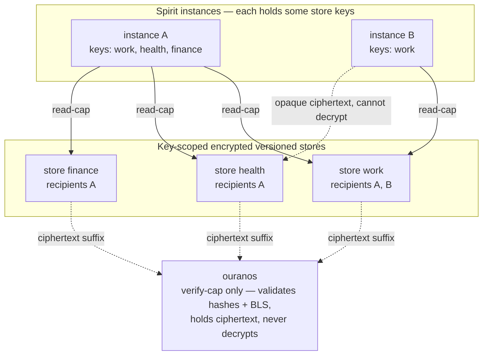
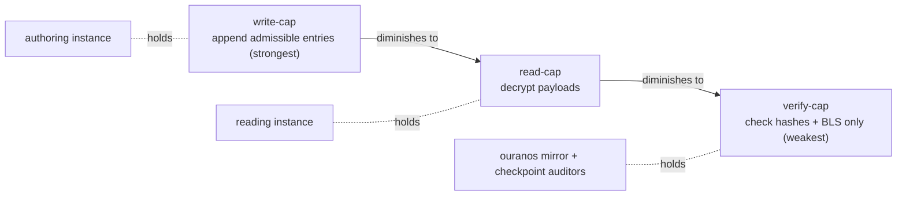
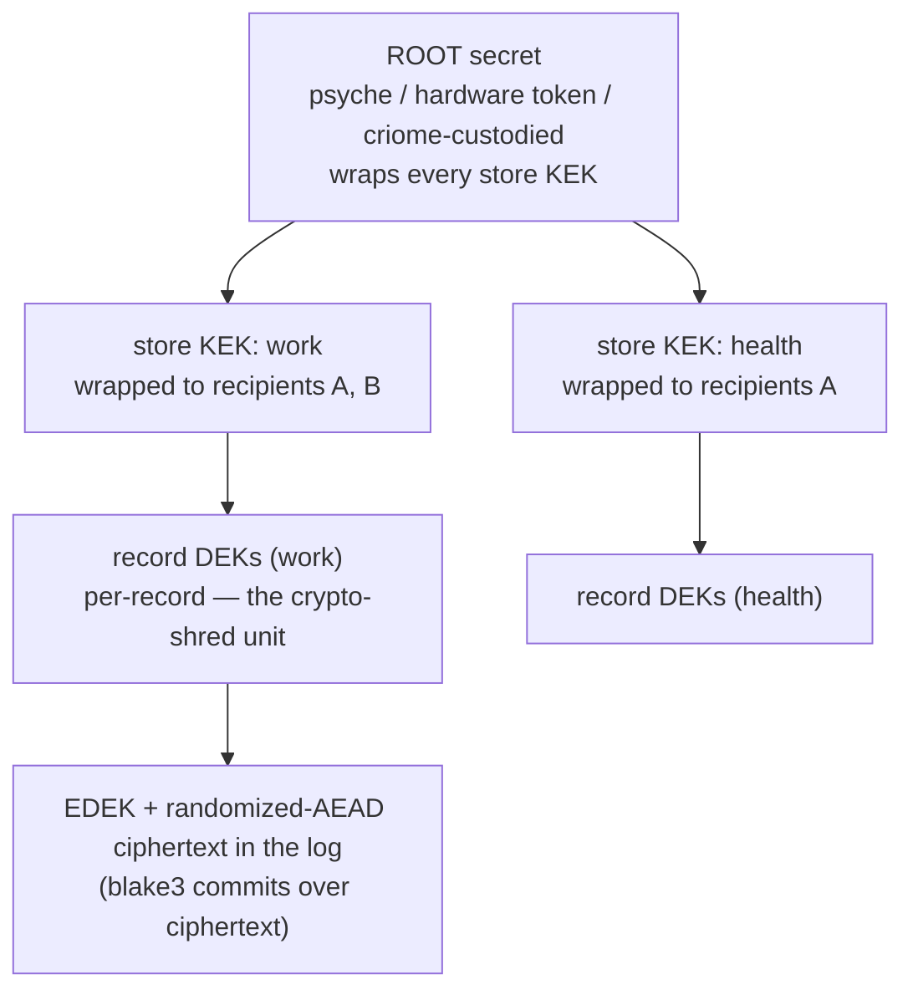
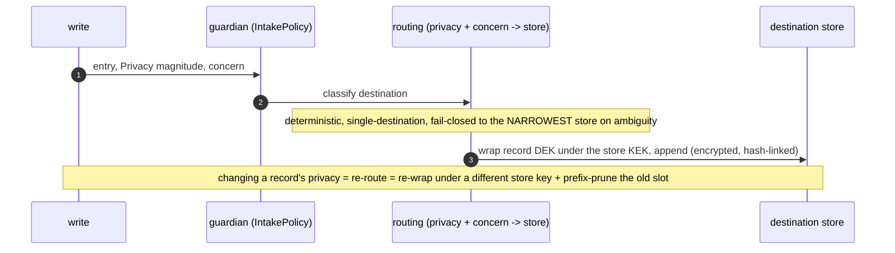
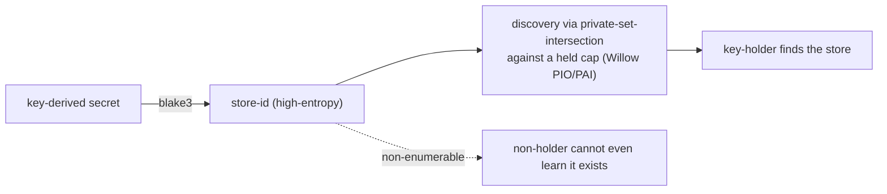
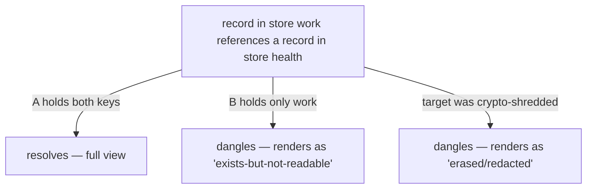

# 6 — The federated key-gated Spirit (visual design)

`dun9` realized: Spirit — and any private component — is a **federation of
key-scoped encrypted versioned stores**. Each store is one of the grand
design's typed event logs (report 95), encrypted to a **recipient set**; an
instance decrypts exactly the stores whose keys it holds; its view is the
**union** of those; the mirror holds only ciphertext it can verify but never
read. This file draws it. Diagrams carry the load; prose flags what is
clever and what is hard. Built on the research (chapters 1-5), `95/11`, and
operator 214/215.

## 1. What's clever (the moves)

1. **Three one-way-diminishing capabilities per store key (Tahoe-LAFS):
   write-cap → read-cap → verify-cap.** The mirror (ouranos) holds *only*
   the **verify-cap** — it validates every hash and BLS signature without
   decrypting anything. Our log-over-ciphertext already produces a natural
   verify-cap distinct from the read-cap. "Zero-knowledge mirror" stops being
   a slogan and becomes a precise capability.
2. **Envelope encryption decouples access from erasure (KEK → DEK).** The
   per-store **KEK** is the access/recipient boundary — change readers by
   *re-wrapping* it, never re-encrypting content. The per-record **DEK** is
   the crypto-shred unit. So you get **per-store access *and* per-record
   erasure at once**, dodging both "erasure nukes the whole store" and
   "a key per row collapses performance."
3. **The store-id *is* the discovery capability (Willow PIO/PAI, Earthstar
   share-addresses).** A store-id is `blake3(key-derived secret)`, found only
   by private-set-intersection against a held cap — so existence-private
   stores are **non-enumerable** and there is **no public registry to leak**.
   (GoPass is the counter-example to avoid: it leaks mount names,
   `.public-keys/<id>`, and the git tree in plaintext.)
4. **The Privacy magnitude becomes a *routing function*, not a read-time
   gate.** The guardian computes *which recipient-set store* an entry is
   written to — strictly stronger than a threshold, because a non-key-holder
   cannot read it regardless. This is what old Q4 dissolves into.
5. **`revoke()` and `erase()` are different verbs and must never be
   conflated.** Re-wrapping the KEK stops *future* access; the removed reader
   still decrypts all *past* ciphertext and may have cached plaintext. Only
   crypto-shredding the DEK erases — and only for holders who *only ever held
   ciphertext* (the mirror), never a cached plaintext.
6. **Cross-store references are partial *by design*.** The same reference
   resolves for a key-holder and dangles for everyone else — that *is* the
   privacy. A crypto-shredded target leaves the hash-link intact but
   semantically dangling: correct (render as redacted), not corruption.
7. **Sync and compaction happen over ciphertext (Ink&Switch
   Keyhive/Beelay/Sedimentree).** Reconcile the membership graph first to
   decide visibility, then RIBLT-reconcile state-hash symbols that already
   encode `(store-id, hash(heads))`; Sedimentree picks compaction boundaries
   by *trailing-zero-bits of the commit hash*, so divergent encrypted
   replicas independently choose identical boundaries and the zero-knowledge
   mirror compacts ciphertext it cannot read.
8. **Coordination-free revocation via causal dominance (Keyhive blanking /
   p2panda strong-removal).** A removed instance's concurrent writes lose the
   merge; a removed member cannot add a member even at the same logical time
   — correct revocation with **zero quorum/consensus**, exactly what a
   federation of independently-online instances needs.

## 2. The model: Spirit as a federation of key-scoped stores



A's view is `work ∪ health ∪ finance`; B's view is `work`. The same query
returns different results to A and B — **by design**: the privacy *is* the
key boundary. The store files are freely replicable (readable by many
instances) because reading requires the key, not the file.

## 3. The capability triad



One store key projects to three powers, each strictly weaker. The mirror is
handed the *weakest* that still lets it do its whole job (verify continuity,
inclusion/consistency proofs, BLS-signed heads). Nothing stronger ever
reaches it.

## 4. The key hierarchy: root → store KEK → record DEK



- **Change readers** = re-wrap the store KEK to a new recipient set (cheap;
  forward-only). This is `revoke()`.
- **Erase a record** = shred its DEK (small, fast, auditable). This is
  `erase()`. The mirror's ciphertext for it becomes globally inert.
- **Nuclear option** = destroy the root → every wrapped store KEK, and thus
  all private content everywhere, is unrecoverable at once. *Whether this
  capability should exist is the psyche's open Q3.*

Default granularity is **per-store KEK** (cheap); per-record DEKs are added
only for stores with a stated fine-grained-erasure requirement (else a key
per record explodes count and adds custody latency on every read/write).

## 5. Privacy magnitude becomes store routing (old Q4, dissolved)



The old "what magnitude crosses the line" question becomes "**which store
does this route to**," and each store carries a class (215's matrix:
`PublicPermanent`, `PrivateDurable`, `ExistencePrivate`-local-only, …).
**Routing must be deterministic and single-destination** — writing the same
fact to two stores of different privacy leaks the higher-privacy fact via the
lower store.

## 6. Revoke vs erase — the load-bearing distinction

| Verb | Mechanism | Stops | Does **not** reach |
|---|---|---|---|
| **`revoke(reader)`** | re-wrap the store KEK to a new recipient set | *future* reads by the removed reader | all *past* ciphertext (old key still decrypts) + any plaintext they cached |
| **`erase(record)`** | crypto-shred the record DEK + signed `ErasureReceipt` | recoverability for every ciphertext-only holder (the mirror) | plaintext already decrypted and cached by a past key-holder |

The guardian owns both verbs and **must refuse to present revocation as
erasure**. Neither reaches a cached plaintext — which is why
**existence-private material must not be durably logged at all** (report 11,
§4): no key operation can un-cache what a reader already saw.

## 7. Existence privacy: the store-id is the capability



There is **no public store registry** to tier — discoverability collapses to
"who you hand the high-entropy id to." Honest concession: PSI cannot stop
*confirmation of a correct guess*, so existence-privacy reduces to **store-id
unguessability** (and timing/size remain side-channels — the deepest tier
still belongs to the don't-durably-log class).

## 8. Cross-store references and atomicity (partial by design)



There is **no global cross-encryption-boundary integrity, and we do not
promise it.** A multi-store write is a **saga** of per-store-atomic appends +
compensating actions under causal consistency — **not** two-phase commit
(which would require the relay to read ciphertext to coordinate, and would
break offline-first partial replication). A synchronous cross-store invariant
forces **co-location in one store**. (Open: should the view *distinguish*
no-key from shredded, or does distinguishing them itself leak existence?)

## 9. Sync and compaction over ciphertext (zero-knowledge)

```mermaid
sequenceDiagram
    autonumber
    participant P as peer instance
    participant Q as other instance / mirror
    P->>Q: reconcile MEMBERSHIP graph first (who can see what)
    Q-->>P: visibility decided
    P->>Q: RIBLT symbols encoding (store-id, hash(heads)) for visible stores
    Note over P,Q: one decoded symbol names the differing store — relay learns nothing
    Q-->>P: ship the missing ciphertext suffix
    Note over P,Q: Sedimentree compaction boundary = trailing-zero-bits of the commit hash<br/>so divergent encrypted replicas pick identical boundaries; ouranos compacts ciphertext it cannot read
```

## 10. Two store classes (forward secrecy vs late-joiner history)

| Class | Encryption | Forward secrecy | Late joiner reads history | Use |
|---|---|---|---|---|
| **Readable-log** (default) | per-store KEK + per-record DEK (data-encryption) | only via periodic rotation | **yes** | almost all Spirit state (a wiki-shaped log new instances must read) |
| **Ephemeral** | Double-Ratchet (message-encryption) | **per-message** | no | genuinely ephemeral data, if in scope at all |

A compromised readable-log key exposes everything under it until rotation —
the price of letting late joiners read history. True forward secrecy needs a
*separate* ephemeral class, not a knob on the log. (Open: is the ephemeral
class even in scope for Spirit?)

## 11. How it composes with the grand design (95)

Each store **is** a full instance of the grand design — its own
payload-bearing log, branch/fork/merge/rebase, checkpoints, `IntakePolicy`,
and verify-cap mirror — just **key-gated and encrypted**. The federation is
"N of report 95, one per recipient set," plus:

- **Routing** (the guardian) places each entry into a store (§5).
- **Cross-store** is a saga, never one transaction (§8).
- **Migration** runs **per-store, client-side, lazily, on the store's own
  branch** — a global migration is impossible (you cannot decrypt all stores
  at once, and daemons never parse config).
- **Branch/merge** interacts with per-store recipient generations: a merge
  across branches with divergent recipient sets needs a defined
  recipient-set resolution (open).

## 12. The new problems and their resolutions

| Problem | Resolution |
|---|---|
| revocation ≠ erasure | two verbs (§6); never conflate; existence-private ⇒ don't log |
| store-existence metadata leak | store-id = `blake3(key-derived secret)`, PSI discovery, no registry (§7); deepest tier = don't log |
| no cross-store ACID | saga + compensations under causal consistency; co-locate synchronous invariants (§8) |
| dangling cross-store references | partial-by-design; shredded target renders redacted (§8) |
| per-record DEK key explosion | tiered: per-store KEK default, per-record DEK only where fine erasure is required (§4) |
| forward secrecy vs late-joiner | two store classes (§10); rotate the log class periodically |
| routing determinism / dual-write leak | deterministic, single-destination, fail-closed routing (§5) |
| removal-propagation window | causal-dominance revocation (Keyhive/p2panda); Meadowcap revoke-by-non-renewal for delegated readers (§1.8) |
| global migration impossible | per-store, lazy, client-side, on the store's branch (§11) |

## 13. Open decisions

The psyche's two (from the prior exchange) and the research's, gathered:

- **Q3 — the nuclear root.** Should a single root whose destruction erases
  *all* private content at once exist (clean total wipe, coercion-resistant),
  or should custody be split so there is no single total-erase action (safer
  against accidental/coerced loss, but no one-switch wipe)? **Psyche.**
- **Federation key distribution.** Strong compartmentalization (each instance
  holds one or a few store keys) vs a primary instance holding most keys with
  lighter instances holding subsets? **Psyche.**
- **Eager vs lazy revocation per privacy tier** — high-sensitivity stores may
  not afford lazy rotation-on-next-write; eager bulk re-encryption has real
  cost. Where is the cutoff?
- **Default routing/erasure granularity** — per-store KEK as default, with
  per-record DEKs reserved for stated fine-erasure stores; how does the
  guardian decide at intake, and can it be migrated later?
- **Cross-store reference rendering** — `exists-but-not-readable` vs
  `erased/redacted` vs silent omission, and whether distinguishing no-key
  from shredded itself leaks existence.
- **criome server-mask (Keybase pattern)** — should `app_key =
  HMAC(seed,label) XOR criome_mask` make mirrored ciphertext unreadable
  without criome, or does that over-couple the zero-knowledge mirror to
  criome's availability and weaken offline-first?
- **Branch/merge with divergent recipient sets** — what recipient set does a
  merge across two differently-readered branches produce?
- **Ephemeral store class scope** — is it in scope for Spirit at all?

## 14. Bottom line

`dun9` realized: **Spirit is a federation of key-scoped encrypted versioned
stores.** Access is a cryptographic capability; the daemon's view is whatever
its keys unlock; erasure is crypto-shredding a key; the mirror holds
ciphertext under a verify-cap and never reads it; the Privacy magnitude is a
routing function that places each record into a recipient-set store. The
privacy/durability spectrum of report 11 becomes **store classes**; the
append-only-vs-erase tension is resolved across **three boundaries** —
per-store key (access), per-record DEK (content-erasure), per-path-prefix
(existence-pruning) — none collapsed into the others. The grand design (95)
runs once per store; the federation is the privacy architecture wrapped
around it.
