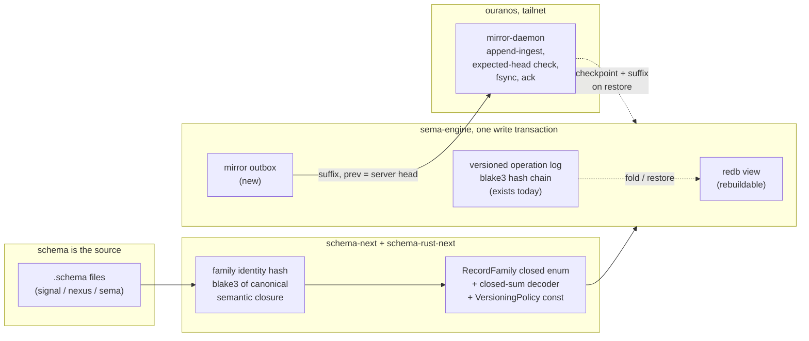

# 98/9 — The vision: a store is a fold of its log; the schema is the source of identity

**TL;DR.** The version-control system is smaller and closer than the design
corpus suggests, because its hardest piece already runs on mainline:
`sema-engine` writes a blake3-hash-chained, payload-bearing versioned
operation log in the same redb transaction as every domain mutation
(`sema-engine/src/versioning.rs`, verified chapter 2). What is missing is
exactly three things: **identity** (the log's selector is a
`table_name: String` and a hand-typed schema label — both must become
schema-derived hashes), **the fold** (no checkpoint, no restore, no
rebuild-view-from-log — so today there is a log but nothing can be
recovered), and **the remote** (no cross-host transport exists anywhere in
the workspace; everything is Unix sockets). One real correctness hole was
found that report 97 missed: the engine exposes a `storage_kernel()` escape
hatch, and `mind` — the only component opted into versioning — uses it to
write durable state *around* the log (`mind/src/tables.rs:173-180`), so the
log is not the truth even where it exists. Sealing that hatch is Stage 0.
The audit of the psyche's three foundation beliefs: NOTA is genuinely fully
typed (verified, zero bypasses in nota-next); schema parsing is genuinely
100% NOTA (verified) with exactly three hand-parsing sites surviving in
schema-next's macro library; the triad ideal is real in Spirit and Terminal
and a spectrum below that. Five questions for the psyche close this report.

## 1. What problem are we solving

Component Sema databases — Spirit's intent records first — must survive the
loss of the laptop, natively version-controlled rather than blob-backed
(Spirit `29pb`), through one reusable schema-centric mechanism (`j487`,
`a5tg`), with the operation log as the authoritative source of truth and
redb a rebuildable view (`iir4`, psyche-decided), eventually carrying full
DVCS semantics gated by per-component admission policy (`i4ak`, `2uhh`) on
one crypto basis (`x0ja`). The first cut is data-loss protection with a
remote; branching, criome/BLS, and privacy federation stay designed but
deferred (report 97 §9). This report grounds that build in verified code
reality and revises it where reality disagreed.

## 2. The one-sentence design

> **A component store is a fold: `view = fold(checkpoint, log_suffix)`.
> Version control is making the fold's inputs durable, identified, and
> shippable; branch, merge, rebase, and migration are all just choosing
> which log you fold and which policy filters entries on the way in.**

Everything below is this sentence applied to the verified code.

## 3. Identity: the schema already is the hash, nobody computes it

The log today selects records by `table_name: String` and identifies the
store by `SchemaHash::for_label("mind-schema-v7")` — a hand-typed string
pretending to be identity (`mind/src/tables.rs:165-169`). Meanwhile
`schema-next`'s `Schema` is already a fully typed, rkyv-serializable
canonical value with `to_binary_bytes()` (`schema-next/src/schema.rs:207,
386-394`) — the canonical bytes exist; no one hashes them. The fix is one
concept, placed where it belongs:

- **`schema-next`:** `SchemaIdentity` gains content identity — blake3 over
  the canonical rkyv bytes of the *semantic closure* of a declaration: the
  type plus every type transitively reachable from it. A deep field change
  re-identifies every family that reaches it; that is correct — identity
  change is what forces a migration (`wrjl`: the hash is the identity, the
  address is the version). The store hash is blake3 over the sorted family
  hashes — derived, never authored.
- **`schema-rust-next`:** emits per component, from `sema.schema`: the
  per-family identity consts, a closed `RecordFamily` enum (one variant per
  stored family), the closed-sum decoder
  `RecordFamily::decode(identity, bytes) -> ComponentRecord` (unknown
  identity = hard error, never a fallback), and the component's
  `VersioningPolicy` value. Chapter 4's verified sizing: 2–3 new `ToTokens`
  wrapper types in `RustModule::render()`, with `TraceObjectNameEnumTokens`
  (`schema-rust-next/src/lib.rs:2735`) as the exact precedent. Small.
- **`sema-engine`:** `VersionedLogOperation` carries the typed
  `FamilyIdentity` instead of the string; the engine never learns schema
  semantics — it stores identities and bytes.

This is the purest expression of the psyche's schema-centricity available:
the identity the whole VC system trusts is *literally a hash of the schema
the psyche reads*, and the only hand-written input to the machinery is the
`.schema` file itself. Component opt-in collapses to passing one generated
value at open.

## 4. The fold: making `iir4` true

The kernel inversion is mostly already physics: every engine mutation
already writes view + commit log + versioned log in one transaction through
verified choke points (chapter 2; `engine.rs:307-773`), so read-after-write
holds by construction. Three things make the log actually authoritative:

1. **Stage 0 — seal the out-of-band path.** `Engine::storage_kernel()`
   exists as a migration courtesy and `mind` uses it for durable
   `memory_graph` writes that never touch the log
   (`mind/src/tables.rs:173-180`). With that hatch open, "the view is the
   fold of the log" is false today for the only opted-in store. Either those
   writes become engine record families or the hatch narrows to read-only.
   This is new relative to report 97 and it is the cheapest, highest-value
   correctness work in the whole plan.
2. **Checkpoint + restore (the actual backup).** As specified in 97 Stage 2
   and operator 214 (unchanged): `CheckpointMetadata` +
   content-addressed `CheckpointSegment` payloads, and an **engine-owned
   import path** distinct from ordinary asserts that preserves sequences,
   digests, tombstones. Plus the inversion's own verb:
   `rebuild_from_log` — delete the materialized tables, fold, and the
   normal query surface must read identically (operator 214's
   payload-replay witness becomes the *definition* of the view).
3. **Migration becomes a fold.** Spirit's migration today reads every
   record, transforms, and asserts into a *new database file*
   (`spirit/src/production_migration.rs`, 1,638 lines, v1→v8) — unlogged
   wholesale rewrites, exactly what `iir4` forbids. In the new shape a
   schema bump is: fold the old log through the version From-chain
   (`previous → next`, vocabulary per `ngk0`; the migration module's
   historical/current_shape pattern already is that From-chain) into a
   store at the new schema, recording a typed migration entry. The
   migration binary stops being a copy tool and becomes a reducer the fold
   applies. Spirit's next real schema bump (v8→v9) is the pilot witness.

## 5. The remote: a mirror triad, and the workspace's first cross-host hop

**Shape.** The psyche asked: another instance of the same component, or a
specialized server? The grounded answer is a **dedicated mirror triad**
(`mirror`, `signal-mirror`, `meta-signal-mirror`), one dumb daemon on
ouranos serving every component's stores. Three reasons, all from existing
pattern rather than taste (chapter 8):

- The mirror must *not* decode component payloads — it stores entries,
  digests, and checkpoints, validates sequence continuity and expected
  head, dedups idempotently, fsyncs, acks. A Spirit instance is the
  opposite: it exists to judge payloads (guardian). Running Spirit as its
  own mirror would put a semantic judge where a dumb ledger belongs —
  operator 214's rule: the server is not a guardian unless explicitly a
  semantic peer.
- Retention, privacy class, and pruning authority are *policy state* that
  belongs behind a meta-signal contract; `repository-ledger`'s meta-signal
  already names "mirror policy mutation" as exactly this kind of concern.
- The triad is the workspace's component unit; there is no precedent for
  config-selected role-switching binaries, and inventing one for the first
  server would be a second new concept where one suffices.

The beautiful closure: **the mirror's own state is a sema-engine store whose
record families are the universal VC types** — store heads, received
entries, checkpoint inventory. The VC system's server is itself a versioned
component; it eats its own dogfood from day one, and `repository-ledger`
(the Gitolite push-ingest daemon, the closest living relative) is the
template — after its conformance gaps are fixed (§7 pre-work).

**Transport.** Nothing in the workspace speaks across hosts today; every
daemon binds Unix sockets (chapter 8, verified against triad-runtime). The
recommendation: `triad-runtime` grows a tailnet TCP listener as a sibling of
the async Unix listeners. `LengthPrefixedCodec` is already IO-generic over
Tokio streams, so the frame spine is unchanged; the genuinely new design
point is typed honesty about peers — `ConnectionContext` today carries
kernel-vouched `SO_PEERCRED`, which TCP cannot supply. The context becomes a
closed sum (`UnixPeer(credentials) | TailnetPeer(address)`), so trust
posture is visible in the type system instead of pretended. The alternative
(ssh-forwarded Unix socket) needs zero new transport code but hides the
topology in out-of-band ssh configuration; per ESSENCE the durable shape
wins. Tailnet-trusted, no per-suffix auth, criome deferred — as decided.

## 6. Opinions: every involved component, graded honestly

| Component | Verdict | The one thing to know |
|---|---|---|
| `nota-next` | excellent | The typed structural macro node codec is real: type-directed all the way down, declaration-order first-match, bidirectional, canonical strings, spans end-to-end. Zero parser bypasses in the active stack. The foundation holds. |
| `schema-next` | clean core, one dirty room | Parsing is pure NOTA (verified). But the macro library (`declarative.rs`) hand-parses: stringly variant dispatch at :695, string-matched expansion-template heads at :1408-1424, positional `.child(N)` indexing. The typed path exists and is not the default. Fixable, small. |
| `schema-rust-next` | promise kept | The string-emitter migration is genuinely complete — 44 `ToTokens` impls, no free functions, one documented `format!` exemption. Missing exactly one concept for VC: schema content identity. |
| `sema` | exemplary kernel | Two internal tables, six primitives, hard guards, no raw-byte API. Exactly what a kernel should be. |
| `sema-engine` | the strong surprise | The versioned hash-chained payload log already runs same-transaction on mainline. The VC build is an extension, not a rescue. Flaws: stringly identity, no restore, the `storage_kernel()` escape hatch. |
| `spirit` | the genuine exemplar | 14,474 generated / 8,840 hand-written lines; all three planes schema-derived; guardian gates every working-socket write with 19 typed rejection reasons; meta-socket `Import` is the one deliberate bypass — precisely the `IntakePolicy` shape (`2uhh`) the grand design needs, already implemented and feature-gated. Wrinkles: hand-written runner loop where Terminal's generated glue is better; migration binaries do unlogged wholesale copies. |
| `triad-runtime` | the right spine | Listeners, runner, frames, subscriptions, peer credentials — the natural home for the tailnet listener. |
| `terminal` | quiet best-in-class | Fully generated planes *and* the generated Runner glue (`terminal/src/schema/nexus.rs:863`). Proof the ideal works end to end. |
| `repository-ledger` | right pattern, unfinished | Uses Runner and strict separation — and authors a `nexus.schema` that `build.rs` never emits (hand-written duplicate enums), with no `sema.schema` at all. Fix before the mirror copies it. |
| `orchestrate` | drifting (~50%) | Schemas exist but operations and the runner loop are hand-written. Beads, not blockers. |
| `introspect` | divergent (~30%) | 12-byte daemon.schema, no nexus/sema schemas, kameo actors instead of the nexus plane. Either exempt it explicitly or bring it home. |

**On the three beliefs the psyche asked me to check:**
"NOTA is fully typed, no custom parsing outside it" — **true** at the NOTA
layer, with the three schema-next macro-library sites as the only real
violations in the active stack. "Schema builds 100% on NOTA" — **true for
parsing**; the real gap is identity (no content hash) and coverage
(components whose plane schemas are missing or unemitted). "Operations 100%
through schema interfaces with minimal hand implementation" (`a71r`,
`3d5z`) — **real in Spirit and Terminal, a spectrum below**: the ideal is
proven, not yet universal. The intent layer is ahead of the code in exactly
the way INTENT.md files promised — they describe the target truthfully and
the best components already live there.

## 7. Pre-work worth doing first (small, hardens the ground)

- **A. repository-ledger conformance** — emit the authored `nexus.schema`
  (delete the duplicate hand enums), add `sema.schema`. The mirror will be
  built from this template; make the template clean. (operator bead)
- **B. schema-next macro-library typed codecs** — StructuralMacroNode-ify
  `MacroLibrarySourceEntry` and the expansion-template heads; remove
  positional `.child(N)` access. Closes the last real "custom parsing"
  violations behind `6grf`. (operator/nota-designer bead)
- **C. spirit adopts the generated runner glue** — drop the hand loop in
  favor of what Terminal already proves. Not blocking; do it opportunistically. (operator bead)

## 8. The staged build, revised

Operator 214's ten acceptance witnesses stand unchanged as the done-gate.
The stages, revised against verified reality:

- **Stage 0 — the log becomes complete** *(new)*: seal/narrow
  `storage_kernel()`; move mind's `memory_graph` into engine families.
  Witness: grep-proof plus an architectural truth test that no consumer
  writes durable state outside engine operations.
- **Stage 1 — identity from schema**: schema-next content hashes;
  schema-rust-next emits `RecordFamily` + decoder + `VersioningPolicy`;
  sema-engine takes typed `FamilyIdentity`. Spirit and mind opt in via
  generated policy. Witness: replay rebuilds typed state by family
  identity; a table rename cannot corrupt replay.
- **Stage 2 — the fold**: checkpoint payload, engine-owned import,
  `rebuild_from_log`. Witness: restore into a fresh store reads identically
  through the normal query surface; spirit v8→v9 lands as a logged fold.
- **Stage 3 — the mirror**: outbox (same transaction), mirror triad on
  ouranos, tailnet listener in triad-runtime, typed peer identity, deploy
  via CriomOS module. Witness: duplicate-send idempotent, expected-head
  mismatch rejected, fsync-before-ack, and the end-to-end proof — a second
  machine restores Spirit from ouranos and answers queries identically.

Deferred exactly as in 97 §9: branching/DAG, IntakePolicy generalization
(the guardian already proves the interface), BLS/criome, migration-as-branch
zero-downtime choreography, privacy federation (96).

## 9. Doubts

1. **The escape hatch is load-bearing.** Sealing `storage_kernel()` breaks
   mind's current memory-graph path; Stage 0 has a real migration cost and
   touches a component mid-evolution. It is still the right first move —
   every later guarantee is fiction while it stays open.
2. **Cross-host transport is the largest unknown.** It does not exist at
   all today; the tailnet listener is new runtime surface, and the typed
   peer-identity split must not quietly let TCP peers impersonate Unix
   credentials.
3. **Closure-hash sensitivity.** Family identity over the transitive
   closure means a helper-type change re-identifies many families at once —
   correct but noisy; bearable only if the From-chain migration is cheap to
   write, which Stage 2's fold must prove on a real bump.
4. **Spirit is three stores** (live, archive, guardian journal) — three
   logs, three mirror streams; the archive-collection move is a saga across
   two stores, not a transaction. Accepted for the single-writer daemon;
   named so nobody mistakes it for atomicity.
5. **New-repo authority.** The mirror triad means three new repositories,
   and `op4b` reserves repo creation for explicit psyche authority — gated
   on Q1 below.

## 10. Questions for the psyche

1. **Mirror shape** — dedicated triad (`mirror` / `signal-mirror` /
   `meta-signal-mirror`), one dumb daemon on ouranos serving all
   components. Confirm, and authorize the three new repos (`op4b` gate).
   *Recommended: yes.*
2. **Transport** — tailnet TCP listener in `triad-runtime` with typed
   `UnixPeer | TailnetPeer` context (durable shape) versus ssh-forwarded
   Unix socket (zero new code, hidden topology). *Recommended: tailnet
   listener.*
3. **Pre-work A and B first?** Both are small and harden exactly the ground
   the VC system stands on. *Recommended: yes; C opportunistic.*
4. **Migration-as-fold** — spirit's next schema bump becomes the logged-fold
   pilot, retiring copy-everything migration binaries. Confirm.
5. **Stage 0 priority** — sealing the engine escape hatch touches mind
   before it touches spirit; confirm that ordering is acceptable.

Follow-ups owned by this lane once answered: file the pre-work and stage
beads; manifest `61lk` into `sema/INTENT.md` and the VC decisions into
`sema-engine/INTENT.md` on the implementation branch; report 97 remains the
implementer's handoff with this report as its grounded revision — where they
disagree (Stage 0, the spirit-side seam, the mirror triad, transport), this
report wins.

## 11. References

- Chapters 1–8 of this directory (each with adversarial verdicts where code
  was audited).
- `reports/system-designer/97-versioned-state-implementation-handoff.md` —
  the prior handoff this revises.
- `reports/system-operator/214-...operator-position.md` — hardening
  constraints and the ten witnesses (authoritative on acceptance).
- `reports/system-designer/95-versioned-state-grand-design/8-visual-design.md`
  — the deferred grand design (branching, policy, crypto).
- Spirit records: `29pb`, `j487`, `i4ak`, `2uhh`, `x0ja`, `iir4`, `qpv6`,
  `zgi8`, `kasm`, `opbj`, `fosp`, `e440`, `a71r`, `a9sq`, `bkcd`, `dun9`,
  `6grf`, `61lk`, `zn2l`.
