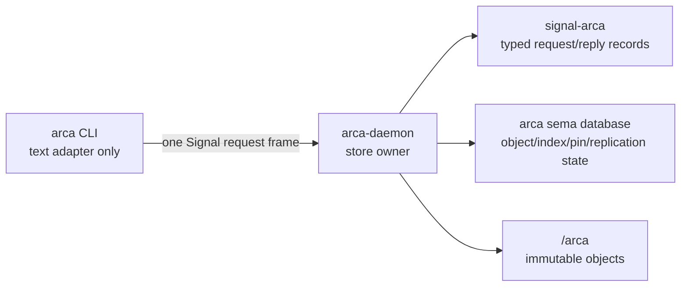

# Arca daemon content-addressed store architecture - 2026-05-17

## Purpose

This report focuses on Arca itself: what the component should be, how
its daemon should work, how its paths should be shaped, and how it
should first integrate with `lojix`.

The user prompt pushed three design tensions into the open:

1. Arca should be absolutely content-addressed, probably BLAKE3.
2. Arca paths should not make LLM contexts pay for full long hashes
   everywhere.
3. Short hash prefixes create collision and path-stability problems.

The core recommendation:

> Full BLAKE3 digest is the object identity. The filesystem path is a
> stable locator allocated by the daemon. Locators may use shortened
> unique prefixes, but once exposed they are never renamed.

That preserves correctness while addressing path ergonomics.

## Current repo state

`/git/github.com/LiGoldragon/arca` already has a useful skeleton:

- one library and one daemon binary;
- `StoreEntryHash` as BLAKE3 identity;
- `StoreRoot` and `StorePath` types;
- `StoreReader` and `StoreWriter` traits;
- `Deposit`, `CapabilityToken`, `IndexRow`, and `BundleFromNix`
  skeletons;
- tests for hash parsing and basic path layout.

The repo is not implemented:

- `arca-daemon` is `todo!()`;
- reader/writer/index/token/deposit bodies are `todo!()`;
- no `signal-arca` contract exists yet;
- no CLI exists yet;
- no sema table schema exists yet;
- the current architecture says `~/.arca`, which is too user-local for
  the deployment role.

The skeleton should be treated as useful prior art, not as a binding
implementation. It already names several good nouns; the root,
authority, and path strategy need revision.

## Component shape

Arca should be a triad component:



### `arca` CLI

The CLI is an adapter for humans and agents. It sends exactly one
typed `signal-arca` request to `arca-daemon` and renders exactly one
reply. It does not write `/arca` directly.

### `signal-arca`

The contract names the daemon verbs:

```text
PutBytes
PutPath
PutTree
FetchObject
ResolveObject
ReplicateObject
ReplicateSet
PinObject
ReleasePin
LinkObject
ObserveObject
```

### `arca-daemon`

The daemon owns:

- writes to `/arca`;
- full-hash verification;
- locator allocation;
- sema-backed object/index/pin state;
- replication;
- garbage-collection execution;
- capability enforcement.

Consumers may read files directly if filesystem permissions allow it,
but every write, link, replication, and pin update goes through the
daemon.

## Store root

The deployment use case wants a system service root:

```text
/arca
```

I recommend lowercase `/arca` rather than `/Arca`, matching Unix path
convention and the repo/binary name.

Store namespaces should sit under that root:

```text
/arca/system/objects/...
/arca/user/<user>/objects/...
/arca/project/<project>/objects/...
/arca/staging/...
/arca/state/...
```

The namespace is an authority and garbage-collection boundary, not a
different hash identity universe. The full object digest remains the
same everywhere.

`~/.arca` can exist later as a user-local convenience store, but the
CriomOS/lojix integration should start with the system daemon and
system root.

## Identity versus locator

Arca needs two separate concepts.

### Object identity

The identity is always the full BLAKE3 digest over the canonical object
encoding:

```text
ArcaObjectDigest = blake3(canonical object encoding)
```

This full digest lives in sema state, replication messages, pins,
leases, and verification records. It is the only proof of object
identity.

### Filesystem locator

The filesystem path is a daemon-allocated locator:

```text
/arca/system/objects/<prefix>-<label>
```

The locator is for operating-system access and human scanning. It is
not the object identity. The daemon can always resolve full digest to
locator through its sema/index state.

This distinction is the way to get shorter paths without corrupting
the content-addressed model.

## Short prefix policy

The prompt suggested maybe three characters. Three hex characters is
not viable for a real store:

- 3 hex characters = 12 bits = 4096 buckets;
- birthday collisions become likely around 75 objects;
- at 1000 objects, collision is not an edge case, it is expected.

Even 5 hex characters is only 20 bits, with collisions becoming likely
around 1200 objects. Seven hex characters is still only 28 bits.

Better policy:

- encode the digest in lowercase base32 or another filesystem-safe
  compact alphabet;
- use a production floor around 10-12 base32 characters;
- allocate longer prefixes when needed;
- store the full BLAKE3 digest in sema regardless of locator length.

Approximate collision scale:

| Prefix | Bits | Collision likely around |
|---|---:|---:|
| 3 hex | 12 | 75 objects |
| 5 hex | 20 | 1,200 objects |
| 7 hex | 28 | 19,000 objects |
| 10 hex | 40 | 1.2 million objects |
| 10 base32 | 50 | 39 million objects |
| 12 base32 | 60 | 1.2 billion objects |

These are birthday-bound rough scales, not guarantees. They are enough
to show the shape: three characters is useful only as an interactive
abbreviation resolved by the daemon, not as a filesystem locator floor.

## Collision handling

The daemon should never rename an exposed locator.

The prompt's "if a collision appears, rename both files with more
characters" idea solves directory uniqueness but breaks consumers that
already hold paths. Immutable store paths must stay stable once
observed.

Use this rule instead:

```text
When inserting an object:
  1. Choose the shortest prefix at or above the namespace floor that
     is not already allocated for a different digest with the same
     label.
  2. Allocate that locator.
  3. Never move it.
  4. If a later object collides, the later object gets a longer
     prefix.
```

If an old object needs a longer spelling for clarity, create an
additional alias record or symlink-like locator controlled by the
daemon. Do not move the original locator.

## Labels and file names

The suffix after the hash prefix is a label, not identity.

```text
/arca/system/objects/b4sq9h2k9vpt-horizon-proposal.nota
/arca/system/objects/7nps3xq0x81m-generated-inputs
/arca/system/objects/rnh51v9bxv2d-criomos-fullos-plan
```

Labels should be sanitized and stable enough for humans, but they do
not participate in object identity unless the canonical object encoding
explicitly includes a name. For general Arca objects, I recommend the
label not be part of the content digest. A rename of a label should
not change content identity.

The sema record maps:

```text
ArcaObject {
  digest,
  kind,
  byte_length,
  canonical_encoding,
  primary_locator,
  labels,
  created_at,
  pins,
  replication_state,
}
```

## File and directory topology

Use one object locator shape for both files and trees. The path may be
a file or a directory:

```text
/arca/system/objects/<prefix>-<label>        # file object
/arca/system/objects/<prefix>-<label>/...    # tree object
```

That matches Nix's useful property: a store object can be a file or a
directory, and consumers use the path directly.

For tree objects, the hash is not a naive hash of directory bytes. It
must be a canonical tree hash.

## Canonical object encoding

Arca needs a written canonical encoding before implementation.

A tree hash should domain-separate entries:

```text
directory {
  entries sorted by bytewise filename
  each entry:
    kind = file | directory | symlink
    name
    executable bit for files
    file byte hash for files
    symlink target bytes for symlinks
    child tree digest for directories
}
```

Normalize or deliberately exclude:

- mtime/ctime/atime;
- owner/group ids;
- source filesystem inode numbers;
- non-portable extended attributes unless a later object kind includes
  them explicitly.

If Nix interop is a priority, Arca should also store NAR-related
metadata:

```text
NixProvenance {
  store_path,
  nar_hash,
  references,
  signer,
}
```

The Nix docs matter here: Nix content-addressed store objects include
references, store directory, and name, not only file bytes. Arca can use
BLAKE3 for its own identity, but if it wants to round-trip with Nix it
must preserve the Nix view too.

## Ingestion authority

The daemon should not be an omnipotent root process that can read any
path a caller names.

There are two safe ingestion modes.

### Caller streams bytes

The caller reads content using its own permissions and streams it to
the daemon:

```text
PutBytes { label, bytes, expected_digest? }
```

The daemon verifies the digest, writes an immutable object, and records
the caller/capability. This cannot accidentally let the daemon read
private files the caller could not read.

### Daemon imports a path under daemon permissions

The daemon reads a path itself:

```text
PutPath { path, label, expected_digest? }
```

This should run under the daemon's own restricted user, not root. If
the daemon lacks permission to read a private key, the import fails.
That failure is correct.

Root/system imports can exist, but as a separate privileged capability
with explicit policy. They should not be the default path import.

## Secret handling

Arca is an archive plane, not a secret manager.

Encrypted secret artifacts may be valid Arca objects. Cleartext secret
material should not be casually archived. If Arca ever accepts
cleartext secrets, that must be a distinct object kind with:

- explicit secret capability;
- tight filesystem permissions;
- no broad direct-read path;
- redacted labels;
- garbage-collection and audit rules.

For the first `lojix` integration, Arca should carry public inputs and
signed plans, not private key bytes.

## Write path

A correct object write sequence:

1. Receive bytes/tree/path under a verified capability.
2. Copy or stream into a daemon-owned temporary path under
   `/arca/staging`.
3. Compute the full BLAKE3 digest from canonical encoding.
4. If caller supplied `expected_digest`, compare it.
5. If object already exists, deduplicate and return existing locator.
6. Allocate a stable locator prefix and label.
7. Move into place atomically.
8. Fsync object and parent directory according to durability policy.
9. Insert sema/index records.
10. Emit `ObjectStored`.

Do not hardlink mutable source files into the store. A hardlink to a
mutable source violates immutability. Reflink/copy can be allowed if
the daemon verifies after the copy.

## Read path

Reads can be direct filesystem reads after a resolve:

```text
ResolveObject { digest } -> ObjectLocator { path }
```

The daemon is still needed for:

- digest-to-path resolution;
- prefix abbreviation resolution;
- access-controlled object namespaces;
- replication;
- pin/lease state;
- audit and observations.

A consumer that already has a locator path may read it directly if
filesystem permissions allow. It should still treat the full digest as
the identity when correctness matters.

## Sema state

Arca should use a Sema-backed database for truth. Candidate records:

```text
ArcaStore
ArcaObject
ArcaLocator
ArcaAlias
ArcaPin
ArcaLease
ArcaReplicationPeer
ArcaReplicationJob
ArcaImportJob
ArcaCapabilityGrant
ArcaGarbageCollectionSweep
```

Important constraints:

- the filesystem is not the source of truth for reachability;
- the locator is not the identity;
- pins and leases prevent garbage collection;
- replication state is observable;
- object records are append-friendly and audit-friendly.

## Replication

Replication should speak in full digests and verify after transfer:

```text
ReplicateObject {
  digest,
  source_peer,
  target_store,
  pin_policy,
}
```

The receiver never trusts the sender's filename. It receives content,
recomputes BLAKE3, verifies the requested digest, then allocates a
local stable locator.

This allows different hosts to use different locator prefixes if they
must, while the full digest remains the cross-host identity. If we want
same locator spellings cluster-wide, that can be an added policy later,
but correctness should not depend on it.

## LLM context ergonomics

The user's reason for short hashes is real: long random strings are
expensive and hard for humans and LLMs to track.

The right solution is layered:

- full digest in machine records;
- stable shortened locator in filesystem paths;
- semantic labels in filenames;
- `arca:` refs in reports and daemon messages where a filesystem path
  is unnecessary;
- Sema slots or deployment artifact names for human discussion.

Example:

```text
arca:b3:b4sq9h2k9vpt:horizon-proposal
```

The daemon resolves that to the full digest and path. Reports and chat
do not need to paste 64 hex characters unless the digest itself is the
subject.

## Nix interop

Arca and Nix overlap but are not the same store.

Nix's content-addressed store machinery is relevant but cannot simply
be treated as Arca's implementation:

- Nix store path identity includes store directory and references.
- Many realized outputs embed `/nix/store/...` paths.
- `nix store make-content-addressed` is experimental.
- floating content-addressed derivations require `ca-derivations`.

Official sources checked for those claims:

- Nix store path shape and store-directory dependency:
  https://releases.nixos.org/nix/nix-2.19.2/manual/store/store-path.html
- Nix content-addressed store object inputs:
  https://releases.nixos.org/nix/nix-2.24.5/manual/store/store-object/content-address.html
- `nix store make-content-addressed` experimental command:
  https://nix.dev/manual/nix/2.18/command-ref/new-cli/nix3-store-make-content-addressed
- `ca-derivations` requirement for floating content-addressed outputs:
  https://nix.dev/manual/nix/2.32/store/derivation/outputs/content-address

First interop shape:

```text
Arca stores:
  deployment inputs
  generated Nix source trees
  deployment plan artifacts
  NAR blobs or copy manifests as optional data
  Nix provenance records

Nix stores:
  realized build outputs
  activation closures
```

Later interop options:

1. Store NAR files in Arca and import them into Nix on demand.
2. Store content-addressed Nix closures after rewriting with
   `nix store make-content-addressed`, guarded by experimental-feature
   checks.
3. Implement Arca bundle/RPATH rewriting for selected executables,
   producing `/arca`-native runnable trees.

The third option is the most ambitious and should be tested as its own
capability. It is not needed to make `lojix` distributed deployment
cleaner.

## Integration with lojix

The first `lojix` integration should use Arca for deployment
artifacts:

```text
DeploymentArtifactSet {
  horizon_proposal_digest,
  cluster_proposal_digest,
  viewpoint_digest,
  projected_horizon_digest,
  generated_inputs_digest,
  topology_snapshot_digest,
  deployment_plan_digest,
}
```

`lojix-daemon` then sends participant daemons artifact refs, not
coordinator-local paths. Participant daemons ask local `arca-daemon` to
fetch or resolve those refs.

This has high value before Arca can run binaries:

- the builder sees exactly the same generated inputs as the
  coordinator;
- the target sees exactly the plan it is asked to activate;
- the deployment record can be replayed or audited later;
- topology and fallback decisions have durable content references.

## Tests

### Prefix allocator tests

- three-character prefixes are allowed only as interactive
  abbreviations, not as production locator floor;
- forced prefix collision gives the new object a longer locator;
- existing locators are never renamed;
- same content deduplicates to one object record.

### Canonical hash tests

- directory entry order does not affect digest;
- timestamps do not affect digest;
- executable bit affects digest;
- symlink target affects digest;
- changing one byte changes digest;
- identical trees imported by stream and path get same digest.

### Authority tests

- daemon running as `arca` cannot import a private file path it cannot
  read;
- caller-streamed bytes can be stored when caller has read them;
- path import and byte import both verify `expected_digest`;
- daemon rejects writes without a capability.

### Filesystem tests

- store object is immutable to non-daemon users;
- daemon writes through staging and atomic rename;
- interrupted staging object does not become visible;
- duplicate import does not rewrite existing locator.

### Replication tests

- receiver verifies digest after transfer;
- sender filename is ignored;
- receiver allocates local locator from full digest;
- pin policy prevents garbage collection.

### Lojix integration tests

- `lojix-daemon` creates an Arca artifact set before build assignment;
- participant daemons resolve artifacts by digest;
- fake Nix builder consumes generated inputs from Arca;
- target activation refuses a plan whose digest does not match the
  signed deployment artifact.

## Repo changes implied

The existing `arca` repo should be revised before implementation:

- update `ARCHITECTURE.md` from `~/.arca` to system-daemon `/arca`
  first, with user/project namespaces underneath;
- add `signal-arca` as a sibling contract repo or an internal contract
  crate if the workspace decides this component has not yet earned a
  separate repo;
- add a real `arca` CLI binary in addition to `arca-daemon`;
- replace `StoreEntryHash(pub [u8; HASH_LEN])` with an opaque type that
  can render full digest, base32 prefix, and maybe algorithm-tagged
  refs;
- add explicit `ObjectDigest`, `ObjectLocator`, and `ObjectLabel`
  types so identity and path do not blur;
- add prefix-allocation tests before daemon storage code;
- add sema schema/table definitions before GC or replication;
- keep `BundleFromNix` as future interop, not first deployment
  dependency.

## Hard constraints

- Full digest is the identity.
- Locator path is not identity.
- Exposed locators are immutable and never renamed.
- Every write goes through `arca-daemon`.
- The daemon does not get blanket root read authority by default.
- Path import obeys daemon permissions.
- Byte import obeys caller permissions because the caller reads first.
- Store files are immutable to consumers.
- Replication verifies the full digest on the receiver.
- Nix realized closures stay in Nix for first `lojix` implementation.
- Cleartext secrets are not ordinary Arca objects.

## Recommendation

Arca is a strong fit for `lojix`, but the first integration should be
boring in the right way:

> content-addressed artifacts now, deployable replacement store later.

The path-shortening idea is worth keeping, but only as a stable locator
and display layer. The full BLAKE3 digest remains in sema, in Signal
messages, and in every correctness check.

The architecture should be changed from "a `~/.arca` skeleton analogous
to the Nix store" to "a system `arca-daemon` owning `/arca`, with typed
artifact storage, sema-backed locator/pin/replication state, and a
Signal contract." That gives `lojix` the artifact substrate it needs
without pretending the Nix store replacement problem is already solved.
