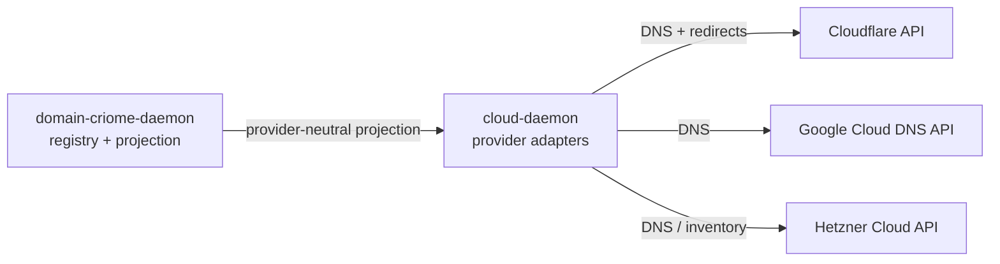

# Cloud and Domain Criome Birth Design

## Frame

The psyche introduced two new component families in this turn:

- `cloud`: the provider API daemon. It manages Cloudflare first, then
  Google, Hetzner, and other cloud-provider APIs.
- `domain-criome`: the Criome-domain registry/projection daemon. It is a
  name-server-like component that also speaks the richer Signal resolution
  protocol and projects provider-neutral desired domain state.

The first live pressure is practical: restore Cloudflare-managed domains
whose records were lost, and repeat existing redirect-to-Linktree patterns
without dashboard reconstruction. The architectural pressure is broader:
birth the component triads in the current `signal-frame` / `signal-sema` /
`signal-executor` shape, without hard-coding Cloudflare as the domain model.

## Current facts

At the start of the investigation, no repositories existed for:

- `cloud`
- `signal-cloud`
- `owner-signal-cloud`
- `domain-criome`
- `signal-domain-criome`
- `owner-signal-domain-criome`

Local `ghq` and remote GitHub checks under `LiGoldragon` and `Criome` found
no exact matches. See
`reports/system-specialist/159-cloud-repo-scaffold-prototype.md`.

After the design pass, the six public repositories were created under
`LiGoldragon`, fetched with `ghq`, initialized with colocated `jj`, committed,
and pushed:

- `cloud`: `ba35849a` — runtime architecture skeleton.
- `signal-cloud`: `29c392bb` — ordinary contract crate.
- `owner-signal-cloud`: `08f9fa36` — owner contract crate.
- `domain-criome`: `fedc43b0` — runtime architecture skeleton.
- `signal-domain-criome`: `3e48fe36` — ordinary contract crate.
- `owner-signal-domain-criome`: `37c86a42` — owner contract crate.

The current Signal foundation is:

- `signal-frame` is the live wire kernel: frame mechanics, request/reply
  envelope, `signal_channel!`, thin-CLI support, caller capture, and NOTA
  projection at the CLI edge.
- `signal-sema` owns the six payloadless Sema classification labels:
  `Assert`, `Mutate`, `Retract`, `Match`, `Subscribe`, `Validate`.
- `signal-core` is deprecated and split into `signal-frame` plus
  `signal-sema`.
- `signal-executor` is the generic daemon-side library that lowers public
  contract operations into component-local commands and emits observation
  facts. It is not a daemon and not a wire contract.

The contract consequence is direct: new public contracts should expose
domain verbs (`Observe`, `Plan`, `Apply`, `Validate`, `Watch`, `Register`,
etc.), not public `Assert` / `Mutate` / `Match` roots. Daemon-local
commands project to Sema classes internally.

See also
`reports/system-specialist/158-signal-foundation-for-cloud-triads.md`.
That report confirms the live foundation split and adds one important
implementation constraint: new contract repos must not take a dependency on
`signal-core`. `signal-core` still exists in parts of the graph, especially
through transitional consumers, but it is deprecated for new component work.

## Intent hygiene issue

One assistant lane recorded this as intent:

```text
(301 signal Constraint "Cloud signal foundation report lane is read-only" Maximum)
```

That is not psyche intent. It was an agent assignment for a report-only
subtask, so it must not influence architecture. The correct durable lesson is
only that report-only subagents can be constrained to a report lane; this
particular record should be cleaned up by the intent-maintenance process.

## Provider research summary

Cloudflare has official API coverage for the first use case:

- DNS records: `GET/POST/PATCH/PUT/DELETE /zones/{zone_id}/dns_records`,
  plus `POST /zones/{zone_id}/dns_records/batch`.
- Single Redirects: Rulesets API at zone phase
  `http_request_dynamic_redirect`.
- Bulk Redirects: Rules Lists plus account Rulesets at
  `http_request_redirect`.
- Page Rules: still API-addressable, but should be treated as legacy
  import/read-only unless an explicit migration operation disables or
  deletes them.

Cloudflare documentation says Single Redirects are the default redirect
choice, Bulk Redirects are for large static maps, and Page Rules are legacy.
Redirect behavior requires proxied DNS records. DNS batch changes are one
Cloudflare database transaction, but propagation through Cloudflare's
distributed KV is explicitly not externally atomic.

Sources used by the research lanes:

- Cloudflare DNS Records API:
  https://developers.cloudflare.com/api/resources/dns/subresources/records/
- Cloudflare Single Redirects API:
  https://developers.cloudflare.com/rules/url-forwarding/single-redirects/create-api/
- Cloudflare Bulk Redirects API:
  https://developers.cloudflare.com/rules/url-forwarding/bulk-redirects/create-api/
- Cloudflare redirect overview:
  https://developers.cloudflare.com/rules/url-forwarding/
- Cloudflare API token permissions:
  https://developers.cloudflare.com/fundamentals/api/reference/permissions/
- Cloudflare API rate limits:
  https://developers.cloudflare.com/fundamentals/api/reference/limits/

Google Cloud DNS also has official API coverage for DNS:

- `managedZones`
- `resourceRecordSets`
- `changes`
- `dnsKeys`
- `policies`
- `responsePolicies`
- `testIamPermissions`

Google redirects are not Cloud DNS; they belong later under Load Balancing
URL maps.

Hetzner should target the current Cloud API / Console DNS surface, not the
deprecated DNS Console API. Hetzner cloud server/network/firewall/load
balancer mutation belongs later; read-only inventory can come earlier.

Sources:

- Google Cloud DNS APIs: https://docs.cloud.google.com/dns/docs/apis
- Google Cloud DNS records: https://docs.cloud.google.com/dns/docs/records
- Google Cloud DNS authentication:
  https://docs.cloud.google.com/dns/docs/authentication
- Google URL maps:
  https://cloud.google.com/load-balancing/docs/url-map-concepts
- Hetzner API overview: https://docs.hetzner.cloud/
- Hetzner API usage:
  https://docs.hetzner.com/cloud/api/getting-started/using-api/
- Hetzner DNS Console deprecation surface:
  https://docs.hetzner.com/dns-console/dns/

## Component boundary

`domain-criome` owns meaning.

It knows which Criome domains exist, what they should resolve to, which
redirects should exist, how names relate to root registry decisions, and how
to project a provider-neutral desired state.

`cloud` owns provider execution.

It knows how Cloudflare, Google, Hetzner, and later providers expose APIs; how
to observe provider state; how to prepare a provider-specific plan; how to
apply a plan when owner-authorized; and how to record provider facts and
failures.

The flow:



## First contract shape

### `signal-cloud`

Ordinary peer-callable surface:

- `Observe(Observation)`: accounts, zones, records, redirects,
  capabilities, provider state.
- `Validate(DesiredState)`: local/provider constraint validation without
  mutation.
- `Plan(DesiredState)`: daemon prepares a concrete provider plan/diff.
- `Watch(Filter)` / `Unwatch(Token)`: later push stream for provider-state
  or plan-state changes.

I would not expose `Apply` on ordinary `signal-cloud` in the first cut. Live
provider mutation touches external accounts, paid resources, and domain
identity. That belongs behind policy authority until we have a clear
ordinary-caller permission story.

Provider variants are closed and data-carrying where useful:

- `Cloudflare`
- `GoogleCloud`
- `Hetzner`

Capabilities are variants:

- `DnsRecords`
- `RedirectRules`
- `CloudHosts`
- `Networks`
- `Firewalls`
- `LoadBalancers`

The daemon can report three distinct capability layers:

- compiled capability: provider adapter exists in this build;
- configured capability: provider account/credential binding exists;
- authorized capability: live provider credential appears permitted for
  the requested operation.

### `owner-signal-cloud`

Owner/policy surface:

- register provider accounts and credential handles;
- rotate credential handles;
- set zone/domain allowlists;
- set deletion and overwrite policy;
- enable or disable provider capabilities;
- approve/apply prepared plans;
- retire provider accounts;
- start/drain/reload daemon policy.

The owner contract must carry secret handles, never secret bytes.

Use current repo convention `owner-signal-cloud` for the first scaffolding.
The psyche expressed a preference toward `meta-signal`, but this is not yet
the repo convention. A rename pass should be its own coordinated migration.

### `signal-domain-criome`

Ordinary surface:

- `Observe(Observation)`: domains, delegations, projections.
- `Resolve(Query)`: intelligent resolution.
- `Project(ProjectionQuery)`: provider-neutral desired state for a domain,
  cluster, or root family.
- `Watch(Filter)` / `Unwatch(Token)`: later push stream for registry or
  projection changes.

This contract must avoid provider names. Cloudflare is an implementation
target of `cloud`, not a fact in the domain registry.

### `owner-signal-domain-criome`

Owner/policy surface:

- register domains;
- delegate branches;
- retire domains;
- set root registry policy;
- start/drain/reload daemon policy.

## Runtime shape

Each runtime repo is a normal triad daemon:

- `cloud` ships `cloud` and `cloud-daemon`.
- `domain-criome` ships `domain-criome` and `domain-criome-daemon`.
- Each daemon owns one redb/sema-engine database.
- Each daemon binds ordinary and owner sockets.
- Each daemon bootstraps first-start policy from `bootstrap-policy.nota`.
- CLIs accept exactly one NOTA argument or path and only talk to their own
  daemon.

For `cloud`, provider adapters are actors:

- `CloudflareProvider`
- `GoogleCloudProvider`
- `HetznerProvider`
- `PlanStore`
- `PolicyStore`
- `RateLimitGate`
- `RemoteOperationTracker`

External provider calls must not block domain actors. Blocking HTTP work goes
through a dedicated provider actor/worker plane with timeout and rate-limit
state.

## Tests to require from the first scaffold

Contract crates:

- rkyv length-prefixed frame round-trip for every operation and reply
  variant;
- NOTA round-trip for canonical examples;
- source check that no runtime dependencies enter contract crates;
- assertion that public operation heads are domain verbs, not Sema classes;
- unsupported-provider reply round-trip.

Runtime crates:

- CLI cannot open the daemon database;
- CLI sends a Signal frame to the daemon;
- daemon owns redb and starts with separate ordinary/owner listeners;
- unsupported provider returns typed unsupported reply;
- Cloudflare adapter fixture can list-before-mutate and generate a plan
  without using real credentials;
- Cloudflare rate-limit headers map to typed retry state;
- owner plan-apply path is required for live mutation.

## Implemented scaffold

Created and pushed:

- `signal-cloud`: compileable contract crate with provider and capability
  variants, provider-neutral records/redirects, `Observe`, `Validate`, and
  `Plan` operations, typed unsupported/rejected replies, NOTA examples, and
  round-trip tests.
- `owner-signal-cloud`: compileable owner contract crate reusing
  `signal-cloud` provider/domain/plan types, with credential handles,
  account registration, policy, plan approval, and plan application
  operations.
- `signal-domain-criome`: compileable provider-neutral domain contract with
  `Observe`, `Resolve`, and `Project` operations.
- `owner-signal-domain-criome`: compileable owner contract crate for domain
  registration, delegation, retirement, and projection policy.
- `cloud`: runtime repo with architecture docs only. It deliberately does not
  ship a fake CLI or daemon.
- `domain-criome`: runtime repo with architecture docs only. It deliberately
  does not ship a fake CLI or daemon.

Two implementation details matter:

- `signal-cloud` originally tried to use the same `DesiredState` payload for
  both `Validate` and `Plan`. The `signal_channel!` macro correctly rejected
  that because it creates ambiguous NOTA request heads. The final contract uses
  distinct `Validation` and `PlanRequest` wrappers.
- Runtime repos are documentation-only at birth because adding direct provider
  calls or file-opening CLIs before the real daemon request path exists would
  violate the component-triad discipline.

## Verification

Passed locally:

- `signal-cloud`: `cargo test` — 6 tests.
- `owner-signal-cloud`: `cargo test` — 7 tests.
- `signal-domain-criome`: `cargo test` — 7 tests.
- `owner-signal-domain-criome`: `cargo test` — 6 tests.

The tests cover contract-local operation heads, NOTA round trips, rkyv
length-prefixed frame round trip for `signal-cloud`, typed unsupported or
rejected replies, no `signal-core` dependency, provider vocabulary kept out of
domain-criome contracts, and directive variants instead of boolean feature
flags in owner policy.

## Tracking

Created follow-up beads:

- `primary-kbmi` — implement the real `cloud` and `domain-criome` runtime
  daemons on branch `cloud-domain-criome-runtime`.
- `primary-4f08` — clean invalid Spirit intent record 301, which was
  agent-authored assignment text rather than psyche intent.

## Remaining scaffold decision

The next implementation should make the runtime repos compile only when the
daemon path is real:

- ordinary and owner Unix sockets;
- `signal-frame` request decode/reply encode;
- sema-engine stores for policy and plans;
- unsupported/configuration replies when no provider is configured;
- Cloudflare read-only actor before any mutation path;
- owner-approved plan application after plan generation is tested.

## Open questions

1. Should ordinary `signal-cloud` ever expose `Apply`, or should live provider
   mutation remain owner-only until Criome-mediated authorization exists? My
   recommendation: owner-only first.

2. Should the policy-signal repo be born as `owner-signal-cloud` and renamed
   later, or should this be the first `meta-signal-*` repo? My
   recommendation: keep `owner-signal-*` until a coordinated rename pass.

3. Should `domain-criome` project only public DNS/redirect state first, or
   also internal intelligent-resolution state? My recommendation: public
   provider-neutral projection first; richer resolution once the daemon shape
   is running.
