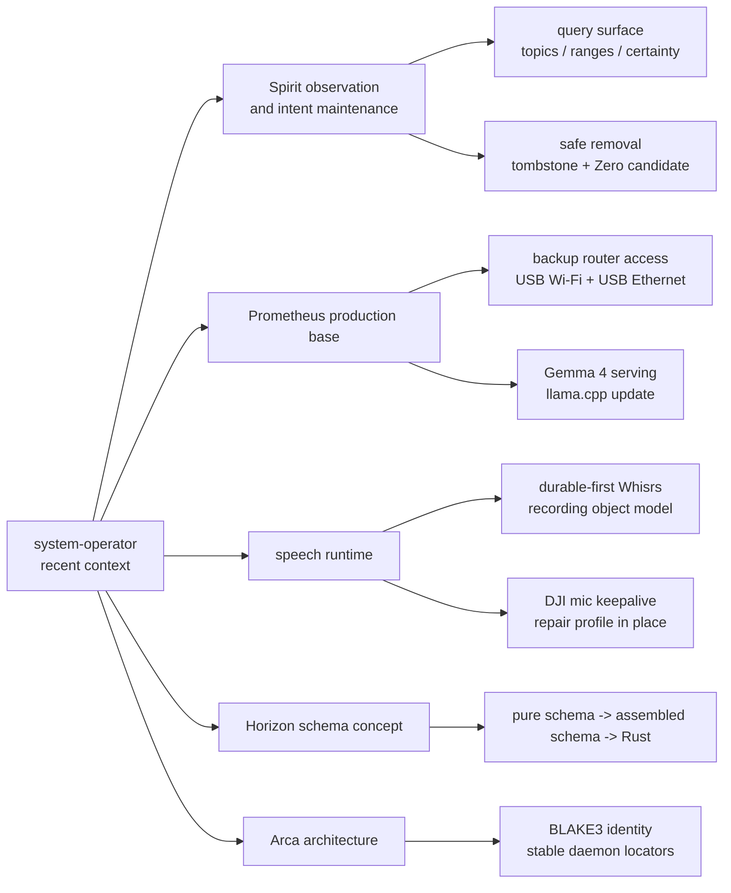
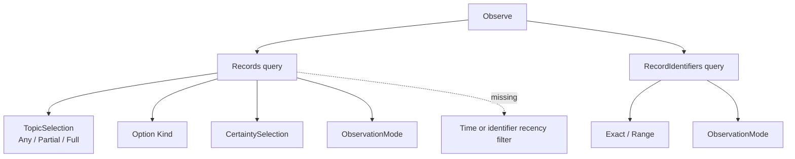
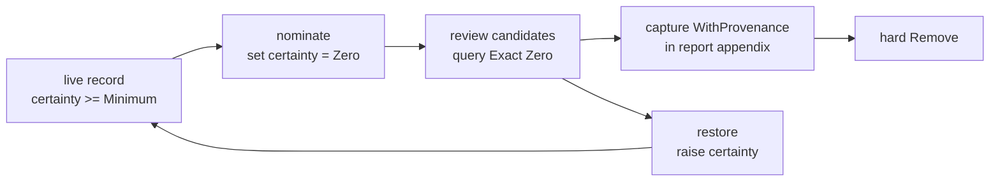
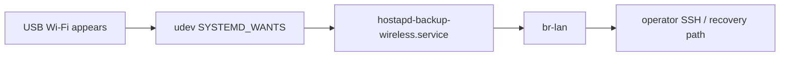

# System-operator recent context and Spirit query surface

Kind: Synthesis / Context-maintenance
Topic: system-operator recent context, Spirit observation, Prometheus, schema/Horizon, speech runtime

## Frame

This report is the current system-operator context presentation. It
absorbs the short repetitive report pairs that were produced back-to-back:

- `reports/system-operator/168-spirit-signal-surface-bad-pattern-audit-2026-05-28.md`
- `reports/system-operator/171-spirit-zero-certainty-context-maintenance-2026-05-29.md`
- `reports/system-operator/169-prometheus-usb-backup-router-access-2026-05-28.md`
- `reports/system-operator/170-prometheus-gemma-4-fix-2026-05-29.md`

It keeps these distinct roots active rather than absorbing them:

- `reports/system-operator/1-whisrs-durable-first-stt-research-2026-05-17.md`
- `reports/system-operator/2-persona-speech-component-brainstorm-2026-05-17.md`
- `reports/system-operator/139-arca-daemon-content-addressed-store-architecture-2026-05-17.md`
- `reports/system-operator/166-dji-mic-profile-churn-fix-2026-05-28.md`
- `reports/system-operator/167-horizon-pure-schema-concept-prototype-2026-05-28.md`

Those are not repetitive pairs; they are separate topic roots.

## Current topic map



The recent work is not one topic. It is a cluster around making runtime
state observable and durable: Spirit for intent, Prometheus for reachable
infrastructure, Whisrs/DJI for reliable input, Horizon/Arca for typed
data movement.

## Spirit query surface, live behavior, and intent

### What Spirit can do today

Live Spirit supports:

```sh
# topic catalog
spirit "(Observe Topics)"

# any record, compact
spirit "(Observe (Records ((Any []) None Any SummaryOnly)))"

# one-or-more topic match
spirit "(Observe (Records ((Partial [spirit reports]) None Any WithProvenance)))"

# all requested topics match
spirit "(Observe (Records ((Full [spirit filtering]) None Any WithProvenance)))"

# recent-by-identifier approximation
spirit "(Observe (RecordIdentifiers ((Range (1220 1247)) WithProvenance)))"
```

The live `Records` query combines:

- topic selection: `Any`, `Partial`, or `Full`;
- optional kind: `None` or `(Some Decision)`;
- certainty selection: `Any`, `(AtMost Low)`, `(AtLeast High)`, etc.;
- projection mode: `SummaryOnly` or `WithProvenance`.

The live `RecordIdentifiers` query supports exact identifiers and
inclusive identifier ranges.

### What Spirit cannot do yet

Spirit cannot yet express a single server-side query such as:

```text
topic contains spirit AND record timestamp >= recent cutoff
```

The available workaround is two-stage:

1. query a recent identifier range with `RecordIdentifiers`;
2. filter by topic client-side, or separately run a topic query and compare.

The current contract confirms the gap: `RecordQuery` has topic, kind,
certainty, and mode fields, but no date/time or identifier-range field.
`RecordIdentifierQuery` has identifier selection and mode, but no topic
selection.

```rust
pub struct RecordQuery {
    pub topic_selection: TopicSelection,
    pub kind: Option<Kind>,
    pub certainty_selection: CertaintySelection,
    pub mode: ObservationMode,
}

pub struct RecordIdentifierQuery {
    pub record_identifier_selection: RecordIdentifierSelection,
    pub mode: ObservationMode,
}
```

### Desired next shape

Record `1247` now captures the intent: Spirit should support combined
recency or time filtering with topic filtering, so agents can ask for
"recent records in these topics" directly.

The clean shape is probably not a separate `RecentRecords` verb. It is a
richer `RecordQuery`, because recency is another filter alongside topic,
kind, and certainty:

```nota
(Observe
  (Records
    ((Partial [spirit reports])
     None
     Any
     (RecordedAfter (2026 5 30 0 0 0))
     WithProvenance)))
```

The exact NOTA should be settled in the signal contract, but the design
principle is clear: one record query should compose filters.



## Spirit cleanup status

The old report 168 found two bad surface patterns:

- `DescriptionOnly` was semantically wrong because it returned
  identifier, topics, kind, description, and certainty; the better name
  is `SummaryOnly`.
- plural replies such as `RecordsObserved` were shaped as a one-field
  wrapper around a vector, producing nested delimiter noise in older
  output.

The live surface has improved: `SummaryOnly` works, and topic queries
support `Partial` and `Full`. The broader schema issue remains:
handwritten Rust types and schema files can drift until the full
schema-derived Spirit path owns the data types.

The old report 171 found the safe-removal gap:

- hard `Remove` exists and is destructive;
- tombstone-before-remove is now the discipline;
- `Magnitude::Zero` is implemented in repos as the removal-candidate
  floor;
- the installed production `spirit` still rejects `(Exact Zero)`, so the
  Zero support is not live in the local profile;
- the mutation/nomination path is missing, so no normal operation lowers
  an existing record to `Zero`.

The correct lifecycle remains:



Today, only the review and hard-remove pieces are partially present; the
nominate/restore path still needs contract and daemon work.

## Prometheus production base

Reports 169 and 170 were one production sequence: make Prometheus
reachable and then make it serve the current local LLM stack.

### Access path

Prometheus now has a backup management path independent of the primary
Wi-Fi:

- primary AP `goldragon.criome` on router Wi-Fi;
- backup AP `criome-backup` on USB Wi-Fi;
- two USB Ethernet adapters attached to `br-lan`;
- backup Wi-Fi password stored as encrypted sops data in the cluster
  repository, not printed into reports.

The durable shape is device-triggered hostapd startup, not a boot-failing
service:



### LLM serving

Gemma 4 initially failed because the deployed `llama.cpp` binary was too
old and reported unknown model architecture `gemma4`. CriomOS now
overrides the Strix Halo `llama.cpp` package to upstream `b9404`, and
Prometheus generation 47 was promoted after successful runtime tests.

Verified at the time:

- `prometheus-llama-router.service` active;
- service running `llama-cpp-9404`;
- `gemma-4-26b-a4b` loads through the OpenAI-compatible API;
- `gemma-4-31b` loads through the OpenAI-compatible API;
- Pi headless probe using `criomos-local/gemma-4-26b-a4b` returned `OK`;
- primary AP, backup AP, SSH, and router remained active.

## Speech runtime and input reliability

The older reports 1 and 2 established the durable-first direction:
recording audio should become a durable recording object before
transcription, not an in-memory buffer that only spools after failure.
The Persona-native shape should likely be a transcription component
triad, with raw audio as a data-plane artifact and Signal carrying
control/status/identity.

Report 166 then fixed a concrete runtime reliability problem: the DJI mic
profile churn was making the keepalive service drop its own stream.
CriomOS-home now repairs profile mismatch in-place instead of tearing
down the `pw-loopback` path. That keeps the microphone hot for Whisrs
without forcing a full reconnect on transient profile blips.

The connection between these two lines is direct: durable-first protects
recorded content after capture starts; DJI keepalive protects the start
latency and source readiness before capture starts.

## Horizon schema concept

Report 167 showed a working Horizon-domain schema concept in
`schema-rust-next`: authored schema files lower into assembled schema and
emit Rust. It demonstrated cross-module imports and a real NOTA `Project`
signal parsing into generated Horizon-domain Rust types.

The gaps exposed there are still the right gates:

- first-class vector/list cardinality in schema;
- shared generated core primitives instead of per-module support floors;
- decide whether Horizon is a pure projection library, a triad component,
  or both.

That connects directly to the recent schema intent in Spirit records
1223-1246: assembled schema must become a live serializable artifact,
not just an in-memory Rust value.

## Arca architecture

Report 139 remains a separate architecture root. Its key point is still
sound: full BLAKE3 digest is object identity; filesystem path is a stable
daemon-allocated locator.

That matters to the greater system picture because lojix, Horizon, and
CriomOS deployments increasingly need content-addressed plan/input
movement. Arca is the likely durable object substrate for that world, but
the report should not be collapsed into the recent Spirit/Prometheus
presentation because it is a separate component design.

## Recent intent context

Relevant live Spirit records from the recent context pass:

| Record | Topic | Substance |
|---:|---|---|
| 921 | context-maintenance | context maintenance ranks reports by topic across lanes and recency |
| 1053 | spirit | Spirit should query by exact identifier and identifier range |
| 1063 | spirit | `DescriptionOnly` was misleading when it returned summaries |
| 1064 | spirit | plural observed-record replies should avoid wrapper-vector noise |
| 1089 | spirit | Spirit CLI skill should document numeric range queries |
| 1186 | spirit search | production Spirit supports multi-topic partial/full search |
| 1191 | spirit filtering | Spirit should filter records by certainty/magnitude |
| 1192 | spirit removal | removal should be two-phase soft process using certainty floor |
| 1214 | spirit certainty | removal-candidate floor should be shared `Magnitude::Zero`, not `Option None` |
| 1215 | spirit certainty | repeats the Zero decision with additional implementation detail; its "declare first" ordering needs the rkyv stability correction |
| 1230 | git-workflow | report/edit work should be committed and pushed as it lands |
| 1247 | spirit filtering | Spirit should combine recency/time and topic filters |

Two corrections:

- reports and skills that name `1215` as the first Zero decision should
  mention `1214` as the earlier decisive record;
- the "declare Zero first" implementation detail in `1215` should be
  overridden by the storage-safe rule: append persisted enum variants and
  express semantic ordering separately.

## Context-maintenance disposition

Absorbed into this report and removed from the active report directory:

| Removed active report | Absorbed here |
|---|---|
| `reports/system-operator/168-spirit-signal-surface-bad-pattern-audit-2026-05-28.md` | Spirit cleanup status and query-surface sections |
| `reports/system-operator/169-prometheus-usb-backup-router-access-2026-05-28.md` | Prometheus production base / access path |
| `reports/system-operator/170-prometheus-gemma-4-fix-2026-05-29.md` | Prometheus production base / LLM serving |
| `reports/system-operator/171-spirit-zero-certainty-context-maintenance-2026-05-29.md` | Spirit cleanup status, safe-removal lifecycle, gaps |

Kept active:

| Report | Reason |
|---|---|
| `reports/system-operator/1-whisrs-durable-first-stt-research-2026-05-17.md` | foundational speech durable-first research |
| `reports/system-operator/2-persona-speech-component-brainstorm-2026-05-17.md` | component-boundary design rationale for speech |
| `reports/system-operator/139-arca-daemon-content-addressed-store-architecture-2026-05-17.md` | standalone Arca component architecture |
| `reports/system-operator/166-dji-mic-profile-churn-fix-2026-05-28.md` | concrete live fix report, distinct from durable-first architecture |
| `reports/system-operator/167-horizon-pure-schema-concept-prototype-2026-05-28.md` | standalone Horizon/schema prototype report |

## Next useful work

1. Update `skills/spirit-cli.md` so it does not claim `(Exact Zero)` is
   live until the local profile actually accepts `Zero`.
2. Correct `1215` -> `1214` references in the intent-removal docs while
   preserving that 1215 carries the later "declare first" implementation
   detail that needs storage-safe correction.
3. Add a Spirit `RecordQuery` recency/time filter design and implement it
   with tests that combine topic, kind, certainty, recency, and projection
   mode.
4. Finish the Spirit safe-removal lifecycle: nominate an existing record
   to `Zero`, review candidates, restore if needed, and guard hard remove.
5. Keep Prometheus as the remote-builder and LLM-serving baseline; future
   model work should assume backup AP/USB Ethernet recovery exists.
6. Use the Horizon schema concept as a working example when pushing
   assembled schema toward a live serializable artifact.

